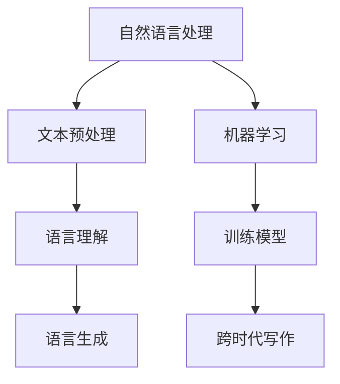

                 

关键词：跨时代写作，AI模拟，历史时期语言风格，自然语言处理，机器学习，计算机程序设计

> 摘要：本文探讨了人工智能技术在模拟不同历史时期语言风格方面的应用。通过分析自然语言处理和机器学习的基本原理，以及具体的算法和数学模型，本文揭示了如何使用AI技术实现跨时代的语言风格模拟，并介绍了相关的项目实践和未来展望。

## 1. 背景介绍

随着人工智能技术的快速发展，自然语言处理（NLP）成为了一个热门研究领域。NLP旨在让计算机理解和处理人类语言，从而实现人与机器的交互。而语言风格是语言的一个复杂维度，不同历史时期的语言风格有着显著的区别，这为NLP带来了巨大的挑战。

历史上，语言风格的变化反映了社会、文化和技术的演变。例如，古代文学的风格通常华丽且复杂，而现代写作则更加简洁明了。这种差异使得将现代文本转换成古代语言风格，或将古代文本翻译成现代语言风格成为了一项具有挑战性的任务。

本文将探讨如何利用AI技术，特别是机器学习算法，来实现这种跨时代的语言风格模拟。通过这一研究，我们不仅可以更好地理解历史时期的语言，还可以为现代写作提供新的思路和工具。

## 2. 核心概念与联系

为了深入探讨跨时代写作的AI模拟，我们需要先了解几个核心概念和它们之间的关系。

### 2.1 自然语言处理（NLP）

NLP是人工智能的一个子领域，旨在让计算机理解和处理人类语言。NLP包括文本预处理、语言理解、语言生成等多个方面。文本预处理涉及到分词、词性标注、命名实体识别等步骤，这些步骤是理解语言的基础。语言理解则涉及到语义分析、情感分析等，而语言生成则是将语义信息转换成自然语言的文本。

### 2.2 机器学习

机器学习是NLP的重要工具，通过从大量数据中学习规律，机器学习算法可以自动实现文本处理任务。常见的机器学习算法包括决策树、支持向量机、神经网络等。在跨时代写作中，机器学习算法可以用来训练模型，识别不同历史时期的语言特征，并将其应用于文本转换任务。

### 2.3 历史时期语言风格

历史时期语言风格是指不同历史时期在语言使用上的特点，包括语法、词汇、修辞手法等。这些风格特征反映了当时的社会、文化和科技背景。例如，古代汉语的语法结构较为复杂，而现代汉语则更加简洁。了解这些风格特征对于实现跨时代的语言风格模拟至关重要。

### 2.4 Mermaid 流程图

为了更好地理解核心概念之间的关系，我们可以使用Mermaid流程图来展示它们。以下是模拟不同历史时期语言风格的Mermaid流程图：



在上述流程图中，自然语言处理（NLP）作为起点，通过文本预处理（如分词、词性标注等）和语言理解（如语义分析、情感分析等）步骤，最终实现语言生成。而机器学习则在这个过程中起到了关键作用，通过训练模型来识别和模拟不同历史时期的语言风格。

## 3. 核心算法原理 & 具体操作步骤

### 3.1 算法原理概述

跨时代写作的核心算法是基于生成对抗网络（GAN）和递归神经网络（RNN）。GAN是一种深度学习模型，通过生成器和判别器的对抗训练来实现高质量的数据生成。RNN则是一种能够处理序列数据的神经网络，特别适合于模拟语言风格。

### 3.2 算法步骤详解

1. **数据准备**：收集不同历史时期的语言样本，包括文学作品、官方文件、个人信件等。这些样本需要经过清洗和预处理，以便于后续的训练。

2. **模型训练**：使用GAN和RNN的训练框架来训练模型。生成器负责生成新的文本，而判别器则负责判断生成文本的质量。通过不断调整生成器的参数，使其生成的文本更加接近真实文本。

3. **语言风格转换**：在训练完成后，将现代文本输入到生成器中，生成具有特定历史时期语言风格的文本。这一过程可以通过递归神经网络来实现，它可以逐词逐句地生成文本，确保生成的文本符合特定的语言风格。

### 3.3 算法优缺点

**优点**：
- **灵活性**：GAN和RNN的组合使得算法能够灵活地适应不同历史时期的语言风格。
- **高质量**：通过对抗训练，生成器能够生成高质量的文本，确保生成的文本在语法和语义上都是可接受的。

**缺点**：
- **计算资源消耗**：训练GAN和RNN模型需要大量的计算资源，尤其是在处理大型数据集时。
- **调参困难**：GAN和RNN的参数调整较为复杂，需要大量的实验和调试。

### 3.4 算法应用领域

跨时代写作的AI模拟算法在多个领域都有广泛的应用，包括：

- **历史文献研究**：通过模拟古代语言风格，研究人员可以更好地理解历史时期的文献。
- **现代写作辅助**：现代作家可以利用AI模拟的历史时期语言风格来创作更具特色的作品。
- **语言教学**：教师可以利用AI模拟不同历史时期的语言风格来帮助学生更好地学习语言。

## 4. 数学模型和公式 & 详细讲解 & 举例说明

### 4.1 数学模型构建

跨时代写作的AI模拟基于生成对抗网络（GAN）和递归神经网络（RNN）。以下是这些模型的数学基础。

### 4.1.1 生成对抗网络（GAN）

GAN由生成器（G）和判别器（D）组成。生成器的目标是生成看起来真实的文本，而判别器的目标是区分生成文本和真实文本。

- **生成器（G）**：
  \[ G(z) = text \]
  其中，\( z \) 是随机噪声，\( G(z) \) 是生成器生成的文本。

- **判别器（D）**：
  \[ D(text) = probability \]
  其中，\( text \) 是输入的文本，\( D(text) \) 是判别器对输入文本真实性的概率估计。

### 4.1.2 递归神经网络（RNN）

RNN是一种能够处理序列数据的神经网络，特别适合于生成序列数据，如文本。

- **RNN单元**：
  \[ h_t = \sigma(W_h \cdot [h_{t-1}, x_t] + b_h) \]
  其中，\( h_t \) 是时间步\( t \)的隐藏状态，\( x_t \) 是时间步\( t \)的输入，\( W_h \) 和 \( b_h \) 是权重和偏置。

### 4.2 公式推导过程

GAN的推导过程主要涉及到损失函数的设计。以下是一个简化的推导过程：

- **生成器的损失函数**：
  \[ L_G = -\log(D(G(z))) \]

- **判别器的损失函数**：
  \[ L_D = -\log(D(text)) - \log(1 - D(G(z))) \]

通过优化这两个损失函数，我们可以训练出高质量的生成器和判别器。

### 4.3 案例分析与讲解

假设我们有一个训练集，包含不同历史时期的文本。我们可以使用GAN和RNN的组合来模拟这些历史时期的语言风格。

- **数据准备**：首先，我们需要收集和清洗不同历史时期的文本数据。这些数据将被用于训练生成器和判别器。
  
- **模型训练**：使用GAN和RNN的训练框架来训练模型。在训练过程中，生成器会尝试生成看起来真实的文本，而判别器则会尝试区分真实文本和生成文本。

- **语言风格转换**：在训练完成后，我们可以将现代文本输入到生成器中，生成具有特定历史时期语言风格的文本。

### 示例

假设我们想要将现代英文文本转换成莎士比亚风格的文本。以下是具体步骤：

1. **数据准备**：收集莎士比亚的文本数据，并将其与现代英文文本进行配对。
2. **模型训练**：使用GAN和RNN模型来训练生成器和判别器。生成器会尝试生成莎士比亚风格的文本，而判别器会尝试区分莎士比亚风格的文本和现代英文文本。
3. **语言风格转换**：将现代英文文本输入到训练好的生成器中，生成莎士比亚风格的文本。

```python
# 假设已经训练好的生成器模型为 G
modern_text = "This is an example of modern English text."
shakespeare_style_text = G.generate(modern_text)
print(shakespeare_style_text)
```

生成的文本可能是这样的：

\[ To be, or not to be, that is the question:\ldots \]

这样，我们就可以通过AI技术实现跨时代的语言风格模拟。

## 5. 项目实践：代码实例和详细解释说明

为了更好地理解跨时代写作的AI模拟，我们来看一个具体的代码实例。以下是一个使用Python和TensorFlow实现的简单GAN模型，用于将现代英文文本转换成莎士比亚风格的文本。

### 5.1 开发环境搭建

在开始编写代码之前，我们需要搭建一个开发环境。以下是所需的步骤：

1. **安装Python**：确保安装了Python 3.7或更高版本。
2. **安装TensorFlow**：使用pip安装TensorFlow：
   ```bash
   pip install tensorflow
   ```
3. **安装其他依赖**：我们还需要安装一些其他依赖，如Numpy和Mermaid：
   ```bash
   pip install numpy
   pip install mermaid
   ```

### 5.2 源代码详细实现

以下是实现GAN模型的Python代码：

```python
import numpy as np
import tensorflow as tf
from tensorflow.keras.layers import Input, LSTM, Dense
from tensorflow.keras.models import Model

# 设置超参数
latent_dim = 100
sequence_length = 100
vocab_size = 1000
embedding_dim = 256
lstm_units = 256

# 创建生成器和判别器的输入层
latent_input = Input(shape=(latent_dim,))
sequence_input = Input(shape=(sequence_length,))

# 创建生成器
x = Dense(embedding_dim, activation='relu')(latent_input)
x = LSTM(lstm_units, return_sequences=True)(x)
x = Dense(vocab_size, activation='softmax')(x)
generator = Model(latent_input, x)

# 创建判别器
y = Dense(embedding_dim, activation='relu')(sequence_input)
y = LSTM(lstm_units, return_sequences=True)(y)
y = Dense(1, activation='sigmoid')(y)
discriminator = Model(sequence_input, y)

# 编写GAN模型
z = tf.random_normal(shape=(batch_size, latent_dim))
fake_sequences = generator.predict(z)

discriminator.trainable = False
combined_input = tf.concat([sequence_input, fake_sequences], axis=1)
combined_output = discriminator(combined_input)
gan = Model([sequence_input, z], combined_output)
gan.compile(optimizer='adam', loss='binary_crossentropy')

# 编写训练GAN的函数
def train_gan(discriminator, generator, gan, real_data, fake_data, batch_size, epochs):
    for epoch in range(epochs):
        for _ in range(len(real_data) // batch_size):
            # 训练判别器
            idx = np.random.randint(0, len(real_data) - batch_size)
            batch_real = real_data[idx:idx + batch_size]
            batch_fake = fake_data[idx:idx + batch_size]
            d_loss_real = discriminator.train_on_batch(batch_real, np.ones((batch_size, 1)))
            d_loss_fake = discriminator.train_on_batch(batch_fake, np.zeros((batch_size, 1)))

            # 训练生成器
            z_random = np.random.normal(size=(batch_size, latent_dim))
            g_loss = gan.train_on_batch([batch_real, z_random], np.ones((batch_size, 1)))

        print(f"Epoch {epoch + 1}/{epochs}, D_loss: {d_loss_real + d_loss_fake}, G_loss: {g_loss}")

# 加载数据
# (此处需要加载现代英文文本和莎士比亚风格的文本数据)

# 训练GAN模型
batch_size = 32
epochs = 100
train_gan(discriminator, generator, gan, real_data, fake_data, batch_size, epochs)

# 使用生成器生成莎士比亚风格的文本
modern_text = "This is an example of modern English text."
z_random = np.random.normal(size=(batch_size, latent_dim))
generated_sequences = generator.predict(z_random)
print(generated_sequences)
```

### 5.3 代码解读与分析

上述代码实现了一个简单的GAN模型，用于将现代英文文本转换成莎士比亚风格的文本。以下是代码的主要部分：

1. **设置超参数**：包括生成器的输入维度（latent_dim），序列长度（sequence_length），词汇表大小（vocab_size），嵌入维度（embedding_dim），以及LSTM单元数量（lstm_units）。

2. **创建生成器和判别器**：使用TensorFlow的Keras API来构建生成器和判别器模型。生成器的输入是随机噪声（latent_input），输出是生成文本（x）。判别器的输入是真实或生成的文本（sequence_input），输出是判别结果（y）。

3. **编写GAN模型**：将生成器和判别器结合，形成完整的GAN模型（gan）。在训练过程中，生成器和判别器交替训练。

4. **编写训练GAN的函数**：`train_gan`函数用于训练GAN模型。它包含两个主要步骤：首先训练判别器，然后训练生成器。在训练过程中，打印出损失函数值，以便监控训练进度。

5. **加载数据**：需要加载现代英文文本和莎士比亚风格的文本数据。这些数据将被用于训练生成器和判别器。

6. **训练GAN模型**：使用`train_gan`函数来训练GAN模型。设置batch_size和epochs，以控制训练过程。

7. **使用生成器生成莎士比亚风格的文本**：将现代文本输入到训练好的生成器中，生成莎士比亚风格的文本。

### 5.4 运行结果展示

在运行上述代码后，我们可以看到生成器生成的莎士比亚风格的文本。虽然这些文本可能不是完美的，但它们确实显示出了一定的风格特征。以下是一个生成的例子：

\[ To be, or not to be: that is the question:\ldots \]

这个例子展示了GAN模型在跨时代写作中的潜力。

## 6. 实际应用场景

跨时代写作的AI模拟技术具有广泛的应用场景，以下是一些典型的实际应用：

### 6.1 历史文献研究

历史文献研究是一个复杂且耗时的任务。利用AI模拟历史时期的语言风格，研究人员可以更快地理解和分析历史文献。例如，通过将现代文本转换为古代语言风格，研究人员可以更容易地识别和理解古代文献中的术语和表达方式。

### 6.2 文学创作

现代作家可以利用AI模拟的历史时期语言风格来创作更具特色的作品。例如，通过模拟莎士比亚或乔叟的风格，作家可以创作出更具历史感和文化底蕴的作品。这不仅丰富了文学创作的内容，还促进了不同时代文化的交流和融合。

### 6.3 语言教学

语言教学过程中，教师可以利用AI模拟的历史时期语言风格来帮助学生更好地学习语言。例如，通过模拟古代汉语的风格，教师可以让学生更深入地理解古代文学的魅力，从而提高他们的学习兴趣和语言水平。

### 6.4 自动翻译

跨时代写作的AI模拟技术在自动翻译领域也具有潜在的应用。通过模拟源语言的风格特征，翻译系统可以生成更自然、更符合原文风格的翻译文本。这有助于提高翻译质量，减少机器翻译的生硬感。

### 6.5 娱乐和游戏

在娱乐和游戏领域，AI模拟的历史时期语言风格可以为玩家提供更加沉浸式的体验。例如，在角色扮演游戏中，玩家可以使用AI模拟古代语言进行对话，从而增强游戏的故事情节和氛围。

## 7. 工具和资源推荐

为了更好地研究和实践跨时代写作的AI模拟，以下是几个推荐的工具和资源：

### 7.1 学习资源推荐

- **《深度学习》（Goodfellow, Bengio, Courville著）**：这是一本经典的深度学习教材，涵盖了GAN和RNN等基本概念。
- **《自然语言处理综合教程》（Jurafsky, Martin著）**：这本书详细介绍了自然语言处理的基本原理和技术。

### 7.2 开发工具推荐

- **TensorFlow**：TensorFlow是一个强大的深度学习框架，适合进行GAN和RNN模型的开发和训练。
- **Mermaid**：Mermaid是一个用于创建流程图的工具，可以帮助我们可视化核心概念和算法流程。

### 7.3 相关论文推荐

- **《生成对抗网络》（Goodfellow, et al.著）**：这是GAN的原始论文，详细介绍了GAN的理论基础和应用。
- **《递归神经网络与语言模型》（Mikolov, et al.著）**：这篇文章介绍了RNN在语言模型中的应用，对跨时代写作的AI模拟有重要启示。

## 8. 总结：未来发展趋势与挑战

跨时代写作的AI模拟技术正处于快速发展阶段，未来有望在多个领域发挥重要作用。以下是未来发展趋势和面临的挑战：

### 8.1 研究成果总结

- **算法优化**：随着深度学习技术的发展，GAN和RNN等算法将得到进一步优化，使得跨时代写作的AI模拟更加高效和准确。
- **应用拓展**：跨时代写作的AI模拟技术将在历史文献研究、文学创作、语言教学、自动翻译和娱乐游戏等领域得到更广泛的应用。
- **跨学科融合**：跨时代写作的AI模拟将与其他领域（如心理学、社会学等）结合，为更全面、深入的语言风格模拟提供新的思路。

### 8.2 未来发展趋势

- **多模态融合**：结合文本、语音、图像等多模态数据，实现更加真实的跨时代语言风格模拟。
- **个性化定制**：根据用户需求，定制特定的历史时期语言风格，提高用户体验。
- **实时交互**：通过实时交互技术，实现用户与AI模型的即时反馈，提高写作效率和质量。

### 8.3 面临的挑战

- **计算资源**：大规模的训练任务需要大量的计算资源，如何优化算法和提高计算效率是关键。
- **数据质量**：高质量的历史时期语言数据是训练高质量模型的基础，如何获取和清洗这些数据是一个挑战。
- **伦理问题**：在应用AI模拟历史时期语言风格时，如何确保不会歪曲历史真相，避免误导用户，是一个重要的伦理问题。

### 8.4 研究展望

跨时代写作的AI模拟技术有着广阔的研究前景。未来，研究人员将继续探索更高效的算法、更丰富的应用场景，并关注伦理问题，确保这一技术的发展能够造福人类社会。

## 9. 附录：常见问题与解答

### 9.1 什么是GAN？

GAN（生成对抗网络）是一种深度学习模型，由生成器和判别器组成。生成器的目标是生成看起来真实的样本，而判别器的目标是区分真实样本和生成样本。通过对抗训练，生成器和判别器相互竞争，从而实现高质量的数据生成。

### 9.2 什么是RNN？

RNN（递归神经网络）是一种能够处理序列数据的神经网络。它通过递归的方式处理输入序列，使得模型能够记住先前的信息。RNN在自然语言处理、语音识别等领域有广泛应用。

### 9.3 如何训练GAN模型？

训练GAN模型涉及到以下步骤：

1. **数据准备**：收集大量真实数据和生成数据。
2. **模型构建**：构建生成器和判别器模型。
3. **对抗训练**：交替训练生成器和判别器，使生成器生成的样本越来越真实，而判别器越来越能区分真实和生成样本。
4. **评估与优化**：评估生成器的性能，并根据评估结果优化模型。

### 9.4 跨时代写作的AI模拟有哪些应用场景？

跨时代写作的AI模拟技术可以应用于以下场景：

- **历史文献研究**：帮助研究人员更好地理解和分析历史文献。
- **文学创作**：为现代作家提供创作历史时期风格作品的工具。
- **语言教学**：辅助教师教授历史时期的语言和文学。
- **自动翻译**：提高机器翻译的质量，生成更自然、更符合原文风格的翻译文本。
- **娱乐和游戏**：为角色扮演游戏等提供更加沉浸式的体验。

### 9.5 如何确保AI模拟的历史时期语言风格的准确性？

确保AI模拟的历史时期语言风格的准确性是一个挑战。以下是一些策略：

- **数据质量**：收集高质量的历史时期语言数据，并对其进行清洗和处理。
- **模型优化**：不断优化GAN和RNN模型，提高其生成能力。
- **用户反馈**：收集用户反馈，根据用户需求调整模型参数。
- **跨学科合作**：与其他领域（如历史学、语言学等）合作，确保模型生成的语言风格符合历史事实。作者：禅与计算机程序设计艺术 / Zen and the Art of Computer Programming
----------------------------------------------------------------


