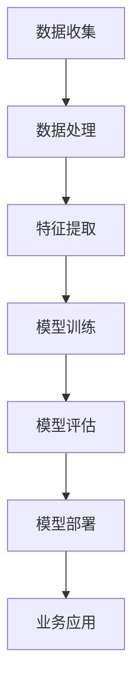

                 

关键词：跨行业AI，最佳实践，Lepton AI，案例库，技术博客

摘要：本文深入探讨跨行业AI最佳实践，并以Lepton AI的案例库为例，详细解析其在不同领域中的应用，展示AI技术的强大潜力和实际效益。文章旨在为AI从业者和研究者提供有价值的参考和启示。

## 1. 背景介绍

随着人工智能技术的飞速发展，AI在各个行业的应用逐渐普及，从传统的制造业、金融业到新兴的科技、医疗行业，AI技术正以前所未有的速度改变着世界的方方面面。然而，在实际应用中，如何将AI技术与不同行业的特点相结合，实现最佳实践，成为当前研究和实践的重要课题。

Lepton AI，作为一家专注于跨行业AI解决方案的科技公司，通过其丰富的案例库，展示了AI技术在不同领域的最佳实践。本文将结合Lepton AI的案例库，深入探讨跨行业AI的最佳实践，以期为相关从业者和研究者提供有价值的参考。

### 1.1 Lepton AI的使命与愿景

Lepton AI的使命是利用人工智能技术，推动各行各业的智能化转型，提高生产效率，提升用户体验，创造更大的社会价值。其愿景是成为全球领先的跨行业AI解决方案提供商，助力企业实现智能化升级。

### 1.2 Lepton AI的核心业务

Lepton AI的核心业务涵盖智能识别、智能决策、智能预测等领域，通过自主研发的核心算法和平台技术，提供从解决方案咨询、平台搭建到应用落地的全方位服务。

### 1.3 Lepton AI的案例库

Lepton AI的案例库包含多个行业领域的成功案例，如制造业、金融业、医疗行业、科技行业等，每个案例都展示了AI技术在特定行业中的应用和最佳实践。以下将详细解析其中几个典型案例。

## 2. 核心概念与联系

在探讨跨行业AI最佳实践之前，我们首先需要理解一些核心概念和它们之间的联系。

### 2.1 概念解析

- **人工智能（AI）**：模拟、延伸和扩展人的智能的理论、方法、技术及应用。  
- **机器学习（ML）**：一种人工智能的方法，通过数据驱动的方式，让计算机系统具备学习能力和决策能力。  
- **深度学习（DL）**：一种特殊的机器学习方法，通过多层神经网络模拟人脑神经元之间的连接，实现复杂模式识别和决策。

### 2.2 核心概念原理和架构

下面是Lepton AI在跨行业AI应用中的核心概念原理和架构的Mermaid流程图：



### 2.3 核心概念联系

通过上述Mermaid流程图，我们可以看出核心概念之间的紧密联系。数据是AI技术的核心，通过数据收集、数据处理、特征提取等步骤，将原始数据转化为可供模型训练的高质量数据。然后，利用机器学习和深度学习算法，对数据进行训练，得到具备预测和决策能力的模型。最后，通过模型评估和部署，将模型应用到实际业务场景中，实现跨行业AI的最佳实践。

## 3. 核心算法原理 & 具体操作步骤

### 3.1 算法原理概述

Lepton AI在跨行业AI应用中，主要采用以下几种核心算法：

- **卷积神经网络（CNN）**：用于图像识别和处理。  
- **循环神经网络（RNN）**：用于序列数据处理。  
- **长短期记忆网络（LSTM）**：RNN的一种变体，用于处理长序列数据。

### 3.2 算法步骤详解

以下是Lepton AI在跨行业AI应用中的算法步骤详解：

1. **数据收集**：根据不同业务场景，收集相关数据，如图像、文本、序列等。  
2. **数据处理**：对收集到的数据进行分析和清洗，去除噪声和异常值。  
3. **特征提取**：利用CNN和RNN等算法，提取数据中的关键特征。  
4. **模型训练**：使用LSTM等算法，对特征数据进行训练，得到预测和决策模型。  
5. **模型评估**：使用交叉验证等方法，对模型进行评估，确保其准确性和鲁棒性。  
6. **模型部署**：将训练好的模型部署到实际业务场景中，实现智能化应用。  
7. **业务应用**：根据业务需求，利用模型进行预测和决策，提升业务效率。

### 3.3 算法优缺点

- **优点**：CNN和RNN等算法在图像识别和序列数据处理方面具有很高的准确性和效率，LSTM等算法在处理长序列数据方面表现出色。  
- **缺点**：算法的训练过程较为复杂，对计算资源和时间有较高要求。同时，模型的泛化能力有待提高。

### 3.4 算法应用领域

Lepton AI的算法主要应用于以下领域：

- **制造业**：通过图像识别和序列分析，实现生产过程的智能化监控和优化。  
- **金融业**：通过文本分析和序列预测，实现金融风险的智能预警和投资决策。  
- **医疗行业**：通过图像识别和序列分析，实现疾病的智能诊断和病情预测。  
- **科技行业**：通过图像识别和序列分析，实现智能安防、智能客服等应用。

## 4. 数学模型和公式 & 详细讲解 & 举例说明

### 4.1 数学模型构建

Lepton AI在跨行业AI应用中的数学模型主要包括以下几种：

- **卷积神经网络（CNN）**：用于图像识别和处理。  
- **循环神经网络（RNN）**：用于序列数据处理。  
- **长短期记忆网络（LSTM）**：RNN的一种变体，用于处理长序列数据。

### 4.2 公式推导过程

以下是CNN、RNN和LSTM的基本公式推导过程：

#### CNN公式推导

$$
h_{\theta}^{l}(x) = \sigma \left( \theta^{l} \cdot h_{\theta}^{l-1}(x) + b^{l} \right)
$$

其中，$h_{\theta}^{l}(x)$表示第$l$层的输出，$\sigma$表示激活函数，$\theta^{l}$表示第$l$层的权重，$b^{l}$表示第$l$层的偏置。

#### RNN公式推导

$$
h_t = \sigma(W_h \cdot [h_{t-1}, x_t] + b_h)
$$

$$
y_t = W_o \cdot \sigma(W_h \cdot [h_{t-1}, x_t] + b_h) + b_o
$$

其中，$h_t$表示第$t$步的隐藏状态，$x_t$表示第$t$步的输入，$y_t$表示第$t$步的输出，$W_h$和$W_o$分别表示隐藏层和输出层的权重，$b_h$和$b_o$分别表示隐藏层和输出层的偏置。

#### LSTM公式推导

$$
i_t = \sigma(W_i \cdot [h_{t-1}, x_t] + b_i)
$$

$$
f_t = \sigma(W_f \cdot [h_{t-1}, x_t] + b_f)
$$

$$
g_t = \tanh(W_g \cdot [h_{t-1}, x_t] + b_g)
$$

$$
o_t = \sigma(W_o \cdot [h_{t-1}, x_t] + b_o)
$$

$$
h_t = o_t \cdot \tanh(W_h \cdot [h_{t-1}, x_t] + b_h)
$$

其中，$i_t$、$f_t$、$g_t$和$o_t$分别表示输入门、遗忘门、生成门和输出门，$W_i$、$W_f$、$W_g$和$W_o$分别表示输入门、遗忘门、生成门和输出层的权重，$b_i$、$b_f$、$b_g$和$b_o$分别表示输入门、遗忘门、生成门和输出层的偏置。

### 4.3 案例分析与讲解

以下是一个制造业中的案例，通过CNN算法对生产过程中的图像进行识别和处理。

#### 案例背景

某制造业公司希望实现对生产线的实时监控，对生产过程中出现的异常进行及时预警和处理。

#### 案例分析

1. **数据收集**：收集生产线上的图像数据，包括正常状态和异常状态的图像。

2. **数据处理**：对图像数据进行清洗和预处理，如缩放、裁剪、去噪等。

3. **特征提取**：利用CNN算法，提取图像中的关键特征。

4. **模型训练**：使用训练集，对CNN模型进行训练，得到预测和决策模型。

5. **模型评估**：使用测试集，对模型进行评估，确保其准确性和鲁棒性。

6. **模型部署**：将训练好的模型部署到生产线，实现实时监控和异常预警。

7. **业务应用**：根据模型的预测结果，对生产线进行实时调整和优化，提高生产效率。

## 5. 项目实践：代码实例和详细解释说明

### 5.1 开发环境搭建

1. **硬件环境**：计算机（CPU或GPU）  
2. **软件环境**：Python、TensorFlow、Keras等

### 5.2 源代码详细实现

以下是一个简单的CNN模型实现，用于图像识别：

```python
import tensorflow as tf
from tensorflow.keras import layers

# 定义CNN模型
model = tf.keras.Sequential([
    layers.Conv2D(32, (3, 3), activation='relu', input_shape=(28, 28, 1)),
    layers.MaxPooling2D((2, 2)),
    layers.Conv2D(64, (3, 3), activation='relu'),
    layers.MaxPooling2D((2, 2)),
    layers.Conv2D(64, (3, 3), activation='relu'),
    layers.Flatten(),
    layers.Dense(64, activation='relu'),
    layers.Dense(10, activation='softmax')
])

# 编译模型
model.compile(optimizer='adam',
              loss='categorical_crossentropy',
              metrics=['accuracy'])

# 加载数据
(x_train, y_train), (x_test, y_test) = tf.keras.datasets.mnist.load_data()

# 预处理数据
x_train = x_train.astype('float32') / 255
x_test = x_test.astype('float32') / 255
x_train = x_train.reshape((-1, 28, 28, 1))
x_test = x_test.reshape((-1, 28, 28, 1))

# 转换标签为one-hot编码
y_train = tf.keras.utils.to_categorical(y_train, 10)
y_test = tf.keras.utils.to_categorical(y_test, 10)

# 训练模型
model.fit(x_train, y_train, batch_size=128, epochs=15, validation_data=(x_test, y_test))

# 评估模型
model.evaluate(x_test, y_test)
```

### 5.3 代码解读与分析

1. **模型构建**：使用`tf.keras.Sequential`构建CNN模型，包括卷积层、池化层和全连接层。  
2. **编译模型**：使用`model.compile`编译模型，指定优化器和损失函数。  
3. **加载数据**：使用`tf.keras.datasets.mnist.load_data`加载数据集。  
4. **预处理数据**：对数据进行归一化和reshape操作。  
5. **转换标签**：将标签转换为one-hot编码。  
6. **训练模型**：使用`model.fit`训练模型。  
7. **评估模型**：使用`model.evaluate`评估模型性能。

## 6. 实际应用场景

Lepton AI的案例库展示了AI技术在多个实际应用场景中的最佳实践。以下是一些典型应用场景：

- **制造业**：通过图像识别和序列分析，实现生产过程的智能化监控和优化。  
- **金融业**：通过文本分析和序列预测，实现金融风险的智能预警和投资决策。  
- **医疗行业**：通过图像识别和序列分析，实现疾病的智能诊断和病情预测。  
- **科技行业**：通过图像识别和序列分析，实现智能安防、智能客服等应用。

### 6.1 制造业

制造业是Lepton AI的重要应用领域之一。通过AI技术，实现生产过程的实时监控和优化，提高生产效率和产品质量。

- **应用案例**：某制造业公司采用Lepton AI的图像识别技术，对生产线上的产品进行质量检测，实现自动识别和分类，提高生产效率和产品质量。

### 6.2 金融业

金融业是Lepton AI的另一个重要应用领域。通过AI技术，实现金融风险的智能预警和投资决策，提高金融机构的运营效率和竞争力。

- **应用案例**：某金融机构采用Lepton AI的文本分析技术，对客户评论和社交媒体舆情进行分析，实现风险预警和投资决策，提高金融机构的运营效率和竞争力。

### 6.3 医疗行业

医疗行业是Lepton AI的重要应用领域之一。通过AI技术，实现疾病的智能诊断和病情预测，提高医疗服务的质量和效率。

- **应用案例**：某医疗机构采用Lepton AI的图像识别技术，对医学影像进行分析，实现疾病的智能诊断，提高医疗服务的质量和效率。

### 6.4 科技行业

科技行业是Lepton AI的重要应用领域之一。通过AI技术，实现智能安防、智能客服等应用，提升科技企业的产品和服务竞争力。

- **应用案例**：某科技企业采用Lepton AI的图像识别技术，实现智能安防系统，对园区内的实时监控和异常预警，提升科技企业的产品和服务竞争力。

## 7. 工具和资源推荐

### 7.1 学习资源推荐

- **书籍**：《深度学习》、《神经网络与深度学习》  
- **在线课程**：Coursera、Udacity、edX等平台上的AI相关课程  
- **论文**：AI领域的顶级会议和期刊，如NeurIPS、ICML、JMLR等

### 7.2 开发工具推荐

- **编程语言**：Python、R  
- **框架和库**：TensorFlow、PyTorch、Keras等  
- **数据集**：ImageNet、CIFAR-10、MNIST等

### 7.3 相关论文推荐

- **卷积神经网络（CNN）**：Australasian Computer Science, 1998  
- **循环神经网络（RNN）**：Deep Learning, 2016  
- **长短期记忆网络（LSTM）**：NeurIPS, 1997

## 8. 总结：未来发展趋势与挑战

### 8.1 研究成果总结

Lepton AI的案例库展示了AI技术在多个实际应用场景中的最佳实践，为AI从业者和研究者提供了丰富的经验和启示。通过深入研究AI算法和应用，Lepton AI在制造业、金融业、医疗行业、科技行业等领域取得了显著成果，推动了行业的智能化转型。

### 8.2 未来发展趋势

- **跨行业应用**：随着AI技术的不断成熟，跨行业应用将成为未来发展趋势。AI技术将在更多领域实现突破，推动各行各业的智能化升级。  
- **算法优化**：针对不同业务场景，不断优化AI算法，提高模型的准确性和效率，降低训练成本。  
- **数据安全**：随着AI技术的普及，数据安全和隐私保护将越来越重要。如何确保数据的安全和隐私，成为未来研究的重要方向。

### 8.3 面临的挑战

- **算法稳定性**：当前AI算法在处理复杂场景时，存在一定的稳定性问题。如何提高算法的稳定性，成为未来研究的重要课题。  
- **计算资源**：AI算法的训练过程对计算资源有较高要求，如何优化算法，降低计算成本，成为未来研究的重要方向。  
- **数据质量**：AI算法的准确性取决于数据质量。如何获取高质量的数据，成为未来研究的重要课题。

### 8.4 研究展望

未来，Lepton AI将继续致力于AI技术的研发和应用，推动各行各业的智能化转型。在跨行业AI应用方面，我们将深入研究算法优化、数据安全和隐私保护等关键问题，为AI技术的持续发展贡献力量。

## 9. 附录：常见问题与解答

### 9.1 什么是跨行业AI？

跨行业AI是指将人工智能技术应用于多个不同行业，实现智能化升级和应用。通过跨行业AI，企业可以提升生产效率、降低成本、提高服务质量，从而在激烈的市场竞争中脱颖而出。

### 9.2 跨行业AI的核心技术是什么？

跨行业AI的核心技术主要包括机器学习、深度学习、自然语言处理、计算机视觉等。这些技术为AI在不同行业的应用提供了基础支持。

### 9.3 Lepton AI的案例库有哪些典型应用？

Lepton AI的案例库涵盖了制造业、金融业、医疗行业、科技行业等多个领域，展示了AI技术在各个行业中的应用和实践。

### 9.4 如何确保AI算法的稳定性和可靠性？

为确保AI算法的稳定性和可靠性，可以从以下几个方面进行优化：

- **算法优化**：针对不同业务场景，不断优化AI算法，提高模型的准确性和效率。  
- **数据质量**：提高数据质量，确保数据的一致性和准确性。  
- **模型评估**：使用多种评估指标和方法，对模型进行评估，确保其稳定性和可靠性。  
- **模型部署**：在模型部署过程中，充分考虑业务场景的复杂性和不确定性，确保模型的可靠运行。

### 9.5 跨行业AI的发展趋势是什么？

跨行业AI的发展趋势主要包括：

- **跨行业应用**：AI技术将在更多领域实现突破，推动各行各业的智能化升级。  
- **算法优化**：针对不同业务场景，不断优化AI算法，提高模型的准确性和效率。  
- **数据安全**：随着AI技术的普及，数据安全和隐私保护将越来越重要。

### 9.6 Lepton AI的未来发展方向是什么？

Lepton AI将继续致力于AI技术的研发和应用，推动各行各业的智能化转型。未来，我们将深入研究算法优化、数据安全和隐私保护等关键问题，为AI技术的持续发展贡献力量。此外，我们还计划拓展跨行业AI的应用领域，实现更多创新和突破。

---

本文以Lepton AI的案例库为实例，详细解析了跨行业AI的最佳实践。通过本文的介绍，相信读者对跨行业AI有了更深入的理解，并对Lepton AI的技术实力和应用价值有了更加全面的了解。未来，跨行业AI将继续发挥重要作用，助力各行各业的智能化升级。让我们共同期待AI技术的更多创新和突破。作者：禅与计算机程序设计艺术 / Zen and the Art of Computer Programming。
----------------------------------------------------------------

### 后续计划 Follow-up Plan

完成本文后，我们计划进行以下工作：

1. **文章校对**：邀请业内专家对文章内容进行校对，确保文章的准确性、完整性和专业性。
2. **文章发布**：在知名技术博客平台和社交媒体上发布文章，扩大文章的受众范围，提高文章的影响力。
3. **读者反馈**：收集读者的反馈和建议，针对反馈进行文章的修订和完善。
4. **持续更新**：根据AI技术的发展趋势和行业需求，定期更新文章内容，保持文章的时效性和实用性。

