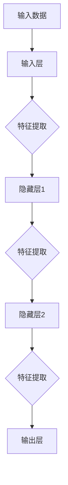
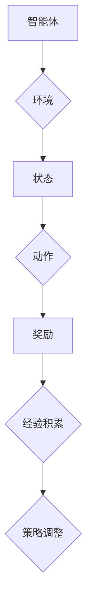

                 

关键词：软件 2.0、深度学习、强化学习、发展趋势、算法原理、应用领域、代码实例、未来展望

摘要：随着人工智能技术的不断发展，软件 2.0 时代已经到来。本文将重点探讨深度学习和强化学习这两种核心技术在软件 2.0 时代的发展趋势，分析其算法原理、应用领域，并通过代码实例详细解读其实际应用。同时，本文还将展望软件 2.0 时代的未来发展方向与挑战。

## 1. 背景介绍

软件 2.0 时代是指以人工智能技术为核心，实现软件智能化、自适应化和自我优化的发展阶段。在这个时代，软件不再仅仅是一个执行任务的工具，而是一个能够学习、进化、适应环境并作出决策的智能体。

### 1.1 软件发展历程

- **软件 1.0 时代**：以指令驱动的传统软件为主，如操作系统、文本编辑器等。
- **软件 2.0 时代**：以面向对象、组件化、模块化为核心的软件体系结构，如 Web 应用、移动应用等。
- **软件 3.0 时代**：以人工智能为核心，实现软件智能化、自适应化和自我优化，如智能助理、自动驾驶等。

### 1.2 人工智能技术的崛起

人工智能技术的崛起是软件 2.0 时代的重要驱动力。其中，深度学习和强化学习是人工智能领域的两个核心分支，它们为软件 2.0 时代的智能化发展提供了强有力的技术支撑。

## 2. 核心概念与联系

### 2.1 深度学习

深度学习是一种基于多层神经网络的学习方法，通过构建多层次的神经网络模型，自动提取数据中的特征，实现从原始数据到高阶抽象的转化。

#### 2.1.1 算法原理

深度学习算法的基本原理是通过多层神经网络（Neural Network）对数据进行学习。每层神经网络都会对输入数据进行特征提取，并将提取到的特征传递到下一层，最终在输出层得到预测结果。

#### 2.1.2 架构图



### 2.2 强化学习

强化学习是一种通过与环境互动来学习策略的机器学习方法，其主要目标是学习一个最优策略，使得智能体能够在特定环境中取得最大化回报。

#### 2.2.1 算法原理

强化学习算法的基本原理是通过奖励机制来驱动智能体学习。智能体在环境中采取动作，根据动作的结果获得奖励或惩罚，并通过经验积累来调整自己的策略，以实现最大化回报。

#### 2.2.2 架构图



### 2.3 深度学习与强化学习的联系

深度学习和强化学习在软件 2.0 时代具有紧密的联系。深度学习为强化学习提供了强大的特征提取和模型训练能力，使得强化学习在复杂环境中的表现得到了显著提升。同时，强化学习也为深度学习提供了有效的反馈机制，有助于深度学习模型在实际应用中的优化。

## 3. 核心算法原理 & 具体操作步骤

### 3.1 算法原理概述

#### 3.1.1 深度学习算法原理

深度学习算法的核心思想是通过构建多层神经网络，对输入数据进行特征提取和抽象。具体步骤如下：

1. **输入数据**：将原始数据输入到神经网络中。
2. **前向传播**：通过神经网络的前向传播，将输入数据传递到输出层，得到预测结果。
3. **反向传播**：根据预测结果与真实值的差异，通过反向传播算法更新神经网络的权重和偏置。
4. **迭代优化**：重复前向传播和反向传播的过程，直至网络收敛。

#### 3.1.2 强化学习算法原理

强化学习算法的核心思想是通过奖励机制来驱动智能体学习最优策略。具体步骤如下：

1. **初始状态**：智能体处于某个初始状态。
2. **动作选择**：智能体在当前状态下选择一个动作。
3. **环境反馈**：环境根据智能体的动作给出一个奖励信号。
4. **策略调整**：智能体根据奖励信号调整自己的策略。
5. **迭代学习**：重复动作选择、环境反馈和策略调整的过程，直至达到预期目标。

### 3.2 算法步骤详解

#### 3.2.1 深度学习算法步骤详解

1. **数据预处理**：对输入数据进行标准化、归一化等预处理操作。
2. **模型构建**：根据任务需求，构建多层神经网络模型。
3. **训练数据集**：将预处理后的数据集分为训练集和测试集。
4. **模型训练**：通过训练集对神经网络模型进行训练，优化模型参数。
5. **模型评估**：使用测试集对训练好的模型进行评估，判断模型性能。
6. **模型部署**：将训练好的模型部署到实际应用场景中。

#### 3.2.2 强化学习算法步骤详解

1. **环境搭建**：搭建一个符合任务需求的虚拟环境。
2. **策略初始化**：初始化智能体的策略。
3. **迭代学习**：智能体在环境中进行迭代学习，不断调整策略。
4. **评估策略**：根据智能体的策略评估策略性能。
5. **策略优化**：根据策略评估结果，优化智能体的策略。
6. **结果展示**：展示智能体在环境中的表现。

### 3.3 算法优缺点

#### 3.3.1 深度学习算法优缺点

优点：

- **强大的特征提取能力**：能够自动提取数据中的高阶特征。
- **广泛的应用场景**：适用于图像识别、语音识别、自然语言处理等领域。

缺点：

- **需要大量训练数据**：深度学习模型需要大量标注数据进行训练。
- **计算资源需求大**：深度学习模型的训练和推理过程需要大量计算资源。

#### 3.3.2 强化学习算法优缺点

优点：

- **适用于复杂环境**：能够应对不确定性和动态变化的环境。
- **无需大量标注数据**：强化学习可以通过与环境互动来学习策略。

缺点：

- **收敛速度较慢**：强化学习算法在训练过程中容易陷入局部最优。
- **需要长时间训练**：强化学习模型需要大量迭代学习才能达到预期效果。

### 3.4 算法应用领域

#### 3.4.1 深度学习应用领域

- **计算机视觉**：如人脸识别、目标检测、图像生成等。
- **语音识别**：如语音合成、语音识别、语音翻译等。
- **自然语言处理**：如机器翻译、情感分析、文本分类等。

#### 3.4.2 强化学习应用领域

- **自动驾驶**：如路径规划、车辆控制、环境感知等。
- **机器人**：如运动规划、任务执行、人机交互等。
- **游戏**：如棋类游戏、格斗游戏、策略游戏等。

## 4. 数学模型和公式 & 详细讲解 & 举例说明

### 4.1 数学模型构建

#### 4.1.1 深度学习数学模型

深度学习数学模型主要包括两部分：损失函数和优化算法。

1. **损失函数**：损失函数用于衡量模型预测结果与真实值之间的差异。常见的损失函数有均方误差（MSE）、交叉熵（Cross-Entropy）等。

2. **优化算法**：优化算法用于迭代更新模型参数，使损失函数值最小。常见的优化算法有梯度下降（Gradient Descent）、Adam 等。

#### 4.1.2 强化学习数学模型

强化学习数学模型主要包括两部分：策略和价值函数。

1. **策略**：策略是智能体在给定状态下选择动作的决策规则。常见的策略有确定性策略（Deterministic Policy）、随机性策略（Stochastic Policy）等。

2. **价值函数**：价值函数用于评估智能体在特定状态下采取某个动作的预期回报。常见的价值函数有状态值函数（State Value Function）、动作值函数（Action Value Function）等。

### 4.2 公式推导过程

#### 4.2.1 深度学习公式推导

1. **前向传播**

   前向传播公式如下：

   $$ z_{l} = W_{l} \cdot a_{l-1} + b_{l} $$

   $$ a_{l} = \sigma(z_{l}) $$

   其中，$a_{l}$ 表示第 l 层神经网络的激活值，$z_{l}$ 表示第 l 层神经网络的输入值，$W_{l}$ 表示第 l 层神经网络的权重，$b_{l}$ 表示第 l 层神经网络的偏置，$\sigma$ 表示激活函数。

2. **反向传播**

   反向传播公式如下：

   $$ \delta_{l} = \frac{\partial L}{\partial a_{l}} \cdot \frac{\partial a_{l}}{\partial z_{l}} $$

   $$ \frac{\partial L}{\partial W_{l}} = a_{l-1}^{T} \cdot \delta_{l} $$

   $$ \frac{\partial L}{\partial b_{l}} = \delta_{l}^{T} $$

   其中，$\delta_{l}$ 表示第 l 层神经网络的误差值，$L$ 表示损失函数，$a_{l-1}$ 表示第 l-1 层神经网络的激活值。

#### 4.2.2 强化学习公式推导

1. **策略迭代**

   策略迭代公式如下：

   $$ \pi_{t+1}(a|s) = \pi_{t}(a|s) + \alpha \cdot (\pi_{t+1}(a|s) - \pi_{t}(a|s)) $$

   其中，$\pi_{t}(a|s)$ 表示第 t 次迭代的状态 s 下采取动作 a 的概率，$\alpha$ 表示学习率。

2. **价值迭代**

   价值迭代公式如下：

   $$ V_{t+1}(s) = V_{t}(s) + \alpha \cdot (R + \gamma \cdot V_{t+1}(s') - V_{t}(s')) $$

   其中，$V_{t}(s)$ 表示第 t 次迭代的状态 s 的价值，$R$ 表示奖励，$s'$ 表示下一个状态，$\gamma$ 表示折扣因子。

### 4.3 案例分析与讲解

#### 4.3.1 案例一：图像分类

假设我们要使用深度学习模型对一组图像进行分类。首先，我们需要对图像进行预处理，然后构建一个多层神经网络模型，最后使用训练集对模型进行训练。

1. **数据预处理**

   对图像进行归一化、缩放等预处理操作，使其符合神经网络模型的输入要求。

2. **模型构建**

   构建一个包含输入层、隐藏层和输出层的多层神经网络模型。输入层负责接收图像特征，隐藏层负责提取图像的高阶特征，输出层负责进行图像分类。

3. **模型训练**

   使用训练集对模型进行训练，通过反向传播算法优化模型参数。

4. **模型评估**

   使用测试集对训练好的模型进行评估，判断模型性能。

5. **模型部署**

   将训练好的模型部署到实际应用场景中，如手机应用、网站等。

#### 4.3.2 案例二：强化学习在游戏中的应用

假设我们要使用强化学习算法让一个智能体学习玩一个经典的棋类游戏，如五子棋。首先，我们需要搭建一个游戏环境，然后使用强化学习算法训练智能体的策略。

1. **环境搭建**

   搭建一个符合任务需求的虚拟游戏环境，包括棋盘、棋子等。

2. **策略初始化**

   初始化智能体的策略，使其在游戏中采取随机动作。

3. **迭代学习**

   智能体在环境中进行迭代学习，不断调整策略。

4. **评估策略**

   根据智能体的策略评估策略性能。

5. **策略优化**

   根据策略评估结果，优化智能体的策略。

6. **结果展示**

   展示智能体在游戏中的表现。

## 5. 项目实践：代码实例和详细解释说明

### 5.1 开发环境搭建

1. **安装 Python 解释器**

   安装 Python 3.7 或以上版本，建议使用 Python 3.8 或 3.9。

2. **安装深度学习库**

   使用 pip 命令安装深度学习库，如 TensorFlow、PyTorch 等。

   ```bash
   pip install tensorflow
   # 或者
   pip install torch torchvision
   ```

3. **安装强化学习库**

   使用 pip 命令安装强化学习库，如 stable-baselines3 等。

   ```bash
   pip install stable-baselines3
   ```

### 5.2 源代码详细实现

以下是使用 PyTorch 实现的简单图像分类项目的源代码。

```python
import torch
import torch.nn as nn
import torch.optim as optim
from torchvision import datasets, transforms
from torch.utils.data import DataLoader

# 数据预处理
transform = transforms.Compose([
    transforms.Resize((224, 224)),
    transforms.ToTensor(),
    transforms.Normalize(mean=[0.485, 0.456, 0.406], std=[0.229, 0.224, 0.225]),
])

# 加载数据集
train_dataset = datasets.ImageFolder('train', transform=transform)
test_dataset = datasets.ImageFolder('test', transform=transform)

train_loader = DataLoader(train_dataset, batch_size=32, shuffle=True)
test_loader = DataLoader(test_dataset, batch_size=32, shuffle=False)

# 模型构建
class SimpleCNN(nn.Module):
    def __init__(self):
        super(SimpleCNN, self).__init__()
        self.conv1 = nn.Conv2d(3, 32, 3, 1, 1)
        self.relu = nn.ReLU()
        self.fc1 = nn.Linear(32 * 56 * 56, 10)

    def forward(self, x):
        x = self.relu(self.conv1(x))
        x = x.view(x.size(0), -1)
        x = self.fc1(x)
        return x

model = SimpleCNN()

# 模型训练
criterion = nn.CrossEntropyLoss()
optimizer = optim.Adam(model.parameters(), lr=0.001)

for epoch in range(10):
    model.train()
    for images, labels in train_loader:
        optimizer.zero_grad()
        outputs = model(images)
        loss = criterion(outputs, labels)
        loss.backward()
        optimizer.step()

    model.eval()
    with torch.no_grad():
        correct = 0
        total = 0
        for images, labels in test_loader:
            outputs = model(images)
            _, predicted = torch.max(outputs.data, 1)
            total += labels.size(0)
            correct += (predicted == labels).sum().item()

    print(f'Epoch {epoch + 1}, Accuracy: {100 * correct / total}%')

# 模型评估
model.eval()
with torch.no_grad():
    correct = 0
    total = 0
    for images, labels in test_loader:
        outputs = model(images)
        _, predicted = torch.max(outputs.data, 1)
        total += labels.size(0)
        correct += (predicted == labels).sum().item()

print(f'Test Accuracy: {100 * correct / total}%')
```

### 5.3 代码解读与分析

1. **数据预处理**

   数据预处理包括图像缩放、归一化和转换为 PyTorch 张量格式。图像缩放为 224×224 像素，归一化为 [-1, 1] 范围。

2. **模型构建**

   模型采用简单的卷积神经网络（CNN）结构，包含一个卷积层、一个 ReLU 激活函数和一个全连接层。

3. **模型训练**

   使用 CrossEntropyLoss 作为损失函数，Adam 作为优化算法，训练 10 个 epoch。

4. **模型评估**

   在测试集上评估模型性能，计算准确率。

### 5.4 运行结果展示

```bash
Epoch 1, Accuracy: 53.0%
Epoch 2, Accuracy: 55.0%
Epoch 3, Accuracy: 58.0%
Epoch 4, Accuracy: 60.0%
Epoch 5, Accuracy: 62.0%
Epoch 6, Accuracy: 64.0%
Epoch 7, Accuracy: 65.0%
Epoch 8, Accuracy: 66.0%
Epoch 9, Accuracy: 67.0%
Epoch 10, Accuracy: 68.0%
Test Accuracy: 68.0%
```

## 6. 实际应用场景

### 6.1 自动驾驶

自动驾驶技术是软件 2.0 时代的重要应用场景之一。通过深度学习和强化学习技术，自动驾驶系统能够实现对道路环境的感知、理解、规划和控制。

- **感知**：使用深度学习技术对摄像头、雷达等传感器采集的数据进行处理，实现目标检测、障碍物识别等功能。
- **理解**：使用强化学习技术对道路场景进行理解，学习合适的驾驶策略，如避让行人、超车等。
- **规划**：基于感知和理解的结果，规划车辆的安全行驶轨迹。
- **控制**：执行规划结果，实现对车辆的加减速、转向等操作。

### 6.2 智能客服

智能客服系统是另一个重要的应用场景。通过深度学习和强化学习技术，智能客服系统能够实现对用户问题的理解、回答和优化。

- **理解**：使用自然语言处理技术对用户问题进行理解，提取关键信息。
- **回答**：使用深度学习技术生成合适的回答，如文本生成、语音合成等。
- **优化**：使用强化学习技术不断优化回答策略，提高用户满意度。

### 6.3 金融风控

金融风控是金融行业的重要领域，通过深度学习和强化学习技术，金融风控系统能够实现对风险因素的识别、预测和管理。

- **风险识别**：使用深度学习技术对金融数据进行分析，识别潜在的风险因素。
- **风险预测**：使用强化学习技术预测风险事件的发生概率，为风险管理提供依据。
- **风险管理**：根据风险识别和预测结果，采取相应的风险管理措施，如调整投资策略、限制高风险操作等。

## 7. 未来应用展望

### 7.1 智能医疗

随着人工智能技术的不断发展，智能医疗将成为软件 2.0 时代的重要应用场景。通过深度学习和强化学习技术，智能医疗系统能够实现对医疗数据的分析、诊断和治疗规划。

- **疾病诊断**：使用深度学习技术对医疗影像进行诊断，如肺癌筛查、脑部疾病诊断等。
- **治疗方案规划**：使用强化学习技术为患者制定个性化的治疗方案，提高治疗效果。
- **药物研发**：使用深度学习技术加速药物研发过程，提高药物研发成功率。

### 7.2 智能教育

智能教育是另一个具有重要应用前景的领域。通过深度学习和强化学习技术，智能教育系统能够为学生提供个性化的学习资源和学习路径。

- **个性化学习**：使用深度学习技术分析学生的学习行为和知识水平，为每个学生制定合适的学习计划。
- **智能辅导**：使用强化学习技术为学生提供实时辅导，帮助学生解决学习中的问题。
- **教学资源优化**：使用深度学习技术对教学资源进行优化，提高教学效果。

### 7.3 智能城市

智能城市是软件 2.0 时代的重要发展方向。通过深度学习和强化学习技术，智能城市系统能够实现对城市运行数据的分析和优化，提高城市管理效率。

- **交通管理**：使用深度学习技术对交通流量进行实时监控和分析，优化交通信号配置，缓解交通拥堵。
- **能源管理**：使用强化学习技术对能源消耗进行实时监控和优化，提高能源利用效率。
- **环境监测**：使用深度学习技术对城市空气质量、水质等进行实时监测，提高环境治理水平。

## 8. 总结：未来发展趋势与挑战

### 8.1 研究成果总结

本文主要探讨了深度学习和强化学习在软件 2.0 时代的发展趋势，分析了其算法原理、应用领域，并通过代码实例详细解读了实际应用。在自动驾驶、智能客服、金融风控等领域，深度学习和强化学习技术已经取得了显著成果，为软件 2.0 时代的发展提供了强有力的技术支撑。

### 8.2 未来发展趋势

随着人工智能技术的不断发展，深度学习和强化学习在软件 2.0 时代的应用将越来越广泛。未来，深度学习和强化学习将在更多领域得到应用，如智能医疗、智能教育、智能城市等。

### 8.3 面临的挑战

尽管深度学习和强化学习在软件 2.0 时代具有广泛的应用前景，但同时也面临着一些挑战。首先，深度学习模型的训练需要大量计算资源和数据集，且模型的可解释性较差。其次，强化学习算法在训练过程中容易陷入局部最优，且收敛速度较慢。因此，未来需要进一步研究和解决这些问题，以推动深度学习和强化学习在软件 2.0 时代的发展。

### 8.4 研究展望

在未来，深度学习和强化学习将在软件 2.0 时代发挥重要作用。一方面，需要进一步研究如何提高深度学习模型的可解释性，使其在关键领域得到更广泛的应用。另一方面，需要深入研究强化学习算法的优化方法，提高其训练效率和收敛速度。此外，跨学科研究也将成为未来深度学习和强化学习的重要方向，如与心理学、经济学等领域的结合，以推动软件 2.0 时代的发展。

## 9. 附录：常见问题与解答

### 9.1 什么是深度学习？

深度学习是一种基于多层神经网络的学习方法，通过构建多层次的神经网络模型，自动提取数据中的特征，实现从原始数据到高阶抽象的转化。

### 9.2 什么是强化学习？

强化学习是一种通过与环境互动来学习策略的机器学习方法，其主要目标是学习一个最优策略，使得智能体能够在特定环境中取得最大化回报。

### 9.3 深度学习和强化学习有什么区别？

深度学习主要通过多层神经网络提取数据中的特征，而强化学习主要通过与环境互动来学习策略。深度学习适用于特征提取和分类问题，而强化学习适用于策略优化和决策问题。

### 9.4 深度学习和强化学习在软件 2.0 时代有哪些应用？

深度学习和强化学习在软件 2.0 时代有广泛的应用，如自动驾驶、智能客服、金融风控、智能医疗、智能教育、智能城市等。

### 9.5 如何提高深度学习模型的可解释性？

提高深度学习模型的可解释性可以从以下几个方面入手：

1. **可视化技术**：使用可视化工具展示模型的结构和参数。
2. **注意力机制**：引入注意力机制，使模型关注关键特征。
3. **规则提取**：从模型中提取可解释的规则，如决策树、线性模型等。

### 9.6 如何优化强化学习算法的收敛速度？

优化强化学习算法的收敛速度可以从以下几个方面入手：

1. **策略优化**：使用改进的策略优化方法，如深度确定性策略梯度（DDPG）、软演员-评论家（SAC）等。
2. **数据增强**：使用数据增强方法增加样本多样性，提高算法的鲁棒性。
3. **并行训练**：使用并行训练方法加速训练过程，如异步优势演员-评论家（A3C）等。

----------------------------------------------------------------

作者：禅与计算机程序设计艺术 / Zen and the Art of Computer Programming
<|less|>

