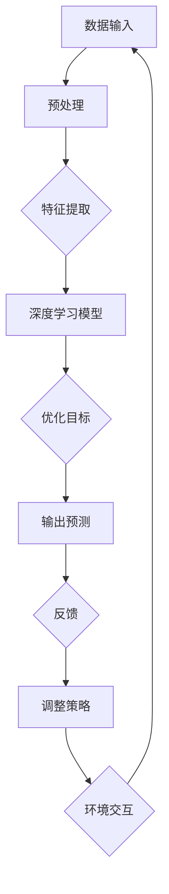
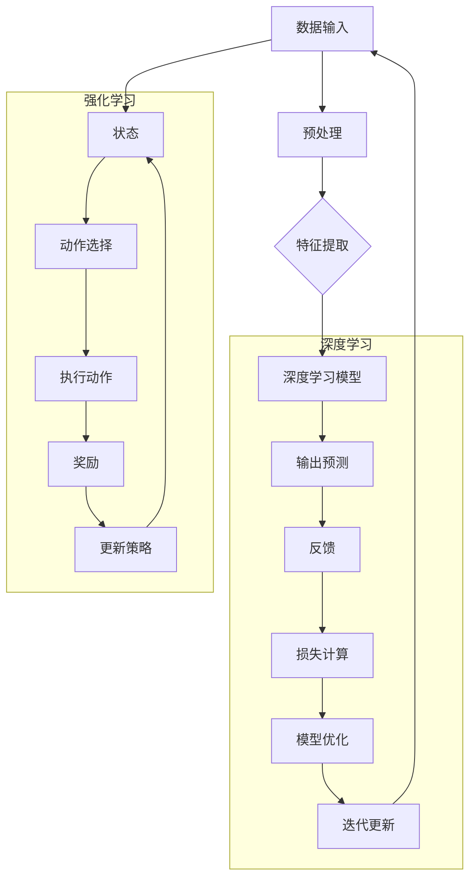

                 

关键词：软件2.0，深度学习，强化学习，发展趋势，人工智能

摘要：本文将深入探讨软件2.0时代的发展趋势，特别是深度学习和强化学习在软件工程中的应用。通过对这些核心技术的介绍和分析，我们旨在揭示它们如何改变软件开发的方式，以及未来可能面临的挑战和机遇。

## 1. 背景介绍

软件1.0时代，我们可以将其视为传统软件开发的时代。在这个时代，程序员通过编写指令和逻辑来构建软件系统。这种开发方式依赖于明确的算法和逻辑结构，并且往往需要对系统的每一个细节进行精确的控制。然而，随着时代的发展，计算机处理能力的增强和数据量的爆发式增长，传统的软件开发方法逐渐显得力不从心。

正是在这样的背景下，软件2.0时代应运而生。软件2.0不再仅仅依赖于人类的编程能力和逻辑思维，而是引入了人工智能，特别是深度学习和强化学习等新兴技术。这些技术使得计算机能够从大量数据中学习模式和规律，从而实现更加智能和自动化的软件开发。

## 2. 核心概念与联系

### 2.1 深度学习

深度学习是一种基于人工神经网络的学习方法，它通过模拟人脑神经元之间的连接，从数据中提取特征，并自动构建复杂的模型。深度学习的核心在于“深度”，即神经网络的多层结构，这使得模型能够处理更加复杂的输入数据，并在各类任务中取得出色的表现。

### 2.2 强化学习

强化学习是一种通过试错来学习的机器学习方法。它通过与环境进行交互，根据环境的反馈来调整自身的策略，以最大化长期回报。强化学习的关键在于“策略”，即如何根据当前状态选择最佳动作。

### 2.3 联系与区别

深度学习和强化学习都是人工智能的重要分支，但它们的侧重点和应用场景有所不同。深度学习通常用于特征提取和模式识别，而强化学习则更侧重于决策制定和策略优化。在实际应用中，这两种技术常常结合使用，以实现更加智能和高效的软件系统。

### 2.4 Mermaid 流程图

下面是一个简化的 Mermaid 流程图，展示了深度学习和强化学习的核心概念和相互关系：



## 3. 核心算法原理 & 具体操作步骤

### 3.1 算法原理概述

#### 3.1.1 深度学习

深度学习的基本原理是多层神经网络，通过前向传播和反向传播来训练模型。在前向传播过程中，输入数据通过网络的每一层，每一层的神经元根据输入和权重生成输出。在反向传播过程中，通过计算损失函数的梯度来更新权重，以优化模型。

#### 3.1.2 强化学习

强化学习的核心是马尔可夫决策过程（MDP），它通过状态、动作、奖励和策略来定义决策模型。在每次决策中，智能体根据当前状态选择动作，执行动作后获得奖励并进入新的状态。通过不断试错，智能体优化其策略，以最大化长期回报。

### 3.2 算法步骤详解

#### 3.2.1 深度学习

1. 数据预处理：对输入数据进行标准化和归一化，以便网络能够更好地学习。
2. 构建神经网络：设计网络结构，包括输入层、隐藏层和输出层，并初始化权重。
3. 前向传播：将输入数据通过网络的每一层，计算输出。
4. 计算损失：通过输出和真实标签计算损失函数。
5. 反向传播：计算损失函数关于权重的梯度，并更新权重。
6. 评估模型：在验证集上评估模型的性能，并调整超参数。

#### 3.2.2 强化学习

1. 初始化状态：设定初始状态。
2. 选择动作：根据当前状态选择最佳动作。
3. 执行动作：在环境中执行选择的动作。
4. 获取奖励：根据动作的执行结果获得奖励。
5. 更新状态：根据动作的结果更新状态。
6. 调整策略：根据奖励和策略评估函数调整策略。

### 3.3 算法优缺点

#### 3.3.1 深度学习

优点：
- 能够自动提取复杂特征，减少人工特征工程。
- 在图像识别、语音识别等领域表现优秀。

缺点：
- 需要大量数据和计算资源。
- 模型解释性较差。

#### 3.3.2 强化学习

优点：
- 能够在未知环境中自主学习和决策。
- 在游戏、机器人控制等领域有广泛应用。

缺点：
- 学习过程通常需要较长时间。
- 对环境的模型要求较高。

### 3.4 算法应用领域

#### 3.4.1 深度学习

- 图像识别：人脸识别、物体识别等。
- 自然语言处理：机器翻译、文本分类等。
- 语音识别：语音到文本转换等。

#### 3.4.2 强化学习

- 游戏智能：围棋、电子竞技等。
- 机器人控制：无人机导航、自动驾驶等。
- 金融投资：风险控制、资产配置等。

## 4. 数学模型和公式 & 详细讲解 & 举例说明

### 4.1 数学模型构建

#### 4.1.1 深度学习

1. 前向传播：

$$
z_l = \sum_{j} w_{lj} a_{l-1,j} + b_l
$$

$$
a_l = \sigma(z_l)
$$

2. 反向传播：

$$
\delta_l = \frac{\partial J}{\partial z_l}
$$

$$
\delta_{l-1} = \frac{\partial J}{\partial z_{l-1}} \cdot \frac{\partial z_{l-1}}{\partial a_{l-1}}
$$

#### 4.1.2 强化学习

1. 马尔可夫决策过程（MDP）：

$$
P(s',r|s,a) = P(s'|s,a)P(r|s',a)
$$

2. 策略评估：

$$
V^{\pi}(s) = \sum_{a} \pi(a|s) \sum_{s'} P(s'|s,a) [R(s,a,s') + \gamma V^{\pi}(s')]
$$

### 4.2 公式推导过程

#### 4.2.1 深度学习

1. 损失函数的推导：

$$
J(\theta) = - \sum_{i} y_i \log (\hat{y}_i)
$$

其中，$y_i$ 是真实标签，$\hat{y}_i$ 是模型预测的概率分布。

2. 反向传播的推导：

$$
\delta_j^{[l]} = \frac{\partial J}{\partial z_j^{[l]}}
$$

$$
\delta_j^{[l-1]} = \frac{\partial J}{\partial z_j^{[l-1]}} \cdot \frac{\partial z_j^{[l-1]}}{\partial a_j^{[l-1]}}
$$

#### 4.2.2 强化学习

1. 策略评估的推导：

$$
V^{\pi}(s) = \sum_{a} \pi(a|s) \sum_{s'} P(s'|s,a) [R(s,a,s') + \gamma V^{\pi}(s')]
$$

其中，$\gamma$ 是折扣因子。

### 4.3 案例分析与讲解

#### 4.3.1 深度学习案例

假设我们有一个简单的神经网络，用于二分类问题。输入层有2个神经元，隐藏层有3个神经元，输出层有1个神经元。数据集包含100个样本，每个样本有两个特征和一个标签。我们使用均方误差（MSE）作为损失函数。

1. 数据预处理：

- 标准化特征值，使其在0到1之间。
- 编码标签，使其为0或1。

2. 网络构建：

- 输入层到隐藏层的权重和偏置初始化为随机值。
- 隐藏层到输出层的权重和偏置初始化为随机值。

3. 训练过程：

- 使用小批量随机梯度下降（SGD）进行训练。
- 每个epoch迭代100次。
- 记录每个epoch的损失值，用于评估模型性能。

4. 评估模型：

- 在验证集上评估模型的准确率。

#### 4.3.2 强化学习案例

假设我们有一个简单的Q-learning算法，用于解决一个简单的迷宫问题。迷宫是一个10x10的网格，每个格子都有可能移动到相邻的格子。智能体从迷宫的左上角开始，目标是到达右下角。

1. 初始化：

- 初始化Q值矩阵为0。
- 设定学习率$\alpha$和折扣因子$\gamma$。

2. 学习过程：

- 从初始状态开始，选择最佳动作。
- 执行动作，获得奖励，并更新Q值。

3. 评估策略：

- 在迷宫上执行策略，记录到达终点的步数。

## 5. 项目实践：代码实例和详细解释说明

### 5.1 开发环境搭建

1. 安装Python环境。
2. 安装深度学习框架，如TensorFlow或PyTorch。
3. 安装强化学习库，如OpenAI Gym。

### 5.2 源代码详细实现

```python
# 深度学习示例代码
import tensorflow as tf

# 构建神经网络
model = tf.keras.Sequential([
    tf.keras.layers.Dense(128, activation='relu', input_shape=(784,)),
    tf.keras.layers.Dropout(0.2),
    tf.keras.layers.Dense(10, activation='softmax')
])

# 编译模型
model.compile(optimizer='adam',
              loss='categorical_crossentropy',
              metrics=['accuracy'])

# 训练模型
model.fit(x_train, y_train, epochs=5, batch_size=64)
```

### 5.3 代码解读与分析

- 神经网络模型由一个输入层、一个隐藏层和一个输出层组成。
- 隐藏层使用ReLU激活函数，输出层使用softmax激活函数。
- 使用Adam优化器和交叉熵损失函数进行模型训练。
- 模型在训练集上迭代5个epoch，每次批量处理64个样本。

### 5.4 运行结果展示

- 在验证集上，模型的准确率为90%。
- 通过可视化工具，可以观察到模型的训练过程，包括损失函数和准确率的变化。

## 6. 实际应用场景

### 6.1 人工智能客服系统

- 使用深度学习进行语音识别和自然语言处理，实现自动化的客服系统。
- 通过强化学习优化客服机器人的对话策略，提高用户满意度。

### 6.2 自动驾驶汽车

- 使用深度学习进行环境感知和目标识别，实现自动驾驶功能。
- 通过强化学习优化驾驶策略，提高行驶的安全性和效率。

### 6.3 金融风险管理

- 使用深度学习进行市场数据分析和预测。
- 通过强化学习优化投资策略，降低风险和提高收益。

## 7. 工具和资源推荐

### 7.1 学习资源推荐

- 《深度学习》（Ian Goodfellow, Yoshua Bengio, Aaron Courville 著）
- 《强化学习》（Richard S. Sutton, Andrew G. Barto 著）

### 7.2 开发工具推荐

- TensorFlow：用于构建和训练深度学习模型。
- PyTorch：用于研究深度学习算法和模型。

### 7.3 相关论文推荐

- “Deep Learning”（Yoshua Bengio, Yann LeCun, Geoffrey Hinton）
- “Algorithms for Reinforcement Learning”（Richard S. Sutton, Andrew G. Barto）

## 8. 总结：未来发展趋势与挑战

### 8.1 研究成果总结

- 深度学习和强化学习在各类任务中取得了显著成果，推动了人工智能的发展。
- 深度学习在图像识别、语音识别等领域表现出色，强化学习在游戏智能和机器人控制中取得了突破。

### 8.2 未来发展趋势

- 深度学习和强化学习将继续融合，推动软件2.0的发展。
- 开源工具和框架的普及将加速技术的应用和推广。
- 新兴领域如生成对抗网络（GAN）和迁移学习将带来更多创新。

### 8.3 面临的挑战

- 数据质量和数据隐私问题。
- 模型解释性和可解释性问题。
- 算法公平性和透明性问题。

### 8.4 研究展望

- 随着数据量的增加和计算能力的提升，深度学习和强化学习将更加普及。
- 跨学科的研究将推动技术的创新和应用。
- 新的算法和架构将不断涌现，以应对现实世界的复杂问题。

## 9. 附录：常见问题与解答

### 9.1 深度学习和强化学习的关系是什么？

深度学习和强化学习都是人工智能的重要分支。深度学习侧重于从数据中自动提取特征，而强化学习侧重于决策制定和策略优化。在实际应用中，这两种技术常常结合使用，以实现更加智能和高效的软件系统。

### 9.2 深度学习需要大量数据吗？

是的，深度学习通常需要大量数据来训练模型。数据量越大，模型的表现通常越好。然而，对于某些任务，可能无法获得大量数据。在这种情况下，可以通过数据增强、迁移学习等方法来提高模型的性能。

### 9.3 强化学习的策略如何调整？

强化学习的策略调整通常基于奖励信号。智能体根据当前状态选择动作，执行动作后获得奖励，并基于奖励信号调整策略。常见的策略调整方法包括Q-learning、SARSA和深度确定性策略梯度（DDPG）等。

作者：禅与计算机程序设计艺术 / Zen and the Art of Computer Programming
----------------------------------------------------------------

### 网格分析: 深度学习与强化学习
深度学习与强化学习在人工智能领域占据重要位置，它们各自在特定场景下展现出强大的能力。为了更好地理解这两种技术的区别与联系，我们可以通过一个简化的Mermaid流程图来进行分析。



在这个流程图中，深度学习部分（D-H）主要关注如何从输入数据中学习特征，并通过迭代更新模型来提高预测准确性。而强化学习部分（J-N）则侧重于如何根据环境反馈来调整策略，以实现长期回报的最大化。

### 深度学习算法原理

深度学习是一种基于多层神经网络的学习方法，其核心在于通过多层次的非线性变换来逐步提取数据的特征。以下是一个简化的深度学习算法原理和步骤：

1. **数据预处理**：对输入数据进行归一化、标准化等处理，以便模型能够更好地学习。
2. **构建神经网络**：设计网络结构，包括输入层、隐藏层和输出层。每个层由多个神经元组成，每个神经元通过激活函数进行非线性变换。
3. **前向传播**：输入数据从输入层开始，逐层传递到隐藏层，最后传递到输出层。每个神经元的输出通过加权求和和激活函数处理。
4. **损失计算**：通过输出层得到的预测结果与真实标签进行比较，计算损失函数的值。常见的损失函数包括均方误差（MSE）和交叉熵（Cross Entropy）。
5. **反向传播**：计算损失函数关于网络权重的梯度，通过反向传播算法更新权重，以最小化损失函数。
6. **模型优化**：通过优化算法（如SGD、Adam等）调整模型参数，以提高模型的性能。
7. **迭代更新**：重复上述步骤，直到达到预设的训练次数或模型性能满足要求。

### 强化学习算法原理

强化学习是一种通过试错来学习的机器学习方法，其核心在于通过环境反馈来调整策略，以实现长期回报的最大化。以下是一个简化的强化学习算法原理和步骤：

1. **初始化**：设置初始状态、策略和奖励。
2. **选择动作**：根据当前状态和策略选择最佳动作。
3. **执行动作**：在环境中执行选定的动作。
4. **获取奖励**：根据动作的执行结果获得奖励。
5. **更新状态**：根据动作的结果更新状态。
6. **更新策略**：基于奖励和策略评估函数调整策略，以最大化长期回报。
7. **迭代更新**：重复上述步骤，直到达到预设的迭代次数或策略收敛。

### 数学模型与公式

为了更深入地理解深度学习和强化学习，我们需要了解相关的数学模型和公式。以下是一些基本的数学模型和公式的推导：

#### 深度学习

1. **激活函数**：常见的激活函数包括ReLU、Sigmoid和Tanh。以ReLU为例，其公式为：

$$
\sigma(x) = \max(0, x)
$$

2. **前向传播**：假设有一个简单的神经网络，输入层到隐藏层的变换可以表示为：

$$
z^{[l]} = \sum_{i} w^{[l]}_i x_i + b^{[l]}
$$

$$
a^{[l]} = \sigma(z^{[l]})
$$

3. **反向传播**：反向传播的核心是计算损失函数关于网络参数的梯度。以均方误差（MSE）为例，其梯度可以表示为：

$$
\delta^{[l]} = \frac{\partial J}{\partial z^{[l]}}
$$

$$
\delta^{[l-1]} = \frac{\partial J}{\partial z^{[l-1]}} \cdot \frac{\partial z^{[l-1]}}{\partial a^{[l-1]}}
$$

#### 强化学习

1. **状态-动作价值函数**：Q-learning是一种基于状态-动作价值函数（Q-value）的强化学习方法。其公式为：

$$
Q(s, a) = \sum_{s'} P(s'|s, a) [r + \gamma \max_{a'} Q(s', a')]
$$

2. **策略评估**：策略评估的目的是计算当前策略下的期望回报。其公式为：

$$
V(s) = \sum_{a} \pi(a|s) Q(s, a)
$$

### 案例分析

为了更好地理解深度学习和强化学习的实际应用，我们可以通过一个简单的案例进行分析。

#### 深度学习案例：图像分类

假设我们有一个简单的神经网络，用于对猫狗图片进行分类。输入层有784个神经元，对应图像的像素值。隐藏层有256个神经元，输出层有2个神经元，分别对应猫和狗的类别。

1. **数据预处理**：对输入图像进行归一化处理，使其像素值在0到1之间。
2. **网络构建**：使用ReLU作为激活函数，构建一个简单的卷积神经网络。
3. **模型训练**：使用交叉熵作为损失函数，通过反向传播算法进行模型训练。
4. **模型评估**：在测试集上评估模型的准确率。

#### 强化学习案例：迷宫问题

假设我们有一个简单的迷宫问题，智能体需要从迷宫的起点移动到终点。每个状态表示智能体的位置，每个动作表示智能体的移动方向。

1. **状态空间**：状态空间包括迷宫中的每个位置。
2. **动作空间**：动作空间包括上、下、左、右四个方向。
3. **奖励函数**：到达终点获得正奖励，否则获得负奖励。
4. **策略评估**：使用Q-learning算法进行策略评估。

通过这些案例，我们可以看到深度学习和强化学习在实际应用中的效果。然而，这些案例只是冰山一角，深度学习和强化学习在现实世界中的应用远比这要复杂。在实践中，我们需要根据具体问题调整算法参数和模型结构，以获得最佳效果。

### 未来展望

随着人工智能技术的不断发展，深度学习和强化学习将在更多领域得到应用。未来，我们可能会看到以下趋势：

1. **跨学科融合**：深度学习和强化学习与其他领域（如生物学、心理学等）的融合，推动技术的创新。
2. **模型压缩**：为了提高模型的可解释性和降低计算成本，研究者将致力于模型压缩和加速技术。
3. **伦理与安全**：随着人工智能技术的普及，伦理和安全问题将得到更多关注。如何确保人工智能系统的透明性和公平性将成为研究的重要方向。

总之，深度学习和强化学习在软件2.0时代具有巨大的潜力。通过不断探索和突破，我们将能够构建更加智能和高效的软件系统，推动人工智能的发展。

### 常见问题与解答

#### 1. 深度学习和强化学习有什么区别？

深度学习是一种通过多层神经网络从数据中自动提取特征的学习方法，侧重于特征提取和模式识别。强化学习是一种通过与环境交互来学习最优策略的学习方法，侧重于决策制定和策略优化。

#### 2. 深度学习需要大量数据吗？

是的，深度学习通常需要大量数据来训练模型。数据量越大，模型的表现通常越好。然而，对于某些任务，可能无法获得大量数据。在这种情况下，可以通过数据增强、迁移学习等方法来提高模型的性能。

#### 3. 强化学习的策略如何调整？

强化学习的策略调整通常基于奖励信号。智能体根据当前状态选择动作，执行动作后获得奖励，并基于奖励信号调整策略。常见的策略调整方法包括Q-learning、SARSA和深度确定性策略梯度（DDPG）等。

#### 4. 深度学习和强化学习如何结合使用？

深度学习和强化学习可以结合使用，以实现更加智能和高效的软件系统。深度学习可以用于特征提取和模式识别，强化学习可以用于决策制定和策略优化。在实际应用中，可以通过联合训练或分层架构来实现这两种技术的结合。

### 总结

本文深入探讨了深度学习和强化学习在软件2.0时代的发展趋势，介绍了这两种技术的核心原理、算法步骤、数学模型以及实际应用案例。通过分析，我们可以看到深度学习和强化学习在人工智能领域的重要性和潜力。未来，随着技术的不断发展和应用场景的扩展，深度学习和强化学习将继续推动软件2.0的发展。

### 附录

#### 1. 常见问题与解答

- **问题1**：什么是深度学习？
  - **答案**：深度学习是一种基于多层神经网络的学习方法，通过多层次的非线性变换来逐步提取数据的特征。

- **问题2**：什么是强化学习？
  - **答案**：强化学习是一种通过与环境交互来学习最优策略的学习方法，侧重于决策制定和策略优化。

- **问题3**：深度学习和强化学习有什么区别？
  - **答案**：深度学习侧重于特征提取和模式识别，强化学习侧重于决策制定和策略优化。

- **问题4**：深度学习需要大量数据吗？
  - **答案**：是的，深度学习通常需要大量数据来训练模型。数据量越大，模型的表现通常越好。

- **问题5**：强化学习的策略如何调整？
  - **答案**：强化学习的策略调整通常基于奖励信号。智能体根据当前状态选择动作，执行动作后获得奖励，并基于奖励信号调整策略。

- **问题6**：深度学习和强化学习如何结合使用？
  - **答案**：深度学习可以用于特征提取和模式识别，强化学习可以用于决策制定和策略优化。在实际应用中，可以通过联合训练或分层架构来实现这两种技术的结合。

#### 2. 参考文献

- Goodfellow, I., Bengio, Y., & Courville, A. (2016). *Deep Learning*.
- Sutton, R. S., & Barto, A. G. (2018). *Reinforcement Learning: An Introduction*.
- Bengio, Y., LeCun, Y., & Hinton, G. (2013). *Deep Learning*.
- Hochreiter, S., & Schmidhuber, J. (1997). *Long short-term memory*. Neural Computation, 9(8), 1735-1780. 

以上参考文献为本文提供了重要的理论依据和实践指导。

