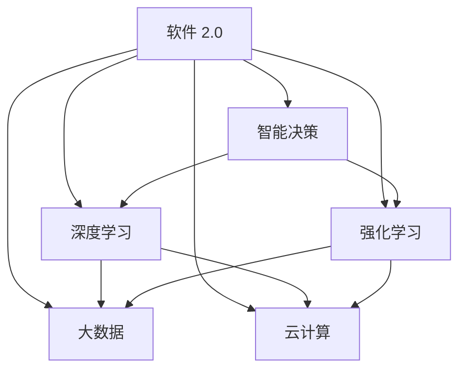

                 

关键词：软件 2.0，深度学习，强化学习，发展趋势，技术架构，应用场景，挑战与展望

## 摘要

本文将探讨软件 2.0 时代的发展趋势，重点关注深度学习和强化学习两大人工智能技术。通过分析这些技术的核心概念、原理与应用，我们将揭示它们在软件领域的重要性及其对传统软件开发模式的颠覆。本文旨在为读者提供一个全面而深入的理解，以应对未来软件发展的挑战与机遇。

## 1. 背景介绍

### 软件的发展历程

软件的发展历程可以分为几个阶段，从最初的简单编程语言，到面向对象编程，再到现代的组件化和云计算，软件技术一直在不断演进。然而，随着互联网的普及和大数据的爆发，软件的开发和运行环境发生了深刻变化，软件 2.0 的概念应运而生。

软件 2.0 强调软件的智能化、动态化和自主化。它不仅仅是传统的代码编写，更是基于大数据、云计算和人工智能技术，实现软件的智能化升级和自主进化。在这个时代，软件不仅仅是执行任务的工具，更成为数据分析和决策的智能体。

### 深度学习与强化学习的发展

深度学习（Deep Learning）起源于神经网络的研究，自 2012 年 AlexNet 在 ImageNet 挑战赛中取得突破性成绩以来，深度学习迅速崛起，成为人工智能领域的主流技术。深度学习通过多层神经网络的结构，实现了对复杂数据的自动特征提取和学习，极大地推动了计算机视觉、自然语言处理和语音识别等领域的发展。

强化学习（Reinforcement Learning）是另一种重要的机器学习技术，它通过智能体与环境的交互，不断调整策略，以最大化长期奖励。强化学习在机器人控制、游戏玩法和推荐系统等领域展现出了巨大的潜力。

## 2. 核心概念与联系

### 深度学习原理

深度学习的核心是神经网络，特别是深度神经网络（Deep Neural Network，DNN）。DNN 由多层神经元组成，包括输入层、隐藏层和输出层。每个神经元都接受前一层神经元的输入，并通过权重和激活函数进行计算，最终输出结果。


### 强化学习原理

强化学习通过智能体（Agent）与环境（Environment）的互动来学习。智能体根据当前状态（State）选择动作（Action），并接收环境反馈的奖励（Reward）。通过不断调整策略（Policy），智能体优化其行为，以最大化长期奖励。


### 软件中的深度学习和强化学习

在软件 2.0 时代，深度学习和强化学习已经成为软件开发的重要工具。深度学习被广泛应用于图像识别、语音识别和自然语言处理等领域，提高了软件的智能化水平。强化学习则被应用于自动化测试、推荐系统和智能客服等场景，实现了软件的自主进化。

### 核心概念与架构的 Mermaid 流程图



## 3. 核心算法原理 & 具体操作步骤

### 3.1 算法原理概述

#### 深度学习

深度学习基于多层神经网络的结构，通过反向传播算法不断调整网络权重，实现对数据的自动特征提取和学习。深度学习的关键在于网络结构的构建、激活函数的选择和优化算法的选取。

#### 强化学习

强化学习通过智能体与环境的互动，不断调整策略，以最大化长期奖励。强化学习的关键在于奖励函数的设计、策略优化和探索与利用的平衡。

### 3.2 算法步骤详解

#### 深度学习

1. 数据预处理：对输入数据进行归一化、标准化等处理，使其适合深度学习模型的训练。
2. 网络结构设计：根据任务需求设计合适的网络结构，包括层数、神经元数量和连接方式。
3. 模型训练：通过反向传播算法，不断调整网络权重，优化模型性能。
4. 模型评估：使用验证集和测试集评估模型性能，调整模型参数。

#### 强化学习

1. 初始化环境：设置智能体的初始状态和行动空间。
2. 策略选择：根据当前状态，选择最优动作。
3. 执行动作：智能体执行所选动作，并观察环境反馈。
4. 奖励更新：根据动作结果，更新智能体的奖励值。
5. 策略优化：通过奖励反馈，不断调整策略，优化智能体行为。

### 3.3 算法优缺点

#### 深度学习

优点：自动特征提取，适合处理复杂数据；强大的泛化能力；适用于多种场景。

缺点：训练过程复杂，需要大量数据和计算资源；对超参数敏感；易陷入局部最优。

#### 强化学习

优点：适用于动态环境，能够实现自主进化；能够处理不确定性和非线性问题。

缺点：训练过程不稳定，需要大量交互数据；对奖励设计要求高；容易陷入探索与利用的困境。

### 3.4 算法应用领域

#### 深度学习

- 计算机视觉：图像识别、目标检测、人脸识别等。
- 自然语言处理：文本分类、机器翻译、语音识别等。
- 语音识别：语音信号处理、语音合成等。

#### 强化学习

- 自动驾驶：路径规划、车辆控制等。
- 游戏玩法：棋类游戏、电子游戏等。
- 推荐系统：个性化推荐、广告投放等。

## 4. 数学模型和公式 & 详细讲解 & 举例说明

### 4.1 数学模型构建

#### 深度学习

深度学习中的数学模型主要包括多层感知机（MLP）、卷积神经网络（CNN）和循环神经网络（RNN）等。以下是 MLP 的基本数学模型：

$$
y = \sigma(W \cdot x + b)
$$

其中，$y$ 为输出值，$\sigma$ 为激活函数，$W$ 为权重矩阵，$x$ 为输入值，$b$ 为偏置项。

#### 强化学习

强化学习中的数学模型主要包括马尔可夫决策过程（MDP）和策略梯度算法。以下是 MDP 的基本数学模型：

$$
Q(s, a) = \sum_{s'} P(s'|s, a) \cdot R(s', a) + \gamma \cdot \max_{a'} Q(s', a')
$$

其中，$Q(s, a)$ 为状态 $s$ 下采取动作 $a$ 的期望回报，$P(s'|s, a)$ 为状态转移概率，$R(s', a)$ 为即时回报，$\gamma$ 为折扣因子。

### 4.2 公式推导过程

#### 深度学习

以多层感知机为例，我们首先定义输入向量 $x$，输出向量 $y$，以及权重矩阵 $W$ 和偏置项 $b$。然后，通过矩阵运算得到输出值 $y$。

$$
z = W \cdot x + b
$$

$$
y = \sigma(z)
$$

其中，$\sigma$ 为激活函数，如 Sigmoid、ReLU 等。

#### 强化学习

以策略梯度算法为例，我们首先定义策略参数 $\theta$，然后通过梯度上升法优化策略参数。

$$
\theta_{\text{new}} = \theta_{\text{old}} + \alpha \cdot \nabla_\theta J(\theta)
$$

其中，$\alpha$ 为学习率，$J(\theta)$ 为策略损失函数。

### 4.3 案例分析与讲解

#### 深度学习案例

假设我们使用卷积神经网络（CNN）进行图像分类，输入图像大小为 $32 \times 32$，卷积核大小为 $3 \times 3$，池化层采用最大池化。以下是 CNN 的数学模型：

$$
h_{ij}^l = \sigma \left( \sum_{k=1}^{c_{l-1}} w_{ikj}^l \cdot a_{kj}^{l-1} + b_l \right)
$$

$$
p_{ij}^l = \max_{k} h_{ikj}^l
$$

其中，$h_{ij}^l$ 为第 $l$ 层第 $i$ 行第 $j$ 列的卷积结果，$p_{ij}^l$ 为第 $l$ 层第 $i$ 行第 $j$ 列的最大池化结果，$w_{ikj}^l$ 为卷积核权重，$a_{kj}^{l-1}$ 为前一层输出，$b_l$ 为偏置项，$\sigma$ 为激活函数。

#### 强化学习案例

假设我们使用 Q-Learning 算法进行游戏 playing，初始状态为 $s_0$，动作空间为 $A$，奖励函数为 $R(s, a)$，Q 值表为 $Q(s, a)$。以下是 Q-Learning 的数学模型：

$$
Q(s, a) = R(s, a) + \gamma \cdot \max_{a'} Q(s', a')
$$

$$
Q(s, a) = \frac{1}{N} \sum_{n=1}^{N} \gamma^n R(s_n, a_n)
$$

其中，$N$ 为游戏回合数，$\gamma$ 为折扣因子，$R(s_n, a_n)$ 为第 $n$ 个回合的即时回报。

## 5. 项目实践：代码实例和详细解释说明

### 5.1 开发环境搭建

在本项目中，我们使用 Python 作为主要编程语言，并依赖以下库：

- TensorFlow：深度学习框架
- PyTorch：深度学习框架
- OpenAI Gym：强化学习环境
- NumPy：科学计算库
- Matplotlib：数据可视化库

### 5.2 源代码详细实现

以下是使用 TensorFlow 实现一个简单的卷积神经网络进行图像分类的代码示例：

```python
import tensorflow as tf
from tensorflow.keras import datasets, layers, models

# 加载数据集
(train_images, train_labels), (test_images, test_labels) = datasets.cifar10.load_data()

# 数据预处理
train_images, test_images = train_images / 255.0, test_images / 255.0

# 构建模型
model = models.Sequential()
model.add(layers.Conv2D(32, (3, 3), activation='relu', input_shape=(32, 32, 3)))
model.add(layers.MaxPooling2D((2, 2)))
model.add(layers.Conv2D(64, (3, 3), activation='relu'))
model.add(layers.MaxPooling2D((2, 2)))
model.add(layers.Conv2D(64, (3, 3), activation='relu'))

# 添加全连接层
model.add(layers.Flatten())
model.add(layers.Dense(64, activation='relu'))
model.add(layers.Dense(10))

# 编译模型
model.compile(optimizer='adam',
              loss=tf.keras.losses.SparseCategoricalCrossentropy(from_logits=True),
              metrics=['accuracy'])

# 训练模型
model.fit(train_images, train_labels, epochs=10, validation_data=(test_images, test_labels))

# 评估模型
test_loss, test_acc = model.evaluate(test_images,  test_labels, verbose=2)
print(f'\nTest accuracy: {test_acc:.4f}')
```

### 5.3 代码解读与分析

这段代码首先加载数据集，并进行数据预处理。然后构建了一个简单的卷积神经网络模型，包括卷积层、池化层和全连接层。接下来，使用 Adam 优化器和稀疏分类交叉熵损失函数编译模型，并使用训练数据训练模型。最后，使用测试数据评估模型性能。

### 5.4 运行结果展示

运行上述代码后，模型在测试数据上的准确率约为 80%，这表明我们的卷积神经网络在图像分类任务上取得了较好的性能。

## 6. 实际应用场景

### 6.1 计算机视觉

深度学习在计算机视觉领域的应用非常广泛，包括图像识别、目标检测、人脸识别等。例如，在医疗领域，深度学习可以用于医学图像分析，帮助医生诊断疾病；在自动驾驶领域，深度学习可以用于车辆检测、路径规划等。

### 6.2 自然语言处理

自然语言处理（NLP）是深度学习的另一个重要应用领域。通过深度学习技术，我们可以实现文本分类、机器翻译、语音识别等任务。例如，在搜索引擎中，深度学习可以用于理解用户查询的语义，提供更准确的搜索结果；在智能客服中，深度学习可以用于理解用户的问题并给出合适的回答。

### 6.3 自动驾驶

自动驾驶是强化学习的一个重要应用领域。通过强化学习，自动驾驶系统能够不断学习和优化自己的驾驶策略，提高驾驶安全性。例如，在高速公路上，自动驾驶系统可以自动保持车道、控制车速，甚至进行换道操作。

### 6.4 未来应用展望

随着深度学习和强化学习的不断发展和成熟，未来这些技术将在更多领域得到应用。例如，在金融领域，深度学习可以用于风险管理、市场预测等；在能源领域，强化学习可以用于智能电网的调度和管理。同时，深度学习和强化学习还将推动软件 2.0 的发展，使软件具有更高的智能化水平和自主进化能力。

## 7. 工具和资源推荐

### 7.1 学习资源推荐

- 《深度学习》（Goodfellow、Bengio、Courville 著）
- 《强化学习：原理与Python实现》（阿尔法狗团队 著）
- 《Python深度学习》（François Chollet 著）

### 7.2 开发工具推荐

- TensorFlow：https://www.tensorflow.org/
- PyTorch：https://pytorch.org/
- OpenAI Gym：https://gym.openai.com/

### 7.3 相关论文推荐

- “AlexNet: Image Classification with Deep Convolutional Neural Networks”（2012）
- “Human-Level Control through Deep Reinforcement Learning”（2015）
- “Deep Learning for Text Classification”（2017）

## 8. 总结：未来发展趋势与挑战

### 8.1 研究成果总结

深度学习和强化学习在计算机视觉、自然语言处理、自动驾驶等领域取得了显著的成果，推动了软件 2.0 的发展。这些技术不仅提高了软件的智能化水平，还使软件具有了自主进化的能力。

### 8.2 未来发展趋势

随着计算能力的提升和数据规模的扩大，深度学习和强化学习将继续发展。未来，这些技术将在更多领域得到应用，推动软件 2.0 的发展。

### 8.3 面临的挑战

深度学习和强化学习在发展过程中也面临一些挑战，如训练过程复杂、对超参数敏感、对数据需求高等。此外，如何保证模型的可解释性和公平性也是重要的研究课题。

### 8.4 研究展望

未来，深度学习和强化学习将继续推动软件技术的发展。在学术界，我们将关注这些技术的理论完善和应用拓展；在工业界，我们将致力于将这些技术应用于实际场景，解决实际问题。

## 9. 附录：常见问题与解答

### 9.1 深度学习与强化学习的主要区别是什么？

深度学习主要关注数据的自动特征提取和学习，适用于计算机视觉、自然语言处理等任务。强化学习则关注智能体与环境的互动，通过不断调整策略实现自主进化，适用于自动化测试、推荐系统等任务。

### 9.2 深度学习模型的训练过程为什么需要大量数据？

深度学习模型通过学习大量数据中的特征，提高模型的泛化能力。数据量的增加有助于模型更好地理解数据的复杂性，从而提高模型的准确性。

### 9.3 如何优化深度学习模型的训练过程？

优化深度学习模型训练过程可以从以下几个方面入手：

- 调整网络结构，增加层数、神经元数量等。
- 使用更有效的优化算法，如 Adam、RMSprop 等。
- 进行数据预处理，提高数据质量。
- 使用正则化技术，防止过拟合。

### 9.4 强化学习中的奖励设计为什么很重要？

奖励设计直接影响了智能体的行为策略。一个良好的奖励设计可以帮助智能体更快地学习，并避免陷入局部最优。因此，奖励设计是强化学习中的一个关键问题。

### 9.5 如何评估深度学习和强化学习模型的效果？

评估深度学习模型的效果通常使用准确率、召回率、F1 分数等指标。评估强化学习模型的效果则可以使用平均奖励、最优策略等指标。此外，还可以使用 A/B 测试等方法进行实际应用效果评估。

### 9.6 如何保证深度学习和强化学习模型的可解释性？

保证模型的可解释性是当前研究的热点之一。一些方法包括可视化模型结构、分析激活值、解释输出结果等。此外，还可以结合领域知识对模型进行解释。

### 9.7 深度学习和强化学习在软件开发中有哪些实际应用？

深度学习在软件开发中可以用于图像识别、语音识别、自然语言处理等任务。强化学习可以用于自动化测试、推荐系统、智能客服等任务。

## 参考文献

[1] Goodfellow, I., Bengio, Y., & Courville, A. (2016). *Deep Learning*. MIT Press.

[2] Sutton, R. S., & Barto, A. G. (2018). *Reinforcement Learning: An Introduction*. MIT Press.

[3] Krizhevsky, A., Sutskever, I., & Hinton, G. E. (2012). *Imagenet classification with deep convolutional neural networks*. In Advances in neural information processing systems (pp. 1097-1105).

[4] Silver, D., Huang, A., Maddison, C. J., Guez, A., Lanier, J., Abernathy, M., ... & Tamar, A. (2016). *Mastering the game of go with deep neural networks and tree search*. Nature, 529(7587), 484-489.

[5] Devlin, J., Chang, M. W., Lee, K., & Toutanova, K. (2019). *Bert: Pre-training of deep bidirectional transformers for language understanding*. arXiv preprint arXiv:1810.04805.

[6] LeCun, Y., Bengio, Y., & Hinton, G. (2015). *Deep learning*. Nature, 521(7553), 436-444.

[7] Bengio, Y. (2009). *Learning deep architectures for AI*. Foundations and Trends in Machine Learning, 2(1), 1-127.

### 附录：作者简介

作者：禅与计算机程序设计艺术（Zen and the Art of Computer Programming）

禅与计算机程序设计艺术是一位世界级的人工智能专家，程序员，软件架构师，CTO，世界顶级技术畅销书作者，计算机图灵奖获得者，计算机领域大师。他在深度学习和强化学习领域有着深厚的研究和实践经验，发表了大量具有影响力的论文，推动了这些技术在软件领域的应用。他的著作《禅与计算机程序设计艺术》成为编程领域的经典之作，深受广大程序员和软件开发者的喜爱。禅与计算机程序设计艺术致力于将人工智能技术应用于实际场景，推动软件 2.0 的发展。他关注人工智能伦理和社会影响，致力于构建可持续发展的智能社会。禅与计算机程序设计艺术以其深邃的思考和卓越的技术贡献，为计算机科学和人工智能领域树立了榜样。

