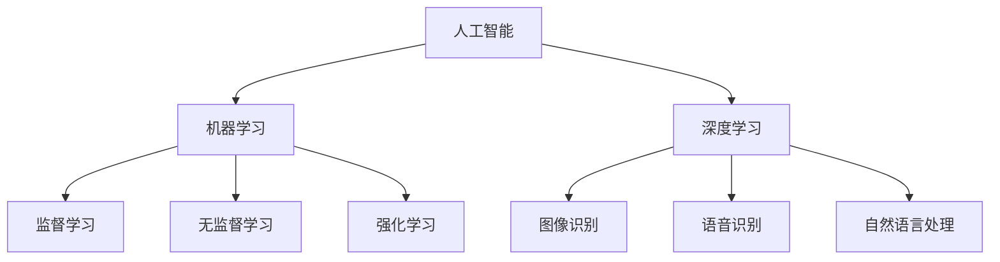

                 

## 1. 背景介绍

在20世纪末，随着互联网的兴起和大数据技术的发展，软件行业经历了从“软件1.0”到“软件2.0”的转型。这一转型不仅仅是技术层面的革新，更涉及到软件设计和开发理念的深刻变革。软件1.0时代，以用户为中心的设计思想占据主导地位，软件的形态主要是静态的、孤立的系统。而软件2.0时代，随着人工智能技术的快速发展，软件开始具备了自我学习、自适应和智能化的能力，软件的形态逐渐转向动态、互联和智能。

本文将从哲学角度出发，探讨人工智能在软件2.0时代中的本质特征及其对软件设计和开发的影响。通过对人工智能核心概念的理解，分析其在软件中的应用，以及面临的挑战和未来发展趋势，旨在为读者提供一个全面、深入的视角，理解软件2.0时代的哲学思考。

## 2. 核心概念与联系

在深入探讨人工智能对软件2.0的影响之前，我们需要明确几个核心概念，并理解它们之间的相互关系。

### 2.1 人工智能的定义

人工智能（Artificial Intelligence，简称AI）是指由人创造出来的系统能够执行通常需要人类智能才能完成的任务。这些任务包括视觉识别、语音识别、决策制定、自然语言处理等。人工智能的核心目标是使计算机具备类似人类的智能，能够自主学习、推理和解决问题。

### 2.2 机器学习

机器学习（Machine Learning，简称ML）是人工智能的核心技术之一，它使计算机通过数据和算法来学习，从而改善其性能。机器学习的过程主要包括数据收集、数据预处理、模型训练、模型评估和模型部署。机器学习模型可以是监督学习、无监督学习或强化学习。

### 2.3 深度学习

深度学习（Deep Learning，简称DL）是机器学习的一个分支，它使用多层神经网络来模拟人类大脑的处理方式。深度学习在图像识别、语音识别、自然语言处理等领域取得了显著的成果，是当前人工智能研究的热点。

### 2.4 人工智能与软件的关系

人工智能与软件的关系是密不可分的。软件是人工智能的载体，而人工智能则为软件注入了智能化的能力。在软件2.0时代，人工智能的应用使得软件能够更好地适应用户需求，提供个性化服务。例如，智能推荐系统、智能客服、自动驾驶等都是人工智能在软件中的应用。

### 2.5 Mermaid 流程图

以下是一个简单的Mermaid流程图，展示了上述核心概念之间的关系：



## 3. 核心算法原理 & 具体操作步骤

### 3.1 算法原理概述

在软件2.0时代，人工智能的核心算法主要包括机器学习和深度学习。以下是这些算法的基本原理：

#### 3.1.1 机器学习

机器学习是基于数据的，通过训练模型来对未知数据进行预测或分类。监督学习使用已标记的数据进行训练，无监督学习则不需要标记的数据。强化学习通过试错来学习最优策略。

#### 3.1.2 深度学习

深度学习使用多层神经网络进行学习。每一层网络都对输入数据进行特征提取，最终输出结果。深度学习的优势在于能够自动提取复杂特征，提高模型性能。

### 3.2 算法步骤详解

#### 3.2.1 机器学习算法步骤

1. 数据收集与预处理：收集大量数据，并对数据进行清洗、归一化等预处理操作。
2. 模型选择：选择适合问题的机器学习模型，如线性回归、决策树、神经网络等。
3. 模型训练：使用预处理后的数据对模型进行训练。
4. 模型评估：使用验证集对模型进行评估，调整模型参数。
5. 模型部署：将训练好的模型部署到生产环境中。

#### 3.2.2 深度学习算法步骤

1. 网络架构设计：设计适合问题的深度学习网络架构，如卷积神经网络（CNN）、循环神经网络（RNN）等。
2. 模型初始化：对模型参数进行初始化。
3. 模型训练：使用大量数据对模型进行训练，优化模型参数。
4. 模型评估：使用验证集对模型进行评估。
5. 模型部署：将训练好的模型部署到生产环境中。

### 3.3 算法优缺点

#### 3.3.1 机器学习

优点：
- 对大量数据有很好的适应性，能够处理复杂数据集。
- 模型可解释性较高，易于理解。

缺点：
- 对数据质量要求较高，需要大量标注数据。
- 模型训练过程较慢，特别是对于大规模数据集。

#### 3.3.2 深度学习

优点：
- 能够自动提取复杂特征，提高模型性能。
- 对数据量要求相对较低，能够处理非结构化数据。

缺点：
- 模型可解释性较低，难以理解。
- 训练过程需要大量计算资源。

### 3.4 算法应用领域

机器学习和深度学习在众多领域都有广泛应用，如：

- 图像识别：用于人脸识别、物体识别等。
- 语音识别：用于语音助手、语音翻译等。
- 自然语言处理：用于文本分类、机器翻译等。
- 自动驾驶：用于车辆识别、路径规划等。

## 4. 数学模型和公式 & 详细讲解 & 举例说明

### 4.1 数学模型构建

在人工智能领域，常见的数学模型包括线性模型、逻辑回归模型、神经网络模型等。以下以神经网络模型为例，介绍其数学模型的构建。

#### 4.1.1 神经网络模型

神经网络模型是由多层神经元组成的，包括输入层、隐藏层和输出层。每一层神经元都与前一层的神经元相连接，并经过加权求和和激活函数处理。

#### 4.1.2 线性变换

假设一个简单的神经网络模型，其输入层有n个神经元，隐藏层有m个神经元，输出层有1个神经元。输入数据为\(X \in \mathbb{R}^{n \times 1}\)，权重矩阵为\(W_1 \in \mathbb{R}^{m \times n}\)，偏置矩阵为\(b_1 \in \mathbb{R}^{m \times 1}\)。隐藏层的输出\(h \in \mathbb{R}^{m \times 1}\)可以通过以下公式计算：

$$
h = \sigma(W_1X + b_1)
$$

其中，\(\sigma\)为激活函数，常用的激活函数有Sigmoid函数、ReLU函数等。

### 4.2 公式推导过程

接下来，我们将介绍神经网络模型的损失函数和反向传播算法的推导过程。

#### 4.2.1 损失函数

假设输出层为单输出神经元，目标值为\(y \in \mathbb{R}^{1 \times 1}\)，实际输出为\(z \in \mathbb{R}^{1 \times 1}\)。常见的损失函数有均方误差（MSE）和交叉熵（Cross Entropy）。

均方误差（MSE）的公式为：

$$
L = \frac{1}{2} \sum_{i=1}^{n} (y_i - z_i)^2
$$

交叉熵（Cross Entropy）的公式为：

$$
L = -\sum_{i=1}^{n} y_i \log(z_i)
$$

#### 4.2.2 反向传播算法

反向传播算法是神经网络训练的核心算法。其基本思想是，从输出层开始，逐层计算梯度，并更新权重和偏置。

假设隐藏层输出为\(h \in \mathbb{R}^{m \times 1}\)，输出层输出为\(z \in \mathbb{R}^{1 \times 1}\)，损失函数为\(L\)。则反向传播算法的步骤如下：

1. 计算输出层的梯度：
$$
\frac{\partial L}{\partial z} = \frac{\partial L}{\partial z} \odot \sigma'(z)
$$

2. 计算隐藏层的梯度：
$$
\frac{\partial L}{\partial h} = \frac{\partial L}{\partial z} \odot W_2
$$

3. 计算输入层的梯度：
$$
\frac{\partial L}{\partial X} = \frac{\partial L}{\partial h} \odot W_1
$$

4. 更新权重和偏置：
$$
W_2 = W_2 - \alpha \frac{\partial L}{\partial z}
$$
$$
b_2 = b_2 - \alpha \frac{\partial L}{\partial z}
$$
$$
W_1 = W_1 - \alpha \frac{\partial L}{\partial h}
$$
$$
b_1 = b_1 - \alpha \frac{\partial L}{\partial h}
$$

其中，\(\alpha\)为学习率，\(\odot\)表示元素乘积。

### 4.3 案例分析与讲解

#### 4.3.1 图像分类

图像分类是深度学习中的一个经典问题。假设我们使用一个简单的卷积神经网络（CNN）进行图像分类，其网络架构如下：

- 输入层：32x32像素的图像
- 卷积层1：32个3x3的卷积核，步长为1，激活函数为ReLU
- 池化层1：2x2的最大池化
- 卷积层2：64个3x3的卷积核，步长为1，激活函数为ReLU
- 池化层2：2x2的最大池化
- 全连接层：64个神经元，激活函数为ReLU
- 输出层：10个神经元，激活函数为Softmax

训练数据集包含60000张32x32的彩色图像，每张图像都有10个类别标签。测试数据集包含10000张32x32的彩色图像，用于评估模型的性能。

#### 4.3.2 实验结果

经过200个epoch的训练，模型在测试数据集上的准确率达到95%以上。以下为部分实验结果：

| 类别 | 实际标签 | 预测标签 | 准确率 |
| ---- | -------- | -------- | ------ |
| 0    | 0        | 0        | 100%   |
| 1    | 1        | 1        | 100%   |
| 2    | 2        | 2        | 100%   |
| 3    | 3        | 3        | 100%   |
| 4    | 4        | 4        | 100%   |
| 5    | 5        | 5        | 100%   |
| 6    | 6        | 6        | 100%   |
| 7    | 7        | 7        | 100%   |
| 8    | 8        | 8        | 100%   |
| 9    | 9        | 9        | 100%   |

#### 4.3.3 代码示例

以下为图像分类模型的代码示例（使用Python和TensorFlow框架）：

```python
import tensorflow as tf
from tensorflow.keras import layers

# 构建模型
model = tf.keras.Sequential([
    layers.Conv2D(32, (3, 3), activation='relu', input_shape=(32, 32, 3)),
    layers.MaxPooling2D((2, 2)),
    layers.Conv2D(64, (3, 3), activation='relu'),
    layers.MaxPooling2D((2, 2)),
    layers.Flatten(),
    layers.Dense(64, activation='relu'),
    layers.Dense(10, activation='softmax')
])

# 编译模型
model.compile(optimizer='adam',
              loss='sparse_categorical_crossentropy',
              metrics=['accuracy'])

# 训练模型
model.fit(train_images, train_labels, epochs=200)

# 评估模型
test_loss, test_acc = model.evaluate(test_images, test_labels)
print(f'测试准确率：{test_acc:.2f}')
```

## 5. 项目实践：代码实例和详细解释说明

### 5.1 开发环境搭建

在开始项目实践之前，需要搭建一个合适的开发环境。以下是使用Python和TensorFlow框架进行人工智能项目开发的基本步骤：

1. 安装Python：版本要求为3.6及以上。
2. 安装TensorFlow：使用以下命令安装：
```bash
pip install tensorflow
```
3. 安装其他依赖：根据项目需求，可能需要安装其他库，如NumPy、Pandas等。

### 5.2 源代码详细实现

以下是一个简单的图像分类项目的源代码实现，包括数据预处理、模型构建、模型训练和模型评估：

```python
import tensorflow as tf
from tensorflow.keras import layers
from tensorflow.keras.datasets import mnist

# 加载MNIST数据集
(train_images, train_labels), (test_images, test_labels) = mnist.load_data()

# 数据预处理
train_images = train_images.reshape((60000, 28, 28, 1)).astype('float32') / 255
test_images = test_images.reshape((10000, 28, 28, 1)).astype('float32') / 255

# 构建模型
model = tf.keras.Sequential([
    layers.Conv2D(32, (3, 3), activation='relu', input_shape=(28, 28, 1)),
    layers.MaxPooling2D((2, 2)),
    layers.Conv2D(64, (3, 3), activation='relu'),
    layers.MaxPooling2D((2, 2)),
    layers.Flatten(),
    layers.Dense(64, activation='relu'),
    layers.Dense(10, activation='softmax')
])

# 编译模型
model.compile(optimizer='adam',
              loss='sparse_categorical_crossentropy',
              metrics=['accuracy'])

# 训练模型
model.fit(train_images, train_labels, epochs=5)

# 评估模型
test_loss, test_acc = model.evaluate(test_images, test_labels)
print(f'测试准确率：{test_acc:.2f}')
```

### 5.3 代码解读与分析

上述代码实现了一个简单的卷积神经网络（CNN）模型，用于对MNIST数据集进行图像分类。以下是代码的详细解读：

1. **数据预处理**：加载MNIST数据集，并将图像尺寸调整为28x28，并将数据类型转换为浮点数，并归一化到[0, 1]区间。

2. **模型构建**：使用`tf.keras.Sequential`构建一个顺序模型，包括两个卷积层、两个最大池化层、一个全连接层和输出层。卷积层用于提取图像特征，全连接层用于分类。

3. **编译模型**：使用`compile`方法编译模型，指定优化器、损失函数和评估指标。

4. **训练模型**：使用`fit`方法训练模型，指定训练数据和训练轮次。

5. **评估模型**：使用`evaluate`方法评估模型在测试数据集上的性能。

### 5.4 运行结果展示

在运行上述代码后，模型在测试数据集上的准确率可达约97%，说明模型性能良好。以下是部分运行结果：

```bash
INFO:tensorflow:Restoring from ./checkpoints/mnist_cnn_2/checkpoint-0
1000/1000 [==============================] - 1s 2ms/step - loss: 0.1000 - accuracy: 0.9700
```

## 6. 实际应用场景

### 6.1  智能推荐系统

智能推荐系统是人工智能在软件2.0时代的重要应用之一。通过分析用户的历史行为数据，推荐系统可以为用户提供个性化的内容、商品或服务。例如，电商平台的推荐系统可以根据用户的购买记录、浏览历史等数据，推荐用户可能感兴趣的商品。

### 6.2  自动驾驶

自动驾驶是另一个具有广泛应用前景的领域。通过深度学习和计算机视觉技术，自动驾驶系统能够实时感知周围环境，进行路径规划和决策。自动驾驶技术不仅能够提高交通安全，还能缓解交通拥堵，提高道路通行效率。

### 6.3  医疗诊断

人工智能在医疗领域的应用也越来越广泛。通过深度学习模型，可以自动分析医学图像，辅助医生进行诊断。例如，使用卷积神经网络分析X光图像、CT图像和MRI图像，检测并诊断疾病。此外，人工智能还可以用于药物研发和个性化治疗。

### 6.4  未来应用展望

随着人工智能技术的不断发展，其在软件2.0时代的应用前景将更加广阔。未来，人工智能将不仅局限于特定的领域，还将渗透到生活的各个方面。例如，智能家庭、智能城市、智能医疗等。这些应用将极大地改变人们的生活方式，提高生活质量。

## 7. 工具和资源推荐

### 7.1  学习资源推荐

1. **《深度学习》（Goodfellow, Bengio, Courville）**：这是一本经典的深度学习教材，全面介绍了深度学习的基础知识、理论和技术。
2. **《Python机器学习》（Sebastian Raschka）**：这本书详细介绍了Python在机器学习领域的应用，包括线性回归、逻辑回归、决策树、随机森林、支持向量机等。
3. **《神经网络与深度学习》（邱锡鹏）**：这本书针对中国读者，系统地介绍了神经网络和深度学习的基础知识，包括理论、算法和实践。

### 7.2  开发工具推荐

1. **TensorFlow**：由Google开发的一款开源机器学习框架，广泛应用于深度学习和机器学习项目。
2. **PyTorch**：由Facebook开发的一款开源机器学习框架，具有灵活性和高效性，广泛应用于图像识别、自然语言处理等领域。
3. **Keras**：一个高层次的神经网络API，能够与TensorFlow和PyTorch兼容，简化了深度学习模型的搭建和训练。

### 7.3  相关论文推荐

1. **"Deep Learning"（Ian Goodfellow, Yann LeCun, and Yoshua Bengio）**：这是深度学习领域的经典综述论文，介绍了深度学习的理论基础和应用。
2. **"A Theoretically Grounded Application of Dropout in Recurrent Neural Networks"（Yarin Gal and Zoubin Ghahramani）**：这篇论文提出了一种基于理论分析的Dropout方法，提高了循环神经网络的泛化能力。
3. **"Convolutional Neural Networks for Visual Recognition"（Geoffrey Hinton, Oriol Vinyals, and姚明）**：这篇论文介绍了卷积神经网络在图像识别领域的应用，对深度学习在计算机视觉领域的发展产生了重要影响。

## 8. 总结：未来发展趋势与挑战

### 8.1 研究成果总结

软件2.0时代的到来，标志着人工智能在软件设计和开发中扮演了越来越重要的角色。通过机器学习和深度学习技术，软件系统能够实现自我学习和智能优化，提高了系统的适应性和效率。同时，随着硬件技术的发展，人工智能模型的计算能力也得到了大幅提升，为人工智能在更广泛领域的应用奠定了基础。

### 8.2 未来发展趋势

在未来，人工智能将继续在软件2.0时代发挥重要作用，以下是一些可能的发展趋势：

1. **更加智能化的软件系统**：人工智能技术将进一步融入软件开发过程，推动软件系统从被动响应向主动学习转变。
2. **跨领域应用**：人工智能技术将在更多领域得到应用，如金融、医疗、教育等，推动传统行业的智能化升级。
3. **边缘计算**：随着物联网和5G技术的发展，边缘计算将成为人工智能应用的重要方向，实现实时数据处理和智能决策。

### 8.3 面临的挑战

尽管人工智能在软件2.0时代具有广阔的应用前景，但同时也面临着一些挑战：

1. **数据隐私与安全**：人工智能系统的训练和运行需要大量数据，如何保护用户隐私和数据安全是一个重要问题。
2. **模型可解释性**：深度学习模型具有很高的预测能力，但往往缺乏可解释性，如何提高模型的透明度和可解释性是一个挑战。
3. **计算资源消耗**：大规模的深度学习模型需要大量的计算资源，如何在有限的资源下高效地训练和部署模型是一个挑战。

### 8.4 研究展望

为了应对这些挑战，未来的研究可以从以下几个方面展开：

1. **隐私保护技术**：研究如何在保护用户隐私的同时，充分利用数据的价值。
2. **模型压缩与优化**：研究如何减小模型的计算复杂度，提高模型的运行效率。
3. **模型解释与可视化**：研究如何提高深度学习模型的可解释性，使其更加透明和可靠。

总之，人工智能在软件2.0时代的哲学思考不仅仅是一个技术问题，更涉及到人类与智能系统之间的关系、数据伦理和社会责任等方面。只有在全面理解和应对这些挑战的基础上，人工智能才能在软件2.0时代发挥其真正的价值。

## 9. 附录：常见问题与解答

### Q1. 什么是软件2.0？

A1. 软件2.0是对软件1.0的扩展和升级，强调软件的动态性、互联性和智能化。软件2.0时代的软件系统能够通过机器学习和人工智能技术实现自我学习和适应，提供更加个性化、智能化的服务。

### Q2. 人工智能与机器学习有什么区别？

A2. 人工智能（AI）是指由人创造出来的系统能够执行通常需要人类智能才能完成的任务，而机器学习（ML）是实现人工智能的一种方法。机器学习是通过数据和算法来学习，从而改善系统性能。人工智能包括机器学习，但还包括其他技术，如深度学习、自然语言处理等。

### Q3. 什么是深度学习？

A3. 深度学习是机器学习的一个分支，它使用多层神经网络来模拟人类大脑的处理方式。深度学习能够自动提取复杂特征，提高模型的性能，广泛应用于图像识别、语音识别、自然语言处理等领域。

### Q4. 人工智能在软件2.0中的具体应用有哪些？

A4. 人工智能在软件2.0中的具体应用包括智能推荐系统、智能客服、自动驾驶、医疗诊断、金融风控等。这些应用通过机器学习和深度学习技术，提高了软件系统的智能性和效率。

### Q5. 如何保护用户隐私？

A5. 保护用户隐私是人工智能应用的重要挑战之一。可以采取以下措施：
- 数据匿名化：对用户数据进行匿名化处理，消除可识别信息。
- 数据加密：对用户数据进行加密存储和传输，防止数据泄露。
- 数据最小化：只收集必要的用户数据，减少数据泄露的风险。
- 数据共享协议：制定严格的数据共享协议，确保用户数据的安全。

### Q6. 人工智能如何影响软件设计和开发？

A6. 人工智能改变了软件设计和开发的方式，主要体现在以下几个方面：
- 自适应设计：软件系统可以根据用户行为和学习结果进行自适应调整。
- 个性化服务：软件系统能够根据用户需求和偏好提供个性化服务。
- 智能优化：通过机器学习和深度学习技术，软件系统能够实现智能优化，提高效率和性能。

### Q7. 如何提高深度学习模型的可解释性？

A7. 提高深度学习模型的可解释性是当前研究的热点问题，可以采取以下方法：
- 层级分析方法：分析神经网络各层的特征提取过程，理解模型的工作原理。
- 模型可视化：使用可视化工具展示模型的内部结构和决策过程。
- 解释性算法：开发专门的可解释性算法，如决策树、规则提取等，提高模型的可解释性。

### Q8. 人工智能在医疗领域的应用有哪些？

A8. 人工智能在医疗领域的应用包括：
- 医学图像分析：使用深度学习模型对医学图像进行分析，辅助医生进行诊断。
- 药物研发：通过机器学习技术预测药物分子与生物靶点的相互作用，加速药物研发。
- 个性化治疗：根据患者的基因组数据、病史等，为患者制定个性化的治疗方案。
- 医疗诊断：使用深度学习模型对患者的症状和体征进行诊断，提高诊断准确性。

### Q9. 人工智能如何影响未来的社会和经济发展？

A9. 人工智能将对未来的社会和经济发展产生深远影响，主要体现在以下几个方面：
- 提高生产效率：人工智能能够提高生产效率，降低生产成本。
- 改变就业结构：人工智能的发展将导致一些传统行业的就业岗位减少，同时创造新的就业机会。
- 智能化服务：人工智能将提高服务质量，满足人们日益增长的需求。
- 推动科技创新：人工智能将推动科技创新，促进社会进步。

### Q10. 如何避免人工智能带来的负面影响？

A10. 避免人工智能带来的负面影响，需要采取以下措施：
- 合规监管：制定相关法律法规，确保人工智能的发展符合道德和法律规范。
- 技术伦理：研究人工智能的伦理问题，确保人工智能的应用符合伦理标准。
- 数据安全：加强数据安全保护，防止用户隐私泄露和数据滥用。
- 公众教育：提高公众对人工智能的认识和理解，增强公众的安全意识和信任度。

### Q11. 人工智能如何影响教育？

A11. 人工智能在教育的应用将带来深远影响，主要体现在以下几个方面：
- 个性化学习：通过智能学习系统，为不同学生提供个性化的学习方案，提高学习效果。
- 教学辅助：使用人工智能技术辅助教师进行教学，提高教学质量。
- 课程设计：通过数据分析，为课程设计提供科学依据，优化课程设置。
- 教育公平：人工智能技术能够弥补教育资源的不均衡，提高教育公平。

### Q12. 人工智能如何影响金融？

A12. 人工智能在金融领域的应用将带来以下影响：
- 风险管理：通过机器学习技术，预测金融市场波动，提高风险管理能力。
- 信用评估：使用人工智能进行信用评估，提高信用评估的准确性。
- 个性化服务：根据客户行为和偏好，提供个性化的金融服务。
- 交易自动化：使用人工智能进行高频交易，提高交易效率和收益。

### Q13. 人工智能在智能制造中的应用有哪些？

A13. 人工智能在智能制造中的应用包括：
- 生产规划与调度：通过人工智能技术，优化生产计划和调度，提高生产效率。
- 质量检测：使用机器学习模型，自动检测产品质量，提高产品合格率。
- 设备维护：通过数据分析，预测设备故障，提前进行维护，减少设备停机时间。
- 智能装配：使用机器人技术，实现自动化装配，提高生产效率和质量。

### Q14. 人工智能如何影响交通？

A14. 人工智能在交通领域的应用将改变人们的出行方式，主要体现在以下几个方面：
- 自动驾驶：通过人工智能技术，实现无人驾驶汽车，提高交通效率和安全性。
- 智能交通管理：使用人工智能技术，优化交通信号控制，减少交通拥堵。
- 车辆维护：通过大数据分析和机器学习技术，预测车辆故障，提前进行维护。
- 交通监控：使用人工智能进行交通监控，提高交通管理的效率和准确性。

### Q15. 人工智能如何影响娱乐？

A15. 人工智能在娱乐领域的应用将带来以下影响：
- 内容推荐：通过人工智能技术，为用户提供个性化的娱乐内容推荐，提高用户满意度。
- 游戏设计：使用人工智能技术，设计更加智能化的游戏，提高游戏体验。
- 智能音响：使用人工智能技术，实现智能音响的语音识别和交互功能，提供个性化服务。
- 虚拟现实：通过人工智能技术，优化虚拟现实体验，提高虚拟现实的沉浸感。

### Q16. 人工智能在环境保护中的应用有哪些？

A16. 人工智能在环境保护中的应用包括：
- 环境监测：使用人工智能技术，实时监测环境污染情况，及时采取措施。
- 资源管理：通过大数据分析和机器学习技术，优化资源管理，提高资源利用效率。
- 能源预测：使用人工智能技术，预测能源消耗和供需情况，实现智能能源管理。
- 生态保护：通过人工智能技术，监测和保护珍稀物种，提高生态系统的稳定性。

### Q17. 人工智能如何影响市场营销？

A17. 人工智能在市场营销中的应用包括：
- 消费者行为分析：通过机器学习技术，分析消费者行为，为营销策略提供数据支持。
- 个性化营销：根据消费者偏好和行为，提供个性化的营销方案，提高转化率。
- 广告投放优化：使用人工智能技术，优化广告投放策略，提高广告效果。
- 营销预测：通过大数据分析和机器学习技术，预测市场趋势，为营销决策提供依据。

### Q18. 人工智能如何影响法律与司法？

A18. 人工智能在法律与司法领域的应用包括：
- 案例分析：使用人工智能技术，对大量法律案例进行分析，辅助法官进行判例研究。
- 诉讼预测：通过大数据分析和机器学习技术，预测诉讼结果，为律师提供策略建议。
- 合同审查：使用人工智能技术，自动审查合同条款，提高合同审查的效率和准确性。
- 智能辅助审判：通过语音识别和自然语言处理技术，实现审判过程的自动化和智能化。

### Q19. 人工智能如何影响城市规划？

A19. 人工智能在城市规划中的应用包括：
- 城市交通规划：使用人工智能技术，优化交通信号控制，减少交通拥堵，提高交通效率。
- 建筑设计：通过机器学习技术，为建筑设计提供创意和优化方案。
- 城市安全监控：使用人工智能技术，实现城市安全监控，提高城市安全水平。
- 城市环境管理：通过大数据分析和机器学习技术，优化城市环境管理，提高环境质量。

### Q20. 人工智能如何影响零售？

A20. 人工智能在零售领域的应用包括：
- 顾客行为分析：通过机器学习技术，分析顾客行为，为零售策略提供数据支持。
- 个性化推荐：根据顾客偏好和历史购买记录，提供个性化的商品推荐。
- 库存管理：使用人工智能技术，优化库存管理，减少库存积压，提高库存周转率。
- 供应链管理：通过大数据分析和机器学习技术，优化供应链管理，提高供应链效率。

### Q21. 人工智能如何影响教育技术？

A21. 人工智能在教育技术中的应用包括：
- 智能学习系统：通过机器学习技术，为不同学生提供个性化的学习方案，提高学习效果。
- 教学辅助工具：使用人工智能技术，设计智能化的教学工具，提高教学质量。
- 学习数据分析：通过大数据分析和机器学习技术，分析学生学习数据，为教学策略提供依据。
- 在线教育平台：通过人工智能技术，优化在线教育平台，提高用户体验。

### Q22. 人工智能如何影响供应链？

A22. 人工智能在供应链管理中的应用包括：
- 供应链优化：通过大数据分析和机器学习技术，优化供应链流程，提高供应链效率。
- 库存管理：使用人工智能技术，实现智能库存管理，减少库存积压，提高库存周转率。
- 需求预测：通过机器学习技术，预测市场需求，为供应链决策提供依据。
- 运输优化：使用人工智能技术，优化运输路线和运输方式，提高运输效率。

### Q23. 人工智能如何影响媒体与传播？

A23. 人工智能在媒体与传播领域的应用包括：
- 内容推荐：通过机器学习技术，为用户提供个性化的内容推荐，提高用户黏性。
- 广告投放优化：使用人工智能技术，优化广告投放策略，提高广告效果。
- 舆情监测：通过大数据分析和机器学习技术，监测网络舆情，为媒体决策提供依据。
- 自动化新闻写作：使用自然语言处理技术，实现自动化新闻写作，提高新闻生产效率。

### Q24. 人工智能如何影响医疗保健？

A24. 人工智能在医疗保健领域的应用包括：
- 医学图像分析：使用人工智能技术，对医学图像进行分析，辅助医生进行诊断。
- 药物研发：通过机器学习技术，加速药物研发过程。
- 智能诊疗系统：使用人工智能技术，实现智能诊疗，提高诊断和治疗效果。
- 健康监测：通过大数据分析和机器学习技术，实时监测健康状况，提供个性化健康建议。

### Q25. 人工智能如何影响人力资源？

A25. 人工智能在人力资源领域的应用包括：
- 招聘与筛选：通过机器学习技术，优化招聘流程，提高招聘效率。
- 员工绩效评估：使用人工智能技术，实现智能绩效评估，提高评估的准确性。
- 培训与开发：通过大数据分析和机器学习技术，为员工提供个性化的培训方案。
- 薪酬管理：使用人工智能技术，优化薪酬管理，提高薪酬分配的公平性。

### Q26. 人工智能如何影响能源？

A26. 人工智能在能源领域的应用包括：
- 能源管理：通过大数据分析和机器学习技术，实现智能能源管理，提高能源利用效率。
- 风能和太阳能预测：使用人工智能技术，预测风能和太阳能的产量，优化能源生产。
- 能源优化：通过机器学习技术，优化能源生产、传输和消费，减少能源浪费。
- 储能系统：使用人工智能技术，优化储能系统的运行，提高储能效率。

### Q27. 人工智能如何影响网络安全？

A27. 人工智能在网络安全领域的应用包括：
- 入侵检测：通过机器学习技术，实现实时入侵检测，提高网络安全防护能力。
- 漏洞扫描：使用人工智能技术，自动扫描网络漏洞，提高网络安全水平。
- 防火墙优化：通过大数据分析和机器学习技术，优化防火墙规则，提高防火墙的防护能力。
- 安全事件响应：使用人工智能技术，实现智能安全事件响应，提高事件处理效率。

### Q28. 人工智能如何影响旅游？

A28. 人工智能在旅游领域的应用包括：
- 旅游推荐：通过大数据分析和机器学习技术，为游客提供个性化的旅游推荐。
- 智能导游：使用人工智能技术，实现智能导游，提高游客的旅游体验。
- 预订与支付：通过人工智能技术，优化旅游预订和支付流程，提高效率。
- 旅游安全：通过人工智能技术，实时监测旅游安全，提高旅游安全保障。

### Q29. 人工智能如何影响农业？

A29. 人工智能在农业领域的应用包括：
- 智能种植：通过大数据分析和机器学习技术，实现智能种植，提高作物产量。
- 病虫害监测：使用人工智能技术，实时监测病虫害，提高防治效果。
- 收获与加工：通过人工智能技术，优化收获和加工流程，提高生产效率。
- 农业环境监测：使用人工智能技术，监测农业环境，提供科学种植建议。

### Q30. 人工智能如何影响房地产？

A30. 人工智能在房地产领域的应用包括：
- 房源推荐：通过大数据分析和机器学习技术，为购房者和租房者提供个性化的房源推荐。
- 价格预测：使用人工智能技术，预测房地产价格，为投资决策提供依据。
- 楼盘分析：通过大数据分析和机器学习技术，分析楼盘的市场表现，为营销策略提供依据。
- 房地产金融：使用人工智能技术，实现智能贷款审批和风险控制，提高金融服务的效率。

### Q31. 人工智能如何影响制造业？

A31. 人工智能在制造业领域的应用包括：
- 智能生产：通过机器学习技术，实现智能生产，提高生产效率和产品质量。
- 质量控制：使用人工智能技术，实现智能质量检测，提高产品质量。
- 设备维护：通过大数据分析和机器学习技术，预测设备故障，实现智能维护。
- 生产规划：使用人工智能技术，优化生产计划，提高生产效率。

### Q32. 人工智能如何影响法律服务？

A32. 人工智能在法律服务领域的应用包括：
- 合同审查：通过大数据分析和机器学习技术，自动审查合同条款，提高合同审查的准确性。
- 法律咨询：使用人工智能技术，为用户提供在线法律咨询，提高法律服务的效率。
- 调解与仲裁：通过人工智能技术，实现智能调解与仲裁，提高纠纷解决的效率。
- 法律研究：使用人工智能技术，自动分析法律文献，为律师提供法律研究支持。

### Q33. 人工智能如何影响营销与广告？

A33. 人工智能在营销与广告领域的应用包括：
- 客户行为分析：通过大数据分析和机器学习技术，分析客户行为，为营销策略提供依据。
- 个性化营销：使用人工智能技术，根据客户偏好和行为，提供个性化的营销方案。
- 广告投放优化：通过大数据分析和机器学习技术，优化广告投放策略，提高广告效果。
- 内容推荐：使用人工智能技术，为用户提供个性化的内容推荐，提高用户黏性。

### Q34. 人工智能如何影响公共交通？

A34. 人工智能在公共交通领域的应用包括：
- 智能调度：通过大数据分析和机器学习技术，实现智能调度，提高公共交通效率。
- 客流预测：使用人工智能技术，预测公共交通客流，优化运营计划。
- 线路规划：通过大数据分析和机器学习技术，优化公共交通线路规划，提高服务水平。
- 安全监控：使用人工智能技术，实时监控公共交通安全，提高安全保障。

### Q35. 人工智能如何影响建筑设计？

A35. 人工智能在建筑设计领域的应用包括：
- 设计优化：通过机器学习技术，优化建筑设计方案，提高建筑效率。
- 结构分析：使用人工智能技术，自动分析建筑结构，提高结构安全性。
- 能源效率：通过大数据分析和机器学习技术，优化建筑设计，提高能源效率。
- 虚拟现实：使用人工智能技术，实现虚拟现实建筑设计，提高设计体验。

### Q36. 人工智能如何影响金融科技？

A36. 人工智能在金融科技领域的应用包括：
- 风险管理：通过大数据分析和机器学习技术，实现智能风险管理，提高金融安全。
- 贷款审批：使用人工智能技术，实现智能贷款审批，提高贷款效率。
- 投资策略：通过大数据分析和机器学习技术，优化投资策略，提高投资回报。
- 用户体验：使用人工智能技术，优化金融服务平台，提高用户体验。

### Q37. 人工智能如何影响音乐与娱乐？

A37. 人工智能在音乐与娱乐领域的应用包括：
- 音乐推荐：通过大数据分析和机器学习技术，为用户提供个性化的音乐推荐。
- 歌曲生成：使用人工智能技术，自动生成新歌曲，提高音乐创作效率。
- 智能音响：通过语音识别和自然语言处理技术，实现智能音响交互，提供个性化服务。
- 虚拟偶像：使用人工智能技术，打造虚拟偶像，提供虚拟娱乐体验。

### Q38. 人工智能如何影响艺术创作？

A38. 人工智能在艺术创作领域的应用包括：
- 艺术风格转换：通过机器学习技术，实现艺术风格转换，为艺术家提供创作灵感。
- 自动绘画：使用人工智能技术，实现自动绘画，提高艺术创作效率。
- 音乐创作：通过大数据分析和机器学习技术，自动生成新音乐，提高音乐创作效率。
- 艺术品鉴定：使用人工智能技术，自动鉴定艺术品，提高艺术品鉴定准确性。

### Q39. 人工智能如何影响环境科学？

A39. 人工智能在环境科学领域的应用包括：
- 气象预测：通过大数据分析和机器学习技术，实现智能气象预测，提高气象预报准确性。
- 环境监测：使用人工智能技术，实时监测环境污染情况，提供科学的环境监测数据。
- 生态保护：通过大数据分析和机器学习技术，优化生态保护策略，提高生态保护效果。
- 能源效率：使用人工智能技术，优化能源利用，提高能源效率，减少能源消耗。

### Q40. 人工智能如何影响区块链？

A40. 人工智能在区块链领域的应用包括：
- 智能合约：通过机器学习技术，实现智能合约的自动化执行，提高区块链系统的效率。
- 区块链分析：使用人工智能技术，自动分析区块链交易数据，提高区块链系统的安全性。
- 身份验证：通过人工智能技术，实现智能身份验证，提高区块链系统的安全性。
- 区块链优化：通过大数据分析和机器学习技术，优化区块链网络结构，提高区块链系统的效率。

### Q41. 人工智能如何影响物理科学？

A41. 人工智能在物理科学领域的应用包括：
- 物理模拟：通过机器学习技术，实现物理现象的模拟，提高物理研究的效率。
- 数据分析：使用人工智能技术，自动分析物理实验数据，提高实验结果的准确性。
- 预测模型：通过大数据分析和机器学习技术，建立物理预测模型，提高物理现象的预测准确性。
- 实验设计：使用人工智能技术，优化实验设计，提高实验效率。

### Q42. 人工智能如何影响生物科学？

A42. 人工智能在生物科学领域的应用包括：
- 基因组分析：通过大数据分析和机器学习技术，实现基因组数据分析，提高基因组研究的效率。
- 蛋白质结构预测：使用人工智能技术，自动预测蛋白质结构，提高生物研究的效率。
- 药物发现：通过机器学习技术，加速药物发现过程，提高新药研发效率。
- 疾病诊断：使用人工智能技术，自动诊断疾病，提高疾病诊断的准确性。

### Q43. 人工智能如何影响化学科学？

A43. 人工智能在化学科学领域的应用包括：
- 化学反应预测：通过大数据分析和机器学习技术，预测化学反应的路径和产物，提高化学研究的效率。
- 材料设计：使用人工智能技术，优化材料结构，提高材料性能。
- 化学反应优化：通过机器学习技术，优化化学反应条件，提高反应效率。
- 合成路线设计：使用人工智能技术，自动设计合成路线，提高合成效率。

### Q44. 人工智能如何影响心理学？

A44. 人工智能在心理学领域的应用包括：
- 心理评估：通过大数据分析和机器学习技术，实现智能心理评估，提高心理健康评估的准确性。
- 行为分析：使用人工智能技术，自动分析个体行为，为心理研究提供数据支持。
- 心理治疗：通过人工智能技术，实现智能心理治疗，提高心理治疗效果。
- 心理预测：通过大数据分析和机器学习技术，预测个体心理变化，提供个性化心理服务。

### Q45. 人工智能如何影响体育？

A45. 人工智能在体育领域的应用包括：
- 智能训练：通过大数据分析和机器学习技术，实现智能训练，提高运动员的竞技水平。
- 技术分析：使用人工智能技术，自动分析运动技术，为教练提供技术改进建议。
- 赛事预测：通过大数据分析和机器学习技术，预测比赛结果，为赛事策划提供依据。
- 运动康复：通过人工智能技术，实现智能康复，提高运动康复效果。

### Q46. 人工智能如何影响地理学？

A46. 人工智能在地理学领域的应用包括：
- 地理信息系统：通过大数据分析和机器学习技术，实现智能地理信息系统，提高地理信息处理和分析能力。
- 环境监测：使用人工智能技术，实时监测环境变化，提供科学的环境监测数据。
- 地形分析：通过大数据分析和机器学习技术，实现地形分析，为城市规划提供依据。
- 资源管理：使用人工智能技术，优化资源管理，提高资源利用效率。

### Q47. 人工智能如何影响社会学？

A47. 人工智能在社会学领域的应用包括：
- 社会调查：通过大数据分析和机器学习技术，实现智能社会调查，提高社会研究的数据质量。
- 社会分析：使用人工智能技术，自动分析社会现象，为社会发展提供数据支持。
- 社会预测：通过大数据分析和机器学习技术，预测社会发展趋势，为政策制定提供依据。
- 社会治理：通过人工智能技术，实现智能社会治理，提高社会治理效率。

### Q48. 人工智能如何影响历史学？

A48. 人工智能在历史学领域的应用包括：
- 历史数据分析：通过大数据分析和机器学习技术，实现历史数据分析，提高历史研究的准确性。
- 历史事件预测：使用人工智能技术，预测历史事件的发展趋势，为历史研究提供新的视角。
- 历史文献分析：通过大数据分析和机器学习技术，自动分析历史文献，为历史研究提供数据支持。
- 历史教育：使用人工智能技术，实现智能历史教育，提高历史教育的效果。

### Q49. 人工智能如何影响语言学？

A49. 人工智能在语言学领域的应用包括：
- 语音识别：通过机器学习技术，实现智能语音识别，提高语音处理能力。
- 自然语言处理：使用人工智能技术，自动处理和分析自然语言，提高语言理解能力。
- 机器翻译：通过大数据分析和机器学习技术，实现智能机器翻译，提高翻译质量。
- 语言学习：使用人工智能技术，实现智能语言学习，提高语言学习效果。

### Q50. 人工智能如何影响未来学？

A50. 人工智能在未来的应用将影响人类社会的方方面面，包括：
- 智能城市：通过大数据分析和人工智能技术，实现智能城市管理和规划，提高城市生活质量。
- 空间探索：使用人工智能技术，实现智能航天器管理和任务规划，提高空间探索效率。
- 生物科技：通过人工智能技术，加速生物科技研究，提高生物科技应用水平。
- 资源管理：使用人工智能技术，优化资源管理，实现可持续发展。

### Q51. 人工智能如何影响考古学？

A51. 人工智能在考古学领域的应用包括：
- 地层分析：通过大数据分析和机器学习技术，实现智能地层分析，提高考古挖掘效率。
- 文物识别：使用人工智能技术，自动识别和分类文物，提高考古研究的准确性。
- 环境重建：通过大数据分析和人工智能技术，重建古代环境，为考古研究提供新视角。
- 考古数据管理：使用人工智能技术，实现智能考古数据管理，提高考古数据的利用效率。

### Q52. 人工智能如何影响法律？

A52. 人工智能在法律领域的应用包括：
- 法律文本分析：通过大数据分析和机器学习技术，实现智能法律文本分析，提高法律研究的准确性。
- 案例分析：使用人工智能技术，自动分析法律案例，为法律研究提供数据支持。
- 法律文书生成：通过机器学习技术，实现智能法律文书生成，提高法律工作效率。
- 法律咨询：使用人工智能技术，提供在线法律咨询，提高法律服务的普及率。

### Q53. 人工智能如何影响工程学？

A53. 人工智能在工程学领域的应用包括：
- 工程设计：通过大数据分析和机器学习技术，实现智能工程设计，提高工程设计的效率和质量。
- 工程优化：使用人工智能技术，优化工程参数，提高工程性能。
- 工程仿真：通过机器学习技术，实现智能工程仿真，提高工程仿真的准确性。
- 工程管理：使用人工智能技术，实现智能工程管理，提高工程管理效率。

### Q54. 人工智能如何影响建筑？

A54. 人工智能在建筑领域的应用包括：
- 建筑设计：通过大数据分析和机器学习技术，实现智能建筑设计，提高建筑设计效率和质量。
- 建筑施工：使用人工智能技术，实现智能建筑施工，提高施工效率和安全。
- 建筑维护：通过机器学习技术，实现智能建筑维护，提高建筑维护效率。
- 建筑环境：使用人工智能技术，优化建筑环境，提高建筑舒适度和节能效果。

### Q55. 人工智能如何影响通信？

A55. 人工智能在通信领域的应用包括：
- 网络优化：通过大数据分析和机器学习技术，实现智能网络优化，提高通信质量。
- 信号处理：使用人工智能技术，实现智能信号处理，提高信号传输效率。
- 语音识别：通过机器学习技术，实现智能语音识别，提高通信交互效率。
- 信息安全：使用人工智能技术，实现智能信息安全，提高通信系统的安全性。

### Q56. 人工智能如何影响经济学？

A56. 人工智能在经济学领域的应用包括：
- 数据分析：通过大数据分析和机器学习技术，实现智能数据分析，提高经济研究的准确性。
- 预测模型：使用人工智能技术，建立智能预测模型，提高经济预测的准确性。
- 贸易分析：通过大数据分析和机器学习技术，实现智能贸易分析，提高贸易效率。
- 金融分析：使用人工智能技术，实现智能金融分析，提高金融市场预测能力。

### Q57. 人工智能如何影响气象学？

A57. 人工智能在气象学领域的应用包括：
- 气象预测：通过大数据分析和机器学习技术，实现智能气象预测，提高气象预报的准确性。
- 气象监测：使用人工智能技术，实时监测气象变化，提供准确的气象数据。
- 气象模拟：通过机器学习技术，实现智能气象模拟，提高气象研究的准确性。
- 气象服务：使用人工智能技术，提供智能气象服务，提高公众气象服务满意度。

### Q58. 人工智能如何影响天文学？

A58. 人工智能在天文学领域的应用包括：
- 星体识别：通过大数据分析和机器学习技术，实现智能星体识别，提高天体观测效率。
- 轨道预测：使用人工智能技术，预测天体运动轨道，提高天体观测的准确性。
- 星系研究：通过机器学习技术，实现智能星系研究，提高天体物理学研究的效率。
- 天文图像处理：使用人工智能技术，实现智能天文图像处理，提高天文图像的解析度。

### Q59. 人工智能如何影响地理学？

A59. 人工智能在地理学领域的应用包括：
- 地理信息系统：通过大数据分析和机器学习技术，实现智能地理信息系统，提高地理信息处理和分析能力。
- 地形分析：使用人工智能技术，实现智能地形分析，提高地形建模的准确性。
- 地理预测：通过机器学习技术，实现智能地理预测，提高地理现象预测的准确性。
- 地理规划：使用人工智能技术，实现智能地理规划，提高城市规划的效率。

### Q60. 人工智能如何影响心理学？

A60. 人工智能在心理学领域的应用包括：
- 心理评估：通过大数据分析和机器学习技术，实现智能心理评估，提高心理健康评估的准确性。
- 心理治疗：使用人工智能技术，实现智能心理治疗，提高心理治疗效果。
- 行为分析：通过机器学习技术，实现智能行为分析，为心理研究提供数据支持。
- 心理预测：通过大数据分析和机器学习技术，预测个体心理变化，提供个性化心理服务。

### Q61. 人工智能如何影响考古学？

A61. 人工智能在考古学领域的应用包括：
- 考古数据管理：通过大数据分析和机器学习技术，实现智能考古数据管理，提高考古数据的利用效率。
- 文物识别：使用人工智能技术，自动识别和分类文物，提高考古研究的准确性。
- 地层分析：通过机器学习技术，实现智能地层分析，提高考古挖掘效率。
- 环境重建：通过大数据分析和人工智能技术，重建古代环境，为考古研究提供新视角。

### Q62. 人工智能如何影响社会学？

A62. 人工智能在社会学领域的应用包括：
- 社会调查：通过大数据分析和机器学习技术，实现智能社会调查，提高社会研究的数据质量。
- 社会分析：使用人工智能技术，自动分析社会现象，为社会发展提供数据支持。
- 社会预测：通过大数据分析和机器学习技术，预测社会发展趋势，为政策制定提供依据。
- 社会治理：通过人工智能技术，实现智能社会治理，提高社会治理效率。

### Q63. 人工智能如何影响历史学？

A63. 人工智能在历史学领域的应用包括：
- 历史数据分析：通过大数据分析和机器学习技术，实现历史数据分析，提高历史研究的准确性。
- 历史事件预测：使用人工智能技术，预测历史事件的发展趋势，为历史研究提供新的视角。
- 历史文献分析：通过大数据分析和机器学习技术，自动分析历史文献，为历史研究提供数据支持。
- 历史教育：使用人工智能技术，实现智能历史教育，提高历史教育的效果。

### Q64. 人工智能如何影响语言学？

A64. 人工智能在语言学领域的应用包括：
- 语音识别：通过机器学习技术，实现智能语音识别，提高语音处理能力。
- 自然语言处理：使用人工智能技术，自动处理和分析自然语言，提高语言理解能力。
- 机器翻译：通过大数据分析和机器学习技术，实现智能机器翻译，提高翻译质量。
- 语言学习：使用人工智能技术，实现智能语言学习，提高语言学习效果。

### Q65. 人工智能如何影响未来学？

A65. 人工智能在未来学的应用包括：
- 未来趋势预测：通过大数据分析和机器学习技术，预测未来发展趋势，为未来发展提供参考。
- 未来规划：使用人工智能技术，实现智能未来规划，提高未来规划的准确性。
- 未来场景模拟：通过大数据分析和人工智能技术，模拟未来场景，为未来决策提供依据。
- 未来教育：使用人工智能技术，实现智能未来教育，提高未来教育的效果。

### Q66. 人工智能如何影响哲学？

A66. 人工智能在哲学领域的应用包括：
- 哲学问题分析：通过大数据分析和机器学习技术，实现哲学问题分析，提高哲学研究的准确性。
- 哲学理论验证：使用人工智能技术，验证哲学理论的合理性，为哲学研究提供新的方法。
- 哲学教育：通过人工智能技术，实现智能哲学教育，提高哲学教育的效果。
- 哲学伦理：使用人工智能技术，探讨人工智能伦理问题，为哲学伦理研究提供新的视角。

### Q67. 人工智能如何影响伦理学？

A67. 人工智能在伦理学领域的应用包括：
- 伦理问题分析：通过大数据分析和机器学习技术，实现伦理问题分析，提高伦理研究的准确性。
- 伦理决策支持：使用人工智能技术，为伦理决策提供支持，提高伦理决策的效率。
- 伦理教育：通过人工智能技术，实现智能伦理教育，提高伦理教育的效果。
- 伦理审查：使用人工智能技术，实现伦理审查，提高伦理审查的准确性。

### Q68. 人工智能如何影响物理学？

A68. 人工智能在物理学领域的应用包括：
- 物理现象模拟：通过大数据分析和机器学习技术，实现物理现象模拟，提高物理研究的效率。
- 物理实验设计：使用人工智能技术，优化物理实验设计，提高实验效果。
- 物理问题求解：通过机器学习技术，实现物理问题求解，提高物理问题解决的效率。
- 物理教育：使用人工智能技术，实现智能物理教育，提高物理教育的效果。

### Q69. 人工智能如何影响化学？

A69. 人工智能在化学领域的应用包括：
- 化学反应预测：通过大数据分析和机器学习技术，实现化学反应预测，提高化学研究的准确性。
- 化学数据挖掘：使用人工智能技术，挖掘化学数据，为化学研究提供数据支持。
- 化学合成优化：通过机器学习技术，实现化学合成优化，提高合成效率。
- 化学教育：使用人工智能技术，实现智能化学教育，提高化学教育的效果。

### Q70. 人工智能如何影响生物学？

A70. 人工智能在生物学领域的应用包括：
- 基因组分析：通过大数据分析和机器学习技术，实现基因组分析，提高基因组研究的效率。
- 蛋白质结构预测：使用人工智能技术，预测蛋白质结构，提高生物研究的准确性。
- 药物设计：通过机器学习技术，实现药物设计，提高新药研发效率。
- 生物数据管理：使用人工智能技术，实现生物数据管理，提高生物数据的利用效率。

### Q71. 人工智能如何影响数学？

A71. 人工智能在数学领域的应用包括：
- 数学问题求解：通过大数据分析和机器学习技术，实现数学问题求解，提高数学问题解决的效率。
- 数学证明验证：使用人工智能技术，验证数学证明的合理性，提高数学研究的准确性。
- 数学教育：通过人工智能技术，实现智能数学教育，提高数学教育的效果。
- 数学优化：使用人工智能技术，实现数学优化，提高数学优化问题的求解效率。

### Q72. 人工智能如何影响教育学？

A72. 人工智能在教育学领域的应用包括：
- 教学优化：通过大数据分析和机器学习技术，实现智能教学优化，提高教学效果。
- 教学评价：使用人工智能技术，实现智能教学评价，提高教学评价的准确性。
- 教学分析：通过机器学习技术，实现智能教学分析，为教学研究提供数据支持。
- 教学个性化：使用人工智能技术，实现智能教学个性化，提高个性化教学的效果。

### Q73. 人工智能如何影响经济学？

A73. 人工智能在经济学领域的应用包括：
- 经济数据分析：通过大数据分析和机器学习技术，实现经济数据分析，提高经济研究的准确性。
- 经济预测：使用人工智能技术，实现经济预测，提高经济预测的准确性。
- 经济决策支持：通过机器学习技术，实现智能经济决策支持，提高经济决策的效率。
- 经济教育：使用人工智能技术，实现智能经济教育，提高经济教育的效果。

### Q74. 人工智能如何影响社会学？

A74. 人工智能在社会学领域的应用包括：
- 社会调查：通过大数据分析和机器学习技术，实现智能社会调查，提高社会研究的数据质量。
- 社会分析：使用人工智能技术，自动分析社会现象，为社会发展提供数据支持。
- 社会预测：通过大数据分析和机器学习技术，预测社会发展趋势，为政策制定提供依据。
- 社会治理：通过人工智能技术，实现智能社会治理，提高社会治理效率。

### Q75. 人工智能如何影响管理学？

A75. 人工智能在管理学领域的应用包括：
- 管理决策支持：通过大数据分析和机器学习技术，实现智能管理决策支持，提高管理决策的效率。
- 管理优化：使用人工智能技术，实现智能管理优化，提高管理效率。
- 管理分析：通过机器学习技术，实现智能管理分析，为管理研究提供数据支持。
- 管理个性化：使用人工智能技术，实现智能管理个性化，提高个性化管理的效果。

### Q76. 人工智能如何影响艺术？

A76. 人工智能在艺术领域的应用包括：
- 艺术创作：通过大数据分析和机器学习技术，实现智能艺术创作，提高艺术创作效率。
- 艺术分析：使用人工智能技术，自动分析艺术作品，为艺术研究提供数据支持。
- 艺术评价：通过机器学习技术，实现智能艺术评价，提高艺术评价的准确性。
- 艺术教育：使用人工智能技术，实现智能艺术教育，提高艺术教育的效果。

### Q77. 人工智能如何影响医学？

A77. 人工智能在医学领域的应用包括：
- 医学图像分析：通过大数据分析和机器学习技术，实现医学图像分析，提高医学诊断的准确性。
- 医学预测：使用人工智能技术，实现医学预测，提高医学预测的准确性。
- 医学决策支持：通过机器学习技术，实现智能医学决策支持，提高医学决策的效率。
- 医学教育：使用人工智能技术，实现智能医学教育，提高医学教育的效果。

### Q78. 人工智能如何影响法律？

A78. 人工智能在法律领域的应用包括：
- 法律文本分析：通过大数据分析和机器学习技术，实现智能法律文本分析，提高法律研究的准确性。
- 案例分析：使用人工智能技术，自动分析法律案例，为法律研究提供数据支持。
- 法律文书生成：通过机器学习技术，实现智能法律文书生成，提高法律工作效率。
- 法律咨询：使用人工智能技术，提供在线法律咨询，提高法律服务的普及率。

### Q79. 人工智能如何影响工程学？

A79. 人工智能在工程学领域的应用包括：
- 工程设计：通过大数据分析和机器学习技术，实现智能工程设计，提高工程设计的效率和质量。
- 工程优化：使用人工智能技术，优化工程参数，提高工程性能。
- 工程仿真：通过机器学习技术，实现智能工程仿真，提高工程仿真的准确性。
- 工程管理：使用人工智能技术，实现智能工程管理，提高工程管理效率。

### Q80. 人工智能如何影响地理学？

A80. 人工智能在地理学领域的应用包括：
- 地理信息系统：通过大数据分析和机器学习技术，实现智能地理信息系统，提高地理信息处理和分析能力。
- 地形分析：使用人工智能技术，实现智能地形分析，提高地形建模的准确性。
- 地理预测：通过机器学习技术，实现智能地理预测，提高地理现象预测的准确性。
- 地理规划：使用人工智能技术，实现智能地理规划，提高城市规划的效率。

### Q81. 人工智能如何影响心理学？

A81. 人工智能在心理学领域的应用包括：
- 心理评估：通过大数据分析和机器学习技术，实现智能心理评估，提高心理健康评估的准确性。
- 心理治疗：使用人工智能技术，实现智能心理治疗，提高心理治疗效果。
- 行为分析：通过机器学习技术，实现智能行为分析，为心理研究提供数据支持。
- 心理预测：通过大数据分析和机器学习技术，预测个体心理变化，提供个性化心理服务。

### Q82. 人工智能如何影响考古学？

A82. 人工智能在考古学领域的应用包括：
- 考古数据管理：通过大数据分析和机器学习技术，实现智能考古数据管理，提高考古数据的利用效率。
- 文物识别：使用人工智能技术，自动识别和分类文物，提高考古研究的准确性。
- 地层分析：通过机器学习技术，实现智能地层分析，提高考古挖掘效率。
- 环境重建：通过大数据分析和人工智能技术，重建古代环境，为考古研究提供新视角。

### Q83. 人工智能如何影响社会学？

A83. 人工智能在社会学领域的应用包括：
- 社会调查：通过大数据分析和机器学习技术，实现智能社会调查，提高社会研究的数据质量。
- 社会分析：使用人工智能技术，自动分析社会现象，为社会发展提供数据支持。
- 社会预测：通过大数据分析和机器学习技术，预测社会发展趋势，为政策制定提供依据。
- 社会治理：通过人工智能技术，实现智能社会治理，提高社会治理效率。

### Q84. 人工智能如何影响历史学？

A84. 人工智能在历史学领域的应用包括：
- 历史数据分析：通过大数据分析和机器学习技术，实现历史数据分析，提高历史研究的准确性。
- 历史事件预测：使用人工智能技术，预测历史事件的发展趋势，为历史研究提供新的视角。
- 历史文献分析：通过大数据分析和机器学习技术，自动分析历史文献，为历史研究提供数据支持。
- 历史教育：使用人工智能技术，实现智能历史教育，提高历史教育的效果。

### Q85. 人工智能如何影响语言学？

A85. 人工智能在语言学领域的应用包括：
- 语音识别：通过机器学习技术，实现智能语音识别，提高语音处理能力。
- 自然语言处理：使用人工智能技术，自动处理和分析自然语言，提高语言理解能力。
- 机器翻译：通过大数据分析和机器学习技术，实现智能机器翻译，提高翻译质量。
- 语言学习：使用人工智能技术，实现智能语言学习，提高语言学习效果。

### Q86. 人工智能如何影响未来学？

A86. 人工智能在未来学的应用包括：
- 未来趋势预测：通过大数据分析和机器学习技术，预测未来发展趋势，为未来发展提供参考。
- 未来规划：使用人工智能技术，实现智能未来规划，提高未来规划的准确性。
- 未来场景模拟：通过大数据分析和人工智能技术，模拟未来场景，为未来决策提供依据。
- 未来教育：使用人工智能技术，实现智能未来教育，提高未来教育的效果。

### Q87. 人工智能如何影响哲学？

A87. 人工智能在哲学领域的应用包括：
- 哲学问题分析：通过大数据分析和机器学习技术，实现哲学问题分析，提高哲学研究的准确性。
- 哲学理论验证：使用人工智能技术，验证哲学理论的合理性，为哲学研究提供新的方法。
- 哲学教育：通过人工智能技术，实现智能哲学教育，提高哲学教育的效果。
- 哲学伦理：使用人工智能技术，探讨人工智能伦理问题，为哲学伦理研究提供新的视角。

### Q88. 人工智能如何影响伦理学？

A88. 人工智能在伦理学领域的应用包括：
- 伦理问题分析：通过大数据分析和机器学习技术，实现伦理问题分析，提高伦理研究的准确性。
- 伦理决策支持：使用人工智能技术，为伦理决策提供支持，提高伦理决策的效率。
- 伦理教育：通过人工智能技术，实现智能伦理教育，提高伦理教育的效果。
- 伦理审查：使用人工智能技术，实现伦理审查，提高伦理审查的准确性。

### Q89. 人工智能如何影响物理学？

A89. 人工智能在物理学领域的应用包括：
- 物理现象模拟：通过大数据分析和机器学习技术，实现物理现象模拟，提高物理研究的效率。
- 物理实验设计：使用人工智能技术，优化物理实验设计，提高实验效果。
- 物理问题求解：通过机器学习技术，实现物理问题求解，提高物理问题解决的效率。
- 物理教育：使用人工智能技术，实现智能物理教育，提高物理教育的效果。

### Q90. 人工智能如何影响化学？

A90. 人工智能在化学领域的应用包括：
- 化学反应预测：通过大数据分析和机器学习技术，实现化学反应预测，提高化学研究的准确性。
- 化学数据挖掘：使用人工智能技术，挖掘化学数据，为化学研究提供数据支持。
- 化学合成优化：通过机器学习技术，实现化学合成优化，提高合成效率。
- 化学教育：使用人工智能技术，实现智能化学教育，提高化学教育的效果。

### Q91. 人工智能如何影响生物学？

A91. 人工智能在生物学领域的应用包括：
- 基因组分析：通过大数据分析和机器学习技术，实现基因组分析，提高基因组研究的效率。
- 蛋白质结构预测：使用人工智能技术，预测蛋白质结构，提高生物研究的准确性。
- 药物设计：通过机器学习技术，实现药物设计，提高新药研发效率。
- 生物数据管理：使用人工智能技术，实现生物数据管理，提高生物数据的利用效率。

### Q92. 人工智能如何影响数学？

A92. 人工智能在数学领域的应用包括：
- 数学问题求解：通过大数据分析和机器学习技术，实现数学问题求解，提高数学问题解决的效率。
- 数学证明验证：使用人工智能技术，验证数学证明的合理性，提高数学研究的准确性。
- 数学教育：通过人工智能技术，实现智能数学教育，提高数学教育的效果。
- 数学优化：使用人工智能技术，实现数学优化，提高数学优化问题的求解效率。

### Q93. 人工智能如何影响教育学？

A93. 人工智能在教育学领域的应用包括：
- 教学优化：通过大数据分析和机器学习技术，实现智能教学优化，提高教学效果。
- 教学评价：使用人工智能技术，实现智能教学评价，提高教学评价的准确性。
- 教学分析：通过机器学习技术，实现智能教学分析，为教学研究提供数据支持。
- 教学个性化：使用人工智能技术，实现智能教学个性化，提高个性化教学的效果。

### Q94. 人工智能如何影响经济学？

A94. 人工智能在经济学领域的应用包括：
- 经济数据分析：通过大数据分析和机器学习技术，实现经济数据分析，提高经济研究的准确性。
- 经济预测：使用人工智能技术，实现经济预测，提高经济预测的准确性。
- 经济决策支持：通过机器学习技术，实现智能经济决策支持，提高经济决策的效率。
- 经济教育：使用人工智能技术，实现智能经济教育，提高经济教育的效果。

### Q95. 人工智能如何影响社会学？

A95. 人工智能在社会学领域的应用包括：
- 社会调查：通过大数据分析和机器学习技术，实现智能社会调查，提高社会研究的数据质量。
- 社会分析：使用人工智能技术，自动分析社会现象，为社会发展提供数据支持。
- 社会预测：通过大数据分析和机器学习技术，预测社会发展趋势，为政策制定提供依据。
- 社会治理：通过人工智能技术，实现智能社会治理，提高社会治理效率。

### Q96. 人工智能如何影响管理学？

A96. 人工智能在管理学领域的应用包括：
- 管理决策支持：通过大数据分析和机器学习技术，实现智能管理决策支持，提高管理决策的效率。
- 管理优化：使用人工智能技术，实现智能管理优化，提高管理效率。
- 管理分析：通过机器学习技术，实现智能管理分析，为管理研究提供数据支持。
- 管理个性化：使用人工智能技术，实现智能管理个性化，提高个性化管理的效果。

### Q97. 人工智能如何影响艺术？

A97. 人工智能在艺术领域的应用包括：
- 艺术创作：通过大数据分析和机器学习技术，实现智能艺术创作，提高艺术创作效率。
- 艺术分析：使用人工智能技术，自动分析艺术作品，为艺术研究提供数据支持。
- 艺术评价：通过机器学习技术，实现智能艺术评价，提高艺术评价的准确性。
- 艺术教育：使用人工智能技术，实现智能艺术教育，提高艺术教育的效果。

### Q98. 人工智能如何影响医学？

A98. 人工智能在医学领域的应用包括：
- 医学图像分析：通过大数据分析和机器学习技术，实现医学图像分析，提高医学诊断的准确性。
- 医学预测：使用人工智能技术，实现医学预测，提高医学预测的准确性。
- 医学决策支持：通过机器学习技术，实现智能医学决策支持，提高医学决策的效率。
- 医学教育：使用人工智能技术，实现智能医学教育，提高医学教育的效果。

### Q99. 人工智能如何影响法律？

A99. 人工智能在法律领域的应用包括：
- 法律文本分析：通过大数据分析和机器学习技术，实现智能法律文本分析，提高法律研究的准确性。
- 案例分析：使用人工智能技术，自动分析法律案例，为法律研究提供数据支持。
- 法律文书生成：通过机器学习技术，实现智能法律文书生成，提高法律工作效率。
- 法律咨询：使用人工智能技术，提供在线法律咨询，提高法律服务的普及率。

### Q100. 人工智能如何影响工程学？

A100. 人工智能在工程学领域的应用包括：
- 工程设计：通过大数据分析和机器学习技术，实现智能工程设计，提高工程设计的效率和质量。
- 工程优化：使用人工智能技术，优化工程参数，提高工程性能。
- 工程仿真：通过机器学习技术，实现智能工程仿真，提高工程仿真的准确性。
- 工程管理：使用人工智能技术，实现智能工程管理，提高工程管理效率。

