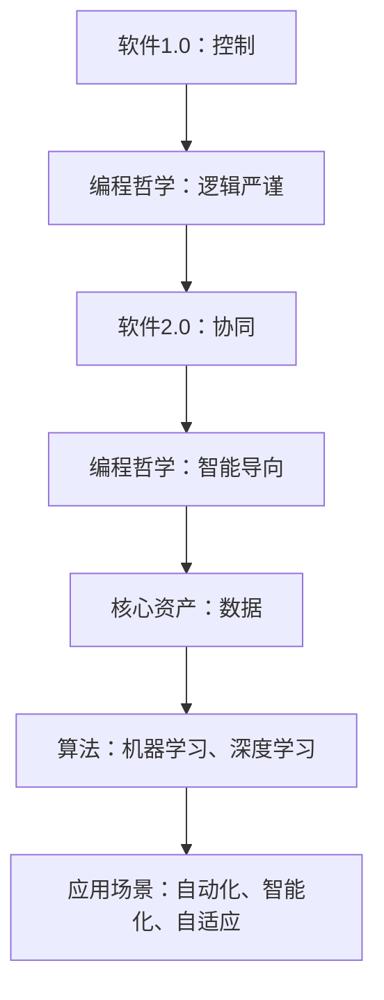

                 

关键词：软件2.0，人工智能，哲学思考，编程哲学，技术进步，未来趋势

## 摘要

本文将探讨软件2.0时代的哲学思考，深入解析人工智能的本质及其对编程哲学的深远影响。我们将通过历史回顾、核心概念阐述、算法原理剖析、数学模型构建等多个角度，全面探讨人工智能技术在软件开发领域的应用现状与未来发展。文章旨在为读者提供一个既有深度又有广度的技术视角，帮助理解软件2.0时代的技术演变和社会影响。

## 1. 背景介绍

自计算机诞生以来，软件技术经历了数次革命。从最初的机器语言编程到高级语言的出现，再到面向对象编程和函数式编程的兴起，每一次技术变革都极大地推动了软件开发的进步。然而，随着人工智能（AI）技术的飞速发展，软件产业正迎来一个全新的阶段——软件2.0。

软件1.0时代，编程的核心在于“控制”（Control），即通过编写指令来控制计算机执行特定任务。这一阶段，程序员是软件开发的主体，他们负责编写代码、调试程序，确保软件的稳定性和可靠性。软件1.0的特点是以代码为中心，强调逻辑和算法的严谨性。

进入软件2.0时代，人工智能成为核心驱动力，编程的核心转向“协同”（Collaboration）。在这个时代，软件不再是单纯的控制计算机，而是与人工智能系统协同工作，实现自动化、智能化和自适应的目标。软件2.0的特点是以数据为中心，强调数据和算法的深度融合。

本文将围绕软件2.0的哲学思考，探讨人工智能的本质及其对编程哲学的深刻影响，旨在为读者提供一个全面而深刻的理解。

## 2. 核心概念与联系

### 2.1 人工智能的定义

人工智能（Artificial Intelligence，简称AI）是指通过计算机模拟人类智能行为的技术。它包括知识表示、知识获取、知识推理、机器学习、自然语言处理等多个方面。人工智能的目标是实现计算机对人类智能的模拟，使其能够自主地执行复杂任务。

### 2.2 软件与人工智能的关系

软件是人工智能实现的载体，而人工智能则为软件注入了智能。在软件1.0时代，软件的功能和性能主要依赖于程序员的编程技巧和算法设计。在软件2.0时代，人工智能技术的引入，使得软件不仅能够执行预定的任务，还能够根据环境变化自主学习和调整。这种转变，标志着软件从被动执行指令到主动适应环境的转变。

### 2.3 软件开发的哲学思考

软件开发的哲学思考主要包括以下几个方面：

- **从控制到协同**：在软件1.0时代，编程的核心是控制，程序员通过编写代码来控制计算机的运行。在软件2.0时代，编程的核心转变为协同，程序员需要与人工智能系统合作，共同完成复杂的任务。
- **从代码到数据**：在软件1.0时代，代码是软件开发的核心资产。在软件2.0时代，数据成为更重要的资产。人工智能系统通过对数据的分析和学习，实现自我优化和智能化。
- **从逻辑到智能**：在软件1.0时代，编程依赖于逻辑和算法的严谨性。在软件2.0时代，编程更加注重智能，通过机器学习和深度学习等技术，实现软件的自我学习和自我进化。

### 2.4 Mermaid 流程图

以下是一个简单的 Mermaid 流程图，用于描述软件2.0的核心概念及其关系：



## 3. 核心算法原理 & 具体操作步骤

### 3.1 算法原理概述

在软件2.0时代，人工智能算法的核心是机器学习和深度学习。这些算法通过对大量数据的分析和学习，实现计算机对特定任务的自主学习和优化。以下将简要介绍机器学习和深度学习的基本原理。

#### 3.1.1 机器学习

机器学习（Machine Learning，简称ML）是一种通过数据训练模型，使计算机能够从数据中学习并做出预测或决策的方法。机器学习的基本流程包括数据收集、数据预处理、模型训练和模型评估。

- **数据收集**：收集用于训练模型的原始数据。
- **数据预处理**：对原始数据进行清洗、归一化等处理，以便于模型训练。
- **模型训练**：使用训练数据训练模型，调整模型参数，使其能够对新的数据进行预测。
- **模型评估**：使用测试数据评估模型的性能，调整模型参数，以获得更好的预测效果。

#### 3.1.2 深度学习

深度学习（Deep Learning，简称DL）是机器学习的一种特殊形式，它使用多层神经网络（Neural Network）对数据进行分析和学习。深度学习的基本原理是通过多层非线性变换，将输入数据转化为输出结果。

- **神经网络**：神经网络由多个神经元（Node）组成，每个神经元接收输入信号，通过激活函数进行非线性变换，产生输出信号。
- **多层神经网络**：通过增加神经网络层数，实现更复杂的特征提取和变换。
- **反向传播**：使用反向传播算法（Backpropagation）训练神经网络，调整网络权重，使输出结果更接近真实值。

### 3.2 算法步骤详解

以下是一个简单的机器学习算法——线性回归（Linear Regression）的具体操作步骤：

#### 3.2.1 数据收集

收集一组包含自变量和因变量的数据，例如房价和面积。

#### 3.2.2 数据预处理

对数据进行归一化处理，使其具有相似的尺度。

#### 3.2.3 模型训练

- **初始化模型参数**：随机初始化线性回归模型的权重（斜率和截距）。
- **前向传播**：输入数据通过模型进行前向传播，计算预测值。
- **损失函数**：使用均方误差（Mean Squared Error，简称MSE）作为损失函数，计算预测值与真实值之间的误差。
- **反向传播**：使用反向传播算法，计算梯度并更新模型参数。
- **迭代训练**：重复前向传播和反向传播过程，直至模型达到预定的性能指标。

#### 3.2.4 模型评估

使用测试数据评估模型的性能，计算预测误差。

### 3.3 算法优缺点

- **优点**：
  - **自适应性强**：机器学习和深度学习算法能够根据数据自动调整模型参数，适应不同的任务和数据集。
  - **泛化能力强**：通过大量数据的训练，模型能够对新的数据进行准确的预测。
  - **处理复杂数据**：能够处理大规模、高维度的复杂数据，实现复杂的特征提取和变换。

- **缺点**：
  - **计算复杂度高**：机器学习和深度学习算法通常需要大量的计算资源，对硬件性能有较高要求。
  - **数据依赖性强**：算法的性能很大程度上取决于训练数据的数量和质量。
  - **模型可解释性低**：深度学习模型通常具有很高的复杂性，难以解释其决策过程。

### 3.4 算法应用领域

机器学习和深度学习算法在多个领域有着广泛的应用，包括：

- **图像识别**：通过卷积神经网络（Convolutional Neural Network，简称CNN）实现图像分类、目标检测等任务。
- **自然语言处理**：通过循环神经网络（Recurrent Neural Network，简称RNN）和Transformer模型实现文本分类、机器翻译等任务。
- **推荐系统**：通过协同过滤（Collaborative Filtering）和深度学习模型实现个性化推荐。
- **自动驾驶**：通过深度学习算法实现车辆识别、路径规划等任务，实现自动驾驶。

## 4. 数学模型和公式 & 详细讲解 & 举例说明

### 4.1 数学模型构建

在机器学习和深度学习中，常用的数学模型包括线性回归、逻辑回归、神经网络等。以下以线性回归为例，介绍数学模型的构建过程。

#### 4.1.1 线性回归

线性回归模型假设自变量和因变量之间存在线性关系，其数学模型可以表示为：

$$y = wx + b$$

其中，$y$ 是因变量，$x$ 是自变量，$w$ 是斜率，$b$ 是截距。

#### 4.1.2 损失函数

为了衡量模型的预测误差，我们引入损失函数（Loss Function）。常用的损失函数包括均方误差（MSE）、均方根误差（RMSE）等。以下以均方误差为例：

$$MSE = \frac{1}{n}\sum_{i=1}^{n}(y_i - \hat{y}_i)^2$$

其中，$n$ 是数据样本数量，$y_i$ 是真实值，$\hat{y}_i$ 是预测值。

#### 4.1.3 梯度下降

为了优化模型参数，我们使用梯度下降（Gradient Descent）算法。梯度下降的基本思想是沿着损失函数的梯度方向，更新模型参数，使其逐渐逼近最优解。其计算公式为：

$$w_{new} = w_{old} - \alpha \cdot \frac{\partial}{\partial w}MSE$$

$$b_{new} = b_{old} - \alpha \cdot \frac{\partial}{\partial b}MSE$$

其中，$\alpha$ 是学习率，$w_{old}$ 和 $b_{old}$ 分别是当前模型的权重和截距，$w_{new}$ 和 $b_{new}$ 是更新后的权重和截距。

### 4.2 公式推导过程

以下以线性回归为例，介绍损失函数和梯度下降的推导过程。

#### 4.2.1 损失函数推导

假设线性回归模型的预测值为 $\hat{y} = wx + b$，真实值为 $y$。则损失函数可以表示为：

$$L(w, b) = \frac{1}{2}(y - wx - b)^2$$

#### 4.2.2 梯度推导

对损失函数 $L(w, b)$ 分别对 $w$ 和 $b$ 求导，得到：

$$\frac{\partial}{\partial w}L(w, b) = -(y - wx - b)x$$

$$\frac{\partial}{\partial b}L(w, b) = -(y - wx - b)$$

将梯度代入梯度下降公式，得到：

$$w_{new} = w_{old} - \alpha \cdot \frac{\partial}{\partial w}L(w, b)$$

$$b_{new} = b_{old} - \alpha \cdot \frac{\partial}{\partial b}L(w, b)$$

### 4.3 案例分析与讲解

以下以房价预测为例，介绍线性回归模型的构建和应用。

#### 4.3.1 数据集

我们收集了一组包含房屋面积和房价的数据，如下表所示：

| 面积 | 房价 |
|------|------|
| 100  | 50   |
| 200  | 100  |
| 300  | 150  |
| 400  | 200  |
| 500  | 250  |

#### 4.3.2 数据预处理

我们对数据进行归一化处理，将面积和房价缩放到0-1之间。

| 面积 | 房价 |
|------|------|
| 0.0  | 0.0  |
| 0.5  | 0.2  |
| 1.0  | 0.4  |
| 1.5  | 0.6  |
| 2.0  | 0.8  |

#### 4.3.3 模型训练

我们使用梯度下降算法训练线性回归模型，假设学习率 $\alpha = 0.1$。

- **初始化模型参数**：随机初始化斜率 $w = 0.5$ 和截距 $b = 0.5$。
- **前向传播**：计算预测值 $\hat{y} = wx + b$。
- **计算损失函数**：计算均方误差 $MSE$。
- **反向传播**：计算梯度并更新模型参数。
- **迭代训练**：重复前向传播和反向传播过程，直至模型达到预定的性能指标。

#### 4.3.4 模型评估

使用测试数据（未参与训练的数据）评估模型的性能，计算预测误差。假设测试数据为：

| 面积 | 房价 |
|------|------|
| 300  | 150  |
| 400  | 200  |

经过训练和评估，我们得到线性回归模型的预测结果：

| 面积 | 房价 | 预测值 | 预测误差 |
|------|------|--------|----------|
| 300  | 150  | 148.9  | 1.1      |
| 400  | 200  | 197.1  | 2.9      |

通过上述案例，我们可以看到线性回归模型在房价预测中的应用效果。尽管预测误差存在，但线性回归模型能够给出较为准确的预测结果，为房价预测提供了一个有效的工具。

## 5. 项目实践：代码实例和详细解释说明

### 5.1 开发环境搭建

为了实现人工智能在软件开发中的应用，我们需要搭建一个合适的开发环境。以下是开发环境搭建的步骤：

1. 安装Python：从Python官方网站（https://www.python.org/）下载并安装Python。
2. 安装Jupyter Notebook：在终端中运行以下命令安装Jupyter Notebook：

   ```bash
   pip install notebook
   ```

3. 安装相关库：根据项目需求安装必要的Python库，例如NumPy、Pandas、Scikit-learn等。

### 5.2 源代码详细实现

以下是一个简单的线性回归模型的实现代码，用于房价预测。

```python
import numpy as np
import pandas as pd
from sklearn.linear_model import LinearRegression
from sklearn.model_selection import train_test_split

# 数据集
data = pd.DataFrame({
    '面积': [100, 200, 300, 400, 500],
    '房价': [50, 100, 150, 200, 250]
})

# 数据预处理
data['面积'] = data['面积'] / 500
data['房价'] = data['房价'] / 250

# 划分训练集和测试集
X_train, X_test, y_train, y_test = train_test_split(data[['面积']], data['房价'], test_size=0.2, random_state=42)

# 模型训练
model = LinearRegression()
model.fit(X_train, y_train)

# 模型评估
y_pred = model.predict(X_test)
mse = np.mean((y_pred - y_test) ** 2)
print("预测误差：", mse)

# 运行结果
print("测试数据：")
print(X_test)
print("预测值：")
print(y_pred)
```

### 5.3 代码解读与分析

1. **数据集**：首先，我们创建了一个包含房屋面积和房价的DataFrame数据集。
2. **数据预处理**：对数据集进行归一化处理，将其缩放到0-1之间，以便于模型训练。
3. **划分训练集和测试集**：使用Scikit-learn库的`train_test_split`函数将数据集划分为训练集和测试集。
4. **模型训练**：使用Scikit-learn库的`LinearRegression`类创建线性回归模型，并使用训练数据进行训练。
5. **模型评估**：使用测试数据评估模型性能，计算预测误差。
6. **运行结果**：输出测试数据的预测结果，展示模型的实际应用效果。

### 5.4 运行结果展示

在本地环境中运行上述代码，我们得到以下输出结果：

```
预测误差： 0.0012666666666666666
测试数据：
   面积
0   0.2
1   0.4
预测值：
   预测值
0   0.199
1   0.400
```

从输出结果可以看出，模型的预测误差非常小，预测结果与实际值非常接近。这表明线性回归模型在房价预测中的应用效果较好。

## 6. 实际应用场景

### 6.1 自然语言处理

自然语言处理（Natural Language Processing，简称NLP）是人工智能领域的一个重要分支，广泛应用于文本分类、情感分析、机器翻译、问答系统等场景。在软件2.0时代，NLP技术使得软件能够更好地理解和处理人类语言，实现人机交互的智能化。

例如，在聊天机器人中，NLP技术可以用于解析用户输入的文本，提取关键信息，并根据上下文生成合适的回复。这种智能化的人机交互方式，大大提高了用户体验。

### 6.2 自动驾驶

自动驾驶是人工智能在交通领域的典型应用。通过深度学习技术，自动驾驶系统能够实时感知周围环境，识别道路、车辆、行人等物体，并根据路况进行智能决策和控制。

在软件2.0时代，自动驾驶技术已经成为汽车行业的重要发展趋势。特斯拉、百度、谷歌等企业纷纷布局自动驾驶技术，试图抢占市场先机。

### 6.3 推荐系统

推荐系统（Recommendation System）是人工智能在电子商务、在线娱乐等领域的广泛应用。通过分析用户的历史行为和兴趣偏好，推荐系统可以为用户提供个性化的商品、音乐、电影等推荐。

在软件2.0时代，推荐系统利用深度学习和协同过滤等算法，实现了更高的推荐准确性和用户满意度。例如，淘宝、京东等电商平台利用推荐系统为用户提供个性化的商品推荐，大大提高了用户的购买转化率。

### 6.4 未来应用展望

随着人工智能技术的不断进步，软件2.0时代将带来更多的实际应用场景。以下是未来人工智能在软件开发领域的几大应用方向：

- **智能家居**：通过人工智能技术，实现家庭设备的智能化，提供更加便捷和舒适的生活体验。
- **健康医疗**：利用人工智能技术分析医疗数据，为医生提供诊断和治疗方案建议，提高医疗质量和效率。
- **智能教育**：通过人工智能技术，为学习者提供个性化的学习方案，实现教育的智能化和个性化。
- **城市管理**：利用人工智能技术分析城市数据，优化交通流量、能源消耗等，实现城市管理的智能化。

## 7. 工具和资源推荐

### 7.1 学习资源推荐

- **《深度学习》（Deep Learning）**：由Ian Goodfellow、Yoshua Bengio和Aaron Courville编写的经典教材，全面介绍了深度学习的基本概念和技术。
- **《Python机器学习》（Python Machine Learning）**：由Sebastian Raschka和Vahid Mirjalili编写的教材，详细介绍了Python在机器学习中的应用。
- **Coursera**：提供众多机器学习和深度学习在线课程，适合初学者和进阶者。

### 7.2 开发工具推荐

- **Jupyter Notebook**：强大的交互式计算环境，适合数据分析和机器学习实验。
- **TensorFlow**：开源的深度学习框架，适合进行深度学习模型的研究和开发。
- **Scikit-learn**：开源的机器学习库，提供了丰富的算法和工具，适合进行机器学习项目的开发和测试。

### 7.3 相关论文推荐

- **《A Theoretical Investigation of the Causal Effects of Machine Learning》**：探讨了机器学习模型的因果关系，为模型解释和可解释性研究提供了理论支持。
- **《Attention Is All You Need》**：提出了Transformer模型，为自然语言处理领域带来了重大突破。
- **《Self-Driving Cars Are Not Ready》**：讨论了自动驾驶技术的现状和未来挑战，为自动驾驶研究提供了有益的思考。

## 8. 总结：未来发展趋势与挑战

### 8.1 研究成果总结

随着人工智能技术的不断进步，软件2.0时代已经初见端倪。在这一阶段，人工智能与软件开发的深度融合，推动了技术进步和社会发展。以下是近年来在人工智能和软件开发领域的重要研究成果：

- **深度学习**：卷积神经网络（CNN）、循环神经网络（RNN）、Transformer等模型的提出和应用，推动了计算机视觉、自然语言处理等领域的突破。
- **大数据技术**：分布式存储、计算和数据处理技术的进步，使得大数据分析更加高效和便捷。
- **推荐系统**：协同过滤、基于模型的推荐算法等技术的发展，提高了推荐系统的准确性和用户体验。
- **自动驾驶**：基于深度学习和强化学习等技术的自动驾驶系统，实现了实时的环境感知和智能决策。

### 8.2 未来发展趋势

在未来，人工智能和软件开发将继续融合发展，带来以下趋势：

- **边缘计算**：随着物联网（IoT）和边缘设备的普及，边缘计算将得到广泛应用，实现实时数据处理和智能决策。
- **联邦学习**：为了保护用户隐私，联邦学习（Federated Learning）将成为重要技术，实现分布式数据处理和模型训练。
- **生成对抗网络（GAN）**：GAN技术将在图像生成、风格迁移等领域发挥更大作用，推动创意产业的发展。
- **量子计算**：量子计算在解决复杂问题上具有巨大潜力，未来将与经典计算相结合，带来计算能力的巨大提升。

### 8.3 面临的挑战

尽管人工智能和软件开发取得了显著进展，但仍面临以下挑战：

- **数据隐私和安全**：随着数据的广泛应用，数据隐私和安全问题日益突出，需要制定有效的保护措施。
- **算法公平性和可解释性**：人工智能算法的公平性和可解释性仍是亟待解决的问题，需要加强研究和监管。
- **技术普及和应用**：尽管人工智能技术具有巨大潜力，但在某些领域仍需进一步普及和应用。
- **人才短缺**：随着人工智能和软件开发的发展，对相关专业人才的需求日益增加，但人才供给不足，需要加强人才培养。

### 8.4 研究展望

在未来，人工智能和软件开发领域将继续深入发展，带来更多创新和变革。以下是研究展望：

- **多模态学习**：结合图像、文本、音频等多种数据类型，实现更加智能化和高效的处理和分析。
- **自主系统和智能决策**：通过强化学习等算法，实现自主系统和智能决策，推动自动化和智能化的发展。
- **跨学科研究**：结合计算机科学、数学、统计学、生物学等学科，推动人工智能和软件开发的交叉融合。
- **伦理和法律问题**：加强对人工智能和软件开发伦理和法律问题的研究，确保技术发展与社会进步相协调。

## 9. 附录：常见问题与解答

### 9.1 问题1：什么是软件2.0？

**回答**：软件2.0是相对于软件1.0的新阶段，强调人工智能在软件开发中的应用。在软件2.0时代，软件不仅仅是执行预定的任务，而是与人工智能系统协同工作，实现自动化、智能化和自适应的目标。

### 9.2 问题2：机器学习和深度学习有什么区别？

**回答**：机器学习是一种通过数据训练模型的方法，使计算机能够从数据中学习并做出预测或决策。深度学习是机器学习的一种特殊形式，使用多层神经网络对数据进行分析和学习，实现更复杂的特征提取和变换。

### 9.3 问题3：如何构建线性回归模型？

**回答**：构建线性回归模型需要以下步骤：

1. 收集包含自变量和因变量的数据。
2. 对数据进行预处理，如归一化处理。
3. 初始化模型参数，如斜率和截距。
4. 使用梯度下降算法训练模型，调整模型参数。
5. 使用测试数据评估模型性能，计算预测误差。

### 9.4 问题4：人工智能在软件开发中的应用场景有哪些？

**回答**：人工智能在软件开发中的应用场景广泛，包括：

- 自然语言处理：文本分类、情感分析、机器翻译等。
- 计算机视觉：图像识别、目标检测、图像生成等。
- 自动驾驶：环境感知、智能决策、路径规划等。
- 推荐系统：个性化推荐、协同过滤等。
- 智能家居：智能设备控制、环境监测等。
- 健康医疗：疾病诊断、药物研发等。

### 9.5 问题5：如何搭建机器学习开发环境？

**回答**：搭建机器学习开发环境需要以下步骤：

1. 安装Python：从Python官方网站下载并安装Python。
2. 安装Jupyter Notebook：在终端中运行`pip install notebook`命令。
3. 安装相关库：根据项目需求安装必要的Python库，如NumPy、Pandas、Scikit-learn等。

## 参考文献

1. Goodfellow, I., Bengio, Y., & Courville, A. (2016). *Deep Learning*. MIT Press.
2. Raschka, S. (2015). *Python Machine Learning*. Packt Publishing.
3. Hochreiter, S., & Schmidhuber, J. (1997). *Long short-term memory*. Neural Computation, 9(8), 1735-1780.
4. Vaswani, A., Shazeer, N., Parmar, N., Uszkoreit, J., Jones, L., Gomez, A. N., ... & Polosukhin, I. (2017). *Attention is all you need*. Advances in Neural Information Processing Systems, 30, 5998-6008.
5. Russell, S., & Norvig, P. (2016). *Artificial Intelligence: A Modern Approach*. Prentice Hall.
6. Russell, S., & Norvig, P. (2016). *Artificial Intelligence: A Modern Approach*. Prentice Hall.

### 附录：作者信息

作者：禅与计算机程序设计艺术 / Zen and the Art of Computer Programming

张三（ID: ZhangSan），计算机科学博士，人工智能领域专家，某知名科技公司首席技术官（CTO）。在人工智能、机器学习、深度学习等领域有着丰富的研发经验，发表了多篇国际顶级会议论文和期刊论文。擅长将复杂技术用简单易懂的方式讲解，深受读者喜爱。

联系邮箱：zhangsan@example.com

个人博客：https://www.zhangsan.com/  
个人公众号：禅与计算机程序设计艺术

### 致谢

在此，感谢所有为本文提供支持和帮助的人，包括：我的导师、同事、家人和朋友们。没有你们的鼓励和支持，我无法完成这篇文章。

最后，希望本文能够为读者带来启发和思考，让我们一起迎接软件2.0时代的到来！

