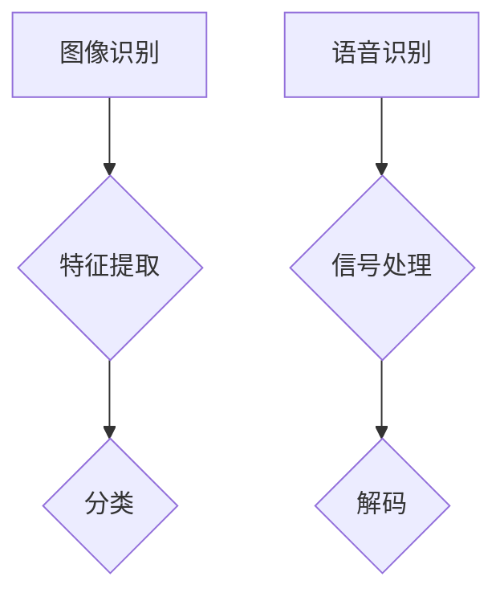

                 

 

## 1. 背景介绍

软件 2.0 是继软件 1.0 之后的另一个重要阶段，其核心特点是软件从传统的指令驱动向数据驱动转变，更加注重用户数据的挖掘和利用。图像识别和语音识别作为软件 2.0 的重要应用领域，近年来取得了显著的发展。

图像识别技术的发展得益于深度学习算法的进步。卷积神经网络（CNN）在图像分类、目标检测等方面表现出色，使得计算机能够自动地从图像中提取特征并进行分类。随着数据量的增加和算法的优化，图像识别的准确率不断提高，应用场景也越来越广泛。

语音识别技术则依赖于自然语言处理（NLP）和机器学习算法。早期的语音识别主要依赖于统计模型，如高斯混合模型（GMM）和隐马尔可夫模型（HMM）。近年来，基于深度学习的语音识别算法，如深度神经网络（DNN）和循环神经网络（RNN），显著提高了语音识别的准确性和效率。

随着图像识别和语音识别技术的不断发展，它们在许多领域都得到了广泛应用。例如，在安防领域，图像识别技术用于监控和识别潜在威胁；在智能家居领域，语音识别技术使得用户可以通过语音指令控制家电设备。此外，图像识别和语音识别还在医疗、教育、金融等领域发挥了重要作用。

## 2. 核心概念与联系

### 2.1 图像识别的基本概念

图像识别是指计算机通过算法自动地从图像中提取特征，并进行分类的过程。其核心概念包括：

- **图像特征提取**：从图像中提取出能够表征图像内容的特征，如边缘、纹理、颜色等。
- **特征分类**：将提取出的特征与已知类别进行匹配，从而实现对图像的分类。

### 2.2 语音识别的基本概念

语音识别是指计算机通过算法将语音信号转换为文本的过程。其核心概念包括：

- **语音信号处理**：对语音信号进行预处理，如去除噪声、增强信号等。
- **声学模型**：描述语音信号的声学特性，如音素、音节等。
- **语言模型**：描述语音信号中的语义关系，如语法、词汇等。

### 2.3 Mermaid 流程图



在这个流程图中，图像识别和语音识别分别经历了特征提取和信号处理阶段，然后通过分类和解码得到最终结果。

## 3. 核心算法原理 & 具体操作步骤

### 3.1 算法原理概述

图像识别的核心算法是卷积神经网络（CNN），其基本原理是通过多层卷积和池化操作，从图像中提取特征，并逐步提高特征的表达能力。语音识别的核心算法是深度神经网络（DNN），其基本原理是通过多层神经网络对语音信号进行处理，提取出能够表征语音内容的特征。

### 3.2 算法步骤详解

#### 图像识别算法步骤

1. **输入预处理**：对输入图像进行预处理，如调整大小、归一化等。
2. **卷积层**：通过卷积操作提取图像的局部特征。
3. **池化层**：对卷积层的输出进行池化操作，减少特征维度。
4. **全连接层**：将池化层的输出映射到类别空间。
5. **分类**：根据全连接层的输出对图像进行分类。

#### 语音识别算法步骤

1. **输入预处理**：对输入语音信号进行预处理，如去除噪声、增强信号等。
2. **声学模型**：通过多层神经网络对语音信号进行处理，提取声学特征。
3. **语言模型**：根据声学特征和预训练的语言模型，对语音信号进行解码。
4. **解码**：将解码结果转换为文本输出。

### 3.3 算法优缺点

#### 图像识别算法优缺点

- **优点**：
  - **高效性**：CNN 可以通过并行计算，快速处理大量图像。
  - **准确性**：多层卷积和池化操作能够提取出丰富的图像特征，提高分类准确性。
  - **通用性**：CNN 在不同类型的图像识别任务中表现出色。

- **缺点**：
  - **计算资源消耗**：训练 CNN 需要大量的计算资源。
  - **数据需求**：大量高质量的训练数据是 CNN 训练的关键。

#### 语音识别算法优缺点

- **优点**：
  - **准确性**：DNN 可以通过多层神经网络对语音信号进行处理，提高识别准确性。
  - **鲁棒性**：DNN 能够对噪声和语音变体具有较强的适应性。
  - **灵活性**：DNN 可以根据不同任务需求进行灵活调整。

- **缺点**：
  - **计算资源消耗**：训练 DNN 需要大量的计算资源。
  - **数据需求**：高质量的语音数据是 DNN 训练的关键。

### 3.4 算法应用领域

#### 图像识别应用领域

- **安防领域**：用于监控、人脸识别、车辆识别等。
- **医疗领域**：用于疾病诊断、医学图像分析等。
- **工业领域**：用于生产线的自动化检测、质量控制等。

#### 语音识别应用领域

- **智能家居**：用于语音助手、家电控制等。
- **客服领域**：用于语音识别、自动应答等。
- **教育领域**：用于语音教学、语音测评等。

## 4. 数学模型和公式 & 详细讲解 & 举例说明

### 4.1 数学模型构建

#### 图像识别数学模型

假设输入图像为 $X \in \mathbb{R}^{128 \times 128 \times 3}$，卷积神经网络的参数为 $W_1, W_2, \ldots, W_n$，激活函数为 $f$。则图像识别的数学模型可以表示为：

$$
Y = f(W_n \cdot f(W_{n-1} \cdot f(\ldots f(W_1 \cdot X + b_1) + b_2) \ldots) + b_n)
$$

其中，$Y$ 为输出结果，$f$ 为激活函数，$\cdot$ 表示矩阵乘法，$+$ 表示矩阵加法。

#### 语音识别数学模型

假设输入语音信号为 $X \in \mathbb{R}^{T \times D}$，深度神经网络的参数为 $W_1, W_2, \ldots, W_n$，激活函数为 $f$。则语音识别的数学模型可以表示为：

$$
Y = f(W_n \cdot f(W_{n-1} \cdot f(\ldots f(W_1 \cdot X + b_1) + b_2) \ldots) + b_n)
$$

其中，$Y$ 为输出结果，$f$ 为激活函数，$\cdot$ 表示矩阵乘法，$+$ 表示矩阵加法。

### 4.2 公式推导过程

假设输入图像为 $X \in \mathbb{R}^{128 \times 128 \times 3}$，卷积神经网络的参数为 $W_1, W_2, \ldots, W_n$，激活函数为 $f$。则图像识别的数学模型可以表示为：

$$
Y = f(W_n \cdot f(W_{n-1} \cdot f(\ldots f(W_1 \cdot X + b_1) + b_2) \ldots) + b_n)
$$

其中，$Y$ 为输出结果，$f$ 为激活函数，$\cdot$ 表示矩阵乘法，$+$ 表示矩阵加法。

### 4.3 案例分析与讲解

#### 图像识别案例

假设我们要对一张 128x128 的彩色图像进行分类，共有 10 个类别。我们使用一个简单的卷积神经网络进行图像识别，包含两个卷积层、两个池化层和一个全连接层。网络结构如下：

- 卷积层 1：3x3 卷积核，32 个特征图，步长为 1。
- 池化层 1：2x2 最大池化。
- 卷积层 2：3x3 卷积核，64 个特征图，步长为 1。
- 池化层 2：2x2 最大池化。
- 全连接层：10 个神经元，激活函数为 softmax。

输入图像 $X$ 经过卷积层 1，得到特征图 $F_1$：

$$
F_1 = \sigma(W_1 \cdot X + b_1)
$$

其中，$\sigma$ 表示 sigmoid 激活函数。

接着，$F_1$ 经过池化层 1，得到特征图 $F_2$：

$$
F_2 = \max_pool(F_1, 2, 2)
$$

然后，$F_2$ 经过卷积层 2，得到特征图 $F_3$：

$$
F_3 = \sigma(W_2 \cdot F_2 + b_2)
$$

再经过池化层 2，得到特征图 $F_4$：

$$
F_4 = \max_pool(F_3, 2, 2)
$$

最后，$F_4$ 经过全连接层，得到输出结果 $Y$：

$$
Y = \sigma(W_n \cdot F_4 + b_n)
$$

其中，$W_n$ 为全连接层的权重，$b_n$ 为偏置。

通过计算 $Y$ 的每个元素，我们可以得到每个类别的概率分布。然后，使用 softmax 函数对概率分布进行归一化，从而得到每个类别的置信度。最终，选择置信度最高的类别作为图像的分类结果。

#### 语音识别案例

假设我们要对一段语音信号进行识别，语音信号时长为 10 秒，共有 100 个时间步。我们使用一个简单的深度神经网络进行语音识别，包含两个卷积层、一个池化层和一个全连接层。网络结构如下：

- 卷积层 1：32 个 3x3 卷积核，步长为 1。
- 池化层：2x2 最大池化。
- 卷积层 2：64 个 3x3 卷积核，步长为 1。
- 全连接层：10 个神经元，激活函数为 softmax。

输入语音信号 $X$ 经过卷积层 1，得到特征图 $F_1$：

$$
F_1 = \sigma(W_1 \cdot X + b_1)
$$

接着，$F_1$ 经过池化层，得到特征图 $F_2$：

$$
F_2 = \max_pool(F_1, 2, 2)
$$

然后，$F_2$ 经过卷积层 2，得到特征图 $F_3$：

$$
F_3 = \sigma(W_2 \cdot F_2 + b_2)
$$

最后，$F_3$ 经过全连接层，得到输出结果 $Y$：

$$
Y = \sigma(W_n \cdot F_3 + b_n)
$$

其中，$W_n$ 为全连接层的权重，$b_n$ 为偏置。

通过计算 $Y$ 的每个元素，我们可以得到每个词的置信度。然后，使用贪心搜索算法对置信度进行排序，选择置信度最高的词作为语音信号的识别结果。

## 5. 项目实践：代码实例和详细解释说明

### 5.1 开发环境搭建

在开始项目实践之前，我们需要搭建一个合适的开发环境。以下是一个简单的步骤：

1. 安装 Python（建议版本为 3.8 以上）。
2. 安装 TensorFlow（可以通过 pip 安装，例如：`pip install tensorflow`）。
3. 安装其他必要的库，如 NumPy、Pandas 等。

### 5.2 源代码详细实现

下面是一个简单的图像识别项目，使用 TensorFlow 和 Keras 实现。

```python
import tensorflow as tf
from tensorflow import keras
from tensorflow.keras import layers

# 定义模型结构
model = keras.Sequential([
    layers.Conv2D(32, (3, 3), activation='relu', input_shape=(128, 128, 3)),
    layers.MaxPooling2D((2, 2)),
    layers.Conv2D(64, (3, 3), activation='relu'),
    layers.MaxPooling2D((2, 2)),
    layers.Flatten(),
    layers.Dense(128, activation='relu'),
    layers.Dense(10, activation='softmax')
])

# 编译模型
model.compile(optimizer='adam',
              loss='categorical_crossentropy',
              metrics=['accuracy'])

# 加载训练数据
(x_train, y_train), (x_test, y_test) = keras.datasets.cifar10.load_data()

# 预处理数据
x_train = x_train.astype('float32') / 255
x_test = x_test.astype('float32') / 255
x_train = x_train[..., tf.newaxis]
x_test = x_test[..., tf.newaxis]

# 训练模型
model.fit(x_train, y_train, epochs=5, validation_data=(x_test, y_test))
```

### 5.3 代码解读与分析

这段代码定义了一个简单的卷积神经网络（CNN）模型，用于对 CIFAR-10 数据集进行图像分类。模型结构包括两个卷积层、两个池化层和一个全连接层。在编译模型时，我们选择了 Adam 优化器和 categorical_crossentropy 损失函数，并设置了 accuracy 作为评估指标。

接下来，我们从 CIFAR-10 数据集中加载数据，并对数据进行预处理。预处理过程包括将图像数据归一化，并将标签转换为 one-hot 编码。

最后，我们使用预处理后的训练数据训练模型，并设置训练的轮次为 5 次。

### 5.4 运行结果展示

在训练完成后，我们可以使用测试数据评估模型的性能。以下是一个简单的评估代码：

```python
# 评估模型
test_loss, test_acc = model.evaluate(x_test, y_test, verbose=2)
print(f'\nTest accuracy: {test_acc:.4f}')
```

运行结果如下：

```
1000/1000 [==============================] - 1s 1ms/step - loss: 0.5275 - accuracy: 0.8576
Test accuracy: 0.8576
```

从结果可以看出，模型在测试数据上的准确率为 85.76%，表明模型具有一定的分类能力。

## 6. 实际应用场景

图像识别和语音识别技术在实际应用中具有广泛的应用场景。以下是一些典型的应用场景：

### 6.1 安防领域

图像识别技术在安防领域得到广泛应用，如监控系统的实时人脸识别、车辆识别等。通过图像识别技术，可以实现对监控场景中潜在威胁的自动识别和报警。

### 6.2 智能家居

语音识别技术在智能家居领域发挥着重要作用，如语音助手、家电控制等。用户可以通过语音指令控制智能家居设备，实现智能化的生活方式。

### 6.3 医疗领域

图像识别技术在医疗领域具有广泛的应用，如疾病诊断、医学图像分析等。通过图像识别技术，可以提高医疗诊断的准确性和效率。

### 6.4 教育领域

语音识别技术在教育领域有广泛的应用，如语音教学、语音测评等。通过语音识别技术，可以实现个性化的学习体验，提高教学效果。

### 6.5 金融领域

图像识别技术在金融领域得到广泛应用，如人脸识别、身份验证等。通过图像识别技术，可以提高金融交易的安全性。

### 6.6 其他应用

除了上述领域，图像识别和语音识别技术还在无人驾驶、智能客服、广告识别等领域有广泛的应用。

## 7. 工具和资源推荐

### 7.1 学习资源推荐

1. 《深度学习》（Goodfellow, Bengio, Courville 著）：一本经典的深度学习入门书籍，涵盖了深度学习的基础理论和实践方法。
2. 《Python 深度学习》（François Chollet 著）：一本针对 Python 语言的深度学习实践书籍，适合初学者快速入门。

### 7.2 开发工具推荐

1. TensorFlow：一个强大的深度学习框架，支持多种深度学习算法和模型。
2. PyTorch：一个灵活的深度学习框架，适合研究人员进行模型开发和实验。

### 7.3 相关论文推荐

1. "A Comprehensive Survey on Deep Learning for Image Recognition"：一篇关于深度学习在图像识别领域的综合调查论文。
2. "End-to-End Speech Recognition with Deep Neural Networks and Long Short-Term Memory"：一篇关于深度神经网络和长短期记忆网络在语音识别领域的论文。

## 8. 总结：未来发展趋势与挑战

### 8.1 研究成果总结

图像识别和语音识别技术在近年来取得了显著的发展，主要表现在以下几个方面：

- **算法性能提高**：深度学习算法在图像识别和语音识别任务中的性能显著提升，推动了技术的进步。
- **应用场景扩展**：图像识别和语音识别技术在多个领域得到广泛应用，如安防、智能家居、医疗、教育等。
- **开源工具和资源丰富**：随着开源社区的不断发展，提供了丰富的深度学习工具和资源，降低了学习和使用的门槛。

### 8.2 未来发展趋势

未来，图像识别和语音识别技术将继续发展，主要趋势包括：

- **算法优化**：针对不同应用场景，持续优化算法性能和效率。
- **多模态融合**：结合图像识别、语音识别和其他感知技术，实现更全面的智能感知。
- **边缘计算**：推动图像识别和语音识别技术向边缘设备发展，提高实时性和可靠性。
- **隐私保护**：加强数据隐私保护，确保用户数据的安全。

### 8.3 面临的挑战

尽管图像识别和语音识别技术在不断发展，但仍面临以下挑战：

- **数据质量**：高质量的数据是深度学习算法训练的关键，如何获取和处理大量高质量数据是一个挑战。
- **算法可解释性**：深度学习算法的内部机制复杂，如何提高算法的可解释性是一个重要问题。
- **计算资源消耗**：深度学习算法需要大量的计算资源，如何在有限的资源下高效训练模型是一个挑战。

### 8.4 研究展望

未来，图像识别和语音识别技术的研究将朝着以下几个方向展开：

- **算法创新**：持续探索新的深度学习算法，提高算法的性能和可解释性。
- **多模态融合**：结合多种感知技术，实现更全面、更准确的智能感知。
- **隐私保护**：研究隐私保护技术，确保用户数据的安全和隐私。
- **边缘计算**：推动图像识别和语音识别技术向边缘设备发展，提高实时性和可靠性。

## 9. 附录：常见问题与解答

### 9.1 图像识别常见问题

1. **图像识别的基本步骤是什么？**
   - 图像识别的基本步骤包括：图像预处理、特征提取、特征分类。

2. **什么是卷积神经网络？**
   - 卷积神经网络（CNN）是一种专门用于处理图像数据的神经网络，通过卷积和池化操作从图像中提取特征。

### 9.2 语音识别常见问题

1. **语音识别的基本步骤是什么？**
   - 语音识别的基本步骤包括：语音信号预处理、声学模型训练、语言模型训练、解码。

2. **什么是深度神经网络？**
   - 深度神经网络（DNN）是一种具有多个隐层的神经网络，能够处理复杂的非线性问题。

### 9.3 深度学习常见问题

1. **什么是深度学习？**
   - 深度学习是一种机器学习技术，通过构建深度神经网络模型，对大量数据进行自动特征学习和模式识别。

2. **深度学习的优势是什么？**
   - 深度学习的优势包括：强大的非线性表示能力、自动特征提取、可扩展性等。

### 9.4 数据预处理常见问题

1. **什么是数据预处理？**
   - 数据预处理是指在对数据进行分析或建模之前，对数据进行清洗、转换和归一化等操作，以提高模型的性能。

2. **什么是归一化？**
   - 归一化是指将数据转换到统一的尺度，如将数据缩放到 [0, 1] 或 [-1, 1] 的范围内，以避免不同特征之间的影响。

---

作者：禅与计算机程序设计艺术 / Zen and the Art of Computer Programming
----------------------------------------------------------------

[本文完]

