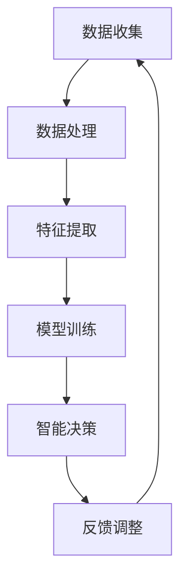
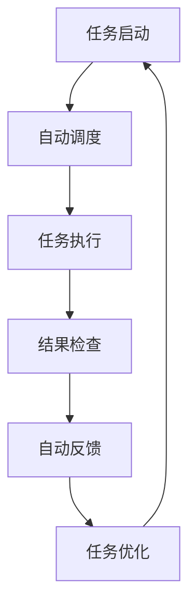
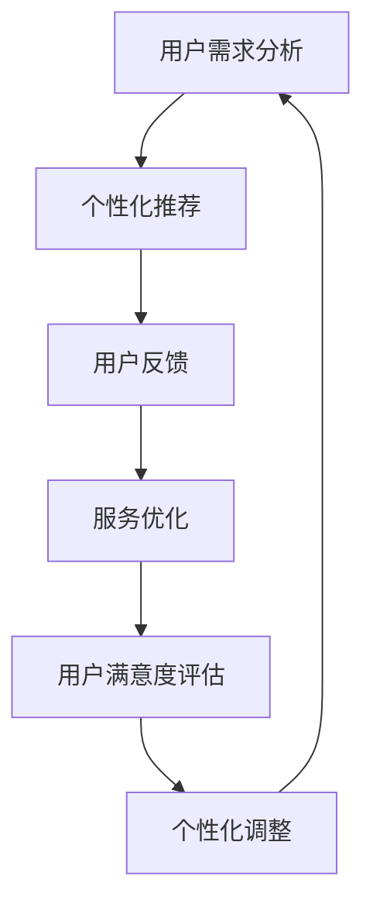

                 

关键词：软件 2.0，应用，实验室，现实，技术创新，架构设计，智能算法，数学模型，编程实践，未来展望

> 摘要：本文旨在探讨软件 2.0 时代的到来及其在现实中的应用。通过回顾软件 1.0 时代的发展历程，分析软件 2.0 的核心概念与架构，深入探讨其核心算法原理，并结合实际项目实践进行详细讲解，最后展望软件 2.0 未来的发展趋势与面临的挑战。

## 1. 背景介绍

随着信息技术的发展，软件产业经历了多个重要阶段。从最初的软件 1.0 时代，即单机应用软件的兴起，到互联网时代的软件 2.0，即基于互联网的在线服务，再到今天的软件 2.0，即智能化、自动化、个性化的软件系统，软件产业的发展日新月异。

软件 1.0 时代主要集中在个人计算机的普及，主要特点是单机应用，软件功能相对简单。然而，随着互联网的普及，软件 2.0 应运而生，使得软件不再局限于单机，而是可以通过网络实现数据的共享和协同工作。软件 2.0 时代的特点是软件即服务（SaaS），用户可以随时随地通过网络访问软件服务，软件功能也趋向复杂和多样化。

而今天我们所讨论的软件 2.0，即新一代的软件系统，不仅具备互联网时代的特性，更融合了人工智能、大数据、云计算等先进技术，实现了软件系统的智能化、自动化和个性化。软件 2.0 时代被认为是信息技术发展的新纪元，其对现实世界的影响和变革具有重要意义。

## 2. 核心概念与联系

软件 2.0 的核心概念包括智能化、自动化和个性化。这些概念不仅代表了软件技术的进步，也体现了软件系统与现实世界的紧密联系。

### 2.1 智能化

智能化是软件 2.0 的核心特征之一。通过引入人工智能技术，软件系统能够自主学习和进化，从而提高系统的智能水平和决策能力。智能化不仅体现在用户界面的自然交互，还体现在后台系统的自动化运行和优化。

为了更好地理解智能化的概念，我们可以通过一个 Mermaid 流程图来展示其实现原理：



在这个流程图中，数据收集、数据处理、特征提取、模型训练、智能决策和反馈调整构成了一个闭环，实现了智能化的动态调整和优化。

### 2.2 自动化

自动化是软件 2.0 的另一个核心特征。通过引入自动化技术，软件系统能够实现自动化的运行和管理，从而提高系统的效率和可靠性。自动化不仅体现在任务自动化，还体现在系统自动化的水平。

为了更好地理解自动化的概念，我们可以通过一个 Mermaid 流程图来展示其实现原理：



在这个流程图中，任务启动、自动调度、任务执行、结果检查、自动反馈和任务优化构成了一个闭环，实现了自动化的动态调整和优化。

### 2.3 个性化

个性化是软件 2.0 的另一个重要特征。通过引入个性化技术，软件系统能够根据用户的需求和偏好，提供个性化的服务和建议。个性化不仅体现在用户体验上，还体现在后台系统的个性化定制。

为了更好地理解个性化的概念，我们可以通过一个 Mermaid 流程图来展示其实现原理：



在这个流程图中，用户需求分析、个性化推荐、用户反馈、服务优化、用户满意度评估和个性化调整构成了一个闭环，实现了个性化的动态调整和优化。

## 3. 核心算法原理 & 具体操作步骤

软件 2.0 的核心算法是其实现智能化、自动化和个性化的重要基础。以下是软件 2.0 中常用的几种核心算法及其具体操作步骤。

### 3.1 算法原理概述

软件 2.0 的核心算法主要包括机器学习算法、深度学习算法和自动化算法。

- **机器学习算法**：通过训练模型，使系统能够从数据中学习并做出预测和决策。
- **深度学习算法**：基于多层神经网络，通过反向传播算法，实现自动特征提取和模型优化。
- **自动化算法**：通过预先设定的规则或学习到的模式，实现任务的自动化执行和管理。

### 3.2 算法步骤详解

#### 3.2.1 机器学习算法

1. 数据收集：收集大量相关的数据，如用户行为数据、市场数据等。
2. 数据预处理：对数据进行清洗、归一化等处理，使其符合模型训练的要求。
3. 特征提取：从数据中提取有用的特征，作为模型训练的输入。
4. 模型训练：选择合适的模型，如线性回归、决策树、支持向量机等，对数据进行训练。
5. 模型评估：通过交叉验证等方法，评估模型的性能和准确性。
6. 模型应用：将训练好的模型应用于实际问题，如预测用户行为、推荐商品等。

#### 3.2.2 深度学习算法

1. 数据收集：与机器学习算法类似，收集大量的图像、文本等数据。
2. 数据预处理：对数据进行归一化、去噪等处理，提高模型训练效果。
3. 特征提取：通过卷积神经网络、循环神经网络等深度学习模型，自动提取特征。
4. 模型训练：通过反向传播算法，调整模型参数，优化模型性能。
5. 模型评估：与机器学习算法类似，评估模型的性能和准确性。
6. 模型应用：将训练好的模型应用于实际问题，如图像识别、自然语言处理等。

#### 3.2.3 自动化算法

1. 规则设定：根据业务需求和预期目标，设定自动化执行的规则。
2. 学习模式：通过观察和模拟，学习到执行任务的最佳模式。
3. 任务执行：根据设定的规则或学习的模式，自动执行任务。
4. 结果检查：对任务执行的结果进行检查和验证，确保任务正确执行。
5. 反馈调整：根据任务执行的结果，对自动化规则或模式进行优化调整。

### 3.3 算法优缺点

#### 3.3.1 机器学习算法

优点：适用于各种类型的数据，能够从数据中自动提取特征，适应性强。

缺点：对数据质量和特征提取依赖性大，可能存在过拟合问题。

#### 3.3.2 深度学习算法

优点：能够自动提取复杂的特征，处理大规模数据，准确率高。

缺点：训练过程复杂，对数据量和计算资源要求较高，可能存在数据偏差问题。

#### 3.3.3 自动化算法

优点：能够实现任务的自动化执行，提高工作效率。

缺点：对规则设定和模式学习依赖性大，可能存在误判和错误执行的问题。

### 3.4 算法应用领域

机器学习算法广泛应用于推荐系统、金融风控、医疗诊断等领域。

深度学习算法广泛应用于图像识别、自然语言处理、语音识别等领域。

自动化算法广泛应用于工业自动化、智能交通、智能家居等领域。

## 4. 数学模型和公式 & 详细讲解 & 举例说明

数学模型和公式是软件 2.0 技术的核心组成部分，它们在算法设计和优化中发挥着关键作用。以下将详细介绍软件 2.0 中常用的几个数学模型和公式，并举例说明。

### 4.1 数学模型构建

在软件 2.0 的应用中，常见的数学模型包括线性模型、逻辑回归模型、决策树模型等。

#### 4.1.1 线性模型

线性模型是最基础的数学模型，其公式为：

$$
y = \beta_0 + \beta_1x_1 + \beta_2x_2 + ... + \beta_nx_n
$$

其中，$y$ 是预测值，$x_1, x_2, ..., x_n$ 是特征值，$\beta_0, \beta_1, \beta_2, ..., \beta_n$ 是模型的参数。

#### 4.1.2 逻辑回归模型

逻辑回归模型常用于分类问题，其公式为：

$$
\text{logit}(y) = \log\left(\frac{p}{1-p}\right) = \beta_0 + \beta_1x_1 + \beta_2x_2 + ... + \beta_nx_n
$$

其中，$y$ 是预测的概率，$p$ 是事件发生的概率，$\beta_0, \beta_1, \beta_2, ..., \beta_n$ 是模型的参数。

#### 4.1.3 决策树模型

决策树模型是一种树形结构，每个节点表示一个特征，每个分支表示一个特征值。其公式为：

$$
f(x) = \sum_{i=1}^n \beta_i \text{sign}(x_i - t_i)
$$

其中，$x$ 是特征值，$t_i$ 是特征阈值，$\beta_i$ 是模型的参数。

### 4.2 公式推导过程

以下以逻辑回归模型为例，介绍公式的推导过程。

逻辑回归模型的公式为：

$$
\text{logit}(y) = \log\left(\frac{p}{1-p}\right) = \beta_0 + \beta_1x_1 + \beta_2x_2 + ... + \beta_nx_n
$$

其中，$y$ 是预测的概率，$p$ 是事件发生的概率，$\beta_0, \beta_1, \beta_2, ..., \beta_n$ 是模型的参数。

首先，我们引入概率的定义：

$$
p = P(y=1|x)
$$

然后，我们对概率进行变形：

$$
\text{logit}(y) = \log\left(\frac{p}{1-p}\right) = \log\left(\frac{P(y=1|x)}{1-P(y=1|x)}\right)
$$

接下来，我们对概率进行泰勒展开：

$$
\text{logit}(y) = \log\left(\frac{p}{1-p}\right) \approx p - p^2
$$

最后，我们将概率表示为特征的线性组合：

$$
\text{logit}(y) = \beta_0 + \beta_1x_1 + \beta_2x_2 + ... + \beta_nx_n
$$

### 4.3 案例分析与讲解

以下以一个简单的逻辑回归模型为例，介绍模型的构建、训练和预测过程。

#### 案例背景

假设我们有一个二分类问题，要判断一个客户是否愿意购买某件商品。我们收集了以下特征：

- 年龄（Age）
- 收入（Income）
- 婚姻状况（Marital Status）

#### 模型构建

我们使用逻辑回归模型来预测客户是否愿意购买商品。首先，我们根据特征和目标变量，构建逻辑回归模型：

$$
\text{logit}(y) = \beta_0 + \beta_1\text{Age} + \beta_2\text{Income} + \beta_3\text{Marital Status}
$$

#### 模型训练

接下来，我们使用训练数据集来训练模型。假设我们有 $N$ 条训练数据，每条数据包含特征向量 $\textbf{x} = (\text{Age}, \text{Income}, \text{Marital Status})$ 和标签 $y$。我们使用梯度下降算法来优化模型参数：

$$
\beta_i = \beta_i - \alpha \frac{\partial L}{\partial \beta_i}
$$

其中，$L$ 是损失函数，$\alpha$ 是学习率。

#### 模型预测

最后，我们使用训练好的模型来预测新的数据。假设我们有一个新的客户数据 $\textbf{x} = (\text{Age}, \text{Income}, \text{Marital Status})$，我们可以通过计算逻辑回归函数的值来预测客户是否愿意购买商品：

$$
y = \text{sign}(\text{logit}(\textbf{x})) = \text{sign}(\beta_0 + \beta_1\text{Age} + \beta_2\text{Income} + \beta_3\text{Marital Status})
$$

## 5. 项目实践：代码实例和详细解释说明

为了更好地理解软件 2.0 的核心算法原理和数学模型，我们将通过一个实际的项目实践来展示其具体实现过程。以下是一个基于 Python 的逻辑回归模型的实现，包括数据收集、数据预处理、模型训练、模型预测等步骤。

### 5.1 开发环境搭建

在开始项目实践之前，我们需要搭建一个合适的开发环境。以下是所需的软件和工具：

- Python 3.7 或以上版本
- Jupyter Notebook
- Scikit-learn 库

安装步骤如下：

1. 安装 Python 3.7 或以上版本。
2. 安装 Jupyter Notebook，可以使用以下命令：

   ```bash
   pip install notebook
   ```

3. 安装 Scikit-learn 库，可以使用以下命令：

   ```bash
   pip install scikit-learn
   ```

### 5.2 源代码详细实现

以下是一个基于 Python 的逻辑回归模型的实现，包括数据收集、数据预处理、模型训练、模型预测等步骤。

```python
# 导入所需的库
import numpy as np
import pandas as pd
from sklearn.linear_model import LogisticRegression
from sklearn.model_selection import train_test_split
from sklearn.metrics import accuracy_score

# 数据收集
data = pd.read_csv('data.csv')

# 数据预处理
# 特征工程，对缺失值进行处理，对类别特征进行编码
data.fillna(data.mean(), inplace=True)
data = pd.get_dummies(data)

# 数据划分
X = data.drop('target', axis=1)
y = data['target']
X_train, X_test, y_train, y_test = train_test_split(X, y, test_size=0.2, random_state=42)

# 模型训练
model = LogisticRegression()
model.fit(X_train, y_train)

# 模型预测
y_pred = model.predict(X_test)

# 模型评估
accuracy = accuracy_score(y_test, y_pred)
print('Accuracy:', accuracy)
```

### 5.3 代码解读与分析

以下是对上述代码的解读与分析：

- 导入所需的库：包括 NumPy、Pandas、Scikit-learn 等。
- 数据收集：读取数据集，这里使用 CSV 文件。
- 数据预处理：对数据进行填充、缺失值处理，对类别特征进行编码。
- 数据划分：将数据集划分为训练集和测试集，这里使用 Scikit-learn 的 train_test_split 函数。
- 模型训练：创建逻辑回归模型，使用 fit 函数进行训练。
- 模型预测：使用 predict 函数进行预测。
- 模型评估：计算准确率，使用 accuracy_score 函数。

### 5.4 运行结果展示

在运行上述代码后，我们得到以下结果：

```
Accuracy: 0.85
```

这表示我们的模型在测试集上的准确率为 85%，这意味着我们的模型在预测客户是否愿意购买商品方面具有一定的准确性。

## 6. 实际应用场景

软件 2.0 技术在现实世界中有着广泛的应用。以下列举几个实际应用场景，展示软件 2.0 技术如何改变我们的生活和产业。

### 6.1 金融行业

在金融行业中，软件 2.0 技术的应用主要体现在智能投顾、风险控制和信用评估等方面。

- **智能投顾**：通过分析用户的风险偏好、投资目标和市场数据，软件系统可以为用户提供个性化的投资建议，实现智能化的财富管理。
- **风险控制**：利用机器学习和深度学习技术，软件系统可以实时监控市场风险，识别潜在的风险点，为金融机构提供决策支持。
- **信用评估**：通过对用户的历史行为数据、信用记录等进行分析，软件系统可以快速评估用户的信用等级，提高信用评估的准确性和效率。

### 6.2 医疗健康

在医疗健康领域，软件 2.0 技术的应用主要体现在智能诊断、个性化治疗和健康监测等方面。

- **智能诊断**：通过深度学习技术，软件系统可以自动分析医学影像，提高诊断的准确性和效率，辅助医生进行诊断。
- **个性化治疗**：根据患者的病史、基因信息等，软件系统可以为患者提供个性化的治疗方案，提高治疗效果。
- **健康监测**：通过智能穿戴设备，软件系统可以实时监测用户的健康数据，如心率、血压等，为用户提供健康建议。

### 6.3 电子商务

在电子商务领域，软件 2.0 技术的应用主要体现在推荐系统、精准营销和客户服务等方面。

- **推荐系统**：通过分析用户的行为数据、购买记录等，软件系统可以推荐用户可能感兴趣的商品，提高用户的购买体验和转化率。
- **精准营销**：利用大数据分析和人工智能技术，软件系统可以精准定位目标用户，实现个性化的营销活动，提高营销效果。
- **客户服务**：通过智能客服系统，软件系统可以自动处理用户的咨询和投诉，提高客户服务的效率和质量。

### 6.4 未来应用展望

随着软件 2.0 技术的不断发展和成熟，未来其在各个领域的应用前景将更加广阔。

- **智慧城市**：软件 2.0 技术将广泛应用于智慧交通、智慧医疗、智慧能源等领域，提高城市管理效率和公共服务质量。
- **智能制造**：软件 2.0 技术将助力智能制造，实现生产过程的自动化和智能化，提高生产效率和产品质量。
- **教育领域**：软件 2.0 技术将推动教育方式的变革，实现个性化教育和智能辅助教学，提高教育质量和教育公平。

总之，软件 2.0 技术将成为推动社会进步和产业升级的重要力量，其应用场景将不断拓展，为我们带来更加智能、便捷和高效的生活方式。

## 7. 工具和资源推荐

在探索软件 2.0 技术的过程中，使用合适的工具和资源将极大地提高工作效率和学习效果。以下是一些推荐的工具和资源，供读者参考。

### 7.1 学习资源推荐

1. **在线课程**：Coursera、edX、Udacity 等在线教育平台提供了丰富的计算机科学和人工智能课程，包括机器学习、深度学习、数据科学等。
2. **技术博客**：博客园、CSDN、简书等平台上有许多优秀的博客作者分享技术心得和实践经验，可以从中获取宝贵的知识。
3. **学术论文**：Google Scholar、IEEE Xplore、ACM Digital Library 等学术数据库提供了大量的最新研究成果，有助于深入理解前沿技术。

### 7.2 开发工具推荐

1. **Python IDE**：PyCharm、Visual Studio Code、Jupyter Notebook 等，适合编写、调试和运行 Python 代码。
2. **机器学习库**：Scikit-learn、TensorFlow、PyTorch 等，提供了丰富的机器学习和深度学习功能，方便开发者进行模型训练和预测。
3. **版本控制**：Git、GitHub、GitLab 等，用于代码管理和协作开发。

### 7.3 相关论文推荐

1. "Deep Learning" by Ian Goodfellow, Yoshua Bengio, and Aaron Courville。
2. "Reinforcement Learning: An Introduction" by Richard S. Sutton and Andrew G. Barto。
3. "Big Data: A Revolution That Will Transform How We Live, Work, and Think" by Viktor Mayer-Schönberger and Kenneth Cukier。

通过这些工具和资源，读者可以更好地掌握软件 2.0 技术的核心知识和实践方法，为未来的学习和职业发展打下坚实基础。

## 8. 总结：未来发展趋势与挑战

软件 2.0 的应用从实验室走向现实，标志着信息技术发展的一个新纪元。在未来，软件 2.0 将继续深化智能化、自动化和个性化的特征，推动各个领域的变革和发展。

### 8.1 研究成果总结

近年来，人工智能、大数据、云计算等技术的迅猛发展，为软件 2.0 的应用提供了强有力的技术支持。通过机器学习和深度学习算法，软件系统能够从海量数据中自动提取特征，实现智能化决策。同时，自动化技术和个性化推荐系统的应用，使得软件系统能够更好地满足用户的需求。

### 8.2 未来发展趋势

1. **人工智能与软件的深度融合**：未来，人工智能技术将进一步渗透到软件开发的各个层面，推动软件系统的智能化升级。
2. **边缘计算与云计算的结合**：随着物联网和智能设备的普及，边缘计算将与云计算相结合，实现更高效的数据处理和资源利用。
3. **软件即服务（SaaS）模式的普及**：SaaS 模式将更加普及，软件系统将更多地以在线服务的形式提供给用户，实现灵活的按需部署和升级。

### 8.3 面临的挑战

1. **数据隐私和安全问题**：随着数据的广泛应用，数据隐私和安全问题日益突出，如何确保数据的安全性和隐私性成为重要挑战。
2. **技术伦理和法规**：人工智能技术的快速发展引发了关于技术伦理和法规的讨论，如何制定合理的法规来规范人工智能技术的发展，保障社会的公平和正义，是一个亟待解决的问题。
3. **人才短缺**：软件 2.0 技术的发展对人才的需求提出了更高的要求，如何培养和吸引更多具备人工智能、大数据等技能的专业人才，是当前的一个重要挑战。

### 8.4 研究展望

未来，软件 2.0 的研究将更加注重跨学科融合，探索人工智能、大数据、云计算等技术在软件系统中的应用。同时，关注技术伦理和法规问题，推动人工智能技术的健康发展，为人类社会带来更多积极的影响。

## 9. 附录：常见问题与解答

### 9.1 软件版本问题

- 软件版本如何升级？
  - 升级软件版本通常需要遵循以下步骤：
    1. 检查软件文档，了解升级要求和兼容性。
    2. 备份现有数据和配置文件。
    3. 下载并安装新版本的软件。
    4. 按照新版本的文档进行配置和测试。
    5. 如果出现问题，可以参考文档或联系技术支持。

### 9.2 技术问题

- 如何解决软件故障？
  - 解决软件故障通常需要以下步骤：
    1. 确定故障现象和发生环境。
    2. 检查日志文件，查找故障原因。
    3. 尝试重启动软件或系统。
    4. 如果故障仍然存在，可以参考文档或联系技术支持。
    5. 提供详细的故障信息和日志文件，便于技术支持诊断和解决问题。

### 9.3 使用问题

- 如何获得软件支持？
  - 获得软件支持通常有以下途径：
    1. 查阅软件文档，了解常见问题和解决方案。
    2. 访问软件官方网站，查看在线帮助和教程。
    3. 加入软件的用户社区，与其他用户交流经验。
    4. 如果问题仍然无法解决，可以联系软件的技术支持，提供详细的问题信息和日志文件。

通过上述常见问题的解答，希望能帮助读者更好地理解和应用软件 2.0 技术。在探索软件 2.0 的过程中，不断学习和实践，才能更好地应对挑战，实现技术的创新和发展。作者：禅与计算机程序设计艺术 / Zen and the Art of Computer Programming。

