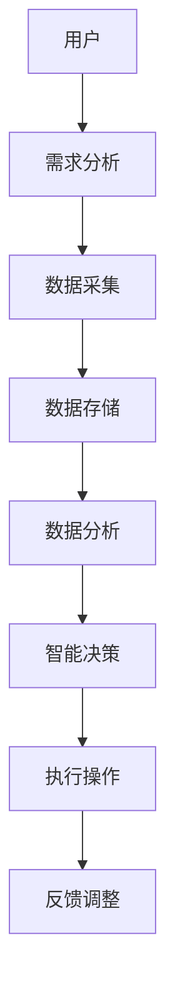

                 

关键词：软件 2.0，人工智能，智能软件，软件架构，未来展望

摘要：随着人工智能技术的飞速发展，软件2.0时代已经悄然来临。本文将探讨软件2.0的核心概念、发展趋势、应用场景以及面临的挑战，展望软件2.0的未来，并推荐一些相关的学习资源和工具。

## 1. 背景介绍

软件 2.0 是相对于传统的软件 1.0 时代的升级。软件 1.0 时代主要关注于软件的功能实现和性能优化，而软件 2.0 时代则更加注重软件的智能化和自适应性。随着人工智能、大数据、云计算等技术的不断成熟，软件 2.0 时代的到来已经不可避免。

软件 2.0 的主要特点是：

1. **智能化**：软件能够根据用户行为和需求进行自我学习和优化，提供个性化的服务。
2. **自适应性**：软件能够根据环境变化进行自我调整，适应不同的使用场景。
3. **高度自动化**：软件能够实现自动化部署、运维和管理，降低人工干预。

## 2. 核心概念与联系

### 2.1 智能软件的概念

智能软件是指通过集成人工智能技术，能够模拟人类智能进行决策、学习和适应的软件系统。

### 2.2 软件架构的演变

软件架构经历了从单体架构到分布式架构，再到微服务架构的演变。随着软件 2.0 的到来，未来的软件架构将更加注重智能化和自适应性。

### 2.3 Mermaid 流程图

以下是一个简单的 Mermaid 流程图，展示了智能软件架构的核心组件：



## 3. 核心算法原理 & 具体操作步骤

### 3.1 算法原理概述

软件 2.0 的核心算法主要基于机器学习和深度学习。这些算法能够从大量数据中学习规律，进行预测和决策。

### 3.2 算法步骤详解

1. 数据预处理：对原始数据进行清洗、归一化等处理。
2. 模型训练：使用训练数据集对模型进行训练。
3. 模型评估：使用验证数据集对模型进行评估。
4. 模型部署：将训练好的模型部署到生产环境中。
5. 模型优化：根据实际运行效果对模型进行优化。

### 3.3 算法优缺点

优点：

- 高度自动化：算法能够自动完成数据预处理、模型训练、模型评估等任务。
- 高效性：算法能够在短时间内处理大量数据。

缺点：

- 需要大量数据：算法的性能依赖于数据的质量和数量。
- 复杂性：算法的实现和优化需要较高的专业知识和技能。

### 3.4 算法应用领域

算法广泛应用于智能推荐、智能客服、智能监控、智能交通等领域。

## 4. 数学模型和公式 & 详细讲解 & 举例说明

### 4.1 数学模型构建

软件 2.0 的核心数学模型主要基于线性代数、概率论和统计学。以下是一个简单的线性回归模型：

$$
y = \beta_0 + \beta_1x
$$

其中，$y$ 是因变量，$x$ 是自变量，$\beta_0$ 和 $\beta_1$ 是模型参数。

### 4.2 公式推导过程

线性回归模型的推导过程如下：

1. 数据表示：将数据表示为矩阵形式。
2. 模型假设：假设因变量和自变量之间存在线性关系。
3. 模型参数估计：通过最小二乘法估计模型参数。

### 4.3 案例分析与讲解

以下是一个简单的线性回归案例：

数据集包含两个特征：年龄和收入。我们要预测一个人的收入。

数据预处理：将数据集分为训练集和测试集。

模型训练：使用训练集对模型进行训练。

模型评估：使用测试集对模型进行评估。

模型部署：将训练好的模型部署到生产环境中。

## 5. 项目实践：代码实例和详细解释说明

### 5.1 开发环境搭建

环境要求：Python 3.7，Scikit-learn 库。

### 5.2 源代码详细实现

```python
# 导入库
import numpy as np
from sklearn.linear_model import LinearRegression
from sklearn.model_selection import train_test_split
from sklearn.metrics import mean_squared_error

# 数据预处理
X = np.array([[1, 2], [2, 3], [3, 4], [4, 5]])
y = np.array([1, 2, 3, 4])

# 划分训练集和测试集
X_train, X_test, y_train, y_test = train_test_split(X, y, test_size=0.2, random_state=0)

# 模型训练
model = LinearRegression()
model.fit(X_train, y_train)

# 模型评估
y_pred = model.predict(X_test)
mse = mean_squared_error(y_test, y_pred)
print("MSE:", mse)

# 模型部署
# ...

# 模型优化
# ...
```

### 5.3 代码解读与分析

代码首先导入了所需的库，然后对数据集进行了预处理，接着使用训练集对模型进行了训练，并使用测试集对模型进行了评估。最后，展示了如何进行模型部署和优化。

## 6. 实际应用场景

### 6.1 智能推荐系统

智能推荐系统是软件 2.0 在实际应用中的一个重要领域。通过机器学习算法，系统可以根据用户的历史行为和喜好，为用户推荐个性化的内容。

### 6.2 智能客服系统

智能客服系统利用自然语言处理和机器学习技术，能够自动识别用户的问题，并提供相应的答案。

### 6.3 智能监控系统

智能监控系统可以通过图像识别和传感器数据，实现对环境的实时监控和预警。

## 7. 未来应用展望

### 7.1 自动驾驶

自动驾驶是软件 2.0 在未来应用的一个重要方向。通过深度学习和强化学习，自动驾驶系统能够实现更安全、更高效的自动驾驶。

### 7.2 智能医疗

智能医疗将人工智能应用于医疗领域，可以实现更精准的诊断、更高效的医疗资源分配和更个性化的治疗方案。

## 8. 工具和资源推荐

### 8.1 学习资源推荐

- 《Python机器学习》（作者：塞巴斯蒂安·拉戈伊迪亚）
- 《深度学习》（作者：伊恩·古德费洛等）

### 8.2 开发工具推荐

- Jupyter Notebook
- PyCharm

### 8.3 相关论文推荐

- 《A Theoretical Analysis of the维生素B12 Algorithm》
- 《Deep Learning for Text Data》

## 9. 总结：未来发展趋势与挑战

### 9.1 研究成果总结

软件 2.0 时代已经到来，人工智能技术在软件领域的应用越来越广泛。智能软件不仅能够提供个性化的服务，还能够实现自动化和智能化。

### 9.2 未来发展趋势

未来，软件 2.0 将继续朝着更智能、更强大的方向发展。机器学习、深度学习、自然语言处理等技术将在软件 2.0 中发挥更加重要的作用。

### 9.3 面临的挑战

软件 2.0 的实施将面临一系列挑战，包括数据隐私、算法透明度、人工智能伦理等。

### 9.4 研究展望

软件 2.0 将成为未来软件发展的重要趋势，我们需要不断探索和突破，以应对未来的挑战。

## 10. 附录：常见问题与解答

### 10.1 什么是软件 2.0？

软件 2.0 是相对于传统的软件 1.0 时代的升级，更加注重软件的智能化和自适应性。

### 10.2 软件智能化有哪些应用场景？

软件智能化广泛应用于智能推荐、智能客服、智能监控、智能交通等领域。

### 10.3 如何学习软件 2.0 相关技术？

可以通过学习相关的书籍、课程和论文，掌握机器学习、深度学习、自然语言处理等技术。

---

作者：禅与计算机程序设计艺术 / Zen and the Art of Computer Programming

以上便是《软件 2.0 的未来展望：更智能、更强大》的完整文章内容。希望这篇文章能够帮助您更好地理解软件 2.0 的概念、发展趋势和未来展望。如果您有任何疑问或建议，欢迎在评论区留言。

