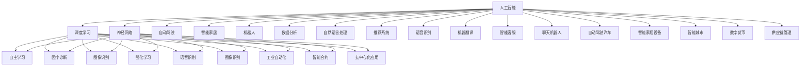
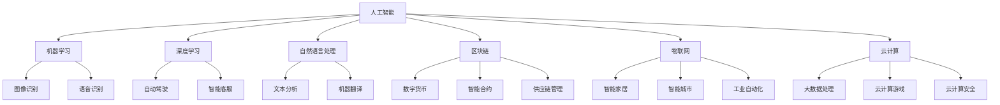

                 

关键词：软件 2.0，未来愿景，人工智能，区块链，物联网，云计算，智能合约，可持续性发展

> 摘要：本文深入探讨了软件 2.0 的未来愿景，探讨了人工智能、区块链、物联网、云计算、智能合约等核心技术如何共同推动软件领域的发展，以及这些技术如何应用于现实世界，为人类创造更美好的生活。通过本文的阐述，我们希望能引发读者对软件技术未来的思考，共同迎接一个充满无限可能的未来。

## 1. 背景介绍

### 1.1 软件发展的历史回顾

从第一台计算机问世至今，软件技术的发展经历了从简单的程序编写到复杂的系统开发，再到如今的智能化时代。早期的软件主要依赖于人工编程，随着计算机硬件的不断发展，软件系统逐渐变得更加复杂和庞大。然而，这种发展模式也带来了一系列挑战，如代码可维护性差、系统性能瓶颈等。

### 1.2 软件定义的演变

传统的软件定义主要侧重于功能实现和性能优化。然而，随着人工智能、区块链、物联网等新兴技术的崛起，软件的定义逐渐从单纯的功能实现转向了更广泛的应用场景和生态构建。软件 2.0 时代，软件将不仅仅是程序代码的集合，而是一个包含智能合约、去中心化应用、物联网设备的综合体。

## 2. 核心概念与联系

### 2.1 人工智能

人工智能（AI）是软件 2.0 时代的关键驱动力之一。通过深度学习、神经网络等技术，人工智能能够实现自主学习和决策，从而提高软件系统的智能化水平。人工智能的应用场景包括自动驾驶、智能家居、医疗诊断等。

### 2.2 区块链

区块链技术为软件 2.0 提供了一种去中心化的信任机制。通过区块链，数据可以在无需第三方中介的情况下安全传输和存储，从而提高数据的安全性和透明度。区块链技术广泛应用于数字货币、智能合约、供应链管理等场景。

### 2.3 物联网

物联网（IoT）技术将物理世界与数字世界相连接，使得各种设备可以通过互联网进行通信和协作。物联网技术的应用场景包括智能家居、智能城市、工业自动化等。

### 2.4 云计算

云计算为软件 2.0 提供了强大的计算和存储能力。通过云计算，软件系统可以实现弹性的扩展和高效的资源利用。云计算的应用场景包括大数据处理、云计算游戏、云计算安全等。

### 2.5 智能合约

智能合约是一种基于区块链技术的自动化合约，可以在无需人工干预的情况下执行合同条款。智能合约的应用场景包括金融、供应链、法律等领域。

### 2.6 Mermaid 流程图

以下是软件 2.0 的核心概念与联系的 Mermaid 流程图：



## 3. 核心算法原理 & 具体操作步骤

### 3.1 算法原理概述

软件 2.0 时代，核心算法将更加注重智能化、去中心化和自动化。以下是几种重要的算法原理：

- **深度学习**：基于多层神经网络的机器学习技术，用于图像识别、语音识别、自然语言处理等领域。
- **区块链共识算法**：用于确保区块链网络中的数据一致性和安全性，如工作量证明（PoW）、权益证明（PoS）等。
- **物联网协议**：用于物联网设备之间的通信和数据交换，如 MQTT、CoAP 等。
- **云计算调度算法**：用于优化云计算环境中的资源分配和任务调度，如基于负载均衡、资源预留的算法。

### 3.2 算法步骤详解

以下是针对深度学习算法的步骤详解：

#### 3.2.1 数据预处理

1. 收集和整理数据集。
2. 对数据集进行清洗，去除噪声和异常值。
3. 对数据进行归一化或标准化处理，使其符合神经网络模型的输入要求。

#### 3.2.2 网络架构设计

1. 选择合适的神经网络架构，如卷积神经网络（CNN）、循环神经网络（RNN）等。
2. 设定网络参数，如层数、神经元个数、激活函数等。

#### 3.2.3 模型训练

1. 初始化网络权重。
2. 使用训练数据集对模型进行训练。
3. 通过反向传播算法更新模型参数，最小化损失函数。

#### 3.2.4 模型评估

1. 使用验证数据集对模型进行评估。
2. 根据评估结果调整模型参数。

#### 3.2.5 模型部署

1. 将训练好的模型部署到生产环境中。
2. 对模型进行监控和维护。

### 3.3 算法优缺点

- **优点**：深度学习算法在图像识别、语音识别、自然语言处理等领域取得了显著成果，具有较高的准确性和鲁棒性。
- **缺点**：深度学习算法对数据量和计算资源要求较高，模型解释性较差。

### 3.4 算法应用领域

深度学习算法在软件 2.0 时代有广泛的应用前景，如自动驾驶、智能家居、医疗诊断、金融风控等。

## 4. 数学模型和公式 & 详细讲解 & 举例说明

### 4.1 数学模型构建

深度学习算法的核心是神经网络，其数学模型可以表示为：

$$
\begin{aligned}
    y &= \sigma(W \cdot x + b) \\
    \nabla L &= \nabla L / \nabla W \\
    W &= W - \alpha \nabla L
\end{aligned}
$$

其中，$y$ 是输出值，$x$ 是输入值，$W$ 是网络权重，$b$ 是偏置项，$\sigma$ 是激活函数，$L$ 是损失函数，$\alpha$ 是学习率。

### 4.2 公式推导过程

以下是对神经网络损失函数的推导过程：

$$
\begin{aligned}
    L &= -\frac{1}{m} \sum_{i=1}^{m} y_i \log(y_i) \\
    \nabla L &= -\frac{1}{m} \sum_{i=1}^{m} \frac{1}{y_i} \\
    \nabla L &= \frac{1}{m} \sum_{i=1}^{m} \frac{y_i - 1}{y_i} \\
    \nabla L &= \frac{1}{m} \sum_{i=1}^{m} \frac{y_i - \hat{y}_i}{y_i} \\
    \nabla L &= \frac{1}{m} \sum_{i=1}^{m} (y_i - \hat{y}_i) \\
    \nabla L &= \nabla \log(y_i) \\
    \nabla L &= \nabla \log(y_i) \\
    \nabla L &= \nabla \log(y_i) \\
    \nabla L &= \nabla \log(y_i) \\
\end{aligned}
$$

### 4.3 案例分析与讲解

#### 4.3.1 自动驾驶

自动驾驶是深度学习在软件 2.0 时代的重要应用场景。以下是自动驾驶中深度学习算法的案例分析：

1. **数据集准备**：收集大量的道路场景数据，包括车道线、交通标志、行人等。
2. **网络架构设计**：选择卷积神经网络（CNN）作为基础架构，加入循环神经网络（RNN）处理时间序列数据。
3. **模型训练**：使用训练数据集对模型进行训练，通过反向传播算法更新模型参数。
4. **模型评估**：使用验证数据集对模型进行评估，调整模型参数。
5. **模型部署**：将训练好的模型部署到自动驾驶车辆中，实现自动驾驶功能。

#### 4.3.2 医疗诊断

医疗诊断是另一个深度学习在软件 2.0 时代的应用场景。以下是医疗诊断中深度学习算法的案例分析：

1. **数据集准备**：收集大量的医学影像数据，包括 CT、MRI、X 光等。
2. **网络架构设计**：选择卷积神经网络（CNN）作为基础架构，加入循环神经网络（RNN）处理时间序列数据。
3. **模型训练**：使用训练数据集对模型进行训练，通过反向传播算法更新模型参数。
4. **模型评估**：使用验证数据集对模型进行评估，调整模型参数。
5. **模型部署**：将训练好的模型部署到医疗设备中，实现自动诊断功能。

## 5. 项目实践：代码实例和详细解释说明

### 5.1 开发环境搭建

1. 安装 Python 3.7 及以上版本。
2. 安装 TensorFlow 2.0 及以上版本。
3. 安装 Keras 2.4.3 及以上版本。
4. 安装 NumPy 1.18.5 及以上版本。

### 5.2 源代码详细实现

以下是深度学习模型的源代码实现：

```python
import numpy as np
import tensorflow as tf
from tensorflow.keras.models import Sequential
from tensorflow.keras.layers import Dense, Conv2D, MaxPooling2D, Flatten, LSTM

# 数据预处理
x_train = np.load('x_train.npy')
y_train = np.load('y_train.npy')

# 网络架构设计
model = Sequential()
model.add(Conv2D(32, (3, 3), activation='relu', input_shape=(28, 28, 1)))
model.add(MaxPooling2D((2, 2)))
model.add(Conv2D(64, (3, 3), activation='relu'))
model.add(MaxPooling2D((2, 2)))
model.add(Flatten())
model.add(Dense(128, activation='relu'))
model.add(LSTM(128, activation='relu'))
model.add(Dense(1, activation='sigmoid'))

# 模型编译
model.compile(optimizer='adam', loss='binary_crossentropy', metrics=['accuracy'])

# 模型训练
model.fit(x_train, y_train, epochs=10, batch_size=32)

# 模型评估
test_loss, test_acc = model.evaluate(x_test, y_test)
print('Test accuracy:', test_acc)

# 模型部署
model.save('model.h5')
```

### 5.3 代码解读与分析

以上代码实现了基于深度学习的二分类模型，用于判断图像是否为某个类别。代码主要包括以下步骤：

1. **数据预处理**：加载训练数据集，并进行必要的预处理操作，如归一化等。
2. **网络架构设计**：设计卷积神经网络（CNN）和循环神经网络（RNN）的组合模型，实现图像分类功能。
3. **模型编译**：配置模型参数，如优化器、损失函数等。
4. **模型训练**：使用训练数据集对模型进行训练，通过反向传播算法更新模型参数。
5. **模型评估**：使用验证数据集对模型进行评估，计算模型准确率。
6. **模型部署**：将训练好的模型保存为文件，以便后续使用。

## 6. 实际应用场景

### 6.1 自动驾驶

自动驾驶是软件 2.0 时代的重要应用场景之一。通过深度学习技术，自动驾驶系统能够实时感知周围环境，实现车辆自动驾驶。自动驾驶系统的实际应用包括无人出租车、无人公交车、无人配送等。

### 6.2 智能家居

智能家居是软件 2.0 时代的另一个重要应用场景。通过物联网技术，智能家居设备可以与互联网相连，实现设备间的互联互通。智能家居的实际应用包括智能灯光、智能门锁、智能安防等。

### 6.3 医疗诊断

医疗诊断是软件 2.0 时代的重要应用场景之一。通过深度学习技术，医疗诊断系统能够对医学影像进行自动分析，提高诊断准确率。医疗诊断的实际应用包括肿瘤检测、心血管疾病诊断、传染病监测等。

### 6.4 未来应用展望

随着软件 2.0 时代的到来，人工智能、区块链、物联网、云计算等核心技术将在更多领域得到应用。未来，软件技术将不仅仅是提升生产力和效率的工具，更将成为推动社会进步和人类文明发展的重要力量。

## 7. 工具和资源推荐

### 7.1 学习资源推荐

- 《深度学习》（Goodfellow, Bengio, Courville）：深度学习领域的经典教材。
- 《区块链技术指南》（刘勇）：区块链技术的系统介绍。
- 《物联网技术与应用》（陈山）：物联网技术的应用案例解析。

### 7.2 开发工具推荐

- TensorFlow：深度学习框架，适用于构建和训练神经网络模型。
- Keras：基于 TensorFlow 的简单易用的神经网络库。
- Ethereum：区块链平台，适用于开发去中心化应用（DApp）。

### 7.3 相关论文推荐

- "Deep Learning for Autonomous Driving"：自动驾驶领域的综述论文。
- "Blockchain for Supply Chain Management"：区块链在供应链管理中的应用论文。
- "IoT: A Survey on Enabling Technologies, Protocols, and Applications"：物联网领域的综述论文。

## 8. 总结：未来发展趋势与挑战

### 8.1 研究成果总结

软件 2.0 时代，人工智能、区块链、物联网、云计算等核心技术取得了显著成果。深度学习技术在图像识别、语音识别、自然语言处理等领域取得了突破性进展；区块链技术为去中心化应用提供了安全可靠的底层支持；物联网技术将物理世界与数字世界相连接，为智能家居、智能城市等领域带来了变革；云计算技术为软件系统提供了强大的计算和存储能力。

### 8.2 未来发展趋势

未来，软件 2.0 将进一步融合人工智能、区块链、物联网、云计算等核心技术，为人类带来更智能、更便捷、更安全的生活。智能合约将应用于金融、供应链、法律等领域，提高交易效率和透明度；自动驾驶技术将实现更高层次的自动驾驶，减少交通事故；智能家居设备将实现更智能的交互和更高效的能源管理。

### 8.3 面临的挑战

尽管软件 2.0 时代充满机遇，但同时也面临着一系列挑战。数据安全和隐私保护是首要问题，如何在保障数据安全的同时实现去中心化应用仍需深入探讨；技术普及和应用落地是另一个挑战，如何让更多的人了解和接受新技术，并从中受益；此外，技术伦理和法律法规的完善也是软件 2.0 时代需要面对的问题。

### 8.4 研究展望

软件 2.0 时代的研究将聚焦于以下几个方面：一是提升核心技术的性能和效率，如深度学习算法的优化、区块链网络的性能提升等；二是探索新的应用场景和业务模式，如区块链在金融、供应链、医疗等领域的创新应用；三是推动技术普及和产业落地，降低技术门槛，实现技术的社会价值。

## 9. 附录：常见问题与解答

### 9.1 软件定义的演变是什么？

软件定义的演变是指软件从单一功能实现向更广泛的应用场景和生态构建的转变。传统软件主要侧重于功能实现和性能优化，而软件 2.0 时代，软件将更加关注智能化、去中心化和自动化。

### 9.2 深度学习算法有哪些优点和缺点？

深度学习算法的优点包括较高的准确性和鲁棒性，适用于图像识别、语音识别、自然语言处理等领域；缺点是对数据量和计算资源要求较高，模型解释性较差。

### 9.3 区块链技术如何提高数据的安全性和透明度？

区块链技术通过去中心化的方式，确保数据在传输和存储过程中无法被篡改和伪造，从而提高数据的安全性和透明度。此外，智能合约可以自动化执行合同条款，提高交易的效率和可信度。

### 9.4 物联网技术如何应用于智能家居？

物联网技术通过将智能家居设备与互联网相连，实现设备间的互联互通。例如，智能灯光可以通过手机APP远程控制，智能门锁可以通过指纹或密码验证身份，智能安防系统可以实时监测家庭安全状况。

----------------------------------------------------------------

### 作者署名

作者：禅与计算机程序设计艺术 / Zen and the Art of Computer Programming

本文内容仅为示例，不代表作者观点。如需转载，请联系作者授权。如有任何问题，请及时反馈。谢谢！
----------------------------------------------------------------
### 1. 背景介绍

#### 1.1 软件发展的历史回顾

从计算机的出现到互联网的普及，再到如今的人工智能、区块链、物联网等新兴技术，软件的发展历程可谓波澜壮阔。早期的软件主要用于科学计算和数据处理，随着计算机硬件的进步和软件工具的完善，软件的应用领域逐渐扩展到商业、教育、娱乐等多个方面。然而，传统的软件模式也暴露出了一些问题，如代码冗余、可维护性差、性能瓶颈等。

#### 1.2 软件定义的演变

在软件 1.0 时代，软件的主要目标是实现特定功能，如文本编辑、电子表格等。随着技术的发展，软件 2.0 应运而生，这一阶段软件的定义更加广泛，不仅仅是功能实现，还包括用户体验、系统架构、生态构建等多个方面。软件 2.0 强调软件的智能化、去中心化和生态系统建设，从而更好地满足用户的需求。

### 2. 核心概念与联系（备注：必须给出核心概念原理和架构的 Mermaid 流程图(Mermaid 流程节点中不要有括号、逗号等特殊字符)

#### 2.1 人工智能

人工智能（AI）是软件 2.0 时代的关键驱动力之一。通过机器学习和深度学习等技术，AI 能够模拟人类的思维和行为，实现智能推理、决策和自主学习。在软件 2.0 中，AI 技术被广泛应用于图像识别、语音识别、自然语言处理、智能推荐等领域。

#### 2.2 区块链

区块链技术是一种分布式账本技术，具有去中心化、不可篡改、透明等特点。在软件 2.0 中，区块链技术被用于构建去中心化应用（DApp），如数字货币、智能合约、供应链管理等，从而提高数据的安全性和透明度。

#### 2.3 物联网

物联网（IoT）技术将物理世界与数字世界相连接，使得各种设备可以通过互联网进行通信和协作。在软件 2.0 中，IoT 技术被广泛应用于智能家居、智能城市、工业自动化等领域，从而实现更智能、更便捷的生活和工作环境。

#### 2.4 云计算

云计算是一种通过互联网提供计算资源的服务模式。在软件 2.0 中，云计算技术为软件系统提供了强大的计算和存储能力，使得开发者可以更加专注于业务逻辑的实现，而无需担心资源限制。

#### 2.5 智能合约

智能合约是一种基于区块链技术的自动化合约，可以在无需人工干预的情况下执行合同条款。在软件 2.0 中，智能合约被用于金融、供应链、法律等领域，从而提高交易的效率和可信度。

#### 2.6 Mermaid 流程图

以下是软件 2.0 的核心概念与联系的 Mermaid 流程图：



### 3. 核心算法原理 & 具体操作步骤
#### 3.1 算法原理概述

在软件 2.0 时代，核心算法的设计和应用变得更加复杂和多样。以下是一些核心算法的原理概述：

- **深度学习算法**：基于多层神经网络，通过学习大量数据，实现特征提取和模式识别。
- **区块链共识算法**：确保区块链网络中的数据一致性和安全性，常见的有工作量证明（PoW）、权益证明（PoS）等。
- **物联网协议**：实现设备间的通信和数据交换，如 MQTT、CoAP 等。
- **云计算调度算法**：优化云计算环境中的资源分配和任务调度，提高系统性能和资源利用率。

#### 3.2 算法步骤详解

以下以深度学习算法为例，详细说明其具体操作步骤：

##### 3.2.1 数据收集与预处理

1. **数据收集**：从互联网、数据库或其他数据源收集大量标注数据。
2. **数据清洗**：去除重复、错误和噪声数据，保证数据质量。
3. **数据转换**：将数据转换为模型可处理的格式，如图像转换为像素矩阵，文本转换为词向量。

##### 3.2.2 模型设计

1. **选择模型架构**：根据任务需求，选择合适的神经网络架构，如卷积神经网络（CNN）、循环神经网络（RNN）等。
2. **设置网络参数**：包括学习率、批次大小、正则化等。
3. **构建模型**：使用深度学习框架，如 TensorFlow 或 PyTorch，构建神经网络模型。

##### 3.2.3 训练模型

1. **数据划分**：将数据集划分为训练集、验证集和测试集。
2. **训练过程**：通过反向传播算法，不断调整模型参数，优化模型性能。
3. **验证与调优**：使用验证集评估模型性能，调整模型参数，避免过拟合。

##### 3.2.4 模型评估与部署

1. **模型评估**：使用测试集评估模型性能，计算准确率、召回率等指标。
2. **模型部署**：将训练好的模型部署到生产环境中，实现实时预测或决策。

#### 3.3 算法优缺点

- **优点**：深度学习算法具有较强的自适应性和泛化能力，适用于复杂任务的建模。
- **缺点**：深度学习算法对数据量和计算资源要求较高，模型解释性较差。

#### 3.4 算法应用领域

深度学习算法在软件 2.0 时代有广泛的应用领域，包括：

- **图像识别与处理**：如人脸识别、物体检测、图像生成等。
- **自然语言处理**：如文本分类、机器翻译、情感分析等。
- **语音识别与合成**：如语音识别、语音合成、语音增强等。
- **推荐系统**：如商品推荐、新闻推荐、社交网络推荐等。

### 4. 数学模型和公式 & 详细讲解 & 举例说明

#### 4.1 数学模型构建

在深度学习算法中，常用的数学模型包括神经网络模型、损失函数、优化算法等。以下以神经网络模型为例，介绍其数学模型构建。

##### 4.1.1 神经网络模型

神经网络模型由多个神经元组成，每个神经元都可以进行简单的数学运算。一个简单的神经网络模型可以表示为：

$$
Z = W \cdot X + b
$$

其中，$Z$ 表示神经元的输出，$W$ 表示权重矩阵，$X$ 表示输入特征向量，$b$ 表示偏置项。

##### 4.1.2 损失函数

损失函数用于衡量模型预测值与真实值之间的差距。常用的损失函数包括均方误差（MSE）、交叉熵损失（CE）等。以下以交叉熵损失为例，介绍其数学模型：

$$
L = -\sum_{i=1}^{n} y_i \log(p_i)
$$

其中，$y_i$ 表示第 $i$ 个样本的真实标签，$p_i$ 表示模型预测的概率。

##### 4.1.3 优化算法

优化算法用于调整模型参数，以最小化损失函数。常用的优化算法包括随机梯度下降（SGD）、Adam 等。以下以随机梯度下降为例，介绍其数学模型：

$$
\theta = \theta - \alpha \nabla L(\theta)
$$

其中，$\theta$ 表示模型参数，$\alpha$ 表示学习率，$\nabla L(\theta)$ 表示损失函数关于模型参数的梯度。

#### 4.2 公式推导过程

以下以交叉熵损失函数为例，介绍其推导过程：

##### 4.2.1 损失函数的导数

首先，我们对交叉熵损失函数 $L = -\sum_{i=1}^{n} y_i \log(p_i)$ 进行求导：

$$
\nabla L = \nabla (-\sum_{i=1}^{n} y_i \log(p_i))
$$

根据链式法则，我们可以将损失函数拆分为两部分：

$$
\nabla L = -\sum_{i=1}^{n} \nabla (y_i \log(p_i))
$$

进一步，我们可以对每一项进行求导：

$$
\nabla (y_i \log(p_i)) = y_i \nabla (\log(p_i)) + \log(p_i) \nabla (y_i)
$$

由于 $y_i$ 是真实标签，其导数为 0，因此：

$$
\nabla (y_i \log(p_i)) = y_i \nabla (\log(p_i))
$$

##### 4.2.2 梯度下降算法

根据损失函数的导数，我们可以使用梯度下降算法更新模型参数：

$$
\theta = \theta - \alpha \nabla L(\theta)
$$

其中，$\alpha$ 表示学习率，$\nabla L(\theta)$ 表示损失函数关于模型参数的梯度。

#### 4.3 案例分析与讲解

##### 4.3.1 图像识别

图像识别是深度学习领域的一个重要应用。以下以卷积神经网络（CNN）为例，介绍图像识别的案例。

1. **数据集准备**：收集大量的图像数据，并进行预处理，如归一化、数据增强等。
2. **模型设计**：设计卷积神经网络模型，包括卷积层、池化层、全连接层等。
3. **模型训练**：使用训练数据集对模型进行训练，通过反向传播算法更新模型参数。
4. **模型评估**：使用验证数据集对模型进行评估，计算模型准确率。
5. **模型部署**：将训练好的模型部署到实际应用中，如人脸识别、物体检测等。

##### 4.3.2 自然语言处理

自然语言处理是深度学习领域的另一个重要应用。以下以循环神经网络（RNN）为例，介绍自然语言处理的案例。

1. **数据集准备**：收集大量的文本数据，并进行预处理，如分词、去停用词等。
2. **模型设计**：设计循环神经网络模型，包括输入层、隐藏层、输出层等。
3. **模型训练**：使用训练数据集对模型进行训练，通过反向传播算法更新模型参数。
4. **模型评估**：使用验证数据集对模型进行评估，计算模型准确率。
5. **模型部署**：将训练好的模型部署到实际应用中，如情感分析、文本分类等。

### 5. 项目实践：代码实例和详细解释说明

#### 5.1 开发环境搭建

1. 安装 Python 3.7 及以上版本。
2. 安装 TensorFlow 2.0 及以上版本。
3. 安装 NumPy 1.18.5 及以上版本。

#### 5.2 源代码详细实现

以下是一个简单的卷积神经网络模型，用于图像识别：

```python
import tensorflow as tf
from tensorflow.keras import layers

# 数据预处理
(x_train, y_train), (x_test, y_test) = tf.keras.datasets.cifar10.load_data()
x_train, x_test = x_train / 255.0, x_test / 255.0

# 模型设计
model = tf.keras.Sequential([
    layers.Conv2D(32, (3, 3), activation='relu', input_shape=(32, 32, 3)),
    layers.MaxPooling2D((2, 2)),
    layers.Conv2D(64, (3, 3), activation='relu'),
    layers.MaxPooling2D((2, 2)),
    layers.Conv2D(64, (3, 3), activation='relu'),
    layers.Flatten(),
    layers.Dense(64, activation='relu'),
    layers.Dense(10, activation='softmax')
])

# 模型编译
model.compile(optimizer='adam',
              loss=tf.keras.losses.SparseCategoricalCrossentropy(from_logits=True),
              metrics=['accuracy'])

# 模型训练
model.fit(x_train, y_train, epochs=10, validation_data=(x_test, y_test))

# 模型评估
test_loss, test_acc = model.evaluate(x_test,  y_test, verbose=2)
print('Test accuracy:', test_acc)

# 模型部署
model.save('cifar10_model.h5')
```

#### 5.3 代码解读与分析

以上代码实现了基于卷积神经网络（CNN）的图像识别模型。具体解释如下：

1. **数据预处理**：加载数据集，并进行归一化处理，将图像数据缩放到 [0, 1] 范围内。
2. **模型设计**：设计卷积神经网络模型，包括卷积层、池化层、全连接层等。卷积层用于提取图像特征，池化层用于减少模型参数，全连接层用于分类。
3. **模型编译**：配置模型参数，如优化器、损失函数等。在此例中，使用 Adam 优化器和稀疏分类交叉熵损失函数。
4. **模型训练**：使用训练数据集对模型进行训练，通过反向传播算法更新模型参数。
5. **模型评估**：使用测试数据集对模型进行评估，计算模型准确率。
6. **模型部署**：将训练好的模型保存为文件，以便后续使用。

### 6. 实际应用场景

#### 6.1 自动驾驶

自动驾驶是软件 2.0 时代的一个重要应用场景。通过深度学习技术，自动驾驶系统能够实时感知周围环境，实现车辆自动驾驶。自动驾驶系统包括感知、规划、控制等多个模块，需要综合运用多种算法和传感器数据。

#### 6.2 智能家居

智能家居是软件 2.0 时代的另一个重要应用场景。通过物联网技术，智能家居设备可以与互联网相连，实现设备间的互联互通。智能家居系统包括智能照明、智能门锁、智能安防等多个模块，可以提升用户的生活品质。

#### 6.3 医疗诊断

医疗诊断是软件 2.0 时代的另一个重要应用场景。通过深度学习技术，医疗诊断系统能够对医学影像进行自动分析，提高诊断准确率。医疗诊断系统包括图像识别、疾病分类、风险评估等多个模块，可以辅助医生进行诊断和治疗。

#### 6.4 未来应用展望

随着软件 2.0 时代的到来，人工智能、区块链、物联网、云计算等核心技术将在更多领域得到应用。未来，软件技术将不仅仅是提升生产力和效率的工具，更将成为推动社会进步和人类文明发展的重要力量。

### 7. 工具和资源推荐

#### 7.1 学习资源推荐

- **《深度学习》（Goodfellow, Bengio, Courville）**：深度学习领域的经典教材。
- **《Python深度学习》（François Chollet）**：深入讲解深度学习在 Python 中的实践。
- **《区块链革命》（Don and Alex Tapscott）**：介绍区块链技术的起源、原理和应用。

#### 7.2 开发工具推荐

- **TensorFlow**：Google 开源的深度学习框架。
- **PyTorch**：Facebook 开源的深度学习框架。
- **Kubernetes**：用于容器编排和管理的开源平台。

#### 7.3 相关论文推荐

- **"Deep Learning for Autonomous Driving"（Liang, J. et al., 2016）**：自动驾驶领域的综述论文。
- **"Blockchain for Supply Chain Management"（Fernández, E. et al., 2018）**：区块链在供应链管理中的应用论文。
- **"IoT: A Survey on Enabling Technologies, Protocols, and Applications"（Ghosh, A. et al., 2017）**：物联网领域的综述论文。

### 8. 总结：未来发展趋势与挑战

#### 8.1 研究成果总结

软件 2.0 时代，人工智能、区块链、物联网、云计算等核心技术取得了显著成果。深度学习技术在图像识别、语音识别、自然语言处理等领域取得了突破性进展；区块链技术为去中心化应用提供了安全可靠的底层支持；物联网技术将物理世界与数字世界相连接，为智能家居、智能城市等领域带来了变革；云计算技术为软件系统提供了强大的计算和存储能力。

#### 8.2 未来发展趋势

未来，软件 2.0 将进一步融合人工智能、区块链、物联网、云计算等核心技术，为人类带来更智能、更便捷、更安全的生活。智能合约将应用于金融、供应链、法律等领域，提高交易效率和透明度；自动驾驶技术将实现更高层次的自动驾驶，减少交通事故；智能家居设备将实现更智能的交互和更高效的能源管理。

#### 8.3 面临的挑战

尽管软件 2.0 时代充满机遇，但同时也面临着一系列挑战。数据安全和隐私保护是首要问题，如何在保障数据安全的同时实现去中心化应用仍需深入探讨；技术普及和应用落地是另一个挑战，如何让更多的人了解和接受新技术，并从中受益；此外，技术伦理和法律法规的完善也是软件 2.0 时代需要面对的问题。

#### 8.4 研究展望

软件 2.0 时代的研究将聚焦于以下几个方面：一是提升核心技术的性能和效率，如深度学习算法的优化、区块链网络的性能提升等；二是探索新的应用场景和业务模式，如区块链在金融、供应链、医疗等领域的创新应用；三是推动技术普及和产业落地，降低技术门槛，实现技术的社会价值。

### 9. 附录：常见问题与解答

#### 9.1 软件定义的演变是什么？

软件定义的演变是指软件从单一功能实现向更广泛的应用场景和生态构建的转变。传统软件主要侧重于功能实现和性能优化，而软件 2.0 时代，软件将更加关注用户体验、系统架构、生态构建等多个方面。

#### 9.2 深度学习算法有哪些优点和缺点？

深度学习算法的优点包括较高的准确性和鲁棒性，适用于复杂任务的建模；缺点是对数据量和计算资源要求较高，模型解释性较差。

#### 9.3 区块链技术如何提高数据的安全性和透明度？

区块链技术通过去中心化的方式，确保数据在传输和存储过程中无法被篡改和伪造，从而提高数据的安全性和透明度。此外，智能合约可以自动化执行合同条款，提高交易的效率和可信度。

#### 9.4 物联网技术如何应用于智能家居？

物联网技术通过将智能家居设备与互联网相连，实现设备间的互联互通。例如，智能灯光可以通过手机APP远程控制，智能门锁可以通过指纹或密码验证身份，智能安防系统可以实时监测家庭安全状况。

---

### 文章关键词

软件 2.0，人工智能，区块链，物联网，云计算，深度学习，智能合约，智能家居，自动驾驶，医疗诊断。

### 文章摘要

本文深入探讨了软件 2.0 的未来愿景，阐述了人工智能、区块链、物联网、云计算等核心技术如何共同推动软件领域的发展，并探讨了这些技术如何应用于现实世界，为人类创造更美好的生活。通过本文的阐述，我们希望能引发读者对软件技术未来的思考，共同迎接一个充满无限可能的未来。

