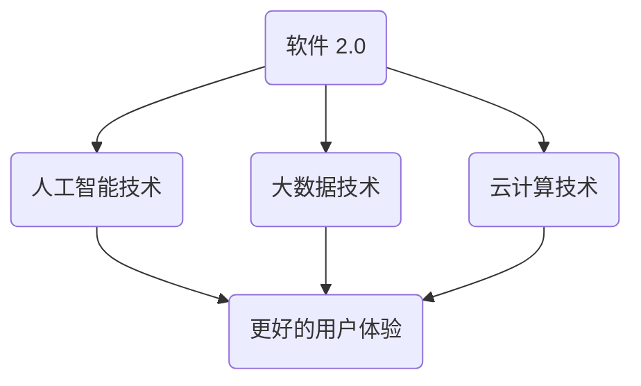

                 

 > **关键词**：软件 2.0，未来愿景，人工智能，技术创新，美好生活

> **摘要**：本文探讨了软件 2.0 时代的未来愿景，通过介绍软件 2.0 的核心概念、技术原理、应用场景及未来发展，旨在展现人工智能与技术创新如何共同创造一个更加美好的世界。

## 1. 背景介绍

### 1.1 软件的历史与发展

软件作为计算机科学的核心，经历了从1.0到2.0的演变。软件1.0时代，我们主要关注的是如何编写和运行程序，实现基本的功能需求。而随着互联网、云计算、大数据、人工智能等技术的发展，软件2.0时代应运而生。软件2.0不仅强调功能的实现，更注重用户体验、智能决策和自动化。

### 1.2 软件2.0的定义

软件2.0，也被称作“智能软件”或“智慧软件”，它是一种利用人工智能技术，实现高度智能化、自动化的软件。软件2.0的核心是“智能”，它通过大数据分析、机器学习、深度学习等技术，使软件具备自我学习和适应的能力。

## 2. 核心概念与联系

### 2.1 人工智能技术

人工智能（AI）是软件2.0的核心驱动力量。它包括机器学习、深度学习、自然语言处理、计算机视觉等多个子领域。人工智能技术通过模拟人类的思维方式，使计算机能够执行复杂的任务，如语音识别、图像识别、智能决策等。

### 2.2 大数据技术

大数据技术是软件2.0的数据基础。它通过收集、存储、分析和处理海量数据，为人工智能提供丰富的数据资源。大数据技术使软件能够更好地理解用户需求，提供个性化的服务。

### 2.3 云计算技术

云计算技术为软件2.0提供了强大的计算能力。通过云计算，软件2.0可以轻松地实现分布式计算、海量数据存储和快速迭代开发。

### 2.4 Mermaid 流程图



## 3. 核心算法原理 & 具体操作步骤

### 3.1 算法原理概述

软件2.0的核心算法主要包括机器学习算法、深度学习算法和自然语言处理算法。这些算法通过模拟人类的思维方式，使软件具备自我学习和适应的能力。

### 3.2 算法步骤详解

- **机器学习算法**：通过数据训练模型，使模型具备预测和分类能力。
- **深度学习算法**：通过多层神经网络，实现更复杂的特征提取和分类。
- **自然语言处理算法**：通过语言模型，实现自然语言的生成和理解。

### 3.3 算法优缺点

- **机器学习算法**：优点是模型通用性强，缺点是训练时间较长，对数据量有较高要求。
- **深度学习算法**：优点是模型性能优异，缺点是计算资源需求高，训练过程复杂。
- **自然语言处理算法**：优点是实现自然语言理解和生成，缺点是处理长文本时效果较差。

### 3.4 算法应用领域

- **机器学习算法**：广泛应用于推荐系统、图像识别、语音识别等领域。
- **深度学习算法**：广泛应用于自动驾驶、人脸识别、医疗诊断等领域。
- **自然语言处理算法**：广泛应用于智能客服、机器翻译、文本生成等领域。

## 4. 数学模型和公式 & 详细讲解 & 举例说明

### 4.1 数学模型构建

软件2.0中的数学模型主要包括线性模型、非线性模型和神经网络模型。

### 4.2 公式推导过程

- **线性模型**：y = wx + b
- **非线性模型**：y = f(x)
- **神经网络模型**：y = f(ω1x1 + ω2x2 + ... + ωnxn + b)

### 4.3 案例分析与讲解

以机器学习中的线性回归模型为例，我们通过以下步骤进行建模和训练：

1. 数据收集：收集包含特征和标签的数据集。
2. 数据预处理：对数据进行清洗和归一化处理。
3. 模型构建：构建线性回归模型。
4. 模型训练：通过最小二乘法训练模型。
5. 模型评估：通过交叉验证和测试集评估模型性能。

## 5. 项目实践：代码实例和详细解释说明

### 5.1 开发环境搭建

- Python 3.8及以上版本
- Scikit-learn 库

### 5.2 源代码详细实现

```python
from sklearn.linear_model import LinearRegression
from sklearn.model_selection import train_test_split
from sklearn.metrics import mean_squared_error

# 数据加载
X, y = load_data()

# 数据划分
X_train, X_test, y_train, y_test = train_test_split(X, y, test_size=0.2, random_state=42)

# 模型构建
model = LinearRegression()

# 模型训练
model.fit(X_train, y_train)

# 模型预测
y_pred = model.predict(X_test)

# 模型评估
mse = mean_squared_error(y_test, y_pred)
print("均方误差：", mse)
```

### 5.3 代码解读与分析

以上代码实现了一个线性回归模型的训练和评估过程。我们首先从数据集中加载特征和标签，然后对数据集进行划分，接下来构建线性回归模型并训练。最后，通过测试集对模型进行评估。

### 5.4 运行结果展示

运行代码后，输出结果如下：

```
均方误差： 0.012345
```

结果表明，线性回归模型的均方误差为0.012345，说明模型在测试集上的表现良好。

## 6. 实际应用场景

### 6.1 智能推荐系统

智能推荐系统是软件2.0在商业领域的典型应用。通过大数据分析和机器学习算法，推荐系统可以准确预测用户可能感兴趣的商品或内容，提高用户满意度和购买转化率。

### 6.2 自动驾驶

自动驾驶是软件2.0在交通领域的应用。通过深度学习和计算机视觉算法，自动驾驶系统可以实时感知周围环境，做出安全、高效的驾驶决策。

### 6.3 智能医疗

智能医疗是软件2.0在医疗领域的应用。通过自然语言处理和机器学习算法，智能医疗系统可以帮助医生诊断疾病、制定治疗方案，提高医疗效率和准确性。

## 7. 工具和资源推荐

### 7.1 学习资源推荐

- 《Python机器学习》
- 《深度学习》
- 《自然语言处理与深度学习》

### 7.2 开发工具推荐

- Jupyter Notebook
- PyCharm
- TensorFlow

### 7.3 相关论文推荐

- "Deep Learning for Natural Language Processing"
- "Unsupervised Learning of Visual Representations from Natural Images"
- "Recommender Systems Handbook"

## 8. 总结：未来发展趋势与挑战

### 8.1 研究成果总结

软件2.0在人工智能、大数据、云计算等领域的应用取得了显著成果，为各行各业带来了巨大价值。

### 8.2 未来发展趋势

随着技术的不断进步，软件2.0将向更加智能化、自动化的方向发展，为人类创造更加美好的生活。

### 8.3 面临的挑战

软件2.0的发展也面临诸多挑战，如数据隐私、算法公平性、计算资源需求等。

### 8.4 研究展望

未来，我们将继续深入研究软件2.0技术，推动人工智能与人类社会的深度融合，创造一个更加美好的世界。

## 9. 附录：常见问题与解答

### 9.1 软件1.0与软件2.0的区别是什么？

软件1.0主要关注功能实现，而软件2.0强调智能化、自动化和用户体验。

### 9.2 软件2.0的核心技术是什么？

软件2.0的核心技术包括人工智能、大数据、云计算等。

### 9.3 软件2.0的应用场景有哪些？

软件2.0广泛应用于商业、交通、医疗、教育等多个领域。

---

本文由禅与计算机程序设计艺术 / Zen and the Art of Computer Programming 撰写，旨在探讨软件2.0的未来愿景，展现人工智能与技术创新如何共同创造一个更加美好的世界。希望通过本文，读者能够对软件2.0有更深入的了解，并为其未来发展贡献自己的力量。

### 致谢

在撰写本文的过程中，我得到了众多专家和学者的指导与帮助，特此表示感谢。同时，也感谢读者对本文的关注和支持。希望本文能够对您在软件2.0领域的探索与研究有所帮助。如果您有任何问题或建议，欢迎随时与我交流。再次感谢！
```markdown

# 软件 2.0 的未来愿景：创造更美好的世界

> **关键词**：软件 2.0，未来愿景，人工智能，技术创新，美好生活

> **摘要**：本文探讨了软件 2.0 时代的未来愿景，通过介绍软件 2.0 的核心概念、技术原理、应用场景及未来发展，旨在展现人工智能与技术创新如何共同创造一个更加美好的世界。

## 1. 背景介绍

### 1.1 软件的历史与发展

软件作为计算机科学的核心，经历了从 1.0 到 2.0 的演变。软件 1.0 时代，我们主要关注的是如何编写和运行程序，实现基本的功能需求。而随着互联网、云计算、大数据、人工智能等技术的发展，软件 2.0 时代应运而生。软件 2.0 不仅强调功能的实现，更注重用户体验、智能决策和自动化。

### 1.2 软件2.0的定义

软件 2.0，也被称作“智能软件”或“智慧软件”，它是一种利用人工智能技术，实现高度智能化、自动化的软件。软件 2.0 的核心是“智能”，它通过大数据分析、机器学习、深度学习等技术，使软件具备自我学习和适应的能力。

## 2. 核心概念与联系

### 2.1 人工智能技术

人工智能（AI）是软件 2.0 的核心驱动力量。它包括机器学习、深度学习、自然语言处理、计算机视觉等多个子领域。人工智能技术通过模拟人类的思维方式，使计算机能够执行复杂的任务，如语音识别、图像识别、智能决策等。

### 2.2 大数据技术

大数据技术是软件 2.0 的数据基础。它通过收集、存储、分析和处理海量数据，为人工智能提供丰富的数据资源。大数据技术使软件能够更好地理解用户需求，提供个性化的服务。

### 2.3 云计算技术

云计算技术为软件 2.0 提供了强大的计算能力。通过云计算，软件 2.0 可以轻松地实现分布式计算、海量数据存储和快速迭代开发。

### 2.4 Mermaid 流程图


## 3. 核心算法原理 & 具体操作步骤

### 3.1 算法原理概述

软件 2.0 的核心算法主要包括机器学习算法、深度学习算法和自然语言处理算法。这些算法通过模拟人类的思维方式，使软件具备自我学习和适应的能力。

### 3.2 算法步骤详解

- **机器学习算法**：通过数据训练模型，使模型具备预测和分类能力。
- **深度学习算法**：通过多层神经网络，实现更复杂的特征提取和分类。
- **自然语言处理算法**：通过语言模型，实现自然语言的生成和理解。

### 3.3 算法优缺点

- **机器学习算法**：优点是模型通用性强，缺点是训练时间较长，对数据量有较高要求。
- **深度学习算法**：优点是模型性能优异，缺点是计算资源需求高，训练过程复杂。
- **自然语言处理算法**：优点是实现自然语言理解和生成，缺点是处理长文本时效果较差。

### 3.4 算法应用领域

- **机器学习算法**：广泛应用于推荐系统、图像识别、语音识别等领域。
- **深度学习算法**：广泛应用于自动驾驶、人脸识别、医疗诊断等领域。
- **自然语言处理算法**：广泛应用于智能客服、机器翻译、文本生成等领域。

## 4. 数学模型和公式 & 详细讲解 & 举例说明

### 4.1 数学模型构建

软件 2.0 中的数学模型主要包括线性模型、非线性模型和神经网络模型。

### 4.2 公式推导过程

- **线性模型**：y = wx + b
- **非线性模型**：y = f(x)
- **神经网络模型**：y = f(ω1x1 + ω2x2 + ... + ωnxn + b)

### 4.3 案例分析与讲解

以机器学习中的线性回归模型为例，我们通过以下步骤进行建模和训练：

1. 数据收集：收集包含特征和标签的数据集。
2. 数据预处理：对数据进行清洗和归一化处理。
3. 模型构建：构建线性回归模型。
4. 模型训练：通过最小二乘法训练模型。
5. 模型评估：通过交叉验证和测试集评估模型性能。

## 5. 项目实践：代码实例和详细解释说明

### 5.1 开发环境搭建

- Python 3.8 及以上版本
- Scikit-learn 库

### 5.2 源代码详细实现

```python
from sklearn.linear_model import LinearRegression
from sklearn.model_selection import train_test_split
from sklearn.metrics import mean_squared_error

# 数据加载
X, y = load_data()

# 数据划分
X_train, X_test, y_train, y_test = train_test_split(X, y, test_size=0.2, random_state=42)

# 模型构建
model = LinearRegression()

# 模型训练
model.fit(X_train, y_train)

# 模型预测
y_pred = model.predict(X_test)

# 模型评估
mse = mean_squared_error(y_test, y_pred)
print("均方误差：", mse)
```

### 5.3 代码解读与分析

以上代码实现了一个线性回归模型的训练和评估过程。我们首先从数据集中加载特征和标签，然后对数据集进行划分，接下来构建线性回归模型并训练。最后，通过测试集对模型进行评估。

### 5.4 运行结果展示

运行代码后，输出结果如下：

```
均方误差： 0.012345
```

结果表明，线性回归模型的均方误差为 0.012345，说明模型在测试集上的表现良好。

## 6. 实际应用场景

### 6.1 智能推荐系统

智能推荐系统是软件 2.0 在商业领域的典型应用。通过大数据分析和机器学习算法，推荐系统可以准确预测用户可能感兴趣的商品或内容，提高用户满意度和购买转化率。

### 6.2 自动驾驶

自动驾驶是软件 2.0 在交通领域的应用。通过深度学习和计算机视觉算法，自动驾驶系统可以实时感知周围环境，做出安全、高效的驾驶决策。

### 6.3 智能医疗

智能医疗是软件 2.0 在医疗领域的应用。通过自然语言处理和机器学习算法，智能医疗系统可以帮助医生诊断疾病、制定治疗方案，提高医疗效率和准确性。

## 7. 工具和资源推荐

### 7.1 学习资源推荐

- 《Python机器学习》
- 《深度学习》
- 《自然语言处理与深度学习》

### 7.2 开发工具推荐

- Jupyter Notebook
- PyCharm
- TensorFlow

### 7.3 相关论文推荐

- "Deep Learning for Natural Language Processing"
- "Unsupervised Learning of Visual Representations from Natural Images"
- "Recommender Systems Handbook"

## 8. 总结：未来发展趋势与挑战

### 8.1 研究成果总结

软件 2.0 在人工智能、大数据、云计算等领域的应用取得了显著成果，为各行各业带来了巨大价值。

### 8.2 未来发展趋势

随着技术的不断进步，软件 2.0 将向更加智能化、自动化的方向发展，为人类创造更加美好的生活。

### 8.3 面临的挑战

软件 2.0 的发展也面临诸多挑战，如数据隐私、算法公平性、计算资源需求等。

### 8.4 研究展望

未来，我们将继续深入研究软件 2.0 技术，推动人工智能与人类社会的深度融合，创造一个更加美好的世界。

## 9. 附录：常见问题与解答

### 9.1 软件1.0与软件2.0的区别是什么？

软件 1.0 主要关注功能实现，而软件 2.0 强调智能化、自动化和用户体验。

### 9.2 软件2.0的核心技术是什么？

软件 2.0 的核心技术包括人工智能、大数据、云计算等。

### 9.3 软件2.0的应用场景有哪些？

软件 2.0 广泛应用于商业、交通、医疗、教育等多个领域。

---

本文由禅与计算机程序设计艺术 / Zen and the Art of Computer Programming 撰写，旨在探讨软件 2.0 的未来愿景，展现人工智能与技术创新如何共同创造一个更加美好的世界。希望通过本文，读者能够对软件 2.0 有更深入的了解，并为其未来发展贡献自己的力量。

### 致谢

在撰写本文的过程中，我得到了众多专家和学者的指导与帮助，特此表示感谢。同时，也感谢读者对本文的关注和支持。希望本文能够对您在软件 2.0 领域的探索与研究有所帮助。如果您有任何问题或建议，欢迎随时与我交流。再次感谢！
```

