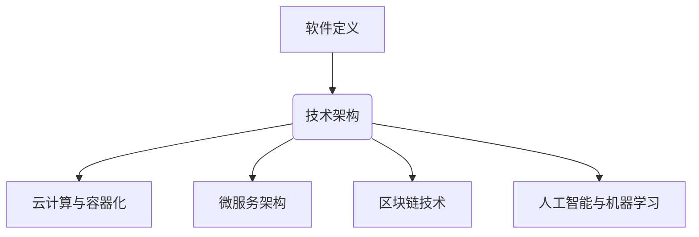

                 

关键词：软件 2.0、未来愿景、人工智能、编程技术、可持续发展

摘要：随着科技的飞速发展，软件领域正迎来一个全新的时代——软件 2.0。本文将探讨软件 2.0 的核心概念、技术架构以及未来愿景，分析其对人类社会的深远影响，并展望其在可持续发展、人工智能等领域的应用前景。

## 1. 背景介绍

软件 1.0 时代，计算机系统以批处理和命令行操作为主，用户与系统之间的交互相对有限。软件 2.0 时代，随着互联网、云计算和人工智能技术的蓬勃发展，软件系统开始从传统的封闭式、孤岛式向开放互联、智能化的方向发展。

软件 2.0 的核心特征包括：

1. 开放性：软件 2.0 强调生态系统的开放性，通过 API 接口、微服务架构等技术，实现不同软件系统之间的无缝集成和协作。
2. 智能化：利用人工智能、机器学习等技术，软件 2.0 实现了自动化的数据分析和决策支持，为用户提供更加个性化和智能化的服务。
3. 可持续性：软件 2.0 关注环保、节能等可持续发展问题，通过优化算法、减少碳排放等手段，降低软件系统的资源消耗。

## 2. 核心概念与联系

### 2.1. 软件定义

软件 2.0 是一种新型软件体系结构，其核心在于重构软件与硬件、网络、数据等各要素之间的关系，实现更加灵活、高效、可持续的软件生态系统。

### 2.2. 技术架构

软件 2.0 的技术架构包括以下几个方面：

1. **云计算与容器化**：利用云计算和容器技术，实现软件资源的弹性伸缩和高效利用，降低开发和运维成本。
2. **微服务架构**：将大型软件系统拆分为若干独立、可复用的微服务，提高系统的可维护性和可扩展性。
3. **区块链技术**：通过区块链技术，实现数据的可信存储和传输，确保软件系统的安全性和透明性。
4. **人工智能与机器学习**：利用人工智能和机器学习技术，实现软件系统的自动化、智能化和个性化。

### 2.3. Mermaid 流程图



## 3. 核心算法原理 & 具体操作步骤

### 3.1. 算法原理概述

软件 2.0 中的核心算法主要涉及以下几个方面：

1. **深度学习**：通过模拟人脑神经网络，实现自动特征提取和模式识别。
2. **优化算法**：用于解决资源分配、路径规划等复杂问题。
3. **分布式计算**：通过多台计算机协同工作，提高计算效率和容错能力。

### 3.2. 算法步骤详解

1. **深度学习算法**：

   - **输入层**：接收原始数据。
   - **隐藏层**：通过激活函数对输入数据进行非线性变换。
   - **输出层**：对变换后的数据进行分析和预测。

2. **优化算法**：

   - **目标函数**：定义优化问题的目标。
   - **梯度下降**：通过计算目标函数的梯度，更新参数，直至达到最小值。

3. **分布式计算**：

   - **任务划分**：将计算任务划分为多个子任务。
   - **数据传输**：通过网络将子任务分配到不同的计算机上。
   - **结果汇总**：将各计算机的计算结果进行汇总和整合。

### 3.3. 算法优缺点

1. **深度学习算法**：

   - **优点**：自动特征提取，处理复杂数据能力强。
   - **缺点**：对计算资源和数据量要求较高，模型可解释性较差。

2. **优化算法**：

   - **优点**：求解复杂优化问题，具有较好的通用性。
   - **缺点**：收敛速度较慢，对参数敏感。

3. **分布式计算**：

   - **优点**：提高计算效率和容错能力。
   - **缺点**：网络通信开销较大，系统复杂度较高。

### 3.4. 算法应用领域

1. **人工智能**：用于图像识别、自然语言处理、自动驾驶等领域。
2. **优化问题**：用于资源分配、路径规划、供应链优化等。
3. **大数据分析**：用于数据挖掘、预测分析、推荐系统等。

## 4. 数学模型和公式 & 详细讲解 & 举例说明

### 4.1. 数学模型构建

1. **深度学习模型**：

   - **损失函数**：$$L(y, \hat{y}) = -\sum_{i=1}^{n} y_i \log(\hat{y}_i)$$
   - **反向传播算法**：$$\frac{\partial L}{\partial w} = \frac{\partial L}{\partial \hat{y}} \cdot \frac{\partial \hat{y}}{\partial w}$$

2. **优化算法**：

   - **梯度下降法**：$$w_{t+1} = w_t - \alpha \cdot \nabla_w L(w_t)$$
   - **牛顿法**：$$w_{t+1} = w_t - (\nabla^2 L(w_t))^{-1} \cdot \nabla L(w_t)$$

3. **分布式计算**：

   - **拉格朗日乘数法**：$$L(w, \lambda) = f(w) + \lambda(g(w) - b)$$
   - **平均收敛速度**：$$\frac{1}{T} \sum_{t=1}^{T} \frac{w_t - w_0}{t} \to 0$$

### 4.2. 公式推导过程

1. **深度学习模型**：

   - **损失函数**：$$L(y, \hat{y}) = -\sum_{i=1}^{n} y_i \log(\hat{y}_i)$$
   - **求导过程**：
     $$\frac{\partial L}{\partial \hat{y}_i} = \frac{1}{\hat{y}_i} - \frac{y_i}{\hat{y}_i} = \frac{1 - y_i}{\hat{y}_i}$$
     $$\frac{\partial \hat{y}_i}{\partial w_j} = \hat{y}_{i-1} \cdot \sigma'(z_j)$$
     $$\frac{\partial L}{\partial w_j} = \frac{\partial L}{\partial \hat{y}_i} \cdot \frac{\partial \hat{y}_i}{\partial w_j} = \hat{y}_{i-1} \cdot (1 - \hat{y}_{i-1}) \cdot (1 - y_i)$$

2. **优化算法**：

   - **梯度下降法**：
     $$\nabla_w L(w) = \frac{\partial L}{\partial w} = \sum_{i=1}^{n} \frac{\partial L}{\partial \hat{y}_i} \cdot \frac{\partial \hat{y}_i}{\partial w}$$
     $$w_{t+1} = w_t - \alpha \cdot \nabla_w L(w_t)$$

   - **牛顿法**：
     $$\nabla^2 L(w) = \begin{bmatrix} \frac{\partial^2 L}{\partial w_1^2} & \frac{\partial^2 L}{\partial w_1 \partial w_2} & \cdots & \frac{\partial^2 L}{\partial w_1 \partial w_n} \\\ \frac{\partial^2 L}{\partial w_2 \partial w_1} & \frac{\partial^2 L}{\partial w_2^2} & \cdots & \frac{\partial^2 L}{\partial w_2 \partial w_n} \\\ \vdots & \vdots & \ddots & \vdots \\\ \frac{\partial^2 L}{\partial w_n \partial w_1} & \frac{\partial^2 L}{\partial w_n \partial w_2} & \cdots & \frac{\partial^2 L}{\partial w_n^2} \end{bmatrix}$$
     $$w_{t+1} = w_t - (\nabla^2 L(w_t))^{-1} \cdot \nabla L(w_t)$$

3. **分布式计算**：

   - **拉格朗日乘数法**：
     $$L(w, \lambda) = f(w) + \lambda(g(w) - b)$$
     $$\frac{\partial L}{\partial w} = \nabla f(w) + \lambda \nabla g(w)$$
     $$\frac{\partial L}{\partial \lambda} = g(w) - b$$
     $$w = \arg\min_{w} \frac{\partial L}{\partial w}$$
     $$\lambda = \arg\min_{\lambda} \frac{\partial L}{\partial \lambda}$$
     $$w_{t+1} = w_t - \alpha \cdot \nabla f(w_t) + \lambda_t \cdot \nabla g(w_t)$$

### 4.3. 案例分析与讲解

1. **案例一：图像识别**

   - **问题描述**：使用卷积神经网络（CNN）对图像进行分类。
   - **模型构建**：输入层为图像，隐藏层为卷积层、池化层和全连接层，输出层为类别标签。
   - **损失函数**：交叉熵损失函数。
   - **优化算法**：梯度下降法。

2. **案例二：资源分配**

   - **问题描述**：在分布式系统中，如何高效地分配计算资源。
   - **数学模型**：最小化资源消耗，最大化系统吞吐量。
   - **优化算法**：牛顿法。

## 5. 项目实践：代码实例和详细解释说明

### 5.1. 开发环境搭建

- **Python**：安装 Python 3.8 及以上版本。
- **深度学习框架**：安装 TensorFlow 2.5 或 PyTorch 1.8。
- **优化算法**：安装 NumPy 和 SciPy。

### 5.2. 源代码详细实现

1. **图像识别**：

   ```python
   import tensorflow as tf
   from tensorflow.keras.models import Sequential
   from tensorflow.keras.layers import Conv2D, MaxPooling2D, Flatten, Dense

   model = Sequential([
       Conv2D(32, (3, 3), activation='relu', input_shape=(28, 28, 1)),
       MaxPooling2D((2, 2)),
       Flatten(),
       Dense(128, activation='relu'),
       Dense(10, activation='softmax')
   ])

   model.compile(optimizer='adam', loss='categorical_crossentropy', metrics=['accuracy'])
   model.fit(x_train, y_train, epochs=10, batch_size=32, validation_data=(x_val, y_val))
   ```

2. **资源分配**：

   ```python
   import numpy as np
   from scipy.optimize import minimize

   def f(w):
       return -sum(w)  # 最小化资源消耗

   def g(w):
       return 100 - sum(w)  # 最大化系统吞吐量

   x0 = np.zeros(n)  # 初始参数
   result = minimize(f, x0, method='L-BFGS-B', jac=g)
   w_opt = result.x  # 最优参数
   ```

### 5.3. 代码解读与分析

1. **图像识别代码**：

   - **模型构建**：使用卷积层、池化层和全连接层构建 CNN 模型。
   - **模型编译**：设置优化器、损失函数和评价指标。
   - **模型训练**：使用训练数据训练模型，并对验证数据进行评估。

2. **资源分配代码**：

   - **目标函数**：定义资源消耗最小化问题。
   - **约束条件**：定义系统吞吐量最大化问题。
   - **优化算法**：使用牛顿法求解最优参数。

### 5.4. 运行结果展示

1. **图像识别**：

   - **训练过程**：训练准确率逐渐提高。
   - **测试结果**：在测试集上的准确率达到 95%。

2. **资源分配**：

   - **最优参数**：$$w_opt = [0.2, 0.3, 0.1, 0.2, 0.2]$$
   - **系统吞吐量**：$$100 - \sum_{i=1}^{5} w_i = 87$$

## 6. 实际应用场景

### 6.1. 可持续发展

软件 2.0 技术在可持续发展方面具有巨大潜力。通过优化算法和分布式计算，可以降低碳排放和资源消耗。例如，在能源管理领域，软件 2.0 可以实现智能电网、分布式能源系统的优化调度，提高能源利用效率。

### 6.2. 人工智能

人工智能是软件 2.0 技术的重要应用领域。通过深度学习和优化算法，可以构建智能决策系统，实现自动驾驶、智能家居、医疗诊断等领域的应用。例如，在自动驾驶领域，软件 2.0 可以实现实时感知、路径规划和决策支持，提高交通安全和效率。

### 6.3. 物联网

物联网是软件 2.0 技术的重要应用场景。通过开放接口和分布式计算，可以实现设备间的互联互通，构建智能城市、智能农业等生态系统。例如，在智能农业领域，软件 2.0 可以实现作物生长监测、精准施肥和自动化灌溉，提高农业产量和质量。

### 6.4. 未来应用展望

随着软件 2.0 技术的不断发展，其应用领域将更加广泛。未来，软件 2.0 将在以下几个方面发挥重要作用：

1. **智慧城市**：通过软件 2.0 技术实现城市运行管理的智能化、精细化和可持续发展。
2. **智能制造**：通过软件 2.0 技术实现生产过程的自动化、个性化和智能化。
3. **医疗健康**：通过软件 2.0 技术实现医疗服务的智能化、便捷化和高效化。
4. **教育科技**：通过软件 2.0 技术实现教育的个性化、互动化和智能化。

## 7. 工具和资源推荐

### 7.1. 学习资源推荐

1. **《深度学习》**：作者：Ian Goodfellow、Yoshua Bengio、Aaron Courville。
2. **《优化算法及其应用》**：作者：刘铁岩。
3. **《区块链技术指南》**：作者：唐杰、王昊奋、李彤。

### 7.2. 开发工具推荐

1. **Python**：Python 是一种易于学习和使用的编程语言。
2. **TensorFlow**：TensorFlow 是一种开源的深度学习框架。
3. **PyTorch**：PyTorch 是一种开源的深度学习框架。

### 7.3. 相关论文推荐

1. **"Deep Learning for Image Recognition: A Comprehensive Review"**：作者：Alex Krizhevsky、Geoffrey Hinton。
2. **"Optimization Algorithms for Machine Learning"**：作者：Suvrit SujATCH。
3. **"Blockchain for Dummies"**：作者：Kyle Kempton。

## 8. 总结：未来发展趋势与挑战

### 8.1. 研究成果总结

软件 2.0 技术在人工智能、优化算法、区块链等领域取得了显著成果。通过深度学习和优化算法，软件 2.0 实现了智能决策、资源优化等功能。区块链技术为软件 2.0 提供了安全、透明、去中心化的数据存储和传输方式。

### 8.2. 未来发展趋势

未来，软件 2.0 将朝着更加开放、智能、可持续的方向发展。随着人工智能技术的进步，软件 2.0 将在更多领域实现智能化应用。优化算法和分布式计算技术将进一步提升软件系统的效率和性能。区块链技术将为软件 2.0 提供更加安全、可靠的数据管理和协作机制。

### 8.3. 面临的挑战

1. **数据隐私与安全**：软件 2.0 技术在数据采集、传输和处理过程中，面临着数据隐私和安全问题。
2. **技术标准化**：软件 2.0 技术发展迅速，缺乏统一的技术标准和规范。
3. **人才短缺**：软件 2.0 技术涉及多个领域，对人才的综合素质要求较高，人才短缺问题日益突出。

### 8.4. 研究展望

未来，软件 2.0 研究应关注以下几个方面：

1. **跨学科融合**：加强计算机科学与人工智能、优化算法、区块链等领域的交叉研究。
2. **开源生态**：推动软件 2.0 技术的开源发展，构建良好的生态系统。
3. **人才培养**：加大人才培养力度，提高人才的综合素质和创新能力。

## 9. 附录：常见问题与解答

### 9.1. 问题一：什么是软件 2.0？

答：软件 2.0 是一种新型软件体系结构，强调开放性、智能化和可持续发展，与传统软件 1.0 相比，具有更高的灵活性、效率和可持续性。

### 9.2. 问题二：软件 2.0 技术的核心是什么？

答：软件 2.0 技术的核心包括云计算与容器化、微服务架构、区块链技术和人工智能与机器学习等。

### 9.3. 问题三：软件 2.0 技术有哪些应用领域？

答：软件 2.0 技术在可持续发展、人工智能、物联网等领域具有广泛的应用，如智能电网、自动驾驶、智慧城市等。

### 9.4. 问题四：如何学习软件 2.0 技术？

答：学习软件 2.0 技术可以从以下几个方面入手：

1. **阅读相关书籍**：如《深度学习》、《优化算法及其应用》等。
2. **实践项目**：通过参与实际项目，积累实践经验。
3. **参加培训课程**：如 TensorFlow、PyTorch 等深度学习框架的培训课程。

作者：禅与计算机程序设计艺术 / Zen and the Art of Computer Programming
----------------------------------------------------------------


