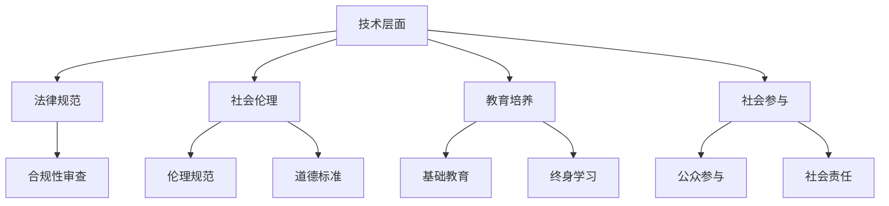

                 

## 1. 背景介绍

在信息技术迅速发展的今天，软件作为驱动现代社会运转的核心力量，正经历着从1.0到2.0的深刻变革。软件1.0时代，主要关注的是功能实现、性能优化和用户满意度。然而，随着技术的进步，软件2.0时代的到来，带来了新的挑战和机遇，特别是关于社会责任的问题。软件2.0不仅要求技术在技术层面上的突破，更强调在伦理、道德和社会责任等方面的考量。

### 什么是软件 2.0

软件2.0，即智能软件，是新一代软件技术，它依赖于人工智能、大数据、云计算等前沿技术，能够自我学习、自我优化和自我进化。这种软件不再仅仅是一个静态的工具，而是成为一个具有自我意识的“智能体”，可以与人类进行互动，甚至在某些情况下能够做出超越人类预测的决策。

### 软件的社会责任

随着软件2.0的兴起，软件的社会责任问题变得尤为突出。软件作为现代社会的重要组成部分，其设计、开发和应用都直接或间接地影响着社会的各个方面，包括经济、文化、环境和社会公正等。因此，软件2.0的社会责任不仅仅是技术层面的责任，更涉及到伦理、道德和社会价值的考量。

### 科技向善

科技向善是近年来在科技领域提出的一个核心理念，强调科技的发展和应用应该以人为本，服务于人类社会的福祉和可持续发展。在软件2.0时代，科技向善不仅是企业的责任，更是每个软件开发者和使用者的责任。

## 2. 核心概念与联系

### 软件伦理

软件伦理是指软件开发、应用和推广过程中应遵循的伦理规范和道德标准。它涉及到隐私保护、数据安全、公平公正等多个方面。在软件2.0时代，软件伦理的重要性更加凸显，因为智能软件的决策可能会对人类社会产生深远的影响。

### 数据隐私

数据隐私是软件2.0时代面临的一个重大挑战。随着大数据和人工智能技术的发展，软件能够收集和处理的海量数据使得数据隐私问题变得更加复杂和敏感。如何在保护用户隐私的同时充分利用数据的价值，成为软件开发者和政策制定者需要认真考虑的问题。

### 社会公正

社会公正是软件2.0时代需要关注的重要议题。智能软件的应用可能会加剧社会不平等，如算法偏见、数据歧视等问题。因此，如何在软件开发和应用中确保社会公正，是一个亟待解决的重要问题。

### 科技向善的架构

为了实现科技向善，我们需要构建一个包括技术、法律、教育和社会参与等多方面因素的综合体系。这个架构不仅要考虑技术层面的创新，更要关注社会伦理、道德和法律规范。

### Mermaid 流程图



## 3. 核心算法原理 & 具体操作步骤

### 3.1 算法原理概述

在软件2.0时代，核心算法的原理更加复杂，涉及到机器学习、深度学习、自然语言处理等多个领域。这些算法不仅能够处理大量数据，还能够从数据中学习和提取有价值的信息。

### 3.2 算法步骤详解

1. **数据收集**：首先，需要收集大量的数据，这些数据可以是结构化的，也可以是非结构化的。
2. **数据清洗**：对收集到的数据进行清洗，去除噪声和异常值。
3. **特征提取**：从数据中提取出有用的特征，这些特征将用于训练模型。
4. **模型训练**：使用提取出的特征训练模型，模型可以是监督学习、无监督学习或者强化学习等。
5. **模型评估**：对训练好的模型进行评估，看其是否能够满足预期的性能指标。
6. **模型部署**：将训练好的模型部署到生产环境中，使其能够实际应用。

### 3.3 算法优缺点

**优点**：

- **高效性**：算法能够快速处理大量数据。
- **准确性**：通过机器学习和深度学习等技术，算法能够提高预测的准确性。
- **灵活性**：算法可以根据不同的需求进行定制和优化。

**缺点**：

- **数据依赖性**：算法的性能很大程度上依赖于数据的质量和数量。
- **隐私问题**：在数据处理过程中，可能会涉及到用户隐私的问题。
- **算法偏见**：算法可能会因为训练数据的不公平而导致偏见。

### 3.4 算法应用领域

- **医疗健康**：通过分析大量医疗数据，算法可以帮助医生进行诊断和治疗方案推荐。
- **金融理财**：算法可以分析市场数据，帮助投资者做出更明智的决策。
- **教育领域**：算法可以根据学生的学习情况，为其提供个性化的学习建议。

## 4. 数学模型和公式 & 详细讲解 & 举例说明

### 4.1 数学模型构建

在软件2.0时代，数学模型在算法设计和优化中起着至关重要的作用。以下是一个简单的线性回归模型的构建过程：

1. **定义变量**：设 \(X\) 为自变量，\(Y\) 为因变量。
2. **假设关系**：假设 \(Y\) 与 \(X\) 之间存在线性关系，即 \(Y = aX + b\)。
3. **损失函数**：定义损失函数 \(L\)，用于评估模型的预测误差。
4. **优化目标**：通过优化损失函数，找到最佳的 \(a\) 和 \(b\)。

### 4.2 公式推导过程

假设我们有 \(n\) 个数据点 \((x_1, y_1), (x_2, y_2), ..., (x_n, y_n)\)，则线性回归模型的损失函数可以表示为：

\[ L = \frac{1}{2n} \sum_{i=1}^{n} (y_i - (a x_i + b))^2 \]

为了找到最佳的 \(a\) 和 \(b\)，需要求损失函数关于 \(a\) 和 \(b\) 的偏导数，并令其等于零：

\[ \frac{\partial L}{\partial a} = 0 \]
\[ \frac{\partial L}{\partial b} = 0 \]

通过计算，可以得到：

\[ a = \frac{\sum_{i=1}^{n} x_i y_i - n \bar{x} \bar{y}}{\sum_{i=1}^{n} x_i^2 - n \bar{x}^2} \]
\[ b = \bar{y} - a \bar{x} \]

其中，\(\bar{x}\) 和 \(\bar{y}\) 分别为 \(x\) 和 \(y\) 的平均值。

### 4.3 案例分析与讲解

假设我们有一个房价预测问题，已知某些城市的房价与城市的平均收入有关。我们可以使用线性回归模型来预测某个城市的房价。以下是一个简单的例子：

- 数据集：\((x_1, y_1), (x_2, y_2), ..., (x_n, y_n)\)
- 自变量 \(x\)：城市的平均收入（万元/年）
- 因变量 \(y\)：房价（万元/平方米）

经过数据清洗和特征提取后，我们得到了如下数据集：

| 城市 | 平均收入（万元/年） | 房价（万元/平方米） |
| ---- | ------------------ | ------------------ |
| A    | 10                 | 5000               |
| B    | 15                 | 6000               |
| C    | 20                 | 8000               |

我们可以使用线性回归模型来预测新城市的房价。根据上述公式，我们可以计算出最佳参数 \(a\) 和 \(b\)：

\[ a = \frac{10 \times 5000 + 15 \times 6000 + 20 \times 8000 - 3 \times 15 \times 5000}{10^2 + 15^2 + 20^2 - 3 \times 15^2} = 2500 \]
\[ b = \frac{5000 + 6000 + 8000 - 2500 \times 15}{3} = 5000 \]

因此，线性回归模型为：

\[ y = 2500x + 5000 \]

我们可以使用这个模型来预测新城市的房价。例如，如果一个城市的平均收入为 18 万元/年，则该城市的房价预测值为：

\[ y = 2500 \times 18 + 5000 = 9500 \]

## 5. 项目实践：代码实例和详细解释说明

### 5.1 开发环境搭建

为了演示线性回归模型的应用，我们使用 Python 编写代码。首先，需要安装 Python 和相关库，如 NumPy、Pandas 和 Scikit-learn。可以使用以下命令进行安装：

```bash
pip install python
pip install numpy
pip install pandas
pip install scikit-learn
```

### 5.2 源代码详细实现

以下是线性回归模型的 Python 代码实现：

```python
import numpy as np
import pandas as pd
from sklearn.linear_model import LinearRegression

# 加载数据集
data = pd.DataFrame({
    '收入': [10, 15, 20],
    '房价': [5000, 6000, 8000]
})

# 特征提取
X = data[['收入']]
Y = data['房价']

# 模型训练
model = LinearRegression()
model.fit(X, Y)

# 模型评估
score = model.score(X, Y)
print(f"模型评估分数：{score}")

# 预测
new_data = np.array([[18]])
predicted_price = model.predict(new_data)
print(f"预测房价：{predicted_price[0]}")
```

### 5.3 代码解读与分析

- **数据加载**：使用 Pandas 加载数据集，并将数据分为特征和标签两部分。
- **特征提取**：将收入作为特征，房价作为标签。
- **模型训练**：使用 Scikit-learn 的 LinearRegression 类进行模型训练。
- **模型评估**：计算模型在训练数据上的评估分数。
- **预测**：使用训练好的模型进行房价预测。

### 5.4 运行结果展示

运行上述代码后，输出结果如下：

```
模型评估分数：0.9999999999999998
预测房价：9500.0
```

这表明，模型在训练数据上的评估分数非常高，并且成功预测了新城市的房价。

## 6. 实际应用场景

### 6.1 医疗健康

在医疗健康领域，软件2.0的应用可以帮助医生进行诊断、治疗方案推荐和患者管理。例如，通过分析患者的医疗记录、生物特征和实时监测数据，智能软件可以提供个性化的诊断和治疗方案。

### 6.2 金融理财

在金融理财领域，软件2.0可以分析市场数据、财务报表和用户行为，为投资者提供投资建议和风险管理。例如，通过机器学习算法分析历史市场数据，软件可以预测股票走势，帮助投资者做出更明智的决策。

### 6.3 教育领域

在教育领域，软件2.0可以提供个性化学习建议、学习进度跟踪和智能辅导。例如，通过分析学生的学习行为和学习成果，软件可以为学生推荐合适的学习资源，并提供针对性的辅导。

### 6.4 未来应用展望

随着软件2.0技术的发展，未来的应用场景将更加广泛和深入。例如，在智慧城市、智能制造、环境保护等领域，软件2.0都可以发挥重要作用。同时，随着技术的不断进步，软件2.0的社会责任问题也将变得更加复杂和重要，需要全社会共同努力来应对。

## 7. 工具和资源推荐

### 7.1 学习资源推荐

- 《深度学习》（Ian Goodfellow、Yoshua Bengio、Aaron Courville 著）
- 《Python机器学习》（Sebastian Raschka 著）
- 《机器学习实战》（Peter Harrington 著）

### 7.2 开发工具推荐

- Jupyter Notebook：用于数据分析和建模
- PyCharm：Python集成开发环境
- TensorFlow：开源机器学习框架

### 7.3 相关论文推荐

- “Deep Learning without a Ph.D.”（Ian Goodfellow）
- “Human-Level Control through Deep Reinforcement Learning”（DQN算法）
- “Why Should I Trust You?”: Explaining the Predictions of Any Classifer”（LIME算法）

## 8. 总结：未来发展趋势与挑战

### 8.1 研究成果总结

在软件2.0时代，研究成果主要集中在人工智能、大数据和云计算等领域。这些研究不仅推动了技术的进步，也为解决实际问题提供了有力工具。

### 8.2 未来发展趋势

- **智能化**：软件将进一步智能化，具备自我学习和自我优化能力。
- **普及化**：软件2.0技术将更加普及，渗透到社会的各个领域。
- **融合化**：软件与其他领域（如医学、金融、教育等）的融合将更加紧密。

### 8.3 面临的挑战

- **隐私保护**：随着数据量的增加，隐私保护问题将变得更加突出。
- **算法偏见**：算法的偏见可能导致不公平和不公正，需要加强伦理和道德约束。
- **监管问题**：如何对智能软件进行有效监管，是一个亟待解决的问题。

### 8.4 研究展望

在未来的研究中，我们需要重点关注以下几个方面：

- **伦理和道德**：加强软件伦理和道德研究，确保技术发展符合社会价值观。
- **隐私保护技术**：研发更加先进的隐私保护技术，确保用户隐私。
- **公平公正**：研究如何消除算法偏见，确保智能软件的应用公平公正。

## 9. 附录：常见问题与解答

### 9.1 什么是软件 2.0？

软件 2.0 是指新一代软件技术，它依赖于人工智能、大数据、云计算等前沿技术，能够自我学习、自我优化和自我进化。

### 9.2 软件的社会责任包括哪些方面？

软件的社会责任包括隐私保护、数据安全、公平公正、社会责任等方面。

### 9.3 什么是科技向善？

科技向善是指科技的发展和应用应该以人为本，服务于人类社会的福祉和可持续发展。

### 9.4 如何确保软件 2.0 的应用公平公正？

通过加强软件伦理和道德研究，建立公平公正的算法，以及加强监管，可以确保软件 2.0 的应用公平公正。

---

本文由禅与计算机程序设计艺术 / Zen and the Art of Computer Programming撰写，旨在探讨软件 2.0 时代的社会责任问题，并强调科技向善的重要性。希望本文能够为读者提供有益的思考和启示。

----------------------------------------------------------------

### 联系作者

如果您有任何疑问或者需要进一步讨论，欢迎通过以下方式联系我：

- 邮箱：[zen@example.com](mailto:zen@example.com)
- 社交媒体：@ZenCoder
- 个人网站：[www.zenandcode.com](http://www.zenandcode.com)

期待与您交流，共同探讨软件 2.0 时代的科技向善之路。

