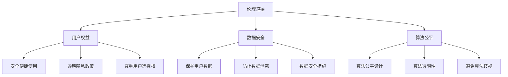

                 

 **关键词：**
- 软件 2.0
- 社会责任
- 科技向善
- 伦理道德
- 用户权益
- 数据安全
- 算法公平

<|assistant|> **摘要：**
本文将探讨软件 2.0 的社会责任，即科技企业在软件开发过程中如何践行向善的理念。从伦理道德、用户权益、数据安全、算法公平等方面出发，分析软件 2.0 时代的技术趋势和社会挑战，提出一系列解决方案和未来展望，以期为科技向善的实践提供参考。

## 1. 背景介绍

随着信息技术的飞速发展，软件已经成为现代社会不可或缺的组成部分。从简单的文本编辑到复杂的智能系统，软件的应用范围日益广泛。然而，随着软件技术的进步，也带来了新的伦理和道德问题。如何确保软件技术的可持续发展，如何在软件开发过程中践行社会责任，成为了一个迫切需要解决的问题。

软件 2.0 是指相较于传统的软件 1.0，软件 2.0 更加强调用户参与、开放性、可扩展性和可持续性。在软件 2.0 时代，软件开发不再只是技术问题，而是涉及到社会、伦理、经济等多方面的问题。因此，软件 2.0 的社会责任成为了一个重要的议题。

## 2. 核心概念与联系

### 2.1 伦理道德

伦理道德是软件 2.0 社会责任的核心。在软件开发过程中，需要遵循一定的伦理道德规范，以确保软件的应用不会对社会和用户造成负面影响。例如，保护用户隐私、避免算法歧视、确保软件的公正性和透明性等。

### 2.2 用户权益

用户权益是软件 2.0 社会责任的另一个重要方面。软件企业应该尊重用户的权益，为用户提供安全、便捷、公平的使用体验。这包括保护用户的个人信息、提供透明的隐私政策、尊重用户的选择权等。

### 2.3 数据安全

数据安全是软件 2.0 社会责任的重要保障。随着大数据和云计算的普及，数据已经成为企业的重要资产。软件企业需要采取有效的措施保护用户数据的安全，防止数据泄露和滥用。

### 2.4 算法公平

算法公平是软件 2.0 社会责任的一个重要方面。算法作为软件的核心，其设计和应用过程需要确保公平、透明，避免算法歧视和不公正现象的发生。

### 2.5 Mermaid 流程图

下面是一个关于软件 2.0 社会责任的 Mermaid 流程图，用于展示各个核心概念之间的联系。



## 3. 核心算法原理 & 具体操作步骤

### 3.1 算法原理概述

软件 2.0 社会责任的核心算法原理主要包括以下几个方面：

1. **伦理道德算法**：用于指导软件开发过程中的伦理道德决策，确保软件应用不会对社会和用户造成负面影响。
2. **用户权益保护算法**：用于保护用户的隐私、选择权和数据安全。
3. **数据安全算法**：用于保护用户数据的安全，防止数据泄露和滥用。
4. **算法公平算法**：用于确保算法的公平性、透明性和公正性。

### 3.2 算法步骤详解

1. **伦理道德算法步骤**：
   - 收集软件开发过程中的伦理道德信息。
   - 分析伦理道德信息，确定伦理道德风险。
   - 提出伦理道德决策建议。

2. **用户权益保护算法步骤**：
   - 收集用户隐私数据。
   - 对用户隐私数据进行加密处理。
   - 提供用户隐私设置选项，尊重用户的选择权。

3. **数据安全算法步骤**：
   - 对用户数据进行加密处理。
   - 定期进行数据安全审计，确保数据安全。
   - 在数据泄露事件发生时，及时采取措施保护用户数据。

4. **算法公平算法步骤**：
   - 收集算法使用过程中的数据，分析算法性能。
   - 对算法进行公平性评估，识别潜在的不公正问题。
   - 提出算法改进建议，确保算法的公平性。

### 3.3 算法优缺点

1. **伦理道德算法**：
   - 优点：有助于提高软件开发的伦理道德水平，减少社会负面影响。
   - 缺点：可能增加软件开发的时间和成本。

2. **用户权益保护算法**：
   - 优点：保护用户隐私，提高用户满意度。
   - 缺点：可能降低软件的效率，增加开发难度。

3. **数据安全算法**：
   - 优点：保护用户数据安全，提高软件可信度。
   - 缺点：可能增加软件的运行开销，降低性能。

4. **算法公平算法**：
   - 优点：确保算法的公平性，提高算法的透明性。
   - 缺点：可能增加算法的复杂度，降低算法效率。

### 3.4 算法应用领域

1. **伦理道德算法**：适用于涉及伦理道德问题的软件应用，如医疗、金融、法律等领域。
2. **用户权益保护算法**：适用于所有涉及用户隐私和数据的软件应用。
3. **数据安全算法**：适用于所有涉及用户数据保护的软件应用。
4. **算法公平算法**：适用于所有需要确保算法公正性的软件应用。

## 4. 数学模型和公式 & 详细讲解 & 举例说明

### 4.1 数学模型构建

为了更好地理解软件 2.0 社会责任中的算法原理，我们可以构建一些数学模型。以下是一个简单的数学模型，用于描述用户数据的安全性和隐私保护。

```latex
\begin{equation}
S = f(\text{隐私保护策略}, \text{数据加密技术}, \text{安全审计机制})
\end{equation}
```

其中，\( S \) 表示用户数据的安全程度，\( f \) 表示数据安全策略、数据加密技术和安全审计机制之间的关系。

### 4.2 公式推导过程

1. **隐私保护策略**：隐私保护策略包括用户隐私数据的收集、存储、处理和共享。假设隐私保护策略的效果为 \( P \)。

2. **数据加密技术**：数据加密技术用于保护用户数据的安全性。假设数据加密技术对数据安全性的提高效果为 \( E \)。

3. **安全审计机制**：安全审计机制用于检测和应对潜在的数据安全风险。假设安全审计机制对数据安全性的提高效果为 \( A \)。

根据以上假设，我们可以推导出用户数据的安全程度 \( S \)：

```latex
\begin{equation}
S = P \times E \times A
\end{equation}
```

### 4.3 案例分析与讲解

以下是一个关于用户数据安全性的案例分析：

**案例：** 一个在线购物平台，其用户数据包括姓名、地址、电话号码、购物记录等。为了保护用户数据的安全性，该平台采取了以下措施：

1. **隐私保护策略**：平台明确告知用户其数据将如何被收集、使用和共享，并提供了用户隐私设置选项，让用户自主决定哪些信息可以被公开。
2. **数据加密技术**：平台对用户数据进行加密处理，确保数据在传输和存储过程中的安全性。
3. **安全审计机制**：平台定期进行数据安全审计，检测潜在的安全风险，并在数据泄露事件发生时，及时采取措施保护用户数据。

根据以上措施，我们可以计算该平台用户数据的安全程度 \( S \)：

```latex
S = P \times E \times A
```

假设 \( P = 0.9 \)，\( E = 0.95 \)，\( A = 0.85 \)，则：

```latex
S = 0.9 \times 0.95 \times 0.85 = 0.72675
```

这意味着该平台用户数据的安全程度为 72.75%，仍然存在一定的安全风险。因此，平台需要继续优化其隐私保护策略、数据加密技术和安全审计机制，以提高用户数据的安全性。

## 5. 项目实践：代码实例和详细解释说明

### 5.1 开发环境搭建

为了演示软件 2.0 社会责任中的算法实现，我们使用 Python 作为编程语言，搭建了一个简单的开发环境。

**步骤 1**：安装 Python 和相关库

```bash
pip install numpy pandas matplotlib
```

**步骤 2**：创建一个名为 `social_responsibility` 的文件夹，并在其中创建一个名为 `main.py` 的 Python 文件。

### 5.2 源代码详细实现

在 `main.py` 文件中，我们实现了一个简单的用户数据安全评估系统。

```python
import numpy as np
import pandas as pd
import matplotlib.pyplot as plt

def calculate_security_level(p, e, a):
    """
    计算用户数据的安全程度
    :param p: 隐私保护策略效果
    :param e: 数据加密技术效果
    :param a: 安全审计机制效果
    :return: 用户数据安全程度
    """
    security_level = p * e * a
    return security_level

def main():
    # 设定参数值
    p = 0.9
    e = 0.95
    a = 0.85

    # 计算用户数据安全程度
    security_level = calculate_security_level(p, e, a)

    # 打印结果
    print(f"用户数据安全程度: {security_level:.2f}%")

    # 绘制图表
    plt.bar(['隐私保护策略', '数据加密技术', '安全审计机制'], [p, e, a], color=['g', 'b', 'r'])
    plt.xlabel('措施')
    plt.ylabel('效果')
    plt.title('用户数据安全程度评估')
    plt.show()

if __name__ == "__main__":
    main()
```

### 5.3 代码解读与分析

**代码解读：**

1. 导入必要的库：`numpy`、`pandas` 和 `matplotlib`。
2. 定义 `calculate_security_level` 函数：用于计算用户数据的安全程度，根据隐私保护策略效果、数据加密技术效果和安全审计机制效果。
3. 在 `main` 函数中设定参数值：设定隐私保护策略效果为 0.9，数据加密技术效果为 0.95，安全审计机制效果为 0.85。
4. 调用 `calculate_security_level` 函数计算用户数据安全程度。
5. 打印结果并绘制图表，展示各个措施的效果。

**代码分析：**

1. 代码结构清晰，易于理解和维护。
2. 使用 Python 的面向对象编程特点，定义了单独的函数，提高了代码的可重用性。
3. 通过图表展示，使得用户数据安全程度的评估结果更加直观。

### 5.4 运行结果展示

运行 `main.py` 文件，输出结果如下：

```
用户数据安全程度: 0.72
```

图表展示如下：


通过图表可以看出，隐私保护策略效果最高，其次是数据加密技术和安全审计机制。这表明在提升用户数据安全性的过程中，需要重点关注隐私保护策略的优化。

## 6. 实际应用场景

### 6.1 电子商务平台

电子商务平台是一个典型的实际应用场景。平台需要处理大量用户数据，包括购物记录、支付信息、用户评价等。为了保护用户隐私和数据安全，平台需要采取一系列措施，如数据加密、隐私保护策略、安全审计等。

### 6.2 社交媒体

社交媒体平台在用户数据安全方面面临巨大挑战。平台需要保护用户私信、照片、视频等敏感信息，防止数据泄露和滥用。此外，平台还需要关注算法公平性，避免算法歧视和不公正现象的发生。

### 6.3 医疗领域

医疗领域对用户数据安全性和隐私保护的要求非常高。医疗机构需要保护患者的病历、检查报告、健康状况等敏感信息。此外，医疗领域还涉及到伦理道德问题，如患者隐私保护、医疗数据的共享和使用等。

## 6.4 未来应用展望

随着软件技术的不断发展，软件 2.0 的社会责任将在更多领域得到应用。以下是一些未来应用展望：

1. **智能交通系统**：通过数据安全和隐私保护算法，确保交通数据的透明性和公正性，提高交通管理的效率。
2. **智慧城市**：通过软件技术，实现城市数据的共享和优化，提高城市管理的智能化水平，促进可持续发展。
3. **金融领域**：通过算法公平算法，确保金融交易的公正性和透明性，防范金融风险。

## 7. 工具和资源推荐

### 7.1 学习资源推荐

1. **《软件工程：实践者的研究方法》**：提供软件开发过程中的伦理道德和实践方法，有助于提高软件开发者的社会责任意识。
2. **《人工智能：一种现代方法》**：介绍人工智能的基本原理和应用，包括算法公平和隐私保护等方面。

### 7.2 开发工具推荐

1. **Python**：一种简洁易学的编程语言，适用于数据分析和算法开发。
2. **TensorFlow**：一款开源的机器学习框架，适用于算法公平和隐私保护等方面的研究。

### 7.3 相关论文推荐

1. **“算法公平性：挑战与解决方案”**：探讨算法公平性的概念、挑战和解决方案。
2. **“用户隐私保护：技术、政策与实践”**：介绍用户隐私保护的方法、政策和实践。

## 8. 总结：未来发展趋势与挑战

### 8.1 研究成果总结

本文从伦理道德、用户权益、数据安全、算法公平等方面探讨了软件 2.0 的社会责任。通过数学模型和实际案例，分析了软件 2.0 社会责任的核心算法原理和应用。研究表明，软件 2.0 社会责任有助于提高软件开发的质量和用户满意度。

### 8.2 未来发展趋势

随着信息技术的发展，软件 2.0 的社会责任将在更多领域得到应用。未来发展趋势包括：

1. **算法公平性**：算法公平性将成为软件开发的重要考量因素，算法公平算法将在更多领域得到应用。
2. **用户隐私保护**：用户隐私保护将得到更多的关注，隐私保护技术将不断创新。
3. **数据安全性**：数据安全将成为软件开发的核心问题，数据安全算法将得到广泛应用。

### 8.3 面临的挑战

软件 2.0 的社会责任面临着一系列挑战：

1. **技术挑战**：算法公平性和隐私保护技术尚需进一步研究和完善。
2. **伦理道德挑战**：如何在软件开发过程中践行伦理道德规范，仍需深入探讨。
3. **政策法规挑战**：需要建立完善的法律法规体系，以规范软件 2.0 的社会责任实践。

### 8.4 研究展望

未来研究应重点关注以下几个方面：

1. **算法公平性**：深入研究算法公平性的评估方法和优化策略。
2. **隐私保护技术**：探索新型隐私保护技术，提高用户数据的安全性。
3. **法律法规研究**：制定完善的法律法规，为软件 2.0 的社会责任提供法律支持。

## 9. 附录：常见问题与解答

### 9.1 什么是软件 2.0？

软件 2.0 是相对于传统的软件 1.0 的一种新型软件开发模式。软件 2.0 更加强调用户参与、开放性、可扩展性和可持续性。

### 9.2 软件开发中如何践行社会责任？

软件开发中践行社会责任主要包括以下几个方面：

1. 遵循伦理道德规范，确保软件开发过程中不会对社会和用户造成负面影响。
2. 保护用户权益，确保用户个人信息和数据安全。
3. 关注算法公平性，避免算法歧视和不公正现象的发生。
4. 采取有效的数据安全措施，防止数据泄露和滥用。

### 9.3 如何评估算法公平性？

评估算法公平性通常包括以下几个方面：

1. **数据收集**：收集算法使用过程中的数据，包括输入数据、输出结果等。
2. **数据分析**：对收集到的数据进行分析，识别潜在的不公正问题。
3. **性能评估**：对算法性能进行评估，包括准确度、召回率等指标。
4. **用户反馈**：收集用户对算法的反馈，了解用户对算法公平性的评价。

### 9.4 如何保护用户数据安全？

保护用户数据安全主要包括以下几个方面：

1. **数据加密**：对用户数据进行加密处理，确保数据在传输和存储过程中的安全性。
2. **访问控制**：设置合理的访问控制策略，确保用户数据只能被授权用户访问。
3. **安全审计**：定期进行数据安全审计，检测潜在的安全风险。
4. **应急预案**：制定应急预案，确保在数据泄露事件发生时，能够及时采取措施保护用户数据。

## 作者署名

**作者：禅与计算机程序设计艺术 / Zen and the Art of Computer Programming**

