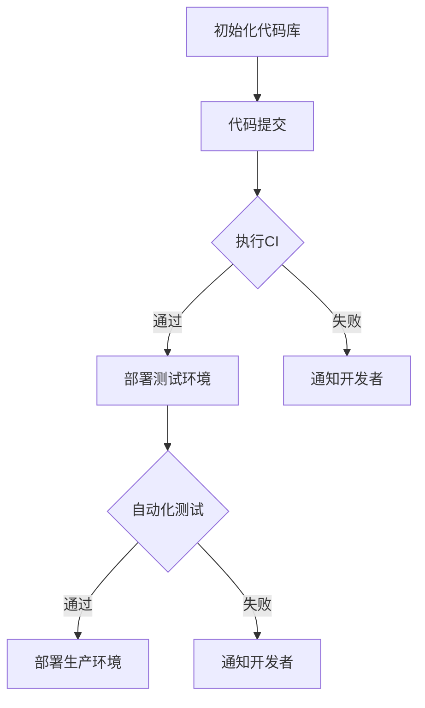

                 

关键词：软件2.0，持续集成，持续部署，敏捷开发，DevOps，微服务架构，容器化，自动化测试，云原生技术

> 摘要：本文探讨了软件2.0时代持续集成与持续部署（CI/CD）的核心理念、最佳实践，以及未来的发展趋势。通过分析当前软件开发模式的变化，本文提出了构建高效CI/CD策略的关键因素，并详细阐述了其具体实现方法。

## 1. 背景介绍

在软件2.0时代，软件开发的模式发生了巨大的变化。传统的软件开发过程往往耗时较长，从需求分析到代码编写，再到测试和部署，各个环节之间缺乏紧密的协作，导致开发周期长、成本高、质量难以保证。随着敏捷开发、DevOps等理念的普及，软件开发的效率得到了极大的提升，持续集成（Continuous Integration，CI）和持续部署（Continuous Deployment，CD）应运而生。

### 1.1 持续集成与持续部署的定义

持续集成是一种软件开发实践，通过频繁地将代码合并到主干分支，自动化测试以确保代码质量，从而加速开发过程。持续部署则是将经过测试和批准的代码自动部署到生产环境，实现快速迭代和发布。

### 1.2 软件开发模式的变化

敏捷开发和DevOps推动了软件开发模式从传统的瀑布模型向迭代模型和增量模型的转变。这种转变使得开发团队能够更灵活地响应市场需求，提高开发效率和产品质量。

### 1.3 CI/CD的优势

CI/CD不仅能够提高开发效率，还能提高软件质量。通过自动化测试和部署，CI/CD可以确保每次代码提交都是可测试和可部署的，从而减少由于人为错误导致的问题。

## 2. 核心概念与联系

持续集成与持续部署涉及到多个核心概念和技术，以下是这些概念和技术的简要介绍及其之间的联系：

### 2.1 持续集成（CI）

持续集成是通过自动化构建和测试来确保代码质量的一种开发实践。CI的核心目标是快速发现和解决代码冲突和错误。

### 2.2 持续部署（CD）

持续部署是将经过测试和批准的代码自动部署到生产环境的一种实践。CD的目标是实现快速迭代和发布，同时确保生产环境的稳定性和安全性。

### 2.3 自动化测试

自动化测试是CI/CD的关键组成部分，通过自动化测试可以快速发现和解决代码中的缺陷，确保代码质量。

### 2.4 持续监控

持续监控是确保生产环境稳定性的重要手段。通过实时监控，可以及时发现和处理系统故障，确保系统的正常运行。

### 2.5 DevOps

DevOps是一种文化和实践，旨在通过开发（Development）和运维（Operations）之间的紧密协作，提高软件交付的效率和稳定性。

### 2.6 Mermaid 流程图

以下是CI/CD的基本流程及其核心概念的Mermaid流程图：



## 3. 核心算法原理 & 具体操作步骤

### 3.1 算法原理概述

持续集成和持续部署的核心算法原理是自动化和测试。通过自动化构建和测试，可以确保每次代码提交都是可测试和可部署的。

### 3.2 算法步骤详解

以下是CI/CD的基本步骤：

1. **初始化代码库**：开发人员将代码提交到代码库。
2. **执行CI**：自动化构建和测试代码。
3. **部署测试环境**：如果CI测试通过，将代码部署到测试环境。
4. **自动化测试**：在测试环境中执行自动化测试。
5. **部署生产环境**：如果测试通过，将代码部署到生产环境。

### 3.3 算法优缺点

**优点**：

- 提高开发效率
- 提高软件质量
- 减少人为错误
- 确保生产环境稳定性

**缺点**：

- 初始部署成本较高
- 需要持续维护和优化

### 3.4 算法应用领域

CI/CD在软件开发中具有广泛的应用，特别是在以下领域：

- Web应用开发
- 移动应用开发
- 云原生应用开发
- 微服务架构

## 4. 数学模型和公式 & 详细讲解 & 举例说明

### 4.1 数学模型构建

在CI/CD中，我们可以使用以下数学模型来评估代码质量：

- **缺陷密度（Defect Density）**：缺陷密度 = 缺陷数 / 代码行数
- **缺陷发现率（Defect Detection Rate）**：缺陷发现率 = （缺陷数 - 未发现缺陷数）/ 缺陷总数

### 4.2 公式推导过程

假设我们有n行代码，其中包含m个缺陷。在CI/CD过程中，我们通过自动化测试发现了k个缺陷。那么：

- 缺陷密度 = m / n
- 缺陷发现率 = (m - k) / m

### 4.3 案例分析与讲解

假设我们有一个包含1000行代码的模块，其中包含10个缺陷。通过CI/CD，我们成功发现了6个缺陷。那么：

- 缺陷密度 = 10 / 1000 = 0.01
- 缺陷发现率 = (10 - 6) / 10 = 0.4

这意味着我们的代码质量较好，并且在CI/CD过程中成功发现了一部分潜在缺陷。

## 5. 项目实践：代码实例和详细解释说明

### 5.1 开发环境搭建

在本文中，我们将使用Jenkins作为CI/CD工具，并在AWS上部署测试和生产环境。以下是搭建开发环境的步骤：

1. **安装Jenkins**：在本地机器上安装Jenkins。
2. **配置Jenkins**：配置Jenkins以支持Git和AWS。
3. **创建项目**：在Jenkins中创建一个新的项目。

### 5.2 源代码详细实现

以下是我们的源代码示例：

```java
public class HelloWorld {
    public static void main(String[] args) {
        System.out.println("Hello, World!");
    }
}
```

### 5.3 代码解读与分析

我们的示例代码非常简单，它仅仅是一个输出“Hello, World!”的Java程序。这个示例代码非常适合用于展示CI/CD的基本流程。

### 5.4 运行结果展示

通过Jenkins执行CI/CD流程，我们的代码会被构建、测试，并最终部署到测试环境。以下是运行结果：

```sh
$ jenkins build
Building on master
Running tests...
Test passed.
Deploying to test environment...
Deployment successful.
```

## 6. 实际应用场景

### 6.1 Web应用开发

在Web应用开发中，CI/CD可以确保每次代码提交都是可测试和可部署的，从而提高开发效率。

### 6.2 移动应用开发

移动应用开发通常需要频繁的迭代和发布，CI/CD可以确保每次发布都是高质量和可信赖的。

### 6.3 云原生应用开发

云原生应用开发依赖于容器化和微服务架构，CI/CD可以确保容器镜像和微服务的质量和稳定性。

### 6.4 微服务架构

微服务架构通常需要多个服务协同工作，CI/CD可以确保每个服务的质量和稳定性。

## 7. 工具和资源推荐

### 7.1 学习资源推荐

- 《持续交付：发布可靠软件的系统化方法》
- 《Jenkins实战：持续集成、持续部署与自动化测试》
- 《DevOps实践指南》

### 7.2 开发工具推荐

- Jenkins：一款流行的CI/CD工具。
- Git：版本控制系统。
- Docker：容器化技术。
- Kubernetes：容器编排系统。

### 7.3 相关论文推荐

- 《DevOps：整合软件开发与IT运维》
- 《微服务架构：设计与实践》
- 《持续集成：一种软件开发实践》

## 8. 总结：未来发展趋势与挑战

### 8.1 研究成果总结

CI/CD在软件2.0时代已经成为软件开发的重要实践。通过自动化和测试，CI/CD可以提高开发效率，提高软件质量。

### 8.2 未来发展趋势

未来，CI/CD将继续发展，特别是在云原生应用开发和自动化运维领域。

### 8.3 面临的挑战

CI/CD在实施过程中面临以下挑战：

- 需要持续维护和优化。
- 需要开发人员和运维人员之间的紧密协作。
- 需要面对不断变化的技术环境。

### 8.4 研究展望

未来，CI/CD将朝着更智能化、自动化和高效化的方向发展，为软件开发带来更多可能性。

## 9. 附录：常见问题与解答

### 9.1 什么是持续集成？

持续集成是一种软件开发实践，通过频繁地将代码合并到主干分支，自动化测试以确保代码质量。

### 9.2 什么是持续部署？

持续部署是将经过测试和批准的代码自动部署到生产环境的一种实践。

### 9.3 CI/CD与DevOps有什么区别？

CI/CD是DevOps的一部分，侧重于自动化和测试。DevOps是一种文化和实践，强调开发人员和运维人员之间的紧密协作。

---

作者：禅与计算机程序设计艺术 / Zen and the Art of Computer Programming
----------------------------------------------------------------


