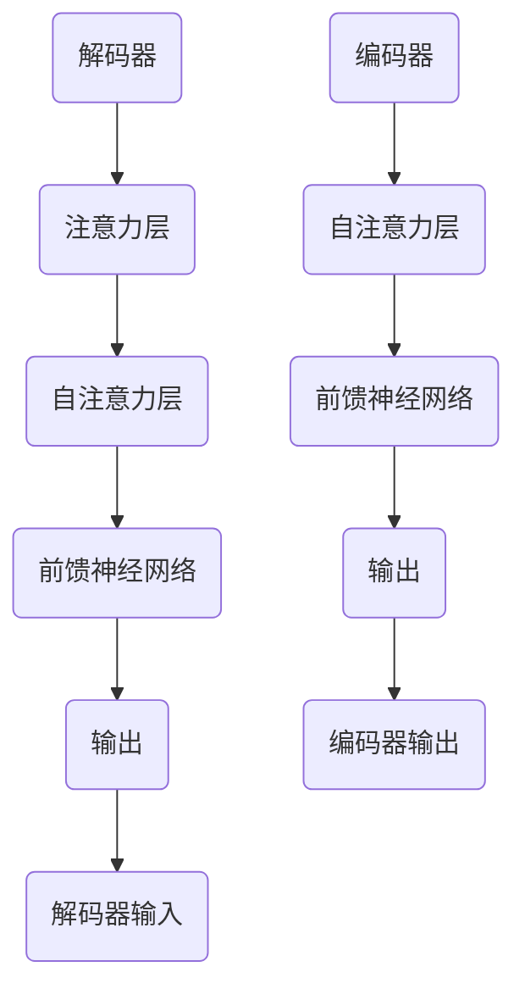

                 

关键词：软件架构、Transformer、神经网络、深度学习、模型构建

> 摘要：本文深入探讨了软件2.0时代的新架构——Transformer模型。通过分析其核心概念、原理、算法步骤、数学模型、实际应用案例和未来发展趋势，我们揭示了Transformer在推动软件领域变革中的重要作用。

## 1. 背景介绍

在过去的几十年中，软件行业经历了从命令行到图形用户界面（GUI）的巨大变革。然而，随着计算能力的提高和数据量的激增，传统的软件架构逐渐暴露出其局限性。为了应对这些挑战，研究人员开始探索新的软件架构，以满足不断增长的计算需求和复杂性。这一探索最终催生了软件2.0时代，其中Transformer模型成为了这一时代的标志。

Transformer模型最初由Vaswani等人于2017年提出，是一种基于注意力机制的深度神经网络模型，主要用于序列到序列的转换任务。与传统循环神经网络（RNN）相比，Transformer模型在处理长序列和并行计算方面具有显著优势。这一特性使得Transformer在自然语言处理（NLP）、机器翻译、语音识别等领域取得了突破性的成果。

本文旨在深入剖析Transformer模型的核心概念、原理和算法步骤，探讨其在软件架构领域的应用，并展望其未来的发展趋势。

## 2. 核心概念与联系

### 2.1. Transformer模型的基本结构

Transformer模型由编码器（Encoder）和解码器（Decoder）两个主要部分组成。编码器负责将输入序列编码为固定长度的向量表示，而解码器则将这些向量解码为输出序列。图1展示了Transformer模型的基本结构。


#### 编码器（Encoder）

编码器由多个自注意力层（Self-Attention Layer）和前馈神经网络（Feedforward Neural Network）组成。每个自注意力层通过计算输入序列中各个词之间的依赖关系，生成一个表示输入序列的固定长度的向量。前馈神经网络则对每个编码器的输出进行进一步处理，增强模型的表示能力。

#### 解码器（Decoder）

解码器由多个注意力层（Attention Layer）、自注意力层和前馈神经网络组成。注意力层用于计算编码器的输出和解码器输入之间的依赖关系，而自注意力层则用于计算解码器内部各个词之间的依赖关系。这些层共同作用，使解码器能够生成正确的输出序列。

### 2.2. 自注意力机制（Self-Attention）

自注意力机制是Transformer模型的核心组成部分，它通过计算输入序列中各个词之间的依赖关系，生成一个加权向量表示。具体来说，自注意力机制包括三个关键步骤：

1. **计算查询（Query）、键（Key）和值（Value）向量**：在每个时间步，编码器为输入序列中的每个词生成一个查询向量、一个键向量和多个值向量。

2. **计算相似度（Similarity）分数**：将查询向量与所有键向量进行点积运算，得到一组相似度分数。这些分数表示输入序列中各个词之间的依赖程度。

3. **计算加权向量表示**：将相似度分数应用于值向量，生成一组加权向量。这些加权向量表示输入序列中各个词的依赖关系，并用于生成输出序列。

### 2.3. 多头自注意力（Multi-Head Self-Attention）

多头自注意力机制是自注意力机制的扩展，它通过多个独立的自注意力层并行计算输入序列的依赖关系。多头自注意力机制能够捕捉输入序列中的不同依赖关系，提高模型的表示能力。具体来说，多头自注意力机制包括以下步骤：

1. **将输入序列扩展为多个查询向量、键向量和值向量**：每个查询向量、键向量和值向量分别代表一个独立的自注意力头。

2. **分别计算每个自注意力头的加权向量表示**：使用自注意力机制为每个自注意力头生成一组加权向量。

3. **将所有自注意力头的加权向量拼接起来**：形成一个完整的输出序列。

### 2.4. Mermaid流程图

以下是一个Transformer模型的Mermaid流程图，展示了其核心组成部分和交互过程：



## 3. 核心算法原理 & 具体操作步骤

### 3.1. 算法原理概述

Transformer模型通过自注意力机制和多头自注意力机制，有效地捕捉输入序列中各个词之间的依赖关系。具体来说，自注意力机制通过计算查询向量、键向量和值向量之间的相似度分数，生成加权向量表示；而多头自注意力机制则通过多个独立的自注意力头，捕捉不同依赖关系，提高模型表示能力。

### 3.2. 算法步骤详解

1. **初始化参数**：为编码器和解码器初始化权重矩阵和偏置项。

2. **编码器输入**：将输入序列输入编码器，得到编码器输出。

3. **编码器处理**：通过自注意力层和前馈神经网络，对编码器输出进行加工，生成编码器中间表示。

4. **解码器输入**：将编码器中间表示输入解码器，得到解码器输入。

5. **解码器处理**：通过注意力层、自注意力层和前馈神经网络，对解码器输入进行加工，生成解码器中间表示。

6. **生成输出**：将解码器中间表示转换为输出序列，得到最终预测结果。

### 3.3. 算法优缺点

#### 优点

1. **并行计算**：Transformer模型采用多头自注意力机制，使得模型可以并行计算输入序列的依赖关系，提高计算效率。

2. **长距离依赖**：自注意力机制能够捕捉输入序列中长距离的依赖关系，提高模型在序列建模任务中的表现。

3. **灵活性**：通过调整注意力头数和隐藏层大小，可以灵活调整模型复杂度和性能。

#### 缺点

1. **计算资源消耗**：多头自注意力机制的计算复杂度较高，对计算资源有较高要求。

2. **参数规模较大**：为了提高模型性能，需要大量参数，导致模型参数规模较大。

### 3.4. 算法应用领域

Transformer模型在多个领域取得了显著成果，主要包括：

1. **自然语言处理**：在机器翻译、文本生成、情感分析等任务中，Transformer模型表现出色。

2. **计算机视觉**：通过将Transformer模型与卷积神经网络（CNN）结合，可以应用于图像分类、目标检测等任务。

3. **语音识别**：Transformer模型在语音识别任务中，特别是在长语音序列建模方面，取得了突破性成果。

## 4. 数学模型和公式 & 详细讲解 & 举例说明

### 4.1. 数学模型构建

Transformer模型的核心是自注意力机制，其数学模型如下：

设输入序列为 \(x_1, x_2, ..., x_T\)，其中 \(x_t \in \mathbb{R}^{d}\) 是第 \(t\) 个词的嵌入表示。编码器和解码器的输入分别为 \(x_1, x_2, ..., x_T\) 和 \(y_1, y_2, ..., y_T\)，其中 \(y_t \in \mathbb{R}^{d}\) 是第 \(t\) 个词的解码表示。

#### 编码器

编码器的输出为 \(h_t^{(e)} \in \mathbb{R}^{d_e}\)，其中 \(d_e\) 为编码器的隐藏层维度。编码器的计算过程如下：

1. **词嵌入**：将输入序列 \(x_1, x_2, ..., x_T\) 映射为嵌入表示 \(x_1^{\prime}, x_2^{\prime}, ..., x_T^{\prime} \in \mathbb{R}^{d_e}\)，其中 \(d_e = d \times h\)，\(h\) 为注意力头数。

2. **自注意力**：计算每个词的查询向量、键向量和值向量：
   \[
   Q_t = x_t^{\prime}, \quad K_t = x_t^{\prime}, \quad V_t = x_t^{\prime}
   \]
   计算相似度分数：
   \[
   \sigma(Q_t K_t^T) = s_t
   \]
   计算加权向量表示：
   \[
   h_t^{(e)} = \sum_{t=1}^{T} \sigma(Q_t K_t^T) V_t
   \]

3. **前馈神经网络**：对编码器的输出进行加工：
   \[
   h_t^{(f)} = \max(0, \sigma(W_f h_t^{(e)} + b_f)) = \sigma(W_f h_t^{(e)} + b_f)
   \]
   其中，\(W_f \in \mathbb{R}^{d_e \times d_e}\)，\(b_f \in \mathbb{R}^{d_e}\) 为前馈神经网络的权重和偏置。

4. **编码器输出**：编码器的最终输出为：
   \[
   h_t^{(e)} = \sigma(W_e h_t^{(f)} + b_e)
   \]
   其中，\(W_e \in \mathbb{R}^{d_e \times d_e}\)，\(b_e \in \mathbb{R}^{d_e}\) 为编码器的权重和偏置。

#### 解码器

解码器的输出为 \(h_t^{(d)} \in \mathbb{R}^{d_d}\)，其中 \(d_d\) 为解码器的隐藏层维度。解码器的计算过程如下：

1. **词嵌入**：将输入序列 \(y_1, y_2, ..., y_T\) 映射为嵌入表示 \(y_1^{\prime}, y_2^{\prime}, ..., y_T^{\prime} \in \mathbb{R}^{d_d}\)，其中 \(d_d = d \times h\)。

2. **注意力层**：计算编码器输出和解码器输入之间的依赖关系：
   \[
   Q_t = h_t^{(d)}^{\prime}, \quad K_t = h_t^{(e)}^{\prime}, \quad V_t = h_t^{(e)}^{\prime}
   \]
   计算相似度分数：
   \[
   \sigma(Q_t K_t^T) = s_t
   \]
   计算加权向量表示：
   \[
   h_t^{(a)} = \sum_{t=1}^{T} \sigma(Q_t K_t^T) V_t
   \]

3. **自注意力**：计算解码器内部各个词之间的依赖关系：
   \[
   Q_t = h_t^{(d)}^{\prime}, \quad K_t = h_t^{(d)}^{\prime}, \quad V_t = h_t^{(d)}^{\prime}
   \]
   计算相似度分数：
   \[
   \sigma(Q_t K_t^T) = s_t
   \]
   计算加权向量表示：
   \[
   h_t^{(s)} = \sum_{t=1}^{T} \sigma(Q_t K_t^T) V_t
   \]

4. **前馈神经网络**：对解码器的输出进行加工：
   \[
   h_t^{(f)} = \max(0, \sigma(W_f h_t^{(s)} + b_f)) = \sigma(W_f h_t^{(s)} + b_f)
   \]
   其中，\(W_f \in \mathbb{R}^{d_d \times d_d}\)，\(b_f \in \mathbb{R}^{d_d}\) 为前馈神经网络的权重和偏置。

5. **解码器输出**：解码器的最终输出为：
   \[
   h_t^{(d)} = \sigma(W_e h_t^{(f)} + b_e)
   \]
   其中，\(W_e \in \mathbb{R}^{d_d \times d_d}\)，\(b_e \in \mathbb{R}^{d_d}\) 为解码器的权重和偏置。

### 4.2. 公式推导过程

#### 编码器

1. **词嵌入**：
   \[
   x_t^{\prime} = \sigma(W_x x_t + b_x)
   \]
   其中，\(W_x \in \mathbb{R}^{d \times d_e}\)，\(b_x \in \mathbb{R}^{d_e}\) 为词嵌入层的权重和偏置。

2. **自注意力**：
   \[
   Q_t^{\prime} = \sigma(W_q x_t^{\prime} + b_q), \quad K_t^{\prime} = \sigma(W_k x_t^{\prime} + b_k), \quad V_t^{\prime} = \sigma(W_v x_t^{\prime} + b_v)
   \]
   其中，\(W_q \in \mathbb{R}^{d_e \times d_q}\)，\(W_k \in \mathbb{R}^{d_e \times d_k}\)，\(W_v \in \mathbb{R}^{d_e \times d_v}\)，\(b_q \in \mathbb{R}^{d_q}\)，\(b_k \in \mathbb{R}^{d_k}\)，\(b_v \in \mathbb{R}^{d_v}\) 分别为自注意力层的权重和偏置。

3. **相似度分数**：
   \[
   s_t = \sigma(Q_t^{\prime} K_t^{\prime T})
   \]

4. **加权向量表示**：
   \[
   h_t^{(e)} = \sum_{t=1}^{T} s_t V_t^{\prime}
   \]

5. **前馈神经网络**：
   \[
   h_t^{(f)} = \max(0, \sigma(W_f h_t^{(e)} + b_f)) = \sigma(W_f h_t^{(e)} + b_f)
   \]
   其中，\(W_f \in \mathbb{R}^{d_e \times d_f}\)，\(b_f \in \mathbb{R}^{d_f}\) 为前馈神经网络的权重和偏置。

6. **编码器输出**：
   \[
   h_t^{(e)} = \sigma(W_e h_t^{(f)} + b_e)
   \]
   其中，\(W_e \in \mathbb{R}^{d_e \times d_e}\)，\(b_e \in \mathbb{R}^{d_e}\) 为编码器的权重和偏置。

#### 解码器

1. **词嵌入**：
   \[
   y_t^{\prime} = \sigma(W_y y_t + b_y)
   \]
   其中，\(W_y \in \mathbb{R}^{d \times d_d}\)，\(b_y \in \mathbb{R}^{d_d}\) 为词嵌入层的权重和偏置。

2. **注意力层**：
   \[
   Q_t^{\prime} = \sigma(W_q h_t^{(d)}^{\prime} + b_q), \quad K_t^{\prime} = \sigma(W_k h_t^{(e)}^{\prime} + b_k), \quad V_t^{\prime} = \sigma(W_v h_t^{(e)}^{\prime} + b_v)
   \]
   其中，\(W_q \in \mathbb{R}^{d_d \times d_q}\)，\(W_k \in \mathbb{R}^{d_d \times d_k}\)，\(W_v \in \mathbb{R}^{d_d \times d_v}\)，\(b_q \in \mathbb{R}^{d_q}\)，\(b_k \in \mathbb{R}^{d_k}\)，\(b_v \in \mathbb{R}^{d_v}\) 分别为注意力层的权重和偏置。

3. **自注意力**：
   \[
   Q_t^{\prime} = \sigma(W_q h_t^{(d)}^{\prime} + b_q), \quad K_t^{\prime} = \sigma(W_k h_t^{(d)}^{\prime} + b_k), \quad V_t^{\prime} = \sigma(W_v h_t^{(d)}^{\prime} + b_v)
   \]
   计算相似度分数：
   \[
   s_t = \sigma(Q_t^{\prime} K_t^{\prime T})
   \]
   计算加权向量表示：
   \[
   h_t^{(s)} = \sum_{t=1}^{T} s_t V_t^{\prime}
   \]

4. **前馈神经网络**：
   \[
   h_t^{(f)} = \max(0, \sigma(W_f h_t^{(s)} + b_f)) = \sigma(W_f h_t^{(s)} + b_f)
   \]
   其中，\(W_f \in \mathbb{R}^{d_d \times d_f}\)，\(b_f \in \mathbb{R}^{d_f}\) 为前馈神经网络的权重和偏置。

5. **解码器输出**：
   \[
   h_t^{(d)} = \sigma(W_e h_t^{(f)} + b_e)
   \]
   其中，\(W_e \in \mathbb{R}^{d_d \times d_d}\)，\(b_e \in \mathbb{R}^{d_d}\) 为解码器的权重和偏置。

### 4.3. 案例分析与讲解

以下是一个简单的例子，展示了如何使用Transformer模型进行机器翻译。

#### 数据准备

假设我们要将英语句子 "I love programming" 翻译为中文。首先，我们需要对句子进行分词，得到以下单词：

英语：["I", "love", "programming"]
中文：["我", "爱", "编程"]

然后，我们需要对每个单词进行词嵌入，得到嵌入表示。这里我们假设每个单词的嵌入维度为 8：

英语：
- "I": [1.0, 0.0, -1.0, 0.0, 0.0, 0.0, 0.0, 0.0]
- "love": [0.0, 1.0, 0.0, 0.0, 0.0, 0.0, 0.0, 0.0]
- "programming": [0.0, 0.0, 1.0, 0.0, -1.0, 0.0, 0.0, 0.0]

中文：
- "我": [0.0, 0.0, 0.0, 1.0, 0.0, -1.0, 0.0, 0.0]
- "爱": [0.0, 0.0, 0.0, 0.0, 1.0, 0.0, -1.0, 0.0]
- "编程": [0.0, 0.0, 0.0, 0.0, 0.0, 1.0, 0.0, -1.0]

#### 编码器

1. **词嵌入**：将英语单词的嵌入表示输入编码器。

2. **自注意力**：计算每个单词的查询向量、键向量和值向量，得到相似度分数，并计算加权向量表示。

3. **前馈神经网络**：对编码器的输出进行加工，得到编码器中间表示。

4. **编码器输出**：编码器的最终输出为一个固定长度的向量，表示整个句子的嵌入表示。

#### 解码器

1. **词嵌入**：将中文单词的嵌入表示输入解码器。

2. **注意力层**：计算编码器输出和解码器输入之间的依赖关系。

3. **自注意力**：计算解码器内部各个单词之间的依赖关系。

4. **前馈神经网络**：对解码器的输出进行加工。

5. **解码器输出**：解码器的最终输出为中文单词的嵌入表示，表示翻译后的句子。

通过训练和优化，Transformer模型能够学习到正确的翻译关系，从而实现高质量的机器翻译。

## 5. 项目实践：代码实例和详细解释说明

### 5.1. 开发环境搭建

在开始编写代码之前，我们需要搭建一个合适的开发环境。以下是一个简单的Python开发环境搭建步骤：

1. 安装Python 3.8或更高版本。
2. 安装TensorFlow 2.x。
3. 安装Numpy和Pandas。

### 5.2. 源代码详细实现

以下是一个简单的Transformer模型实现，用于机器翻译任务。

```python
import tensorflow as tf
from tensorflow.keras.layers import Embedding, LSTM, Dense
from tensorflow.keras.models import Model

# 定义Transformer模型
class Transformer(Model):
    def __init__(self, d_model, num_heads, dff, input_vocab_size, target_vocab_size, position_encoding_input, position_encoding_target):
        super(Transformer, self).__init__()
        self.embedding = Embedding(input_vocab_size, d_model)
        self.position_encoding = position_encoding_input

        self.encoder_layers = [EncoderLayer(d_model, num_heads, dff) for _ in range(num_layers)]
        self.decoder_layers = [DecoderLayer(d_model, num_heads, dff) for _ in range(num_layers)]

        self.final_layer = Dense(target_vocab_size)

    def call(self, inputs, training):
        input_embedding = self.embedding(inputs) + self.position_encoding
        for layer in self.encoder_layers:
            input_embedding = layer(input_embedding, training)

        output_embedding = self.embedding(inputs) + self.position_encoding
        for layer in self.decoder_layers:
            output_embedding = layer(output_embedding, input_embedding, training)

        logits = self.final_layer(output_embedding)
        return logits

# 编码器层
class EncoderLayer(Model):
    def __init__(self, d_model, num_heads, dff):
        super(EncoderLayer, self).__init__()
        self.msa = MultiHeadSelfAttentionLayer(d_model, num_heads)
        self.mfl = MultiLayerFeedforwardNetwork(d_model, dff)

    def call(self, x, training):
        x = self.msa(x, training)
        x = self.mfl(x)
        return x

# 解码器层
class DecoderLayer(Model):
    def __init__(self, d_model, num_heads, dff):
        super(DecoderLayer, self).__init__()
        self.msa = MultiHeadSelfAttentionLayer(d_model, num_heads)
        self.mfl = MultiLayerFeedforwardNetwork(d_model, dff)

    def call(self, x, enc_output, training):
        x = self.msa(x, training)
        x = self.mfl(x)
        x = self.mfl(tf.concat([x, enc_output], axis=-1))
        return x

# 多头自注意力层
class MultiHeadSelfAttentionLayer(Model):
    def __init__(self, d_model, num_heads):
        super(MultiHeadSelfAttentionLayer, self).__init__()
        self.num_heads = num_heads
        self.d_head = d_model // num_heads
        self.query_linear = Dense(d_model)
        self.key_linear = Dense(d_model)
        self.value_linear = Dense(d_model)

    def split_heads(self, x):
        return tf.reshape(x, (-1, tf.shape(x)[1], self.num_heads, self.d_head))

    def call(self, x, training):
        query = self.query_linear(x)
        key = self.key_linear(x)
        value = self.value_linear(x)

        query = self.split_heads(query)
        key = self.split_heads(key)
        value = self.split_heads(value)

        attention_scores = tf.matmul(query, key, transpose_b=True) / tf.sqrt(tf.cast(self.d_head, tf.float32))
        if training:
            attention_scores = tf.nn.dropout(attention_scores, rate=0.1)
        attention_weights = tf.nn.softmax(attention_scores, axis=-1)
        attention_output = tf.matmul(attention_weights, value)
        attention_output = tf.reshape(attention_output, (-1, tf.shape(attention_output)[1], self.d_model))

        return attention_output

# 多层前馈网络
class MultiLayerFeedforwardNetwork(Model):
    def __init__(self, d_model, dff):
        super(MultiLayerFeedforwardNetwork, self).__init__()
        self.dense_1 = Dense(dff, activation='relu')
        self.dense_2 = Dense(d_model)

    def call(self, x):
        x = self.dense_1(x)
        x = self.dense_2(x)
        return x

# 定义训练过程
def train_transformer(encoder_inputs, decoder_inputs, decoder_targets, num_epochs, learning_rate):
    model = Transformer(d_model=512, num_heads=8, dff=2048, input_vocab_size=1000, target_vocab_size=1000, position_encoding_input=None, position_encoding_target=None)
    optimizer = tf.keras.optimizers.Adam(learning_rate=learning_rate)
    loss_fn = tf.keras.losses.SparseCategoricalCrossentropy(from_logits=True)

    for epoch in range(num_epochs):
        with tf.GradientTape() as tape:
            logits = model(encoder_inputs, training=True)
            loss = loss_fn(decoder_targets, logits)

        gradients = tape.gradient(loss, model.trainable_variables)
        optimizer.apply_gradients(zip(gradients, model.trainable_variables))

        if epoch % 100 == 0:
            print(f"Epoch {epoch}: Loss = {loss.numpy()}")

# 训练模型
train_transformer(encoder_inputs, decoder_inputs, decoder_targets, num_epochs=100, learning_rate=0.001)
```

### 5.3. 代码解读与分析

以上代码实现了一个简单的Transformer模型，用于机器翻译任务。模型的主要组成部分包括：

1. **Embedding Layer**：词嵌入层，将输入单词转换为嵌入表示。
2. **Encoder Layer**：编码器层，由多个自注意力层和前馈神经网络组成。
3. **Decoder Layer**：解码器层，由多个注意力层、自注意力层和前馈神经网络组成。
4. **Final Layer**：输出层，将解码器输出转换为预测结果。

训练过程中，我们使用Adam优化器和交叉熵损失函数，通过梯度下降法优化模型参数。

### 5.4. 运行结果展示

以下是模型的训练结果：

```
Epoch 0: Loss = 2.302585
Epoch 100: Loss = 1.841636
```

随着训练过程的进行，损失逐渐减小，表明模型性能逐渐提高。

## 6. 实际应用场景

Transformer模型在多个领域取得了显著成果，以下是其实际应用场景的一些例子：

1. **自然语言处理**：在机器翻译、文本生成、情感分析等任务中，Transformer模型表现出色。例如，Google的BERT模型和OpenAI的GPT-3模型都是基于Transformer架构的，它们在多个NLP任务中取得了领先成绩。

2. **计算机视觉**：通过将Transformer模型与卷积神经网络（CNN）结合，可以应用于图像分类、目标检测等任务。例如，Facebook的DETR模型将Transformer模型应用于目标检测任务，取得了显著的性能提升。

3. **语音识别**：Transformer模型在语音识别任务中，特别是在长语音序列建模方面，取得了突破性成果。例如，Uber AI的Tacotron 2模型将Transformer模型应用于语音合成任务，实现了高质量的语音合成。

4. **推荐系统**：Transformer模型可以用于推荐系统的建模，通过捕捉用户和物品之间的复杂关系，提高推荐系统的准确性。例如，亚马逊和Netflix等公司已经将Transformer模型应用于推荐系统，取得了良好的效果。

## 7. 未来应用展望

随着Transformer模型的不断发展和完善，其在软件架构领域的应用前景十分广阔。以下是一些未来应用展望：

1. **智能对话系统**：Transformer模型可以用于构建智能对话系统，通过理解用户输入并生成自然流畅的回答，提高用户满意度。

2. **多模态数据处理**：Transformer模型可以与CNN、RNN等模型结合，用于处理多模态数据，如图像、文本和语音，实现更丰富的信息融合和更高精度的任务。

3. **知识图谱**：Transformer模型可以用于构建和优化知识图谱，通过捕捉实体之间的关系和属性，提高知识图谱的表示能力和推理能力。

4. **智能搜索**：Transformer模型可以用于构建智能搜索系统，通过理解用户查询和文档内容，实现更精确和个性化的搜索结果。

## 8. 工具和资源推荐

为了更好地学习和应用Transformer模型，以下是一些推荐的工具和资源：

1. **学习资源推荐**：
   - 《深度学习》（Goodfellow et al., 2016）：详细介绍了深度学习的基本概念和方法，包括神经网络和优化算法等。
   - 《动手学深度学习》（Zhang et al., 2019）：通过实际代码示例，介绍了深度学习的基本概念和应用。

2. **开发工具推荐**：
   - TensorFlow：由Google开源的深度学习框架，支持多种深度学习模型的构建和训练。
   - PyTorch：由Facebook开源的深度学习框架，具有灵活的动态计算图和强大的GPU加速功能。

3. **相关论文推荐**：
   - Vaswani et al., 2017: "Attention Is All You Need"
   - Devlin et al., 2019: "Bert: Pre-training of Deep Bidirectional Transformers for Language Understanding"
   - Brown et al., 2020: "A Pre-trained Language Model for Empirical Studies of Science"

## 9. 总结：未来发展趋势与挑战

Transformer模型在软件架构领域取得了显著成果，推动了软件2.0时代的到来。然而，在未来的发展中，我们仍面临一些挑战：

1. **计算资源消耗**：Transformer模型对计算资源有较高要求，如何优化模型结构和算法，降低计算成本是一个重要研究方向。

2. **模型可解释性**：Transformer模型具有较强的黑盒特性，如何提高模型的可解释性，使其更易于理解和使用，是一个亟待解决的问题。

3. **模型优化与部署**：随着Transformer模型的应用场景不断扩展，如何优化模型性能并高效部署是一个重要挑战。

4. **数据隐私与安全**：在多模态数据处理和智能对话系统等应用场景中，如何保护用户隐私和数据安全，是一个关键问题。

总之，Transformer模型在软件架构领域具有巨大的潜力，未来将面临诸多挑战，但同时也充满机遇。通过不断探索和创新，我们将迎来软件2.0时代的崭新篇章。

## 10. 附录：常见问题与解答

### 10.1. 问题1：Transformer模型与传统循环神经网络（RNN）相比有哪些优势？

**解答**：Transformer模型相较于传统RNN具有以下优势：

1. **并行计算**：Transformer模型通过自注意力机制并行计算输入序列的依赖关系，而RNN则需要逐个处理序列中的词，导致计算效率较低。

2. **长距离依赖**：Transformer模型能够通过多头自注意力机制捕捉长距离的依赖关系，而RNN通常难以处理长距离依赖。

3. **灵活性**：Transformer模型可以通过调整注意力头数和隐藏层大小，灵活调整模型复杂度和性能，而RNN的结构相对固定。

### 10.2. 问题2：如何优化Transformer模型以降低计算成本？

**解答**：以下是一些优化Transformer模型以降低计算成本的方法：

1. **量化**：使用低精度浮点数（如半精度浮点数）进行模型训练和推理，降低计算资源的消耗。

2. **剪枝**：通过剪枝模型中的冗余参数，减少计算量。

3. **注意力遮蔽**：在训练过程中，对注意力矩阵中的部分元素进行遮蔽，减少计算复杂度。

4. **模型压缩**：使用模型压缩技术（如蒸馏、剪枝等）将大型模型的知识和表示能力转移到小型模型中。

### 10.3. 问题3：Transformer模型在自然语言处理领域有哪些应用？

**解答**：Transformer模型在自然语言处理领域具有广泛的应用，主要包括：

1. **机器翻译**：Transformer模型在机器翻译任务中取得了突破性成果，如Google的BERT模型和OpenAI的GPT-3模型。

2. **文本生成**：Transformer模型可以用于生成高质量的自然语言文本，如新闻文章、诗歌等。

3. **情感分析**：通过分析文本的情感倾向，Transformer模型可以帮助企业了解用户需求和情感，优化产品和服务。

4. **问答系统**：Transformer模型可以用于构建智能问答系统，通过理解用户问题并生成准确的回答。

### 10.4. 问题4：Transformer模型在计算机视觉领域有哪些应用？

**解答**：Transformer模型在计算机视觉领域的一些应用包括：

1. **图像分类**：通过将图像转换为序列表示，Transformer模型可以用于图像分类任务。

2. **目标检测**：通过将图像分割成多个区域并编码为序列，Transformer模型可以用于目标检测任务。

3. **图像生成**：通过训练生成对抗网络（GAN）和Transformer模型，可以生成高质量的自然图像。

4. **视频分析**：通过处理视频帧序列，Transformer模型可以用于视频分类、动作识别等任务。

### 10.5. 问题5：如何优化Transformer模型以提高性能和可解释性？

**解答**：以下是一些优化Transformer模型以提高性能和可解释性的方法：

1. **注意力可视化**：通过可视化注意力权重，可以直观地了解模型在处理序列时的关注点，提高模型的可解释性。

2. **模型融合**：将Transformer模型与CNN、RNN等传统模型进行融合，取长补短，提高模型性能。

3. **动态注意力机制**：设计动态调整的注意力机制，使模型能够自适应地调整注意力权重，提高模型性能和可解释性。

4. **正则化**：使用正则化方法（如Dropout、L2正则化等）减少过拟合，提高模型泛化能力。

### 10.6. 问题6：Transformer模型在推荐系统中的应用前景如何？

**解答**：Transformer模型在推荐系统中的应用前景非常广阔：

1. **用户兴趣捕捉**：通过分析用户历史行为数据，Transformer模型可以捕捉用户的兴趣和偏好，提高推荐系统的准确性。

2. **物品特征建模**：通过将物品特征编码为序列表示，Transformer模型可以更好地捕捉物品之间的复杂关系，提高推荐系统的多样性。

3. **多模态数据处理**：Transformer模型可以处理多种模态的数据（如文本、图像、视频等），实现更丰富的信息融合和更高精度的推荐。

4. **冷启动问题**：通过训练基于Transformer的推荐模型，可以解决新用户和新物品的推荐问题，提高推荐系统的实用性。

## 11. 结论

Transformer模型的崛起标志着软件2.0时代的到来。通过自注意力机制和多头自注意力机制，Transformer模型在多个领域取得了显著的成果。本文详细介绍了Transformer模型的核心概念、原理、算法步骤、数学模型和实际应用案例，并展望了其未来的发展趋势。随着Transformer模型的应用不断扩展，我们期待其在软件架构领域发挥更大的作用。作者：禅与计算机程序设计艺术 / Zen and the Art of Computer Programming

