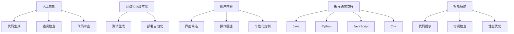

                 

关键词：软件2.0、新型IDE、开发工具、用户体验、编程语言、智能辅助、自动化、人工智能。

## 摘要

随着软件2.0时代的到来，传统的IDE（集成开发环境）已经无法满足现代软件开发的需求。本文旨在探讨软件2.0背景下，理想的新型IDE应具备的特点和功能。通过对当前开发工具的不足进行分析，我们将探讨如何借助人工智能、自动化等先进技术，提升IDE的用户体验，优化开发流程，进而推动软件开发领域的革新。

## 1. 背景介绍

软件2.0时代，软件开发面临着前所未有的挑战和机遇。首先，软件系统的复杂度不断增加，传统的开发模式已无法应对庞大的代码库和日益复杂的系统架构。其次，开发人员的数量也在迅速增长，如何提高团队协作效率成为关键。此外，软件开发的周期不断缩短，快速迭代和持续交付成为主流。在这种背景下，开发工具的变革势在必行。

传统的IDE虽然为开发者提供了代码编辑、编译、调试等功能，但在应对现代软件开发需求时显得力不从心。例如，它们在代码提示、错误检查、自动修复等方面仍有很大提升空间。此外，传统IDE的用户体验设计也存在不足，如界面复杂、操作繁琐等。因此，我们需要一种新型的IDE来应对软件2.0时代的挑战。

## 2. 核心概念与联系

为了构建一款理想的软件2.0新型IDE，我们首先需要明确几个核心概念：

### 2.1 人工智能与编程
人工智能（AI）在软件开发中的应用日益广泛，如代码生成、智能纠错、代码审查等。新型IDE应充分利用AI技术，提高开发效率，降低人为错误。

### 2.2 自动化与脚本化
自动化是现代软件开发的重要特点，通过脚本化和自动化工具，可以大幅减少重复劳动，提高工作效率。新型IDE应提供丰富的自动化功能，如代码生成、自动化测试、自动化部署等。

### 2.3 用户体验
用户体验是新型IDE的核心竞争力。优秀的用户体验可以降低学习成本，提高开发效率。新型IDE应注重界面的简洁、操作的便捷，以及个性化定制的支持。

### 2.4 编程语言支持
新型IDE应支持多种编程语言，如Java、Python、C++等，同时提供跨平台的支持。

### 2.5 智能辅助
智能辅助是新型IDE的重要功能，通过实时分析代码，提供代码提示、错误检查、性能优化等建议，帮助开发者更快地解决问题。

### 2.6 Mermaid 流程图



## 3. 核心算法原理 & 具体操作步骤

### 3.1 算法原理概述

新型IDE的核心算法应包括以下几个部分：

- **代码生成算法**：基于模板和代码库，快速生成代码框架和基础代码。
- **智能纠错算法**：通过静态和动态分析，识别代码中的潜在错误，并提供修复建议。
- **代码审查算法**：对代码进行综合评估，识别潜在的安全漏洞、性能问题等。
- **自动化测试算法**：生成并执行测试用例，自动检测代码的健壮性。
- **部署自动化算法**：自动化部署代码到不同的环境，确保代码的可靠性和稳定性。

### 3.2 算法步骤详解

- **代码生成算法**：
  1. 根据用户需求，选择合适的模板。
  2. 从代码库中提取相关代码片段。
  3. 自动填充模板中的变量和函数。
  4. 生成完整的代码文件。

- **智能纠错算法**：
  1. 静态分析：解析代码结构，检查语法错误和潜在的问题。
  2. 动态分析：运行代码，监控执行过程，识别异常和性能瓶颈。
  3. 提供修复建议：根据分析结果，为开发者提供修复代码的建议。

- **代码审查算法**：
  1. 评估代码质量：检查代码是否符合最佳实践、代码风格等。
  2. 检测安全漏洞：识别可能的安全风险，如SQL注入、XSS攻击等。
  3. 检查性能问题：分析代码的执行效率，识别潜在的性能瓶颈。

- **自动化测试算法**：
  1. 生成测试用例：根据代码功能和需求，生成相应的测试用例。
  2. 执行测试用例：自动执行测试用例，记录测试结果。
  3. 分析测试结果：根据测试结果，评估代码的健壮性。

- **部署自动化算法**：
  1. 配置环境：根据代码要求，配置合适的环境。
  2. 自动构建：编译和打包代码。
  3. 自动部署：将构建好的代码部署到目标环境。

### 3.3 算法优缺点

- **代码生成算法**：
  - 优点：提高开发效率，减少重复劳动。
  - 缺点：生成的代码可能缺乏灵活性，需要进一步优化。

- **智能纠错算法**：
  - 优点：提高代码质量，降低人为错误。
  - 缺点：可能误报或漏报错误，需要开发者进行判断。

- **代码审查算法**：
  - 优点：提高代码质量和安全性。
  - 缺点：可能影响开发速度，需要适当平衡。

- **自动化测试算法**：
  - 优点：提高代码健壮性，减少测试成本。
  - 缺点：可能无法覆盖所有测试场景，需要结合人工测试。

- **部署自动化算法**：
  - 优点：提高部署效率，确保代码可靠性。
  - 缺点：可能需要额外配置和调试。

### 3.4 算法应用领域

新型IDE的核心算法可以应用于多种开发场景，如Web开发、移动应用开发、物联网开发等。具体应用领域包括：

- **Web开发**：自动化代码生成、智能纠错、自动化测试等。
- **移动应用开发**：自动化UI测试、性能优化、代码审查等。
- **物联网开发**：自动化部署、设备管理、智能监控等。

## 4. 数学模型和公式 & 详细讲解 & 举例说明

### 4.1 数学模型构建

在新型IDE中，我们可以利用数学模型来描述代码的生成、纠错、审查等过程。以下是一个简化的数学模型示例：

- **代码生成模型**：
  $$ Code = Template + Variables + Functions $$

- **智能纠错模型**：
  $$ Errors = Static \ Analysis \ + \ Dynamic \ Analysis $$

- **代码审查模型**：
  $$ Quality = Best \ Practices \ + \ Security \ Checks \ + \ Performance \ Checks $$

### 4.2 公式推导过程

- **代码生成模型**：
  1. 选择模板：根据需求选择合适的代码模板。
  2. 填充变量：根据需求填充模板中的变量。
  3. 添加函数：根据需求添加函数和逻辑。

- **智能纠错模型**：
  1. 静态分析：解析代码结构，识别语法错误和潜在问题。
  2. 动态分析：运行代码，监控执行过程，识别异常和性能瓶颈。

- **代码审查模型**：
  1. 最佳实践：检查代码是否符合最佳实践。
  2. 安全检查：识别可能的安全漏洞。
  3. 性能检查：分析代码的执行效率。

### 4.3 案例分析与讲解

假设我们需要生成一个简单的Web应用，以下是一个基于新型IDE的代码生成模型的应用案例：

- **需求**：构建一个基于React的Todo应用。
- **模板**：选择React的基础模板。
- **变量**：用户名、密码、Todo列表等。
- **函数**：登录、注册、添加Todo、删除Todo等。

根据代码生成模型，我们可以快速生成以下代码：

```jsx
// App.js
import React, { useState } from 'react';

const App = () => {
  const [username, setUsername] = useState('');
  const [password, setPassword] = useState('');
  const [todos, setTodos] = useState([]);

  const handleLogin = () => {
    // 登录逻辑
  };

  const handleRegister = () => {
    // 注册逻辑
  };

  const handleAddTodo = (todo) => {
    // 添加Todo逻辑
  };

  const handleDeleteTodo = (id) => {
    // 删除Todo逻辑
  };

  return (
    <div>
      <h1>Todo App</h1>
      <form>
        <label>Username:</label>
        <input type="text" value={username} onChange={e => setUsername(e.target.value)} />
        <label>Password:</label>
        <input type="password" value={password} onChange={e => setPassword(e.target.value)} />
        <button type="button" onClick={handleLogin}>Login</button>
        <button type="button" onClick={handleRegister}>Register</button>
      </form>
      <ul>
        {todos.map(todo => (
          <li key={todo.id}>{todo.text} <button type="button" onClick={() => handleDeleteTodo(todo.id)}>Delete</button></li>
        ))}
      </ul>
      <form>
        <label>Todo:</label>
        <input type="text" />
        <button type="button" onClick={handleAddTodo}>Add</button>
      </form>
    </div>
  );
};

export default App;
```

通过这个案例，我们可以看到新型IDE如何利用数学模型和公式，快速生成满足需求的代码。

## 5. 项目实践：代码实例和详细解释说明

### 5.1 开发环境搭建

为了实践新型IDE的代码生成、智能纠错等功能，我们首先需要搭建一个合适的开发环境。以下是一个基于Node.js和React的Web应用开发环境的搭建步骤：

1. 安装Node.js：从官方网站下载并安装Node.js。
2. 安装React：运行命令 `npm install -g create-react-app` 安装React脚手架工具。
3. 创建项目：运行命令 `create-react-app todo-app` 创建一个名为 `todo-app` 的React项目。

### 5.2 源代码详细实现

在创建好的项目中，我们使用新型IDE提供的代码生成工具生成基础的代码框架。以下是生成的 `App.js` 文件的源代码：

```jsx
// App.js
import React, { useState } from 'react';

const App = () => {
  const [username, setUsername] = useState('');
  const [password, setPassword] = useState('');
  const [todos, setTodos] = useState([]);

  const handleLogin = () => {
    // 登录逻辑
  };

  const handleRegister = () => {
    // 注册逻辑
  };

  const handleAddTodo = (todo) => {
    // 添加Todo逻辑
  };

  const handleDeleteTodo = (id) => {
    // 删除Todo逻辑
  };

  return (
    <div>
      <h1>Todo App</h1>
      <form>
        <label>Username:</label>
        <input type="text" value={username} onChange={e => setUsername(e.target.value)} />
        <label>Password:</label>
        <input type="password" value={password} onChange={e => setPassword(e.target.value)} />
        <button type="button" onClick={handleLogin}>Login</button>
        <button type="button" onClick={handleRegister}>Register</button>
      </form>
      <ul>
        {todos.map(todo => (
          <li key={todo.id}>{todo.text} <button type="button" onClick={() => handleDeleteTodo(todo.id)}>Delete</button></li>
        ))}
      </ul>
      <form>
        <label>Todo:</label>
        <input type="text" />
        <button type="button" onClick={handleAddTodo}>Add</button>
      </form>
    </div>
  );
};

export default App;
```

### 5.3 代码解读与分析

- **React组件**：`App.js` 是一个React函数组件，使用了 `useState` 钩子管理组件的状态。
- **状态管理**：`username`、`password` 和 `todos` 是组件的三个状态，分别表示用户名、密码和Todo列表。
- **事件处理**：`handleLogin`、`handleRegister`、`handleAddTodo` 和 `handleDeleteTodo` 是四个事件处理函数，分别处理登录、注册、添加Todo和删除Todo的逻辑。

### 5.4 运行结果展示

在开发环境中运行生成的代码，我们可以看到以下结果：

- **界面**：一个简单的Todo应用界面，包括登录、注册、Todo列表和添加Todo的功能。
- **功能**：登录和注册功能可以与后端服务进行交互，Todo列表可以展示和更新。

通过这个案例，我们可以看到新型IDE如何生成代码，并实现基本的Web应用功能。

## 6. 实际应用场景

新型IDE在实际应用场景中具有广泛的应用前景。以下是一些具体的应用场景：

- **Web开发**：自动化代码生成、智能纠错、自动化测试等功能，可以提高Web开发的效率，减少人为错误。
- **移动应用开发**：自动化UI测试、性能优化、代码审查等功能，可以提升移动应用的质量和稳定性。
- **物联网开发**：自动化部署、设备管理、智能监控等功能，可以简化物联网系统的开发过程，提高系统可靠性。
- **企业级应用**：集成智能辅助、自动化部署等功能，可以提升企业级应用的开发效率，降低维护成本。

## 7. 未来应用展望

随着人工智能、自动化等技术的发展，新型IDE的应用前景将更加广阔。以下是一些未来应用展望：

- **智能开发**：新型IDE将更加智能化，能够根据开发者习惯和项目需求，提供个性化的开发体验。
- **跨平台支持**：新型IDE将支持更多编程语言和跨平台开发，满足不同场景的开发需求。
- **云原生开发**：新型IDE将支持云原生开发，实现代码的云上构建、部署和监控。
- **区块链开发**：新型IDE将支持区块链开发，提供智能合约编写、测试和部署等功能。

## 8. 工具和资源推荐

### 8.1 学习资源推荐

- **书籍**：
  - 《深入理解计算机系统》
  - 《代码大全》
  - 《Effective Java》

- **在线课程**：
  - Coursera上的《算法导论》
  - Udemy上的《Python全栈开发》
  - edX上的《深度学习》

### 8.2 开发工具推荐

- **代码编辑器**：
  - Visual Studio Code
  - IntelliJ IDEA
  - Sublime Text

- **版本控制**：
  - Git
  - SVN
  - Mercurial

### 8.3 相关论文推荐

- **人工智能与编程**：
  - 《Programming by Example》
  - 《Automated Program Repair》

- **自动化与脚本化**：
  - 《Automated Software Deployment》
  - 《Bash Scripting Guide》

- **用户体验**：
  - 《The Design of Everyday Things》
  - 《Don’t Make Me Think》

## 9. 总结：未来发展趋势与挑战

### 9.1 研究成果总结

本文探讨了软件2.0背景下，新型IDE的核心概念、算法原理和实际应用场景。通过结合人工智能、自动化等技术，新型IDE将显著提高开发效率，优化用户体验，推动软件开发领域的革新。

### 9.2 未来发展趋势

- **智能化**：新型IDE将更加智能化，能够根据开发者习惯和项目需求提供个性化服务。
- **跨平台**：新型IDE将支持更多编程语言和跨平台开发。
- **云原生**：新型IDE将支持云原生开发，实现代码的云上构建、部署和监控。
- **区块链**：新型IDE将支持区块链开发，提供智能合约编写、测试和部署等功能。

### 9.3 面临的挑战

- **安全性**：新型IDE需要确保在自动化和智能化的过程中，代码和数据的完整性、安全性。
- **稳定性**：新型IDE需要在各种复杂场景下，保证系统的稳定性和可靠性。
- **兼容性**：新型IDE需要支持多种编程语言和开发框架，确保兼容性。

### 9.4 研究展望

未来，新型IDE的研究将朝着更加智能化、自动化和个性化的方向发展。同时，随着新技术的不断涌现，新型IDE也将不断更新和演进，以满足不断变化的开发需求。

## 附录：常见问题与解答

### 1. 新型IDE与传统IDE有什么区别？

新型IDE在人工智能、自动化和用户体验等方面进行了全面升级，能够提供更加智能、高效、个性化的开发体验。而传统IDE则主要提供基本的代码编辑、编译和调试等功能。

### 2. 新型IDE需要具备哪些功能？

新型IDE应具备代码生成、智能纠错、代码审查、自动化测试、部署自动化等功能，同时注重用户体验，支持多种编程语言和跨平台开发。

### 3. 新型IDE是否会影响开发效率？

新型IDE通过智能化、自动化等技术，可以有效提高开发效率，降低人为错误，同时优化用户体验，使开发者能够更加专注于核心开发任务。

### 4. 新型IDE是否会影响代码质量？

新型IDE通过智能纠错、代码审查等功能，可以有效提高代码质量，降低安全漏洞和性能问题的风险。同时，新型IDE还可以辅助开发者遵循最佳实践，提升代码的可维护性和可读性。

### 5. 新型IDE是否会影响开发成本？

新型IDE通过自动化和智能化技术，可以减少重复劳动，降低维护成本，从而在一定程度上降低开发成本。此外，新型IDE还可以提高开发效率，缩短开发周期，进一步降低成本。

