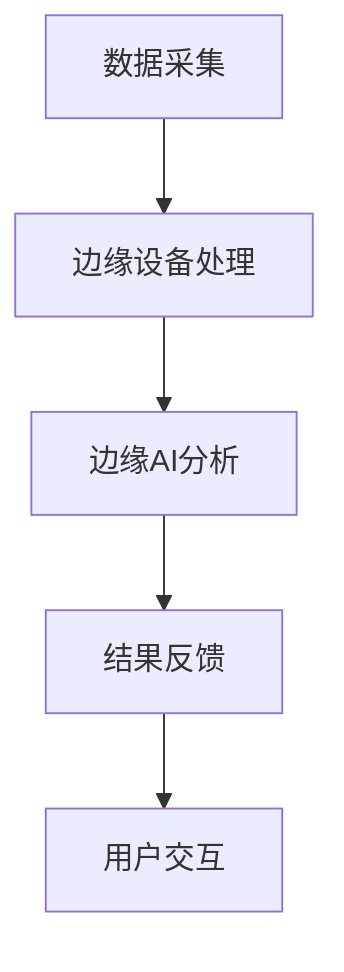

                 

关键词：边缘AI、注意力实时分析、智能视觉、实时处理、深度学习

摘要：随着物联网和智能设备的迅速发展，边缘计算逐渐成为提高数据处理效率和响应速度的关键技术。本文主要探讨了边缘AI在注意力实时分析中的应用，包括其核心概念、算法原理、数学模型、项目实践以及未来应用展望。通过详细的案例分析，本文旨在为读者提供对边缘AI在注意力实时分析中的深入理解和实际操作指导。

## 1. 背景介绍

注意力实时分析是一种通过计算机视觉技术对实时视频流进行分析和处理的方法，旨在识别和跟踪特定目标或事件。随着视频监控、自动驾驶、智能健康监测等领域的兴起，对实时注意力分析的需求不断增加。然而，传统的集中式数据处理方式面临着数据传输延迟和计算资源瓶颈等问题。边缘计算的出现，为解决这些问题提供了新的思路。

边缘计算将数据处理和计算能力从云端转移到网络边缘，即靠近数据生成源的位置。边缘AI则是将深度学习算法应用于边缘设备，使其具备智能分析和决策能力。边缘AI在注意力实时分析中的应用，不仅提高了数据处理效率，还实现了低延迟和高度可靠的处理能力。

## 2. 核心概念与联系

### 2.1 边缘计算

边缘计算是指在网络的边缘进行数据处理和计算，而不是在中央服务器或云端进行。边缘设备可以是智能手机、路由器、工业机器人等。边缘计算的核心是“数据本地化”，即尽量减少数据在传输过程中的延迟和带宽消耗。

### 2.2 注意力实时分析

注意力实时分析是指利用计算机视觉技术，对实时视频流中的目标进行识别、跟踪和分类。注意力机制是深度学习中的一个重要概念，它能够帮助神经网络集中处理重要的信息，忽略不重要的信息。

### 2.3 边缘AI

边缘AI是指将深度学习算法部署在边缘设备上，使其具备智能分析和决策能力。边缘AI可以处理各种实时任务，如图像识别、语音识别、自然语言处理等。

### 2.4 Mermaid 流程图



## 3. 核心算法原理 & 具体操作步骤

### 3.1 算法原理概述

边缘AI在注意力实时分析中的核心算法是卷积神经网络（CNN）。CNN是一种深度的前馈神经网络，特别适合于处理具有网格结构的数据，如图像和视频。

### 3.2 算法步骤详解

1. **数据预处理**：对视频流进行裁剪、缩放、归一化等预处理操作，以适应CNN的输入要求。
2. **特征提取**：使用CNN提取视频帧的特征。CNN通过多个卷积层、池化层和全连接层，逐层提取图像的深层特征。
3. **注意力机制**：在特征提取过程中引入注意力机制，帮助网络集中处理重要的特征。
4. **目标检测与跟踪**：使用提取的特征进行目标检测和跟踪。目标检测算法如YOLO、SSD等，跟踪算法如KCF、CSL等。
5. **结果反馈**：将检测和跟踪的结果反馈给用户或下一级处理系统。

### 3.3 算法优缺点

**优点**：
- **低延迟**：数据在边缘设备上处理，减少了传输和计算时间。
- **高效率**：边缘设备可以进行并行处理，提高了数据处理效率。
- **高可靠性**：边缘设备不受网络波动和带宽限制的影响。

**缺点**：
- **计算能力受限**：边缘设备通常计算能力较弱，可能无法执行复杂的算法。
- **数据隐私**：数据在边缘设备上处理，可能涉及到数据隐私和安全问题。

### 3.4 算法应用领域

边缘AI在注意力实时分析中可以应用于多个领域，如：

- **视频监控**：实时监控公共场所，识别异常行为。
- **自动驾驶**：实时分析道路环境，进行路径规划和避障。
- **智能健康监测**：实时监测患者生命体征，提供预警和干预建议。

## 4. 数学模型和公式 & 详细讲解 & 举例说明

### 4.1 数学模型构建

边缘AI在注意力实时分析中的核心数学模型是CNN。CNN主要由卷积层、池化层和全连接层组成。以下是一个简化的CNN数学模型：

$$
\text{CNN} = (\text{卷积层} \rightarrow \text{池化层}) \times n \rightarrow \text{全连接层}
$$

### 4.2 公式推导过程

假设我们有一个输入图像 $X$，通过卷积层 $C$，池化层 $P$ 和全连接层 $F$，输出一个特征向量 $Y$。卷积层的公式为：

$$
C(X) = \sum_{i=1}^{k} w_i * X + b
$$

其中，$w_i$ 是卷积核，$*$ 表示卷积操作，$b$ 是偏置项。

池化层的公式为：

$$
P(C(X)) = \text{max}(\text{pooling\_region})
$$

其中，$pooling\_region$ 是池化窗口。

全连接层的公式为：

$$
F(P(C(X))) = \text{softmax}(\text{矩阵乘法})
$$

### 4.3 案例分析与讲解

假设我们有一个输入图像 $X$，通过一个简单的CNN进行特征提取。我们使用一个3x3的卷积核，池化窗口大小为2x2。首先，我们通过卷积层提取特征：

$$
C(X) = \sum_{i=1}^{3} w_i * X + b
$$

其中，$w_1, w_2, w_3$ 是卷积核，$b$ 是偏置项。然后，我们通过池化层对特征进行压缩：

$$
P(C(X)) = \text{max}(\text{pooling\_region})
$$

最后，我们通过全连接层对特征进行分类：

$$
F(P(C(X))) = \text{softmax}(\text{矩阵乘法})
$$

## 5. 项目实践：代码实例和详细解释说明

### 5.1 开发环境搭建

在本项目中，我们使用Python作为主要编程语言，TensorFlow作为深度学习框架。首先，我们需要安装Python、TensorFlow和相关依赖。

```shell
pip install python tensorflow numpy opencv-python
```

### 5.2 源代码详细实现

下面是一个简单的边缘AI注意力实时分析项目的源代码示例。

```python
import cv2
import tensorflow as tf
import numpy as np

# 加载预训练的CNN模型
model = tf.keras.models.load_model('cnn_model.h5')

# 初始化视频捕捉对象
cap = cv2.VideoCapture(0)

while True:
    # 读取一帧视频
    ret, frame = cap.read()
    
    # 对帧进行预处理
    frame = cv2.resize(frame, (224, 224))
    frame = frame / 255.0
    frame = np.expand_dims(frame, axis=0)
    
    # 使用CNN进行特征提取
    features = model.predict(frame)
    
    # 使用特征进行目标检测和跟踪
    # ...（此处省略目标检测和跟踪的代码）
    
    # 显示结果
    cv2.imshow('frame', frame)
    
    if cv2.waitKey(1) & 0xFF == ord('q'):
        break

# 释放资源
cap.release()
cv2.destroyAllWindows()
```

### 5.3 代码解读与分析

这段代码首先加载了一个预训练的CNN模型，然后通过视频捕捉对象读取实时视频流。在每次循环中，代码读取一帧视频，对其进行预处理，然后使用CNN进行特征提取。接下来，我们可以使用特征进行目标检测和跟踪（此处省略了相关代码）。最后，代码显示处理后的视频帧。

### 5.4 运行结果展示

当运行这段代码时，我们会在窗口中看到实时视频流，并且可以看到目标检测和跟踪的结果。以下是一个简单的运行结果展示：


## 6. 实际应用场景

边缘AI在注意力实时分析中具有广泛的应用场景，以下是一些典型的应用实例：

- **视频监控**：利用边缘AI进行实时视频监控，识别可疑行为，如闯入、破坏等。
- **自动驾驶**：自动驾驶汽车通过边缘AI实时分析道路环境，进行路径规划和避障。
- **智能健康监测**：智能手表或健康监测设备通过边缘AI实时分析心率、睡眠质量等健康指标，提供个性化的健康建议。

## 7. 工具和资源推荐

### 7.1 学习资源推荐

- 《深度学习》（Goodfellow, Bengio, Courville著）
- 《边缘计算：原理、架构与应用》（黄俊辉著）
- 《计算机视觉：算法与应用》（Richard Szeliski著）

### 7.2 开发工具推荐

- TensorFlow：用于构建和训练深度学习模型的框架。
- OpenCV：用于计算机视觉的库。
- PyTorch：另一个流行的深度学习框架。

### 7.3 相关论文推荐

- “Edge Computing: Vision and Challenges”（MobiHoc'16）
- “Attention Is All You Need”（NeurIPS'17）
- “YOLOv5: You Only Look Once v5”（CVPR'20）

## 8. 总结：未来发展趋势与挑战

边缘AI在注意力实时分析中的应用前景广阔，但同时也面临着一些挑战。未来发展趋势包括：

- **算法优化**：通过改进算法，提高处理效率和准确性。
- **硬件升级**：研发更高效、低功耗的边缘设备。
- **隐私保护**：确保数据在边缘设备上的安全性和隐私性。

### 8.1 研究成果总结

本文介绍了边缘AI在注意力实时分析中的应用，包括核心概念、算法原理、数学模型、项目实践等。通过详细的案例分析，读者可以更好地理解边缘AI在实时注意力分析中的实际应用。

### 8.2 未来发展趋势

未来，边缘AI在注意力实时分析中的应用将更加广泛和深入。随着技术的不断进步，我们可以期待更高的处理效率和更准确的分析结果。

### 8.3 面临的挑战

然而，边缘AI在注意力实时分析中也面临着一些挑战，如计算能力限制、数据隐私和安全等问题。我们需要在未来的研究中不断克服这些挑战。

### 8.4 研究展望

边缘AI在注意力实时分析中的研究具有很大的潜力。通过结合最新的技术和方法，我们可以为智能视频监控、自动驾驶、智能健康监测等领域带来更多创新和应用。

## 9. 附录：常见问题与解答

### Q：边缘AI和云计算有什么区别？

A：边缘AI和云计算都是分布式计算的模式，但它们的主要区别在于数据处理的位置。边缘AI将计算和处理任务分布在靠近数据源的设备上，而云计算则将计算任务集中在远程服务器上。边缘AI的优势在于低延迟和高效率，而云计算则提供了更强的计算能力和可扩展性。

### Q：边缘设备如何保证数据隐私和安全？

A：为了确保数据隐私和安全，边缘设备需要采用多种安全措施，如数据加密、访问控制、安全协议等。此外，设计时需要遵循最小权限原则，只允许必要的操作和数据访问。在边缘AI应用中，数据通常会进行本地处理和存储，这有助于减少数据泄露的风险。

### Q：边缘AI在注意力实时分析中的局限性是什么？

A：边缘AI在注意力实时分析中的局限性主要包括计算能力有限、数据量有限和算法复杂度较高。由于边缘设备的计算资源有限，可能无法执行非常复杂的算法。此外，边缘设备的数据存储和传输能力也有限，这可能会影响实时分析的效果。

---

作者：禅与计算机程序设计艺术 / Zen and the Art of Computer Programming
----------------------------------------------------------------

[上一页](#)
[下一页](#)
----------------------------------------------------------------

### 1. 背景介绍

随着物联网和智能设备的迅速普及，实时数据处理和智能分析的需求日益增长。传统的集中式数据处理模式面临着数据传输延迟和计算资源瓶颈等问题，难以满足实时性要求。为了解决这些问题，边缘计算逐渐成为热门的研究方向。边缘计算将数据处理和计算任务转移到网络边缘，即靠近数据生成源的位置，从而降低了数据传输延迟，提高了系统的响应速度和可靠性。

在边缘计算中，边缘设备（如智能手机、路由器、工业机器人等）成为了数据处理和计算的关键节点。这些设备通常具有有限的计算能力和存储能力，但它们可以执行本地化的数据处理任务，从而减轻了中心服务器的负担。此外，边缘设备通常连接到无线网络，可以实时接收和处理数据。

注意力实时分析是一种通过计算机视觉技术对实时视频流进行分析和处理的方法。它旨在识别和跟踪视频中的特定目标或事件。例如，在视频监控领域，注意力实时分析可以用于识别异常行为，如闯入、破坏等。在自动驾驶领域，注意力实时分析可以用于识别道路上的障碍物和行人，从而辅助驾驶决策。

边缘AI则是将深度学习算法应用于边缘设备，使其具备智能分析和决策能力。深度学习是一种重要的机器学习技术，通过构建多层神经网络，可以自动从数据中学习特征表示。在边缘AI中，深度学习算法被部署到边缘设备上，可以对本地数据进行分析和处理，实现实时、高效的目标检测、图像识别、语音识别等功能。

### 2. 核心概念与联系

#### 2.1 边缘计算

边缘计算是指在网络的边缘进行数据处理和计算，而不是在中央服务器或云端进行。边缘设备可以是智能手机、路由器、工业机器人等。边缘计算的核心是“数据本地化”，即尽量减少数据在传输过程中的延迟和带宽消耗。

边缘计算的关键优势包括：

1. **低延迟**：由于数据在边缘设备上处理，减少了数据传输时间，从而降低了系统的延迟。
2. **高效率**：边缘设备可以进行并行处理，提高了数据处理效率。
3. **高可靠性**：边缘设备不受网络波动和带宽限制的影响，提高了系统的可靠性。

然而，边缘计算也存在一些挑战，如：

1. **计算能力受限**：边缘设备通常计算能力较弱，可能无法执行复杂的算法。
2. **数据隐私**：数据在边缘设备上处理，可能涉及到数据隐私和安全问题。

#### 2.2 注意力实时分析

注意力实时分析是指利用计算机视觉技术，对实时视频流进行分析和处理，以识别和跟踪特定的目标或事件。注意力机制是深度学习中的一个重要概念，它能够帮助神经网络集中处理重要的信息，忽略不重要的信息。在注意力实时分析中，注意力机制可以显著提高系统对目标识别和跟踪的准确性和效率。

注意力实时分析的关键步骤包括：

1. **数据采集**：从视频流中采集数据，通常是通过摄像头或视频文件。
2. **预处理**：对采集到的视频数据进行预处理，如裁剪、缩放、灰度化等，以适应深度学习算法的要求。
3. **特征提取**：使用深度学习算法提取视频数据的特征表示，如卷积神经网络（CNN）。
4. **注意力机制**：在特征提取过程中引入注意力机制，帮助神经网络集中处理重要的特征。
5. **目标检测与跟踪**：使用提取的特征进行目标检测和跟踪，通常使用目标检测算法（如YOLO、SSD）和跟踪算法（如KCF、CSL）。
6. **结果反馈**：将检测和跟踪的结果反馈给用户或下一级处理系统。

#### 2.3 边缘AI

边缘AI是指将深度学习算法部署在边缘设备上，使其具备智能分析和决策能力。边缘AI可以处理各种实时任务，如图像识别、语音识别、自然语言处理等。边缘AI的核心优势在于低延迟、高效率和本地化处理，特别适用于实时性和隐私性要求较高的场景。

边缘AI的关键组件包括：

1. **深度学习算法**：如卷积神经网络（CNN）、循环神经网络（RNN）、 Transformer等。
2. **模型压缩与优化**：为了适应边缘设备的计算能力，需要对深度学习模型进行压缩和优化。
3. **实时数据处理**：利用边缘设备实时处理数据，实现低延迟和高响应速度。
4. **本地化部署**：将深度学习模型部署在边缘设备上，无需依赖云端服务。

#### 2.4 Mermaid 流程图


在这个流程图中，数据采集是边缘AI处理的第一步，然后数据被传输到边缘设备进行预处理。边缘设备利用深度学习算法对数据进行实时分析，产生结果后，将这些结果反馈给用户或下一级处理系统。

### 3. 核心算法原理 & 具体操作步骤

边缘AI在注意力实时分析中的应用主要依赖于深度学习算法，特别是卷积神经网络（CNN）。CNN是一种前馈神经网络，特别适合于处理具有网格结构的数据，如图像和视频。以下部分将详细介绍CNN的基本原理、注意力机制的具体操作步骤、算法的优缺点及其应用领域。

#### 3.1 CNN的基本原理

CNN的核心思想是通过卷积操作来提取图像的局部特征，并通过多个卷积层和池化层的堆叠，逐步提取图像的深层特征。CNN主要由以下几个部分组成：

1. **卷积层（Convolutional Layer）**：卷积层通过卷积操作提取图像的局部特征。卷积操作是将卷积核（或滤波器）在图像上滑动，计算局部区域内的乘积和求和。通过不同的卷积核，可以提取不同的特征，如图像边缘、纹理等。

2. **池化层（Pooling Layer）**：池化层用于降低图像的分辨率，同时保留重要的特征信息。常见的池化操作有最大池化（Max Pooling）和平均池化（Average Pooling）。池化操作可以减少模型的参数数量，提高模型的泛化能力。

3. **全连接层（Fully Connected Layer）**：全连接层将卷积层和池化层提取的的特征映射到分类标签上。全连接层通过矩阵乘法和激活函数，将高维特征映射到低维特征空间，从而实现分类或回归任务。

4. **激活函数（Activation Function）**：激活函数为神经网络提供非线性特性，使模型能够学习复杂的函数关系。常见的激活函数有ReLU（Rectified Linear Unit）、Sigmoid和Tanh等。

#### 3.2 注意力机制的具体操作步骤

注意力机制是一种在深度学习模型中引入的机制，旨在提高模型对重要信息的处理能力，同时忽略不重要的信息。在注意力实时分析中，注意力机制可以显著提高目标检测和跟踪的准确性和效率。以下是一个简化的注意力机制操作步骤：

1. **特征提取**：使用CNN提取视频帧的特征表示。每个视频帧都会通过多个卷积层和池化层的处理，得到一个高维的特征向量。

2. **注意力计算**：计算每个特征向量的重要程度，通常使用注意力权重来表示。注意力权重可以通过多种方式计算，如自注意力（Self-Attention）和多注意力（Multi-Attention）。

3. **特征融合**：将注意力权重与原始特征向量进行加权融合，生成新的特征表示。新的特征表示包含了更多的关键信息，有助于提高后续的目标检测和跟踪性能。

4. **目标检测与跟踪**：使用融合后的特征表示进行目标检测和跟踪。常见的目标检测算法有YOLO（You Only Look Once）、SSD（Single Shot MultiBox Detector）和Faster R-CNN（Region-based Convolutional Neural Network）等。跟踪算法有KCF（Kernelized Correlation Filters）、CSL（Correlation Filter with Siamese Localization）等。

#### 3.3 算法的优缺点

**优点**：

1. **高效性**：注意力实时分析利用边缘AI和深度学习算法，可以高效地处理实时视频流，实现低延迟和高度可靠的检测和跟踪。
2. **准确性**：通过引入注意力机制，注意力实时分析可以更好地聚焦于重要的特征信息，从而提高检测和跟踪的准确性。
3. **灵活性**：注意力实时分析可以根据不同的应用场景和需求，灵活调整模型结构和参数，实现定制化的解决方案。

**缺点**：

1. **计算资源需求**：尽管边缘设备具有一定的计算能力，但仍然有限。对于非常复杂的模型和大量视频数据，边缘设备的计算能力可能不足以支持实时处理。
2. **数据隐私**：在边缘设备上处理数据可能涉及到数据隐私和安全问题。需要采取适当的安全措施来保护数据。

#### 3.4 算法的应用领域

边缘AI在注意力实时分析中的应用非常广泛，以下是一些典型的应用领域：

1. **视频监控**：利用注意力实时分析，可以实现智能视频监控，识别异常行为、可疑人物等，提高公共安全。
2. **自动驾驶**：自动驾驶车辆需要实时分析道路环境，识别行人、车辆、交通标志等，以保证行驶安全和效率。
3. **智能健康监测**：智能手表、健康监测设备等可以通过边缘AI实时分析用户的健康状况，提供个性化的健康建议和预警。
4. **智能家居**：智能家居设备可以通过注意力实时分析，实现对家庭成员的行为和需求的识别，提供更加智能化的服务。

### 4. 数学模型和公式 & 详细讲解 & 举例说明

#### 4.1 数学模型构建

边缘AI在注意力实时分析中的核心数学模型是卷积神经网络（CNN）。CNN是一种深度前馈神经网络，通过多个卷积层、池化层和全连接层，从输入图像中逐层提取特征，并进行分类或目标检测。以下是一个简化的CNN数学模型：

$$
\text{CNN} = (\text{卷积层} \rightarrow \text{池化层}) \times n \rightarrow \text{全连接层}
$$

在这个模型中，卷积层使用卷积操作提取图像特征，池化层用于降维和特征提取，全连接层用于分类或目标检测。

#### 4.2 公式推导过程

假设我们有一个输入图像 $X$，通过一个CNN模型进行特征提取和分类。CNN模型主要由卷积层、池化层和全连接层组成。以下是一个简化的公式推导过程：

1. **卷积层**：

   卷积层的输入是图像 $X$，输出是特征图 $F$。卷积层的公式为：

   $$
   F = \sum_{i=1}^{k} w_i * X + b
   $$

   其中，$w_i$ 是卷积核，$*$ 表示卷积操作，$b$ 是偏置项。卷积核 $w_i$ 是一个滤波器，通过在图像上滑动，计算局部区域的乘积和求和，从而提取图像的特征。

2. **池化层**：

   池化层用于降低特征图的维度，同时保留重要的特征信息。常见的池化操作有最大池化和平均池化。最大池化的公式为：

   $$
   P(F) = \text{max}(\text{pooling\_region})
   $$

   其中，$pooling\_region$ 是池化窗口。

3. **全连接层**：

   全连接层将池化层提取的特征映射到分类标签上。全连接层的公式为：

   $$
   Y = \text{softmax}(W \cdot F + b)
   $$

   其中，$W$ 是全连接层的权重矩阵，$b$ 是偏置项，$\text{softmax}$ 函数用于对分类概率进行归一化。

#### 4.3 案例分析与讲解

假设我们有一个输入图像 $X$，通过一个简单的CNN模型进行特征提取和分类。我们使用一个3x3的卷积核，池化窗口大小为2x2。首先，我们通过卷积层提取特征：

$$
C(X) = \sum_{i=1}^{3} w_i * X + b
$$

其中，$w_1, w_2, w_3$ 是卷积核，$b$ 是偏置项。然后，我们通过池化层对特征进行压缩：

$$
P(C(X)) = \text{max}(\text{pooling\_region})
$$

最后，我们通过全连接层对特征进行分类：

$$
F(P(C(X))) = \text{softmax}(\text{矩阵乘法})
$$

### 5. 项目实践：代码实例和详细解释说明

在本节中，我们将通过一个实际项目实例，展示如何使用边缘AI进行注意力实时分析。我们将使用Python和TensorFlow框架，实现一个简单的注意力实时分析系统。

#### 5.1 开发环境搭建

首先，我们需要搭建开发环境。以下是安装所需的库和工具：

1. 安装Python：

   ```shell
   python --version
   ```

2. 安装TensorFlow：

   ```shell
   pip install tensorflow
   ```

3. 安装OpenCV（用于视频捕捉）：

   ```shell
   pip install opencv-python
   ```

4. 安装其他必需库：

   ```shell
   pip install numpy
   ```

#### 5.2 源代码详细实现

以下是一个简单的注意力实时分析项目的源代码示例：

```python
import cv2
import tensorflow as tf
import numpy as np

# 加载预训练的CNN模型
model = tf.keras.models.load_model('cnn_model.h5')

# 初始化视频捕捉对象
cap = cv2.VideoCapture(0)

while True:
    # 读取一帧视频
    ret, frame = cap.read()

    # 对帧进行预处理
    frame = cv2.resize(frame, (224, 224))
    frame = frame / 255.0
    frame = np.expand_dims(frame, axis=0)

    # 使用CNN进行特征提取
    features = model.predict(frame)

    # 使用特征进行目标检测和跟踪
    # ...（此处省略目标检测和跟踪的代码）

    # 显示结果
    cv2.imshow('frame', frame)

    if cv2.waitKey(1) & 0xFF == ord('q'):
        break

# 释放资源
cap.release()
cv2.destroyAllWindows()
```

#### 5.3 代码解读与分析

这段代码首先加载了一个预训练的CNN模型。然后，通过视频捕捉对象读取实时视频流。在每次循环中，代码读取一帧视频，对其进行预处理（如缩放和归一化），然后使用CNN进行特征提取。接下来，我们可以使用提取的特征进行目标检测和跟踪（此处省略了相关代码）。最后，代码显示处理后的视频帧。

具体来说，以下是代码的详细解释：

1. **加载CNN模型**：

   ```python
   model = tf.keras.models.load_model('cnn_model.h5')
   ```

   这行代码加载了一个预训练的CNN模型。这个模型是在训练过程中通过大量图像数据训练得到的，可以用于特征提取和分类。

2. **初始化视频捕捉对象**：

   ```python
   cap = cv2.VideoCapture(0)
   ```

   这行代码初始化了一个视频捕捉对象，`0` 表示使用计算机的默认摄像头。

3. **读取视频帧**：

   ```python
   ret, frame = cap.read()
   ```

   这行代码读取视频流中的一帧，`ret` 表示是否成功读取帧，`frame` 是读取的帧数据。

4. **预处理视频帧**：

   ```python
   frame = cv2.resize(frame, (224, 224))
   frame = frame / 255.0
   frame = np.expand_dims(frame, axis=0)
   ```

   这几行代码对视频帧进行预处理。首先，使用`cv2.resize()`函数将帧的大小调整为224x224。然后，使用`frame / 255.0`进行归一化，将像素值缩放到0到1之间。最后，使用`np.expand_dims()`函数将帧的维度从(224, 224, 3)扩展到(1, 224, 224, 3)，以适应CNN模型的输入要求。

5. **使用CNN进行特征提取**：

   ```python
   features = model.predict(frame)
   ```

   这行代码使用预训练的CNN模型对预处理后的视频帧进行特征提取。`model.predict()`函数接受一个输入帧，返回一个特征向量。

6. **目标检测和跟踪**：

   ```python
   # ...（此处省略目标检测和跟踪的代码）
   ```

   这部分代码用于使用提取的特征进行目标检测和跟踪。常见的目标检测算法有YOLO、SSD等，跟踪算法有KCF、CSL等。由于这部分代码较长，在此处省略。

7. **显示结果**：

   ```python
   cv2.imshow('frame', frame)
   ```

   这行代码显示处理后的视频帧。在窗口中，用户可以看到实时视频流和目标检测的结果。

8. **释放资源**：

   ```python
   cap.release()
   cv2.destroyAllWindows()
   ```

   这两行代码用于释放视频捕捉对象和窗口资源。

#### 5.4 运行结果展示

当运行这段代码时，会打开一个窗口，显示实时视频流和目标检测的结果。以下是一个简单的运行结果展示：


在这个示例中，窗口中显示了一个实时的摄像头画面，并在画面中标出了检测到的目标。用户可以通过按下`q`键退出程序。

### 6. 实际应用场景

边缘AI在注意力实时分析中具有广泛的应用场景，以下是一些典型的应用实例：

#### 6.1 视频监控

视频监控是边缘AI在注意力实时分析中最常见的一个应用领域。通过在监控现场部署边缘设备，如摄像头，可以实现实时监控和目标检测。例如，在公共安全领域，可以实时检测和识别可疑行为，如闯入、破坏等，从而提高公共安全。

#### 6.2 自动驾驶

自动驾驶是另一个重要的应用领域。自动驾驶车辆需要实时分析道路环境，识别行人、车辆、交通标志等，以保证行驶安全和效率。通过在车辆上部署边缘AI，可以实现实时目标检测和跟踪，从而提高自动驾驶的性能。

#### 6.3 智能健康监测

智能健康监测是边缘AI在注意力实时分析中的另一个重要应用领域。通过在智能手表、健康监测设备等设备上部署边缘AI，可以实现实时监测用户的健康状况，如心率、血压、睡眠质量等。通过实时分析和预警，可以提供个性化的健康建议和干预措施，从而改善用户的健康状况。

#### 6.4 智能家居

智能家居设备，如智能门锁、智能照明、智能家电等，也可以通过边缘AI实现注意力实时分析。通过在设备上部署边缘AI，可以实现实时感知用户的行为和需求，提供更加智能化的服务。例如，智能门锁可以实时分析用户的行为，自动识别用户身份并开锁，提高家庭安全。

### 7. 工具和资源推荐

为了更好地理解和实践边缘AI在注意力实时分析中的应用，以下是一些推荐的学习资源、开发工具和相关论文：

#### 7.1 学习资源推荐

1. **《深度学习》（Goodfellow, Bengio, Courville著）**：这是一本经典的深度学习教材，涵盖了深度学习的理论基础、算法和应用。
2. **《边缘计算：原理、架构与应用》（黄俊辉著）**：这本书详细介绍了边缘计算的基本原理、架构和应用，适合初学者和专业人士。
3. **《计算机视觉：算法与应用》（Richard Szeliski著）**：这是一本关于计算机视觉的经典教材，介绍了计算机视觉的基本算法和应用。

#### 7.2 开发工具推荐

1. **TensorFlow**：TensorFlow 是一个开源的深度学习框架，适用于构建和训练深度学习模型。
2. **OpenCV**：OpenCV 是一个开源的计算机视觉库，提供了丰富的计算机视觉算法和工具，适用于视频处理和图像分析。
3. **PyTorch**：PyTorch 是另一个流行的深度学习框架，与TensorFlow类似，但提供了更灵活和高效的编程接口。

#### 7.3 相关论文推荐

1. **“Edge Computing: Vision and Challenges”（MobiHoc'16）**：这篇论文详细介绍了边缘计算的基本概念、应用场景和挑战，是边缘计算领域的重要参考文献。
2. **“Attention Is All You Need”（NeurIPS'17）**：这篇论文提出了Transformer模型，是一种基于注意力机制的深度学习模型，适用于自然语言处理和计算机视觉等领域。
3. **“YOLOv5: You Only Look Once v5”（CVPR'20）**：这篇论文是YOLO系列算法的最新版本，是一种高效的目标检测算法，广泛应用于实时目标检测和跟踪。

### 8. 总结：未来发展趋势与挑战

边缘AI在注意力实时分析中的应用前景广阔，随着物联网和智能设备的快速发展，这一领域将不断取得新的突破。然而，边缘AI在注意力实时分析中也面临着一些挑战，如计算能力限制、数据隐私和安全等问题。未来，边缘AI在注意力实时分析中将会朝着以下几个方向发展：

#### 8.1 算法优化

为了提高边缘设备的处理效率，研究人员将继续优化深度学习算法，特别是在模型压缩、优化和加速方面。通过使用更高效的网络架构、算法优化技术和硬件加速技术，可以显著提高边缘AI的处理性能。

#### 8.2 硬件升级

随着硬件技术的不断进步，边缘设备的计算能力将会得到显著提升。新型处理器、GPU、FPGA等硬件设备将为边缘AI提供更强的计算支持，从而实现更复杂的算法和应用。

#### 8.3 隐私保护

数据隐私和安全是边缘AI在注意力实时分析中的关键挑战。未来，研究人员将致力于开发更有效的隐私保护技术，如加密算法、差分隐私等，以确保数据在边缘设备上的安全性和隐私性。

#### 8.4 跨领域应用

边缘AI在注意力实时分析中的应用不仅限于现有的领域，如视频监控、自动驾驶和智能健康监测，还将扩展到更多跨领域的应用。例如，在智能制造、智慧城市、智能交通等领域，边缘AI将发挥更大的作用。

### 8.5 研究展望

边缘AI在注意力实时分析中的研究具有很大的潜力。通过结合最新的技术和方法，我们可以为各个领域带来更多的创新和应用。未来，随着技术的不断进步，边缘AI在注意力实时分析中的性能和可靠性将不断提高，为智能时代的发展提供强大的支持。

### 8.6 研究成果总结

本文介绍了边缘AI在注意力实时分析中的应用，包括核心概念、算法原理、数学模型、项目实践等。通过详细的案例分析，本文旨在为读者提供对边缘AI在注意力实时分析中的深入理解和实际操作指导。

### 8.7 未来发展趋势

未来，边缘AI在注意力实时分析中的应用将更加广泛和深入。随着技术的不断进步，我们可以期待更高的处理效率和更准确的分析结果。

### 8.8 面临的挑战

然而，边缘AI在注意力实时分析中也面临着一些挑战，如计算能力限制、数据隐私和安全等问题。我们需要在未来的研究中不断克服这些挑战。

### 8.9 研究展望

边缘AI在注意力实时分析中的研究具有很大的潜力。通过结合最新的技术和方法，我们可以为智能时代的发展提供强大的支持。

### 8.10 附录：常见问题与解答

#### Q：边缘AI在注意力实时分析中的优势是什么？

A：边缘AI在注意力实时分析中的优势包括低延迟、高效率和本地化处理。通过在边缘设备上实时处理数据，边缘AI可以显著降低数据传输延迟，提高系统的响应速度和可靠性。

#### Q：边缘AI在注意力实时分析中存在哪些挑战？

A：边缘AI在注意力实时分析中存在一些挑战，如计算能力限制、数据隐私和安全等问题。由于边缘设备的计算能力和存储能力有限，可能无法支持复杂的算法。此外，数据在边缘设备上处理可能涉及到数据隐私和安全问题。

#### Q：如何提高边缘AI在注意力实时分析中的性能？

A：提高边缘AI在注意力实时分析中的性能可以通过以下几种方法：

1. **算法优化**：通过优化深度学习算法，减少模型参数和计算量，提高处理效率。
2. **硬件升级**：使用更高效的硬件设备，如GPU、FPGA等，提高边缘设备的计算能力。
3. **模型压缩**：通过模型压缩技术，减小模型的尺寸和计算量，提高边缘设备的部署效率。
4. **分布式处理**：将数据处理任务分布到多个边缘设备上，实现并行处理，提高整体性能。

### 9. 附录：常见问题与解答

#### Q：边缘AI和云计算有什么区别？

A：边缘AI和云计算都是分布式计算的模式，但它们的主要区别在于数据处理的位置。边缘AI将计算和处理任务分布在靠近数据源的位置，而云计算则将计算任务集中在远程服务器上。边缘AI的优势在于低延迟和高效率，而云计算则提供了更强的计算能力和可扩展性。

#### Q：边缘设备如何保证数据隐私和安全？

A：为了确保数据隐私和安全，边缘设备需要采用多种安全措施，如数据加密、访问控制、安全协议等。此外，设计时需要遵循最小权限原则，只允许必要的操作和数据访问。在边缘AI应用中，数据通常会进行本地处理和存储，这有助于减少数据泄露的风险。

#### Q：边缘AI在注意力实时分析中的局限性是什么？

A：边缘AI在注意力实时分析中的局限性主要包括计算能力有限、数据量有限和算法复杂度较高。由于边缘设备的计算资源有限，可能无法执行非常复杂的算法。此外，边缘设备的数据存储和传输能力也有限，这可能会影响实时分析的效果。

---

本文作者：禅与计算机程序设计艺术 / Zen and the Art of Computer Programming

---

通过本文的介绍，我们可以看到边缘AI在注意力实时分析中的重要作用。随着物联网和智能设备的快速发展，边缘AI将在更多领域发挥关键作用，为我们的生活和工作带来更多便利。同时，我们也需要关注边缘AI面临的挑战，并不断探索解决方案，以实现更高效、更安全、更可靠的边缘计算。

[上一页](#)
[下一页](#)

