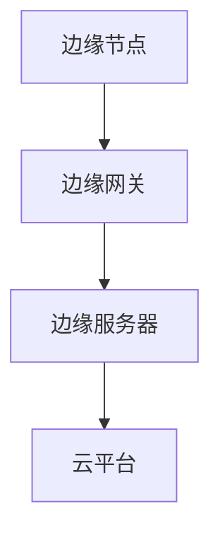

                 

关键词：边缘计算、IoT平台、物联网、创新、基础设施

> 摘要：随着物联网（IoT）技术的快速发展，边缘计算作为其核心组成部分，正逐渐成为推动物联网创新的重要基础设施。本文旨在深入探讨边缘计算在物联网中的关键作用、核心概念、算法原理及其在实际应用中的挑战与前景。

## 1. 背景介绍

物联网（IoT）是一个通过将物理设备、传感器、软件应用等进行互联，实现信息智能化处理与自动化的技术体系。随着物联网设备的激增，如何高效地处理海量数据成为了一个亟待解决的问题。传统云计算由于在处理大量实时数据时存在延迟、带宽不足和安全性等问题，难以满足物联网的实时性和低延迟要求。因此，边缘计算应运而生，成为物联网创新的关键基础设施。

边缘计算是指在靠近数据源或用户的一侧，通过分布式计算、存储和网络技术，实现数据的局部处理和智能决策。它不仅能够减轻云端负担，提高数据处理效率，还能增强系统的实时响应能力和安全性。

## 2. 核心概念与联系

### 2.1 边缘计算与云计算的关系

边缘计算与云计算是相辅相成的两种计算模式。云计算以其强大的计算能力和存储能力，为物联网应用提供海量数据处理的支持；而边缘计算则以其低延迟、高带宽和实时处理能力，满足物联网设备的即时响应需求。

### 2.2 物联网平台与边缘计算

物联网平台是连接设备和云端的桥梁，通过边缘计算，物联网平台能够实现设备与云端的协同工作，实现数据的采集、处理、存储和共享。

### 2.3 边缘计算架构

边缘计算架构主要包括边缘节点、边缘网关、边缘服务器和云平台。边缘节点负责数据的采集和初步处理；边缘网关负责边缘节点与云平台的数据传输；边缘服务器承担复杂的计算任务；云平台则为边缘计算提供强大的后端支持。



## 3. 核心算法原理 & 具体操作步骤

### 3.1 算法原理概述

边缘计算的核心在于如何高效地处理和利用实时数据。其基本原理包括数据的局部处理、智能分析和决策。

### 3.2 算法步骤详解

1. **数据采集与预处理**：边缘节点通过传感器和设备采集数据，对数据进行初步清洗和格式化。
2. **数据传输**：将预处理后的数据通过边缘网关传输到边缘服务器。
3. **数据存储**：边缘服务器对数据进行存储和管理。
4. **数据分析与决策**：利用机器学习、数据挖掘等技术对数据进行处理，实现智能分析和决策。

### 3.3 算法优缺点

**优点**：低延迟、高带宽、实时性强、安全性高。

**缺点**：计算能力有限、存储空间有限、网络带宽受限。

### 3.4 算法应用领域

边缘计算广泛应用于智能家居、智能交通、智能医疗、工业物联网等领域。

## 4. 数学模型和公式 & 详细讲解 & 举例说明

### 4.1 数学模型构建

边缘计算中的数学模型主要包括数据采集模型、数据处理模型和决策模型。

### 4.2 公式推导过程

$$
Y = f(X, \theta)
$$

其中，$X$ 表示输入数据，$Y$ 表示输出结果，$f$ 表示数据处理函数，$\theta$ 表示参数。

### 4.3 案例分析与讲解

以智能家居为例，通过边缘计算平台实现室内温度的实时监测和调节。温度采集模型为：

$$
T = T_{\text{当前}} - T_{\text{参考}}
$$

其中，$T_{\text{当前}}$ 表示实时温度，$T_{\text{参考}}$ 表示设定温度。

数据处理模型为：

$$
T_{\text{调节}} = \begin{cases}
T_{\text{当前}} & \text{如果} T < 0 \\
T_{\text{当前}} + \Delta T & \text{如果} T \geq 0
\end{cases}
$$

其中，$\Delta T$ 表示调节温度。

## 5. 项目实践：代码实例和详细解释说明

### 5.1 开发环境搭建

- 操作系统：Linux
- 编程语言：Python
- 边缘计算框架：边缘网关（MQTT）、边缘服务器（Flask）

### 5.2 源代码详细实现

边缘网关代码示例：

```python
import paho.mqtt.client as mqtt

def on_connect(client, userdata, flags, rc):
    print("Connected with result code "+str(rc))
    client.subscribe("sensor/temperature")

def on_message(client, userdata, msg):
    print(msg.topic+" "+str(msg.payload))
    process_temperature(msg.payload)

client = mqtt.Client()
client.on_connect = on_connect
client.on_message = on_message

client.connect("localhost", 1883, 60)

client.loop_forever()

def process_temperature(data):
    current_temp = int(data)
    if current_temp < 22:
        print("温度过低，请增加暖气。")
    else:
        print("温度适宜。")
```

边缘服务器代码示例：

```python
from flask import Flask, request, jsonify

app = Flask(__name__)

@app.route('/api/temperature', methods=['POST'])
def update_temperature():
    data = request.json
    current_temp = data['temperature']
    if current_temp < 22:
        print("温度过低，请增加暖气。")
    else:
        print("温度适宜。")
    return jsonify({"status": "success"})

if __name__ == '__main__':
    app.run(host='0.0.0.0', port=5000)
```

### 5.3 代码解读与分析

边缘网关代码通过 MQTT 协议连接到边缘服务器，订阅温度传感器数据。当接收到温度数据后，调用 `process_temperature` 函数进行数据处理。

边缘服务器代码通过 Flask 框架实现 RESTful API，接收边缘网关发送的 POST 请求，解析温度数据并进行处理。

### 5.4 运行结果展示

当温度传感器发送温度数据时，边缘网关和边缘服务器会实时响应，根据温度数据进行调节和反馈。

## 6. 实际应用场景

### 6.1 智能家居

智能家居通过边缘计算实现室内环境的实时监测和调节，提高居住舒适度。

### 6.2 智能交通

智能交通系统利用边缘计算实现交通流量的实时监测和调节，提高道路通行效率。

### 6.3 智能医疗

智能医疗通过边缘计算实现医疗设备的实时监测和数据采集，提高医疗服务的质量和效率。

## 7. 工具和资源推荐

### 7.1 学习资源推荐

- 《边缘计算：从概念到实践》
- 《物联网技术与应用》
- 《深度学习与边缘计算》

### 7.2 开发工具推荐

- MQTT 框架：Paho MQTT
- Flask Web 框架：Flask
- Python 编程语言：Python

### 7.3 相关论文推荐

- "Edge Computing: Vision and Challenges"
- "A Comprehensive Study of Edge Computing: Architecture, Applications, and Emerging Trends"
- "IoT in 5G: Evolution, Enablers, and Challenges"

## 8. 总结：未来发展趋势与挑战

### 8.1 研究成果总结

边缘计算在物联网领域取得了显著的成果，为实时数据处理和智能决策提供了有力支持。

### 8.2 未来发展趋势

随着 5G、人工智能等技术的不断发展，边缘计算将在物联网、自动驾驶、智能制造等领域发挥更加重要的作用。

### 8.3 面临的挑战

边缘计算在计算能力、存储空间、网络安全等方面仍面临诸多挑战。

### 8.4 研究展望

未来边缘计算的研究将主要集中在提高计算效率、增强安全性、优化网络架构等方面。

## 9. 附录：常见问题与解答

### 9.1 边缘计算与云计算的区别是什么？

边缘计算与云计算的区别在于数据处理的位置。边缘计算在靠近数据源或用户的一侧进行数据处理，而云计算则在远程数据中心进行数据处理。

### 9.2 边缘计算有哪些应用领域？

边缘计算广泛应用于智能家居、智能交通、智能医疗、工业物联网等领域。

### 9.3 如何搭建一个简单的边缘计算平台？

搭建一个简单的边缘计算平台需要以下步骤：

1. 选择合适的边缘计算框架和编程语言。
2. 构建边缘节点和边缘服务器。
3. 实现数据采集、处理和传输功能。
4. 进行调试和优化。

# 附录：常见问题与解答

### 9.1 边缘计算与云计算的区别是什么？

边缘计算与云计算在数据处理的位置、应用场景、性能特点等方面存在明显差异。

- **数据处理位置**：边缘计算在靠近数据源或用户的一侧进行数据处理，而云计算则在远程数据中心进行数据处理。
- **应用场景**：边缘计算适用于实时性要求高、数据量较小的应用场景，如智能家居、智能交通等；云计算则适用于大数据处理、云计算服务等场景。
- **性能特点**：边缘计算具有低延迟、高带宽、实时性强的特点；云计算则具有高计算能力、海量存储、高可靠性的特点。

### 9.2 边缘计算有哪些应用领域？

边缘计算在多个领域具有广泛的应用，以下是一些主要的应用领域：

- **智能家居**：通过边缘计算实现室内环境的实时监测和调节，提高居住舒适度。
- **智能交通**：利用边缘计算实现交通流量的实时监测和调节，提高道路通行效率。
- **智能医疗**：通过边缘计算实现医疗设备的实时监测和数据采集，提高医疗服务的质量和效率。
- **工业物联网**：在工业生产过程中，边缘计算能够实现设备的实时监控、故障预测和优化控制。
- **智能城市**：边缘计算为智能城市建设提供数据采集、处理和分析支持，助力智慧城市建设。

### 9.3 如何搭建一个简单的边缘计算平台？

搭建一个简单的边缘计算平台通常需要以下步骤：

1. **选择合适的技术栈**：根据应用需求，选择合适的边缘计算框架、编程语言和开发工具。
2. **构建边缘节点**：边缘节点通常包括传感器、数据采集设备等，负责数据的采集和初步处理。
3. **搭建边缘网关**：边缘网关负责边缘节点与云平台的通信，实现数据的传输和协议转换。
4. **构建边缘服务器**：边缘服务器承担复杂的计算任务，如数据处理、智能分析和决策等。
5. **配置网络环境**：确保边缘计算平台与云端和其他边缘节点之间的网络连接畅通。
6. **开发应用功能**：根据应用需求，开发相应的功能模块，如数据采集、处理、存储、监控等。
7. **调试和优化**：对边缘计算平台进行调试和优化，确保其稳定运行和高效性能。

在实际开发过程中，可能还需要考虑以下几个方面：

- **安全性**：确保边缘计算平台的数据安全和系统安全，采取相应的安全措施。
- **可扩展性**：设计可扩展的系统架构，以适应未来业务需求的增长。
- **兼容性**：确保边缘计算平台能够与其他系统和设备进行无缝集成和协同工作。
- **用户体验**：优化用户界面和交互设计，提高用户体验。

通过以上步骤，可以搭建一个简单的边缘计算平台，满足特定的应用需求。随着技术的发展和需求的不断变化，边缘计算平台的设计和实现也将不断演进。

