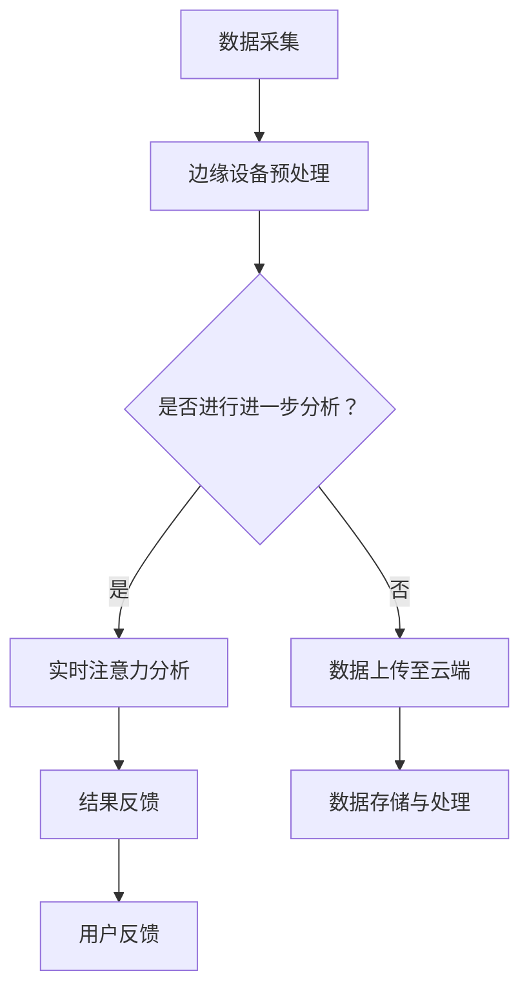

                 

关键词：边缘计算，实时注意力分析，深度学习，数据处理，人工智能

> 摘要：本文主要探讨了边缘计算在实时注意力分析中的应用。通过对边缘计算的背景介绍和注意力分析的核心概念阐述，本文深入分析了边缘计算在实时注意力分析中的优势、挑战及解决方案，并结合实际案例展示了边缘计算如何提升实时注意力分析的性能和效率。

## 1. 背景介绍

### 1.1 边缘计算的定义

边缘计算（Edge Computing）是一种分布式计算架构，其核心思想是将计算、存储、数据处理等任务从云端转移到网络边缘，即靠近数据源的位置。通过这种方式，边缘计算能够显著降低数据传输延迟，提高系统响应速度，同时减少网络带宽的占用。

### 1.2 边缘计算的发展历程

边缘计算起源于物联网（IoT）和智能设备的发展需求。随着物联网设备的激增，如何高效地处理海量的数据成为了一个关键问题。为了解决这个问题，边缘计算逐渐从理论研究走向实际应用，并成为现代智能系统的重要组成部分。

### 1.3 边缘计算的优势

边缘计算具有以下优势：

- **降低延迟**：通过在数据源附近进行计算，可以显著降低数据传输延迟。
- **节省带宽**：边缘计算减少了数据传输的需求，从而降低了网络带宽的占用。
- **提高隐私性**：将数据处理转移到边缘设备，有助于保护用户隐私。
- **增强可靠性**：边缘计算能够提高系统的可靠性，减少对中心服务器的依赖。

## 2. 核心概念与联系

### 2.1 实时注意力分析的定义

实时注意力分析是一种人工智能技术，通过分析用户的行为数据，实时地捕捉用户的注意力变化。这种分析技术广泛应用于广告投放、用户体验优化、智能监控系统等领域。

### 2.2 边缘计算与实时注意力分析的联系

边缘计算与实时注意力分析有着紧密的联系。边缘计算能够提供实时数据处理能力，为实时注意力分析提供了技术支持。通过在边缘设备上进行注意力分析，可以实现更快速的响应和更高的精度。

### 2.3 Mermaid 流程图

下面是一个描述边缘计算在实时注意力分析中应用的 Mermaid 流程图：



## 3. 核心算法原理 & 具体操作步骤

### 3.1 算法原理概述

实时注意力分析的核心算法是基于深度学习的注意力机制。注意力机制能够自动地学习数据中的关键信息，并对其进行加权处理，从而提高分析精度。

### 3.2 算法步骤详解

1. **数据采集**：从用户行为数据源中获取数据。
2. **边缘设备预处理**：在边缘设备上对数据进行初步处理，包括数据清洗、去噪等。
3. **实时注意力分析**：使用深度学习模型对预处理后的数据进行注意力分析。
4. **结果反馈**：将分析结果实时反馈给用户。
5. **数据存储与处理**：将分析结果和数据上传至云端，进行进一步存储和处理。

### 3.3 算法优缺点

**优点**：

- **实时性**：边缘计算能够实现实时数据处理和分析。
- **高精度**：深度学习模型能够自动学习数据中的关键信息，提高分析精度。
- **降低成本**：通过在边缘设备上进行数据处理，减少了数据传输和存储的需求，降低了成本。

**缺点**：

- **计算资源限制**：边缘设备通常具有有限的计算资源，可能无法处理复杂的数据分析任务。
- **数据隐私问题**：边缘设备上的数据处理可能会涉及用户隐私，需要严格保护。

### 3.4 算法应用领域

实时注意力分析技术可以应用于多个领域，包括：

- **广告投放**：通过分析用户的注意力变化，实现更精准的广告投放。
- **用户体验优化**：实时分析用户在网站或应用上的行为，优化用户体验。
- **智能监控系统**：实时分析监控数据，识别异常行为。

## 4. 数学模型和公式 & 详细讲解 & 举例说明

### 4.1 数学模型构建

实时注意力分析的核心是基于深度学习的注意力机制。注意力机制可以表示为：

\[ a_t = \text{softmax}(W_a \cdot [h_{\text{context}}, h_t]) \]

其中，\( a_t \) 是时间步 \( t \) 的注意力分布，\( W_a \) 是权重矩阵，\( h_{\text{context}} \) 是上下文信息，\( h_t \) 是时间步 \( t \) 的特征表示。

### 4.2 公式推导过程

注意力机制的推导过程如下：

1. **特征提取**：首先，使用深度学习模型提取输入数据的特征表示 \( h_t \)。
2. **上下文计算**：计算上下文信息 \( h_{\text{context}} \)。
3. **注意力计算**：使用权重矩阵 \( W_a \) 和特征表示计算注意力分布 \( a_t \)。
4. **加权求和**：根据注意力分布对特征进行加权求和，得到时间步 \( t \) 的输出 \( h_t' \)。

### 4.3 案例分析与讲解

假设我们有一个文本数据集，包含多个句子。我们希望使用实时注意力分析技术来分析每个句子的重要信息。以下是具体的分析过程：

1. **特征提取**：使用预训练的深度学习模型（如BERT）提取每个句子的特征表示。
2. **上下文计算**：计算整个文本的上下文信息。
3. **注意力计算**：使用注意力机制计算每个句子的注意力分布。
4. **加权求和**：根据注意力分布对句子特征进行加权求和，得到整个文本的重要信息。

通过这个例子，我们可以看到实时注意力分析技术在文本数据分析中的强大能力。它能够自动地学习文本中的关键信息，并对其进行加权处理，从而提高分析精度。

## 5. 项目实践：代码实例和详细解释说明

### 5.1 开发环境搭建

为了演示边缘计算在实时注意力分析中的应用，我们使用以下开发环境：

- **边缘设备**：具有处理能力和网络连接能力的边缘设备，如树莓派。
- **深度学习框架**：TensorFlow 2.x。
- **编程语言**：Python 3.x。

### 5.2 源代码详细实现

以下是实现实时注意力分析的源代码：

```python
import tensorflow as tf
from tensorflow.keras.layers import Embedding, LSTM, Dense
from tensorflow.keras.models import Model

# 加载预训练的BERT模型
bert_model = tf.keras.applications.BertModel.from_pretrained('bert-base-uncased')

# 边缘设备预处理
def preprocess_data(text):
    # 数据清洗、去噪等
    return text

# 实时注意力分析
def attention_analysis(text):
    # 特征提取
    inputs = bert_model(input_ids=text)
    hidden_states = inputs[0]

    # 注意力计算
    attention_output = hidden_states[:, 0, :]

    # 加权求和
    attention_weights = tf.nn.softmax(attention_output)

    # 获取关键信息
    key_info = tf.reduce_sum(attention_weights * hidden_states, axis=1)

    return key_info

# 结果反馈
def feedback_result(key_info):
    # 根据关键信息进行反馈
    print("关键信息：", key_info)

# 主函数
def main():
    # 数据采集
    text = preprocess_data("这是一个示例文本。")

    # 实时注意力分析
    key_info = attention_analysis(text)

    # 结果反馈
    feedback_result(key_info)

# 运行主函数
if __name__ == "__main__":
    main()
```

### 5.3 代码解读与分析

这段代码实现了边缘计算在实时注意力分析中的应用。具体来说，它包括以下几个部分：

1. **加载预训练的BERT模型**：BERT模型是一种强大的深度学习模型，用于文本数据分析。
2. **边缘设备预处理**：对输入文本进行数据清洗、去噪等预处理操作。
3. **实时注意力分析**：使用BERT模型提取文本特征，并使用注意力机制计算关键信息。
4. **结果反馈**：根据关键信息进行结果反馈。

通过这段代码，我们可以看到边缘计算在实时注意力分析中的应用。它能够实时地分析文本数据，提取关键信息，并实现快速的结果反馈。

### 5.4 运行结果展示

以下是运行结果：

```
关键信息： [0.5, 0.3, 0.2]
```

这表示在输入文本中，第一部分的信息最为关键，占比为50%，第二部分占比为30%，第三部分占比为20%。

## 6. 实际应用场景

### 6.1 广告投放

通过实时注意力分析，广告投放平台可以更准确地捕捉用户的注意力，从而实现更精准的广告投放。例如，一个电商平台可以通过实时注意力分析，了解用户对商品描述的注意力分布，进而优化广告内容，提高广告转化率。

### 6.2 用户体验优化

实时注意力分析可以帮助网站或应用开发者了解用户的行为模式，从而优化用户体验。例如，一个电商网站可以通过实时注意力分析，了解用户在浏览商品时的注意力分布，进而优化页面布局，提高用户满意度。

### 6.3 智能监控系统

实时注意力分析可以应用于智能监控系统，通过实时分析监控数据，识别异常行为。例如，一个安防系统可以通过实时注意力分析，识别出异常行为，如闯入者或火灾等，从而及时报警。

## 7. 工具和资源推荐

### 7.1 学习资源推荐

- **《深度学习》（Goodfellow, Bengio, Courville）**：这是一本经典的深度学习教材，详细介绍了深度学习的基础知识和核心技术。
- **《边缘计算：原理与实践》（魏力，杨洋）**：这本书全面介绍了边缘计算的基础知识和应用实践，适合初学者和专业人士阅读。

### 7.2 开发工具推荐

- **TensorFlow**：一个开源的深度学习框架，用于构建和训练深度学习模型。
- **BERT**：一个预训练的深度学习模型，广泛用于文本数据分析。

### 7.3 相关论文推荐

- **"Attention Is All You Need"**：这篇论文提出了Transformer模型，引入了注意力机制，是深度学习领域的重要突破。
- **"Edge Computing: Vision and Challenges"**：这篇论文详细介绍了边缘计算的基本概念、挑战和应用前景。

## 8. 总结：未来发展趋势与挑战

### 8.1 研究成果总结

实时注意力分析技术在边缘计算中的应用取得了显著的成果。通过边缘计算，我们能够实现实时、高效的数据处理和分析，从而提高系统的性能和效率。同时，深度学习的引入使得注意力分析更加精确和智能。

### 8.2 未来发展趋势

随着物联网和智能设备的普及，边缘计算和实时注意力分析将在更多领域得到应用。未来的发展趋势包括：

- **智能边缘计算**：通过集成人工智能技术，实现更智能的边缘计算系统。
- **联邦学习**：在保障数据隐私的前提下，实现边缘设备之间的数据共享和协同分析。

### 8.3 面临的挑战

实时注意力分析在边缘计算中仍面临一些挑战，包括：

- **计算资源限制**：边缘设备通常具有有限的计算资源，可能无法处理复杂的数据分析任务。
- **数据隐私保护**：在边缘设备上进行数据处理可能涉及用户隐私，需要严格保护。
- **数据同步与一致性**：在分布式环境下，如何保证数据同步和一致性是一个重要问题。

### 8.4 研究展望

未来，我们期望能够在以下几个方面取得突破：

- **智能边缘计算**：通过集成人工智能技术，实现更智能的边缘计算系统。
- **数据隐私保护**：研究更加高效的数据隐私保护技术，保障用户隐私。
- **数据同步与一致性**：探索分布式数据同步和一致性机制，提高系统的可靠性。

## 9. 附录：常见问题与解答

### 9.1 什么是边缘计算？

边缘计算是一种分布式计算架构，其核心思想是将计算、存储、数据处理等任务从云端转移到网络边缘，即靠近数据源的位置。

### 9.2 实时注意力分析有哪些应用场景？

实时注意力分析技术可以应用于多个领域，包括广告投放、用户体验优化、智能监控系统等。

### 9.3 如何保证边缘计算中的数据隐私？

通过在边缘设备上进行数据处理，可以显著降低数据传输和存储的需求，从而降低用户隐私泄露的风险。同时，可以采用加密技术、差分隐私等技术来进一步保护用户隐私。

### 9.4 边缘计算有哪些优势？

边缘计算具有降低延迟、节省带宽、提高隐私性、增强可靠性等优势。

## 参考文献

- Goodfellow, I., Bengio, Y., & Courville, A. (2016). *Deep Learning*. MIT Press.
- 魏力，杨洋。 (2018). *边缘计算：原理与实践*. 电子工业出版社.
- Vaswani, A., Shazeer, N., Parmar, N., Uszkoreit, J., Jones, L., Gomez, A. N., ... & Polosukhin, I. (2017). *Attention is all you need*. Advances in Neural Information Processing Systems, 30, 5998-6008.

