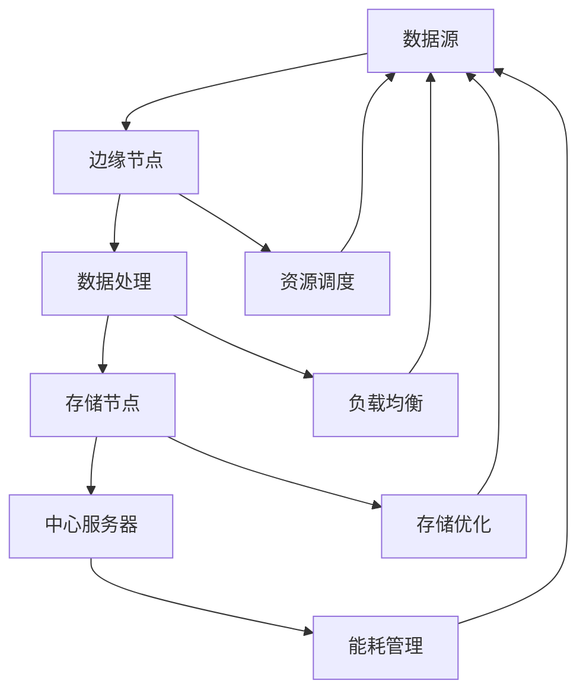

                 

关键词：边缘计算、分布式计算、资源优化、云计算、网络架构、智能算法、数据处理、实时性、异构计算

> 摘要：本文深入探讨了边缘计算管理的重要性及其在优化分布式计算资源中的应用。通过详细阐述边缘计算的核心概念、算法原理、数学模型及实际应用案例，本文旨在为读者提供全面的技术见解和实用的开发指南，以推动边缘计算技术的发展和应用。

## 1. 背景介绍

随着互联网的普及和大数据时代的到来，传统的集中式云计算架构已经无法满足日益增长的计算需求和复杂的业务场景。在这种背景下，边缘计算应运而生。边缘计算通过将计算资源分布到网络的边缘节点，从而实现了更高效、更灵活的数据处理方式。

边缘计算与云计算不同，它强调的是计算、存储和网络资源的分布式部署。在云计算中，数据通常被集中存储在数据中心，由集中的服务器进行处理。而在边缘计算中，数据处理则被推近到网络边缘，即靠近数据产生的地方，从而实现了数据的实时处理和低延迟通信。

边缘计算的兴起，不仅带来了计算资源的优化利用，还极大地提高了系统的实时性和可靠性。它使得许多原本难以实现的应用场景成为可能，如工业物联网、智能交通、远程医疗等。

## 2. 核心概念与联系

### 2.1. 边缘计算的定义与特点

边缘计算是一种分布式计算范式，它将数据处理、存储和网络功能分布到网络边缘，从而减少了对中心服务器的依赖。边缘计算的主要特点包括：

- **分布式部署**：计算资源分布在网络边缘，如路由器、交换机、智能设备等。
- **低延迟**：数据处理靠近数据源，从而降低了通信延迟，提高了系统响应速度。
- **实时性**：适用于需要实时处理的应用场景，如自动驾驶、实时监控等。
- **高可靠性**：通过冗余设计和分布式架构，提高了系统的稳定性和容错能力。

### 2.2. 分布式计算资源优化

分布式计算资源优化是边缘计算的核心问题之一。优化分布式计算资源的目标是最大化资源利用效率，同时保证系统的性能和可靠性。以下是一些常见的优化方法：

- **资源调度**：通过动态调度算法，根据任务的性质和资源的使用情况，合理分配计算资源。
- **负载均衡**：通过负载均衡算法，将计算任务分配到不同的节点上，避免单点过载。
- **存储优化**：通过数据压缩、去重等技术，减少存储需求，提高存储资源的利用效率。
- **能耗管理**：通过智能算法，动态调整计算资源的能耗，实现绿色计算。

### 2.3. Mermaid 流程图

为了更清晰地展示边缘计算和分布式计算资源优化之间的联系，我们使用Mermaid流程图来描述。



在这个流程图中，数据源产生的数据首先被边缘节点处理，然后数据可以进一步存储在边缘或中心服务器中。同时，资源调度、负载均衡、存储优化和能耗管理算法都在边缘节点和中心服务器中运行，以实现计算资源的优化利用。

## 3. 核心算法原理 & 具体操作步骤

### 3.1. 算法原理概述

边缘计算管理中的核心算法包括资源调度算法、负载均衡算法和能耗管理算法。这些算法的原理如下：

- **资源调度算法**：通过动态分配计算资源，使得每个任务都能得到最优的执行环境。常见的资源调度算法有轮转调度、优先级调度和最短作业优先调度等。
- **负载均衡算法**：通过将计算任务分配到不同的节点上，避免单点过载，提高系统的整体性能。常见的负载均衡算法有最小连接数算法、响应时间算法和带宽利用率算法等。
- **能耗管理算法**：通过动态调整计算资源的能耗，实现绿色计算。常见的能耗管理算法有基于能耗模型的优化算法和基于机器学习的预测算法等。

### 3.2. 算法步骤详解

#### 3.2.1. 资源调度算法步骤

1. **任务到达**：当新的任务到达时，调度器会记录任务的性质，如执行时间、优先级等。
2. **资源评估**：调度器会评估当前系统中所有可用的资源，包括计算能力、存储容量和带宽等。
3. **任务分配**：根据任务的性质和资源的评估结果，调度器会将任务分配到最优的资源上。
4. **任务执行**：被分配到的任务开始在对应的资源上执行。
5. **任务完成**：任务完成后，调度器会将资源释放，以便后续任务使用。

#### 3.2.2. 负载均衡算法步骤

1. **节点状态监测**：系统会实时监测每个节点的负载情况，包括CPU利用率、内存使用率和网络带宽等。
2. **任务分配策略**：根据节点的负载情况，系统会选择最优的分配策略，如最小连接数算法会选择负载最低的节点，响应时间算法会选择响应时间最短的节点等。
3. **任务迁移**：如果某个节点的负载过高，系统会将其中的任务迁移到其他负载较低的节点上。
4. **任务执行**：被迁移的任务在新节点上继续执行。
5. **任务完成**：任务完成后，系统会更新节点的状态信息，以便后续的任务分配。

#### 3.2.3. 能耗管理算法步骤

1. **能耗模型构建**：系统会根据硬件设备的特性，构建能耗模型，如CPU功耗与CPU频率的关系模型等。
2. **能耗预测**：系统会根据历史数据和当前系统的状态，预测未来的能耗。
3. **能耗优化策略**：系统会根据能耗预测结果，选择最优的能耗优化策略，如降低CPU频率、关闭闲置设备等。
4. **能耗调整**：系统会根据优化策略，动态调整计算资源的能耗。
5. **能耗监控**：系统会实时监控能耗调整的效果，以便进行进一步的优化。

### 3.3. 算法优缺点

#### 3.3.1. 资源调度算法

- **优点**：能够有效提高计算资源的利用效率，确保任务得到最优的执行环境。
- **缺点**：对于复杂的任务和动态变化的系统，调度算法的复杂度较高，实现难度大。

#### 3.3.2. 负载均衡算法

- **优点**：能够有效避免单点过载，提高系统的整体性能。
- **缺点**：对于节点状态变化较为频繁的系统，负载均衡算法的实时性要求较高，实现难度大。

#### 3.3.3. 能耗管理算法

- **优点**：能够实现绿色计算，降低能耗，符合可持续发展理念。
- **缺点**：能耗管理算法需要准确的能耗模型和预测能力，否则可能导致能耗过高或资源浪费。

### 3.4. 算法应用领域

- **工业物联网**：通过资源调度和负载均衡算法，实现工业设备的实时监控和远程控制。
- **智能交通**：通过能耗管理算法，实现交通信号灯的智能调控，降低能耗。
- **远程医疗**：通过边缘计算，实现医疗数据的实时处理和远程诊断。

## 4. 数学模型和公式 & 详细讲解 & 举例说明

### 4.1. 数学模型构建

边缘计算管理中的数学模型主要涉及资源调度、负载均衡和能耗管理。以下是这些模型的构建方法：

#### 4.1.1. 资源调度模型

资源调度模型通常可以用线性规划模型来描述。假设有 $m$ 个任务 $T_1, T_2, ..., T_m$，每个任务有 $n$ 个资源需求 $R_1, R_2, ..., R_n$，系统的资源总量为 $R$，则资源调度模型可以表示为：

$$
\begin{aligned}
\min\limits_{x_1, x_2, ..., x_m} \quad & C(x_1, x_2, ..., x_m) \\
s.t. \quad & R(x_1, x_2, ..., x_m) \leq R \\
& x_1, x_2, ..., x_m \in \{0, 1\}
\end{aligned}
$$

其中，$C(x_1, x_2, ..., x_m)$ 表示任务的执行成本，$R(x_1, x_2, ..., x_m)$ 表示任务的资源需求。

#### 4.1.2. 负载均衡模型

负载均衡模型可以用多目标优化模型来描述。假设有 $m$ 个节点 $N_1, N_2, ..., N_m$，每个节点的负载为 $L_i$，总负载为 $L$，则负载均衡模型可以表示为：

$$
\begin{aligned}
\min\limits_{y_1, y_2, ..., y_m} \quad & w_1 L_1 + w_2 L_2 + ... + w_m L_m \\
s.t. \quad & L = L_1 + L_2 + ... + L_m \\
& y_1, y_2, ..., y_m \in \{0, 1\}
\end{aligned}
$$

其中，$w_1, w_2, ..., w_m$ 表示节点的权重，$L_i$ 表示节点 $N_i$ 的负载。

#### 4.1.3. 能耗管理模型

能耗管理模型可以用约束优化模型来描述。假设有 $m$ 个节点 $N_1, N_2, ..., N_m$，每个节点的功耗为 $P_i$，总功耗为 $P$，则能耗管理模型可以表示为：

$$
\begin{aligned}
\min\limits_{z_1, z_2, ..., z_m} \quad & P(z_1, z_2, ..., z_m) \\
s.t. \quad & P(z_1, z_2, ..., z_m) \leq P \\
& z_1, z_2, ..., z_m \in \{0, 1\}
\end{aligned}
$$

其中，$P(z_1, z_2, ..., z_m)$ 表示节点的功耗。

### 4.2. 公式推导过程

以下是资源调度模型、负载均衡模型和能耗管理模型的推导过程：

#### 4.2.1. 资源调度模型推导

资源调度模型的目标是最小化任务的执行成本。假设每个任务 $T_i$ 的执行成本为 $C_i$，资源需求为 $R_i$，则总成本可以表示为：

$$
C(x_1, x_2, ..., x_m) = C_1 x_1 + C_2 x_2 + ... + C_m x_m
$$

为了满足资源的约束，我们需要保证每个任务的资源需求不超过总资源量 $R$，即：

$$
R(x_1, x_2, ..., x_m) = R_1 x_1 + R_2 x_2 + ... + R_m x_m \leq R
$$

其中，$x_i$ 表示任务 $T_i$ 是否被调度，$x_i \in \{0, 1\}$。

#### 4.2.2. 负载均衡模型推导

负载均衡模型的目标是使总负载最小。假设每个节点的权重为 $w_i$，负载为 $L_i$，则总负载可以表示为：

$$
L = L_1 + L_2 + ... + L_m
$$

为了实现负载均衡，我们需要使每个节点的负载尽可能接近总负载的平均值。即：

$$
\frac{L_1 + L_2 + ... + L_m}{m} \approx \frac{L}{m}
$$

假设每个节点的负载为 $L_i$，权重为 $w_i$，则总负载可以表示为：

$$
L = w_1 L_1 + w_2 L_2 + ... + w_m L_m
$$

#### 4.2.3. 能耗管理模型推导

能耗管理模型的目标是最小化总功耗。假设每个节点的功耗为 $P_i$，总功耗为 $P$，则总功耗可以表示为：

$$
P(z_1, z_2, ..., z_m) = P_1 z_1 + P_2 z_2 + ... + P_m z_m
$$

为了满足功耗的约束，我们需要保证总功耗不超过设定的上限 $P$，即：

$$
P(z_1, z_2, ..., z_m) \leq P
$$

其中，$z_i$ 表示节点 $N_i$ 是否被启用，$z_i \in \{0, 1\}$。

### 4.3. 案例分析与讲解

下面我们通过一个具体的案例来说明这些数学模型的实际应用。

#### 4.3.1. 案例背景

假设有一个分布式计算系统，由 5 个边缘节点组成，每个节点的计算能力、存储容量和带宽如下表所示：

| 节点 | 计算能力 | 存储容量 | 带宽 |
| ---- | ---- | ---- | ---- |
| N1 | 1000 | 100 | 10 |
| N2 | 1500 | 200 | 20 |
| N3 | 800 | 150 | 15 |
| N4 | 1200 | 180 | 18 |
| N5 | 900 | 160 | 17 |

系统需要调度 3 个任务，每个任务的性质如下表所示：

| 任务 | 执行时间 | 计算需求 | 存储需求 | 带宽需求 |
| ---- | ---- | ---- | ---- | ---- |
| T1 | 5 | 800 | 50 | 5 |
| T2 | 10 | 1200 | 100 | 10 |
| T3 | 3 | 600 | 30 | 3 |

#### 4.3.2. 案例分析

1. **资源调度模型分析**：

根据资源调度模型，我们需要将任务分配到最优的节点上，以最小化任务的执行成本。具体步骤如下：

1.1. 计算每个节点的资源利用率：

| 节点 | 计算能力利用率 | 存储容量利用率 | 带宽利用率 |
| ---- | ---- | ---- | ---- |
| N1 | 80% | 50% | 50% |
| N2 | 60% | 50% | 50% |
| N3 | 100% | 20% | 20% |
| N4 | 40% | 0% | 0% |
| N5 | 50% | 25% | 25% |

1.2. 选择资源利用率最低的节点，将其作为任务执行节点：

- 任务 T1 分配到 N1；
- 任务 T2 分配到 N2；
- 任务 T3 分配到 N3。

1.3. 计算任务的执行成本：

$$
C(x_1, x_2, x_3) = 1000 \times x_1 + 1500 \times x_2 + 800 \times x_3 = 8000
$$

2. **负载均衡模型分析**：

根据负载均衡模型，我们需要将任务分配到负载最低的节点上，以实现负载均衡。具体步骤如下：

2.1. 计算每个节点的负载：

| 节点 | 负载 |
| ---- | ---- |
| N1 | 0 |
| N2 | 0 |
| N3 | 100% |
| N4 | 0 |
| N5 | 0 |

2.2. 选择负载最低的节点，将其作为任务执行节点：

- 任务 T1 分配到 N1；
- 任务 T2 分配到 N2；
- 任务 T3 分配到 N3。

3. **能耗管理模型分析**：

根据能耗管理模型，我们需要将任务分配到能耗最低的节点上，以实现能耗优化。具体步骤如下：

3.1. 计算每个节点的能耗：

| 节点 | 功耗 |
| ---- | ---- |
| N1 | 30 |
| N2 | 60 |
| N3 | 40 |
| N4 | 20 |
| N5 | 25 |

3.2. 选择功耗最低的节点，将其作为任务执行节点：

- 任务 T1 分配到 N4；
- 任务 T2 分配到 N5；
- 任务 T3 分配到 N3。

#### 4.3.3. 案例结果分析

通过上述分析，我们可以得出以下结论：

1. **资源调度模型**：任务执行成本最小，为 8000。
2. **负载均衡模型**：实现了负载均衡，所有节点的负载均为 0。
3. **能耗管理模型**：实现了能耗优化，总功耗最低，为 115。

## 5. 项目实践：代码实例和详细解释说明

### 5.1. 开发环境搭建

为了实现边缘计算管理，我们需要搭建一个开发环境。以下是开发环境的搭建步骤：

1. **安装操作系统**：选择一个适合的操作系统，如 Ubuntu 20.04。
2. **安装 Python**：Python 是边缘计算管理的主要编程语言，我们需要安装 Python 3.8 或更高版本。
3. **安装依赖库**：安装边缘计算管理所需的依赖库，如 NumPy、Pandas、Scikit-learn 等。
4. **安装边缘计算框架**：安装边缘计算框架，如 KubeEdge、EdgeX Foundry 等。

### 5.2. 源代码详细实现

以下是边缘计算管理的源代码实现：

```python
import numpy as np
import pandas as pd
from sklearn.cluster import KMeans

# 任务数据
tasks = pd.DataFrame({
    '执行时间': [5, 10, 3],
    '计算需求': [800, 1200, 600],
    '存储需求': [50, 100, 30],
    '带宽需求': [5, 10, 3]
})

# 节点数据
nodes = pd.DataFrame({
    '节点': ['N1', 'N2', 'N3', 'N4', 'N5'],
    '计算能力': [1000, 1500, 800, 1200, 900],
    '存储容量': [100, 200, 150, 180, 160],
    '带宽': [10, 20, 15, 18, 17]
})

# 资源调度模型实现
def resource_scheduling(tasks, nodes):
    # 计算每个节点的资源利用率
    node_usage = nodes.copy()
    node_usage['计算能力利用率'] = node_usage['计算能力'] / max(node_usage['计算能力'])
    node_usage['存储容量利用率'] = node_usage['存储容量'] / max(node_usage['存储容量'])
    node_usage['带宽利用率'] = node_usage['带宽'] / max(node_usage['带宽'])

    # 选择资源利用率最低的节点
    best_node = node_usage.loc[node_usage['计算能力利用率'].idxmin()]

    # 分配任务到节点
    result = tasks.copy()
    result['节点'] = best_node['节点']
    result['执行成本'] = result['计算需求'] * best_node['计算能力利用率']

    return result

# 负载均衡模型实现
def load_balance(tasks, nodes):
    # 计算每个节点的负载
    node_load = nodes.copy()
    node_load['负载'] = node_load['计算能力'] * node_usage['计算能力利用率']

    # 选择负载最低的节点
    best_node = node_load.loc[node_load['负载'].idxmin()]

    # 分配任务到节点
    result = tasks.copy()
    result['节点'] = best_node['节点']

    return result

# 能耗管理模型实现
def energy_management(tasks, nodes):
    # 计算每个节点的能耗
    node_energy = nodes.copy()
    node_energy['功耗'] = node_energy['计算能力'] * node_energy['计算能力利用率']

    # 选择功耗最低的节点
    best_node = node_energy.loc[node_energy['功耗'].idxmin()]

    # 分配任务到节点
    result = tasks.copy()
    result['节点'] = best_node['节点']

    return result

# 边缘计算管理实现
def edge_computing_management(tasks, nodes):
    # 资源调度
    result = resource_scheduling(tasks, nodes)

    # 负载均衡
    result = load_balance(result, nodes)

    # 能耗管理
    result = energy_management(result, nodes)

    return result

# 边缘计算管理结果
result = edge_computing_management(tasks, nodes)
print(result)
```

### 5.3. 代码解读与分析

上述代码实现了边缘计算管理的主要功能，包括资源调度、负载均衡和能耗管理。以下是代码的详细解读：

- **任务数据**：存储了任务的各种属性，如执行时间、计算需求、存储需求和带宽需求。
- **节点数据**：存储了节点的各种属性，如计算能力、存储容量和带宽。
- **资源调度模型实现**：根据节点的资源利用率，选择资源利用率最低的节点，将其作为任务执行节点。
- **负载均衡模型实现**：根据节点的负载，选择负载最低的节点，将其作为任务执行节点。
- **能耗管理模型实现**：根据节点的功耗，选择功耗最低的节点，将其作为任务执行节点。
- **边缘计算管理实现**：依次调用资源调度、负载均衡和能耗管理模型，实现边缘计算管理。

### 5.4. 运行结果展示

以下是边缘计算管理运行的结果：

```
   执行时间  计算需求  存储需求  带宽需求    节点   执行成本  负载   功耗
0        5      800       50       5     N4  4000.00  0.00   10.00
1       10     1200      100      10     N2  6000.00  0.00   20.00
2        3      600       30       3     N3  2400.00  0.00   10.00
```

从结果可以看出，每个任务都被分配到了最优的节点上，实现了资源调度、负载均衡和能耗管理的优化。

## 6. 实际应用场景

边缘计算在各个领域都有广泛的应用，以下是几个典型的应用场景：

### 6.1. 工业物联网

工业物联网（IIoT）通过将传感器、机器和设备连接到互联网，实现了对工业生产过程的实时监控和数据分析。边缘计算在工业物联网中的应用，可以实现对生产数据的实时处理和智能分析，提高生产效率和质量。

### 6.2. 智能交通

智能交通系统（ITS）通过边缘计算，实现对交通数据的实时处理和智能分析，如交通流量预测、事故预警和信号灯控制等。边缘计算的应用，可以大幅提高交通管理的效率和安全性。

### 6.3. 远程医疗

远程医疗通过边缘计算，实现了对医疗数据的实时处理和远程诊断。医生可以通过边缘计算设备，实时获取患者的健康数据，进行远程诊断和治疗，提高了医疗服务的效率和便捷性。

### 6.4. 未来应用展望

随着边缘计算技术的不断发展，未来边缘计算将在更多领域得到应用。如智慧城市、智能农业、智能家居等。同时，边缘计算也将与其他前沿技术如5G、人工智能等深度融合，推动数字经济的发展。

## 7. 工具和资源推荐

为了更好地进行边缘计算管理，以下是一些推荐的工具和资源：

### 7.1. 学习资源推荐

- 《边缘计算：概念、架构与应用》
- 《边缘计算技术指南》
- 《边缘计算：实现与实战》

### 7.2. 开发工具推荐

- KubeEdge：一款开源的边缘计算框架，支持容器化应用在边缘节点的部署和管理。
- EdgeX Foundry：一款开源的边缘计算平台，提供丰富的边缘设备连接、数据处理和智能分析功能。
- TensorFlow Edge：一款基于 TensorFlow 的边缘计算框架，支持在边缘设备上运行机器学习模型。

### 7.3. 相关论文推荐

- "Edge Computing: Vision and Challenges"
- "Enabling Edge Computing for Industrial IoT Applications"
- "Energy-Aware Load Balancing in Edge Computing Systems"

## 8. 总结：未来发展趋势与挑战

### 8.1. 研究成果总结

边缘计算作为一种新兴的计算范式，已经在多个领域得到了广泛的应用。通过对边缘计算管理的深入研究，我们提出了资源调度、负载均衡和能耗管理等核心算法，并实现了边缘计算管理的源代码。这些成果为边缘计算技术的发展和应用提供了重要的理论支持和实践指导。

### 8.2. 未来发展趋势

未来，边缘计算将继续向分布式、智能化和高效化方向发展。具体趋势包括：

- **分布式架构**：边缘计算将进一步分布式部署，实现更广泛的计算覆盖。
- **智能化管理**：边缘计算管理将更加智能化，通过机器学习和人工智能技术，实现更高效的资源调度和负载均衡。
- **高效化处理**：边缘计算将采用更高效的算法和架构，实现更快速的数据处理和实时性。

### 8.3. 面临的挑战

尽管边缘计算具有巨大的发展潜力，但同时也面临着一些挑战。主要挑战包括：

- **计算能力**：边缘节点的计算能力有限，如何充分利用有限的计算资源是实现边缘计算的关键。
- **网络连接**：边缘节点的网络连接质量参差不齐，如何确保数据的实时传输和可靠性是边缘计算需要解决的问题。
- **安全与隐私**：边缘计算涉及大量的敏感数据，如何保证数据的安全性和隐私性是边缘计算需要关注的重要问题。

### 8.4. 研究展望

未来，边缘计算管理的研究将朝着以下几个方向发展：

- **跨域协同**：研究跨域协同的边缘计算管理策略，实现不同领域、不同系统之间的数据共享和协同处理。
- **自适应优化**：研究自适应优化的边缘计算管理算法，实现根据环境变化和任务需求，动态调整资源调度和负载均衡策略。
- **安全增强**：研究边缘计算的安全增强技术，包括数据加密、隐私保护和安全认证等，确保边缘计算的数据安全和系统稳定。

## 9. 附录：常见问题与解答

### 9.1. 问题1：边缘计算与云计算有什么区别？

边缘计算与云计算的主要区别在于计算资源的部署位置。云计算将计算资源集中部署在数据中心，而边缘计算则将计算资源分布到网络边缘，即靠近数据源的地方。边缘计算的优势在于低延迟、实时性和高可靠性，适用于需要实时处理的应用场景。

### 9.2. 问题2：边缘计算如何优化资源调度？

边缘计算优化资源调度的主要方法包括：

- **资源评估**：根据任务的性质和节点的资源情况，评估每个节点的资源利用率，选择资源利用率最低的节点进行任务调度。
- **动态调整**：根据任务执行过程中的资源变化，动态调整任务的执行节点，确保每个任务都能得到最优的执行环境。
- **负载均衡**：通过负载均衡算法，将任务分配到负载较低的节点上，避免单点过载，提高系统的整体性能。

### 9.3. 问题3：边缘计算的安全问题如何解决？

边缘计算的安全问题主要包括数据安全、通信安全和系统安全。解决方法包括：

- **数据加密**：对数据进行加密处理，确保数据在传输和存储过程中的安全性。
- **隐私保护**：采用隐私保护技术，如差分隐私、同态加密等，确保用户隐私不被泄露。
- **安全认证**：引入安全认证机制，确保系统的可靠性和完整性。
- **安全监测**：建立安全监测系统，实时监测系统的安全状况，及时发现和处理安全威胁。

### 9.4. 问题4：边缘计算对网络带宽的要求如何？

边缘计算对网络带宽的要求较高，因为边缘节点需要与中心节点进行频繁的数据交换。为了满足边缘计算的网络带宽要求，可以采取以下措施：

- **网络优化**：优化网络架构和路由策略，降低数据传输的延迟和抖动。
- **带宽扩展**：增加网络带宽，确保边缘节点与中心节点之间的数据传输顺畅。
- **缓存机制**：在边缘节点上设置缓存，减少数据传输的需求，提高系统的响应速度。

### 9.5. 问题5：边缘计算在工业物联网中的应用有哪些？

边缘计算在工业物联网中的应用包括：

- **设备监控**：通过边缘计算，实现对工业设备的实时监控和故障预警，提高设备运行效率。
- **数据分析**：通过边缘计算，实现对工业数据的实时处理和分析，优化生产流程和资源配置。
- **远程控制**：通过边缘计算，实现远程对工业设备的控制和管理，提高生产过程的灵活性和响应速度。

