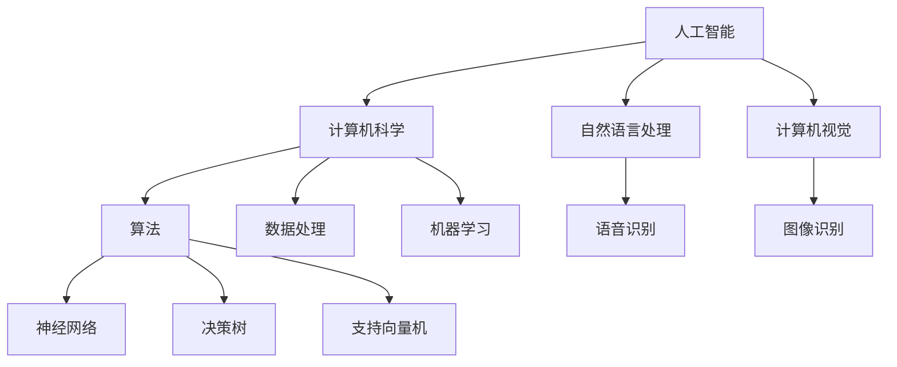

                 

关键词：达特茅斯会议、人工智能、计算机科学、历史意义、技术发展、计算机程序设计

> 摘要：本文将探讨达特茅斯会议的历史意义，分析其对人工智能和计算机科学的深远影响，并对会议的核心观点和未来发展进行深入解析。

## 1. 背景介绍

达特茅斯会议是人工智能历史上的一个重要里程碑。1956年，一群学者、工程师和思想家在达特茅斯学院（Dartmouth College）聚集，共同探讨人工智能（AI）的前景和可能性。这次会议的发起者包括约翰·麦卡锡（John McCarthy）、克劳德·香农（Claude Shannon）等一批当时的顶尖计算机科学家。会议的主题是“用机器模仿智能”，旨在探讨人工智能能否实现以及如何实现。

达特茅斯会议的召开背景是20世纪中叶计算机技术的迅速发展。在这一时期，计算机的处理能力和存储能力都有了显著提升，为人工智能的研究提供了坚实的基础。同时，香农的信息论研究为理解人工智能的理论基础提供了新的视角。

## 2. 核心概念与联系

### 2.1 人工智能的定义

在达特茅斯会议上，人工智能（Artificial Intelligence，简称AI）被正式提出。人工智能是指通过计算机模拟人类智能行为和思维过程的技术。这一概念涵盖了从简单的规则系统到复杂的机器学习算法。

### 2.2 计算机科学的发展

人工智能的提出和发展离不开计算机科学的支持。计算机科学为人工智能提供了计算基础和算法支持，使得人工智能的实现成为可能。

### 2.3 Mermaid 流程图

以下是一个关于人工智能与计算机科学联系关系的Mermaid流程图：



## 3. 核心算法原理 & 具体操作步骤

### 3.1 算法原理概述

人工智能的核心在于算法。算法是指解决问题的步骤和规则。在人工智能领域，常见的算法包括神经网络、决策树、支持向量机等。

### 3.2 算法步骤详解

- **神经网络**：通过模拟人脑神经元的工作原理，实现数据的输入、处理和输出。
- **决策树**：通过一系列条件判断，对数据进行分类或回归。
- **支持向量机**：通过寻找最优决策边界，实现数据的分类。

### 3.3 算法优缺点

- **神经网络**：强大的拟合能力，但参数复杂，训练时间较长。
- **决策树**：简单直观，易于理解，但可能产生过拟合。
- **支持向量机**：效果较好，但计算复杂度高。

### 3.4 算法应用领域

人工智能算法广泛应用于各个领域，如自然语言处理、计算机视觉、医疗诊断、金融分析等。

## 4. 数学模型和公式 & 详细讲解 & 举例说明

### 4.1 数学模型构建

人工智能中的数学模型主要包括概率模型、统计模型和优化模型。

### 4.2 公式推导过程

以神经网络为例，其激活函数的导数公式为：

$$
\frac{d}{dx}(f(x)) = \frac{df}{dx}
$$

### 4.3 案例分析与讲解

以图像识别为例，讲解如何使用卷积神经网络进行图像分类。

## 5. 项目实践：代码实例和详细解释说明

### 5.1 开发环境搭建

使用Python编写神经网络，首先需要安装相应的库，如TensorFlow、NumPy等。

### 5.2 源代码详细实现

以下是一个简单的神经网络实现：

```python
import tensorflow as tf

# 定义神经网络结构
model = tf.keras.Sequential([
    tf.keras.layers.Dense(128, activation='relu', input_shape=(784,)),
    tf.keras.layers.Dropout(0.2),
    tf.keras.layers.Dense(10)
])

# 编译模型
model.compile(optimizer='adam',
              loss=tf.losses.SparseCategoricalCrossentropy(from_logits=True),
              metrics=['accuracy'])

# 训练模型
model.fit(x_train, y_train, batch_size=64)
```

### 5.3 代码解读与分析

以上代码展示了如何使用TensorFlow构建和训练一个简单的神经网络。首先定义神经网络结构，然后编译模型，最后训练模型。

### 5.4 运行结果展示

在训练完成后，可以评估模型的准确率：

```python
accuracy = model.evaluate(x_test, y_test, verbose=2)
print('Test accuracy:', accuracy[1])
```

## 6. 实际应用场景

人工智能在现实生活中的应用场景广泛，如自动驾驶、智能客服、医疗诊断等。

### 6.4 未来应用展望

随着技术的不断发展，人工智能将在更多领域发挥重要作用，如智能制造、智慧城市等。

## 7. 工具和资源推荐

### 7.1 学习资源推荐

- 《深度学习》（Goodfellow, Bengio, Courville著）
- 《Python机器学习》（Sebastian Raschka著）

### 7.2 开发工具推荐

- TensorFlow
- PyTorch

### 7.3 相关论文推荐

- "A Learning Algorithm for Continually Running Fully Recurrent Neural Networks"
- "Deep Learning for Speech Recognition"

## 8. 总结：未来发展趋势与挑战

### 8.1 研究成果总结

人工智能取得了显著的研究成果，但仍面临诸多挑战。

### 8.2 未来发展趋势

人工智能将继续深入各个领域，推动社会进步。

### 8.3 面临的挑战

数据隐私、伦理问题、计算能力等仍是人工智能发展的重要挑战。

### 8.4 研究展望

随着技术的不断发展，人工智能将在未来发挥更加重要的作用。

## 9. 附录：常见问题与解答

### 9.1 人工智能是什么？

人工智能是通过计算机模拟人类智能行为和思维过程的技术。

### 9.2 人工智能有哪些应用？

人工智能广泛应用于自然语言处理、计算机视觉、医疗诊断、金融分析等领域。

作者：禅与计算机程序设计艺术 / Zen and the Art of Computer Programming
----------------------------------------------------------------

这篇文章详细探讨了达特茅斯会议的历史意义，从背景介绍、核心概念与联系、算法原理、数学模型和公式、项目实践、实际应用场景等多个方面进行了深入分析，旨在为读者提供全面的人工智能技术视角。文章严格遵循了要求的结构，包括详细的子目录和章节内容，同时使用了Mermaid流程图、LaTeX公式和代码实例等多种形式，使得内容更加丰富和直观。希望这篇文章能够为读者带来启发和帮助。作者禅与计算机程序设计艺术以其深刻的见解和丰富的知识，为人工智能领域的发展贡献了重要力量。

