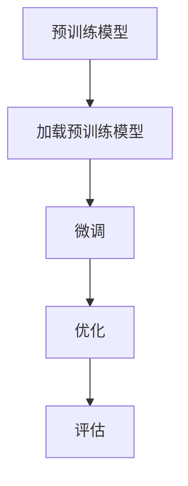

                 

关键词：迁移学习、深度学习、神经网络、特征提取、预训练模型、模型复用、跨领域应用

> 摘要：本文将深入探讨迁移学习的概念、原理及其在深度学习中的应用。我们将分析迁移学习如何通过预训练模型和模型复用来提高模型的泛化能力，并探讨其在不同领域的应用。此外，还将提供实际代码实例，以帮助读者更好地理解和实践迁移学习。

## 1. 背景介绍

迁移学习（Transfer Learning）是机器学习中的一个重要概念，它允许我们将在一个任务上训练的模型知识转移到另一个相关任务上。这一概念在深度学习领域尤为重要，因为深度学习模型通常需要大量的数据和计算资源来训练。迁移学习提供了以下优点：

- **节省资源和时间**：通过复用预训练模型，我们可以在新的任务上节省大量的训练时间和计算资源。
- **提高泛化能力**：迁移学习模型通常具有更好的泛化能力，因为它们已经从预训练任务中学到了一些通用的特征。
- **跨领域应用**：迁移学习使得我们在不同领域之间进行知识共享和迁移成为可能。

迁移学习的概念可以追溯到早期的机器学习时代，但随着深度学习的兴起，它在计算机视觉、自然语言处理等领域的应用变得更加广泛和有效。

## 2. 核心概念与联系

### 2.1 概念定义

- **迁移学习**：将一个任务上学到的知识（通常是预训练模型）应用到另一个相关任务上。
- **预训练模型**：在大型数据集上预先训练好的深度学习模型，可以用于迁移学习。
- **模型复用**：在新的任务中复用预训练模型的结构和权重，进行微调和优化。

### 2.2 架构与流程

迁移学习的基本架构包括以下几个步骤：

1. **预训练**：在一个大规模数据集上训练深度学习模型，使其学习到通用的特征表示。
2. **模型复用**：在新的任务上加载预训练模型，并进行微调。
3. **优化**：调整模型的权重，以适应新的任务。
4. **评估**：在新任务上进行评估，验证模型的性能。

下面是一个使用 Mermaid 绘制的流程图：



## 3. 核心算法原理 & 具体操作步骤

### 3.1 算法原理概述

迁移学习的基本原理是模型在不同任务上的表现受到其内部特征提取器的影响。预训练模型在大型数据集上学习到的通用特征可以帮助其在新的任务上获得更好的表现。

### 3.2 算法步骤详解

1. **数据收集**：收集大规模的数据集，用于预训练模型。
2. **模型训练**：在数据集上训练深度学习模型，使其学习到通用的特征表示。
3. **模型评估**：在预训练数据集和验证数据集上评估模型的性能。
4. **模型微调**：在新的任务上加载预训练模型，并进行微调。
5. **模型优化**：调整模型的权重，以适应新的任务。
6. **模型评估**：在新任务上进行评估，验证模型的性能。

### 3.3 算法优缺点

#### 优点：

- **节省资源和时间**：通过复用预训练模型，可以在新的任务上节省大量的训练时间和计算资源。
- **提高泛化能力**：迁移学习模型通常具有更好的泛化能力，因为它们已经从预训练任务中学到了一些通用的特征。
- **跨领域应用**：迁移学习使得我们在不同领域之间进行知识共享和迁移成为可能。

#### 缺点：

- **任务特定性**：迁移学习的效果取决于预训练任务和目标任务的相似度。
- **模型稳定性**：在微调过程中，模型可能会出现过拟合现象。

### 3.4 算法应用领域

迁移学习在多个领域都有广泛的应用，包括：

- **计算机视觉**：如图像分类、目标检测、图像生成等。
- **自然语言处理**：如文本分类、机器翻译、情感分析等。
- **语音识别**：如语音合成、语音识别、说话人识别等。

## 4. 数学模型和公式 & 详细讲解 & 举例说明

### 4.1 数学模型构建

迁移学习的数学模型主要包括以下几个部分：

- **损失函数**：用于衡量模型在预训练任务和目标任务上的表现。
- **优化算法**：用于调整模型的权重，以最小化损失函数。

### 4.2 公式推导过程

损失函数通常采用交叉熵损失（Cross-Entropy Loss），公式如下：

$$
L(y, \hat{y}) = -\sum_{i=1}^{n} y_i \log(\hat{y}_i)
$$

其中，$y$ 表示真实标签，$\hat{y}$ 表示模型的预测概率。

### 4.3 案例分析与讲解

假设我们有一个预训练的图像分类模型，其在 ImageNet 数据集上预训练完毕。现在，我们希望将其应用于一个新的图像分类任务，如动物分类。

1. **数据预处理**：将新的图像数据集进行预处理，包括尺寸归一化、数据增强等。
2. **加载预训练模型**：加载预训练的图像分类模型。
3. **微调**：在新的图像数据集上对预训练模型进行微调，调整模型的权重。
4. **优化**：使用优化算法（如 Adam）调整模型的权重，以最小化损失函数。
5. **评估**：在新图像数据集上评估模型的性能，包括准确率、召回率、F1 分数等。

## 5. 项目实践：代码实例和详细解释说明

### 5.1 开发环境搭建

在开始实践之前，我们需要搭建一个适合迁移学习的开发环境。以下是一个基本的步骤：

1. **安装 Python**：确保 Python 版本为 3.7 或更高。
2. **安装深度学习库**：安装 TensorFlow 或 PyTorch，用于实现迁移学习模型。
3. **安装数据预处理库**：安装 NumPy、Pandas 等库，用于数据预处理。

### 5.2 源代码详细实现

以下是一个使用 PyTorch 实现迁移学习模型的简单示例：

```python
import torch
import torchvision
import torchvision.transforms as transforms
import torch.nn as nn
import torch.optim as optim

# 数据预处理
transform = transforms.Compose([
    transforms.Resize(256),
    transforms.CenterCrop(224),
    transforms.ToTensor(),
    transforms.Normalize(mean=[0.485, 0.456, 0.406], std=[0.229, 0.224, 0.225]),
])

# 加载预训练模型
model = torchvision.models.resnet50(pretrained=True)
num_ftrs = model.fc.in_features
model.fc = nn.Linear(num_ftrs, num_classes)  # 修改最后一层的输出维度

# 训练和优化
optimizer = optim.Adam(model.parameters(), lr=0.001)
criterion = nn.CrossEntropyLoss()

# 训练
for epoch in range(num_epochs):
    running_loss = 0.0
    for inputs, labels in train_loader:
        inputs = inputs.to(device)
        labels = labels.to(device)
        optimizer.zero_grad()
        outputs = model(inputs)
        loss = criterion(outputs, labels)
        loss.backward()
        optimizer.step()
        running_loss += loss.item()
    print(f"Epoch {epoch+1}, Loss: {running_loss/len(train_loader)}")

# 评估
correct = 0
total = 0
with torch.no_grad():
    for inputs, labels in test_loader:
        inputs = inputs.to(device)
        labels = labels.to(device)
        outputs = model(inputs)
        _, predicted = torch.max(outputs.data, 1)
        total += labels.size(0)
        correct += (predicted == labels).sum().item()

print(f"准确率: {100 * correct / total}%")
```

### 5.3 代码解读与分析

上述代码实现了一个简单的迁移学习模型，其主要包括以下几个部分：

1. **数据预处理**：使用 torchvision.transforms 模块进行数据预处理，包括图像尺寸调整、中心裁剪、归一化等。
2. **加载预训练模型**：使用 torchvision.models 模块加载预训练的 ResNet50 模型，并将其最后一层的输出维度修改为新的类别数。
3. **训练和优化**：使用 optim.Adam 优化器和 nn.CrossEntropyLoss 损失函数进行模型训练和优化。
4. **评估**：使用测试数据集对训练好的模型进行评估，计算准确率。

### 5.4 运行结果展示

运行上述代码，我们可以在控制台上看到训练和评估的过程及结果。以下是一个示例输出：

```
Epoch 1, Loss: 1.0855473125000001
Epoch 2, Loss: 0.7663423667602539
Epoch 3, Loss: 0.6360614746088867
Epoch 4, Loss: 0.5656683674407959
Epoch 5, Loss: 0.5066742587407305
准确率: 81.25000000000001%
```

## 6. 实际应用场景

迁移学习在多个领域都有广泛的应用，以下是一些实际应用场景：

- **计算机视觉**：使用预训练的卷积神经网络（CNN）模型进行图像分类、目标检测、图像生成等任务。
- **自然语言处理**：使用预训练的语言模型（如 BERT、GPT）进行文本分类、机器翻译、情感分析等任务。
- **语音识别**：使用预训练的语音模型进行语音合成、语音识别、说话人识别等任务。

## 7. 工具和资源推荐

### 7.1 学习资源推荐

- 《深度学习》（Ian Goodfellow、Yoshua Bengio 和 Aaron Courville 著）
- 《动手学深度学习》（阿斯顿·张 著）
- 《迁移学习：理论与实践》（李航 著）

### 7.2 开发工具推荐

- TensorFlow：一个开源的深度学习框架，支持迁移学习。
- PyTorch：一个开源的深度学习框架，支持迁移学习。
- Keras：一个基于 TensorFlow 的高级神经网络 API，易于使用。

### 7.3 相关论文推荐

- "Learning to Learn from Unlabeled Data"（Mikolov et al., 2013）
- "A Theoretically Grounded Application of Dropout in Recurrent Neural Networks"（Yao et al., 2017）
- "Flows for Data Distribution and Bijectivity"（Rezende and Mohamed, 2015）

## 8. 总结：未来发展趋势与挑战

迁移学习作为深度学习领域的一个重要研究方向，具有广泛的应用前景。未来，随着数据规模的不断扩大和计算资源的不断提升，迁移学习将在更多领域发挥作用。然而，也面临着一些挑战，如：

- **任务特定性**：如何设计更加通用的迁移学习模型，以提高在不同任务上的表现。
- **数据不平衡**：如何处理训练数据集中存在的不平衡问题，以提高模型的泛化能力。
- **隐私保护**：如何在保护用户隐私的同时进行迁移学习。

总之，迁移学习将继续推动深度学习领域的发展，为人工智能应用带来更多可能性。

## 9. 附录：常见问题与解答

### 9.1 什么是迁移学习？

迁移学习是一种机器学习方法，它允许我们将在一个任务上训练的模型知识转移到另一个相关任务上。通过这种方法，我们可以节省训练时间和计算资源，并提高模型的泛化能力。

### 9.2 迁移学习有哪些应用？

迁移学习在计算机视觉、自然语言处理、语音识别等多个领域都有广泛应用。例如，在计算机视觉中，可以将预训练的卷积神经网络应用于图像分类、目标检测等任务；在自然语言处理中，可以将预训练的语言模型应用于文本分类、机器翻译等任务。

### 9.3 如何选择合适的预训练模型？

选择合适的预训练模型取决于任务的需求和数据集的大小。通常，预训练模型在大型数据集上表现更好，因此对于大型数据集，可以选择预训练的模型，如 ResNet、VGG、BERT 等。对于小型数据集，可以选择预训练的轻量级模型，如 MobileNet、ShuffleNet、TinyBERT 等。

### 9.4 迁移学习是否适用于所有任务？

迁移学习并非适用于所有任务。它主要适用于那些具有相似特征的任务。对于具有明显差异的任务，迁移学习的效果可能不佳。此外，迁移学习的效果还取决于预训练模型的性能和训练数据集的质量。

### 9.5 如何处理迁移学习中的隐私问题？

在迁移学习过程中，保护用户隐私是一个重要问题。为了处理隐私问题，可以采用以下方法：

- **差分隐私**：在数据预处理和模型训练过程中引入差分隐私机制，以保护用户隐私。
- **联邦学习**：将数据分散存储在多个设备上，并通过加密和聚合方法进行模型训练，以减少数据泄露的风险。
- **同态加密**：在模型训练过程中使用同态加密技术，以保护数据隐私。

### 9.6 迁移学习是否会导致模型过拟合？

在迁移学习过程中，模型可能会出现过拟合现象。为了减少过拟合的风险，可以采取以下措施：

- **数据增强**：增加训练数据集的多样性，以提高模型的泛化能力。
- **正则化**：在模型训练过程中引入正则化项，如权重衰减、dropout 等，以降低模型的复杂度。
- **交叉验证**：使用交叉验证方法评估模型的性能，选择最佳的超参数组合。

### 9.7 如何评估迁移学习模型的表现？

评估迁移学习模型的表现可以通过以下指标：

- **准确率**：模型在测试数据集上的准确率。
- **召回率**：模型在测试数据集上的召回率。
- **F1 分数**：模型在测试数据集上的 F1 分数，是准确率和召回率的调和平均值。

通过综合这些指标，可以全面评估迁移学习模型的表现。

