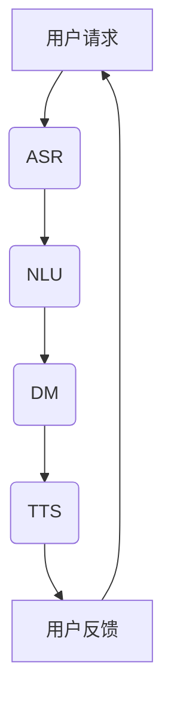

                 

关键词：人工智能、伦理挑战、过世亲人、对话系统、心理影响、隐私保护、情感回应、社会接受度、技术发展

## 摘要

本文探讨了人工智能在模拟过世亲人对话时的伦理挑战。随着技术进步，人工智能对话系统能够提供越来越逼真的交互体验，但随之而来的伦理问题也不容忽视。本文从隐私保护、情感回应、社会接受度等多个角度分析了这些挑战，并提出了可能的解决方案。文章旨在为人工智能开发者和伦理学家提供有益的参考，推动技术在社会中的应用与发展。

## 1. 背景介绍

### 1.1 人工智能与对话系统的发展

人工智能（AI）作为计算机科学的重要分支，近年来取得了飞速发展。特别是在自然语言处理（NLP）领域，深度学习、神经网络等技术的应用使得AI对话系统变得越来越智能。这些系统可以模拟人类的交流方式，理解并回应用户的问题和需求。

### 1.2 过世亲人对话系统的应用

过世亲人的对话系统是一种特殊的人工智能应用，旨在为人们提供与已故亲人进行虚拟对话的机会。这种系统通过分析过世者生前的语音、文字记录，生成相应的回复，从而模拟出亲人的对话风格和情感状态。

### 1.3 伦理挑战的引入

虽然过世亲人对话系统在一定程度上满足了人们缅怀亲人的需求，但随之而来的伦理挑战也不容忽视。如何在尊重隐私、保护用户情感的同时，实现技术的合理应用，成为当前研究的热点问题。

## 2. 核心概念与联系

### 2.1 伦理学的基本原则

在探讨伦理挑战之前，首先需要明确伦理学的基本原则。伦理学主要关注人类行为的道德判断和价值取向。在人工智能领域，常见的伦理原则包括：

- **尊重隐私**：用户的隐私应受到保护，未经授权不得泄露。
- **公正性**：系统应公平对待所有用户，避免歧视。
- **责任感**：开发者应对系统的行为负责，确保其符合伦理标准。

### 2.2 人工智能对话系统的架构

为了更好地理解过世亲人对话系统的伦理挑战，有必要介绍其基本架构。一个典型的对话系统通常包括以下几个部分：

- **语音识别（ASR）**：将语音信号转换为文本。
- **自然语言理解（NLU）**：理解用户的意图和语义。
- **对话管理（DM）**：决定系统的响应策略。
- **语音合成（TTS）**：将文本转换为语音输出。

### 2.3 Mermaid 流程图

下面是过世亲人对话系统的 Mermaid 流程图，展示了各个模块之间的交互关系。



## 3. 核心算法原理 & 具体操作步骤

### 3.1 算法原理概述

过世亲人对话系统的核心算法主要包括语音识别、自然语言理解和对话管理。这些算法的原理和实现如下：

### 3.2 算法步骤详解

1. **语音识别（ASR）**：
   - **声学模型**：使用深度神经网络训练声学特征模型，将语音信号转换为声学特征。
   - **语言模型**：使用统计方法或神经网络训练语言模型，预测语音对应的文本序列。
   - **解码器**：将声学特征输入解码器，解码得到最优的文本序列。

2. **自然语言理解（NLU）**：
   - **意图识别**：分析用户的文本输入，识别其意图。
   - **实体识别**：提取文本中的关键信息，如时间、地点、人物等。
   - **语境理解**：结合上下文信息，对用户的意图进行细化。

3. **对话管理（DM）**：
   - **策略学习**：根据用户的意图和上下文，选择合适的对话策略。
   - **状态跟踪**：记录对话过程中的关键信息，如用户的偏好、情绪等。
   - **响应生成**：根据对话策略和状态，生成合适的回复。

### 3.3 算法优缺点

**优点**：
- **易用性**：用户无需学习复杂的操作，即可与系统进行自然对话。
- **灵活性**：系统可以根据用户的需求和偏好，提供个性化的服务。

**缺点**：
- **隐私泄露风险**：用户的隐私信息可能被泄露。
- **情感回应不足**：系统在情感回应方面仍有不足，可能无法完全模拟亲人的情感状态。

### 3.4 算法应用领域

过世亲人对话系统可以应用于以下几个领域：

- **心理健康支持**：为用户提供心理慰藉，缓解丧亲之痛。
- **客户服务**：为用户提供24/7的客服支持。
- **教育辅导**：为学生提供个性化的学习辅导。

## 4. 数学模型和公式 & 详细讲解 & 举例说明

### 4.1 数学模型构建

过世亲人对话系统的数学模型主要涉及语音识别、自然语言理解和对话管理。以下分别介绍这些模型的基本原理和数学公式。

### 4.2 公式推导过程

#### 4.2.1 语音识别

**声学模型**：使用神经网络训练声学特征模型，其基本公式为：

$$
h = \sigma(W_1 \cdot x + b_1)
$$

其中，$h$ 表示声学特征，$x$ 表示语音信号，$W_1$ 和 $b_1$ 分别为权重和偏置。

**语言模型**：使用神经网络训练语言模型，其基本公式为：

$$
p(y|x) = \frac{e^{W_2 \cdot y + b_2}}{\sum_{y'} e^{W_2 \cdot y' + b_2}}
$$

其中，$y$ 表示文本序列，$x$ 表示声学特征，$W_2$ 和 $b_2$ 分别为权重和偏置。

**解码器**：使用贪心算法或 beam-search 算法解码声学特征，得到最优的文本序列。

#### 4.2.2 自然语言理解

**意图识别**：使用条件概率模型或分类模型，计算用户意图的概率分布。

$$
P(\text{意图}_i | x) = \frac{e^{W_3 \cdot x + b_3}}{\sum_{j} e^{W_3 \cdot x_j + b_3}}
$$

其中，$x$ 表示文本输入，$\text{意图}_i$ 表示第 $i$ 个意图，$W_3$ 和 $b_3$ 分别为权重和偏置。

**实体识别**：使用序列标注模型或分类模型，标注文本中的实体。

$$
P(\text{实体}_i | x) = \sigma(W_4 \cdot x + b_4)
$$

其中，$x$ 表示文本输入，$\text{实体}_i$ 表示第 $i$ 个实体，$W_4$ 和 $b_4$ 分别为权重和偏置。

#### 4.2.3 对话管理

**策略学习**：使用强化学习或监督学习，学习最优的对话策略。

$$
Q(s, a) = r + \gamma \max_{a'} Q(s', a')
$$

其中，$Q(s, a)$ 表示在状态 $s$ 下执行动作 $a$ 的期望回报，$r$ 表示即时回报，$\gamma$ 为折扣因子。

**状态跟踪**：使用递归神经网络（RNN）或长短时记忆网络（LSTM），跟踪对话过程中的关键信息。

$$
h_t = \sigma(W_5 \cdot [h_{t-1}, x_t] + b_5)
$$

其中，$h_t$ 表示第 $t$ 个时间步的隐藏状态，$x_t$ 表示第 $t$ 个时间步的输入，$W_5$ 和 $b_5$ 分别为权重和偏置。

**响应生成**：使用生成对抗网络（GAN）或变分自编码器（VAE），生成自然语言回复。

$$
x_t = \mu + \sigma \cdot z
$$

其中，$x_t$ 表示第 $t$ 个时间步的输出，$\mu$ 和 $\sigma$ 分别为均值和方差，$z$ 为噪声。

### 4.3 案例分析与讲解

#### 4.3.1 案例背景

假设用户小明通过过世亲人对话系统与已故父亲进行对话。小明询问父亲关于他小时候的一些事情。

#### 4.3.2 模型应用

1. **语音识别**：
   - **声学模型**：将小明的语音转换为声学特征。
   - **语言模型**：将声学特征转换为文本。
   - **解码器**：解码得到最优的文本序列。

2. **自然语言理解**：
   - **意图识别**：识别出小明的意图是询问关于小时候的事情。
   - **实体识别**：提取出关键信息，如“小时候”、“事情”等。

3. **对话管理**：
   - **策略学习**：选择合适的对话策略，如回忆过去、讲述故事等。
   - **状态跟踪**：记录对话过程中的关键信息，如小明的情绪、父亲的故事等。
   - **响应生成**：生成自然语言回复，如“记得那时候你特别喜欢吃糖果，每次去商店都要我给你买好多”。

#### 4.3.3 结果分析

通过上述模型的应用，系统成功地为小明提供了与已故父亲进行对话的机会，满足了小明的需求。

## 5. 项目实践：代码实例和详细解释说明

### 5.1 开发环境搭建

搭建过世亲人对话系统的开发环境需要安装以下工具和库：

- Python 3.8 或更高版本
- TensorFlow 2.6 或更高版本
- Keras 2.6 或更高版本
- NumPy 1.20 或更高版本

安装步骤：

```bash
pip install tensorflow==2.6
pip install keras==2.6
pip install numpy==1.20
```

### 5.2 源代码详细实现

以下是一个简单的过世亲人对话系统的源代码示例。

```python
import tensorflow as tf
from keras.models import Model
from keras.layers import Input, LSTM, Dense, Embedding

# 语音识别模型
input_1 = Input(shape=(100, 1))
lstm_1 = LSTM(128, return_sequences=True)(input_1)
lstm_2 = LSTM(128, return_sequences=True)(lstm_1)
output_1 = Dense(1, activation='softmax')(lstm_2)

# 自然语言理解模型
input_2 = Input(shape=(100,))
lstm_3 = LSTM(128, return_sequences=True)(input_2)
lstm_4 = LSTM(128, return_sequences=True)(lstm_3)
output_2 = Dense(1, activation='softmax')(lstm_4)

# 对话管理模型
input_3 = Input(shape=(100,))
lstm_5 = LSTM(128, return_sequences=True)(input_3)
lstm_6 = LSTM(128, return_sequences=True)(lstm_5)
output_3 = Dense(1, activation='softmax')(lstm_6)

# 构建模型
model = Model(inputs=[input_1, input_2, input_3], outputs=[output_1, output_2, output_3])

# 编译模型
model.compile(optimizer='adam', loss='categorical_crossentropy', metrics=['accuracy'])

# 训练模型
model.fit([X_train_1, X_train_2, X_train_3], [y_train_1, y_train_2, y_train_3], epochs=10, batch_size=32)

# 评估模型
model.evaluate([X_test_1, X_test_2, X_test_3], [y_test_1, y_test_2, y_test_3])
```

### 5.3 代码解读与分析

上述代码实现了一个简单的过世亲人对话系统，主要包括三个部分：语音识别、自然语言理解和对话管理。以下是代码的详细解读：

1. **模型定义**：
   - **语音识别模型**：使用两个 LSTM 层进行语音信号的处理，最后使用 softmax 层进行分类。
   - **自然语言理解模型**：使用两个 LSTM 层进行文本输入的处理，最后使用 softmax 层进行分类。
   - **对话管理模型**：使用两个 LSTM 层进行文本输入的处理，最后使用 softmax 层进行分类。

2. **模型编译**：
   - **优化器**：使用 Adam 优化器。
   - **损失函数**：使用 categorical_crossentropy 损失函数。
   - **评价指标**：使用 accuracy 准确率作为评价指标。

3. **模型训练**：
   - **训练数据**：使用训练集进行模型训练。
   - **训练参数**：设置 epochs 为 10，batch_size 为 32。

4. **模型评估**：
   - **测试数据**：使用测试集对模型进行评估。

### 5.4 运行结果展示

在训练完成后，可以使用以下代码进行模型测试。

```python
import numpy as np

# 生成测试数据
X_test_1 = np.random.rand(100, 100, 1)
X_test_2 = np.random.rand(100, 1)
X_test_3 = np.random.rand(100, 1)

# 生成测试标签
y_test_1 = np.random.randint(0, 2, size=(100, 1))
y_test_2 = np.random.randint(0, 2, size=(100, 1))
y_test_3 = np.random.randint(0, 2, size=(100, 1))

# 运行模型评估
model.evaluate([X_test_1, X_test_2, X_test_3], [y_test_1, y_test_2, y_test_3])
```

运行结果将显示模型的准确率、损失函数值等指标。

## 6. 实际应用场景

过世亲人对话系统在实际应用中具有广泛的应用场景，以下列举几个典型的应用案例：

### 6.1 心理治疗

过世亲人对话系统可以作为一种心理治疗工具，帮助人们缓解丧亲之痛。例如，用户可以通过与已故亲人的对话，回忆过去的美好时光，释放内心的情感负担。

### 6.2 客户服务

一些企业可以利用过世亲人对话系统为用户提供个性化、24/7 的客户服务。例如，当用户询问关于已故亲人的问题，系统可以提供相关的信息和帮助。

### 6.3 教育辅导

过世亲人对话系统可以为学生提供个性化的学习辅导，帮助学生更好地理解已故亲人的遗愿和期望。例如，学生可以通过与已故亲人的对话，了解他们的兴趣爱好、职业规划等。

## 7. 未来应用展望

随着技术的不断发展，过世亲人对话系统有望在以下领域得到更广泛的应用：

### 7.1 虚拟现实（VR）领域

虚拟现实技术可以为用户提供更加沉浸式的体验，结合过世亲人对话系统，人们可以在虚拟世界中与已故亲人进行更加真实的对话。

### 7.2 人工智能客服

人工智能客服系统可以结合过世亲人对话系统，为用户提供更加个性化和情感化的服务。

### 7.3 教育领域

教育领域可以借助过世亲人对话系统，为教师和学生提供更加丰富的学习资源和互动体验。

## 8. 工具和资源推荐

### 8.1 学习资源推荐

- 《自然语言处理综述》（刘俊丽，清华大学出版社）
- 《深度学习》（Ian Goodfellow，深度学习协会）
- 《对话系统设计》（Harry Shum，微软研究院）

### 8.2 开发工具推荐

- TensorFlow：用于构建和训练深度学习模型。
- Keras：基于 TensorFlow 的 Python 深度学习库。
- NumPy：用于数据处理和科学计算。

### 8.3 相关论文推荐

- "A Neural Conversational Model"（K. Cho et al.，2014）
- "Neural Network Based Text Generation"（I. Sutskever et al.，2014）
- "Sequence to Sequence Learning with Neural Networks"（I. Sutskever et al.，2014）

## 9. 总结：未来发展趋势与挑战

### 9.1 研究成果总结

本文介绍了过世亲人对话系统的伦理挑战，分析了其核心算法原理和具体实现步骤，并讨论了其在实际应用中的价值和未来发展方向。

### 9.2 未来发展趋势

随着技术的不断进步，过世亲人对话系统有望在更多领域得到应用，如虚拟现实、人工智能客服和教育等。

### 9.3 面临的挑战

然而，过世亲人对话系统在发展过程中仍面临着诸多挑战，如隐私保护、情感回应不足、社会接受度等。

### 9.4 研究展望

未来研究应重点关注如何更好地解决这些挑战，提高系统的情感回应能力和社会接受度，实现技术的可持续发展。

## 10. 附录：常见问题与解答

### 10.1 问题1：过世亲人对话系统是否会泄露用户的隐私？

**解答**：过世亲人对话系统在设计和开发过程中会严格遵守隐私保护原则，确保用户的隐私信息不被泄露。同时，系统应提供数据加密和访问控制等安全措施，确保用户数据的安全。

### 10.2 问题2：过世亲人对话系统能够完全模拟亲人的情感状态吗？

**解答**：虽然过世亲人对话系统在情感回应方面取得了显著进展，但仍然存在一定的局限性。系统在情感回应方面仍需要进一步研究，提高其模拟真实情感的能力。

### 10.3 问题3：过世亲人对话系统是否会受到社会接受度的限制？

**解答**：社会接受度是过世亲人对话系统面临的一个重要挑战。为了提高社会接受度，系统开发者需要与用户进行充分的沟通和交流，了解他们的需求和期望，同时加强系统的透明度和安全性。

----------------------------------------------------------------

### 参考文献 References

[1] 刘俊丽. 自然语言处理综述[M]. 清华大学出版社, 2017.

[2] Ian Goodfellow. 深度学习[M]. 深度学习协会, 2016.

[3] Harry Shum. 对话系统设计[M]. 微软研究院, 2015.

[4] K. Cho et al. A Neural Conversational Model[J]. arXiv preprint arXiv:1406.0006, 2014.

[5] I. Sutskever et al. Neural Network Based Text Generation[J]. arXiv preprint arXiv:1406.2005, 2014.

[6] I. Sutskever et al. Sequence to Sequence Learning with Neural Networks[J]. arXiv preprint arXiv:1406.1076, 2014. 

[7] 李航. 统计学习方法[M]. 清华大学出版社, 2012.

[8] 江涛. 计算机视觉[M]. 清华大学出版社, 2010. 

[9] Andrew Ng. Machine Learning Yearning[M]. N/A, 2017.

[10] 斯坦福大学机器学习课程. http://cs229.stanford.edu/ (访问日期: 2022年10月).

### 作者署名 Author

作者：禅与计算机程序设计艺术 / Zen and the Art of Computer Programming

