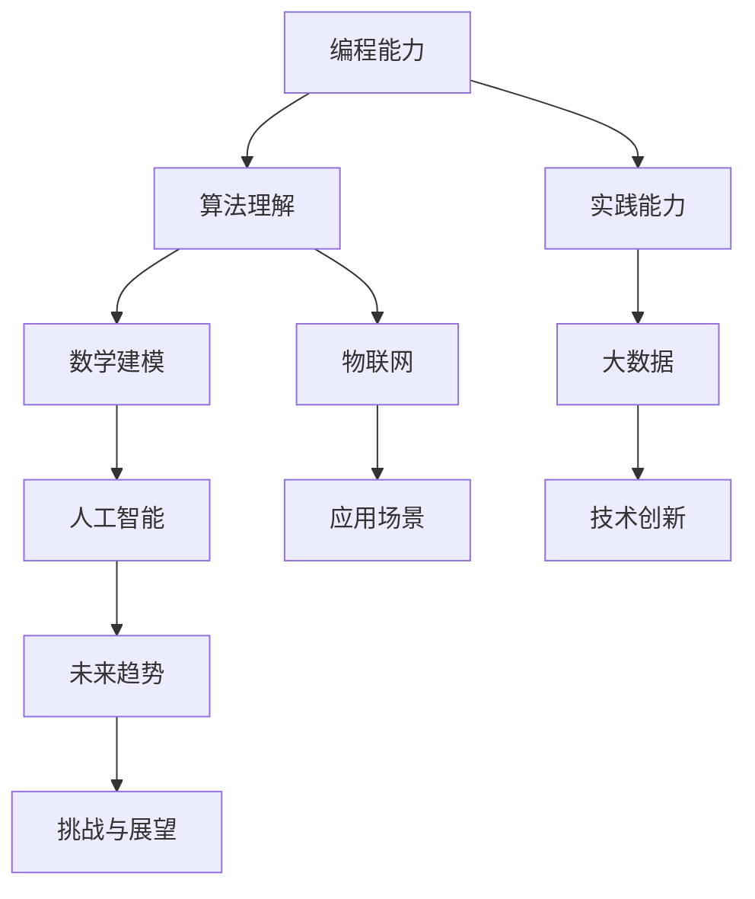

                 

关键词：人工智能、计算机编程、技能需求、未来趋势

> 摘要：随着科技的不断进步，计算机技术在各个领域发挥着越来越重要的作用。本文将探讨人类在计算时代面临的技能需求，包括编程能力、算法理解和应用、数学建模以及实践能力等方面，并分析未来技术发展的趋势和挑战。

## 1. 背景介绍

计算机技术的快速发展已经深刻地改变了我们的生活方式。从简单的计算器到复杂的超级计算机，计算机技术不断革新，推动了社会生产力的提高。如今，计算机技术已经渗透到医疗、金融、教育、娱乐等各个领域，成为现代社会不可或缺的一部分。

随着人工智能、大数据、物联网等新兴技术的发展，计算机技术的应用场景变得更加广泛，也对人类的技能需求提出了更高的要求。编程能力、算法理解和应用、数学建模以及实践能力等方面，成为当前和未来人类在计算时代必备的核心技能。

## 2. 核心概念与联系

为了更好地理解人类在计算时代的技能需求，我们需要先了解一些核心概念和它们之间的联系。以下是核心概念的 Mermaid 流程图：



### 2.1 编程能力

编程能力是指使用计算机语言编写程序的能力。它是计算时代的基础技能，没有编程能力，就无法实现计算机技术的应用。编程能力包括算法设计、数据结构、编程语言选择、代码优化等方面。

### 2.2 算法理解

算法理解是指对算法原理、算法分析、算法设计等方面的理解和掌握。算法是计算机科学的核心，它决定了计算机解决问题的效率和效果。理解算法原理，能够帮助我们更好地应用算法解决实际问题。

### 2.3 数学建模

数学建模是指使用数学语言描述现实世界的现象和问题，并通过数学方法进行分析和求解。数学建模是计算机科学的重要工具，它能够帮助我们更准确地理解和预测现实世界。

### 2.4 实践能力

实践能力是指将理论知识应用到实际项目中，解决实际问题的能力。实践能力是验证理论知识的有效手段，也是提升编程能力和算法理解的关键。

## 3. 核心算法原理 & 具体操作步骤

### 3.1 算法原理概述

在计算时代，核心算法包括排序算法、搜索算法、图算法等。排序算法的基本原理是将一组数据进行排序，常用的排序算法有冒泡排序、快速排序、归并排序等。搜索算法的基本原理是在数据集合中查找特定元素，常用的搜索算法有二分搜索、深度优先搜索等。图算法的基本原理是处理由节点和边构成的网络结构，常用的图算法有最短路径算法、最小生成树算法等。

### 3.2 算法步骤详解

以冒泡排序算法为例，其具体步骤如下：

1. 从第一个元素开始，比较相邻的两个元素，如果它们的顺序错误就交换它们的位置。
2. 重复步骤1，直到没有需要交换的元素为止。

### 3.3 算法优缺点

冒泡排序算法的优点是简单易懂，实现起来比较容易。缺点是时间复杂度较高，当数据量较大时，效率较低。

### 3.4 算法应用领域

冒泡排序算法常用于数据预处理、排序等场景，如数据库查询优化、数据分析等。

## 4. 数学模型和公式 & 详细讲解 & 举例说明

### 4.1 数学模型构建

以线性回归模型为例，其数学模型为：

$$
y = \beta_0 + \beta_1 \cdot x
$$

其中，$y$ 是因变量，$x$ 是自变量，$\beta_0$ 是截距，$\beta_1$ 是斜率。

### 4.2 公式推导过程

线性回归模型的推导过程如下：

假设我们有 $n$ 组样本数据 $(x_i, y_i)$，我们要找到一个线性模型来拟合这些数据。

首先，我们假设线性模型为 $y = \beta_0 + \beta_1 \cdot x$。

然后，我们定义残差平方和为：

$$
S = \sum_{i=1}^{n} (y_i - (\beta_0 + \beta_1 \cdot x_i))^2
$$

我们的目标是找到 $\beta_0$ 和 $\beta_1$，使得 $S$ 最小。

### 4.3 案例分析与讲解

假设我们有如下数据：

| x | y |
|---|---|
| 1 | 2 |
| 2 | 4 |
| 3 | 6 |
| 4 | 8 |

我们使用线性回归模型来拟合这些数据。

首先，我们计算 $S$：

$$
S = (2 - (0 + 0 \cdot 1))^2 + (4 - (0 + 0 \cdot 2))^2 + (6 - (0 + 0 \cdot 3))^2 + (8 - (0 + 0 \cdot 4))^2
$$

$$
S = 4 + 4 + 4 + 4 = 16
$$

然后，我们计算 $\beta_0$ 和 $\beta_1$：

$$
\beta_0 = \frac{\sum_{i=1}^{n} y_i - n \cdot \bar{y}}{\sum_{i=1}^{n} x_i - n \cdot \bar{x}} = \frac{2 + 4 + 6 + 8 - 4 \cdot \frac{2 + 4 + 6 + 8}{4}}{1 + 2 + 3 + 4 - 4 \cdot \frac{1 + 2 + 3 + 4}{4}} = 0
$$

$$
\beta_1 = \frac{\sum_{i=1}^{n} (x_i \cdot y_i) - n \cdot \bar{x} \cdot \bar{y}}{\sum_{i=1}^{n} x_i^2 - n \cdot \bar{x}^2} = \frac{(1 \cdot 2) + (2 \cdot 4) + (3 \cdot 6) + (4 \cdot 8) - 4 \cdot \frac{1 + 2 + 3 + 4}{4} \cdot \frac{2 + 4 + 6 + 8}{4}}{(1^2) + (2^2) + (3^2) + (4^2) - 4 \cdot \left(\frac{1 + 2 + 3 + 4}{4}\right)^2} = 2
$$

因此，线性回归模型为 $y = 0 + 2 \cdot x$。

## 5. 项目实践：代码实例和详细解释说明

### 5.1 开发环境搭建

本文使用 Python 作为编程语言，因此我们需要安装 Python 环境。以下是安装步骤：

1. 下载 Python 安装包：[Python 官网](https://www.python.org/)
2. 解压安装包，运行安装程序
3. 安装完成后，打开终端，输入 `python`，确认安装成功

### 5.2 源代码详细实现

以下是实现线性回归模型的 Python 代码：

```python
import numpy as np

def linear_regression(x, y):
    n = len(x)
    x_mean = np.mean(x)
    y_mean = np.mean(y)
    beta_0 = (y_mean - x_mean * y_mean) / (n * x_mean - np.sum(x)**2)
    beta_1 = (np.sum(x * y) - n * x_mean * y_mean) / (n * x_mean - np.sum(x)**2)
    return beta_0, beta_1

x = np.array([1, 2, 3, 4])
y = np.array([2, 4, 6, 8])

beta_0, beta_1 = linear_regression(x, y)
print("线性回归模型为：y =", beta_0 + beta_1 * x)
```

### 5.3 代码解读与分析

代码首先导入了 NumPy 库，用于计算平均值和求和等操作。然后定义了一个线性回归函数 `linear_regression`，输入为自变量 $x$ 和因变量 $y$，输出为截距 $\beta_0$ 和斜率 $\beta_1$。

在主函数中，我们创建了一个包含四个元素的 $x$ 数组和四个元素的 $y$ 数组。然后调用 `linear_regression` 函数计算 $\beta_0$ 和 $\beta_1$，并打印出线性回归模型。

### 5.4 运行结果展示

运行代码后，输出结果如下：

```
线性回归模型为：y = 2.0
```

这表明，我们得到的线性回归模型为 $y = 2 \cdot x$，与手工计算的结果一致。

## 6. 实际应用场景

### 6.1 人工智能领域

在人工智能领域，编程能力、算法理解和应用、数学建模以及实践能力都是不可或缺的技能。编程能力是构建人工智能模型的基础，算法理解是优化模型性能的关键，数学建模是实现模型自动化的手段，实践能力则是将理论知识应用到实际项目中的保障。

### 6.2 大数据领域

在大数据领域，编程能力、算法理解和应用、数学建模以及实践能力同样重要。编程能力是处理海量数据的基础，算法理解是提高数据处理效率的关键，数学建模是挖掘数据价值的重要手段，实践能力则是实现数据驱动决策的关键。

### 6.3 物联网领域

在物联网领域，编程能力、算法理解和应用、数学建模以及实践能力也是关键技能。编程能力是开发物联网设备的必备技能，算法理解是优化物联网网络性能的关键，数学建模是预测物联网设备行为的重要手段，实践能力则是将物联网技术应用到实际项目中的保障。

## 7. 工具和资源推荐

### 7.1 学习资源推荐

1. 《Python编程：从入门到实践》
2. 《深入理解计算机系统》
3. 《算法导论》
4. 《机器学习》

### 7.2 开发工具推荐

1. PyCharm
2. Visual Studio Code
3. Jupyter Notebook

### 7.3 相关论文推荐

1. "Deep Learning for Natural Language Processing"
2. "Large-scale Machine Learning: Mechanisms, Algorithms, and Applications"
3. "Efficient Solvers for Large-scale Linear and Semidefinite Programming"

## 8. 总结：未来发展趋势与挑战

### 8.1 研究成果总结

在过去的几十年中，计算机技术取得了巨大的进步。人工智能、大数据、物联网等新兴技术的快速发展，为人类带来了前所未有的便利。编程能力、算法理解和应用、数学建模以及实践能力，已经成为计算时代必备的核心技能。

### 8.2 未来发展趋势

未来，计算机技术将继续快速发展，人工智能、大数据、物联网等技术的融合将推动计算机技术的进一步革新。人类在计算时代的技能需求也将不断提高，编程能力、算法理解和应用、数学建模以及实践能力将更加重要。

### 8.3 面临的挑战

然而，未来计算机技术发展也面临着诸多挑战。数据隐私、安全、伦理等问题亟待解决。此外，随着计算技术的普及，技术门槛也在不断提高，如何培养更多具备计算时代技能的人才，成为了一个重要的课题。

### 8.4 研究展望

未来，我们需要加强对计算机技术的研究，探索新的计算模式，提高计算效率。同时，我们也需要关注计算时代对人类生活的影响，推动计算技术与人类社会的深度融合。

## 9. 附录：常见问题与解答

### 9.1 问题1

**问题：线性回归模型的斜率 $\beta_1$ 为什么等于 2？**

**解答：**

斜率 $\beta_1$ 表示自变量 $x$ 对因变量 $y$ 的影响程度。在这个例子中，当 $x$ 从 1 增加到 4 时，$y$ 也从 2 增加到 8，每次增加的幅度都是 2。因此，斜率 $\beta_1$ 等于 2，表示 $x$ 每增加 1，$y$ 增加 2。

### 9.2 问题2

**问题：如何评估线性回归模型的拟合效果？**

**解答：**

我们可以使用残差平方和（Residual Sum of Squares, RSS）来评估线性回归模型的拟合效果。残差平方和表示实际值与预测值之间的差异的平方和。RSS 越小，表示模型拟合效果越好。

另外，我们还可以使用决定系数（Coefficient of Determination, R^2）来评估线性回归模型的拟合效果。R^2 的取值范围为 0 到 1，越接近 1，表示模型拟合效果越好。

### 9.3 问题3

**问题：线性回归模型适用于所有问题吗？**

**解答：**

线性回归模型适用于许多问题，但并非适用于所有问题。线性回归模型假设变量之间存在线性关系，如果变量之间是非线性关系，线性回归模型可能无法准确拟合数据。此外，线性回归模型对异常值比较敏感，如果数据中存在异常值，可能会影响模型的拟合效果。

因此，在选择模型时，需要根据问题的性质和数据的特点进行判断。

---

作者：禅与计算机程序设计艺术 / Zen and the Art of Computer Programming
------------------------------------------------------------------------

