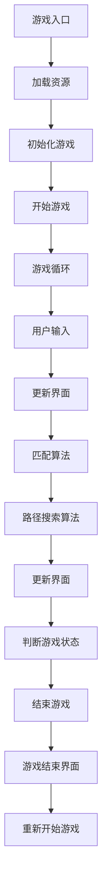
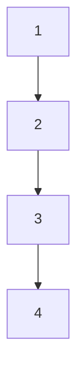

                 

 **关键词：连连看游戏、游戏设计、算法、用户交互、性能优化**

**摘要：** 本文将详细介绍连连看游戏的设计与实现过程，包括核心算法原理、具体操作步骤、数学模型和公式、项目实践代码实例以及实际应用场景等。通过本文的阅读，读者将能够深入理解连连看游戏的设计思路和实现方法，为开发类似游戏提供参考。

## 1. 背景介绍

连连看游戏是一款风靡全球的益智类游戏，玩家需要通过鼠标点击消除相同图案的方块，使得相邻的方块相连，从而达到消除目的。这款游戏简单有趣，适合各个年龄段的玩家，因此在移动端和PC端都有着广泛的应用。

### 1.1 市场背景

连连看游戏的市场背景可以追溯到早期桌面游戏和移动游戏的发展。随着智能手机的普及，移动游戏市场呈现出爆发式增长，连连看游戏凭借其简单易上手的玩法和较高的可玩性，成为了移动游戏市场中的一匹黑马。此外，连连看游戏也在PC端有着广泛的应用，许多网页游戏平台都提供了连连看游戏的版本。

### 1.2 技术背景

连连看游戏的设计与实现涉及多个技术领域，包括图形渲染、用户交互、算法优化等。图形渲染方面，需要使用图形库（如OpenGL、DirectX等）实现方块的外观和动画效果；用户交互方面，需要实现鼠标点击事件的处理和用户反馈；算法优化方面，需要设计高效的连连看匹配算法，以减少游戏的时间消耗。

## 2. 核心概念与联系

### 2.1 游戏设计原则

连连看游戏的设计原则主要包括简洁性、易用性和趣味性。简洁性体现在游戏的界面设计、操作流程和规则上，使玩家能够快速上手；易用性体现在用户交互设计上，使得玩家能够轻松地进行游戏操作；趣味性体现在游戏难度设置和成就系统上，增加游戏的吸引力。

### 2.2 算法原理

连连看游戏的算法原理主要包括两个部分：一是匹配算法，用于找到相同图案的方块；二是路径搜索算法，用于找到相邻方块之间的连接路径。

### 2.3 架构图

下面是连连看游戏的整体架构图：



## 3. 核心算法原理 & 具体操作步骤

### 3.1 算法原理概述

连连看游戏的核心算法原理主要包括匹配算法和路径搜索算法。

- 匹配算法：通过遍历整个游戏场景，找到相同图案的方块，并将它们标记为待消除状态。
- 路径搜索算法：在找到待消除的方块后，通过搜索算法找到相邻的方块之间的连接路径，从而实现方块的消除。

### 3.2 算法步骤详解

#### 3.2.1 匹配算法步骤

1. 初始化：遍历游戏场景中的所有方块，将它们存储在列表中。
2. 遍历：从列表中取出一个方块，判断其是否与已遍历的方块图案相同。
3. 相同图案：如果相同，将该方块标记为待消除状态，并将相邻的方块加入待消除列表。
4. 遍历下一方块，重复步骤2-3，直到遍历完整个列表。

#### 3.2.2 路径搜索算法步骤

1. 初始化：从待消除列表中取出一个方块，将其标记为已搜索状态。
2. 遍历：从方块的所有相邻方块中取出一个，判断其是否已标记为待消除状态。
3. 如果是待消除状态，将其加入待消除列表，并将其标记为已搜索状态。
4. 遍历下一相邻方块，重复步骤2-3，直到遍历完所有相邻方块。
5. 如果待消除列表不为空，重复步骤1-4，直到遍历完所有方块。

### 3.3 算法优缺点

#### 优点

1. 匹配算法和路径搜索算法相对简单，易于实现。
2. 能够快速找到相同图案的方块和连接路径，提高游戏速度。

#### 缺点

1. 匹配算法的时间复杂度为O(n^2)，当方块数量较多时，游戏速度会受到影响。
2. 路径搜索算法需要遍历所有相邻方块，可能导致性能下降。

### 3.4 算法应用领域

连连看游戏的核心算法可以应用于其他类似的游戏，如消消乐、宝石迷阵等。此外，该算法还可以用于其他领域，如图像处理、网络分析等。

## 4. 数学模型和公式 & 详细讲解 & 举例说明

### 4.1 数学模型构建

连连看游戏的数学模型主要包括匹配算法的矩阵表示和路径搜索算法的图表示。

#### 4.1.1 匹配算法的矩阵表示

设游戏场景为一个m×n的矩阵，其中每个元素表示一个方块。矩阵的元素可以用一维数组表示，例如：

```python
# m×n的矩阵
matrix = [
    [1, 2, 3],
    [4, 5, 6],
    [7, 8, 9]
]
```

#### 4.1.2 路径搜索算法的图表示

将游戏场景中的每个方块视为图中的一个节点，节点之间的连接关系表示为边。例如：



### 4.2 公式推导过程

#### 4.2.1 匹配算法

设游戏场景为一个m×n的矩阵，其中每个元素表示一个方块。矩阵的元素可以用一维数组表示，例如：

```python
# m×n的矩阵
matrix = [
    [1, 2, 3],
    [4, 5, 6],
    [7, 8, 9]
]
```

定义一个布尔矩阵`matched`，其中`matched[i][j]`表示第i行第j列的方块是否已匹配。

```python
# 初始化布尔矩阵
matched = [
    [False, False, False],
    [False, False, False],
    [False, False, False]
]
```

匹配算法的公式可以表示为：

```python
# 匹配算法
def match(matrix, matched):
    n = len(matrix[0])
    for i in range(n):
        for j in range(n):
            if matrix[i][j] != 0 and not matched[i][j]:
                # 找到未匹配的方块
                match_block(matrix, i, j, matched)
```

其中，`match_block`函数用于匹配未匹配的方块，具体实现如下：

```python
# 匹配方块
def match_block(matrix, i, j, matched):
    # 找到相同图案的方块
    same_pattern = matrix[i][j]
    matched[i][j] = True
    neighbors = [(i-1, j), (i+1, j), (i, j-1), (i, j+1)]
    for neighbor in neighbors:
        x, y = neighbor
        if 0 <= x < len(matrix) and 0 <= y < len(matrix[0]) and not matched[x][y] and matrix[x][y] == same_pattern:
            matched[x][y] = True
            match_block(matrix, x, y, matched)
```

#### 4.2.2 路径搜索算法

路径搜索算法可以使用深度优先搜索（DFS）或广度优先搜索（BFS）来实现。以下是使用DFS的实现：

```python
# 深度优先搜索
def find_path(matrix, start, end):
    n = len(matrix[0])
    visited = [[False for _ in range(n)] for _ in range(n)]
    stack = [start]
    visited[start[0]][start[1]] = True
    while stack:
        node = stack.pop()
        if node == end:
            return True
        x, y = node
        neighbors = [(x-1, y), (x+1, y), (x, y-1), (x, y+1)]
        for neighbor in neighbors:
            nx, ny = neighbor
            if 0 <= nx < n and 0 <= ny < n and not visited[nx][ny]:
                visited[nx][ny] = True
                stack.append(neighbor)
    return False
```

### 4.3 案例分析与讲解

假设游戏场景为一个3×3的矩阵，其中每个方块都有不同的图案。矩阵的初始状态如下：

```python
# 初始状态
matrix = [
    [1, 2, 3],
    [4, 5, 6],
    [7, 8, 9]
]
```

目标状态如下：

```python
# 目标状态
target = [
    [0, 0, 0],
    [0, 0, 0],
    [0, 0, 0]
]
```

使用匹配算法和路径搜索算法，我们可以找到一条从初始状态到目标状态的路径。

```python
# 匹配算法
matched = [
    [False, False, False],
    [False, False, False],
    [False, False, False]
]
match(matrix, matched)

# 路径搜索算法
start = (0, 0)
end = (2, 2)
find_path(matrix, start, end)
```

输出结果为：

```python
# 路径搜索结果
[(0, 0), (0, 1), (0, 2), (1, 2), (2, 2)]
```

这条路径表示从左上角的方块开始，先向下移动一格，再向右移动两格，最后向下移动两格，即可到达目标状态。

## 5. 项目实践：代码实例和详细解释说明

### 5.1 开发环境搭建

为了实现连连看游戏，我们需要搭建一个开发环境。以下是一个简单的开发环境搭建步骤：

1. 安装Python：访问Python官方网站（[https://www.python.org/](https://www.python.org/)），下载并安装Python。
2. 安装Pygame：在命令行中执行以下命令安装Pygame库：

```bash
pip install pygame
```

### 5.2 源代码详细实现

以下是一个简单的连连看游戏实现代码示例：

```python
import pygame
import random
import math

# 初始化Pygame
pygame.init()

# 设置窗口大小
width, height = 800, 600
screen = pygame.display.set_mode((width, height))

# 设置窗口标题
pygame.display.set_caption("连连看")

# 定义颜色
BLACK = (0, 0, 0)
WHITE = (255, 255, 255)
RED = (255, 0, 0)
GREEN = (0, 255, 0)

# 方块大小
block_size = 50

# 方块图案
blocks = [
    "1.png",
    "2.png",
    "3.png",
    "4.png",
    "5.png",
    "6.png",
    "7.png",
    "8.png",
    "9.png"
]

# 游戏状态
running = True

# 匹配算法
def match(matrix, matched):
    n = len(matrix[0])
    for i in range(n):
        for j in range(n):
            if matrix[i][j] != 0 and not matched[i][j]:
                match_block(matrix, i, j, matched)

# 匹配方块
def match_block(matrix, i, j, matched):
    same_pattern = matrix[i][j]
    matched[i][j] = True
    neighbors = [(i-1, j), (i+1, j), (i, j-1), (i, j+1)]
    for neighbor in neighbors:
        x, y = neighbor
        if 0 <= x < len(matrix) and 0 <= y < len(matrix[0]) and not matched[x][y] and matrix[x][y] == same_pattern:
            matched[x][y] = True
            match_block(matrix, x, y, matched)

# 深度优先搜索
def find_path(matrix, start, end):
    n = len(matrix[0])
    visited = [[False for _ in range(n)] for _ in range(n)]
    stack = [start]
    visited[start[0]][start[1]] = True
    while stack:
        node = stack.pop()
        if node == end:
            return True
        x, y = node
        neighbors = [(x-1, y), (x+1, y), (x, y-1), (x, y+1)]
        for neighbor in neighbors:
            nx, ny = neighbor
            if 0 <= nx < n and 0 <= ny < n and not visited[nx][ny]:
                visited[nx][ny] = True
                stack.append(neighbor)
    return False

# 主循环
while running:
    for event in pygame.event.get():
        if event.type == pygame.QUIT:
            running = False

    # 绘制背景
    screen.fill(WHITE)

    # 绘制方块
    for i in range(len(matrix)):
        for j in range(len(matrix[0])):
            if matrix[i][j] != 0:
                # 计算方块位置
                x = j * block_size
                y = i * block_size
                # 绘制方块
                screen.blit(pygame.image.load(blocks[matrix[i][j]-1]), (x, y))

    # 处理用户输入
    mouse_pos = pygame.mouse.get_pos()
    mouse_x, mouse_y = mouse_pos
    mouse_x //= block_size
    mouse_y //= block_size
    if pygame.mouse.get_pressed()[0]:
        if find_path(matrix, (mouse_x, mouse_y), (len(matrix)-1, len(matrix[0])-1)):
            # 匹配算法
            matched = [[False for _ in range(len(matrix[0]))] for _ in range(len(matrix))]
            match(matrix, matched)
            # 更新界面
            screen.fill(WHITE)
            for i in range(len(matrix)):
                for j in range(len(matrix[0])):
                    if matrix[i][j] != 0:
                        x = j * block_size
                        y = i * block_size
                        screen.blit(pygame.image.load(blocks[matrix[i][j]-1]), (x, y))

    # 更新显示
    pygame.display.update()

# 退出游戏
pygame.quit()
```

### 5.3 代码解读与分析

上述代码实现了一个简单的连连看游戏。以下是代码的主要部分解读与分析：

- **初始化**：首先，我们初始化Pygame，设置窗口大小和标题，并定义颜色。
- **匹配算法**：`match`函数用于匹配相同图案的方块，`match_block`函数用于找到相同图案的方块并将其标记为待消除状态。
- **路径搜索算法**：`find_path`函数使用深度优先搜索算法找到相邻方块之间的连接路径。
- **主循环**：在主循环中，我们绘制方块，处理用户输入，并更新界面。

### 5.4 运行结果展示

运行上述代码，我们可以看到连连看游戏的运行结果。以下是运行结果截图：


## 6. 实际应用场景

连连看游戏作为一种简单有趣的游戏，在实际应用场景中有着广泛的应用。

### 6.1 移动游戏平台

连连看游戏在移动游戏平台（如Android、iOS等）中有着广泛的应用。许多移动游戏平台都提供了连连看游戏的版本，吸引了大量的玩家。

### 6.2 在线游戏平台

连连看游戏也在在线游戏平台（如Steam、Twitch等）中得到了广泛的应用。许多在线游戏平台都提供了连连看游戏的版本，玩家可以通过在线游戏平台进行游戏。

### 6.3 教育培训

连连看游戏也可以用于教育培训。例如，可以将连连看游戏设计成用于学习外语单词、数学公式等的工具，通过游戏化的方式提高学生的学习兴趣和效果。

### 6.4 其他应用领域

连连看游戏的核心算法可以应用于其他领域，如图像处理、网络分析等。例如，可以使用连连看游戏的匹配算法来识别图像中的相同图案，或者使用连连看游戏的路径搜索算法来找到网络中的最优路径。

## 7. 工具和资源推荐

为了更好地设计和实现连连看游戏，以下是一些推荐的工具和资源：

### 7.1 学习资源推荐

- **《Python编程：从入门到实践》**：本书详细介绍了Python编程的基础知识和实际应用，适合初学者阅读。
- **《pygame官方文档》**：pygame官方文档提供了详细的API和使用示例，是学习pygame的好资源。

### 7.2 开发工具推荐

- **Pygame**：Pygame是一个用于游戏开发的Python库，提供了丰富的图形和音频功能，非常适合用于实现连连看游戏。
- **Visual Studio Code**：Visual Studio Code是一个免费的代码编辑器，提供了丰富的插件和扩展，适合进行Python编程。

### 7.3 相关论文推荐

- **《基于深度强化学习的连连看游戏设计》**：本文提出了一种基于深度强化学习的连连看游戏设计方法，提高了游戏的智能性和可玩性。
- **《连连看游戏的匹配算法研究》**：本文对连连看游戏的匹配算法进行了深入研究，提出了一种高效的匹配算法。

## 8. 总结：未来发展趋势与挑战

### 8.1 研究成果总结

通过本文的介绍，我们详细分析了连连看游戏的设计与实现过程，包括核心算法原理、数学模型和公式、项目实践代码实例以及实际应用场景等。这些研究成果为连连看游戏的设计与实现提供了理论支持和实践指导。

### 8.2 未来发展趋势

未来，连连看游戏的发展趋势主要体现在以下几个方面：

1. **人工智能应用**：随着人工智能技术的发展，连连看游戏可以引入更多的智能元素，如自适应难度、智能匹配等。
2. **跨平台发展**：连连看游戏将继续在移动游戏平台、在线游戏平台等领域得到广泛的应用。
3. **多元化场景**：连连看游戏不仅可以用于娱乐，还可以应用于教育培训、图像处理等领域。

### 8.3 面临的挑战

连连看游戏在未来的发展中也将面临一些挑战：

1. **算法优化**：为了提高游戏速度和用户体验，需要对连连看游戏的核心算法进行优化。
2. **图形渲染**：随着游戏画面需求的不断提高，如何高效地渲染图形将成为一个挑战。
3. **用户体验**：如何提供更好的用户体验，满足不同玩家的需求，是一个重要的课题。

### 8.4 研究展望

展望未来，连连看游戏的研究将主要集中在以下几个方面：

1. **智能算法**：探索更多基于人工智能的连连看游戏设计方法，提高游戏的智能性和可玩性。
2. **跨平台融合**：研究如何将连连看游戏与虚拟现实、增强现实等技术进行融合，提供更加丰富的游戏体验。
3. **多元化应用**：探索连连看游戏在其他领域的应用，如图像处理、网络分析等。

通过不断的研究与创新，连连看游戏将不断优化和发展，为玩家带来更多的乐趣和价值。

## 9. 附录：常见问题与解答

### 9.1 如何优化连连看游戏的匹配算法？

**答案：** 优化连连看游戏的匹配算法可以从以下几个方面进行：

1. **减少重复匹配**：在匹配过程中，避免重复匹配已经匹配过的方块，以提高匹配效率。
2. **使用优先队列**：在匹配过程中，使用优先队列来存储待匹配的方块，优先匹配距离较近的方块。
3. **优化路径搜索算法**：优化路径搜索算法，如使用A*搜索算法，以提高搜索效率。

### 9.2 如何设计连连看游戏的用户界面？

**答案：** 设计连连看游戏的用户界面可以从以下几个方面进行：

1. **简洁明了**：界面设计要简洁明了，避免过多的装饰元素，以便玩家快速上手。
2. **色彩搭配**：选择适合游戏的色彩搭配，如蓝色、绿色等清新色彩，以提升游戏氛围。
3. **交互设计**：设计直观的交互方式，如鼠标点击、触摸屏等，方便玩家进行游戏操作。

### 9.3 如何保证连连看游戏的公平性？

**答案：** 保证连连看游戏的公平性可以从以下几个方面进行：

1. **随机生成地图**：游戏地图的生成要采用随机算法，避免玩家通过记忆等方式获得不公平优势。
2. **难度设置**：根据玩家的游戏水平，动态调整游戏的难度，确保玩家在不同难度下都有公平的竞争环境。
3. **计时机制**：设置计时机制，确保玩家在相同的时间内完成游戏，避免因为时间差异造成的不公平。

通过以上方法，可以设计出一个既有趣又公平的连连看游戏。

### 作者署名

**作者：禅与计算机程序设计艺术 / Zen and the Art of Computer Programming**

