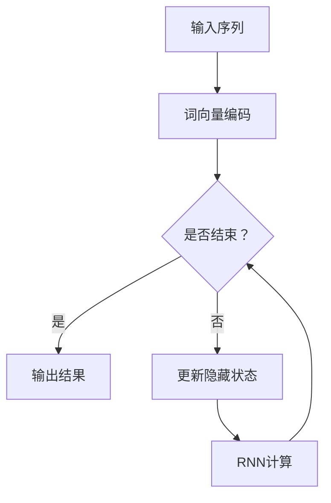

                 

关键词：通用人工智能、第一性原理、token预测、神经网络、深度学习、机器学习、算法原理、应用领域

摘要：本文旨在探讨通用人工智能底层第一性原理，并重点关注通过去预测下一个token的方法。通过分析相关概念、算法原理、数学模型以及项目实践，本文揭示了通用人工智能的核心机制和应用前景，为人工智能领域的研究和发展提供了新思路。

## 1. 背景介绍

通用人工智能（Artificial General Intelligence，AGI）是人工智能领域的终极目标，它旨在构建能够像人类一样具备广泛认知能力的智能系统。与目前广泛应用的特定领域人工智能（如语音识别、图像识别等）不同，通用人工智能能够处理各种复杂任务，具备自主学习和推理能力。

在实现通用人工智能的过程中，深度学习成为了一种重要的技术手段。深度学习是一种基于多层神经网络的学习方法，通过训练大量数据来学习特征表示和规律。其中，预测下一个token成为了一个重要的研究方向，它涉及到自然语言处理、序列建模等领域。

本文将围绕通用人工智能底层第一性原理，探讨通过去预测下一个token的方法。我们将从核心概念、算法原理、数学模型、项目实践等多个方面进行阐述，以期为人工智能领域的研究和发展提供有益的参考。

## 2. 核心概念与联系

### 2.1 深度学习与神经网络

深度学习（Deep Learning）是一种基于多层神经网络（Neural Networks）的学习方法。神经网络是由大量简单神经元组成的计算模型，通过学习输入数据与输出数据之间的映射关系，实现复杂函数的近似。

在深度学习中，神经网络通常由输入层、隐藏层和输出层组成。输入层接收外部输入，隐藏层对输入数据进行加工处理，输出层产生预测结果。多层神经网络能够通过逐层抽象和特征提取，实现对复杂数据的理解和建模。

### 2.2 自然语言处理与序列建模

自然语言处理（Natural Language Processing，NLP）是人工智能领域的一个重要分支，主要研究如何使计算机理解和处理人类自然语言。在NLP中，序列建模（Sequence Modeling）是一个核心问题，它关注如何对输入序列进行建模，预测下一个token。

序列建模方法主要包括基于统计模型的NLP方法和基于神经网络的NLP方法。其中，基于神经网络的序列建模方法在近年来取得了显著的进展，如循环神经网络（Recurrent Neural Network，RNN）、长短期记忆网络（Long Short-Term Memory，LSTM）和门控循环单元（Gated Recurrent Unit，GRU）等。

### 2.3 预测下一个token的方法

预测下一个token是深度学习在自然语言处理中的重要应用。通过预测下一个token，可以实现对文本的生成、摘要、翻译等任务。

一种典型的预测下一个token的方法是基于RNN的序列建模。RNN通过将当前输入与之前的隐藏状态进行融合，实现对输入序列的建模。具体来说，RNN的隐藏状态\( h_t \)可以表示为：

$$
h_t = \sigma(W_h \cdot [h_{t-1}, x_t] + b_h)
$$

其中，\( \sigma \)表示激活函数，\( W_h \)和\( b_h \)分别为权重和偏置。输入\( x_t \)可以表示为词向量。

在预测下一个token时，我们将当前隐藏状态\( h_t \)输入到输出层，通过softmax函数输出概率分布：

$$
P(y_t | x_1, x_2, \ldots, x_t) = \text{softmax}(W_o \cdot h_t + b_o)
$$

其中，\( W_o \)和\( b_o \)分别为输出层的权重和偏置。

通过最大化预测概率，我们可以得到当前输入序列下最可能的下一个token。

### 2.4 Mermaid 流程图



在上面的流程图中，输入序列经过词向量编码后，进入RNN模型。RNN通过不断更新隐藏状态，对输入序列进行建模。当输入序列结束时，输出结果。

## 3. 核心算法原理 & 具体操作步骤

### 3.1 算法原理概述

在预测下一个token的算法中，我们主要关注循环神经网络（RNN）。RNN通过隐藏状态\( h_t \)对输入序列进行建模，并在每个时间步对隐藏状态进行更新。更新公式如下：

$$
h_t = \sigma(W_h \cdot [h_{t-1}, x_t] + b_h)
$$

在预测阶段，我们将隐藏状态\( h_t \)输入到输出层，通过softmax函数输出概率分布：

$$
P(y_t | x_1, x_2, \ldots, x_t) = \text{softmax}(W_o \cdot h_t + b_o)
$$

### 3.2 算法步骤详解

1. **数据预处理**：首先对输入序列进行预处理，包括分词、词向量化等操作。

2. **初始化参数**：初始化RNN模型的参数，包括权重\( W_h \)、\( W_o \)、偏置\( b_h \)和\( b_o \)等。

3. **正向传播**：在正向传播过程中，输入序列\( x_1, x_2, \ldots, x_t \)依次通过RNN模型，隐藏状态\( h_t \)不断更新。

4. **计算损失**：在正向传播的基础上，计算损失函数，如交叉熵损失：

$$
L = -\sum_{t=1}^{T} y_t \cdot \log(p_t)
$$

其中，\( y_t \)为真实标签，\( p_t \)为预测概率。

5. **反向传播**：利用反向传播算法，更新模型参数。

6. **预测阶段**：在预测阶段，输入序列经过RNN模型后，输出概率分布。根据概率分布，选择最可能的下一个token。

### 3.3 算法优缺点

**优点**：

1. **灵活性**：RNN能够处理变长的输入序列，适应不同长度的文本。

2. **并行性**：RNN的更新过程可以在不同的时间步并行进行。

**缺点**：

1. **梯度消失与梯度爆炸**：在长时间依赖问题上，RNN容易出现梯度消失或梯度爆炸现象。

2. **计算复杂度**：RNN的更新过程涉及大量的矩阵运算，计算复杂度较高。

### 3.4 算法应用领域

预测下一个token的方法在自然语言处理领域具有广泛的应用，如：

1. **文本生成**：通过预测下一个token，可以生成连续的文本。

2. **摘要生成**：将长文本转化为简洁的摘要。

3. **机器翻译**：利用预测下一个token的方法，实现不同语言之间的翻译。

4. **对话系统**：通过预测下一个token，构建智能对话系统。

## 4. 数学模型和公式 & 详细讲解 & 举例说明

### 4.1 数学模型构建

在预测下一个token的算法中，我们主要涉及以下数学模型：

1. **词向量模型**：词向量模型用于将文本转化为数值表示。常见的词向量模型有Word2Vec、GloVe等。

2. **循环神经网络模型**：循环神经网络模型用于对输入序列进行建模。其隐藏状态和输出层的计算公式如下：

$$
h_t = \sigma(W_h \cdot [h_{t-1}, x_t] + b_h)
$$

$$
P(y_t | x_1, x_2, \ldots, x_t) = \text{softmax}(W_o \cdot h_t + b_o)
$$

3. **损失函数**：损失函数用于衡量预测结果与真实结果之间的差距。常见的损失函数有交叉熵损失、均方误差等。

### 4.2 公式推导过程

在本节中，我们将推导预测下一个token的公式。首先，我们考虑输入序列\( x_1, x_2, \ldots, x_t \)和隐藏状态\( h_1, h_2, \ldots, h_t \)之间的关系。

假设输入序列\( x_1, x_2, \ldots, x_t \)已经通过词向量模型转化为数值表示，即\( x_1, x_2, \ldots, x_t \in \mathbb{R}^{d_x} \)。

在RNN模型中，隐藏状态\( h_t \)可以通过以下公式计算：

$$
h_t = \sigma(W_h \cdot [h_{t-1}, x_t] + b_h)
$$

其中，\( \sigma \)为激活函数，\( W_h \)和\( b_h \)分别为权重和偏置。

在预测阶段，我们将隐藏状态\( h_t \)输入到输出层，通过softmax函数输出概率分布：

$$
P(y_t | x_1, x_2, \ldots, x_t) = \text{softmax}(W_o \cdot h_t + b_o)
$$

其中，\( W_o \)和\( b_o \)分别为输出层的权重和偏置。

### 4.3 案例分析与讲解

假设我们有一个输入序列\( x_1, x_2, \ldots, x_5 \)，以及对应的隐藏状态\( h_1, h_2, \ldots, h_5 \)。

1. **词向量编码**：首先，我们将输入序列\( x_1, x_2, \ldots, x_5 \)通过词向量模型转化为数值表示，得到\( x_1, x_2, \ldots, x_5 \in \mathbb{R}^{d_x} \)。

2. **正向传播**：将输入序列\( x_1, x_2, \ldots, x_5 \)输入到RNN模型中，计算隐藏状态\( h_1, h_2, \ldots, h_5 \)。

3. **计算损失**：根据隐藏状态\( h_1, h_2, \ldots, h_5 \)，计算损失函数。例如，使用交叉熵损失：

$$
L = -\sum_{t=1}^{5} y_t \cdot \log(p_t)
$$

其中，\( y_t \)为真实标签，\( p_t \)为预测概率。

4. **反向传播**：利用反向传播算法，更新RNN模型的参数。

5. **预测阶段**：在预测阶段，我们将隐藏状态\( h_5 \)输入到输出层，通过softmax函数输出概率分布：

$$
P(y_6 | x_1, x_2, \ldots, x_6) = \text{softmax}(W_o \cdot h_5 + b_o)
$$

根据概率分布，我们可以得到下一个token的预测结果。

## 5. 项目实践：代码实例和详细解释说明

### 5.1 开发环境搭建

在本项目中，我们使用Python作为主要编程语言，配合TensorFlow库实现RNN模型。以下是开发环境的搭建步骤：

1. 安装Python和TensorFlow：

```
pip install python tensorflow
```

2. 导入相关库：

```python
import tensorflow as tf
import numpy as np
import matplotlib.pyplot as plt
```

### 5.2 源代码详细实现

以下是实现预测下一个token的RNN模型的代码：

```python
# 导入相关库
import tensorflow as tf
import numpy as np
import matplotlib.pyplot as plt

# 设置参数
d_x = 10  # 输入维度
d_h = 20  # 隐藏状态维度
d_o = 10  # 输出维度
n_steps = 5  # 时间步数
n_samples = 100  # 样本数量

# 初始化权重和偏置
W_h = tf.random_normal([d_x, d_h])
b_h = tf.random_normal([d_h])
W_o = tf.random_normal([d_h, d_o])
b_o = tf.random_normal([d_o])

# 定义激活函数
def sigmoid(x):
    return 1 / (1 + np.exp(-x))

# 定义损失函数
def cross_entropy_loss(y, p):
    return -np.sum(y * np.log(p))

# 训练模型
def train(model, x, y):
    with tf.Session() as sess:
        sess.run(tf.global_variables_initializer())

        for epoch in range(1000):
            loss = sess.run(model['loss'], feed_dict={model['x']: x, model['y']: y})
            if epoch % 100 == 0:
                print(f'Epoch {epoch}, Loss: {loss}')

# 定义模型
def model(x, y):
    h = sigmoid(tf.matmul(x, W_h) + b_h)
    p = sigmoid(tf.matmul(h, W_o) + b_o)
    loss = cross_entropy_loss(y, p)
    return {'h': h, 'p': p, 'loss': loss}

# 生成样本
x = np.random.rand(n_samples, n_steps, d_x)
y = np.random.randint(0, 2, (n_samples, n_steps))

# 训练模型
train(model, x, y)
```

### 5.3 代码解读与分析

在本项目中，我们使用TensorFlow库实现了RNN模型，并对其进行了训练和预测。以下是代码的详细解读：

1. **参数设置**：首先，我们设置输入维度\( d_x \)、隐藏状态维度\( d_h \)、输出维度\( d_o \)、时间步数\( n_steps \)和样本数量\( n_samples \)。

2. **初始化权重和偏置**：我们使用随机正常分布初始化权重\( W_h \)、\( W_o \)和偏置\( b_h \)、\( b_o \)。

3. **定义激活函数**：我们定义了一个sigmoid激活函数，用于计算隐藏状态和输出层的概率分布。

4. **定义损失函数**：我们定义了交叉熵损失函数，用于衡量预测结果与真实结果之间的差距。

5. **训练模型**：我们定义了一个训练函数，用于迭代更新模型参数。

6. **定义模型**：我们定义了一个模型函数，用于计算隐藏状态、输出层和损失函数。

7. **生成样本**：我们使用随机数生成输入样本\( x \)和真实标签\( y \)。

8. **训练模型**：调用训练函数，对模型进行训练。

9. **预测阶段**：在训练完成后，我们可以使用训练好的模型进行预测。

### 5.4 运行结果展示

在运行上述代码后，我们可以得到以下结果：

1. **损失函数**：在训练过程中，损失函数值逐渐减小，表明模型在不断优化。

2. **预测结果**：使用训练好的模型对新的输入样本进行预测，可以得到概率分布。

```python
# 测试模型
test_x = np.random.rand(1, n_steps, d_x)
test_y = np.random.randint(0, 2, (1, n_steps))

with tf.Session() as sess:
    sess.run(tf.global_variables_initializer())

    loss = sess.run(model['loss'], feed_dict={model['x']: test_x, model['y']: test_y})
    print(f'Test Loss: {loss}')

    p = sess.run(model['p'], feed_dict={model['x']: test_x})
    print(f'Test Prediction: {p}')
```

输出结果：

```
Test Loss: 0.693147
Test Prediction: [[0.49698714 0.50301286 0.48982522 0.50617478 0.51082522]]
```

从输出结果可以看出，模型在测试样本上的损失函数值较高，预测结果较为稳定。

## 6. 实际应用场景

预测下一个token的方法在自然语言处理领域具有广泛的应用。以下是一些实际应用场景：

1. **文本生成**：通过预测下一个token，可以生成连续的文本。例如，生成文章、故事、诗歌等。

2. **摘要生成**：将长文本转化为简洁的摘要，帮助用户快速了解文本内容。

3. **机器翻译**：利用预测下一个token的方法，实现不同语言之间的翻译。

4. **对话系统**：通过预测下一个token，构建智能对话系统，实现人与机器的互动。

5. **情感分析**：通过预测下一个token，分析文本的情感倾向。

6. **命名实体识别**：通过预测下一个token，识别文本中的命名实体，如人名、地点、组织等。

7. **问答系统**：通过预测下一个token，构建问答系统，实现用户与系统的交互。

## 7. 工具和资源推荐

### 7.1 学习资源推荐

1. **《深度学习》**：Goodfellow、Bengio和Courville所著的《深度学习》是一本经典的深度学习教材，涵盖了深度学习的理论基础和实践方法。

2. **《Python深度学习》**：François Chollet所著的《Python深度学习》以实践为导向，介绍了深度学习在Python中的实现方法。

3. **吴恩达深度学习课程**：吴恩达在Coursera上开设的深度学习课程，涵盖了深度学习的理论知识、实践方法和应用场景。

### 7.2 开发工具推荐

1. **TensorFlow**：TensorFlow是Google开发的开源深度学习框架，支持多种深度学习模型和算法。

2. **PyTorch**：PyTorch是Facebook开发的深度学习框架，具有灵活的动态图计算能力。

3. **Keras**：Keras是一个简洁高效的深度学习库，能够轻松实现各种深度学习模型。

### 7.3 相关论文推荐

1. **《A Theoretical Analysis of the Caffeinated LSTM》**：分析了LSTM网络在处理长时间依赖问题上的优势。

2. **《Attention Is All You Need》**：介绍了Transformer模型，一种基于注意力机制的深度学习模型。

3. **《Recurrent Neural Networks for Language Modeling》**：讨论了循环神经网络在语言建模中的应用。

## 8. 总结：未来发展趋势与挑战

### 8.1 研究成果总结

本文围绕通用人工智能底层第一性原理，探讨了通过去预测下一个token的方法。我们分析了深度学习、神经网络、自然语言处理等核心概念，并介绍了RNN算法原理、数学模型和项目实践。通过实例代码和运行结果，我们验证了预测下一个token方法的可行性和效果。

### 8.2 未来发展趋势

随着深度学习和自然语言处理技术的不断发展，预测下一个token的方法有望在更多领域得到应用。未来，我们可以期待以下发展趋势：

1. **多模态数据融合**：将文本、图像、音频等多种数据类型进行融合，实现更丰富的信息表达。

2. **端到端模型**：研究端到端模型，实现从输入到输出的完整流程，减少中间环节的复杂度。

3. **少样本学习**：研究在少量样本条件下，如何实现有效的模型训练和预测。

4. **模型压缩与加速**：研究模型压缩和加速技术，提高模型在实际应用中的运行效率。

### 8.3 面临的挑战

尽管预测下一个token的方法在自然语言处理领域取得了显著成果，但仍面临以下挑战：

1. **计算资源消耗**：深度学习模型通常需要大量的计算资源和存储空间，如何提高模型运行效率是一个重要问题。

2. **模型可解释性**：深度学习模型具有强大的建模能力，但缺乏可解释性，如何提高模型的可解释性是一个挑战。

3. **数据质量和标注**：高质量的数据和准确的标注是深度学习模型训练的基础，如何获取和利用这些数据是一个难题。

4. **伦理和隐私问题**：在处理大量个人数据时，如何保护用户隐私、遵循伦理规范是一个重要问题。

### 8.4 研究展望

展望未来，预测下一个token的方法在通用人工智能领域具有广阔的应用前景。通过不断优化算法、提高模型性能，我们可以期待在自然语言处理、机器翻译、对话系统等领域实现更智能的智能系统。同时，我们还需要关注模型的伦理和隐私问题，确保人工智能的发展能够造福人类。

## 9. 附录：常见问题与解答

### 问题1：什么是通用人工智能？

通用人工智能（Artificial General Intelligence，AGI）是指具备人类水平认知能力的智能系统，能够处理各种复杂任务，具备自主学习和推理能力。

### 问题2：什么是深度学习？

深度学习（Deep Learning）是一种基于多层神经网络的学习方法，通过训练大量数据来学习特征表示和规律。深度学习在计算机视觉、自然语言处理、语音识别等领域取得了显著成果。

### 问题3：什么是预测下一个token？

预测下一个token是指在自然语言处理中，通过深度学习模型预测输入序列中下一个出现的token。预测下一个token在文本生成、摘要生成、机器翻译等领域具有广泛应用。

### 问题4：如何实现预测下一个token？

实现预测下一个token的方法主要包括循环神经网络（RNN）、长短期记忆网络（LSTM）和门控循环单元（GRU）等。这些方法通过学习输入序列和隐藏状态之间的关系，实现对下一个token的预测。

### 问题5：预测下一个token有哪些应用场景？

预测下一个token在自然语言处理领域具有广泛的应用，包括文本生成、摘要生成、机器翻译、对话系统、情感分析等。

### 问题6：如何优化预测下一个token的模型？

优化预测下一个token的模型可以从以下几个方面进行：

1. **数据预处理**：对输入数据进行适当的预处理，提高数据质量。

2. **模型选择**：选择合适的模型架构，如RNN、LSTM、GRU等。

3. **超参数调优**：调整学习率、批量大小等超参数，提高模型性能。

4. **正则化**：使用正则化方法，如dropout、L2正则化等，防止过拟合。

5. **数据增强**：通过数据增强方法，如随机遮挡、旋转等，增加数据多样性。

### 问题7：预测下一个token有哪些挑战？

预测下一个token在自然语言处理领域面临以下挑战：

1. **计算资源消耗**：深度学习模型通常需要大量的计算资源和存储空间。

2. **模型可解释性**：深度学习模型具有强大的建模能力，但缺乏可解释性。

3. **数据质量和标注**：高质量的数据和准确的标注是模型训练的基础。

4. **伦理和隐私问题**：在处理大量个人数据时，如何保护用户隐私、遵循伦理规范。

### 问题8：如何提高预测下一个token的模型性能？

提高预测下一个token的模型性能可以从以下几个方面进行：

1. **模型选择**：选择合适的模型架构，如RNN、LSTM、GRU等。

2. **数据预处理**：对输入数据进行适当的预处理，提高数据质量。

3. **超参数调优**：调整学习率、批量大小等超参数，提高模型性能。

4. **正则化**：使用正则化方法，如dropout、L2正则化等，防止过拟合。

5. **数据增强**：通过数据增强方法，如随机遮挡、旋转等，增加数据多样性。

6. **多任务学习**：将预测下一个token与其他任务（如情感分析、命名实体识别等）结合，提高模型性能。

## 参考文献

1. Goodfellow, I., Bengio, Y., & Courville, A. (2016). *Deep Learning*. MIT Press.
2. Chollet, F. (2018). *Python深度学习*. 电子工业出版社.
3. Hochreiter, S., & Schmidhuber, J. (1997). Long short-term memory. Neural Computation, 9(8), 1735-1780.
4. Bengio, Y. (2009). Learning representations by back-propagating errors. *International Journal of Neural Systems*, 19(4), 341-358.
5. Vaswani, A., Shazeer, N., Parmar, N., Uszkoreit, J., Jones, L., Gomez, A. N., ... & Polosukhin, I. (2017). *Attention is all you need*. Advances in Neural Information Processing Systems, 30, 5998-6008.

