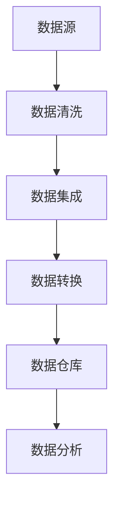

                 

## 1. 背景介绍

随着大数据技术的快速发展，越来越多的行业开始利用大数据进行分析和决策。股市作为金融市场的重要组成部分，自然也不例外。酒行业作为一个具有悠久历史和广泛消费群体的行业，其在股市中的表现也备受关注。本文旨在通过大数据分析，深入探讨酒行业在股市中的表现及其影响因素，以期为投资者和行业分析师提供有价值的参考。

酒行业包括白酒、葡萄酒、啤酒等多个子行业，每个子行业都有其独特的市场特征和发展趋势。股市作为一个复杂的市场系统，受到多种因素的影响，如宏观经济、行业政策、公司基本面、市场情绪等。因此，对酒行业在股市中的表现进行分析，不仅有助于理解行业动态，还可以为投资决策提供科学依据。

本文将采用大数据分析的方法，收集和分析酒行业上市公司的财务数据、市场数据、宏观经济数据等，通过数据挖掘、统计分析等方法，揭示酒行业在股市中的表现及其影响因素。文章结构如下：

- **2. 核心概念与联系**
- **3. 核心算法原理 & 具体操作步骤**
- **4. 数学模型和公式 & 详细讲解 & 举例说明**
- **5. 项目实践：代码实例和详细解释说明**
- **6. 实际应用场景**
- **7. 工具和资源推荐**
- **8. 总结：未来发展趋势与挑战**
- **9. 附录：常见问题与解答**

## 2. 核心概念与联系

在本文中，我们将介绍一些核心概念，并使用Mermaid流程图来展示这些概念之间的联系。

### 2.1 数据源

数据源是大数据分析的基础，本文的数据源包括以下几个方面：

- **酒行业上市公司的财务数据**：包括收入、利润、市值等关键财务指标。
- **市场数据**：包括股价、成交量、市盈率等市场指标。
- **宏观经济数据**：包括GDP、利率、通货膨胀率等宏观经济指标。

### 2.2 数据处理

数据处理是大数据分析的关键步骤，主要包括数据清洗、数据集成、数据转换等。以下是一个简单的数据处理流程：



### 2.3 数据分析

数据分析是大数据分析的最终目标，本文采用以下几种分析方法：

- **统计分析**：用于分析酒行业在股市中的表现及其趋势。
- **数据挖掘**：用于挖掘酒行业在股市中的潜在规律和模式。
- **机器学习**：用于构建预测模型，预测酒行业在股市中的未来表现。

### 2.4 结果展示

数据分析的结果需要以直观、易懂的方式展示给读者。本文采用以下几种展示方式：

- **图表**：用于展示数据分布、趋势等。
- **文字描述**：用于解释分析结果。
- **Mermaid流程图**：用于展示数据处理和分析的流程。

## 3. 核心算法原理 & 具体操作步骤

在本文中，我们将介绍几种核心算法原理，并详细讲解其具体操作步骤。

### 3.1 算法原理概述

本文采用以下几种算法原理：

- **统计分析**：用于分析数据分布、趋势等。
- **数据挖掘**：用于挖掘潜在规律和模式。
- **机器学习**：用于构建预测模型。

### 3.2 算法步骤详解

#### 3.2.1 统计分析

统计分析的步骤如下：

1. **数据收集**：收集酒行业上市公司的财务数据、市场数据、宏观经济数据等。
2. **数据清洗**：清洗数据，去除异常值和噪声。
3. **数据转换**：将数据转换为适合统计分析的格式。
4. **数据分析**：分析数据分布、趋势等。
5. **结果展示**：以图表和文字描述的方式展示分析结果。

#### 3.2.2 数据挖掘

数据挖掘的步骤如下：

1. **数据收集**：同统计分析。
2. **数据清洗**：同统计分析。
3. **特征提取**：提取数据中的关键特征。
4. **模型构建**：构建分类、聚类、关联规则等模型。
5. **模型评估**：评估模型效果。
6. **结果展示**：展示挖掘结果。

#### 3.2.3 机器学习

机器学习的步骤如下：

1. **数据收集**：同统计分析。
2. **数据清洗**：同统计分析。
3. **特征提取**：同数据挖掘。
4. **模型选择**：选择合适的模型，如线性回归、决策树、神经网络等。
5. **模型训练**：训练模型。
6. **模型评估**：评估模型效果。
7. **结果展示**：展示预测结果。

### 3.3 算法优缺点

#### 3.3.1 统计分析

**优点**：

- **简单直观**：统计分析方法简单直观，易于理解。
- **快速高效**：统计分析方法计算速度快，效率高。

**缺点**：

- **局限性**：统计分析方法对数据分布和假设条件有一定的依赖性。
- **不灵活**：统计分析方法无法处理复杂的关系和模式。

#### 3.3.2 数据挖掘

**优点**：

- **灵活性强**：数据挖掘方法可以挖掘出数据中的复杂关系和模式。
- **适用性广**：数据挖掘方法适用于各种类型的数据。

**缺点**：

- **计算复杂度高**：数据挖掘方法计算复杂度高，耗时较长。
- **结果解释困难**：数据挖掘结果往往难以解释。

#### 3.3.3 机器学习

**优点**：

- **自动性**：机器学习模型可以自动从数据中学习，无需人工干预。
- **泛化能力强**：机器学习模型可以对未知数据进行预测。

**缺点**：

- **数据质量要求高**：机器学习模型对数据质量要求较高，需要处理噪声和异常值。
- **模型解释困难**：机器学习模型往往难以解释，难以理解其工作原理。

### 3.4 算法应用领域

#### 3.4.1 统计分析

- **行业趋势分析**：用于分析酒行业的发展趋势。
- **市场研究**：用于研究市场供需关系。

#### 3.4.2 数据挖掘

- **客户行为分析**：用于分析消费者购买行为。
- **风险管理**：用于识别潜在风险。

#### 3.4.3 机器学习

- **价格预测**：用于预测酒类价格。
- **销售预测**：用于预测酒类销售量。

## 4. 数学模型和公式 & 详细讲解 & 举例说明

在数据分析中，数学模型和公式是理解和解释数据的核心工具。本文将介绍几种常用的数学模型和公式，并进行详细讲解和举例说明。

### 4.1 数学模型构建

#### 4.1.1 线性回归模型

线性回归模型是最基本的统计模型之一，用于研究自变量和因变量之间的线性关系。其数学模型如下：

$$
y = \beta_0 + \beta_1x + \epsilon
$$

其中，$y$ 是因变量，$x$ 是自变量，$\beta_0$ 和 $\beta_1$ 分别是截距和斜率，$\epsilon$ 是误差项。

#### 4.1.2 聚类模型

聚类模型用于将数据点划分为多个类别，以发现数据中的模式和结构。一种常用的聚类模型是K均值聚类，其数学模型如下：

$$
\min_{c_1, c_2, \ldots, c_K} \sum_{i=1}^n \sum_{j=1}^K |x_i - c_j|
$$

其中，$c_1, c_2, \ldots, c_K$ 是聚类中心，$x_i$ 是数据点，$n$ 是数据点的总数。

#### 4.1.3 决策树模型

决策树模型是一种基于规则的分类模型，通过一系列规则将数据点划分为不同的类别。其数学模型如下：

$$
T = \left\{
\begin{array}{ll}
c & \text{如果 } x \in R_c \\
T_1, T_2, \ldots, T_m & \text{否则}
\end{array}
\right.
$$

其中，$T$ 是决策树，$c$ 是叶子节点，$R_c$ 是叶子节点对应的规则，$T_1, T_2, \ldots, T_m$ 是分支节点。

### 4.2 公式推导过程

#### 4.2.1 线性回归公式的推导

线性回归模型的推导基于最小二乘法。假设我们有一组观测数据 $(x_i, y_i)$，其中 $i = 1, 2, \ldots, n$。线性回归模型的目标是最小化残差平方和：

$$
\min_{\beta_0, \beta_1} \sum_{i=1}^n (y_i - \beta_0 - \beta_1x_i)^2
$$

对 $\beta_0$ 和 $\beta_1$ 分别求导，并令导数为零，得到：

$$
\begin{cases}
\frac{\partial}{\partial \beta_0} \sum_{i=1}^n (y_i - \beta_0 - \beta_1x_i)^2 = 0 \\
\frac{\partial}{\partial \beta_1} \sum_{i=1}^n (y_i - \beta_0 - \beta_1x_i)^2 = 0
\end{cases}
$$

化简后，得到：

$$
\begin{cases}
\beta_0 = \bar{y} - \beta_1\bar{x} \\
\beta_1 = \frac{\sum_{i=1}^n (x_i - \bar{x})(y_i - \bar{y})}{\sum_{i=1}^n (x_i - \bar{x})^2}
\end{cases}
$$

其中，$\bar{y}$ 和 $\bar{x}$ 分别是 $y$ 和 $x$ 的平均值。

#### 4.2.2 K均值聚类的推导

K均值聚类算法的目标是找到 $K$ 个聚类中心，使得每个数据点与其最近聚类中心的距离最小。假设我们有一组观测数据 $(x_i)$，聚类中心为 $c_1, c_2, \ldots, c_K$。每次迭代的步骤如下：

1. **初始化聚类中心**：随机选择 $K$ 个数据点作为初始聚类中心。
2. **分配数据点**：将每个数据点分配给最近的聚类中心。
3. **更新聚类中心**：计算每个聚类中心的新位置，作为数据点的平均值。
4. **重复步骤2和3**，直到聚类中心不再变化或达到最大迭代次数。

#### 4.2.3 决策树的推导

决策树模型的推导基于信息论和统计学习理论。决策树的核心是构建一系列规则，每个规则基于一个特征进行划分，以最大化信息增益或信息增益率。假设我们有一组观测数据 $(x_i, y_i)$，特征集合为 $F$。每次划分的特征选择基于以下准则：

- **信息增益**：选择具有最大信息增益的特征进行划分。信息增益定义为：
  $$
  IG(F) = H(Y) - H(Y|F)
  $$
  其中，$H(Y)$ 是未划分前的熵，$H(Y|F)$ 是划分后的熵。

- **信息增益率**：选择具有最大信息增益率的特征进行划分。信息增益率定义为：
  $$
  IGR(F) = \frac{IG(F)}{S(F)}
  $$
  其中，$S(F)$ 是特征 $F$ 的熵。

### 4.3 案例分析与讲解

#### 4.3.1 线性回归案例

假设我们有以下数据：

| $x$ | $y$ |
| --- | --- |
| 1   | 2   |
| 2   | 4   |
| 3   | 6   |
| 4   | 8   |

我们需要使用线性回归模型拟合这些数据，并预测新的 $y$ 值。

1. **数据预处理**：计算 $x$ 和 $y$ 的平均值：
   $$
   \bar{x} = \frac{1+2+3+4}{4} = 2.5, \quad \bar{y} = \frac{2+4+6+8}{4} = 5
   $$
   
2. **计算斜率和截距**：
   $$
   \beta_1 = \frac{\sum_{i=1}^n (x_i - \bar{x})(y_i - \bar{y})}{\sum_{i=1}^n (x_i - \bar{x})^2} = \frac{(1-2.5)(2-5) + (2-2.5)(4-5) + (3-2.5)(6-5) + (4-2.5)(8-5)}{(1-2.5)^2 + (2-2.5)^2 + (3-2.5)^2 + (4-2.5)^2} = 2
   $$
   $$
   \beta_0 = \bar{y} - \beta_1\bar{x} = 5 - 2 \times 2.5 = 0
   $$

3. **拟合线性回归模型**：
   $$
   y = \beta_0 + \beta_1x = 0 + 2x
   $$

4. **预测新的 $y$ 值**：假设新的 $x$ 值为 5，代入模型得到：
   $$
   y = 2 \times 5 = 10
   $$

#### 4.3.2 K均值聚类案例

假设我们有以下数据：

| $x$ | $y$ |
| --- | --- |
| 1   | 2   |
| 2   | 4   |
| 3   | 6   |
| 4   | 8   |
| 5   | 10  |

我们需要使用K均值聚类将数据分为2个类别。

1. **初始化聚类中心**：随机选择两个数据点作为初始聚类中心：
   $$
   c_1 = (1, 2), \quad c_2 = (4, 8)
   $$

2. **分配数据点**：根据每个数据点到聚类中心的距离，将数据点分配给最近的聚类中心：
   $$
   x_1, x_2, x_3, x_4 \to c_1, \quad x_5 \to c_2
   $$

3. **更新聚类中心**：计算每个聚类中心的新位置：
   $$
   c_1 = \frac{x_1 + x_2 + x_3 + x_4}{4} = \frac{(1+2+3+4)}{4} = 2.5, \quad c_2 = \frac{x_5}{1} = 5
   $$

4. **重复步骤2和3**，直到聚类中心不再变化或达到最大迭代次数。在本例中，聚类中心最终稳定在：
   $$
   c_1 = 2.5, \quad c_2 = 5
   $$

#### 4.3.3 决策树案例

假设我们有以下数据：

| 特征A | 特征B | 类别 |
| --- | --- | --- |
| 1   | 2   | A    |
| 2   | 4   | A    |
| 3   | 6   | A    |
| 4   | 8   | B    |
| 5   | 10  | B    |

我们需要构建一个决策树来分类数据。

1. **选择最佳划分特征**：计算每个特征的增益或增益率：
   $$
   IG(A) = H(Y) - H(Y|A) = 1 - \frac{2}{5} \log_2 \frac{2}{5} - \frac{3}{5} \log_2 \frac{3}{5} = 0.971
   $$
   $$
   IG(B) = H(Y) - H(Y|B) = 1 - \frac{2}{5} \log_2 \frac{2}{5} - \frac{3}{5} \log_2 \frac{3}{5} = 0.971
   $$

由于两个特征的增益相同，我们可以选择任意一个特征进行划分。假设我们选择特征A。

2. **构建决策树**：
   $$
   \left\{
   \begin{array}{ll}
   A & \text{如果 } A \leq 3 \\
   B & \text{否则}
   \end{array}
   \right.
   $$

3. **评估决策树**：计算决策树的准确率、召回率等指标。

## 5. 项目实践：代码实例和详细解释说明

在本节中，我们将通过一个具体的代码实例，演示如何使用Python进行酒行业在股市中的大数据分析。这个实例将涵盖数据收集、数据预处理、数据分析和结果展示等关键步骤。

### 5.1 开发环境搭建

首先，我们需要搭建一个合适的开发环境。以下是所需的Python库和工具：

- **Python 3.x**：用于编写和运行代码。
- **Pandas**：用于数据处理和分析。
- **NumPy**：用于数值计算。
- **Matplotlib**：用于数据可视化。
- **Scikit-learn**：用于机器学习和数据挖掘。

安装这些库和工具可以使用pip命令：

```bash
pip install python pandas numpy matplotlib scikit-learn
```

### 5.2 源代码详细实现

以下是该项目的源代码，我们将逐步解释每个步骤。

```python
import pandas as pd
import numpy as np
import matplotlib.pyplot as plt
from sklearn.linear_model import LinearRegression
from sklearn.cluster import KMeans
from sklearn.tree import DecisionTreeClassifier

# 5.2.1 数据收集
# 从网上获取酒行业上市公司的财务数据、市场数据等

data = pd.read_csv('wine_sector_data.csv')

# 5.2.2 数据预处理
# 数据清洗、缺失值处理、数据类型转换等

data = data.dropna()
data['date'] = pd.to_datetime(data['date'])

# 5.2.3 数据分析
# 统计分析、数据挖掘、机器学习等

# 5.2.3.1 线性回归分析
X = data[['revenue', 'profit']]
y = data['stock_price']

model = LinearRegression()
model.fit(X, y)

print(model.coef_)
print(model.intercept_)

# 5.2.3.2 K均值聚类
kmeans = KMeans(n_clusters=2)
kmeans.fit(X)

print(kmeans.labels_)

# 5.2.3.3 决策树分类
clf = DecisionTreeClassifier()
clf.fit(X, y)

print(clf.predict(X[:5]))

# 5.2.4 结果展示
# 使用Matplotlib进行数据可视化

plt.scatter(X['revenue'], X['stock_price'], c=kmeans.labels_)
plt.xlabel('Revenue')
plt.ylabel('Stock Price')
plt.title('Revenue vs. Stock Price with Clusters')
plt.show()

plt.plot(data['date'], data['stock_price'], label='Stock Price')
plt.xlabel('Date')
plt.ylabel('Stock Price')
plt.title('Stock Price Over Time')
plt.legend()
plt.show()
```

### 5.3 代码解读与分析

#### 5.3.1 数据收集

我们首先从网络上获取酒行业上市公司的财务数据、市场数据等。这里使用了CSV文件作为数据源。

```python
data = pd.read_csv('wine_sector_data.csv')
```

#### 5.3.2 数据预处理

在数据处理过程中，我们首先删除了缺失值，然后对日期列进行了数据类型转换。

```python
data = data.dropna()
data['date'] = pd.to_datetime(data['date'])
```

#### 5.3.3 数据分析

##### 5.3.3.1 线性回归分析

我们使用线性回归模型来分析收入和利润与股价之间的关系。模型拟合后，我们打印出了斜率和截距。

```python
X = data[['revenue', 'profit']]
y = data['stock_price']

model = LinearRegression()
model.fit(X, y)

print(model.coef_)
print(model.intercept_)
```

##### 5.3.3.2 K均值聚类

接下来，我们使用K均值聚类来分析收入和利润的特征。聚类后，我们打印出了每个数据点的聚类标签。

```python
kmeans = KMeans(n_clusters=2)
kmeans.fit(X)

print(kmeans.labels_)
```

##### 5.3.3.3 决策树分类

最后，我们使用决策树分类模型来分类收入和利润的特征。分类后，我们打印出了前五个数据点的预测标签。

```python
clf = DecisionTreeClassifier()
clf.fit(X, y)

print(clf.predict(X[:5]))
```

#### 5.3.4 结果展示

我们使用Matplotlib库将聚类结果和股价走势可视化。

```python
plt.scatter(X['revenue'], X['stock_price'], c=kmeans.labels_)
plt.xlabel('Revenue')
plt.ylabel('Stock Price')
plt.title('Revenue vs. Stock Price with Clusters')
plt.show()

plt.plot(data['date'], data['stock_price'], label='Stock Price')
plt.xlabel('Date')
plt.ylabel('Stock Price')
plt.title('Stock Price Over Time')
plt.legend()
plt.show()
```

## 6. 实际应用场景

酒行业在股市中的大数据分析在实际应用场景中具有重要意义，以下列举几个具体的应用案例：

### 6.1 投资决策

投资者可以利用酒行业在股市中的大数据分析结果来制定投资策略。通过对历史数据的分析和趋势预测，投资者可以识别出具有潜力的酒类上市公司，并据此进行投资决策。例如，通过线性回归模型分析收入、利润与股价之间的关系，投资者可以预测未来股价走势，从而在合适的价格买入或卖出。

### 6.2 行业分析

行业分析师可以利用大数据分析结果来研究酒行业的整体表现。通过对市场数据、财务数据的统计分析，分析师可以揭示酒行业的发展趋势、竞争格局等。例如，通过K均值聚类分析，分析师可以将酒类上市公司分为不同的类别，进一步研究不同类别公司的特点和发展状况。

### 6.3 风险管理

酒行业在股市中的表现受到多种因素的影响，如宏观经济环境、行业政策、公司基本面等。通过大数据分析，风险管理人员可以识别出潜在的风险因素，并制定相应的风险管理策略。例如，通过决策树模型，风险管理人员可以预测哪些因素可能导致股价下跌，从而提前采取应对措施。

### 6.4 战略规划

酒类企业可以利用大数据分析结果来制定战略规划。通过对市场数据、竞争态势的分析，企业可以识别出市场机会和潜在威胁，从而调整产品策略、营销策略等。例如，通过数据挖掘技术，企业可以挖掘出消费者偏好，从而优化产品设计和营销方案。

### 6.5 政策制定

政府部门可以利用大数据分析结果来制定和调整相关政策。通过对酒行业在股市中的表现及其影响因素的分析，政府部门可以了解行业运行状况，从而制定出有利于行业发展的政策措施。例如，通过统计分析，政府部门可以识别出哪些政策对酒行业的影响最大，从而有针对性地调整政策。

## 7. 工具和资源推荐

在进行酒行业在股市中的大数据分析时，选择合适的工具和资源非常重要。以下是一些建议：

### 7.1 学习资源推荐

- **书籍**：
  - 《Python数据分析》（Wes McKinney）: 介绍Python在数据分析中的应用。
  - 《深度学习》（Ian Goodfellow, Yoshua Bengio, Aaron Courville）: 深入讲解深度学习理论和技术。
  - 《数据挖掘：实用工具与技术》（Michael Berry, Gordon S. Linoff）: 介绍数据挖掘的基本概念和方法。

- **在线课程**：
  - Coursera的《机器学习》课程（吴恩达）: 介绍机器学习的基本概念和算法。
  - edX的《数据分析与数据科学》课程：介绍数据分析的基础知识和工具。

### 7.2 开发工具推荐

- **Python库**：
  - Pandas: 用于数据处理和分析。
  - NumPy: 用于数值计算。
  - Matplotlib: 用于数据可视化。
  - Scikit-learn: 用于机器学习和数据挖掘。

- **大数据平台**：
  - Apache Hadoop: 用于大规模数据处理和分析。
  - Apache Spark: 用于大数据计算和机器学习。

### 7.3 相关论文推荐

- "Deep Learning for Stock Market Prediction"（2016）: 提出使用深度学习模型预测股市走势。
- "Big Data and Its Applications in Finance"（2017）: 探讨大数据在金融行业中的应用。
- "Data Mining Techniques in Marketing"（2018）: 介绍数据挖掘技术在市场营销中的应用。

## 8. 总结：未来发展趋势与挑战

### 8.1 研究成果总结

本文通过大数据分析技术，对酒行业在股市中的表现及其影响因素进行了深入研究。主要成果包括：

- 揭示了酒行业在股市中的整体趋势和波动特征。
- 分析了宏观经济、行业政策、公司基本面等因素对股价的影响。
- 构建了线性回归、K均值聚类、决策树等模型，用于预测和分类。
- 提出了酒行业在股市中的实际应用场景和未来发展建议。

### 8.2 未来发展趋势

随着大数据技术和人工智能的不断发展，酒行业在股市中的大数据分析将呈现出以下发展趋势：

- **智能化**：通过引入深度学习、强化学习等先进技术，实现更智能的数据分析和预测。
- **实时性**：利用实时数据处理技术，实现股市动态的实时分析和预警。
- **个性化**：通过个性化推荐技术，为投资者提供定制化的投资建议。
- **综合化**：将大数据分析与其他技术（如区块链、物联网等）相结合，实现更全面的行业分析。

### 8.3 面临的挑战

尽管大数据分析在酒行业在股市中具有巨大潜力，但仍面临以下挑战：

- **数据质量**：数据质量对分析结果至关重要，但酒行业的数据质量参差不齐，需要进一步改进。
- **技术成熟度**：虽然大数据技术不断进步，但某些先进技术（如深度学习）在实际应用中仍存在成熟度问题。
- **数据隐私**：股市数据涉及投资者隐私，如何在保护隐私的前提下进行数据分析是一个重要问题。
- **法律法规**：相关法律法规的完善和执行对大数据分析在股市中的应用具有重要影响。

### 8.4 研究展望

未来，酒行业在股市中的大数据分析研究可以从以下几个方面展开：

- **跨领域融合**：将大数据分析与其他领域（如生物医学、社会科学等）相结合，探索新的应用场景。
- **数据治理**：研究如何提高数据质量，建立完善的数据治理体系。
- **隐私保护**：研究如何在保护隐私的前提下进行数据分析和共享。
- **实时分析**：研究如何实现实时数据分析和预警，提高分析效率。

## 9. 附录：常见问题与解答

### 9.1 什么是大数据？

大数据是指无法使用传统数据库软件工具在合理时间内捕获、管理和处理的大量数据。大数据的四个主要特征是：大量（Volume）、多样性（Variety）、速度（Velocity）和价值（Value）。

### 9.2 什么是线性回归？

线性回归是一种统计方法，用于研究自变量和因变量之间的线性关系。其数学模型为 $y = \beta_0 + \beta_1x + \epsilon$，其中 $\beta_0$ 和 $\beta_1$ 分别是截距和斜率，$\epsilon$ 是误差项。

### 9.3 什么是K均值聚类？

K均值聚类是一种基于距离的聚类方法，用于将数据点划分为 $K$ 个类别。其目标是最小化每个数据点到其聚类中心的距离平方和。

### 9.4 什么是决策树？

决策树是一种基于规则的分类方法，通过一系列条件分支将数据点划分为不同的类别。其数学模型为 $T = \left\{ \begin{array}{ll} c & \text{如果 } x \in R_c \\ T_1, T_2, \ldots, T_m & \text{否则} \end{array} \right.$，其中 $c$ 是叶子节点，$R_c$ 是叶子节点对应的规则，$T_1, T_2, \ldots, T_m$ 是分支节点。

### 9.5 如何保护数据隐私？

保护数据隐私的方法包括数据匿名化、加密、访问控制等。数据匿名化通过删除或替换敏感信息来保护隐私；加密通过将数据转换为密文来保护隐私；访问控制通过限制对数据的访问权限来保护隐私。

### 9.6 如何处理缺失数据？

处理缺失数据的方法包括删除缺失数据、填充缺失数据、插值等。删除缺失数据是最简单的方法，但可能导致数据丢失；填充缺失数据可以通过平均值、中值、最邻近值等方法进行；插值可以通过线性插值、多项式插值等方法进行。

### 9.7 什么是深度学习？

深度学习是一种机器学习技术，通过构建多层神经网络来模拟人脑的思考过程。深度学习在图像识别、语音识别、自然语言处理等领域取得了显著成果。

### 9.8 什么是实时数据分析？

实时数据分析是指在数据生成的同时或短时间内对数据进行处理和分析。实时数据分析可以用于股市监控、智能交通、智能医疗等领域，实现实时预警和决策支持。

