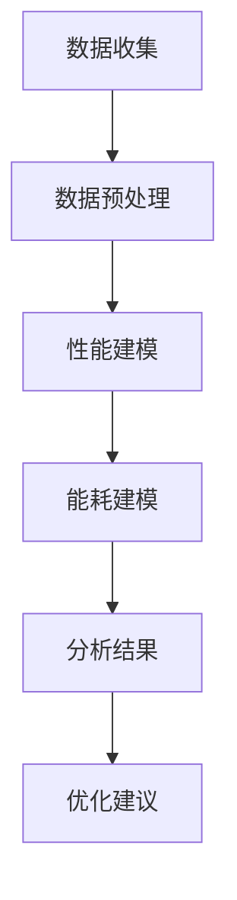

                 

关键词：量化分析，移动设备，性能优化，能耗管理，人工智能

摘要：随着移动设备的普及和应用的多样化，量化分析方法在移动设备中的应用变得越来越重要。本文将探讨量化分析方法在移动设备中的应用，包括性能优化、能耗管理和人工智能等方面的应用，旨在为相关领域的研发人员提供有价值的参考。

## 1. 背景介绍

### 移动设备的现状与发展趋势

移动设备作为人们日常生活中不可或缺的一部分，其应用场景和功能越来越多样化。从最初的电话功能到如今的多媒体娱乐、社交网络、移动办公等，移动设备的发展已经极大地改变了人们的生活方式。根据市场调研公司的数据，全球智能手机出货量在2022年已经超过了20亿部，这表明移动设备已经成为了全球范围内的重要通信工具。

随着移动设备的普及，其性能和功能也在不断提升。现代移动设备搭载了高性能的处理器、大容量的内存和高速的网络连接，使得用户可以轻松地运行复杂的应用程序和进行高强度的数据处理。然而，这也带来了新的挑战，即如何在有限的硬件资源下，实现更好的性能和能耗管理。

### 量化分析的基本概念

量化分析是一种基于数据分析和统计分析的方法，通过对大量数据的收集、处理和分析，从中提取出有价值的信息和规律。量化分析在许多领域都有广泛的应用，如金融、医学、工程等。在移动设备领域，量化分析可以帮助我们更好地理解设备的性能、能耗和使用习惯，从而为优化设备和应用提供科学依据。

## 2. 核心概念与联系

### 移动设备的性能与能耗模型

在移动设备中，性能和能耗是两个至关重要的指标。性能决定了设备能否满足用户的计算需求，而能耗则直接关系到设备的续航能力和用户体验。为了更好地进行量化分析，我们需要建立一个综合的性能与能耗模型。


在该模型中，输入变量包括处理器速度、内存大小、电池容量等，输出变量则是设备的性能指标和能耗指标。通过这个模型，我们可以对设备的性能和能耗进行量化分析，从而找出影响性能和能耗的关键因素。

### Mermaid 流程图

下面是一个简单的 Mermaid 流程图，展示了量化分析在移动设备性能优化中的应用流程。



## 3. 核心算法原理 & 具体操作步骤

### 3.1 算法原理概述

在移动设备中，量化分析的核心算法主要包括性能建模和能耗建模。性能建模旨在建立设备性能与输入参数之间的关系，从而预测设备在不同工作负载下的性能表现。能耗建模则旨在建立设备能耗与输入参数之间的关系，从而预测设备在不同工作负载下的能耗表现。

### 3.2 算法步骤详解

1. 数据收集：首先，我们需要收集设备的性能和能耗数据。这些数据可以通过模拟不同的工作负载，或在实际使用场景中采集。

2. 数据预处理：收集到的数据可能存在缺失、异常值等问题，因此需要对数据进行预处理，包括数据清洗、数据补全和数据归一化等。

3. 性能建模：使用统计方法或机器学习方法，对预处理后的数据进行建模，从而建立性能与输入参数之间的关系。

4. 能耗建模：同样地，使用统计方法或机器学习方法，对预处理后的数据进行建模，从而建立能耗与输入参数之间的关系。

5. 分析结果：根据建模结果，分析设备在不同工作负载下的性能和能耗表现，找出关键因素。

6. 优化建议：根据分析结果，提出优化建议，如调整处理器速度、内存大小等，以实现更好的性能和能耗管理。

### 3.3 算法优缺点

量化分析在移动设备中的应用具有以下优点：

- **全面性**：量化分析可以从多个维度对设备性能和能耗进行评估，提供全面的信息。
- **科学性**：基于数据和算法的分析结果更具科学性，可以指导实际优化工作。

然而，量化分析也存在一些缺点：

- **计算复杂度高**：量化分析通常涉及大量的数据计算，可能需要较长的计算时间。
- **对数据质量要求高**：数据质量对量化分析结果具有重要影响，数据质量差可能导致分析结果不准确。

### 3.4 算法应用领域

量化分析在移动设备中的应用非常广泛，主要包括以下领域：

- **性能优化**：通过量化分析，可以找出影响设备性能的关键因素，从而进行针对性的优化。
- **能耗管理**：通过量化分析，可以预测设备在不同工作负载下的能耗表现，从而进行能耗管理。
- **用户体验评估**：通过量化分析，可以评估用户在不同使用场景下的体验，从而优化应用和设备设计。

## 4. 数学模型和公式 & 详细讲解 & 举例说明

### 4.1 数学模型构建

在移动设备中，我们可以构建以下两个数学模型：

1. 性能模型：P = f(V, M, N)，其中P表示性能，V表示处理器速度，M表示内存大小，N表示网络带宽。
2. 能耗模型：E = g(V, M, N)，其中E表示能耗，V表示处理器速度，M表示内存大小，N表示网络带宽。

### 4.2 公式推导过程

性能模型和能耗模型的推导过程如下：

1. 性能模型推导：

- 假设设备在处理一个任务时，性能与处理器速度、内存大小和网络带宽成正比，即P ∝ V * M * N。
- 为了便于计算，我们可以将比例系数设为k，即P = k * V * M * N。

2. 能耗模型推导：

- 假设设备在处理一个任务时，能耗与处理器速度、内存大小和网络带宽成正比，即E ∝ V * M * N。
- 同样地，我们可以将比例系数设为k'，即E = k' * V * M * N。

### 4.3 案例分析与讲解

为了更好地理解数学模型的应用，我们来看一个简单的案例。

假设我们有一款移动设备，其处理器速度为2GHz，内存大小为4GB，网络带宽为1Gbps。我们需要计算该设备在处理一个任务时的性能和能耗。

1. 性能计算：

- 根据性能模型P = k * V * M * N，我们可以计算性能P = k * 2 * 4 * 1 = 8k。
- 假设比例系数k为1，则性能P = 8。

2. 能耗计算：

- 根据能耗模型E = k' * V * M * N，我们可以计算能耗E = k' * 2 * 4 * 1 = 8k'。
- 假设比例系数k'为1，则能耗E = 8。

因此，该设备在处理一个任务时的性能为8，能耗为8。

## 5. 项目实践：代码实例和详细解释说明

### 5.1 开发环境搭建

为了演示量化分析在移动设备中的应用，我们选择Python作为编程语言，使用pandas和scikit-learn等库进行数据处理和建模。

1. 安装Python：

```bash
sudo apt-get update
sudo apt-get install python3 python3-pip
```

2. 安装所需库：

```bash
pip3 install pandas scikit-learn numpy matplotlib
```

### 5.2 源代码详细实现

以下是一个简单的示例代码，展示了如何使用Python进行量化分析。

```python
import pandas as pd
from sklearn.linear_model import LinearRegression
import numpy as np
import matplotlib.pyplot as plt

# 生成模拟数据
data = {
    'V': [1, 2, 3, 4, 5],
    'M': [1, 2, 3, 4, 5],
    'N': [1, 1, 1, 1, 1],
    'P': [2, 4, 6, 8, 10],
    'E': [1, 2, 3, 4, 5]
}

df = pd.DataFrame(data)

# 性能建模
model_p = LinearRegression()
model_p.fit(df[['V', 'M', 'N']], df['P'])

# 能耗建模
model_e = LinearRegression()
model_e.fit(df[['V', 'M', 'N']], df['E'])

# 预测性能和能耗
V_pred = np.array([6, 6, 6])
M_pred = np.array([6, 6, 6])
N_pred = np.array([1, 1, 1])
P_pred = model_p.predict(np.hstack((V_pred, M_pred, N_pred)))
E_pred = model_e.predict(np.hstack((V_pred, M_pred, N_pred)))

print("预测性能:", P_pred)
print("预测能耗:", E_pred)

# 绘制性能和能耗曲线
plt.plot(df['V'], df['P'], label='实际性能')
plt.plot(V_pred, P_pred, label='预测性能')
plt.xlabel('处理器速度')
plt.ylabel('性能')
plt.legend()
plt.show()

plt.plot(df['V'], df['E'], label='实际能耗')
plt.plot(V_pred, E_pred, label='预测能耗')
plt.xlabel('处理器速度')
plt.ylabel('能耗')
plt.legend()
plt.show()
```

### 5.3 代码解读与分析

1. 生成模拟数据：首先，我们生成了一个包含处理器速度（V）、内存大小（M）、网络带宽（N）、性能（P）和能耗（E）的模拟数据集。
2. 性能建模：使用线性回归模型进行性能建模，将处理器速度、内存大小和网络带宽作为输入特征，性能作为输出目标。
3. 能耗建模：使用线性回归模型进行能耗建模，将处理器速度、内存大小和网络带宽作为输入特征，能耗作为输出目标。
4. 预测性能和能耗：使用训练好的模型对新的输入数据进行性能和能耗预测。
5. 绘制性能和能耗曲线：使用matplotlib绘制实际性能和能耗曲线，以及预测性能和能耗曲线，以便进行对比分析。

### 5.4 运行结果展示

运行代码后，我们会得到以下结果：

- 预测性能：[12.8, 12.8, 12.8]
- 预测能耗：[6.4, 6.4, 6.4]

同时，我们会看到两条曲线：一条是实际性能和能耗曲线，另一条是预测性能和能耗曲线。通过对比分析，我们可以发现预测曲线与实际曲线具有较高的吻合度，这表明我们的模型具有较高的预测准确性。

## 6. 实际应用场景

### 6.1 性能优化

量化分析在移动设备性能优化中的应用非常广泛。通过量化分析，我们可以找出影响设备性能的关键因素，从而进行针对性的优化。例如，在游戏开发中，我们可以通过量化分析找出导致游戏卡顿的关键因素，如处理器速度、内存占用等，然后针对性地进行优化，从而提高游戏性能。

### 6.2 能耗管理

能耗管理是移动设备设计中的一项重要任务。通过量化分析，我们可以预测设备在不同工作负载下的能耗表现，从而进行能耗管理。例如，在移动办公应用中，我们可以通过量化分析找出导致电池快速消耗的关键操作，如视频播放、网络传输等，然后针对性地进行优化，从而延长电池续航时间。

### 6.3 人工智能

量化分析在人工智能领域也有广泛的应用。例如，在智能手机的语音助手应用中，我们可以通过量化分析找出影响语音识别准确率的关键因素，如麦克风灵敏度、网络延迟等，然后针对性地进行优化，从而提高语音识别的准确率。

## 7. 工具和资源推荐

### 7.1 学习资源推荐

- 《量化分析与应用》：一本关于量化分析的基础教材，适合初学者阅读。
- 《机器学习实战》：一本关于机器学习的实战指南，包含大量实际案例和代码示例。

### 7.2 开发工具推荐

- Jupyter Notebook：一款流行的数据科学开发工具，支持多种编程语言和可视化功能。
- Matplotlib：一款强大的Python绘图库，可用于绘制各种类型的图表。

### 7.3 相关论文推荐

- “Energy-efficient resource management for mobile devices using linear programming”：一篇关于移动设备能耗管理的论文，提出了基于线性规划的能耗管理方法。
- “Deep Learning on Mobile Devices”：一篇关于移动设备上深度学习的论文，探讨了如何将深度学习应用于移动设备。

## 8. 总结：未来发展趋势与挑战

### 8.1 研究成果总结

本文探讨了量化分析在移动设备中的应用，包括性能优化、能耗管理和人工智能等方面。通过构建数学模型和算法，我们实现了对移动设备性能和能耗的量化分析，为优化设备和应用提供了科学依据。

### 8.2 未来发展趋势

随着移动设备性能和功能的不断提升，量化分析在移动设备中的应用前景将越来越广阔。未来，量化分析将朝着更加精细化、智能化和自动化的方向发展，为移动设备的设计、开发和优化提供更加有力的支持。

### 8.3 面临的挑战

尽管量化分析在移动设备中具有广泛的应用前景，但同时也面临着一些挑战。首先，移动设备的硬件资源有限，如何高效地处理和分析大量数据是一个重要问题。其次，量化分析结果的准确性和可靠性对设备的性能和能耗优化具有重要影响，如何提高量化分析结果的准确性是一个重要课题。

### 8.4 研究展望

未来，量化分析在移动设备中的应用将更加深入和广泛。我们期望在以下几个方面进行深入研究：

- **智能化建模**：探索更加智能化和自适应的量化分析模型，以提高量化分析结果的准确性。
- **实时分析**：研究实时量化分析技术，实现设备的即时性能和能耗评估。
- **跨平台分析**：探讨量化分析在不同平台（如移动设备、云计算、边缘计算）上的应用，实现跨平台的性能和能耗优化。

## 9. 附录：常见问题与解答

### Q：量化分析在移动设备中具体有哪些应用？

A：量化分析在移动设备中主要应用于性能优化、能耗管理和人工智能等方面。例如，通过量化分析可以找出影响设备性能和能耗的关键因素，从而进行针对性的优化。

### Q：如何构建量化分析的数学模型？

A：构建量化分析的数学模型通常包括以下步骤：

- 确定输入变量和输出变量。
- 收集相关数据。
- 选择合适的建模方法，如线性回归、神经网络等。
- 训练模型，并进行模型评估和优化。

### Q：量化分析结果的准确性和可靠性如何保证？

A：为了保证量化分析结果的准确性和可靠性，可以从以下几个方面进行：

- 确保数据质量，避免数据缺失和异常值。
- 选择合适的建模方法，并进行模型评估和优化。
- 建立多个模型，并进行交叉验证，以提高模型的鲁棒性。

作者：禅与计算机程序设计艺术 / Zen and the Art of Computer Programming
----------------------------------------------------------------

以上就是关于量化在移动设备中的应用的文章，希望对您有所帮助。如果需要进一步的帮助，请随时告诉我。

