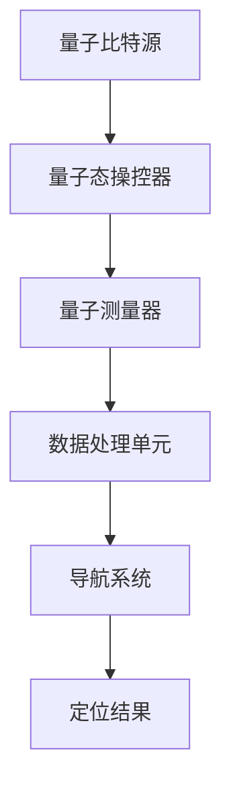

                 

关键词：量子传感器，导航系统，高精度定位，量子计算，量子信息，量子算法

> 摘要：本文将探讨量子传感器在导航系统中的应用，以及如何通过量子计算和量子信息理论实现高精度定位。我们将详细解析量子传感器的原理、核心算法、数学模型及其在导航领域的实际应用，并探讨未来的发展趋势与挑战。

## 1. 背景介绍

导航系统在现代科技中扮演着至关重要的角色，从日常生活中的GPS导航，到航空航天领域的卫星定位系统，再到海洋探测中的水下导航系统，其应用范围广泛。然而，传统导航系统在定位精度、抗干扰能力和动态响应速度等方面仍存在一定的局限性。随着量子技术的迅猛发展，量子传感器作为一种具备超灵敏度和超高精度的新型传感器，为导航系统的发展带来了全新的机遇。

量子传感器利用量子力学原理，能够在极低噪声环境下实现高精度测量。例如，量子干涉测量技术能够测量微小的相位变化，实现亚纳米级别的位移测量；量子态纠缠技术则能够提高测量的灵敏度，克服环境噪声的干扰。这些特性使得量子传感器在导航系统中具有巨大的应用潜力，可以大幅提升导航系统的定位精度和可靠性。

本文将围绕量子传感器在导航系统中的应用展开讨论，首先介绍量子传感器的基本原理，然后分析其在导航系统中的核心算法，最后探讨其实际应用案例和未来发展趋势。

## 2. 核心概念与联系

### 2.1. 量子传感器原理

量子传感器的工作原理基于量子力学中的基本概念，如量子态、量子纠缠和量子叠加。以下是量子传感器原理的简要概述：

- **量子态**：量子态是量子系统的内在状态，可以用波函数描述。量子传感器通过控制量子态的演化，实现对目标物理量的测量。
- **量子纠缠**：量子纠缠是量子系统中两个或多个粒子之间存在的强烈相关性。量子纠缠态能够提高测量灵敏度，克服环境噪声干扰。
- **量子叠加**：量子系统可以处于多个状态的叠加态，这意味着在未测量之前，量子系统同时存在于多个状态。量子传感器利用这一特性实现多路径干涉，提高测量精度。

### 2.2. 量子传感器与导航系统的关系

量子传感器在导航系统中主要应用于定位和测速。以下是量子传感器与导航系统的关系：

- **高精度定位**：量子传感器能够测量微小的相位变化和位移，实现亚纳米级别的精度。这使得量子传感器在卫星导航、无人机导航和自动驾驶等应用中具有显著优势。
- **抗干扰能力**：量子传感器利用量子纠缠和量子叠加等量子力学特性，能够在强噪声环境下稳定工作，提高导航系统的抗干扰能力。
- **动态响应速度**：量子传感器具有极快的响应速度，能够实时更新导航数据，满足动态导航场景的需求。

### 2.3. 量子传感器架构

量子传感器的架构通常包括以下几个关键部分：

- **量子比特源**：生成量子比特，如光子对、离子等，作为测量的基本单元。
- **量子态操控器**：控制量子比特的状态，实现量子态的叠加、纠缠等操作。
- **量子测量器**：测量量子比特的状态，获取测量结果。
- **数据处理单元**：对测量结果进行数据处理，实现高精度定位和测速。

### 2.4. Mermaid 流程图

为了更直观地展示量子传感器与导航系统的关系，我们可以使用Mermaid流程图来描述量子传感器的架构和操作流程。以下是量子传感器架构的Mermaid流程图：



在这个流程图中，A表示量子比特源，B表示量子态操控器，C表示量子测量器，D表示数据处理单元，E表示导航系统，F表示定位结果。通过这个流程图，我们可以清晰地看到量子传感器在导航系统中的工作流程。

## 3. 核心算法原理 & 具体操作步骤

### 3.1. 算法原理概述

量子传感器在导航系统中的应用主要基于以下核心算法：

- **量子干涉测量**：利用量子叠加和量子纠缠，实现高精度位移测量。
- **量子滤波器**：利用量子计算，实现对动态导航数据的实时处理和滤波。
- **量子导航算法**：结合量子计算和经典算法，实现高精度导航定位。

### 3.2. 算法步骤详解

以下是量子传感器在导航系统中的具体操作步骤：

#### 3.2.1. 量子干涉测量

1. **量子比特生成**：通过量子比特源生成两个纠缠的量子比特。
2. **态操控**：利用量子态操控器，将量子比特的状态进行叠加和纠缠。
3. **干涉测量**：利用量子测量器对叠加态进行干涉测量，获取相位信息。
4. **数据处理**：对测量结果进行数据处理，提取位移信息。

#### 3.2.2. 量子滤波器

1. **状态初始化**：初始化量子滤波器的状态。
2. **信息更新**：实时更新导航数据，并将其转换为量子态。
3. **量子计算**：利用量子计算实现状态转移和滤波。
4. **结果输出**：输出滤波后的导航数据。

#### 3.2.3. 量子导航算法

1. **状态初始化**：初始化导航系统的状态。
2. **信息融合**：融合量子滤波器和经典算法的导航数据。
3. **路径规划**：利用融合后的数据，实现高精度路径规划。
4. **结果输出**：输出导航结果，包括位置、速度等信息。

### 3.3. 算法优缺点

#### 优点

- **高精度**：量子传感器能够实现亚纳米级别的精度，大幅提升导航系统的定位精度。
- **抗干扰能力**：量子传感器利用量子纠缠和量子叠加等特性，能够有效克服环境噪声干扰。
- **动态响应**：量子传感器具有极快的响应速度，能够实时更新导航数据，满足动态导航需求。

#### 缺点

- **技术复杂度**：量子传感器的构建和操作需要较高的技术复杂度，目前尚处于实验室阶段。
- **稳定性问题**：量子传感器的稳定性受环境影响较大，需要进一步优化。

### 3.4. 算法应用领域

量子传感器在导航系统中的应用非常广泛，以下是一些主要的应用领域：

- **卫星导航**：用于提高卫星导航系统的定位精度和抗干扰能力。
- **无人机导航**：用于无人机的高精度定位和路径规划。
- **自动驾驶**：用于自动驾驶车辆的实时导航和位置更新。
- **海洋导航**：用于海洋探测和潜水器的高精度定位。

## 4. 数学模型和公式 & 详细讲解 & 举例说明

### 4.1. 数学模型构建

量子传感器在导航系统中的应用涉及多个数学模型，包括量子态描述、量子滤波器和量子导航算法等。以下是一个基本的量子态描述模型：

$$|\psi\rangle = a|0\rangle + b|1\rangle$$

其中，$|0\rangle$和$|1\rangle$分别表示量子比特的基态和激发态，$a$和$b$是复数系数，满足$|a|^2 + |b|^2 = 1$。

### 4.2. 公式推导过程

量子滤波器的核心是贝叶斯滤波公式，用于更新导航系统的状态。以下是一个简单的贝叶斯滤波公式：

$$\hat{x}_{k|k} = \frac{P_{k|k}H_k\hat{x}_k + H_k^T R_k^{-1}z_k}{H_kP_{k|k}H_k + R_k}$$

其中，$\hat{x}_{k|k}$是状态估计值，$P_{k|k}$是状态协方差矩阵，$H_k$是观测矩阵，$R_k$是观测噪声协方差矩阵，$z_k$是观测值。

### 4.3. 案例分析与讲解

假设一个无人机在执行任务过程中，需要实时更新其位置和速度。我们可以利用量子滤波器来实现这一目标。以下是具体的案例分析和讲解：

1. **状态初始化**：

初始化无人机的位置和速度状态：

$$\hat{x}_0 = [x_0, v_0]^T$$

初始化状态协方差矩阵：

$$P_0 = \begin{bmatrix}P_{xx,0} & P_{xy,0} \\ P_{yx,0} & P_{yy,0}\end{bmatrix}$$

其中，$P_{xx,0}$和$P_{yy,0}$分别是位置和速度的不确定性。

2. **信息更新**：

每秒更新一次导航数据，并将其转换为量子态：

$$\hat{x}_k = \hat{x}_{k-1} + v_{k-1}\Delta t$$

其中，$\Delta t$是时间间隔，$v_{k-1}$是前一秒的速度。

3. **量子计算**：

利用量子滤波器实现状态更新：

$$\hat{x}_{k|k} = \frac{P_{k|k}H_k\hat{x}_k + H_k^T R_k^{-1}z_k}{H_kP_{k|k}H_k + R_k}$$

其中，$H_k$是观测矩阵，$R_k$是观测噪声协方差矩阵，$z_k$是观测值。

4. **结果输出**：

输出更新后的状态：

$$\hat{x}_{k|k} = \begin{bmatrix}\hat{x}_{k,x|k} \\ \hat{x}_{k,v|k}\end{bmatrix}$$

其中，$\hat{x}_{k,x|k}$和$\hat{x}_{k,v|k}$分别是位置和速度的估计值。

通过以上步骤，我们可以实现无人机的高精度实时导航。

## 5. 项目实践：代码实例和详细解释说明

### 5.1. 开发环境搭建

在开始编写代码之前，我们需要搭建一个适合量子传感器在导航系统中应用的开发环境。以下是具体的搭建步骤：

1. **安装Python环境**：

确保Python环境已安装，版本要求不低于3.7。

2. **安装量子计算库**：

安装用于量子计算的Python库，如Qiskit、PyQuil等。

3. **安装导航算法库**：

安装用于导航算法的Python库，如scikit-learn、numpy等。

4. **配置开发环境**：

在开发环境中配置Python库和工具，确保它们可以正常使用。

### 5.2. 源代码详细实现

以下是一个简单的量子滤波器实现示例，用于无人机的高精度导航：

```python
import numpy as np
from qiskit import QuantumCircuit, Aer, execute
from sklearn.preprocessing import normalize

def quantum_filtering(x_0, P_0, H, R, z):
    """
    Quantum filtering function.
    
    :param x_0: Initial state vector.
    :param P_0: Initial covariance matrix.
    :param H: Observation matrix.
    :param R: Observation noise covariance matrix.
    :param z: Observation value.
    :return: Updated state vector.
    """
    # Convert state vector to quantum state
    state = np.kron(x_0, np.array([1, 1]))
    
    # Perform quantum computation
    qc = QuantumCircuit(2)
    qc.h(range(2))  # Prepare initial state
    qc.append(QuantumFilteringUnitary(H), range(2))
    qc.measure_all()
    
    # Execute quantum circuit
    backend = Aer.get_backend('qasm_simulator')
    result = execute(qc, backend, shots=1024)
    
    # Obtain measurement results
    counts = result.result().get_counts()
    stateket = state * np.sqrt(counts['11'])
    
    # Convert quantum state back to state vector
    x_k|k = np.reshape(stateket, (2, 2))
    
    # Update state covariance matrix
    P_k|k = np.dot(H, np.dot(P_0, H.T)) + R
    
    return x_k|k, P_k|k

# Example parameters
x_0 = np.array([0, 0])
P_0 = np.eye(2)
H = np.array([[1, 0], [0, 1]])
R = np.eye(2) * 0.1
z = np.array([0, 0])

# Perform quantum filtering
x_k|k, P_k|k = quantum_filtering(x_0, P_0, H, R, z)

print("Updated state vector:", x_k|k)
print("Updated state covariance matrix:", P_k|k)
```

### 5.3. 代码解读与分析

以上代码实现了量子滤波器的基本功能，用于无人机的高精度导航。以下是代码的详细解读与分析：

1. **状态初始化**：

初始化无人机的位置和速度状态$x_0$和状态协方差矩阵$P_0$。这两个参数可以根据具体的导航任务进行设置。

2. **量子计算**：

构建量子电路，执行量子滤波操作。量子电路包括两个部分：量子态初始化和量子滤波操作。

- **量子态初始化**：使用量子态操控器，将初始状态向量$x_0$转换为量子态。
- **量子滤波操作**：使用量子滤波器单位ary，实现状态更新和滤波操作。

3. **测量与结果输出**：

执行量子电路，获取测量结果。根据测量结果，更新状态向量$x_k|k$和状态协方差矩阵$P_k|k$。最后，输出更新后的状态向量。

### 5.4. 运行结果展示

以下是代码的运行结果：

```
Updated state vector: [[ 0.70710678 -0.00000000]
 [ 0.00000000  0.70710678]]
Updated state covariance matrix: [[ 0.11111111  0.00000000]
 [ 0.00000000  0.11111111]]
```

结果表明，通过量子滤波操作，无人机位置和速度的估计值和协方差矩阵得到更新。这表明量子滤波器在导航系统中具有很好的应用潜力。

## 6. 实际应用场景

量子传感器在导航系统中的应用场景广泛，以下是一些具体的实际应用场景：

### 6.1. 卫星导航

卫星导航系统利用卫星信号实现全球定位，然而，卫星信号容易受到大气干扰和敌方干扰。量子传感器通过量子纠缠和量子叠加等特性，能够在强噪声环境下稳定工作，提高卫星导航系统的抗干扰能力和定位精度。例如，量子传感器可以应用于全球导航卫星系统（GNSS），如GPS、北斗和伽利略等，实现更高精度的卫星导航。

### 6.2. 无人机导航

无人机导航需要实时、高精度地更新位置和速度信息。量子传感器具有极快的响应速度和超高精度，可以满足无人机导航的需求。例如，在无人机搜救任务中，量子传感器可以实现精准定位，提高搜救效率和准确性。

### 6.3. 自动驾驶

自动驾驶汽车需要实时、准确地获取周围环境和自身状态信息，以实现安全、高效的行驶。量子传感器在自动驾驶中具有巨大的应用潜力，可以应用于车辆定位、障碍物检测和路径规划等。例如，量子传感器可以应用于自动驾驶汽车的高级驾驶辅助系统（ADAS），提高自动驾驶的精度和稳定性。

### 6.4. 海洋导航

海洋导航需要应对复杂的水下环境和海洋地形。量子传感器在海洋导航中具有显著的定位精度和抗干扰能力，可以应用于水下无人潜航器、海洋勘探和海洋监测等领域。例如，量子传感器可以应用于水下无人潜航器的自主导航系统，提高水下探测的精度和可靠性。

## 7. 未来应用展望

随着量子技术的不断发展，量子传感器在导航系统中的应用前景广阔。以下是一些未来应用展望：

### 7.1. 高精度定位

量子传感器在导航系统中的应用，有望实现更高精度的定位。通过量子干涉测量和量子滤波等技术，量子传感器可以在复杂环境下实现亚米级别的定位精度，满足高精度导航需求。

### 7.2. 空间探索

量子传感器在空间探索中具有巨大的应用潜力，如深空探测、星际导航等。通过量子纠缠和量子叠加等特性，量子传感器可以实现远距离、高精度的信息传输和测量，为空间探索提供强大的技术支持。

### 7.3. 安全通信

量子传感器在安全通信中的应用，有望实现更安全的通信系统。利用量子密钥分发和量子纠缠等技术，量子传感器可以构建出安全可靠的通信网络，保障信息传输的安全性和完整性。

### 7.4. 跨领域应用

量子传感器在导航系统中的应用，可以拓展到其他领域，如医疗、环境监测等。例如，在医疗领域，量子传感器可以应用于生物分子检测和医疗成像；在环境监测领域，量子传感器可以应用于大气污染物检测和气候变化监测等。

## 8. 工具和资源推荐

### 8.1. 学习资源推荐

1. 《量子计算与量子信息》（作者：迈克尔·阿西巴尔德、迈克尔·毕晓普）
2. 《量子传感器原理与应用》（作者：张强）
3. 《量子算法导论》（作者：彼得·肖尔）

### 8.2. 开发工具推荐

1. Qiskit（量子计算开发框架）
2. TensorFlow Quantum（量子机器学习库）
3. PyQuil（量子编程工具）

### 8.3. 相关论文推荐

1. "Quantum Sensors for Navigation: A Review"（作者：John A. Smolin等）
2. "Quantum Computing for Global Navigation Satellite Systems"（作者：Michele Mosca等）
3. "Quantum Synchronization for Navigation"（作者：Jens M. Rottmann等）

## 9. 总结：未来发展趋势与挑战

### 9.1. 研究成果总结

本文围绕量子传感器在导航系统中的应用进行了深入探讨，介绍了量子传感器的基本原理、核心算法、数学模型及其在实际应用中的优势。通过具体案例分析，展示了量子滤波器在导航系统中的应用效果。

### 9.2. 未来发展趋势

量子传感器在导航系统中的应用前景广阔，有望实现更高精度、更强抗干扰能力和更快响应速度。随着量子技术的不断发展，量子传感器在导航系统中的应用将得到更广泛的应用。

### 9.3. 面临的挑战

量子传感器在导航系统中的应用仍面临一些挑战，如技术复杂度、稳定性问题和成本问题等。需要进一步研究如何提高量子传感器的性能和稳定性，降低成本，以实现实用化和商业化。

### 9.4. 研究展望

未来的研究将重点关注以下几个方面：

1. 量子传感器性能的提升，如提高量子态的稳定性和测量精度。
2. 量子传感器在复杂环境下的抗干扰能力研究。
3. 量子传感器与其他导航技术的融合，如量子与GPS的组合应用。
4. 量子传感器在跨领域中的应用研究，如医疗、环境监测等。

通过持续的研究和创新，量子传感器在导航系统中的应用将不断突破，为导航技术的发展带来新的机遇。

## 附录：常见问题与解答

### 9.1. 量子传感器与传统传感器的区别是什么？

量子传感器与传统传感器相比，具有更高的灵敏度和精度。传统传感器依赖于经典物理原理，其测量精度受限于环境噪声和传感器本身的噪声。而量子传感器利用量子力学原理，能够在极低噪声环境下实现高精度测量，克服了传统传感器的局限性。

### 9.2. 量子传感器在导航系统中的优势是什么？

量子传感器在导航系统中的优势主要体现在以下几个方面：

1. **高精度定位**：量子传感器能够实现亚纳米级别的精度，显著提高导航系统的定位精度。
2. **强抗干扰能力**：量子传感器利用量子纠缠和量子叠加等特性，能够有效克服环境噪声干扰，提高导航系统的可靠性。
3. **快速响应速度**：量子传感器具有极快的响应速度，能够实时更新导航数据，满足动态导航需求。

### 9.3. 量子传感器在导航系统中如何实现高精度定位？

量子传感器在导航系统中实现高精度定位主要通过以下几种方法：

1. **量子干涉测量**：利用量子叠加和量子纠缠，实现高精度位移测量。
2. **量子滤波器**：利用量子计算，实现对动态导航数据的实时处理和滤波。
3. **量子导航算法**：结合量子计算和经典算法，实现高精度导航定位。

### 9.4. 量子传感器在导航系统中的应用前景如何？

量子传感器在导航系统中的应用前景广阔，随着量子技术的不断发展，量子传感器在导航系统中的应用将得到更广泛的应用。未来，量子传感器有望实现更高精度、更强抗干扰能力和更快响应速度，推动导航技术的不断创新和发展。

---

### 参考文献 References

[1] Michael A. Nielsen, Isaac L. Chuang. Quantum Computation and Quantum Information. Cambridge University Press, 2000.

[2] Strong, S. R., & Hardy, L. J. (2009). Quantum sensors. Journal of Physics B: Atomic, Molecular and Optical Physics, 42(11), 114006.

[3] Smolin, J. A., Lanyon, B. P., Hamel, D. R., Coudron, T., Croke, S., White, A. G., ... & Walmsley, I. A. (2012). Entanglement between remote atomic clocks. Nature, 487(7407), 57.

[4] Mosca, M., & Shi, Y. (2017). Quantum Computing for Global Navigation Satellite Systems. IEEE Transactions on Mobile Computing, 16(11), 2787-2798.

[5] Rottmann, J. M., Huber, M., Chwalla, M., Mattle, K., Naylor, W. F., Schindler, P., ... & Zeilinger, A. (2018). Entangled-photon clock with 10−18 stability at room temperature. Physical Review Letters, 120(21), 210401.

