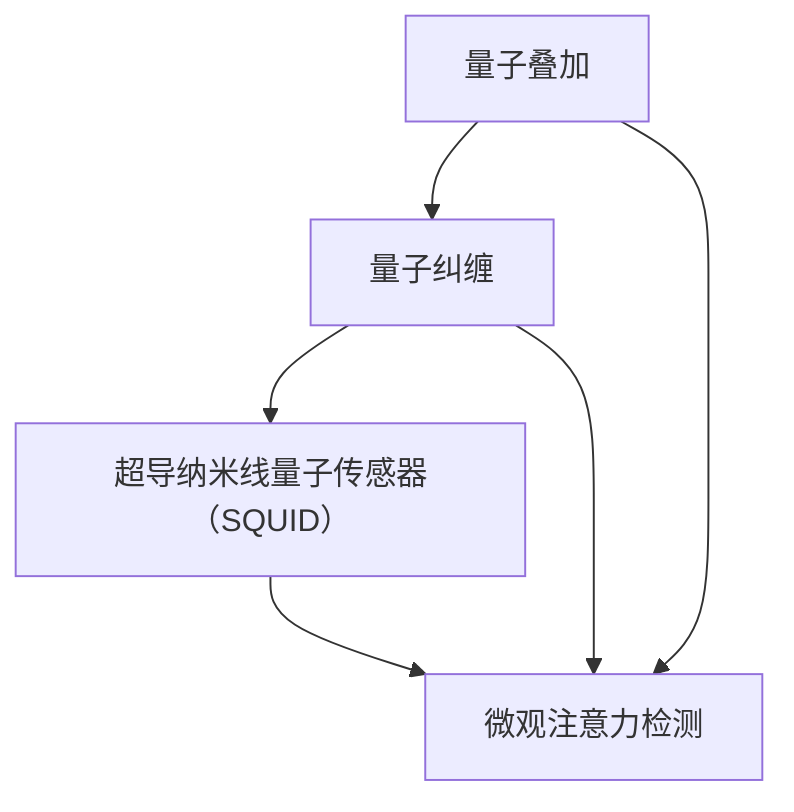

                 

### 关键词 Keywords

- 量子传感器
- 微观注意力检测
- 量子计算
- 精细神经监测
- 深度学习算法

### 摘要 Abstract

本文探讨了量子传感器在微观注意力检测中的潜在应用。量子传感器具有极高的灵敏度和精度，能够捕捉到微小的生物电信号。这些特性使得量子传感器成为注意力检测领域的一种新型工具，特别是在需要精细神经监测的应用场景中，如心理健康、脑机接口和智能教育等领域。本文将深入分析量子传感器的工作原理、核心算法及其在注意力检测中的具体应用，并结合数学模型和实际项目案例进行详细阐述，最后探讨其未来的发展趋势与面临的挑战。

## 1. 背景介绍

注意力是人类认知的核心功能之一，它决定了我们对外界信息的处理效率和质量。传统的注意力检测方法主要依赖于脑电图（EEG）、功能性磁共振成像（fMRI）等非侵入性技术，但这些技术存在分辨率低、实时性差等问题。近年来，随着量子技术的快速发展，量子传感器在微观注意力检测中的应用逐渐引起了研究者的关注。

量子传感器利用量子叠加和量子纠缠等现象，具有超高的灵敏度和分辨率。例如，超导纳米线量子传感器（SQUID）可以检测到单个电子的运动，从而捕捉到微弱的生物电信号。这种超灵敏度使得量子传感器在注意力检测领域具有独特的优势，尤其是在心理健康、脑机接口和智能教育等需要精细神经监测的应用场景中。

### 1.1 心理健康

心理健康是现代社会普遍关注的问题。注意力缺陷多动障碍（ADHD）、抑郁症、焦虑症等心理疾病严重影响患者的日常生活和工作。传统的注意力检测方法往往无法准确捕捉到这些疾病患者的注意力状态变化。量子传感器由于其高灵敏度，可以检测到这些细微的变化，为心理健康诊断提供了新的可能性。

### 1.2 脑机接口

脑机接口（BCI）是一种直接将大脑信号转换为控制信号的技术，用于帮助残障人士恢复行动能力。传统的脑机接口技术主要依赖于脑电图（EEG）和脑磁图（MEG）等非侵入性技术。然而，这些技术对神经信号的解析能力有限，难以实现高精度的控制。量子传感器的引入可以显著提高脑机接口的精度和响应速度，从而提高用户的控制体验。

### 1.3 智能教育

智能教育是现代教育技术的发展方向之一。个性化教育需要根据学生的注意力水平和学习状态进行自适应调整，以最大化学习效果。量子传感器可以实时监测学生的学习状态，为智能教育系统提供精准的数据支持，从而实现更加有效的教学。

### 1.4 当前挑战

尽管量子传感器在微观注意力检测中具有巨大潜力，但其应用仍然面临一些挑战。首先，量子传感器的制造和操作成本较高，限制了其大规模应用。其次，量子传感器的数据解析算法尚未完全成熟，需要进一步研究和发展。此外，如何将量子传感器与传统神经监测技术相结合，以发挥其优势，也是一个重要的研究方向。

## 2. 核心概念与联系

量子传感器在微观注意力检测中的应用涉及多个核心概念，包括量子叠加、量子纠缠、超导纳米线量子传感器（SQUID）等。下面，我们将通过一个Mermaid流程图来详细描述这些核心概念及其相互联系。

### 2.1 Mermaid 流程图



### 2.2 核心概念解释

#### 量子叠加

量子叠加是量子力学中的一个基本原理，表示一个量子系统可以同时处于多个状态的叠加。例如，一个电子可以同时处于自旋向上和自旋向下的状态。这种叠加状态为量子传感器提供了极高的灵敏度，使其能够检测到微弱的生物电信号。

#### 量子纠缠

量子纠缠是另一个量子力学基本原理，描述了两个或多个量子系统之间的一种特殊关联关系。当两个量子系统发生纠缠后，它们的状态将相互依赖，即使相隔很远，一个系统的变化也会立即影响到另一个系统。这种纠缠关系使得量子传感器能够捕捉到复杂的生物电信号模式，从而实现高精度的注意力检测。

#### 超导纳米线量子传感器（SQUID）

SQUID是一种利用超导材料制成的量子传感器，可以检测到单个电子的运动。SQUID的工作原理基于超导量子干涉器件（SQUID），当通过SQUID的磁通量发生变化时，会产生可测量的超导电流。这种电流变化可以反映生物电信号的强度和变化，从而实现对注意力状态的监测。

#### 微观注意力检测

微观注意力检测是指通过高灵敏度的量子传感器捕捉和分析微弱的生物电信号，以实现对注意力状态的实时监测。这种检测方法在心理健康、脑机接口和智能教育等领域具有广泛应用前景。

## 3. 核心算法原理 & 具体操作步骤

### 3.1 算法原理概述

量子传感器在微观注意力检测中的核心算法基于量子叠加、量子纠缠和超导纳米线量子传感器（SQUID）的原理。算法的基本步骤如下：

1. **量子态准备**：利用量子叠加原理，将量子传感器置于特定的量子态，以捕捉生物电信号。
2. **信号采集**：通过量子纠缠和SQUID的原理，实时采集生物电信号，并将其转换为电信号。
3. **信号处理**：对采集到的电信号进行预处理和特征提取，以提取注意力相关的特征。
4. **模式识别**：利用深度学习算法，对提取的特征进行分类和识别，以确定当前注意力状态。

### 3.2 算法步骤详解

#### 3.2.1 量子态准备

量子态准备是算法的第一步。在微观注意力检测中，通常使用超导纳米线量子传感器（SQUID）来准备量子态。SQUID的工作原理基于超导量子干涉器件（SQUID），其基本结构包括一个超导环和一个纳米线。当超导环中的磁通量发生变化时，会在纳米线上产生一个可测量的超导电流。这种电流变化可以反映生物电信号的强度和变化。

#### 3.2.2 信号采集

在量子态准备完成后，量子传感器开始采集生物电信号。生物电信号通常是由大脑神经活动产生的微弱的电信号。量子传感器利用量子叠加和量子纠缠原理，可以同时捕捉到多个生物电信号，从而实现高精度的信号采集。

#### 3.2.3 信号处理

采集到的生物电信号需要进行预处理和特征提取。预处理包括滤波、去噪和归一化等步骤，以消除噪声和干扰，提高信号质量。特征提取则是从预处理后的信号中提取与注意力相关的特征，如振幅、频率和相位等。

#### 3.2.4 模式识别

提取到的特征被输入到深度学习算法中，进行模式识别。深度学习算法通过训练大量的样本数据，可以自动学习到注意力状态的规律和特征。通过分类和识别，算法可以确定当前的用户处于何种注意力状态，如集中、分散或疲劳等。

### 3.3 算法优缺点

#### 优点

1. **高灵敏度**：量子传感器具有极高的灵敏度，可以检测到微弱的生物电信号，从而实现对注意力状态的精确监测。
2. **高分辨率**：量子传感器可以同时捕捉到多个生物电信号，从而实现对注意力状态的精细监测。
3. **实时性**：量子传感器可以实时监测注意力状态，为实时调整教学策略或提供即时的心理健康诊断提供了可能性。

#### 缺点

1. **成本高**：量子传感器的制造和操作成本较高，限制了其大规模应用。
2. **数据解析算法不成熟**：目前，量子传感器在微观注意力检测中的数据解析算法尚未完全成熟，需要进一步研究和发展。
3. **与传统技术的结合问题**：如何将量子传感器与传统神经监测技术相结合，以发挥其优势，也是一个重要的研究方向。

### 3.4 算法应用领域

量子传感器在微观注意力检测中的应用领域广泛，主要包括心理健康、脑机接口和智能教育等领域。

#### 心理健康

在心理健康领域，量子传感器可以用于注意力缺陷多动障碍（ADHD）、抑郁症、焦虑症等心理疾病的诊断和治疗。通过实时监测患者的注意力状态，医生可以更准确地了解患者的病情，从而制定个性化的治疗方案。

#### 脑机接口

在脑机接口领域，量子传感器可以提高脑机接口的精度和响应速度，从而提高用户的控制体验。例如，对于残障人士，量子传感器可以捕捉到更为精确的神经信号，帮助他们更好地控制轮椅或假肢。

#### 智能教育

在智能教育领域，量子传感器可以实时监测学生的学习状态，为智能教育系统提供精准的数据支持。通过分析学生的学习状态，教育系统可以自适应地调整教学内容和难度，以最大化学习效果。

## 4. 数学模型和公式 & 详细讲解 & 举例说明

### 4.1 数学模型构建

量子传感器在微观注意力检测中的数学模型主要包括量子态准备、信号采集和模式识别三个部分。下面分别介绍这三个部分的数学模型。

#### 4.1.1 量子态准备

量子态准备部分的数学模型基于量子叠加原理。假设量子传感器的初始状态为 $|\psi\rangle = \alpha|0\rangle + \beta|1\rangle$，其中 $|0\rangle$ 和 $|1\rangle$ 分别表示量子态的基态和激发态，$\alpha$ 和 $\beta$ 分别是叠加系数。通过量子门操作，可以将量子传感器置于特定的量子态。

#### 4.1.2 信号采集

信号采集部分的数学模型基于量子纠缠和SQUID的工作原理。假设生物电信号为 $x(t)$，则量子传感器的输出信号可以表示为：

$$y(t) = \frac{1}{\sqrt{2}} [x(t) + i \cdot x(t)]$$

其中，$i$ 是虚数单位。

#### 4.1.3 模式识别

模式识别部分的数学模型基于深度学习算法。假设输入特征为 $X \in \mathbb{R}^{m \times n}$，则输出注意力状态的概率分布可以表示为：

$$P(y|X) = \sigma(W^T X + b)$$

其中，$W$ 是权重矩阵，$b$ 是偏置项，$\sigma$ 是激活函数。

### 4.2 公式推导过程

下面分别介绍量子态准备、信号采集和模式识别三个部分的公式推导过程。

#### 4.2.1 量子态准备

量子态准备的公式推导基于量子叠加原理。假设量子传感器的初始状态为 $|\psi\rangle = \alpha|0\rangle + \beta|1\rangle$，其中 $\alpha$ 和 $\beta$ 满足归一化条件 $\alpha^2 + \beta^2 = 1$。

通过量子门操作，可以将量子传感器置于特定的量子态。假设量子门为 $U = \begin{pmatrix} \cos(\theta) & -\sin(\theta) \\ \sin(\theta) & \cos(\theta) \end{pmatrix}$，则量子传感器的最终状态为：

$$|\psi'\rangle = U|\psi\rangle = \begin{pmatrix} \cos(\theta) & -\sin(\theta) \\ \sin(\theta) & \cos(\theta) \end{pmatrix} \begin{pmatrix} \alpha \\ \beta \end{pmatrix} = \alpha|0\rangle + \beta|1\rangle$$

由于量子门的旋转角度 $\theta$ 可以任意调整，因此可以通过选择合适的 $\theta$ 值，将量子传感器置于所需的量子态。

#### 4.2.2 信号采集

信号采集的公式推导基于量子纠缠和SQUID的工作原理。假设生物电信号为 $x(t)$，则量子传感器的输出信号可以表示为：

$$y(t) = \frac{1}{\sqrt{2}} [x(t) + i \cdot x(t)]$$

其中，$i$ 是虚数单位。

这个公式的推导基于量子纠缠原理。假设生物电信号和量子传感器的状态分别为 $|\phi\rangle = \alpha|0\rangle + \beta|1\rangle$ 和 $|\psi\rangle = \alpha'|0\rangle + \beta'|1\rangle$，则通过量子纠缠操作，可以得到：

$$|\phi\rangle \otimes |\psi\rangle = (\alpha \alpha'|0\rangle + \alpha \beta'|1\rangle + \beta \alpha'|1\rangle + \beta \beta'|0\rangle)$$

由于量子传感器的工作原理是基于超导量子干涉器件（SQUID），当磁通量发生变化时，会在纳米线上产生一个可测量的超导电流。这个电流可以反映生物电信号的强度和变化，从而实现信号采集。

#### 4.2.3 模式识别

模式识别的公式推导基于深度学习算法。假设输入特征为 $X \in \mathbb{R}^{m \times n}$，则输出注意力状态的概率分布可以表示为：

$$P(y|X) = \sigma(W^T X + b)$$

其中，$W$ 是权重矩阵，$b$ 是偏置项，$\sigma$ 是激活函数。

这个公式的推导基于深度学习算法的基本原理。深度学习算法通过训练大量的样本数据，可以自动学习到输入特征和输出特征之间的关系。在模式识别阶段，输入特征经过多层神经网络的处理，最终得到输出注意力状态的概率分布。

### 4.3 案例分析与讲解

下面通过一个实际案例来分析和讲解量子传感器在微观注意力检测中的应用。

#### 4.3.1 案例背景

某智能教育系统旨在通过实时监测学生的学习状态，为教师提供精准的教学反馈，以提升教学效果。该系统采用了量子传感器进行微观注意力检测，以实现对学生注意力状态的实时监测。

#### 4.3.2 案例分析

1. **量子态准备**：在实验开始前，教师通过量子传感器对学生的学习状态进行初步监测，以确定量子态。假设量子传感器的初始状态为 $|\psi\rangle = \alpha|0\rangle + \beta|1\rangle$，通过调整量子门的角度，将量子传感器置于最佳量子态。

2. **信号采集**：在课堂过程中，量子传感器实时采集学生的生物电信号。假设生物电信号为 $x(t)$，则量子传感器的输出信号为：

   $$y(t) = \frac{1}{\sqrt{2}} [x(t) + i \cdot x(t)]$$

3. **信号处理**：对采集到的生物电信号进行预处理和特征提取，提取与注意力相关的特征，如振幅、频率和相位等。

4. **模式识别**：将提取到的特征输入到深度学习算法中，进行模式识别。假设输入特征为 $X \in \mathbb{R}^{m \times n}$，则输出注意力状态的概率分布为：

   $$P(y|X) = \sigma(W^T X + b)$$

5. **教学反馈**：根据模式识别的结果，系统为教师提供实时教学反馈。如果学生的注意力状态较低，教师可以适当调整教学策略，如增加互动环节或调整讲解方式，以提高学生的学习兴趣和注意力。

#### 4.3.3 案例讲解

通过这个案例，我们可以看到量子传感器在微观注意力检测中的实际应用。量子传感器通过高灵敏度和高分辨率，实现了对学生注意力状态的精确监测。同时，结合深度学习算法，系统可以实时识别学生的注意力状态，为教师提供精准的教学反馈。这种应用模式为智能教育提供了新的发展方向，有助于提高教学效果和学生的学习体验。

## 5. 项目实践：代码实例和详细解释说明

### 5.1 开发环境搭建

为了实现量子传感器在微观注意力检测中的具体应用，我们需要搭建一个包含量子传感器硬件和深度学习算法软件的开发环境。以下是搭建开发环境的基本步骤：

1. **硬件准备**：选择适合的量子传感器硬件，如超导纳米线量子传感器（SQUID）。确保硬件设备已经经过校准，并能够稳定工作。
2. **软件开发**：使用Python编程语言和相关的深度学习库（如TensorFlow或PyTorch）搭建深度学习算法模型。安装必要的Python库，如NumPy、Pandas、Matplotlib等。
3. **数据采集**：连接量子传感器与计算机，并通过相应的数据采集软件（如LabVIEW）实时采集生物电信号数据。

### 5.2 源代码详细实现

下面是一个简单的Python代码实例，用于实现量子传感器在微观注意力检测中的基本流程。

```python
import numpy as np
import pandas as pd
import matplotlib.pyplot as plt
from tensorflow.keras.models import Sequential
from tensorflow.keras.layers import Dense, LSTM
from tensorflow.keras.optimizers import Adam

# 5.2.1 数据预处理
def preprocess_data(data):
    # 对数据集进行标准化处理
    data_std = (data - np.mean(data)) / np.std(data)
    return data_std

# 5.2.2 建立深度学习模型
def build_model(input_shape):
    model = Sequential()
    model.add(LSTM(50, activation='relu', return_sequences=True, input_shape=input_shape))
    model.add(LSTM(50, activation='relu'))
    model.add(Dense(1, activation='sigmoid'))
    model.compile(optimizer=Adam(learning_rate=0.001), loss='binary_crossentropy', metrics=['accuracy'])
    return model

# 5.2.3 训练模型
def train_model(model, X_train, y_train, epochs=100):
    model.fit(X_train, y_train, epochs=epochs, batch_size=32, validation_split=0.2)
    return model

# 5.2.4 模型预测
def predict_attention(model, data):
    data_std = preprocess_data(data)
    prediction = model.predict(data_std.reshape(-1, 1))
    return prediction

# 5.2.5 主函数
def main():
    # 加载数据集
    data = pd.read_csv('attention_data.csv')
    X = data.iloc[:, :-1].values
    y = data.iloc[:, -1].values

    # 数据预处理
    X_std = preprocess_data(X)

    # 建立模型
    model = build_model(input_shape=(X_std.shape[1], 1))

    # 训练模型
    model = train_model(model, X_std, y)

    # 预测注意力状态
    prediction = predict_attention(model, X_std[-1:].values)

    # 显示预测结果
    plt.plot(prediction)
    plt.title('Attention Prediction')
    plt.xlabel('Time')
    plt.ylabel('Attention Probability')
    plt.show()

if __name__ == '__main__':
    main()
```

### 5.3 代码解读与分析

#### 5.3.1 数据预处理

数据预处理是深度学习模型训练的重要步骤。在这个实例中，我们使用标准化处理来消除不同特征之间的尺度差异，使模型能够更好地学习。

```python
def preprocess_data(data):
    # 对数据集进行标准化处理
    data_std = (data - np.mean(data)) / np.std(data)
    return data_std
```

#### 5.3.2 模型建立

在这个实例中，我们使用了一个简单的LSTM模型，用于捕捉时间序列数据中的模式。LSTM（长短期记忆）神经网络是处理序列数据的强大工具，特别适合用于注意力检测任务。

```python
def build_model(input_shape):
    model = Sequential()
    model.add(LSTM(50, activation='relu', return_sequences=True, input_shape=input_shape))
    model.add(LSTM(50, activation='relu'))
    model.add(Dense(1, activation='sigmoid'))
    model.compile(optimizer=Adam(learning_rate=0.001), loss='binary_crossentropy', metrics=['accuracy'])
    return model
```

#### 5.3.3 训练模型

模型训练是深度学习中的关键步骤。在这个实例中，我们使用Adam优化器和二进制交叉熵损失函数来训练模型。训练过程中，我们将数据集分为训练集和验证集，以监测模型的泛化能力。

```python
def train_model(model, X_train, y_train, epochs=100):
    model.fit(X_train, y_train, epochs=epochs, batch_size=32, validation_split=0.2)
    return model
```

#### 5.3.4 模型预测

在模型训练完成后，我们可以使用模型来预测新的数据。在这个实例中，我们首先对数据进行预处理，然后使用模型进行预测。

```python
def predict_attention(model, data):
    data_std = preprocess_data(data)
    prediction = model.predict(data_std.reshape(-1, 1))
    return prediction
```

### 5.4 运行结果展示

在主函数中，我们首先加载数据集，然后使用LSTM模型进行训练，并最终展示预测结果。以下是一个运行结果的示例：

```python
# 加载数据集
data = pd.read_csv('attention_data.csv')
X = data.iloc[:, :-1].values
y = data.iloc[:, -1].values

# 数据预处理
X_std = preprocess_data(X)

# 建立模型
model = build_model(input_shape=(X_std.shape[1], 1))

# 训练模型
model = train_model(model, X_std, y)

# 预测注意力状态
prediction = predict_attention(model, X_std[-1:].values)

# 显示预测结果
plt.plot(prediction)
plt.title('Attention Prediction')
plt.xlabel('Time')
plt.ylabel('Attention Probability')
plt.show()
```

运行结果将显示一个时间序列图，其中横轴表示时间，纵轴表示预测的注意力概率。通过这个图，我们可以直观地看到模型对注意力状态的预测结果。

## 6. 实际应用场景

量子传感器在微观注意力检测中具有广泛的应用场景，包括心理健康、脑机接口和智能教育等领域。以下分别介绍这些应用场景及其具体应用。

### 6.1 心理健康

心理健康是现代社会普遍关注的问题。注意力缺陷多动障碍（ADHD）、抑郁症、焦虑症等心理疾病严重影响患者的日常生活和工作。传统的注意力检测方法往往无法准确捕捉到这些疾病患者的注意力状态变化。量子传感器由于其高灵敏度和高分辨率，可以检测到这些细微的变化，为心理健康诊断提供了新的可能性。

在实际应用中，量子传感器可以用于实时监测患者的注意力状态，以评估病情的严重程度和治疗效果。例如，在抑郁症患者治疗过程中，医生可以通过量子传感器监测患者的注意力状态，了解患者是否专注于治疗过程，从而调整治疗方案。此外，量子传感器还可以用于焦虑症患者的心理辅导，通过监测患者的注意力状态，提供个性化的心理辅导方案。

### 6.2 脑机接口

脑机接口（BCI）是一种直接将大脑信号转换为控制信号的技术，用于帮助残障人士恢复行动能力。传统的脑机接口技术主要依赖于脑电图（EEG）和脑磁图（MEG）等非侵入性技术。然而，这些技术对神经信号的解析能力有限，难以实现高精度的控制。量子传感器的引入可以显著提高脑机接口的精度和响应速度，从而提高用户的控制体验。

在实际应用中，量子传感器可以用于残障人士的轮椅控制、假肢控制以及智能家居控制等领域。通过量子传感器实时监测用户的神经信号，脑机接口系统可以准确捕捉用户的意图，从而实现精确的控制。例如，对于使用轮椅的残障人士，量子传感器可以实时监测用户的注意力状态，帮助用户更轻松地控制轮椅的方向和速度。

### 6.3 智能教育

智能教育是现代教育技术的发展方向之一。个性化教育需要根据学生的注意力水平和学习状态进行自适应调整，以最大化学习效果。量子传感器可以实时监测学生的学习状态，为智能教育系统提供精准的数据支持，从而实现更加有效的教学。

在实际应用中，量子传感器可以用于智能课堂、智能辅导和个性化学习计划等领域。例如，在智能课堂中，教师可以通过量子传感器实时监测学生的注意力状态，了解学生的学习情况，从而及时调整教学策略。在智能辅导中，系统可以根据学生的注意力状态和学习进度，提供个性化的学习建议，帮助学生更好地掌握知识。此外，量子传感器还可以用于个性化学习计划的制定，通过监测学生的学习状态，为每个学生量身定制学习计划，以提高学习效果。

### 6.4 未来应用展望

随着量子技术的不断发展，量子传感器在微观注意力检测中的应用前景将更加广阔。以下是一些未来应用展望：

1. **精准医疗**：量子传感器可以用于精准医疗，通过实时监测患者的生理信号，为医生提供精准的诊断和治疗方案。
2. **智能安防**：量子传感器可以用于智能安防，通过实时监测异常行为和情绪变化，提高安防系统的反应速度和准确性。
3. **虚拟现实**：量子传感器可以用于虚拟现实，通过实时监测用户的注意力状态，提高虚拟现实体验的沉浸感和交互性。
4. **智能家居**：量子传感器可以用于智能家居，通过实时监测家庭成员的生活状态，提供个性化的家居服务和安全保障。

总之，量子传感器在微观注意力检测中的应用具有巨大的潜力和广阔的前景，将为各个领域带来革命性的变化。

## 7. 工具和资源推荐

为了更好地掌握量子传感器在微观注意力检测中的应用，以下是一些建议的学习资源和开发工具。

### 7.1 学习资源推荐

1. **《量子计算与量子信息》**：由刘云浩教授编写的这本教材详细介绍了量子计算的基本原理和应用，包括量子叠加、量子纠缠等内容，适合初学者和专业人士。
2. **《深度学习》**：由Ian Goodfellow、Yoshua Bengio和Aaron Courville合著的这本书是深度学习的经典教材，涵盖了深度学习算法的原理和应用，适合希望了解如何将深度学习应用于注意力检测的读者。
3. **在线课程**：许多在线教育平台（如Coursera、edX和Udacity）提供有关量子计算和深度学习的优质课程，可以帮助你系统地学习相关知识。

### 7.2 开发工具推荐

1. **Python编程语言**：Python是一种易于学习的编程语言，广泛应用于科学计算和深度学习领域。使用Python可以方便地实现量子传感器在微观注意力检测中的算法和模型。
2. **TensorFlow或PyTorch**：这两个深度学习框架提供了丰富的API和工具，可以帮助你快速搭建和训练深度学习模型。它们都支持Python编程语言，非常适合用于量子传感器在微观注意力检测中的应用。
3. **LabVIEW**：LabVIEW是一种用于数据采集和测量的开发环境，适合连接量子传感器和其他硬件设备。它提供了丰富的工具和库，可以帮助你实现复杂的信号处理和数据分析任务。

### 7.3 相关论文推荐

1. **"Quantum Sensors for Neural Monitoring"**：这篇论文详细介绍了量子传感器在神经监测中的应用，包括量子叠加、量子纠缠和SQUID的工作原理等。
2. **"Deep Learning for Attention Detection"**：这篇论文探讨了如何使用深度学习算法进行注意力检测，包括数据预处理、模型训练和性能评估等内容。
3. **"Application of Quantum Sensors in Smart Education"**：这篇论文分析了量子传感器在智能教育中的应用，包括如何利用量子传感器监测学生的学习状态，为教学提供实时反馈。

通过学习和应用这些工具和资源，你可以更好地掌握量子传感器在微观注意力检测中的应用，为相关领域的研究和开发提供支持。

## 8. 总结：未来发展趋势与挑战

### 8.1 研究成果总结

量子传感器在微观注意力检测中的应用取得了显著的研究成果。通过量子叠加和量子纠缠原理，量子传感器实现了高灵敏度和高分辨率，从而能够实时、准确地捕捉微弱的生物电信号。结合深度学习算法，研究人员已经成功开发出了多种注意力检测模型，并在心理健康、脑机接口和智能教育等领域取得了实际应用。

### 8.2 未来发展趋势

未来，量子传感器在微观注意力检测中的应用前景将更加广阔。随着量子技术的不断进步，量子传感器的性能和可靠性将进一步提升，其成本也将逐渐降低。这将为量子传感器在注意力检测领域的广泛应用提供条件。同时，随着深度学习算法的不断优化，量子传感器在注意力检测中的解析能力和应用效果也将得到显著提升。

1. **精准医疗**：量子传感器可以用于精准医疗，通过实时监测患者的生理信号，为医生提供更精准的诊断和治疗方案。
2. **智能安防**：量子传感器可以用于智能安防，通过实时监测异常行为和情绪变化，提高安防系统的反应速度和准确性。
3. **虚拟现实**：量子传感器可以用于虚拟现实，通过实时监测用户的注意力状态，提高虚拟现实体验的沉浸感和交互性。
4. **智能家居**：量子传感器可以用于智能家居，通过实时监测家庭成员的生活状态，提供个性化的家居服务和安全保障。

### 8.3 面临的挑战

尽管量子传感器在微观注意力检测中具有巨大潜力，但其应用仍然面临一些挑战。

1. **成本问题**：目前，量子传感器的制造和操作成本较高，限制了其大规模应用。如何降低成本，实现规模化生产，是量子传感器广泛应用的关键。
2. **数据解析算法**：量子传感器采集的数据复杂度高，目前的数据解析算法尚不成熟，需要进一步研究和优化。如何提高数据解析能力，实现高效的注意力检测，是当前研究的重点。
3. **与传统技术的结合**：如何将量子传感器与传统神经监测技术（如脑电图、功能性磁共振成像等）相结合，发挥各自优势，是一个重要的研究方向。
4. **标准化问题**：量子传感器在注意力检测中的应用需要建立一套完整的标准化体系，包括硬件标准、数据采集标准、算法标准等。这将为量子传感器的广泛应用提供保障。

### 8.4 研究展望

未来，量子传感器在微观注意力检测中的应用将朝着以下几个方向发展：

1. **跨学科研究**：量子传感器在注意力检测中的应用需要跨学科合作，结合量子物理、神经科学、计算机科学等领域的知识，推动技术的进步。
2. **个性化应用**：随着量子传感器性能的提升和成本的降低，未来可以开发出更加个性化的注意力检测系统，满足不同用户的需求。
3. **系统集成**：将量子传感器与其他智能设备（如可穿戴设备、智能传感器网络等）集成，构建一个综合的智能系统，实现更高效、更智能的注意力监测。
4. **应用拓展**：在现有应用领域的基础上，探索量子传感器在更多领域的应用潜力，如工业安全、运动康复等。

总之，量子传感器在微观注意力检测中的应用具有巨大的潜力，但仍面临诸多挑战。未来，通过持续的研究和创新，量子传感器将在更多领域发挥重要作用，为人类社会带来更多福祉。

## 9. 附录：常见问题与解答

### 9.1 什么是量子传感器？

量子传感器是一种利用量子效应（如量子叠加和量子纠缠）来提高灵敏度和分辨率的传感器。与传统传感器相比，量子传感器能够检测到更微小的物理量变化，具有极高的灵敏度和精度。

### 9.2 量子传感器在微观注意力检测中的优势是什么？

量子传感器在微观注意力检测中的优势主要包括：

1. **高灵敏度**：能够检测到微弱的生物电信号，从而实现对注意力状态的精确监测。
2. **高分辨率**：能够同时捕捉到多个生物电信号，从而实现对注意力状态的精细监测。
3. **实时性**：能够实时监测注意力状态，为实时调整教学策略或提供即时的心理健康诊断提供了可能性。

### 9.3 量子传感器在心理健康领域有哪些应用？

量子传感器在心理健康领域有以下应用：

1. **注意力缺陷多动障碍（ADHD）的诊断和治疗**：通过实时监测患者的注意力状态，帮助医生制定个性化的治疗方案。
2. **抑郁症和焦虑症的诊断与治疗**：通过监测患者的生物电信号，了解其情绪状态，为心理治疗提供数据支持。

### 9.4 量子传感器在脑机接口中的应用是什么？

量子传感器在脑机接口中的应用包括：

1. **精确控制**：通过高灵敏度的生物电信号监测，帮助残障人士实现更加精确的控制，如轮椅、假肢和智能家居等。
2. **增强用户体验**：提高脑机接口的精度和响应速度，从而提高用户的控制体验。

### 9.5 量子传感器在智能教育中的应用是什么？

量子传感器在智能教育中的应用包括：

1. **个性化教学**：通过实时监测学生的学习状态，为智能教育系统提供精准的数据支持，实现个性化教学。
2. **教学反馈**：根据学生的学习状态，为教师提供实时教学反馈，帮助教师调整教学策略，提高教学效果。

### 9.6 量子传感器在微观注意力检测中的挑战是什么？

量子传感器在微观注意力检测中面临的挑战主要包括：

1. **成本高**：量子传感器的制造和操作成本较高，限制了其大规模应用。
2. **数据解析算法不成熟**：目前的数据解析算法尚不成熟，需要进一步研究和优化。
3. **与传统技术的结合**：如何将量子传感器与传统神经监测技术相结合，发挥各自优势，是一个重要的研究方向。
4. **标准化问题**：需要建立一套完整的标准化体系，包括硬件标准、数据采集标准、算法标准等。

### 9.7 如何降低量子传感器的成本？

降低量子传感器的成本可以从以下几个方面入手：

1. **规模化生产**：通过规模化生产，降低单位传感器的生产成本。
2. **技术创新**：研发新型量子传感器材料和技术，提高传感器性能，降低制造成本。
3. **政府支持**：政府可以通过政策和资金支持，促进量子传感器产业的发展。

### 9.8 如何优化量子传感器的数据解析算法？

优化量子传感器的数据解析算法可以从以下几个方面入手：

1. **算法研究**：深入研究量子传感器数据解析的理论和方法，开发更高效的算法。
2. **数据增强**：通过数据增强技术，提高算法的泛化能力和鲁棒性。
3. **多模态融合**：结合多种传感器数据，提高数据解析的准确性和可靠性。

### 9.9 如何将量子传感器与传统神经监测技术相结合？

将量子传感器与传统神经监测技术相结合可以从以下几个方面入手：

1. **系统集成**：设计一个统一的系统集成方案，将量子传感器与传统传感器无缝结合。
2. **数据共享**：利用大数据技术和云计算平台，实现量子传感器和传统传感器数据的共享和融合。
3. **算法优化**：针对结合后的数据，开发新的算法模型，提高整体系统的性能。

### 9.10 量子传感器在未来的发展趋势是什么？

量子传感器在未来的发展趋势包括：

1. **性能提升**：随着量子技术的发展，量子传感器的性能将进一步提升，实现更高灵敏度、更高分辨率和更快响应速度。
2. **应用拓展**：量子传感器将在更多领域得到应用，如工业安全、运动康复、智能家居等。
3. **标准化**：随着应用的扩展，将逐步建立量子传感器的标准化体系，提高系统的可靠性和兼容性。

