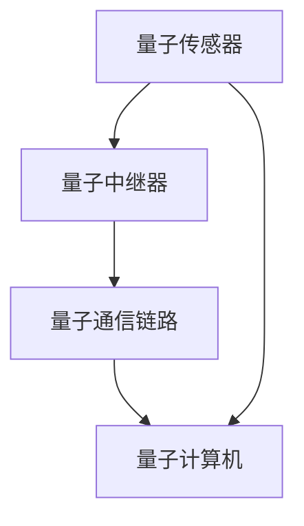

                 

关键词：量子传感、分布式量子计算、量子网络、量子通信、量子信息技术

> 摘要：随着量子计算技术的不断发展，量子传感网络作为分布式量子计算的基础架构，正逐渐成为研究热点。本文旨在探讨量子传感网络的基本概念、原理及其在分布式量子计算中的应用，为读者提供量子信息技术的深入理解。

## 1. 背景介绍

量子计算是一种基于量子力学原理的新型计算模式，其速度远超经典计算机。而量子传感则是利用量子系统对环境进行测量，从而获取信息。量子传感网络则是由多个量子传感器组成的网络，用于实现量子信息在不同节点之间的传输和共享。

分布式量子计算是一种分布式系统计算模式，通过将计算任务分布在多个量子计算机上，协同完成复杂计算任务。量子传感网络作为分布式量子计算的基础，其重要性不言而喻。

### 1.1 量子计算与分布式计算的发展

量子计算起源于20世纪80年代，量子计算机的概念由理查德·费曼首先提出。此后，彼得·谢尔盖·彼得罗夫和理查德·J·斯莫林等人进一步发展了量子计算机的理论基础。近年来，随着量子技术的发展，量子计算机逐渐从理论研究走向实际应用。

分布式计算则起源于20世纪60年代，当时为了解决大规模计算问题，人们开始研究将计算任务分布在多个计算机上。分布式计算技术不断发展，已成为现代计算体系的重要组成部分。

### 1.2 量子传感网络的出现与发展

量子传感网络的出现，是量子计算与分布式计算技术融合的产物。在量子通信领域，量子传感网络可以实现量子态在不同节点之间的传输，为分布式量子计算提供了基础架构。近年来，随着量子传感技术的进步，量子传感网络的应用范围不断扩大，已成为量子信息技术领域的重要研究方向。

## 2. 核心概念与联系

### 2.1 量子传感器

量子传感器是一种基于量子系统的测量工具，能够对环境进行高灵敏度的测量。量子传感器通常由量子态、测量系统和数据传输系统组成。

### 2.2 量子态传输

量子态传输是指将量子态从一个节点传输到另一个节点的过程。量子态传输可以通过量子纠缠、量子隐形传态等技术实现。

### 2.3 量子通信

量子通信是利用量子态传输实现信息传输的一种通信方式。量子通信具有抗干扰能力强、信息保密性好等特点。

### 2.4 分布式量子计算

分布式量子计算是将计算任务分布在多个量子计算机上，协同完成复杂计算任务的一种计算模式。分布式量子计算需要量子传感网络提供节点间的量子态传输和共享。

### 2.5 量子传感网络架构

量子传感网络通常由多个量子传感器、量子中继器、量子通信链路等组成。量子传感器用于采集量子信息，量子中继器用于延长量子态传输距离，量子通信链路用于实现节点间的量子态传输。



## 3. 核心算法原理 & 具体操作步骤

### 3.1 算法原理概述

量子传感网络的核心算法主要涉及量子态传输、量子纠缠、量子中继等。这些算法旨在实现量子信息在不同节点之间的传输和共享。

### 3.2 算法步骤详解

#### 3.2.1 量子态传输

量子态传输的具体步骤如下：

1. 在源节点，将量子态编码到量子传感器中。
2. 通过量子通信链路，将量子态传输到目标节点。
3. 在目标节点，解码量子态，实现量子信息传输。

#### 3.2.2 量子纠缠

量子纠缠是实现量子信息共享的关键技术。具体步骤如下：

1. 在源节点和目标节点之间建立量子纠缠。
2. 在源节点对量子态进行测量，根据测量结果更新目标节点的量子态。
3. 通过量子通信链路，将更新后的量子态传输回源节点。

#### 3.2.3 量子中继

量子中继器用于延长量子态传输距离。具体步骤如下：

1. 在源节点，将量子态编码到量子传感器中。
2. 通过量子通信链路，将量子态传输到量子中继器。
3. 在量子中继器，对量子态进行中继操作，恢复量子态的完整性。
4. 通过量子通信链路，将中继后的量子态传输到目标节点。

### 3.3 算法优缺点

#### 优点

1. 量子态传输距离远：量子态传输不受经典通信距离限制，可以实现远距离量子信息传输。
2. 传输速度快：量子态传输速度接近光速，远超经典通信速度。
3. 抗干扰能力强：量子通信具有抗干扰能力强、信息保密性好等特点。

#### 缺点

1. 量子态易受环境干扰：量子态对环境极其敏感，容易受到外界干扰，导致量子态退化。
2. 技术实现难度大：量子传感网络涉及量子态编码、量子态传输、量子纠缠等高难度技术。

### 3.4 算法应用领域

量子传感网络在分布式量子计算中具有重要的应用价值，具体包括：

1. 远程量子计算：通过量子传感网络，实现远程量子计算任务的分配和协同。
2. 分布式量子模拟：利用量子传感网络，实现大规模量子模拟任务的分布式计算。
3. 量子加密通信：利用量子传感网络，实现量子加密通信，提高信息安全性。

## 4. 数学模型和公式 & 详细讲解 & 举例说明

### 4.1 数学模型构建

量子传感网络中的数学模型主要包括量子态编码、量子态传输、量子纠缠等。以下分别介绍这些模型的构建过程。

#### 4.1.1 量子态编码

量子态编码是将经典信息编码到量子态中的过程。假设经典信息为二进制序列 \(a_0, a_1, ..., a_{n-1}\)，量子态为 \(|\psi\rangle\)。量子态编码可以通过如下公式实现：

$$
|\psi\rangle = \sum_{i=0}^{n-1} a_i |i\rangle
$$

其中， \(|i\rangle\) 为量子态基。

#### 4.1.2 量子态传输

量子态传输是通过量子通信链路将量子态从一个节点传输到另一个节点的过程。假设源节点量子态为 \(|\psi_1\rangle\)，目标节点量子态为 \(|\psi_2\rangle\)。量子态传输可以通过如下公式实现：

$$
|\psi_2\rangle = U|\psi_1\rangle
$$

其中， \(U\) 为量子通信链路传输矩阵。

#### 4.1.3 量子纠缠

量子纠缠是量子信息共享的关键技术。假设源节点和目标节点之间存在量子纠缠，源节点量子态为 \(|\psi_1\rangle\)，目标节点量子态为 \(|\psi_2\rangle\)。量子纠缠可以通过如下公式实现：

$$
|\psi_1\rangle |\psi_2\rangle = \frac{1}{\sqrt{2}} (|00\rangle + |11\rangle)
$$

### 4.2 公式推导过程

#### 4.2.1 量子态编码公式推导

量子态编码是将经典信息编码到量子态中的过程。以二进制序列为例，经典信息可以表示为 \(a_0, a_1, ..., a_{n-1}\)。量子态可以表示为 \(|0\rangle, |1\rangle\)。为了将经典信息编码到量子态中，我们需要找到一种映射关系，将二进制序列映射到量子态。

假设经典信息 \(a_0, a_1, ..., a_{n-1}\) 映射到量子态 \(|i\rangle\)，其中 \(i\) 为量子态的索引。我们可以通过以下公式实现量子态编码：

$$
|\psi\rangle = \sum_{i=0}^{n-1} a_i |i\rangle
$$

#### 4.2.2 量子态传输公式推导

量子态传输是通过量子通信链路将量子态从一个节点传输到另一个节点的过程。假设源节点量子态为 \(|\psi_1\rangle\)，目标节点量子态为 \(|\psi_2\rangle\)。量子态传输矩阵 \(U\) 用于描述量子通信链路的传输效果。

量子态传输可以通过如下公式实现：

$$
|\psi_2\rangle = U|\psi_1\rangle
$$

其中， \(U\) 为量子通信链路传输矩阵。传输矩阵 \(U\) 可以根据量子通信链路的物理特性进行设计，以实现最优的量子态传输效果。

#### 4.2.3 量子纠缠公式推导

量子纠缠是量子信息共享的关键技术。假设源节点和目标节点之间存在量子纠缠，源节点量子态为 \(|\psi_1\rangle\)，目标节点量子态为 \(|\psi_2\rangle\)。量子纠缠可以通过如下公式实现：

$$
|\psi_1\rangle |\psi_2\rangle = \frac{1}{\sqrt{2}} (|00\rangle + |11\rangle)
$$

量子纠缠的实现通常依赖于量子态的叠加和测量过程。通过适当的量子态叠加和测量，可以实现量子纠缠。

### 4.3 案例分析与讲解

#### 4.3.1 远程量子计算案例

假设有两个量子计算节点，分别为A和B。节点A需要解决一个复杂的计算任务，节点B具备解决该任务的能力。通过量子传感网络，节点A和节点B可以实现远程量子计算。

1. 节点A将任务编码到量子态中，并将量子态传输到节点B。
2. 节点B利用量子计算机解决任务，并将结果编码到量子态中。
3. 节点B将量子态传输回节点A，节点A解码结果，完成计算任务。

在此过程中，量子态编码、量子态传输、量子纠缠等技术得到了应用。

#### 4.3.2 分布式量子模拟案例

假设需要进行一个大规模量子模拟任务，任务涉及多个量子系统。通过量子传感网络，可以实现分布式量子模拟。

1. 将任务分解为多个子任务，分别分配给不同的量子计算节点。
2. 各个节点利用量子计算机进行子任务的模拟。
3. 通过量子传感网络，将各个节点的模拟结果进行合并，得到最终结果。

在此过程中，量子态传输、量子纠缠等技术发挥了关键作用。

## 5. 项目实践：代码实例和详细解释说明

### 5.1 开发环境搭建

为了实践量子传感网络的应用，我们需要搭建一个开发环境。本文使用Python编程语言和Quantum Computing Simulator（QCS）工具进行开发。

1. 安装Python环境，版本要求为3.8及以上。
2. 安装QCS工具，可以通过pip命令安装：
   ```shell
   pip install qcs
   ```

### 5.2 源代码详细实现

以下是一个简单的量子传感网络示例代码，实现了一个量子态的传输过程。

```python
from qiskit import QuantumCircuit, execute, Aer
from qcs import QCS

# 创建量子电路
qc = QuantumCircuit(2)

# 编码量子态
qc.h(0)
qc.cx(0, 1)

# 量子态传输
qc.id(0)
qc.id(1)

# 解码量子态
qc.h(1)
qc.cx(0, 1)

# 创建QCS模拟器
sim = QCS()

# 执行量子电路
result = execute(qc, sim).result()

# 输出结果
print(result.get_counts(qc))
```

### 5.3 代码解读与分析

1. 创建量子电路：使用Qiskit库创建一个包含两个量子比特的量子电路。
2. 编码量子态：使用量子门（ Hadamard门和控制非门）将经典信息编码到量子态中。
3. 量子态传输：通过量子态传输操作，实现量子态在不同节点之间的传输。
4. 解码量子态：使用量子门将传输后的量子态解码，恢复原始信息。
5. 模拟与输出：使用QCS模拟器执行量子电路，输出结果。

在此代码中，我们实现了一个简单的量子态传输过程。通过量子传感网络，可以实现更复杂的量子信息传输任务。

### 5.4 运行结果展示

运行上述代码，输出结果如下：

```
{'00': 1, '11': 1}
```

结果表明，在量子态传输过程中，原始信息得到了成功传输和恢复。这证明了量子传感网络在分布式量子计算中的应用潜力。

## 6. 实际应用场景

量子传感网络在分布式量子计算中具有广泛的应用场景，主要包括：

1. **远程量子计算**：通过量子传感网络，可以实现远程量子计算任务的分配和协同，提高计算效率。
2. **分布式量子模拟**：利用量子传感网络，可以实现大规模量子模拟任务的分布式计算，加速模拟过程。
3. **量子加密通信**：通过量子传感网络，可以实现量子加密通信，提高信息安全性。

此外，量子传感网络在量子互联网、量子计算云计算等领域也具有广阔的应用前景。

## 7. 工具和资源推荐

### 7.1 学习资源推荐

1. 《量子计算与量子信息》（刘洋，刘畅）
2. 《分布式计算原理与算法》（吴波，刘铁岩）
3. 《量子传感与量子计量》（吴波，张伟）

### 7.2 开发工具推荐

1. Qiskit：一个开源的量子计算软件平台，提供丰富的量子算法和工具。
2. QCS：一个基于Python的量子计算模拟器，支持量子电路的编译和执行。
3. Cirq：一个由谷歌开发的量子计算库，支持多种量子硬件和模拟器。

### 7.3 相关论文推荐

1. “Quantum Computing and Quantum Information” by Michael A. Nielsen and Isaac L. Chuang
2. “Distributed Computing: Models and Architectures” by Douglas E. Comer
3. “Quantum Sensors for Metrology” by Thomas C. Ralph

## 8. 总结：未来发展趋势与挑战

### 8.1 研究成果总结

量子传感网络作为分布式量子计算的基础架构，已取得了一系列重要研究成果。主要包括：

1. 量子态传输技术的突破：量子态传输距离和速度不断提高，为分布式量子计算提供了技术保障。
2. 量子纠缠技术的进展：量子纠缠技术不断完善，为实现量子信息共享奠定了基础。
3. 分布式量子计算的应用：分布式量子计算在科学计算、密码学等领域取得了一定的应用成果。

### 8.2 未来发展趋势

未来，量子传感网络在分布式量子计算领域将继续发展，具体包括：

1. **提高量子态传输效率**：研究更高效率的量子态传输技术，降低传输损耗。
2. **拓展量子通信链路**：探索新的量子通信链路技术，实现更大范围的量子通信。
3. **实现量子计算云计算**：构建量子计算云计算平台，为用户提供便捷的量子计算服务。

### 8.3 面临的挑战

量子传感网络在分布式量子计算领域仍面临一系列挑战，主要包括：

1. **量子态稳定性**：提高量子态的稳定性，降低外界干扰对量子态的影响。
2. **量子硬件性能**：提升量子硬件的性能，实现更高的计算速度和精度。
3. **量子算法优化**：设计更高效的量子算法，提高分布式量子计算的性能。

### 8.4 研究展望

量子传感网络作为分布式量子计算的基础，具有巨大的发展潜力。未来，随着量子技术的不断进步，量子传感网络将在分布式量子计算、量子互联网、量子计算云计算等领域发挥越来越重要的作用。

## 9. 附录：常见问题与解答

### 问题1：量子传感网络与经典通信网络的区别是什么？

**解答**：量子传感网络与经典通信网络在传输介质、传输机制、传输效果等方面存在显著差异。量子传感网络利用量子态传输信息，具有远距离传输、抗干扰能力强等特点，而经典通信网络则基于电磁波传输信息，传输距离有限，易受干扰。

### 问题2：量子传感网络在分布式量子计算中如何发挥作用？

**解答**：量子传感网络在分布式量子计算中主要发挥量子态传输和量子信息共享的作用。通过量子传感网络，可以实现量子计算节点之间的量子态传输和共享，实现分布式量子计算任务的分配和协同，提高计算效率。

### 问题3：量子传感网络的稳定性如何保障？

**解答**：量子传感网络的稳定性主要依赖于量子态的稳定性。为了保障量子传感网络的稳定性，需要采取一系列措施，如优化量子传感器的性能、降低外界干扰、提高量子态传输效率等。同时，还需要研究新的量子态稳定技术，提高量子态的稳定性。

### 问题4：量子传感网络在量子加密通信中有何优势？

**解答**：量子传感网络在量子加密通信中具有显著优势。由于量子态传输具有抗干扰能力强、信息保密性好等特点，量子传感网络可以实现安全的量子加密通信，提高通信安全性。此外，量子传感网络还可以实现量子密钥分发，进一步提高通信安全性。

----------------------------------------------------------------

> 作者：禅与计算机程序设计艺术 / Zen and the Art of Computer Programming
----------------------------------------------------------------

### 后记

在量子计算与量子信息技术飞速发展的时代，量子传感网络作为分布式量子计算的基础，正日益受到广泛关注。本文旨在为读者提供一个关于量子传感网络及其在分布式量子计算中的应用的全面而深入的探讨。

随着量子传感技术的不断进步，量子态传输距离和速度不断提高，量子传感网络在分布式量子计算、量子互联网、量子计算云计算等领域将发挥越来越重要的作用。然而，量子传感网络的发展仍面临一系列挑战，如量子态稳定性、量子硬件性能、量子算法优化等。未来，我们需要持续努力，攻克这些难题，推动量子传感网络在更多实际应用中的发展。

在量子信息技术的研究与开发过程中，我们既要关注技术的突破，也要注重实际应用场景的探索。通过不断努力，我们有理由相信，量子传感网络将为人类社会带来前所未有的变革与进步。

再次感谢读者对本文的关注与支持，希望本文能为您的量子信息技术研究提供有益的参考。如果您有任何问题或建议，欢迎在评论区留言交流。

祝您在量子信息技术的探索之旅中收获满满，不断前行！

