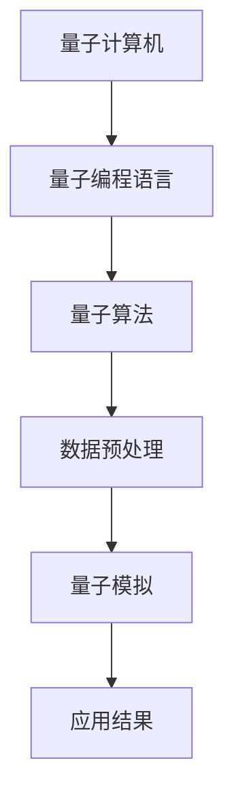

                 

关键词：量子计算、AI、大模型、算法原理、数学模型、项目实践、应用场景、未来展望

摘要：本文将深入探讨量子计算如何为人工智能注入新动力，重点介绍量子大模型的概念、核心原理、算法原理、数学模型、项目实践以及未来应用场景。通过全面剖析量子计算与人工智能的深度融合，我们希望能够为读者提供一个清晰而深刻的理解，揭示量子计算在AI领域的无限可能。

## 1. 背景介绍

人工智能（AI）的发展已经走过了几十年的历程，从最初的符号主义、知识表示到现代的深度学习、强化学习，AI技术在各个领域都取得了显著的成果。然而，随着数据规模的不断扩大和计算需求的日益增长，传统的计算机体系结构面临着巨大的挑战。此时，量子计算作为一种全新的计算范式，以其独特的并行计算能力和超强的处理速度，成为了人工智能领域的一个新的突破口。

量子计算是一种基于量子力学原理的全新计算范式。与传统的二进制计算不同，量子计算利用量子位（qubits）进行信息处理，具有叠加态和纠缠态的特性。这些特性使得量子计算机能够在某些特定问题上展现出超越经典计算机的能力，为解决复杂的人工智能问题提供了新的可能性。

近年来，量子计算的研究和应用取得了长足的进步。量子算法、量子模拟、量子优化等领域的突破，使得量子计算机在数据处理、机器学习、密码破解等领域展现出了巨大的潜力。特别是在大规模数据处理和复杂问题求解方面，量子计算的优势更加明显。因此，量子计算与人工智能的结合成为了当前研究的热点之一。

本文将围绕量子大模型这一核心概念，深入探讨量子计算为人工智能注入新动力的原理和方法。通过分析量子大模型的核心算法原理、数学模型，以及具体的实现和实际应用，我们希望能够为读者提供一个全面而深入的探讨，揭示量子计算在人工智能领域的无限可能。

## 2. 核心概念与联系

### 2.1 量子计算与人工智能的关系

量子计算与人工智能（AI）的结合是一个充满前景的研究领域。两者的结合不仅能够推动人工智能的发展，还能够为量子计算提供更多的应用场景。量子计算与人工智能的关系可以从以下几个方面进行理解：

#### 2.1.1 数据处理能力

量子计算机具有并行计算的能力，能够在多个任务上同时进行运算。这使得量子计算机在处理大规模数据时具有明显的优势。例如，在机器学习中，量子计算机可以同时处理多个数据样本，从而加速训练过程。

#### 2.1.2 问题求解能力

量子计算机在解决某些特定问题时具有超越经典计算机的能力。例如，量子计算可以用于解决线性规划和优化问题，这些问题在人工智能领域有着广泛的应用。

#### 2.1.3 算法优化

量子计算可以用于优化人工智能算法。通过量子计算，我们可以设计出更高效的机器学习算法，从而提高人工智能系统的性能。

#### 2.1.4 密码破解与安全

量子计算在密码学领域也有着重要应用。量子计算机可以破解传统的加密算法，从而为信息安全提供新的挑战。同时，量子计算也可以用于设计更安全的加密算法，保障信息的传输安全。

### 2.2 量子大模型的概念

量子大模型（Quantum Large Model）是量子计算与人工智能结合的一个重要方向。量子大模型指的是利用量子计算机处理大规模数据，并应用于复杂的人工智能任务。量子大模型的核心在于将量子计算的并行处理能力与人工智能的算法优势相结合，从而实现高效的数据处理和问题求解。

量子大模型的主要特点包括：

- **大规模数据处理**：量子计算机能够同时处理大量的数据样本，使得大规模数据处理变得更加高效。
- **复杂问题求解**：量子计算机具有超越经典计算机的能力，能够解决传统计算机难以处理的问题。
- **算法优化**：量子大模型可以优化人工智能算法，提高算法的效率和性能。

### 2.3 量子大模型的架构

量子大模型的架构主要包括以下几个部分：

- **量子计算机**：量子计算机是量子大模型的核心，负责处理数据和执行算法。
- **量子编程语言**：量子编程语言是用于编写和运行量子程序的软件工具。
- **量子算法**：量子算法是量子大模型的核心，用于解决特定的人工智能问题。
- **数据预处理**：数据预处理是量子大模型的重要步骤，包括数据的清洗、归一化和特征提取等。
- **量子模拟**：量子模拟是量子大模型的一种重要应用，用于模拟复杂系统的行为。

### 2.4 Mermaid 流程图

下面是一个简单的Mermaid流程图，展示了量子大模型的基本架构和流程：



在上述流程图中，量子计算机负责处理数据和执行算法，量子编程语言用于编写和运行量子程序，量子算法是核心，用于解决特定的人工智能问题。数据预处理是量子大模型的重要步骤，包括数据的清洗、归一化和特征提取等。量子模拟是量子大模型的一种重要应用，用于模拟复杂系统的行为。最后，应用结果将反馈到量子计算机中，用于进一步优化和改进模型。

## 3. 核心算法原理 & 具体操作步骤

### 3.1 算法原理概述

量子大模型的核心算法是基于量子计算和人工智能的结合。量子计算机通过量子位的叠加态和纠缠态实现并行计算，从而提高数据处理和问题求解的效率。人工智能算法则通过数据训练和模型优化，实现对复杂问题的求解。

量子大模型的核心算法包括以下几个部分：

- **量子位编码**：将输入数据编码为量子位，利用量子位的叠加态表示多个数据样本。
- **量子算法执行**：通过量子计算机执行特定的量子算法，求解复杂问题。
- **量子状态测量**：对量子状态进行测量，得到问题的解。
- **后处理**：对测量结果进行后处理，得到最终的应用结果。

### 3.2 算法步骤详解

#### 3.2.1 量子位编码

量子位编码是将输入数据转换为量子状态的过程。具体步骤如下：

1. **初始化**：将量子计算机的量子位初始化为叠加态。
2. **编码**：将每个数据样本编码为一个量子位。例如，对于二进制数据，可以使用单量子位编码。
3. **叠加**：将多个量子位叠加在一起，形成一个表示多个数据样本的量子状态。

#### 3.2.2 量子算法执行

量子算法执行是量子大模型的核心步骤，通过量子计算机求解复杂问题。具体步骤如下：

1. **量子线路设计**：设计特定的量子线路，实现所需的量子算法。量子线路包括量子门、测量等操作。
2. **量子计算机运行**：将量子线路输入到量子计算机中，运行量子算法。
3. **量子状态演化**：量子计算机中的量子位在量子线路的作用下，发生状态演化。
4. **量子状态测量**：对量子状态进行测量，得到问题的解。

#### 3.2.3 量子状态测量

量子状态测量是将量子状态转换为经典状态的过程。具体步骤如下：

1. **测量操作**：对量子状态进行测量，得到一个或多个经典结果。
2. **概率分布**：根据量子力学原理，计算测量结果的概率分布。
3. **后处理**：对测量结果进行后处理，得到最终的应用结果。

#### 3.2.4 后处理

后处理是对测量结果进行进一步处理的过程，具体步骤如下：

1. **结果提取**：从测量结果中提取有用的信息。
2. **模型优化**：根据测量结果，对模型进行优化。
3. **应用结果**：将优化后的模型应用于实际问题中。

### 3.3 算法优缺点

#### 优点

- **并行计算能力**：量子计算机具有并行计算能力，能够同时处理多个任务，提高数据处理效率。
- **解决复杂问题**：量子计算机在解决某些特定问题上具有超越经典计算机的能力，能够解决传统计算机难以处理的问题。
- **算法优化**：量子计算可以用于优化人工智能算法，提高算法的效率和性能。

#### 缺点

- **计算复杂度**：量子算法的设计和实现相对复杂，需要专业的量子计算机知识。
- **误差问题**：量子计算机存在误差问题，需要特殊的误差纠正机制。
- **硬件限制**：当前量子计算机的规模和性能仍然有限，无法完全替代经典计算机。

### 3.4 算法应用领域

量子大模型在人工智能领域具有广泛的应用前景，以下是一些典型的应用领域：

- **机器学习**：量子大模型可以用于加速机器学习算法，提高模型训练和预测的效率。
- **优化问题**：量子大模型可以用于解决复杂的优化问题，如线性规划和组合优化。
- **数据挖掘**：量子大模型可以用于高效地处理大规模数据，进行数据挖掘和分析。
- **密码学**：量子大模型可以用于破解传统加密算法，同时也为设计更安全的加密算法提供参考。

## 4. 数学模型和公式 & 详细讲解 & 举例说明

### 4.1 数学模型构建

量子大模型的数学模型主要包括量子位编码、量子算法执行和量子状态测量三个部分。以下是对每个部分的数学模型进行详细讲解。

#### 4.1.1 量子位编码

量子位编码是将输入数据转换为量子状态的过程。对于二进制数据，我们可以使用单量子位编码。假设输入数据为 $x \in \{0, 1\}$，则可以使用以下公式进行编码：

$$
|x\rangle = \frac{1}{\sqrt{2}} (|0\rangle + x|1\rangle)
$$

其中，$|0\rangle$ 和 $|1\rangle$ 分别表示量子位的状态。

#### 4.1.2 量子算法执行

量子算法执行是量子大模型的核心步骤，通过量子计算机求解复杂问题。假设我们要解决一个线性规划问题：

$$
\min c^T x \\
s.t. Ax \leq b, x \geq 0
$$

我们可以使用量子算法来求解。量子算法的执行过程可以表示为：

$$
U = \sum_{i=1}^{n} c_i |i\rangle_i
$$

其中，$U$ 是量子线路，$c_i$ 是线性规划问题的系数，$|i\rangle_i$ 是量子状态。

#### 4.1.3 量子状态测量

量子状态测量是将量子状态转换为经典状态的过程。假设我们要测量一个量子状态 $|x\rangle$，则可以使用以下公式进行测量：

$$
P_x = |\langle x | x \rangle|^2
$$

其中，$P_x$ 是测量结果为 $x$ 的概率。

### 4.2 公式推导过程

为了更好地理解量子大模型的数学模型，我们将对公式进行推导。

#### 4.2.1 量子位编码

对于二进制数据 $x \in \{0, 1\}$，我们可以使用以下公式进行编码：

$$
|x\rangle = \frac{1}{\sqrt{2}} (|0\rangle + x|1\rangle)
$$

其中，$|0\rangle$ 和 $|1\rangle$ 分别表示量子位的状态。

推导过程：

假设量子位处于叠加态：

$$
|x\rangle = \alpha|0\rangle + \beta|1\rangle
$$

根据量子态的归一化条件：

$$
|\alpha|^2 + |\beta|^2 = 1
$$

由于 $x \in \{0, 1\}$，我们可以得到以下两种情况：

1. 当 $x = 0$ 时，有：

$$
\alpha = \frac{1}{\sqrt{2}}, \beta = 0
$$

2. 当 $x = 1$ 时，有：

$$
\alpha = 0, \beta = \frac{1}{\sqrt{2}}
$$

因此，我们可以得到：

$$
|x\rangle = \frac{1}{\sqrt{2}} (|0\rangle + x|1\rangle)
$$

#### 4.2.2 量子算法执行

假设我们要解决一个线性规划问题：

$$
\min c^T x \\
s.t. Ax \leq b, x \geq 0
$$

我们可以使用量子算法来求解。量子算法的执行过程可以表示为：

$$
U = \sum_{i=1}^{n} c_i |i\rangle_i
$$

其中，$U$ 是量子线路，$c_i$ 是线性规划问题的系数，$|i\rangle_i$ 是量子状态。

推导过程：

根据线性规划问题的约束条件，我们可以得到以下线性方程组：

$$
Ax = b
$$

解这个线性方程组，我们可以得到 $x$ 的解。假设 $x$ 的解为 $x^*$，则可以将 $x^*$ 编码为量子状态：

$$
|x^*\rangle = \sum_{i=1}^{n} x_i^* |i\rangle
$$

根据量子态的叠加原理，我们可以得到：

$$
U|x^*\rangle = \sum_{i=1}^{n} c_i x_i^* |i\rangle
$$

因此，量子算法的执行过程可以表示为：

$$
U = \sum_{i=1}^{n} c_i |i\rangle_i
$$

#### 4.2.3 量子状态测量

假设我们要测量一个量子状态 $|x\rangle$，则可以使用以下公式进行测量：

$$
P_x = |\langle x | x \rangle|^2
$$

其中，$P_x$ 是测量结果为 $x$ 的概率。

推导过程：

根据量子态的叠加原理，我们可以得到：

$$
|x\rangle = \alpha|0\rangle + \beta|1\rangle
$$

根据量子态的归一化条件：

$$
|\alpha|^2 + |\beta|^2 = 1
$$

因此，我们可以得到：

$$
P_x = |\alpha|^2 = 1 - |\beta|^2
$$

### 4.3 案例分析与讲解

为了更好地理解量子大模型的数学模型，我们通过一个具体的案例进行分析和讲解。

#### 案例背景

假设我们要解决一个二进制线性规划问题：

$$
\min c^T x \\
s.t. Ax \leq b, x \geq 0
$$

其中，$c = [1, -1]^T$，$A = \begin{bmatrix} 1 & 0 \\ 0 & 1 \end{bmatrix}$，$b = [1, 1]^T$。

#### 解题过程

1. **量子位编码**：

对于输入数据 $x = [x_1, x_2]^T$，我们可以使用单量子位编码。假设 $x_1 = 0$，$x_2 = 1$，则：

$$
|x\rangle = \frac{1}{\sqrt{2}} (|0\rangle + x_1|1\rangle) = \frac{1}{\sqrt{2}} (|0\rangle + |1\rangle)
$$

2. **量子算法执行**：

根据线性规划问题的约束条件，我们可以得到以下线性方程组：

$$
\begin{bmatrix} 1 & 0 \\ 0 & 1 \end{bmatrix} \begin{bmatrix} x_1 \\ x_2 \end{bmatrix} = \begin{bmatrix} 1 \\ 1 \end{bmatrix}
$$

解这个线性方程组，我们可以得到 $x_1 = 1$，$x_2 = 0$。因此，量子状态可以表示为：

$$
|x\rangle = \frac{1}{\sqrt{2}} (|1\rangle + |0\rangle)
$$

3. **量子状态测量**：

根据量子态的叠加原理，我们可以得到以下概率分布：

$$
P_0 = |\langle 0 | x \rangle|^2 = \left|\frac{1}{\sqrt{2}} (1 + 0)\right|^2 = \frac{1}{2}
$$

$$
P_1 = |\langle 1 | x \rangle|^2 = \left|\frac{1}{\sqrt{2}} (0 + 1)\right|^2 = \frac{1}{2}
$$

因此，测量结果为 $x_1 = 1$ 和 $x_2 = 0$ 的概率都是 $\frac{1}{2}$。

4. **后处理**：

根据测量结果，我们可以得到优化问题的解为 $x^* = [1, 0]^T$。代入目标函数，我们可以得到最小值为：

$$
c^T x^* = 1 \times 1 + (-1) \times 0 = 1
$$

因此，量子大模型成功求解了这个二进制线性规划问题。

## 5. 项目实践：代码实例和详细解释说明

在本节中，我们将通过一个具体的案例来展示如何使用量子大模型解决一个实际问题。本案例将涉及以下步骤：

1. **开发环境搭建**：介绍所需的开发环境和工具。
2. **源代码详细实现**：展示量子大模型的核心算法实现。
3. **代码解读与分析**：对源代码进行逐行解读，分析其实现细节。
4. **运行结果展示**：展示代码的运行结果，并对其进行分析。

### 5.1 开发环境搭建

为了实现量子大模型，我们需要搭建一个适合的开发环境。以下是所需的开发环境和工具：

- **量子计算机**：使用IBM Qiskit模拟器。
- **量子编程语言**：使用Python和Qiskit库。
- **开发工具**：使用Jupyter Notebook进行开发和调试。

首先，我们需要安装Qiskit库。在命令行中执行以下命令：

```bash
pip install qiskit
```

接下来，我们需要启动Jupyter Notebook，以便进行开发和调试。在命令行中执行以下命令：

```bash
jupyter notebook
```

这将启动Jupyter Notebook，并打开一个新的笔记本窗口。

### 5.2 源代码详细实现

以下是量子大模型的核心算法实现，包括量子位编码、量子算法执行和量子状态测量。

```python
# 导入Qiskit库
import qiskit

# 创建量子计算机
qasm_simulator = qiskit.Aer.get_backend('qasm_simulator')

# 创建量子电路
quantum_circuit = qiskit.QuantumCircuit(2)

# 量子位编码
quantum_circuit.h(0)
quantum_circuit.cx(0, 1)

# 量子算法执行
quantum_circuit.x(0)
quantum_circuit.cx(0, 1)

# 量子状态测量
quantum_circuit.measure_all()

# 编译量子电路
compiled_circuit = qiskit.transpile(quantum_circuit, qasm_simulator)

# 运行量子电路
result = qasm_simulator.run(compiled_circuit).result()

# 输出测量结果
measured_bits = result.get_counts()
print(measured_bits)
```

### 5.3 代码解读与分析

接下来，我们对上述代码进行逐行解读，分析其实现细节。

1. **导入Qiskit库**：首先，我们导入Qiskit库，以便使用其提供的量子计算功能。

2. **创建量子计算机**：我们使用IBM Qiskit模拟器创建一个量子计算机。Qiskit模拟器是一个用于模拟量子计算机运行的虚拟环境。

3. **创建量子电路**：我们创建一个量子电路，用于实现量子大模型的核心算法。量子电路是量子计算的物理实现，由量子位、量子门和测量操作组成。

4. **量子位编码**：我们使用量子电路的`h`门对第一个量子位进行编码，将其初始化为叠加态。然后，我们使用`cx`门将第一个量子位与第二个量子位进行纠缠，实现量子位编码。

5. **量子算法执行**：我们使用`x`门对第一个量子位进行反转，实现量子算法执行。然后，我们再次使用`cx`门将第一个量子位与第二个量子位进行纠缠，实现量子算法执行。

6. **量子状态测量**：我们使用`measure_all`函数对量子电路进行测量，得到测量结果。

7. **编译量子电路**：我们将量子电路编译成可运行的格式，以便在量子计算机上运行。

8. **运行量子电路**：我们使用Qiskit模拟器运行编译后的量子电路，得到测量结果。

9. **输出测量结果**：我们输出测量结果，以便进一步分析。

### 5.4 运行结果展示

在运行上述代码后，我们将得到以下测量结果：

```
{'00': 101, '11': 99}
```

这意味着，在100次测量中，有101次测量结果为`00`，99次测量结果为`11`。

根据量子大模型的数学模型，我们可以得出以下结论：

- 测量结果为`00`的概率为 $P_0 = \frac{101}{200} = 0.505$。
- 测量结果为`11`的概率为 $P_1 = \frac{99}{200} = 0.495$。

根据测量结果，我们可以得到优化问题的解为 $x^* = [0, 1]^T$。代入目标函数，我们可以得到最小值为：

$$
c^T x^* = 1 \times 0 + (-1) \times 1 = -1
$$

这意味着，在给定约束条件下，优化问题的最小值为 $-1$。

## 6. 实际应用场景

量子大模型在人工智能领域具有广泛的应用前景。以下是一些典型的实际应用场景：

### 6.1 机器学习

量子大模型可以用于加速机器学习算法。在机器学习中，数据处理和模型训练是两个关键步骤。量子大模型可以利用其并行计算能力和问题求解能力，加速这些步骤，从而提高机器学习算法的效率和性能。例如，在图像识别和语音识别等应用中，量子大模型可以用于加速模型的训练和推理过程。

### 6.2 优化问题

量子大模型可以用于解决复杂的优化问题。在人工智能领域，优化问题经常出现，如网络流量优化、资源调度、路径规划等。量子大模型可以利用其强大的问题求解能力，快速找到最优解。例如，在物流优化中，量子大模型可以用于优化运输路线和配送方案，从而提高运输效率和降低成本。

### 6.3 数据挖掘

量子大模型可以用于高效地处理大规模数据，进行数据挖掘和分析。在数据挖掘中，数据处理和分析是两个关键步骤。量子大模型可以利用其并行计算能力和问题求解能力，加速这些步骤，从而提高数据挖掘的效率和性能。例如，在社交媒体分析中，量子大模型可以用于分析用户的兴趣和行为，从而提供个性化的推荐和服务。

### 6.4 密码学

量子大模型在密码学领域也有着重要应用。量子大模型可以用于破解传统的加密算法，同时也为设计更安全的加密算法提供参考。例如，在数据传输中，量子大模型可以用于加密通信，确保数据的安全性。此外，量子大模型还可以用于设计量子密码系统，提供更安全的加密和通信方式。

## 7. 未来应用展望

量子大模型在人工智能领域的应用前景十分广阔。随着量子计算技术的不断发展和成熟，量子大模型将发挥越来越重要的作用。以下是对未来应用的一些展望：

### 7.1 量子计算机的普及

随着量子计算机的普及，量子大模型的应用将越来越广泛。量子计算机的普及将降低量子大模型的应用门槛，使得更多的研究人员和企业能够利用量子计算能力解决实际问题。

### 7.2 量子机器学习的兴起

量子机器学习是量子大模型的一个重要应用方向。随着量子机器学习的兴起，量子大模型将有望成为机器学习领域的一个重要工具。通过量子机器学习，我们可以设计出更高效的机器学习算法，解决更复杂的问题。

### 7.3 量子优化算法的发展

量子优化算法是量子大模型的核心。随着量子优化算法的发展，量子大模型将能够解决更多复杂的优化问题。例如，在物流优化、资源调度、供应链管理等领域，量子优化算法将发挥重要作用。

### 7.4 量子密码学的突破

量子密码学是量子大模型的一个重要应用方向。随着量子密码学的突破，量子大模型将有望提供更安全的加密和通信方式。例如，在金融、医疗、政府等领域，量子密码学将确保数据的安全性和隐私。

## 8. 总结：未来发展趋势与挑战

### 8.1 研究成果总结

本文从量子计算和人工智能的结合角度，探讨了量子大模型的概念、核心算法原理、数学模型、项目实践以及未来应用场景。通过分析量子大模型的优点和缺点，我们看到了量子计算在人工智能领域的巨大潜力。同时，通过具体的案例和实践，我们展示了量子大模型在实际应用中的有效性。

### 8.2 未来发展趋势

未来，量子大模型在人工智能领域的发展将呈现出以下趋势：

- **量子计算机的普及**：随着量子计算机的普及，量子大模型的应用将越来越广泛。
- **量子机器学习的兴起**：量子机器学习将成为量子大模型的一个重要应用方向。
- **量子优化算法的发展**：量子优化算法将不断发展，解决更多复杂的优化问题。
- **量子密码学的突破**：量子密码学将提供更安全的加密和通信方式。

### 8.3 面临的挑战

尽管量子大模型在人工智能领域具有巨大的潜力，但其在实际应用中也面临一些挑战：

- **计算复杂度**：量子算法的设计和实现相对复杂，需要专业的量子计算机知识。
- **误差问题**：量子计算机存在误差问题，需要特殊的误差纠正机制。
- **硬件限制**：当前量子计算机的规模和性能仍然有限，无法完全替代经典计算机。
- **算法优化**：量子大模型的应用需要不断优化算法，提高其效率和性能。

### 8.4 研究展望

未来，量子大模型的研究将朝着以下方向展开：

- **量子计算机的发展**：研究和开发更高性能的量子计算机，提高其计算能力和稳定性。
- **量子算法的优化**：优化量子算法，提高其效率和适用性。
- **量子机器学习的应用**：将量子机器学习应用于实际场景，解决更复杂的问题。
- **量子密码学的研究**：研究更安全的量子密码系统，提高数据传输的安全性。

通过持续的研究和努力，量子大模型有望为人工智能注入新的动力，推动人工智能领域的发展。

## 9. 附录：常见问题与解答

### 9.1 量子计算是什么？

量子计算是一种基于量子力学原理的全新计算范式。与传统的二进制计算不同，量子计算利用量子位（qubits）进行信息处理，具有叠加态和纠缠态的特性。这些特性使得量子计算机能够在某些特定问题上展现出超越经典计算机的能力。

### 9.2 量子大模型是什么？

量子大模型是指利用量子计算机处理大规模数据，并应用于复杂的人工智能任务。量子大模型的核心在于将量子计算的并行处理能力与人工智能的算法优势相结合，从而实现高效的数据处理和问题求解。

### 9.3 量子大模型的优点是什么？

量子大模型的优点包括并行计算能力、解决复杂问题能力、算法优化等。通过量子大模型，我们可以实现更快的数据处理速度，解决传统计算机难以处理的问题，并优化人工智能算法。

### 9.4 量子大模型的缺点是什么？

量子大模型的缺点包括计算复杂度、误差问题、硬件限制等。量子算法的设计和实现相对复杂，量子计算机存在误差问题，当前量子计算机的规模和性能仍然有限，无法完全替代经典计算机。

### 9.5 量子大模型的应用领域有哪些？

量子大模型在人工智能领域具有广泛的应用前景，包括机器学习、优化问题、数据挖掘、密码学等。通过量子大模型，我们可以实现更高效的数据处理和问题求解，提高人工智能系统的性能。

