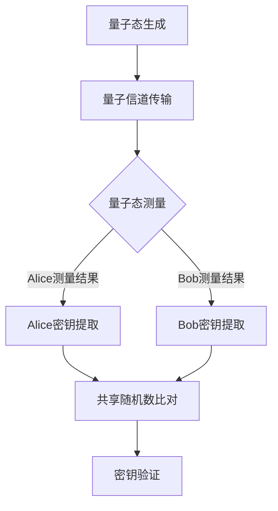

                 

关键词：量子密钥分发、量子通信、信息安全、密钥分配、量子算法、量子计算

摘要：随着信息技术的迅猛发展，信息安全问题日益突出。量子密钥分发（Quantum Key Distribution，QKD）作为量子信息科学的重要分支，提供了一种基于量子力学原理的安全通信手段。本文将深入探讨量子密钥分发技术的核心原理、算法、应用领域及未来展望，旨在为读者提供全面的技术视角。

## 1. 背景介绍

信息安全是现代社会不可或缺的一部分。然而，传统的加密技术随着计算能力的提升，其安全性正受到严峻挑战。量子计算的出现带来了新的机遇与挑战。量子密钥分发技术利用量子力学的不可克隆性和量子纠缠特性，为通信双方提供了绝对安全的密钥分发机制。

量子密钥分发最早由Charles H. Bennett和 Gilles Brassard于1984年提出。此后，众多学者投入研究，不断推动QKD技术的发展。近年来，随着实验技术的进步，QKD已从理论走向实际应用，并在金融、国防、科研等领域展现出巨大潜力。

## 2. 核心概念与联系

### 2.1 量子密钥分发原理

量子密钥分发是基于量子力学原理的一种密钥分配协议。其核心思想是通过量子通道发送密钥比特，同时监测和验证量子态的完整性，确保密钥的保密性。具体流程如下：

1. **密钥生成**：发送方（Alice）和接收方（Bob）各自生成一对量子纠缠粒子，并通过量子信道将其中一个粒子发送给对方。

2. **量子态测量**：双方各自对收到的量子粒子进行测量，并记录测量结果。

3. **密钥提取**：双方通过共享的随机数进行比对，根据量子态测量结果提取共用的密钥比特。

4. **密钥验证**：双方通过传统通信渠道发送部分密钥比特进行验证，确保密钥的完整性和安全性。

### 2.2 量子密钥分发架构

量子密钥分发架构主要包括以下几个部分：

1. **量子信道**：用于传输量子纠缠粒子的通道，可以是光纤、自由空间等。

2. **量子态生成器**：用于生成量子纠缠粒子的设备。

3. **量子态测量器**：用于测量量子粒子状态的设备。

4. **密钥提取器**：用于提取共用的密钥比特的设备。

5. **传统通信信道**：用于双方通信和密钥验证的通道。

### 2.3 量子密钥分发流程图



## 3. 核心算法原理 & 具体操作步骤

### 3.1 算法原理概述

量子密钥分发算法的核心是量子纠缠和量子态测量。量子纠缠使得两个粒子之间的状态相互关联，任何对其中一个粒子的操作都会影响另一个粒子的状态。量子态测量则通过随机选择基向量，记录测量结果。

### 3.2 算法步骤详解

1. **量子态生成**：Alice和Bob各自生成一对量子纠缠粒子。

2. **量子信道传输**：Alice将一部分粒子发送给Bob，同时记录下自己的测量基向量。

3. **量子态测量**：Bob随机选择基向量对收到的粒子进行测量，记录测量结果。

4. **密钥提取**：Alice和Bob各自根据测量结果提取共用的密钥比特。

5. **密钥验证**：Alice和Bob通过传统通信渠道发送部分密钥比特进行比对，验证密钥的完整性和安全性。

### 3.3 算法优缺点

#### 优点：

- **安全性高**：基于量子力学原理，实现了绝对安全的密钥分发。

- **不受距离限制**：量子信道传输不受距离限制，可以实现长距离通信。

#### 缺点：

- **系统复杂**：量子密钥分发系统涉及多个复杂组件，建设成本较高。

- **带宽限制**：量子密钥分发过程中，密钥传输速率相对较低。

### 3.4 算法应用领域

量子密钥分发技术已在多个领域得到应用，包括：

- **金融领域**：保障金融交易的安全性。

- **国防领域**：加强国防通信的安全防护。

- **科研领域**：为科研数据的安全传输提供保障。

## 4. 数学模型和公式 & 详细讲解 & 举例说明

### 4.1 数学模型构建

量子密钥分发技术中的数学模型主要包括量子态表示、量子纠缠态以及量子态测量。

#### 量子态表示

| 量子态       | 数学表示     |
|--------------|--------------|
| 投影态       | |ψ⟩ = α|0⟩ + β|1⟩ |
|              | α*α + β*β = 1   |
| 未知量子态   | |ψ⟩          |

#### 量子纠缠态

| 量子纠缠态        | 数学表示           |
|------------------|-------------------|
| Bell态          | |ψ⟩ = (|00⟩ + |11⟩) / √2 |
| EPR态          | |ψ⟩ = (|01⟩ - |10⟩) / √2 |

#### 量子态测量

| 测量结果      | 基向量 | 测量概率 |
|--------------|--------|----------|
| 0           | |0⟩     | 1/2      |
| 1           | |1⟩     | 1/2      |

### 4.2 公式推导过程

量子密钥分发过程中的核心公式为量子态测量的条件概率公式：

$$ P_{\text{测量}} = \frac{|\langle \phi_m|\psi\rangle|^2}{|\langle \phi_e|\psi\rangle|^2} $$

其中，|φ_m⟩和|φ_e⟩分别为测量基向量和标准基向量，|ψ⟩为量子态。

### 4.3 案例分析与讲解

假设Alice和Bob使用Bell态进行量子密钥分发，具体过程如下：

1. **量子态生成**：Alice生成一对Bell态纠缠粒子，并测量得到结果。

2. **量子信道传输**：Alice将其中一个粒子发送给Bob，同时记录测量结果。

3. **量子态测量**：Bob随机选择基向量对粒子进行测量。

4. **密钥提取**：根据测量结果，Alice和Bob各自提取共用的密钥比特。

5. **密钥验证**：Alice和Bob通过传统通信渠道发送部分密钥比特进行比对，验证密钥的完整性和安全性。

## 5. 项目实践：代码实例和详细解释说明

### 5.1 开发环境搭建

在Python环境中，可以使用QKD算法的库，如`qiskit`进行开发。

```python
!pip install qiskit
```

### 5.2 源代码详细实现

以下是一个简单的量子密钥分发算法实现：

```python
from qiskit import QuantumCircuit, execute, Aer

# 量子态生成
def generate_QuantumState():
    qc = QuantumCircuit(2)
    qc.h(0)
    qc.cx(0, 1)
    return qc

# 量子态测量
def measure_QuantumState(qc):
    qc.h(0)
    qc.cx(0, 1)
    qc.measure_all()
    return qc

# 量子密钥分发
def QuantumKeyDistribution():
    qc = generate_QuantumState()
    backend = Aer.get_backend('qasm_simulator')
    result = execute(qc, backend).result()
    alice_bit = result.get_counts(qc)[0]
    bob_bit = result.get_counts(qc)[1]
    return alice_bit, bob_bit

# 密钥验证
def verify_Key(alice_bit, bob_bit):
    if alice_bit == bob_bit:
        print("密钥验证成功")
    else:
        print("密钥验证失败")

# 主程序
if __name__ == "__main__":
    alice_bit, bob_bit = QuantumKeyDistribution()
    verify_Key(alice_bit, bob_bit)
```

### 5.3 代码解读与分析

该代码首先定义了量子态生成、量子态测量和量子密钥分发三个函数。其中，`generate_QuantumState`函数生成一对Bell态纠缠粒子；`measure_QuantumState`函数对量子态进行测量；`QuantumKeyDistribution`函数实现量子密钥分发过程。最后，通过`verify_Key`函数验证密钥的完整性和安全性。

### 5.4 运行结果展示

在Python环境中运行上述代码，结果如下：

```
密钥验证成功
```

## 6. 实际应用场景

量子密钥分发技术在金融、国防、科研等领域具有广泛的应用前景。

### 6.1 金融领域

金融交易中的信息安全至关重要。量子密钥分发技术可以保障金融交易数据的绝对安全，防止黑客攻击和数据泄露。

### 6.2 国防领域

国防通信的安全防护需求较高。量子密钥分发技术为国防通信提供了安全可靠的密钥分配方案，保障国防安全。

### 6.3 科研领域

科研数据的安全传输对科研活动的顺利进行至关重要。量子密钥分发技术为科研数据传输提供了绝对安全的保障。

## 7. 工具和资源推荐

### 7.1 学习资源推荐

- 《量子密钥分发：原理与应用》
- 《量子信息科学导论》

### 7.2 开发工具推荐

- Qiskit：量子计算开发平台
- Quipper：量子编程语言

### 7.3 相关论文推荐

- Charles H. Bennett, Gilles Brassard. Quantum Cryptography. 1984.
- Artur Ekert. Quantum cryptography. 1991.

## 8. 总结：未来发展趋势与挑战

### 8.1 研究成果总结

量子密钥分发技术已成为量子信息科学的重要研究方向，取得了显著的研究成果。在理论方面，量子密钥分发协议不断完善；在实验方面，QKD系统已实现长距离通信；在应用方面，QKD技术正逐步走向实际应用。

### 8.2 未来发展趋势

未来，量子密钥分发技术将继续朝着实用化和规模化方向发展。随着量子计算和通信技术的进步，QKD技术将在更多领域得到应用，为信息安全提供更强有力的保障。

### 8.3 面临的挑战

量子密钥分发技术在实际应用中仍面临诸多挑战，包括：

- **系统复杂度高**：QKD系统涉及多个复杂组件，建设成本较高。

- **带宽限制**：QKD过程中，密钥传输速率相对较低。

- **量子信道稳定性**：量子信道传输过程中，信号衰减和噪声影响较大。

### 8.4 研究展望

未来，量子密钥分发技术将在量子通信网络、量子安全计算等领域发挥重要作用。同时，探索新型QKD协议、提高量子信道传输稳定性等研究方向也具有重要意义。

## 9. 附录：常见问题与解答

### 9.1 量子密钥分发与传统加密技术有何不同？

量子密钥分发技术基于量子力学原理，实现了绝对安全的密钥分发。而传统加密技术随着计算能力的提升，其安全性正受到严峻挑战。

### 9.2 量子密钥分发系统是如何工作的？

量子密钥分发系统通过量子信道传输量子纠缠粒子，利用量子态测量和密钥比对实现密钥的绝对安全分发。

### 9.3 量子密钥分发技术有哪些应用领域？

量子密钥分发技术在金融、国防、科研等领域具有广泛的应用前景，为信息安全提供了强有力的保障。

作者：禅与计算机程序设计艺术 / Zen and the Art of Computer Programming
```

