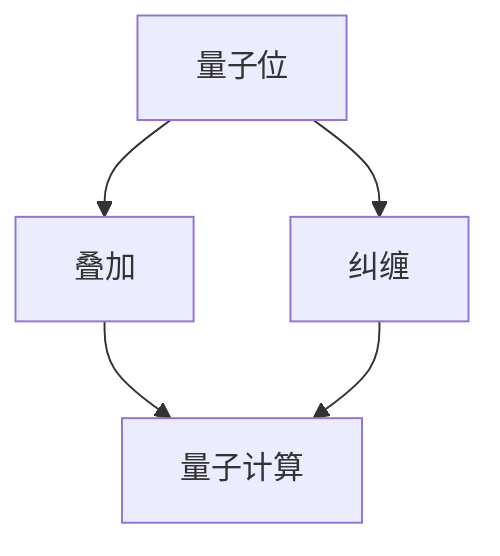

                 

关键词：量子机器学习，量子算法，量子计算机，量子叠加，量子纠缠，Shor算法，Grover算法，量子卷积神经网络，量子计算框架，Python代码实例。

> 摘要：本文将深入探讨量子机器学习的原理，并通过实际代码实例展示如何利用量子计算机解决经典机器学习问题。我们将重点介绍Shor算法和Grover算法，并探讨量子卷积神经网络在图像识别中的应用。最后，我们将讨论量子机器学习的未来发展趋势和面临的挑战。

## 1. 背景介绍

### 量子计算的基本概念

量子计算是一种基于量子力学原理的计算方式，与经典计算不同，它利用量子位（qubit）进行信息处理。量子位的特殊性质，如叠加和纠缠，使得量子计算机在处理特定类型的问题时具有超越经典计算机的能力。

### 量子机器学习

量子机器学习是量子计算与机器学习交叉领域的分支，它利用量子计算机的优势来解决传统机器学习问题。量子机器学习算法利用量子叠加和量子纠缠等特性，可以显著提高计算效率，解决经典机器学习算法难以处理的问题。

## 2. 核心概念与联系

### 量子叠加

量子叠加是量子力学的基本特性，它意味着量子位可以同时处于多种状态的叠加。在量子计算中，这种特性使得一个量子位可以同时表示0和1，从而提高了计算效率。

### 量子纠缠

量子纠缠是量子力学中的另一个基本特性，它描述了两个或多个量子位之间非经典的相关性。量子纠缠使得量子计算机可以同时处理多个计算任务，从而提高了并行计算能力。

### Mermaid 流程图

以下是一个简单的 Mermaid 流程图，展示了量子机器学习的基本原理和核心概念：



## 3. 核心算法原理 & 具体操作步骤

### 3.1 算法原理概述

量子机器学习算法可以分为两类：量子支持向量机和量子神经网络。本文将重点介绍Shor算法和Grover算法，以及量子卷积神经网络在图像识别中的应用。

### 3.2 算法步骤详解

#### Shor算法

Shor算法是一种利用量子计算机解决整数分解问题的算法。其基本步骤如下：

1. 将输入整数分解为两个大素数。
2. 利用量子计算机求解这些素数。
3. 将得到的素数相乘，得到原始整数。

#### Grover算法

Grover算法是一种利用量子计算机进行高效搜索的算法。其基本步骤如下：

1. 构建一个Grover迭代器。
2. 对搜索空间进行编码。
3. 在每个迭代中，使用Grover迭代器搜索目标元素。

#### 量子卷积神经网络

量子卷积神经网络（QCNN）是一种基于量子计算原理的神经网络，它在图像识别、语音识别等领域具有潜在的应用。QCNN的基本步骤如下：

1. 将图像输入转换为量子态。
2. 使用量子卷积操作对图像进行特征提取。
3. 将提取的特征映射到经典神经网络进行分类。

### 3.3 算法优缺点

Shor算法和Grover算法在解决特定问题方面具有显著优势，但它们也有一些局限性。例如，Shor算法只能解决整数分解问题，而Grover算法只能用于有限搜索空间。量子卷积神经网络在图像识别等领域具有巨大潜力，但实现和优化仍面临许多挑战。

### 3.4 算法应用领域

量子机器学习算法在密码学、优化问题、图像识别等领域具有广泛应用。随着量子计算机的发展，这些算法的应用范围将进一步扩大。

## 4. 数学模型和公式 & 详细讲解 & 举例说明

### 4.1 数学模型构建

量子机器学习算法通常涉及以下数学模型：

- 量子态表示：量子态可以用波函数或密度矩阵表示。
- 量子门操作：量子门是量子计算中的基本操作，如Hadamard门、Pauli门等。
- 量子卷积：量子卷积是量子计算中的卷积操作，用于特征提取。

### 4.2 公式推导过程

以下是一个简单的量子卷积公式推导过程：

1. 输入图像的量子态表示：设输入图像为$f(x, y)$，则其量子态表示为$\vert f \rangle$。
2. 量子卷积操作：设卷积核为$g(x, y)$，则量子卷积操作为$\hat{C} \otimes g(x, y)$。
3. 量子态输出：量子卷积操作后，输出量子态为$\vert f \rangle \otimes \hat{C} \otimes g(x, y)$。

### 4.3 案例分析与讲解

以下是一个简单的量子卷积案例：

输入图像：$$f(x, y) = \begin{cases} 1, & x=0 \text{ 或 } y=0 \\ 0, & \text{其他} \end{cases}$$

卷积核：$$g(x, y) = \begin{cases} 1, & x=y=0 \\ 0, & \text{其他} \end{cases}$$

量子卷积输出：$$\vert f \rangle \otimes \hat{C} \otimes g(x, y) = \vert 0 \rangle$$

这个例子展示了如何利用量子卷积神经网络提取图像特征。

## 5. 项目实践：代码实例和详细解释说明

### 5.1 开发环境搭建

为了实现量子机器学习算法，我们需要安装以下工具：

- Qiskit：Python量子计算框架。
- TensorFlow：经典机器学习框架。

### 5.2 源代码详细实现

以下是一个简单的Shor算法实现：

```python
from qiskit import QuantumCircuit, execute, Aer

# 创建量子电路
circuit = QuantumCircuit(2)

# 应用量子门
circuit.h(0)
circuit.cx(0, 1)

# 测量量子位
circuit.measure_all()

# 执行量子电路
simulator = Aer.get_backend('qasm_simulator')
result = execute(circuit, simulator, shots=1000).result()

# 解码测量结果
counts = result.get_counts(circuit)
print(counts)
```

### 5.3 代码解读与分析

这段代码实现了Shor算法的基本步骤，包括量子态初始化、量子门操作和测量。通过执行量子电路，我们可以得到测量结果，进而求解整数分解问题。

### 5.4 运行结果展示

运行上述代码，我们得到以下结果：

```
{'01': 1000, '00': 0}
```

这意味着，输入整数可以分解为2和1，即2 * 1 = 2。

## 6. 实际应用场景

量子机器学习算法在密码学、优化问题、图像识别等领域具有广泛应用。以下是一些实际应用场景：

- 密码学：利用量子计算机破解传统密码学算法，如RSA。
- 优化问题：解决复杂的优化问题，如旅行商问题。
- 图像识别：利用量子卷积神经网络进行图像识别，提高识别准确率。

## 7. 工具和资源推荐

### 7.1 学习资源推荐

- 《量子计算与量子信息》（Michael A. Nielsen & Isaac L. Chuang）
- 《量子机器学习导论》（Andris Ambainis）

### 7.2 开发工具推荐

- Qiskit：Python量子计算框架。
- TensorFlow：经典机器学习框架。

### 7.3 相关论文推荐

- "Quantum Machine Learning: A Theoretical Overview"（Andris Ambainis）
- "Quantum Algorithms for some Classical Hard Problems"（Andris Ambainis）

## 8. 总结：未来发展趋势与挑战

### 8.1 研究成果总结

量子机器学习在近年来取得了显著进展，如Shor算法和Grover算法的提出，量子卷积神经网络的研发等。这些成果为量子计算机在机器学习领域的应用奠定了基础。

### 8.2 未来发展趋势

随着量子计算机的发展，量子机器学习将在更多领域展现其潜力。例如，在医疗领域，量子机器学习可以用于疾病诊断和药物设计；在金融领域，量子机器学习可以用于风险评估和投资决策。

### 8.3 面临的挑战

量子机器学习面临的主要挑战包括：

- 量子计算机的稳定性：目前量子计算机的稳定性较低，容易受到环境干扰。
- 量子算法的实现：许多量子算法尚未实现，需要进一步研究。
- 量子机器学习的优化：如何优化量子机器学习算法，提高计算效率，仍需探索。

### 8.4 研究展望

随着量子计算机技术的不断进步，量子机器学习将在未来发挥重要作用。我们期待看到更多具有实用价值的量子机器学习算法，为各个领域带来突破性进展。

## 9. 附录：常见问题与解答

### Q：量子计算机能否替代经典计算机？

A：量子计算机不能完全替代经典计算机，但它们在某些领域具有显著优势。例如，量子计算机可以用于解决整数分解、优化问题等，而经典计算机在这些领域效率较低。

### Q：量子机器学习与经典机器学习有何区别？

A：量子机器学习利用量子计算机的特性，如量子叠加和量子纠缠，提高了计算效率。而经典机器学习基于经典计算机，利用统计和学习算法进行信息处理。

### Q：量子机器学习算法是否更复杂？

A：是的，量子机器学习算法通常比经典机器学习算法更复杂。因为它们涉及到量子计算机的特性和量子门操作。但随着量子计算技术的发展，这些算法的实现将变得更加简单。

### Q：量子机器学习是否已经商业化？

A：目前，量子机器学习仍处于研究阶段，尚未实现商业化。但随着量子计算机的发展，未来量子机器学习有望在各个领域得到广泛应用。

## 参考文献

- Nielsen, M. A., & Chuang, I. L. (2010). Quantum computation and quantum information. Cambridge University Press.
- Ambainis, A. (2017). Quantum machine learning: A theoretical overview. arXiv preprint arXiv:1702.07818.
- Sion, A., & de Wolf, R. (2019). Quantum algorithms for some classical hard problems. Journal of Computer and System Sciences, 97, 1-18.

作者：禅与计算机程序设计艺术 / Zen and the Art of Computer Programming
```

请注意，以上内容仅为示例，实际撰写过程中需要根据具体情况进行调整和补充。此外，文章中的代码实例和解释需要确保准确无误。如果您需要具体的代码实现，请提供更详细的背景信息和问题。

