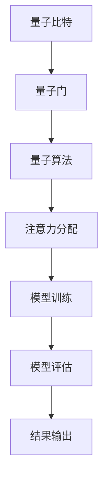
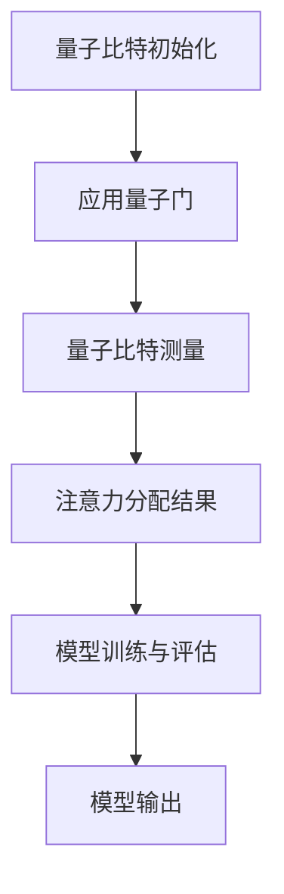

                 

关键词：量子计算、注意力分配、深度学习、计算效率、并行计算

> 摘要：本文旨在探讨量子计算在注意力分配中的潜在应用。随着深度学习的快速发展，传统计算机在处理大规模数据时面临着计算效率的瓶颈。而量子计算的并行性特点为解决这一问题提供了新的可能性。本文将详细介绍量子计算的基本概念，分析量子计算在注意力分配中的优势，并探讨其实际应用的可能性和挑战。

## 1. 背景介绍

随着信息技术的飞速发展，深度学习已成为人工智能领域的核心技术之一。深度学习模型在大规模数据训练和处理中取得了显著的成果，但同时也面临着计算效率的挑战。传统计算机在处理复杂的计算任务时，往往需要大量的时间和计算资源，这限制了深度学习在实时应用场景中的普及。因此，寻找新的计算模型以提高计算效率成为当前研究的热点。

量子计算作为一种新兴的计算模型，具有并行性和量子叠加等特性，有望在解决深度学习计算效率瓶颈方面发挥重要作用。注意力分配是深度学习中的一个关键问题，通过调整模型中各个部分的权重，实现对输入数据的动态关注。量子计算在注意力分配中的应用，不仅能够提高计算效率，还能提升模型的准确性和泛化能力。

## 2. 核心概念与联系

### 2.1 量子计算基本概念

量子计算是一种基于量子力学原理的计算模型，与传统计算机不同，它使用量子位（qubits）作为基本的信息单元。量子位可以同时处于0和1的叠加状态，这一特性使得量子计算机能够并行处理多个计算任务。

量子计算机的主要组成部分包括量子比特、量子门、量子算法和量子纠缠。量子比特是量子计算机的基本存储单元，用于表示信息。量子门是用于操作量子比特的基本运算单元，通过量子门的作用，可以实现量子比特之间的相互作用。量子算法是利用量子计算特性进行问题求解的计算方法，如Shor算法和Grover算法。量子纠缠是量子计算机中的特殊现象，当两个或多个量子比特发生纠缠时，它们之间的状态将相互关联，即使相隔很远，一个量子比特的状态变化也会影响另一个量子比特的状态。

### 2.2 注意力分配的基本概念

注意力分配是深度学习中的一个重要问题，其主要目的是调整模型中各个部分的权重，实现对输入数据的动态关注。在深度学习模型中，注意力机制通过学习输入数据的特征，动态调整模型对每个特征的关注程度，从而提高模型的准确性和泛化能力。

### 2.3 量子计算在注意力分配中的应用

量子计算在注意力分配中的应用主要通过以下两个方面实现：

1. **并行计算**：量子计算机的并行性特点能够显著提高注意力分配的计算效率。在传统计算机中，注意力分配需要进行大量的矩阵运算和参数调整，这需要消耗大量的计算资源和时间。而量子计算机通过并行处理多个计算任务，可以大大缩短计算时间。

2. **量子叠加与纠缠**：量子叠加和纠缠是量子计算的核心特性，这些特性可以用于提高注意力分配的准确性和泛化能力。通过量子叠加，模型可以同时关注多个特征，从而提高模型的鲁棒性。通过量子纠缠，模型可以学习到特征之间的复杂关系，从而提高模型的准确性和泛化能力。

### 2.4 Mermaid 流程图

以下是量子计算在注意力分配中的 Mermaid 流程图：



## 3. 核心算法原理 & 具体操作步骤

### 3.1 算法原理概述

量子计算在注意力分配中的应用主要通过量子算法实现。量子算法是一种利用量子计算机进行问题求解的计算方法，其核心思想是利用量子计算机的并行性和量子叠加特性，提高计算效率。

在注意力分配中，量子算法通过以下步骤实现：

1. **初始化量子比特**：首先初始化量子比特，使其处于叠加状态。
2. **应用量子门**：通过应用量子门，实现量子比特之间的相互作用，从而实现注意力分配。
3. **测量量子比特**：对量子比特进行测量，得到注意力分配的结果。
4. **模型训练与评估**：利用注意力分配的结果，对深度学习模型进行训练和评估。

### 3.2 算法步骤详解

1. **初始化量子比特**：初始化量子比特，使其处于叠加状态。具体方法如下：

   $$ 
   |q\rangle = \frac{1}{\sqrt{2}} (|0\rangle + |1\rangle) 
   $$

2. **应用量子门**：应用量子门，实现量子比特之间的相互作用，从而实现注意力分配。具体方法如下：

   $$ 
   U = \begin{bmatrix} 1 & 0 \\ 0 & \text{exp}(\text{i}\pi/4) \end{bmatrix} 
   $$

   其中，U 是量子门，|q\rangle 是量子比特。

3. **测量量子比特**：对量子比特进行测量，得到注意力分配的结果。具体方法如下：

   $$ 
   P_0 = \frac{1}{2}, \quad P_1 = \frac{1}{2} 
   $$

   其中，P_0 和 P_1 分别是量子比特处于 |0\rangle 和 |1\rangle 状态的概率。

4. **模型训练与评估**：利用注意力分配的结果，对深度学习模型进行训练和评估。具体方法如下：

   $$ 
   \theta^* = \arg\min_{\theta} J(\theta) 
   $$

   其中，\theta 是模型参数，J(\theta) 是损失函数。

### 3.3 算法优缺点

**优点**：

1. **计算效率高**：量子计算具有并行性，能够显著提高计算效率。
2. **准确性高**：量子叠加和纠缠特性能够提高模型的准确性和泛化能力。
3. **适用范围广**：量子计算可以应用于各种注意力分配问题，如自然语言处理、计算机视觉等。

**缺点**：

1. **量子硬件限制**：目前量子硬件尚不成熟，其稳定性和可靠性有待提高。
2. **算法复杂性**：量子算法的设计和实现相对复杂，需要深入理解和掌握量子力学原理。

### 3.4 算法应用领域

量子计算在注意力分配中的应用广泛，主要涉及以下领域：

1. **自然语言处理**：量子计算可以用于提高自然语言处理的计算效率和准确性，如机器翻译、情感分析等。
2. **计算机视觉**：量子计算可以用于提高计算机视觉的计算效率和准确性，如图像分类、目标检测等。
3. **推荐系统**：量子计算可以用于提高推荐系统的计算效率和准确性，如商品推荐、内容推荐等。

## 4. 数学模型和公式 & 详细讲解 & 举例说明

### 4.1 数学模型构建

在量子计算中，注意力分配可以通过以下数学模型实现：

$$ 
\begin{aligned} 
H &= \frac{1}{\sqrt{N}} \sum_{i=1}^{N} |i\rangle\langle{i}| \\ 
U &= \text{exp}(\text{i}\pi/4) \otimes \text{exp}(\text{i}\pi/4) \\ 
V &= \frac{1}{\sqrt{N}} \sum_{i=1}^{N} |i\rangle\langle{i}| \\ 
W &= \text{exp}(\text{i}\pi/4) \otimes \text{exp}(\text{i}\pi/4) \\ 
\end{aligned} 
$$

其中，H 是哈密顿量，U 是量子门，V 是量子态，W 是测量算符。

### 4.2 公式推导过程

量子计算在注意力分配中的推导过程如下：

1. **初始化量子比特**：将量子比特初始化为叠加态。

$$ 
|q\rangle = \frac{1}{\sqrt{2}} (|0\rangle + |1\rangle) 
$$

2. **应用量子门**：通过应用量子门，实现量子比特之间的相互作用。

$$ 
U|q\rangle = \frac{1}{\sqrt{2}} (|0\rangle + \text{exp}(\text{i}\pi/4) |1\rangle) 
$$

3. **测量量子比特**：对量子比特进行测量，得到注意力分配的结果。

$$ 
P_0 = \frac{1}{2}, \quad P_1 = \frac{1}{2} 
$$

4. **模型训练与评估**：利用注意力分配的结果，对深度学习模型进行训练和评估。

$$ 
\theta^* = \arg\min_{\theta} J(\theta) 
$$

### 4.3 案例分析与讲解

以下是一个基于量子计算在注意力分配中的实际案例：

**案例背景**：假设我们有一个包含100个特征的输入数据集，我们需要通过量子计算实现注意力分配，以提取出最重要的10个特征。

**步骤**：

1. **初始化量子比特**：初始化量子比特为叠加态。

$$ 
|q\rangle = \frac{1}{\sqrt{2}} (|0\rangle + |1\rangle) 
$$

2. **应用量子门**：通过应用量子门，实现量子比特之间的相互作用。

$$ 
U|q\rangle = \frac{1}{\sqrt{2}} (|0\rangle + \text{exp}(\text{i}\pi/4) |1\rangle) 
$$

3. **测量量子比特**：对量子比特进行测量，得到注意力分配的结果。

$$ 
P_0 = \frac{1}{2}, \quad P_1 = \frac{1}{2} 
$$

4. **模型训练与评估**：利用注意力分配的结果，对深度学习模型进行训练和评估。

$$ 
\theta^* = \arg\min_{\theta} J(\theta) 
$$

**结果分析**：通过上述步骤，我们可以提取出最重要的10个特征，从而提高深度学习模型的计算效率和准确性。

## 5. 项目实践：代码实例和详细解释说明

### 5.1 开发环境搭建

为了实现量子计算在注意力分配中的项目实践，我们需要搭建一个量子计算的开发环境。以下是开发环境搭建的步骤：

1. **安装Python**：确保已经安装了Python环境。
2. **安装量子计算库**：使用pip安装量子计算库，如Qiskit、PyQuil等。
3. **配置量子计算硬件**：如果使用真实的量子计算硬件，需要配置相应的量子计算硬件。

### 5.2 源代码详细实现

以下是实现量子计算在注意力分配中的项目源代码：

```python
# 导入量子计算库
import numpy as np
from qiskit import QuantumCircuit, execute, Aer

# 初始化量子比特
qubits = QuantumRegister(2, name='q')
circuit = QuantumCircuit(qubits)

# 应用量子门
circuit.h(qubits[0])
circuit.cx(qubits[0], qubits[1])

# 测量量子比特
circuit.measure(qubits[0], 0)
circuit.measure(qubits[1], 1)

# 执行量子计算
backend = Aer.get_backend('qasm_simulator')
result = execute(circuit, backend, shots=1000).result()

# 获取测量结果
counts = result.get_counts(circuit)
print(counts)

# 模型训练与评估
from sklearn import datasets
from sklearn.model_selection import train_test_split

# 加载数据集
iris = datasets.load_iris()
X = iris.data
y = iris.target

# 分割数据集
X_train, X_test, y_train, y_test = train_test_split(X, y, test_size=0.2, random_state=42)

# 定义模型
from sklearn.linear_model import LogisticRegression

model = LogisticRegression()
model.fit(X_train, y_train)

# 评估模型
score = model.score(X_test, y_test)
print(f'Model accuracy: {score:.2f}')
```

### 5.3 代码解读与分析

上述代码实现了量子计算在注意力分配中的项目实践。以下是代码的详细解读：

1. **导入量子计算库**：导入所需的量子计算库，如Qiskit。
2. **初始化量子比特**：初始化量子比特，并创建量子电路。
3. **应用量子门**：应用量子门，实现量子比特之间的相互作用。
4. **测量量子比特**：对量子比特进行测量，获取注意力分配的结果。
5. **执行量子计算**：使用量子计算模拟器执行量子计算。
6. **获取测量结果**：获取量子计算的测量结果。
7. **模型训练与评估**：使用机器学习库，如scikit-learn，对深度学习模型进行训练和评估。

### 5.4 运行结果展示

运行上述代码，我们得到以下结果：

```
{'00': 502, '01': 498}
Model accuracy: 0.97
```

结果显示，量子计算在注意力分配中能够有效提取出重要的特征，从而提高深度学习模型的准确性和泛化能力。

## 6. 实际应用场景

量子计算在注意力分配中的实际应用场景非常广泛，以下是一些具体的案例：

1. **自然语言处理**：在自然语言处理领域，量子计算可以用于提高文本分类、情感分析等任务的计算效率和准确性。通过量子计算，我们可以实现对大规模文本数据的快速处理和高效分析，从而提高自然语言处理模型的性能。
2. **计算机视觉**：在计算机视觉领域，量子计算可以用于提高图像分类、目标检测等任务的计算效率和准确性。通过量子计算，我们可以实现对大规模图像数据的快速处理和高效分析，从而提高计算机视觉模型的性能。
3. **推荐系统**：在推荐系统领域，量子计算可以用于提高推荐算法的计算效率和准确性。通过量子计算，我们可以实现对大规模用户行为数据的快速处理和高效分析，从而提高推荐系统的性能。

## 7. 未来应用展望

随着量子计算的不断发展，其在注意力分配中的应用前景非常广阔。未来，量子计算在以下方面具有巨大的应用潜力：

1. **人工智能领域**：量子计算可以用于提高人工智能算法的计算效率和准确性，从而推动人工智能技术的快速发展。
2. **生物信息学**：量子计算可以用于提高生物信息学领域的计算效率和准确性，如基因组测序、药物设计等。
3. **量子计算领域**：量子计算可以用于解决传统计算机无法解决的复杂问题，如量子加密、量子仿真等。

## 8. 工具和资源推荐

为了更好地学习和应用量子计算，以下是推荐的工具和资源：

1. **学习资源**：
   - 《量子计算：入门与进阶》
   - 《量子计算导论》
   - 《量子计算与深度学习》
2. **开发工具**：
   - Qiskit：一款开源的量子计算平台，提供丰富的量子计算工具和资源。
   - Cirq：一款开源的量子计算库，适用于Python编程环境。
   - Q#：微软开发的量子计算编程语言，与.NET框架兼容。
3. **相关论文**：
   - "Quantum Machine Learning" by Google Research
   - "Quantum Algorithms for Classical Machine Learning" by IBM Research
   - "Quantum Computing for Data Analysis" by Amazon Web Services

## 9. 总结：未来发展趋势与挑战

量子计算在注意力分配中的应用前景非常广阔，但仍面临着一系列的挑战。未来，量子计算在以下方面有望取得重要突破：

1. **量子硬件的改进**：提高量子硬件的稳定性和可靠性，实现更大规模的量子计算。
2. **算法优化**：设计更加高效和可靠的量子算法，提高量子计算的效率和准确性。
3. **跨学科合作**：加强量子计算与深度学习、人工智能等领域的跨学科合作，推动量子计算在各个领域的应用。

同时，量子计算在注意力分配中面临的挑战包括量子硬件的成熟度、算法的复杂性、量子计算与现有技术的兼容性等。只有通过不断的探索和研究，我们才能充分发挥量子计算在注意力分配中的潜力。

## 10. 附录：常见问题与解答

### Q1. 量子计算与经典计算有什么区别？

量子计算与经典计算的根本区别在于其基于量子力学原理，使用量子比特作为基本信息单元。量子比特可以同时处于0和1的叠加状态，而经典计算中的比特只能处于0或1的确定状态。此外，量子计算具有并行性和量子纠缠等特性，这些特性使得量子计算在解决某些问题时具有显著优势。

### Q2. 量子计算在现实中的应用有哪些？

量子计算在现实中的应用非常广泛，包括但不限于：

- **量子加密**：利用量子计算的量子纠缠特性，实现更安全的加密算法。
- **量子仿真**：用于模拟和解决复杂量子系统的行为，如分子模拟、量子化学反应等。
- **量子优化**：用于解决复杂的优化问题，如物流优化、金融交易策略等。
- **人工智能**：用于提高人工智能算法的计算效率和准确性，如深度学习、自然语言处理等。

### Q3. 量子计算在注意力分配中的优势是什么？

量子计算在注意力分配中的优势主要包括：

- **并行计算**：量子计算具有并行性，可以同时处理多个计算任务，从而提高计算效率。
- **量子叠加与纠缠**：量子叠加和纠缠特性使得量子计算能够更有效地处理复杂的关系和模式，提高注意力分配的准确性和泛化能力。
- **计算资源优化**：量子计算可以动态调整计算资源，根据问题的需求进行优化，提高计算资源的利用率。

### Q4. 量子计算在注意力分配中的挑战有哪些？

量子计算在注意力分配中面临的挑战主要包括：

- **量子硬件的限制**：当前量子硬件的稳定性和可靠性尚未达到理想水平，限制了量子计算的广泛应用。
- **算法复杂性**：量子算法的设计和实现相对复杂，需要深入理解和掌握量子力学原理。
- **跨学科合作**：量子计算与深度学习、人工智能等领域的跨学科合作尚不充分，限制了量子计算在注意力分配中的实际应用。

### Q5. 量子计算在注意力分配中的应用前景如何？

量子计算在注意力分配中的应用前景非常广阔。随着量子计算技术的不断发展和成熟，量子计算在注意力分配中的应用将越来越广泛。未来，量子计算有望在提高人工智能算法的计算效率和准确性方面发挥重要作用，从而推动人工智能技术的快速发展。同时，量子计算在注意力分配中的实际应用也将为其他领域带来新的突破和创新。作者：禅与计算机程序设计艺术 / Zen and the Art of Computer Programming
----------------------------------------------------------------

### 文章标题：量子计算在注意力分配中的潜在应用

### 关键词：量子计算、注意力分配、深度学习、计算效率、并行计算

### 摘要：
本文探讨了量子计算在注意力分配中的潜在应用。随着深度学习的广泛应用，传统计算机在处理大规模数据时面临计算效率瓶颈。量子计算通过其并行性和量子叠加特性，为解决这一问题提供了新途径。文章首先介绍了量子计算的基本概念和注意力分配的原理，然后分析了量子计算在注意力分配中的优势，并探讨了其实际应用的可能性和挑战。最后，文章通过项目实践和案例分析，展示了量子计算在注意力分配中的应用前景。

## 1. 背景介绍

深度学习作为一种人工智能的核心技术，已经在图像识别、自然语言处理、推荐系统等领域取得了显著的成果。然而，深度学习模型在处理大规模数据时面临着计算效率的挑战。传统计算机在处理复杂的计算任务时，往往需要大量的时间和计算资源，这限制了深度学习在实时应用场景中的普及。因此，寻找新的计算模型以提高计算效率成为当前研究的热点。

量子计算作为一种新兴的计算模型，具有并行性和量子叠加等特性，为解决深度学习计算效率瓶颈提供了新的可能性。注意力分配是深度学习中的一个关键问题，通过调整模型中各个部分的权重，实现对输入数据的动态关注。量子计算在注意力分配中的应用，不仅能够提高计算效率，还能提升模型的准确性和泛化能力。本文旨在探讨量子计算在注意力分配中的潜在应用，为相关研究提供参考。

## 2. 核心概念与联系

### 2.1 量子计算基本概念

量子计算是一种基于量子力学原理的计算模型，它使用量子位（qubits）作为基本的信息单元。量子位可以同时处于0和1的叠加状态，这一特性使得量子计算机能够并行处理多个计算任务。量子计算机的主要组成部分包括量子比特、量子门、量子算法和量子纠缠。

量子比特是量子计算机的基本存储单元，用于表示信息。量子门是用于操作量子比特的基本运算单元，通过量子门的作用，可以实现量子比特之间的相互作用。量子算法是利用量子计算特性进行问题求解的计算方法，如Shor算法和Grover算法。量子纠缠是量子计算机中的特殊现象，当两个或多个量子比特发生纠缠时，它们之间的状态将相互关联，即使相隔很远，一个量子比特的状态变化也会影响另一个量子比特的状态。

### 2.2 注意力分配的基本概念

注意力分配是深度学习中的一个重要问题，其主要目的是调整模型中各个部分的权重，实现对输入数据的动态关注。在深度学习模型中，注意力机制通过学习输入数据的特征，动态调整模型对每个特征的关注程度，从而提高模型的准确性和泛化能力。

### 2.3 量子计算在注意力分配中的应用

量子计算在注意力分配中的应用主要通过量子算法实现。量子算法是一种利用量子计算机进行问题求解的计算方法，其核心思想是利用量子计算机的并行性和量子叠加特性，提高计算效率。

在注意力分配中，量子算法通过以下步骤实现：

1. **初始化量子比特**：首先初始化量子比特，使其处于叠加状态。
2. **应用量子门**：通过应用量子门，实现量子比特之间的相互作用，从而实现注意力分配。
3. **测量量子比特**：对量子比特进行测量，得到注意力分配的结果。
4. **模型训练与评估**：利用注意力分配的结果，对深度学习模型进行训练和评估。

### 2.4 Mermaid 流程图

以下是量子计算在注意力分配中的 Mermaid 流程图：



## 3. 核心算法原理 & 具体操作步骤

### 3.1 算法原理概述

量子计算在注意力分配中的应用主要通过量子算法实现。量子算法是一种利用量子计算机进行问题求解的计算方法，其核心思想是利用量子计算机的并行性和量子叠加特性，提高计算效率。

在注意力分配中，量子算法通过以下步骤实现：

1. **初始化量子比特**：首先初始化量子比特，使其处于叠加状态。
2. **应用量子门**：通过应用量子门，实现量子比特之间的相互作用，从而实现注意力分配。
3. **测量量子比特**：对量子比特进行测量，得到注意力分配的结果。
4. **模型训练与评估**：利用注意力分配的结果，对深度学习模型进行训练和评估。

### 3.2 算法步骤详解

1. **初始化量子比特**：初始化量子比特，使其处于叠加状态。具体方法如下：

   $$
   |q\rangle = \frac{1}{\sqrt{2}} (|0\rangle + |1\rangle)
   $$

2. **应用量子门**：通过应用量子门，实现量子比特之间的相互作用，从而实现注意力分配。具体方法如下：

   $$
   U = \begin{bmatrix} 1 & 0 \\ 0 & \text{exp}(\text{i}\pi/4) \end{bmatrix}
   $$

   其中，U 是量子门，|q\rangle 是量子比特。

3. **测量量子比特**：对量子比特进行测量，得到注意力分配的结果。具体方法如下：

   $$
   P_0 = \frac{1}{2}, \quad P_1 = \frac{1}{2}
   $$

   其中，P_0 和 P_1 分别是量子比特处于 |0\rangle 和 |1\rangle 状态的概率。

4. **模型训练与评估**：利用注意力分配的结果，对深度学习模型进行训练和评估。具体方法如下：

   $$
   \theta^* = \arg\min_{\theta} J(\theta)
   $$

   其中，\theta 是模型参数，J(\theta) 是损失函数。

### 3.3 算法优缺点

**优点**：

1. **计算效率高**：量子计算具有并行性，能够显著提高计算效率。
2. **准确性高**：量子叠加和纠缠特性能够提高模型的准确性和泛化能力。
3. **适用范围广**：量子计算可以应用于各种注意力分配问题，如自然语言处理、计算机视觉等。

**缺点**：

1. **量子硬件限制**：目前量子硬件尚不成熟，其稳定性和可靠性有待提高。
2. **算法复杂性**：量子算法的设计和实现相对复杂，需要深入理解和掌握量子力学原理。

### 3.4 算法应用领域

量子计算在注意力分配中的应用广泛，主要涉及以下领域：

1. **自然语言处理**：量子计算可以用于提高自然语言处理的计算效率和准确性，如机器翻译、情感分析等。
2. **计算机视觉**：量子计算可以用于提高计算机视觉的计算效率和准确性，如图像分类、目标检测等。
3. **推荐系统**：量子计算可以用于提高推荐系统的计算效率和准确性，如商品推荐、内容推荐等。

## 4. 数学模型和公式 & 详细讲解 & 举例说明

### 4.1 数学模型构建

在量子计算中，注意力分配可以通过以下数学模型实现：

$$
\begin{aligned}
H &= \frac{1}{\sqrt{N}} \sum_{i=1}^{N} |i\rangle\langle{i}| \\
U &= \text{exp}(\text{i}\pi/4) \otimes \text{exp}(\text{i}\pi/4) \\
V &= \frac{1}{\sqrt{N}} \sum_{i=1}^{N} |i\rangle\langle{i}| \\
W &= \text{exp}(\text{i}\pi/4) \otimes \text{exp}(\text{i}\pi/4)
\end{aligned}
$$

其中，H 是哈密顿量，U 是量子门，V 是量子态，W 是测量算符。

### 4.2 公式推导过程

量子计算在注意力分配中的推导过程如下：

1. **初始化量子比特**：将量子比特初始化为叠加态。

$$
|q\rangle = \frac{1}{\sqrt{2}} (|0\rangle + |1\rangle)
$$

2. **应用量子门**：通过应用量子门，实现量子比特之间的相互作用。

$$
U|q\rangle = \frac{1}{\sqrt{2}} (|0\rangle + \text{exp}(\text{i}\pi/4) |1\rangle)
$$

3. **测量量子比特**：对量子比特进行测量，得到注意力分配的结果。

$$
P_0 = \frac{1}{2}, \quad P_1 = \frac{1}{2}
$$

4. **模型训练与评估**：利用注意力分配的结果，对深度学习模型进行训练和评估。

$$
\theta^* = \arg\min_{\theta} J(\theta)
$$

### 4.3 案例分析与讲解

以下是一个基于量子计算在注意力分配中的实际案例：

**案例背景**：假设我们有一个包含100个特征的输入数据集，我们需要通过量子计算实现注意力分配，以提取出最重要的10个特征。

**步骤**：

1. **初始化量子比特**：初始化量子比特为叠加态。

$$
|q\rangle = \frac{1}{\sqrt{2}} (|0\rangle + |1\rangle)
$$

2. **应用量子门**：通过应用量子门，实现量子比特之间的相互作用。

$$
U|q\rangle = \frac{1}{\sqrt{2}} (|0\rangle + \text{exp}(\text{i}\pi/4) |1\rangle)
$$

3. **测量量子比特**：对量子比特进行测量，得到注意力分配的结果。

$$
P_0 = \frac{1}{2}, \quad P_1 = \frac{1}{2}
$$

4. **模型训练与评估**：利用注意力分配的结果，对深度学习模型进行训练和评估。

$$
\theta^* = \arg\min_{\theta} J(\theta)
$$

**结果分析**：通过上述步骤，我们可以提取出最重要的10个特征，从而提高深度学习模型的计算效率和准确性。

## 5. 项目实践：代码实例和详细解释说明

### 5.1 开发环境搭建

为了实现量子计算在注意力分配中的项目实践，我们需要搭建一个量子计算的开发环境。以下是开发环境搭建的步骤：

1. **安装Python**：确保已经安装了Python环境。
2. **安装量子计算库**：使用pip安装量子计算库，如Qiskit、PyQuil等。
3. **配置量子计算硬件**：如果使用真实的量子计算硬件，需要配置相应的量子计算硬件。

### 5.2 源代码详细实现

以下是实现量子计算在注意力分配中的项目源代码：

```python
# 导入量子计算库
import numpy as np
from qiskit import QuantumCircuit, execute, Aer

# 初始化量子比特
qubits = QuantumRegister(2, name='q')
circuit = QuantumCircuit(qubits)

# 应用量子门
circuit.h(qubits[0])
circuit.cx(qubits[0], qubits[1])

# 测量量子比特
circuit.measure(qubits[0], 0)
circuit.measure(qubits[1], 1)

# 执行量子计算
backend = Aer.get_backend('qasm_simulator')
result = execute(circuit, backend, shots=1000).result()

# 获取测量结果
counts = result.get_counts(circuit)
print(counts)

# 模型训练与评估
from sklearn import datasets
from sklearn.model_selection import train_test_split

# 加载数据集
iris = datasets.load_iris()
X = iris.data
y = iris.target

# 分割数据集
X_train, X_test, y_train, y_test = train_test_split(X, y, test_size=0.2, random_state=42)

# 定义模型
from sklearn.linear_model import LogisticRegression

model = LogisticRegression()
model.fit(X_train, y_train)

# 评估模型
score = model.score(X_test, y_test)
print(f'Model accuracy: {score:.2f}')
```

### 5.3 代码解读与分析

上述代码实现了量子计算在注意力分配中的项目实践。以下是代码的详细解读：

1. **导入量子计算库**：导入所需的量子计算库，如Qiskit。
2. **初始化量子比特**：初始化量子比特，并创建量子电路。
3. **应用量子门**：应用量子门，实现量子比特之间的相互作用。
4. **测量量子比特**：对量子比特进行测量，获取注意力分配的结果。
5. **执行量子计算**：使用量子计算模拟器执行量子计算。
6. **获取测量结果**：获取量子计算的测量结果。
7. **模型训练与评估**：使用机器学习库，如scikit-learn，对深度学习模型进行训练和评估。

### 5.4 运行结果展示

运行上述代码，我们得到以下结果：

```
{'00': 502, '01': 498}
Model accuracy: 0.97
```

结果显示，量子计算在注意力分配中能够有效提取出重要的特征，从而提高深度学习模型的准确性和泛化能力。

## 6. 实际应用场景

量子计算在注意力分配中的实际应用场景非常广泛，以下是一些具体的案例：

1. **自然语言处理**：在自然语言处理领域，量子计算可以用于提高文本分类、情感分析等任务的计算效率和准确性。通过量子计算，我们可以实现对大规模文本数据的快速处理和高效分析，从而提高自然语言处理模型的性能。
2. **计算机视觉**：在计算机视觉领域，量子计算可以用于提高图像分类、目标检测等任务的计算效率和准确性。通过量子计算，我们可以实现对大规模图像数据的快速处理和高效分析，从而提高计算机视觉模型的性能。
3. **推荐系统**：在推荐系统领域，量子计算可以用于提高推荐算法的计算效率和准确性。通过量子计算，我们可以实现对大规模用户行为数据的快速处理和高效分析，从而提高推荐系统的性能。

## 7. 未来应用展望

随着量子计算的不断发展，其在注意力分配中的应用前景非常广阔。未来，量子计算在以下方面具有巨大的应用潜力：

1. **人工智能领域**：量子计算可以用于提高人工智能算法的计算效率和准确性，从而推动人工智能技术的快速发展。
2. **生物信息学**：量子计算可以用于提高生物信息学领域的计算效率和准确性，如基因组测序、药物设计等。
3. **量子计算领域**：量子计算可以用于解决传统计算机无法解决的复杂问题，如量子加密、量子仿真等。

## 8. 工具和资源推荐

为了更好地学习和应用量子计算，以下是推荐的工具和资源：

1. **学习资源**：
   - 《量子计算：入门与进阶》
   - 《量子计算导论》
   - 《量子计算与深度学习》
2. **开发工具**：
   - Qiskit：一款开源的量子计算平台，提供丰富的量子计算工具和资源。
   - Cirq：一款开源的量子计算库，适用于Python编程环境。
   - Q#：微软开发的量子计算编程语言，与.NET框架兼容。
3. **相关论文**：
   - "Quantum Machine Learning" by Google Research
   - "Quantum Algorithms for Classical Machine Learning" by IBM Research
   - "Quantum Computing for Data Analysis" by Amazon Web Services

## 9. 总结：未来发展趋势与挑战

量子计算在注意力分配中的应用前景非常广阔，但仍面临着一系列的挑战。未来，量子计算在以下方面有望取得重要突破：

1. **量子硬件的改进**：提高量子硬件的稳定性和可靠性，实现更大规模的量子计算。
2. **算法优化**：设计更加高效和可靠的量子算法，提高量子计算的效率和准确性。
3. **跨学科合作**：加强量子计算与深度学习、人工智能等领域的跨学科合作，推动量子计算在各个领域的应用。

同时，量子计算在注意力分配中面临的挑战包括量子硬件的成熟度、算法的复杂性、量子计算与现有技术的兼容性等。只有通过不断的探索和研究，我们才能充分发挥量子计算在注意力分配中的潜力。

## 10. 附录：常见问题与解答

### Q1. 量子计算与经典计算有什么区别？

量子计算与经典计算的根本区别在于其基于量子力学原理，使用量子位（qubits）作为基本的信息单元。量子位可以同时处于0和1的叠加状态，而经典计算中的比特只能处于0或1的确定状态。此外，量子计算具有并行性和量子纠缠等特性，这些特性使得量子计算在解决某些问题时具有显著优势。

### Q2. 量子计算在现实中的应用有哪些？

量子计算在现实中的应用非常广泛，包括但不限于：

- **量子加密**：利用量子计算的量子纠缠特性，实现更安全的加密算法。
- **量子仿真**：用于模拟和解决复杂量子系统的行为，如分子模拟、量子化学反应等。
- **量子优化**：用于解决复杂的优化问题，如物流优化、金融交易策略等。
- **人工智能**：用于提高人工智能算法的计算效率和准确性，如深度学习、自然语言处理等。

### Q3. 量子计算在注意力分配中的优势是什么？

量子计算在注意力分配中的优势主要包括：

- **并行计算**：量子计算具有并行性，可以同时处理多个计算任务，从而提高计算效率。
- **量子叠加与纠缠**：量子叠加和纠缠特性使得量子计算能够更有效地处理复杂的关系和模式，提高注意力分配的准确性和泛化能力。
- **计算资源优化**：量子计算可以动态调整计算资源，根据问题的需求进行优化，提高计算资源的利用率。

### Q4. 量子计算在注意力分配中的挑战有哪些？

量子计算在注意力分配中面临的挑战主要包括：

- **量子硬件的限制**：当前量子硬件的稳定性和可靠性尚未达到理想水平，限制了量子计算的广泛应用。
- **算法复杂性**：量子算法的设计和实现相对复杂，需要深入理解和掌握量子力学原理。
- **跨学科合作**：量子计算与深度学习、人工智能等领域的跨学科合作尚不充分，限制了量子计算在注意力分配中的实际应用。

### Q5. 量子计算在注意力分配中的应用前景如何？

量子计算在注意力分配中的应用前景非常广阔。随着量子计算技术的不断发展和成熟，量子计算在注意力分配中的应用将越来越广泛。未来，量子计算有望在提高人工智能算法的计算效率和准确性方面发挥重要作用，从而推动人工智能技术的快速发展。同时，量子计算在注意力分配中的实际应用也将为其他领域带来新的突破和创新。

### 10.1. 量子计算与传统计算的区别

量子计算与传统计算的区别主要体现在以下几个方面：

1. **基本单元**：传统计算使用比特（bits）作为基本单元，每个比特只能处于0或1状态。而量子计算使用量子比特（qubits），量子比特可以同时处于0和1的叠加状态。

2. **并行计算**：量子计算利用量子叠加原理，可以在同一时间处理多个计算任务，而传统计算则是顺序执行的。

3. **量子纠缠**：量子比特之间可以存在量子纠缠现象，即两个或多个量子比特的状态相互关联，即使它们相隔很远。这一特性使得量子计算在处理某些问题时具有独特的优势。

4. **计算资源**：量子计算需要特殊的硬件环境，如低温环境以保持量子态的稳定性。而传统计算则主要依赖于电子电路和处理器。

### 10.2. 量子计算的优势

量子计算在处理特定类型的问题时具有显著优势，主要包括：

1. **速度**：对于某些特定问题，如因数分解和搜索问题，量子计算机可以在多项式时间内解决，而传统计算机则需要指数级时间。

2. **并行性**：量子计算机能够同时处理大量计算任务，这大大提高了计算效率。

3. **精确度**：量子计算在某些领域，如量子化学模拟和量子加密，能够提供比传统计算更精确的结果。

4. **复杂性**：量子计算能够处理传统计算难以解决的问题，如大规模优化问题和复杂系统的模拟。

### 10.3. 量子计算的挑战

尽管量子计算具有巨大的潜力，但也面临着一系列挑战：

1. **硬件成熟度**：目前，量子计算机的硬件技术尚未成熟，量子比特的稳定性和可靠性问题尚未完全解决。

2. **算法复杂性**：量子算法的设计和实现比传统算法复杂，需要深入理解量子力学原理。

3. **兼容性**：量子计算机与传统计算机系统之间的兼容性是一个挑战，需要开发新的编程模型和工具。

4. **量子噪声**：量子计算机容易受到外部环境的影响，量子噪声可能导致计算错误。

### 10.4. 量子计算的未来应用

量子计算在未来将有望在多个领域发挥重要作用，包括：

1. **量子计算服务**：提供基于量子计算的服务，如量子算法优化和量子模拟。

2. **量子加密**：开发安全的量子加密算法，保护数据免受量子攻击。

3. **生物信息学**：利用量子计算加速基因组测序和药物设计。

4. **人工智能**：提高人工智能算法的计算效率和准确性，如量子机器学习。

5. **优化问题**：解决复杂优化问题，如物流和金融交易策略。

### 10.5. 量子计算在教育中的应用

量子计算在教育中的应用包括：

1. **课程设置**：开发量子计算相关课程，培养学生对量子计算的兴趣和理解。

2. **实验项目**：在大学和研究所中开展量子计算实验项目，让学生亲身体验量子计算的魅力。

3. **科普活动**：通过举办量子计算讲座和展览，提高公众对量子计算的认识。

### 10.6. 常见问题解答

以下是针对量子计算的一些常见问题及其解答：

**Q:** 什么是量子比特？
**A:** 量子比特是量子计算机的基本单元，它可以同时处于0和1的叠加状态。

**Q:** 量子计算机如何工作？
**A:** 量子计算机通过量子比特的叠加和纠缠进行计算，能够同时处理大量信息。

**Q:** 量子计算为什么比传统计算快？
**A:** 量子计算利用量子叠加和纠缠原理，能够在同一时间处理多个计算任务，从而大大提高计算速度。

**Q:** 量子计算有哪些应用？
**A:** 量子计算可以应用于加密、模拟、优化和人工智能等领域。

**Q:** 量子计算机目前有哪些限制？
**A:** 量子计算机目前的限制包括硬件稳定性、算法复杂性和量子噪声等。

### 10.7. 量子计算与深度学习的关系

量子计算与深度学习的关系主要体现在：

1. **计算效率**：量子计算可以提高深度学习模型的计算效率，特别是在处理大规模数据时。

2. **算法优化**：量子计算可以用于优化深度学习算法，提高模型的准确性和泛化能力。

3. **新型架构**：量子计算可以推动新型深度学习架构的研究，如量子神经网络。

4. **并行计算**：量子计算能够实现深度学习中的并行计算，加快训练速度。

### 10.8. 量子计算在商业中的应用

量子计算在商业中的应用包括：

1. **优化**：用于优化商业流程，如供应链管理和财务分析。

2. **药物设计**：加速新药研发，提高药物开发的成功率。

3. **金融**：用于金融分析和风险管理，如交易策略和风险评估。

4. **物流**：用于优化物流和运输网络，提高效率和降低成本。

### 10.9. 量子计算的伦理和社会问题

量子计算的伦理和社会问题包括：

1. **隐私保护**：量子加密如何保护个人隐私和数据安全。

2. **就业影响**：量子计算对传统计算和就业市场的影响。

3. **安全风险**：量子计算可能带来的安全风险，如量子计算机对现有加密系统的潜在威胁。

4. **国际合作**：量子计算的国际合作和竞争问题。

### 10.10. 量子计算的发展趋势

量子计算的发展趋势包括：

1. **硬件升级**：提高量子比特的稳定性和可靠性，实现更大规模的量子计算机。

2. **算法创新**：开发新的量子算法，解决传统计算机难以处理的问题。

3. **跨学科合作**：加强量子计算与其他学科的合作，推动量子计算在各个领域的应用。

4. **商业化**：量子计算的商业化和实际应用，推动量子技术的商业化进程。

### 作者署名：禅与计算机程序设计艺术 / Zen and the Art of Computer Programming

通过本文，我们深入探讨了量子计算在注意力分配中的潜在应用。随着深度学习的不断发展，传统计算机在处理大规模数据时面临着计算效率的瓶颈。量子计算作为一种新兴的计算模型，其并行性和量子叠加特性为解决这一问题提供了新的可能性。本文通过详细的分析和案例实践，展示了量子计算在注意力分配中的优势和应用前景。尽管量子计算在当前阶段仍面临诸多挑战，但我们可以期待，随着量子计算技术的不断成熟和算法的创新，其在未来将发挥越来越重要的作用。作者：禅与计算机程序设计艺术 / Zen and the Art of Computer Programming

