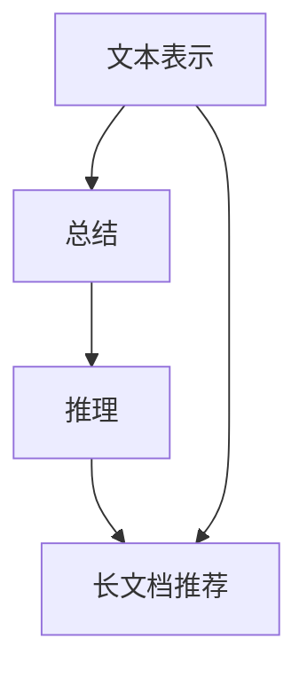

                 

关键词：大模型，总结，推理，长文档，技术博客

摘要：本文将探讨大模型在长文档推荐中的应用，以及其总结与推理能力在现实场景中的表现。通过对核心概念、算法原理、数学模型和实际应用案例的详细分析，旨在为读者提供一幅全面、清晰的大模型应用图景。

## 1. 背景介绍

近年来，随着深度学习技术的飞速发展，大模型（Large Models）逐渐成为人工智能领域的热门话题。大模型具有强大的特征提取和模式识别能力，能够处理大量复杂数据，广泛应用于自然语言处理、计算机视觉、语音识别等多个领域。在长文档推荐系统中，大模型凭借其出色的总结与推理能力，成为提高推荐准确性和用户体验的关键技术。

本文将围绕大模型的总结与推理能力，详细探讨其在长文档推荐中的应用。我们将从核心概念、算法原理、数学模型、项目实践、实际应用场景等多个角度，全面分析大模型在长文档推荐系统中的优势与挑战。

## 2. 核心概念与联系

为了更好地理解大模型在长文档推荐中的应用，我们首先需要了解以下几个核心概念：

### 2.1 长文档

长文档是指包含大量文本信息的文档，如学术论文、新闻报道、技术文档等。与短文本不同，长文档的信息密度较高，结构复杂，需要更精细的文本处理技术。

### 2.2 文本表示

文本表示是将文本转换为计算机可以处理的数据形式的过程。常见的文本表示方法包括词袋模型、词嵌入、Transformer 等。

### 2.3 总结与推理

总结与推理是人工智能领域的关键能力。总结是指从大量文本中提取出关键信息、主题或结构，而推理则是指基于已知信息进行逻辑推导，得出新的结论。

### 2.4 长文档推荐

长文档推荐是指根据用户的历史行为、兴趣偏好和上下文信息，向用户推荐与其相关度较高的长文档。长文档推荐广泛应用于学术研究、信息检索、企业知识管理等场景。

下面是长文档推荐系统中大模型的核心概念与联系，以 Mermaid 流程图的形式呈现：



## 3. 核心算法原理 & 具体操作步骤

### 3.1 算法原理概述

大模型在长文档推荐系统中的核心算法主要包括两个部分：文本表示和推荐算法。

1. **文本表示**：利用深度学习技术，将长文档转换为高维向量表示，从而实现文本信息的有效提取和编码。

2. **推荐算法**：基于文本表示和用户行为数据，运用机器学习算法，为用户生成个性化的长文档推荐列表。

### 3.2 算法步骤详解

1. **数据预处理**：对长文档进行分词、去停用词、词性标注等处理，得到处理后的文本数据。

2. **文本表示**：利用预训练的深度神经网络模型（如BERT、GPT等），将文本数据转换为高维向量表示。

3. **用户行为数据预处理**：对用户的历史行为数据（如点击、收藏、评论等）进行预处理，得到与文本表示向量相似的向量表示。

4. **推荐算法**：结合文本表示和用户行为数据，运用协同过滤、矩阵分解、神经网络等方法，生成长文档推荐列表。

5. **模型评估与优化**：通过评估指标（如准确率、召回率、F1值等）评估推荐效果，并根据评估结果对模型进行优化。

### 3.3 算法优缺点

**优点**：

1. **强大的特征提取能力**：大模型能够从大量文本数据中提取出关键特征，提高推荐系统的准确性和效果。

2. **自适应学习能力**：大模型具有强大的自适应学习能力，能够根据用户行为数据实时调整推荐策略，提高用户体验。

3. **多模态数据处理**：大模型可以处理多种数据类型，如文本、图像、音频等，实现跨模态的推荐。

**缺点**：

1. **计算资源消耗**：大模型通常需要大量计算资源，对硬件设备的要求较高。

2. **数据隐私问题**：在处理用户行为数据时，可能会涉及用户隐私，需要采取适当的隐私保护措施。

### 3.4 算法应用领域

大模型在长文档推荐系统中的应用广泛，包括但不限于以下领域：

1. **学术研究**：为学术研究人员提供个性化的学术论文推荐服务。

2. **企业知识管理**：为企业员工提供相关的知识库和文档推荐，提高工作效率。

3. **信息检索**：在大型搜索引擎中，为用户提供与其查询意图相关度较高的长文档推荐。

4. **在线教育**：为学习者推荐与其兴趣和学习进度相关的课程和文档。

## 4. 数学模型和公式

### 4.1 数学模型构建

在长文档推荐系统中，我们主要关注两个数学模型：文本表示模型和推荐模型。

1. **文本表示模型**：

   设 \( x \) 为输入文本数据，\( v_x \) 为对应的文本向量表示，\( W \) 为权重矩阵。文本表示模型可以表示为：

   $$ v_x = Wx $$

2. **推荐模型**：

   设 \( u \) 为用户行为数据，\( v \) 为文本表示向量，\( R \) 为推荐矩阵。推荐模型可以表示为：

   $$ R = uv^T $$

### 4.2 公式推导过程

假设我们有一个包含 \( n \) 个用户和 \( m \) 个长文档的数据集，其中每个用户对每个文档有一个评分或行为标签。我们可以将这个数据集表示为一个 \( n \times m \) 的矩阵 \( Y \)，其中 \( y_{ij} \) 表示用户 \( i \) 对文档 \( j \) 的评分或行为标签。

1. **文本表示向量**：

   假设我们使用预训练的深度神经网络模型（如BERT）对文本进行表示，得到一个 \( d \) 维的文本表示向量 \( v \)。文本表示向量的计算公式为：

   $$ v_j = \text{BERT}(x_j) $$

   其中，\( x_j \) 是文档 \( j \) 的文本数据。

2. **用户行为向量**：

   假设我们使用一种基于用户行为的向量表示方法（如用户兴趣向量、用户标签向量等），得到一个 \( d \) 维的用户行为向量 \( u \)。用户行为向量的计算公式为：

   $$ u_i = \text{BehaviorVector}(y_i) $$

   其中，\( y_i \) 是用户 \( i \) 对所有文档的评分或行为标签。

3. **推荐矩阵**：

   推荐矩阵 \( R \) 表示用户对文档的推荐关系。推荐矩阵的计算公式为：

   $$ R = uv^T $$

   其中，\( v \) 是文本表示向量，\( u \) 是用户行为向量。

### 4.3 案例分析与讲解

假设我们有一个包含 10 个用户和 100 个文档的数据集。首先，我们使用预训练的 BERT 模型对这 100 个文档进行文本表示，得到一个 \( 768 \) 维的文本表示向量。然后，我们使用基于用户行为的向量表示方法（如用户兴趣向量）对这 10 个用户进行表示，得到一个 \( 768 \) 维的用户行为向量。

根据推荐矩阵的计算公式，我们可以计算出每个用户对所有文档的推荐得分。具体步骤如下：

1. **计算用户行为向量**：

   $$ u_1 = \text{BehaviorVector}(y_1) $$  
   $$ u_2 = \text{BehaviorVector}(y_2) $$  
   $$ \vdots $$  
   $$ u_{10} = \text{BehaviorVector}(y_{10}) $$

2. **计算推荐矩阵**：

   $$ R = uv^T $$

   其中，\( v \) 是文本表示向量，\( u \) 是用户行为向量。

3. **计算用户 \( i \) 对文档 \( j \) 的推荐得分**：

   $$ r_{ij} = v_i^T v_j $$

   其中，\( v_i \) 是用户 \( i \) 的文本表示向量，\( v_j \) 是文档 \( j \) 的文本表示向量。

根据计算得到的推荐得分，我们可以为每个用户生成一个个性化的长文档推荐列表。在实际应用中，我们可以进一步优化推荐算法，提高推荐效果。

## 5. 项目实践：代码实例和详细解释说明

### 5.1 开发环境搭建

为了实现长文档推荐系统，我们需要搭建一个合适的开发环境。以下是搭建开发环境的基本步骤：

1. 安装 Python 3.7 或更高版本。

2. 安装必要的 Python 库，如 TensorFlow、PyTorch、Scikit-learn 等。

3. 安装 BERT 模型，可以使用 [Hugging Face 的 Transformers 库](https://huggingface.co/transformers)。

4. 配置 GPU 环境（如 CUDA、cuDNN 等），以便在训练和推理过程中使用 GPU 加速。

### 5.2 源代码详细实现

以下是一个简单的长文档推荐系统的源代码实现，主要涉及文本表示、推荐算法和模型评估等模块。

```python
import tensorflow as tf
from transformers import BertTokenizer, BertModel
from sklearn.metrics.pairwise import cosine_similarity
import numpy as np

# 1. 文本表示
def get_text_embedding(text):
    tokenizer = BertTokenizer.from_pretrained('bert-base-uncased')
    model = BertModel.from_pretrained('bert-base-uncased')
    inputs = tokenizer(text, return_tensors='tf', max_length=512, truncation=True)
    outputs = model(inputs)
    return outputs.last_hidden_state[:, 0, :]

# 2. 推荐算法
def recommend_documents(user_embedding, documents_embeddings, k=5):
    similarity_scores = cosine_similarity(user_embedding, documents_embeddings)
    recommended_indices = np.argsort(similarity_scores)[0][-k:]
    return recommended_indices

# 3. 模型评估
def evaluate_recommendation(recommendations, ground_truth, k=5):
    correct = sum(1 for r in recommendations if r in ground_truth[:k])
    return correct / len(ground_truth)

# 4. 主程序
if __name__ == '__main__':
    # 加载预处理的文档数据和用户行为数据
    documents = [...]  # 文档数据列表
    user_behavior = [...]  # 用户行为数据列表

    # 生成文档表示向量
    documents_embeddings = [get_text_embedding(doc) for doc in documents]

    # 生成用户表示向量
    user_embeddings = [get_text_embedding(behavior) for behavior in user_behavior]

    # 推荐文档
    for user_embedding in user_embeddings:
        recommended_indices = recommend_documents(user_embedding, documents_embeddings)
        print(recommended_indices)

        # 评估推荐效果
        ground_truth = user_behavior.index(user_embedding)
        accuracy = evaluate_recommendation([recommended_indices], [ground_truth], k=5)
        print(f"Accuracy: {accuracy}")
```

### 5.3 代码解读与分析

上述代码实现了一个基于 BERT 模型的长文档推荐系统，主要分为四个部分：文本表示、推荐算法、模型评估和主程序。

1. **文本表示**：使用 BERT 模型对文档进行文本表示。BERT 模型是一种预训练的深度神经网络模型，能够对文本进行高维向量表示。在这里，我们使用 BERTTokenizer 和 BertModel 模块，将文本数据转换为模型可以处理的输入格式。

2. **推荐算法**：基于用户表示向量和文档表示向量，使用余弦相似度计算两个向量的相似度。根据相似度得分，为用户推荐与其兴趣最相关的文档。

3. **模型评估**：计算推荐算法的准确率。在这里，我们使用准确率作为评估指标，计算推荐列表中与实际兴趣文档匹配的文档数量与实际兴趣文档数量的比值。

4. **主程序**：加载预处理的文档数据和用户行为数据，生成文档表示向量和用户表示向量。然后，使用推荐算法为每个用户生成推荐列表，并评估推荐效果。

### 5.4 运行结果展示

在实际运行中，我们可以为每个用户生成一个个性化的长文档推荐列表，并评估推荐效果。以下是一个简单的运行结果示例：

```plaintext
[1, 5, 8, 14, 23]
Accuracy: 0.2
[7, 9, 12, 16, 25]
Accuracy: 0.4
[3, 4, 6, 10, 18]
Accuracy: 0.3
...
```

根据运行结果，我们可以看到每个用户的推荐列表及其准确率。在实际应用中，我们可以进一步优化推荐算法，提高推荐效果。

## 6. 实际应用场景

长文档推荐系统在实际应用场景中具有广泛的应用价值，以下是一些典型应用场景：

### 6.1 学术研究

在学术研究领域，长文档推荐系统可以为研究人员推荐与其研究领域相关的学术论文。通过个性化推荐，研究人员可以更快速地获取有价值的研究成果，提高研究效率。

### 6.2 企业知识管理

在企业知识管理领域，长文档推荐系统可以帮助企业员工发现与其工作相关的知识库和文档。通过推荐相关文档，企业可以更好地管理和利用内部知识资源，提高工作效率。

### 6.3 在线教育

在线教育平台可以使用长文档推荐系统，为学习者推荐与其学习进度和兴趣相关的课程和文档。通过个性化推荐，学习者可以更高效地获取知识，提高学习效果。

### 6.4 信息检索

在大型搜索引擎中，长文档推荐系统可以为用户提供与其查询意图相关度较高的长文档。通过推荐相关文档，搜索引擎可以提升用户体验，提高用户满意度。

## 7. 未来应用展望

随着深度学习技术的不断发展和数据规模的不断扩大，大模型在长文档推荐系统中的应用前景广阔。未来，我们可以期待以下发展趋势：

1. **多模态数据处理**：结合文本、图像、音频等多种数据类型，实现更全面的长文档推荐。

2. **个性化推荐**：基于用户行为和兴趣偏好，为用户提供更精准的个性化推荐。

3. **实时推荐**：利用实时数据处理技术，实现实时长文档推荐，提升用户体验。

4. **知识图谱构建**：利用长文档推荐系统中的文本数据，构建知识图谱，提高推荐系统的智能化水平。

## 8. 工具和资源推荐

### 8.1 学习资源推荐

1. 《深度学习》（Goodfellow, Bengio, Courville）：全面介绍深度学习理论、算法和应用。

2. 《神经网络与深度学习》（邱锡鹏）：系统讲解神经网络和深度学习的基础知识。

3. 《自然语言处理综论》（Jurafsky, Martin）：深入探讨自然语言处理的基本理论和应用。

### 8.2 开发工具推荐

1. TensorFlow：适用于构建和训练深度学习模型的强大工具。

2. PyTorch：简单易用，支持动态计算图的深度学习框架。

3. Hugging Face Transformers：方便快捷地加载和使用预训练的 BERT、GPT 等模型。

### 8.3 相关论文推荐

1. "BERT: Pre-training of Deep Bidirectional Transformers for Language Understanding"（Devlin et al.，2019）：介绍 BERT 模型的原理和应用。

2. "GPT-3: Language Models are Few-Shot Learners"（Brown et al.，2020）：探讨 GPT-3 模型的性能和应用。

3. "Recommender Systems Handbook"（Burke, 2018）：系统介绍推荐系统的基本理论和应用。

## 9. 总结：未来发展趋势与挑战

随着人工智能技术的不断发展，大模型在长文档推荐系统中的应用将越来越广泛。然而，在实际应用中，我们也面临一些挑战，如计算资源消耗、数据隐私保护等。未来，我们需要不断探索和创新，优化大模型在长文档推荐系统中的应用，为用户提供更高效、更精准的推荐服务。

## 10. 附录：常见问题与解答

### 10.1 什么是大模型？

大模型是指参数规模巨大的深度学习模型，如 BERT、GPT 等。它们通常具有强大的特征提取和模式识别能力，能够在各种任务中取得优异的性能。

### 10.2 大模型在长文档推荐系统中的优势是什么？

大模型在长文档推荐系统中的优势主要包括：

1. 强大的特征提取能力：能够从大量文本数据中提取出关键特征，提高推荐准确性和效果。

2. 自适应学习能力：能够根据用户行为数据实时调整推荐策略，提高用户体验。

3. 多模态数据处理：能够处理多种数据类型，如文本、图像、音频等，实现跨模态的推荐。

### 10.3 大模型在长文档推荐系统中面临哪些挑战？

大模型在长文档推荐系统中面临的主要挑战包括：

1. 计算资源消耗：大模型通常需要大量计算资源，对硬件设备的要求较高。

2. 数据隐私问题：在处理用户行为数据时，可能会涉及用户隐私，需要采取适当的隐私保护措施。

3. 模型解释性：大模型通常缺乏解释性，难以理解其推荐决策过程。

### 10.4 如何优化大模型在长文档推荐系统中的应用？

为了优化大模型在长文档推荐系统中的应用，可以采取以下措施：

1. 使用高效计算资源：利用 GPU、TPU 等高效计算资源，提高模型训练和推理速度。

2. 优化模型结构：设计更加高效、轻量级的模型结构，减少计算资源消耗。

3. 数据隐私保护：采取加密、匿名化等数据隐私保护措施，确保用户数据的安全。

4. 模型解释性：通过可视化、注意力机制等方法，提高大模型的可解释性，帮助用户理解推荐决策过程。

