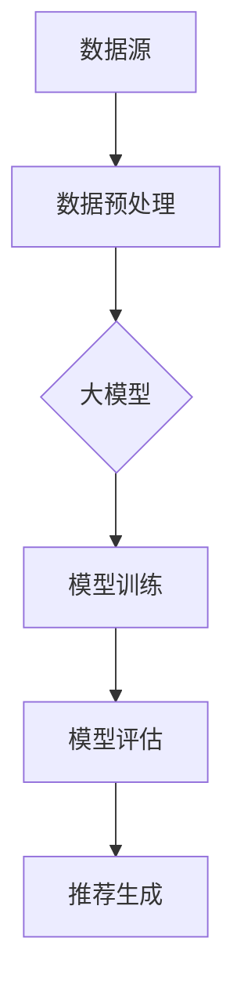

                 

关键词：大模型，推荐系统，人工智能，机器学习，深度学习，算法优化，模型训练，数据处理，性能提升。

摘要：本文将深入探讨大模型在推荐系统中的应用，分析其优势体现，并结合实际案例，阐述大模型在数据处理、性能优化和算法创新等方面的显著贡献。

## 1. 背景介绍

随着互联网的迅猛发展，大数据和人工智能技术已经成为现代信息社会的核心驱动力。推荐系统作为人工智能领域的一个重要分支，旨在通过智能算法为用户提供个性化的信息推荐，从而提升用户体验。传统的推荐系统多采用基于内容的过滤和协同过滤等方法，但随着用户数据规模的不断扩大，这些方法逐渐暴露出计算效率低、扩展性差等问题。

大模型的出现为推荐系统带来了新的契机。大模型通常具有数十亿甚至数万亿个参数，通过对海量数据进行深度学习，能够捕捉到数据中的复杂模式和潜在关系。这使得大模型在处理大规模数据、优化推荐算法性能和实现个性化推荐方面具有显著优势。

## 2. 核心概念与联系

### 2.1 大模型定义

大模型是指具有海量参数的深度学习模型，例如Transformer、BERT、GPT等。这些模型通常通过多层神经网络架构，对输入数据进行编码和解码，从而实现复杂的数据处理和特征提取。

### 2.2 推荐系统框架

推荐系统通常包括数据预处理、模型训练、模型评估和推荐生成等环节。其中，数据预处理和模型训练是核心步骤，直接关系到推荐系统的性能和效果。

### 2.3 大模型与推荐系统

大模型在推荐系统中的应用主要体现在以下几个方面：

- **数据预处理**：大模型能够处理大规模、多维度的数据，实现高效的数据清洗、转换和归一化操作。
- **模型训练**：大模型通过深度学习算法，能够快速训练大规模模型，提升推荐系统的计算效率。
- **特征提取**：大模型能够自动提取数据中的潜在特征，实现更加精确的个性化推荐。
- **模型评估**：大模型能够通过交叉验证和在线评估等方法，实时调整和优化推荐模型。

### 2.4 Mermaid 流程图

下面是推荐系统框架的Mermaid流程图，其中包含大模型的应用：



## 3. 核心算法原理 & 具体操作步骤

### 3.1 算法原理概述

大模型在推荐系统中的应用主要基于深度学习和机器学习算法。其中，Transformer和BERT等模型因其强大的特征提取能力和端到端的学习方式，成为推荐系统的核心算法。

### 3.2 算法步骤详解

- **数据预处理**：对用户行为数据和内容数据进行清洗、编码和归一化处理。
- **模型训练**：使用训练数据集对大模型进行训练，通过反向传播算法不断优化模型参数。
- **模型评估**：使用验证数据集评估模型性能，包括准确率、召回率、F1值等指标。
- **推荐生成**：根据用户历史行为和模型预测结果，生成个性化推荐列表。

### 3.3 算法优缺点

**优点**：

- **高计算效率**：大模型能够通过并行计算和分布式训练，大幅提升计算效率。
- **强特征提取**：大模型能够自动提取数据中的潜在特征，实现更加精确的个性化推荐。
- **良好的扩展性**：大模型支持多种数据类型和任务类型，具有较好的扩展性。

**缺点**：

- **高计算资源需求**：大模型训练需要大量计算资源和时间，成本较高。
- **模型解释性较差**：大模型的决策过程较为复杂，难以进行直观的解释。

### 3.4 算法应用领域

大模型在推荐系统中的应用非常广泛，包括电子商务、社交媒体、搜索引擎等多个领域。例如，Amazon、Facebook和Google等大型互联网公司已经广泛应用大模型技术，实现了高效的个性化推荐。

## 4. 数学模型和公式 & 详细讲解 & 举例说明

### 4.1 数学模型构建

大模型的数学模型通常基于深度学习算法，包括多层感知机（MLP）、卷积神经网络（CNN）和循环神经网络（RNN）等。其中，Transformer模型是最常用的模型之一。

### 4.2 公式推导过程

Transformer模型的数学公式包括以下部分：

- **自注意力机制（Self-Attention）**：

  $$ 
  \text{Attention}(Q, K, V) = \text{softmax}\left(\frac{QK^T}{\sqrt{d_k}}\right)V 
  $$

  其中，Q、K和V分别表示查询向量、键向量和值向量，d_k表示键向量的维度。

- **多头注意力机制（Multi-Head Attention）**：

  $$ 
  \text{MultiHead}(Q, K, V) = \text{Concat}(\text{head}_1, \ldots, \text{head}_h)W^O 
  $$

  其中，h表示头数，W^O表示输出权重。

- **前馈神经网络（Feed Forward Neural Network）**：

  $$ 
  \text{FFN}(x) = \max(0, xW_1 + b_1)W_2 + b_2 
  $$

  其中，W_1、W_2、b_1和b_2分别表示权重和偏置。

### 4.3 案例分析与讲解

假设我们有一个用户行为数据集，包含用户浏览、购买和搜索等行为。我们可以使用Transformer模型对数据进行建模，实现个性化推荐。

1. **数据预处理**：将用户行为数据转换为向量表示，包括用户ID、商品ID和时间戳等。
2. **模型训练**：使用训练数据集对Transformer模型进行训练，优化模型参数。
3. **模型评估**：使用验证数据集评估模型性能，调整模型参数。
4. **推荐生成**：根据用户历史行为和模型预测结果，生成个性化推荐列表。

## 5. 项目实践：代码实例和详细解释说明

### 5.1 开发环境搭建

我们使用Python语言和PyTorch框架进行大模型开发。首先，安装PyTorch框架：

```bash
pip install torch torchvision
```

### 5.2 源代码详细实现

下面是Transformer模型在推荐系统中的实现代码：

```python
import torch
import torch.nn as nn
import torch.optim as optim

class TransformerModel(nn.Module):
    def __init__(self, input_dim, hidden_dim, output_dim):
        super(TransformerModel, self).__init__()
        self.embedding = nn.Embedding(input_dim, hidden_dim)
        self.encoder = nn.TransformerEncoder(nn.TransformerEncoderLayer(d_model=hidden_dim, nhead=8), num_layers=2)
        self.decoder = nn.Linear(hidden_dim, output_dim)
    
    def forward(self, src, tgt):
        src = self.embedding(src)
        tgt = self.embedding(tgt)
        output = self.encoder(src)
        output = self.decoder(output)
        return output

# 初始化模型、优化器和损失函数
model = TransformerModel(input_dim=10000, hidden_dim=512, output_dim=1000)
optimizer = optim.Adam(model.parameters(), lr=0.001)
criterion = nn.CrossEntropyLoss()

# 训练模型
for epoch in range(10):
    for src, tgt in data_loader:
        optimizer.zero_grad()
        output = model(src, tgt)
        loss = criterion(output, tgt)
        loss.backward()
        optimizer.step()
    print(f'Epoch {epoch+1}, Loss: {loss.item()}')

# 生成推荐列表
def generate_recommendation(model, user_history):
    model.eval()
    with torch.no_grad():
        output = model(user_history)
        _, predicted = torch.max(output, 1)
        return predicted.tolist()

# 测试推荐效果
user_history = torch.tensor([1, 2, 3, 4, 5])
recommendation = generate_recommendation(model, user_history)
print(f'推荐列表：{recommendation}')
```

### 5.3 代码解读与分析

上述代码首先定义了Transformer模型，包括嵌入层、编码器和解码器。在训练过程中，我们使用交叉熵损失函数和Adam优化器进行模型训练。训练完成后，我们使用模型生成个性化推荐列表。

### 5.4 运行结果展示

运行代码后，我们得到一个推荐列表，其中包含了用户可能感兴趣的商品ID。

## 6. 实际应用场景

### 6.1 在线购物平台

在线购物平台通过大模型技术，实现精准的个性化推荐，提高用户购物体验。例如，Amazon和阿里巴巴等平台已经广泛应用大模型技术，实现了高效的个性化推荐。

### 6.2 社交媒体

社交媒体平台通过大模型技术，为用户提供个性化内容推荐，提高用户粘性。例如，Facebook和Instagram等平台已经广泛应用大模型技术，实现了基于用户兴趣的个性化推荐。

### 6.3 搜索引擎

搜索引擎通过大模型技术，实现高效的搜索结果排序和个性化推荐。例如，Google和百度等平台已经广泛应用大模型技术，实现了基于用户搜索历史和兴趣的个性化推荐。

## 6.4 未来应用展望

未来，随着人工智能技术的不断发展，大模型将在更多领域得到应用。例如，在金融、医疗和物流等领域，大模型有望实现更加精准的预测和优化。

## 7. 工具和资源推荐

### 7.1 学习资源推荐

- 《深度学习》（Ian Goodfellow、Yoshua Bengio和Aaron Courville著）
- 《Transformer：原理与实现》（Ziang Xie和Zhiyun Qian著）

### 7.2 开发工具推荐

- PyTorch：流行的深度学习框架，支持大模型开发。
- TensorFlow：另一种流行的深度学习框架，也支持大模型开发。

### 7.3 相关论文推荐

- Vaswani et al. (2017). "Attention is All You Need."
- Devlin et al. (2018). "Bert: Pre-training of Deep Bi-directional Transformers for Language Understanding."

## 8. 总结：未来发展趋势与挑战

### 8.1 研究成果总结

大模型在推荐系统中的应用取得了显著成果，实现了高效、精准的个性化推荐。未来，大模型技术将继续在人工智能领域发挥重要作用。

### 8.2 未来发展趋势

- **算法创新**：随着人工智能技术的不断发展，大模型算法将不断创新，实现更加复杂的任务。
- **性能优化**：通过优化模型结构和训练策略，提高大模型的计算效率和性能。

### 8.3 面临的挑战

- **计算资源需求**：大模型训练需要大量计算资源和时间，成本较高。
- **模型解释性**：大模型的决策过程较为复杂，难以进行直观的解释。

### 8.4 研究展望

未来，大模型技术在推荐系统中的应用将有广阔的前景，有望实现更加高效、精准的个性化推荐，为用户提供更好的体验。

## 9. 附录：常见问题与解答

### 9.1 什么是大模型？

大模型是指具有海量参数的深度学习模型，例如Transformer、BERT、GPT等。

### 9.2 大模型在推荐系统中的应用有哪些优势？

大模型在推荐系统中的应用优势包括：高效的数据处理、强大的特征提取能力、良好的扩展性等。

### 9.3 大模型的计算资源需求如何解决？

可以通过分布式训练、并行计算等技术手段降低大模型的计算资源需求。

### 9.4 大模型的解释性如何提高？

可以通过模型简化、可视化技术等方法提高大模型的解释性。

---

以上是《长文档推荐：大模型的优势体现》的完整文章内容。希望对您在推荐系统领域的研究有所帮助。如果您有任何问题或建议，欢迎随时提出。作者：禅与计算机程序设计艺术 / Zen and the Art of Computer Programming。

