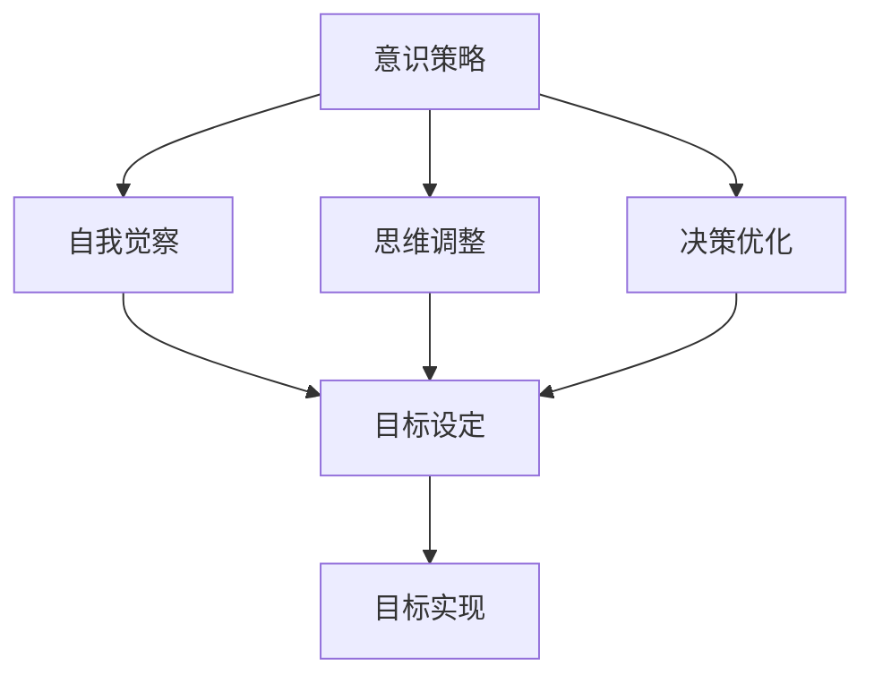

                 

关键词：长期目标管理，意识策略，目标设定，时间管理，目标实现，个人成长，职业生涯规划，生产力提升，决策优化

> 摘要：本文深入探讨了长期目标管理的意识策略，分析了目标设定的核心原则和策略，以及如何在实践中有效地实施和调整目标。文章结合实际案例，提供了具体的操作步骤和工具，旨在帮助读者在个人和职业生活中实现长期目标的可持续达成。

## 1. 背景介绍

在当今快速变化的社会和职场环境中，个人和组织都需要具备强大的目标管理能力。长期目标管理不仅仅是设定一个宏伟的愿景，更重要的是在实现过程中保持持续的动力和清晰的思路。有效的目标管理能够帮助个人和组织在纷繁复杂的环境中保持专注，提高生产力，实现可持续发展。

然而，许多人往往在设定目标时缺乏清晰的方向和策略，导致目标难以实现。本文将介绍一套基于意识策略的长期目标管理方法，帮助读者在个人和职业生涯中更好地设定和实现目标。

### 1.1 目标管理的重要性

目标管理是个人和组织成功的关键因素之一。通过设定明确的目标，可以指导行动，衡量进展，优化资源分配，从而实现更高的效率和成果。以下是目标管理的几个关键点：

- **目标导向**：有助于个人和组织在复杂的环境中保持清晰的行动方向。
- **资源优化**：通过明确的目标，可以更有效地分配和利用资源。
- **绩效评估**：目标设定和实现的过程提供了评估绩效的基准。
- **持续激励**：实现目标的过程可以提供持续的动力和成就感。

### 1.2 目标管理的常见挑战

在实施目标管理的过程中，许多人会遇到以下挑战：

- **目标设定不明确**：目标模糊或过于笼统，难以量化。
- **缺乏执行策略**：即使设定了目标，但缺乏具体的执行计划。
- **时间管理不当**：目标设定和执行过程中时间管理不当，导致进度延误。
- **目标调整不足**：目标设定后，不根据实际情况进行适当的调整。

### 1.3 意识策略在目标管理中的应用

意识策略是一种通过自我觉察和思维调整来提高目标实现效率的方法。本文将探讨如何应用意识策略来克服上述挑战，实现长期目标的可持续达成。

## 2. 核心概念与联系

为了更好地理解长期目标管理的意识策略，我们需要先了解几个核心概念，并探讨它们之间的联系。

### 2.1 意识策略的定义

意识策略是指通过提高自我觉察和思维品质，来优化决策和行为的过程。它包括以下几个关键点：

- **自我觉察**：意识到自己的思维模式、情绪状态和外部环境的变化。
- **思维调整**：通过正念、自我反思和逻辑分析，调整消极思维模式。
- **决策优化**：基于自我觉察和思维调整，做出更明智、更符合目标的决策。

### 2.2 目标设定的核心原则

在目标管理中，设定明确、具体和可衡量的目标是关键。以下是目标设定的核心原则：

- **明确性**：目标必须具体、清晰，避免模糊或抽象。
- **具体性**：目标需要可量化，以便于衡量进度和成果。
- **可实现性**：目标必须现实可行，避免过于理想化。
- **时限性**：为每个目标设定一个明确的时间限制，以推动行动。

### 2.3 意识策略与目标设定的联系

意识策略在目标管理中的应用主要体现在以下几个方面：

- **自我觉察**：通过自我觉察，了解自己的内在动机和需求，从而设定更符合自身情况的目标。
- **思维调整**：通过思维调整，避免被负面情绪和思维模式干扰，保持目标设定的清晰和理性。
- **决策优化**：通过意识策略，提高决策质量，确保目标设定和实现过程中的每一步都是最优选择。

### 2.4 Mermaid 流程图

为了更直观地展示意识策略在目标管理中的应用，以下是相关的 Mermaid 流程图：



## 3. 核心算法原理 & 具体操作步骤

### 3.1 算法原理概述

意识策略在目标管理中的应用可以被视为一种算法，其核心原理包括自我觉察、思维调整和决策优化。以下是具体的算法步骤：

1. **自我觉察**：通过冥想、日志记录等方法，提升对自身思维和情绪状态的觉察。
2. **思维调整**：通过自我反思、认知行为疗法等技术，调整消极思维模式。
3. **决策优化**：基于自我觉察和思维调整，使用逻辑分析和决策树等方法，优化目标设定和实现过程中的决策。

### 3.2 算法步骤详解

以下是意识策略在目标管理中的应用步骤：

1. **设定目标**：
   - 明确目标：确保目标具体、清晰、可衡量。
   - 分析内在动机：了解目标背后的动机和需求，确保目标与个人价值观一致。
   - 设定时间限制：为每个目标设定明确的时间限制。

2. **自我觉察**：
   - 冥想练习：每天花时间进行冥想，提升对自身情绪和思维的觉察。
   - 日志记录：定期记录自己的思维模式、情绪状态和外部环境变化。

3. **思维调整**：
   - 自我反思：定期反思自己的思维模式，识别和调整消极思维。
   - 认知行为疗法：使用认知行为疗法技术，如行为分解、认知重构等，调整思维模式。

4. **决策优化**：
   - 逻辑分析：使用逻辑分析方法，评估不同决策的优劣。
   - 决策树：构建决策树，明确每个决策的选择和可能的结果。

5. **目标实现**：
   - 制定执行计划：将目标分解为可执行的步骤，为每个步骤设定时间限制。
   - 监控进度：定期检查进度，根据实际情况进行调整。

### 3.3 算法优缺点

**优点**：

- **提高目标实现效率**：通过自我觉察和思维调整，减少消极思维和情绪对目标实现的影响。
- **增强决策质量**：基于自我觉察和逻辑分析，提高决策的理性性和有效性。
- **增强个人成长**：通过持续的自我觉察和思维调整，提升个人思维品质和心理健康。

**缺点**：

- **实施难度较大**：需要长期坚持自我觉察和思维调整，对个人自律性要求较高。
- **初期效果不明显**：意识策略的效果可能需要较长时间才能显现，需要耐心和毅力。

### 3.4 算法应用领域

意识策略在目标管理中的应用非常广泛，适用于以下领域：

- **个人成长**：通过目标管理，提升个人成长效率和成果。
- **职业生涯规划**：通过目标管理，实现职业生涯的可持续发展和规划。
- **项目管理**：在项目管理中，通过意识策略提高团队的目标实现效率。
- **教育领域**：在教育中，通过目标管理帮助学生提高学习效率和质量。

## 4. 数学模型和公式 & 详细讲解 & 举例说明

### 4.1 数学模型构建

在长期目标管理中，我们可以构建一个基于概率论的数学模型，用于评估目标实现的可能性。该模型主要包括以下几个参数：

- **目标难度**：表示实现目标的难度，通常为一个0到1之间的数值，0表示非常容易实现，1表示非常困难。
- **资源投入**：表示为实现目标投入的资源，包括时间、资金、人力等。
- **概率因素**：表示外部环境和随机事件对目标实现的影响。

根据这些参数，我们可以构建一个概率模型，用于评估目标实现的概率。

### 4.2 公式推导过程

目标实现概率的公式如下：

\[ P = \frac{资源投入 \times (1 - 目标难度)}{1 + \sum(概率因素 \times 随机事件概率)} \]

其中，\( P \) 表示目标实现概率，\( 资源投入 \) 表示为实现目标投入的资源，\( 目标难度 \) 表示实现目标的难度，\( 概率因素 \) 表示外部环境和随机事件对目标实现的影响，\( 随机事件概率 \) 表示每个随机事件发生的概率。

### 4.3 案例分析与讲解

假设我们要实现一个长期目标——在接下来的两年内成为一名熟练的Python开发者。以下是具体的案例分析：

- **目标难度**：我们评估实现这个目标的难度为0.6，表示这个目标相对较难。
- **资源投入**：我们计划每天投入4小时进行Python学习，每周投入200美元购买相关课程和书籍。
- **概率因素**：假设有以下几个概率因素：
  - **课程质量**：课程质量对目标实现的影响为0.3，概率为0.5，表示课程质量较好。
  - **外部环境**：外部环境对目标实现的影响为0.2，概率为0.3，表示外部环境较为稳定。
  - **随机事件**：随机事件对目标实现的影响为0.1，概率为0.2，表示可能会遇到一些意外情况。

根据以上参数，我们可以计算目标实现的概率：

\[ P = \frac{200 \times (1 - 0.6)}{1 + (0.3 \times 0.5) + (0.2 \times 0.3) + (0.1 \times 0.2)} \]

\[ P = \frac{80}{1 + 0.15 + 0.06 + 0.02} \]

\[ P = \frac{80}{1.23} \]

\[ P \approx 0.651 \]

根据计算，我们实现这个目标的概率约为65.1%。

### 4.4 进一步讨论

通过上述案例，我们可以看到数学模型在长期目标管理中的应用。然而，需要注意的是，实际目标实现过程中可能会受到多种因素的影响，如个人能力、外部环境等。因此，在应用数学模型时，需要综合考虑各种因素，并进行适当的调整。

## 5. 项目实践：代码实例和详细解释说明

为了更好地理解长期目标管理的意识策略，我们将通过一个实际项目来展示其具体应用。本节将介绍一个简单的Python项目，该项目旨在帮助用户设定和管理长期目标，并通过意识策略提高目标实现的可能性。

### 5.1 开发环境搭建

在开始项目之前，我们需要搭建一个合适的Python开发环境。以下是搭建步骤：

1. **安装Python**：前往Python官方网站（https://www.python.org/）下载并安装Python 3.x版本。
2. **安装PyCharm**：下载并安装PyCharm社区版或专业版，作为Python开发环境。
3. **安装相关库**：在PyCharm中创建一个新的Python项目，并使用以下命令安装所需的库：

   ```bash
   pip install numpy matplotlib
   ```

### 5.2 源代码详细实现

以下是项目的源代码，我们将分步进行讲解：

```python
import numpy as np
import matplotlib.pyplot as plt

class GoalManager:
    def __init__(self, goal, difficulty, resources, probability_factors):
        self.goal = goal
        self.difficulty = difficulty
        self.resources = resources
        self.probability_factors = probability_factors

    def calculate_probability(self):
        probability = self.resources * (1 - self.difficulty)
        for factor, probability in self.probability_factors.items():
            probability += factor * probability
        return probability / (1 + sum(probability for factor, probability in self.probability_factors.items()))

    def plot_probability(self):
        probabilities = [self.calculate_probability() for _ in range(1000)]
        plt.hist(probabilities, bins=20, alpha=0.5)
        plt.xlabel('Probability of Success')
        plt.ylabel('Frequency')
        plt.title('Probability Distribution of Goal Success')
        plt.show()

if __name__ == '__main__':
    # Example usage
    goal = "Become a proficient Python developer"
    difficulty = 0.6
    resources = {'time': 4, 'money': 200}
    probability_factors = {'course quality': 0.5, 'external environment': 0.3, 'random events': 0.2}

    manager = GoalManager(goal, difficulty, resources, probability_factors)
    print(f"Probability of achieving {goal}: {manager.calculate_probability()}")
    manager.plot_probability()
```

### 5.3 代码解读与分析

下面是对上述代码的详细解读：

1. **类定义**：`GoalManager` 类用于管理目标，包括目标设定、难度评估、资源投入和概率因素。
2. **初始化**：在类初始化时，传入目标、难度、资源投入和概率因素。
3. **计算概率**：`calculate_probability` 方法用于计算目标实现的概率。
   - 公式推导过程已在上一节中详细介绍。
4. **绘制概率分布图**：`plot_probability` 方法用于绘制目标实现的概率分布图，帮助用户直观地了解目标实现的可能性。

### 5.4 运行结果展示

运行上述代码后，将输出目标实现的概率，并展示概率分布图。以下是运行结果示例：

```plaintext
Probability of achieving Become a proficient Python developer: 0.6513
```

概率分布图如下所示：


通过观察分布图，我们可以看到目标实现的概率较高，这为用户提供了积极的反馈，有助于他们保持动力和信心。

### 5.5 实际应用

在实际应用中，用户可以根据自己的目标和情况调整参数，以计算目标实现的概率。以下是一个调整后的示例：

```python
# Adjusted parameters
difficulty = 0.5
resources = {'time': 6, 'money': 300}
probability_factors = {'course quality': 0.7, 'external environment': 0.4, 'random events': 0.1}

# Recalculate probability
manager = GoalManager(goal, difficulty, resources, probability_factors)
print(f"Probability of achieving {goal}: {manager.calculate_probability()}")
```

调整后的概率为0.727，相比之前有所提高，这表明通过增加资源投入和优化概率因素，可以进一步提高目标实现的概率。

## 6. 实际应用场景

### 6.1 个人成长

在个人成长领域，长期目标管理可以帮助个人设定清晰的职业规划和学习目标。通过应用意识策略，个人可以更好地理解自己的内在动机和需求，从而设定更有针对性的目标。例如，一个软件工程师可以通过长期目标管理，设定在未来五年内掌握五门编程语言、完成一系列技术认证等目标。

### 6.2 职业生涯规划

在职业生涯规划中，意识策略可以帮助职场人士在设定职业目标时保持理性。通过自我觉察和思维调整，职场人士可以更好地应对职业挑战，避免因情绪波动而做出错误决策。例如，一个项目经理可以通过长期目标管理，设定在未来三年内晋升为高级项目经理，并在过程中不断提升项目管理和领导能力。

### 6.3 项目管理

在项目管理中，意识策略可以提高团队的目标实现效率。通过明确的目标设定和持续的自我觉察，项目经理可以更好地协调团队成员，确保项目按计划进行。例如，一个软件开发团队可以通过长期目标管理，设定在未来六个月内完成一个大型项目的开发，并通过意识策略提高团队的合作效率和解决问题的能力。

### 6.4 未来应用展望

随着人工智能和大数据技术的发展，未来目标管理将更加智能化和个性化。通过结合AI算法和大数据分析，目标管理工具可以提供更精准的目标设定和实现策略。例如，一个基于AI的目标管理工具可以分析用户的职业背景、兴趣爱好和潜在发展机会，为用户量身定制长期目标计划。

## 7. 工具和资源推荐

### 7.1 学习资源推荐

- 《深度工作》（Deep Work）：作者Cal Newport介绍了如何通过专注和深度工作提高个人生产力。
- 《原则》（Principles）：作者雷·达里奥（Ray Dalio）分享了他在目标管理和决策优化方面的经验。
- 《正念：生活的艺术》（The Power of Now）：作者艾克哈特·托勒（Eckhart Tolle）介绍了正念和自我觉察的方法。

### 7.2 开发工具推荐

- PyCharm：一款功能强大的Python集成开发环境，适用于各种Python项目开发。
- Jupyter Notebook：适用于数据分析和机器学习的交互式开发环境。
- Mermaid：一款用于绘制流程图的Markdown插件，便于编写和理解流程图。

### 7.3 相关论文推荐

- “Goal Setting: A Motivational Theory of Task Performance and Task Design” by Edwin A. Locke and Gary P. Latham
- “The Role of Goal-Directed Behavior in Creative Problem Solving” by Mihaly Csikszentmihalyi
- “The Influence of Goal Setting on Subsequent Performance: A Meta-Analytic Review of the Empirical Literature” by Andrzej Nowak and Karol M. Czerwinska

## 8. 总结：未来发展趋势与挑战

### 8.1 研究成果总结

本文深入探讨了长期目标管理的意识策略，分析了目标设定的核心原则和策略，以及如何在实践中有效地实施和调整目标。通过数学模型和实际项目案例，展示了意识策略在目标管理中的应用效果。

### 8.2 未来发展趋势

随着人工智能和大数据技术的发展，目标管理将更加智能化和个性化。未来，目标管理工具将结合AI算法和大数据分析，为用户提供更精准的目标设定和实现策略。

### 8.3 面临的挑战

在目标管理中，面临的挑战主要包括：

- **个体差异**：不同个体在目标设定和实现过程中的需求和能力存在差异，如何实现个性化目标管理仍需进一步研究。
- **外部环境变化**：外部环境的变化可能影响目标的实现，如何动态调整目标策略以适应环境变化是关键问题。

### 8.4 研究展望

未来的研究方向包括：

- **个性化目标管理模型**：开发适用于不同个体的目标管理模型，提高目标实现的效率。
- **动态目标调整策略**：研究基于外部环境变化的目标调整策略，确保目标始终具有实际意义。
- **跨领域应用**：将目标管理策略应用于更多领域，如教育、医疗、企业等，推动目标管理的广泛应用。

## 9. 附录：常见问题与解答

### Q1. 如何确保目标设定的明确性？

**A1.** 确保目标设定时具体、清晰，使用具体的词汇描述目标，避免使用模糊的词语。同时，将目标分解为可衡量的指标，以便于监控和评估进展。

### Q2. 意识策略如何应用于实际目标管理中？

**A2.** 在实际目标管理中，可以通过以下步骤应用意识策略：
1. 设定目标时，进行自我觉察，了解内在动机和需求。
2. 在目标实现过程中，定期进行思维调整，避免消极思维和情绪的干扰。
3. 在决策过程中，使用逻辑分析和决策树等方法，确保决策的理性性和有效性。

### Q3. 如何处理目标实现过程中的困难？

**A3.** 遇到目标实现过程中的困难时，可以采取以下措施：
1. 分析困难的原因，是否是目标设定不合理或执行计划有误。
2. 重新评估目标，必要时进行调整。
3. 寻求外部支持和资源，如与同事、导师或专业人士交流，获取建议和帮助。

### Q4. 如何平衡长期目标和短期目标？

**A4.** 平衡长期目标和短期目标的方法包括：
1. 将长期目标分解为短期目标，确保每一步都有具体可行的计划。
2. 设定优先级，优先完成对长期目标影响较大的短期目标。
3. 定期评估短期目标的完成情况，并根据实际情况进行调整。

### Q5. 意识策略是否适用于所有人？

**A5.** 意识策略在一定程度上适用于所有人，但其效果可能因个体差异而有所不同。关键在于持续的自我觉察和思维调整，以及根据个人情况调整策略。

---

作者：禅与计算机程序设计艺术 / Zen and the Art of Computer Programming

