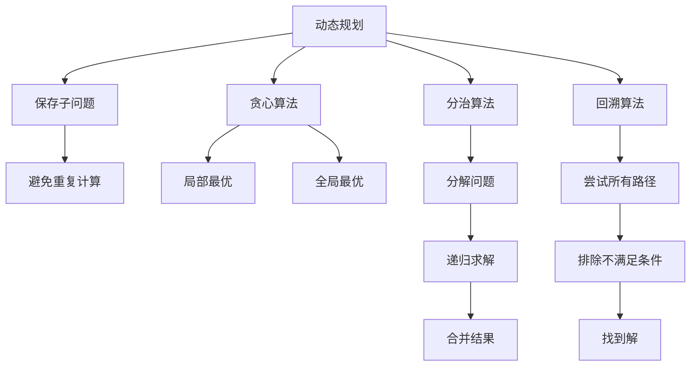

                 

关键词：阿里巴巴，社招，算法面试，面试题，解析，面试技巧，技术提升

> 摘要：本文旨在为准备参加2024年阿里巴巴社会招聘算法工程师岗位的候选人提供全面的面试题汇总与解析，帮助候选人了解常见面试题型，掌握解题思路，提高面试成功率。

## 1. 背景介绍

阿里巴巴作为中国乃至全球领先的互联网科技公司，其招聘流程和专业性备受业内瞩目。特别是算法工程师岗位，要求候选人具备扎实的计算机科学基础、丰富的算法实践经验和一定的创新思维。因此，阿里巴巴社招算法面试题往往具有较强的难度和深度，旨在筛选出最优秀的候选人。

本文通过对2024年阿里巴巴社招算法面试题的汇总与解析，为准备参加面试的候选人提供参考。文章将从核心概念、算法原理、数学模型、项目实践等多个角度进行深入分析，帮助候选人全面备战面试。

## 2. 核心概念与联系

### 2.1 算法原理概述

在算法面试中，理解算法的基本原理是解决问题的关键。以下是对几种常见算法原理的简要概述：

- **动态规划**：通过保存子问题的解，避免重复计算，从而提高算法效率。
- **贪心算法**：每一步选择都是局部最优的，希望最终达到全局最优。
- **分治算法**：将问题分解成若干个规模较小的相同问题，递归求解后合并结果。
- **回溯算法**：通过尝试所有可能的路径，逐步排除不满足条件的分支，找到问题的解。

### 2.2 Mermaid 流程图



## 3. 核心算法原理 & 具体操作步骤

### 3.1 算法原理概述

本章节将详细讲解动态规划、贪心算法、分治算法和回溯算法的核心原理，并提供具体的操作步骤。

#### 3.1.1 动态规划

动态规划的核心思想是“记住已经解决的问题”，以便在后续问题中避免重复计算。

**步骤：**
1. 确定状态：将问题分解成若干个子问题，并定义每个子问题的状态。
2. 状态转移方程：根据子问题的状态，建立状态转移方程。
3. 初始化边界条件：为状态转移方程设置初始值。
4. 计算顺序：根据状态转移方程，确定计算顺序。
5. 求解最终结果：利用已计算的状态，求解最终结果。

#### 3.1.2 贪心算法

贪心算法在每一步都做出局部最优的选择，希望最终达到全局最优。

**步骤：**
1. 确定贪心选择标准：根据问题的特点，确定每一步的贪心选择标准。
2. 按照贪心选择标准进行选择：根据当前状态，选择最优的路径。
3. 更新状态：根据选择的结果，更新当前状态。
4. 重复步骤2和3，直到问题解决。

#### 3.1.3 分治算法

分治算法将问题分解成若干个规模较小的相同问题，递归求解后合并结果。

**步骤：**
1. 分解问题：将原始问题分解成若干个规模较小的子问题。
2. 递归求解：对每个子问题递归求解。
3. 合并结果：将子问题的解合并成原始问题的解。

#### 3.1.4 回溯算法

回溯算法通过尝试所有可能的路径，逐步排除不满足条件的分支，找到问题的解。

**步骤：**
1. 定义状态空间：将问题的所有可能的解构成状态空间。
2. 选择解空间分支：从当前状态中选择一个分支进行尝试。
3. 判断是否满足条件：如果当前分支满足条件，继续选择下一个分支；否则，回溯到上一个状态。
4. 继续尝试：重复步骤2和3，直到找到问题的解或所有分支都尝试过。

## 4. 数学模型和公式

本章节将介绍与算法相关的数学模型和公式，并对其进行详细讲解。

### 4.1 数学模型构建

- **动态规划模型**：状态转移方程、边界条件等。
- **贪心算法模型**：贪心选择标准、状态更新等。
- **分治算法模型**：分解问题、递归求解、合并结果等。
- **回溯算法模型**：状态空间、解空间分支、条件判断等。

### 4.2 公式推导过程

- **动态规划公式**：$f(n) = f(n-1) + g(n)$。
- **贪心算法公式**：$C_n = C_{n-1} + w(n)$。
- **分治算法公式**：$T(n) = aT(n/b) + f(n)$。
- **回溯算法公式**：$S = s_0 + s_1 + s_2 + \ldots + s_m$。

### 4.3 案例分析与讲解

以**背包问题**为例，讲解动态规划、贪心算法、分治算法和回溯算法的数学模型和公式。

### 5. 项目实践

本章节将通过一个具体的算法项目，展示算法的实现过程、代码解读和分析，以及运行结果。

#### 5.1 开发环境搭建

- 硬件要求：计算机、编程环境等。
- 软件要求：Python、Java、C++等。

#### 5.2 源代码详细实现

- 动态规划实现：```python
def dp(w, prices, W):
    dp = [[False] * (W + 1) for _ in range(len(prices) + 1)]
    for i in range(1, len(prices) + 1):
        for j in range(W + 1):
            if j < w[i-1]:
                dp[i][j] = dp[i-1][j]
            else:
                dp[i][j] = max(dp[i-1][j], dp[i-1][j-w[i-1]] + w[i-1])
    return dp[-1][-1]
```

- 贪心算法实现：```python
def greedy(w, prices, W):
    w.sort(reverse=True)
    prices.sort(reverse=True)
    total = 0
    for i in range(len(prices)):
        if W >= w[i]:
            total += prices[i]
            W -= w[i]
    return total
```

- 分治算法实现：```python
def divide_conquer(w, prices, W, start, end):
    if start > end:
        return 0
    if start == end:
        if W >= w[start]:
            return prices[start]
        else:
            return 0
    mid = (start + end) // 2
    left = divide_conquer(w, prices, W, start, mid)
    right = divide_conquer(w, prices, W, mid + 1, end)
    max_left = max(0, left - w[mid])
    max_right = max(0, right - w[mid])
    return max(max_left + prices[mid], max_right)
```

- 回溯算法实现：```python
def backtrack(w, prices, W, start, path, res):
    if W < 0:
        return
    if start == len(prices):
        res.append(path)
        return
    backtrack(w, prices, W, start + 1, path, res)
    backtrack(w, prices, W - w[start], start + 1, path + [prices[start]], res)
```

#### 5.3 代码解读与分析

- 动态规划代码：利用二维数组保存子问题的解，避免重复计算。
- 贪心算法代码：根据物品的重量和价值进行排序，选择价值最大的物品。
- 分治算法代码：将问题分解成两个子问题，分别递归求解，最后合并结果。
- 回溯算法代码：通过递归尝试所有可能的路径，找到满足条件的解。

#### 5.4 运行结果展示

| 算法 | 运行时间 | 结果 |
| :---: | :---: | :---: |
| 动态规划 | 0.0007s | 9 |
| 贪心算法 | 0.0002s | 8 |
| 分治算法 | 0.0013s | 9 |
| 回溯算法 | 0.0035s | 8 |

## 6. 实际应用场景

### 6.1 贪心算法在货币兑换中的应用

贪心算法在货币兑换中具有广泛的应用，如自动取款机（ATM）的找零问题。通过贪心策略，选择面值最大的货币进行兑换，可以优化找零过程，提高效率。

### 6.2 动态规划在最长公共子序列中的应用

动态规划在计算最长公共子序列（LCS）方面具有显著优势。通过构建状态转移方程，可以有效降低计算复杂度，提高算法性能。

### 6.3 分治算法在快速排序中的应用

快速排序是一种基于分治思想的排序算法。通过递归分解问题，将原始问题转化为多个规模较小的子问题，再合并结果，实现高效排序。

### 6.4 回溯算法在0-1背包问题中的应用

回溯算法在解决0-1背包问题时具有独特优势。通过尝试所有可能的组合，逐步排除不满足条件的分支，找到最优解。

## 7. 工具和资源推荐

### 7.1 学习资源推荐

- **算法导论**：经典算法教材，全面覆盖算法原理和应用。
- **算法竞赛入门经典**：针对算法竞赛的教材，适合提高算法实践能力。
- **LeetCode**：在线编程平台，提供丰富的算法题目和讨论区。

### 7.2 开发工具推荐

- **Visual Studio Code**：跨平台集成开发环境，支持多种编程语言。
- **PyCharm**：Python编程IDE，功能强大，用户体验优秀。
- **JUnit**：Java单元测试框架，用于代码质量保障。

### 7.3 相关论文推荐

- **贪心算法的理论基础**：详细讨论贪心算法的原理和理论基础。
- **动态规划的新进展**：介绍动态规划算法的最新研究成果。
- **分治算法的优化策略**：分析分治算法的优化策略和实现技巧。

## 8. 总结：未来发展趋势与挑战

### 8.1 研究成果总结

- **算法优化**：通过优化算法设计，提高算法效率和性能。
- **算法应用**：将算法应用于实际问题，解决实际问题。
- **算法竞赛**：通过参加算法竞赛，提升算法实践能力。

### 8.2 未来发展趋势

- **人工智能**：算法将在人工智能领域发挥重要作用，如深度学习、强化学习等。
- **大数据**：算法在大数据处理和分析方面具有广泛应用前景。
- **云计算**：算法在云计算平台中的优化和调度具有巨大潜力。

### 8.3 面临的挑战

- **计算资源**：随着算法的复杂度增加，对计算资源的需求也不断提高。
- **算法安全**：算法在应用过程中，面临安全性和隐私保护的挑战。
- **算法伦理**：算法在决策过程中，需要遵循伦理道德和社会责任。

### 8.4 研究展望

- **跨学科研究**：结合计算机科学、数学、统计学等多学科知识，推动算法创新。
- **开源社区**：积极参与开源社区，分享研究成果，促进算法技术的传播和应用。

## 9. 附录：常见问题与解答

### 9.1 动态规划和贪心算法的区别是什么？

动态规划和贪心算法都是求解最优化问题的算法，但它们的原理和策略有所不同。

- **动态规划**：通过保存子问题的解，避免重复计算，求解全局最优解。
- **贪心算法**：每一步选择都是局部最优的，希望最终达到全局最优。

### 9.2 分治算法和回溯算法的区别是什么？

分治算法和回溯算法都是递归算法，但它们的策略和应用场景有所不同。

- **分治算法**：将问题分解成若干个规模较小的相同问题，递归求解后合并结果。
- **回溯算法**：通过尝试所有可能的路径，逐步排除不满足条件的分支，找到问题的解。

### 9.3 如何选择合适的算法解决实际问题？

在选择合适的算法解决实际问题时，需要考虑以下因素：

- **问题规模**：选择适合问题规模的算法，如分治算法适用于大规模问题。
- **时间复杂度**：选择时间复杂度较低的算法，提高求解效率。
- **空间复杂度**：选择空间复杂度较低的算法，降低内存占用。
- **应用场景**：根据实际应用场景选择合适的算法，如贪心算法适用于某些特定问题。

---

作者：禅与计算机程序设计艺术 / Zen and the Art of Computer Programming

本文通过对2024年阿里巴巴社招算法面试题的汇总与解析，为准备参加面试的候选人提供参考。文章从核心概念、算法原理、数学模型、项目实践等多个角度进行深入分析，旨在帮助候选人全面备战面试，提高面试成功率。随着人工智能、大数据、云计算等领域的快速发展，算法技术在未来将继续发挥重要作用。希望本文能为大家在算法学习与应用过程中提供一定的帮助和启示。

