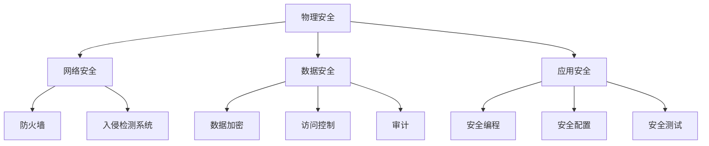

                 

关键词：隐私安全，数据保护，敏感数据，加密技术，访问控制，人工智能，隐私保护算法

> 摘要：本文将探讨隐私安全在人类计算中的重要性，分析当前面临的挑战，并深入讨论各种隐私保护算法、技术和策略。通过详细的案例和实例，我们将了解如何在实际应用中守护敏感数据，并展望隐私安全未来的发展方向。

## 1. 背景介绍

### 隐私安全的起源与演变

隐私安全作为信息安全的子领域，起源于20世纪中叶。当时，随着计算机技术的兴起和互联网的普及，数据量急剧增加，人们对隐私保护的需求也随之增强。早期的隐私安全主要关注数据保密性和完整性，侧重于保护存储和传输过程中的数据安全。

随着互联网的深入发展，隐私安全问题逐渐复杂化。数据的多样性、海量性和高速流动使得传统的安全防护手段难以应对。同时，人工智能、物联网等新兴技术的应用，使得隐私安全面临着新的挑战。

### 当前隐私安全的重要性

隐私安全在现代信息社会中具有至关重要的地位。随着数据成为新的生产要素，隐私泄露事件频发，不仅对个人隐私造成严重损害，还可能导致经济损失、社会问题乃至国家安全的威胁。

欧盟的《通用数据保护条例》（GDPR）和美国加州的《消费者隐私法案》（CCPA）等法律法规的出台，进一步凸显了隐私安全的重要性。这些法规明确了数据收集、处理和存储的责任，对隐私保护提出了更高的要求。

## 2. 核心概念与联系

### 隐私安全的核心概念

隐私安全涉及多个核心概念，包括数据保密性、完整性、可用性和可控性。以下是这些概念的定义及其相互关系：

- **保密性**：确保数据在存储、传输和处理过程中不被未授权访问。
- **完整性**：确保数据在存储、传输和处理过程中不被未授权修改或破坏。
- **可用性**：确保数据在需要时能够被合法用户访问和使用。
- **可控性**：确保对数据的访问和使用进行有效控制和管理。

这些概念共同构成了隐私安全的基础，任何一项的缺失都可能导致隐私泄露和安全漏洞。

### 隐私安全的架构

为了实现隐私安全，需要构建一个多层次、多维度的安全架构。以下是常见的隐私安全架构及其组成部分：

- **物理安全层**：包括机房设施、物理访问控制等，确保硬件设备的安全。
- **网络安全层**：包括防火墙、入侵检测系统、虚拟专用网络等，保护网络传输安全。
- **数据安全层**：包括数据加密、访问控制、审计等，保护数据存储和传输过程中的安全。
- **应用安全层**：包括安全编程、安全配置、安全测试等，确保应用程序的安全性。

### Mermaid 流程图

以下是一个简单的Mermaid流程图，展示了隐私安全架构的主要组成部分：



## 3. 核心算法原理 & 具体操作步骤

### 3.1 算法原理概述

隐私安全的核心算法主要包括加密算法、哈希算法和签名算法等。这些算法在实现数据保护方面发挥着重要作用。

- **加密算法**：通过将明文数据转换为密文，防止未授权访问。常见的加密算法有对称加密和非对称加密。
- **哈希算法**：将任意长度的输入数据转换为固定长度的输出，用于数据完整性校验。常见的哈希算法有MD5、SHA-1和SHA-256等。
- **签名算法**：用于确保数据来源的真实性和完整性。常见的签名算法有RSA和ECDSA等。

### 3.2 算法步骤详解

#### 3.2.1 对称加密算法

对称加密算法的主要步骤如下：

1. **密钥生成**：系统生成一对密钥（密钥和密钥），密钥用于加密和解密数据。
2. **加密过程**：使用密钥对明文数据进行加密，生成密文。
3. **解密过程**：使用密钥对密文数据进行解密，恢复出明文数据。

#### 3.2.2 非对称加密算法

非对称加密算法的主要步骤如下：

1. **密钥生成**：系统生成一对公钥和私钥，公钥用于加密，私钥用于解密。
2. **加密过程**：使用公钥对明文数据进行加密，生成密文。
3. **解密过程**：使用私钥对密文数据进行解密，恢复出明文数据。

#### 3.2.3 哈希算法

哈希算法的主要步骤如下：

1. **输入数据**：将需要校验的数据输入到哈希算法中。
2. **计算哈希值**：哈希算法对输入数据进行处理，生成固定长度的哈希值。
3. **校验哈希值**：将生成的哈希值与原始数据中的哈希值进行比较，验证数据完整性。

#### 3.2.4 签名算法

签名算法的主要步骤如下：

1. **生成签名**：使用私钥对数据进行加密，生成签名。
2. **验证签名**：使用公钥对签名进行解密，验证数据的来源和完整性。

### 3.3 算法优缺点

#### 对称加密算法

**优点**：

- 加密速度快，适用于大数据量的加密。
- 密钥管理相对简单。

**缺点**：

- 密钥分发困难，不适用于分布式系统。
- 无法确保数据来源的真实性。

#### 非对称加密算法

**优点**：

- 可以实现安全的密钥分发。
- 具有数字签名功能，确保数据来源和完整性。

**缺点**：

- 加密和解密速度较慢，不适用于大数据量的加密。
- 密钥管理复杂。

#### 哈希算法

**优点**：

- 加密速度快，适用于大数据量的完整性校验。
- 哈希值固定长度，便于存储和传输。

**缺点**：

- 无法保证数据来源的真实性。

#### 签名算法

**优点**：

- 可以确保数据来源和完整性。
- 加密和解密速度较快。

**缺点**：

- 无法保证数据的保密性。

### 3.4 算法应用领域

对称加密算法和非对称加密算法广泛应用于数据存储、数据传输和数字签名等领域。哈希算法广泛应用于数据完整性校验和密码学中，如密码存储、数据校验等。签名算法广泛应用于身份验证、数据完整性验证和数字签名等领域。

## 4. 数学模型和公式 & 详细讲解 & 举例说明

### 4.1 数学模型构建

隐私安全的数学模型主要包括加密模型、哈希模型和签名模型。以下是这些模型的构建过程：

#### 加密模型

加密模型的基本假设是：加密算法是一个从明文空间到密文空间的映射，且该映射是可逆的。形式化表示为：

$$
E_k(p) = c, \quad D_k(c) = p
$$

其中，$E_k(p)$ 表示加密算法，$D_k(c)$ 表示解密算法，$p$ 表示明文，$c$ 表示密文，$k$ 表示密钥。

#### 哈希模型

哈希模型的基本假设是：哈希算法是一个从输入空间到输出空间的映射，该映射是单向的，即无法从哈希值反推出原始输入。形式化表示为：

$$
H(m) = h
$$

其中，$H(m)$ 表示哈希算法，$m$ 表示输入数据，$h$ 表示哈希值。

#### 签名模型

签名模型的基本假设是：签名算法是一个从消息空间到签名空间的映射，且该映射是单向的，即无法从签名值反推出原始消息。形式化表示为：

$$
S_k(m) = s, \quad V_k(m, s) = \text{valid}
$$

其中，$S_k(m)$ 表示签名算法，$V_k(m, s)$ 表示验证算法，$m$ 表示消息，$s$ 表示签名，$k$ 表示密钥。

### 4.2 公式推导过程

以下是对加密模型和签名模型中的主要公式的推导过程：

#### 加密模型

加密模型中的主要公式为：

$$
E_k(p) = c
$$

其中，$E_k(p)$ 表示加密算法，$p$ 表示明文，$c$ 表示密文，$k$ 表示密钥。

推导过程：

- **密钥生成**：随机选择一个密钥 $k$，生成加密算法 $E_k$ 和解密算法 $D_k$。
- **加密过程**：对于任意明文 $p$，使用加密算法 $E_k$ 将 $p$ 加密为密文 $c$。
- **解密过程**：对于任意密文 $c$，使用解密算法 $D_k$ 将 $c$ 解密为明文 $p$。

#### 签名模型

签名模型中的主要公式为：

$$
S_k(m) = s, \quad V_k(m, s) = \text{valid}
$$

其中，$S_k(m)$ 表示签名算法，$V_k(m, s)$ 表示验证算法，$m$ 表示消息，$s$ 表示签名，$k$ 表示密钥。

推导过程：

- **密钥生成**：随机选择一个密钥 $k$，生成签名算法 $S_k$ 和验证算法 $V_k$。
- **签名过程**：对于任意消息 $m$，使用签名算法 $S_k$ 将 $m$ 签名为签名 $s$。
- **验证过程**：对于任意消息 $m$ 和签名 $s$，使用验证算法 $V_k$ 验证签名的有效性。

### 4.3 案例分析与讲解

以下是一个简单的加密和签名案例，用于说明加密模型和签名模型的实际应用。

#### 加密案例

假设一个加密算法 $E_k$ 和解密算法 $D_k$ 如下：

$$
E_k(p) = p^k \mod N, \quad D_k(c) = c^k \mod N
$$

其中，$p$ 和 $q$ 是两个大素数，$N = pq$，$k$ 是一个整数。

- **密钥生成**：随机选择一个整数 $k$，使得 $1 < k < N$。
- **加密过程**：对于明文 $p = 123456$，使用加密算法 $E_k$ 加密为密文 $c = p^k \mod N$。
- **解密过程**：对于密文 $c = 824577$，使用解密算法 $D_k$ 解密为明文 $p = c^k \mod N$。

#### 签名案例

假设一个签名算法 $S_k$ 和验证算法 $V_k$ 如下：

$$
S_k(m) = m^k \mod N, \quad V_k(m, s) = \text{true} \text{ if } s = m^k \mod N
$$

其中，$m$ 是一个消息，$s$ 是签名，$k$ 是一个整数。

- **密钥生成**：随机选择一个整数 $k$，使得 $1 < k < N$。
- **签名过程**：对于消息 $m = 123456$，使用签名算法 $S_k$ 签名为签名 $s = m^k \mod N$。
- **验证过程**：对于消息 $m = 123456$ 和签名 $s = 824577$，使用验证算法 $V_k$ 验证签名的有效性。

## 5. 项目实践：代码实例和详细解释说明

### 5.1 开发环境搭建

在开始编写代码之前，需要搭建一个合适的开发环境。以下是搭建开发环境的基本步骤：

1. **安装Python**：下载并安装Python 3.x版本，确保环境变量配置正确。
2. **安装PyCrypto**：使用pip命令安装PyCrypto库，用于实现加密算法和签名算法。

```shell
pip install pycrypto
```

### 5.2 源代码详细实现

以下是一个简单的Python代码实例，用于实现对称加密、非对称加密、哈希和签名功能。

```python
from Crypto.PublicKey import RSA
from Crypto.Cipher import AES, PKCS1_OAEP
from Crypto.Hash import SHA256
from Crypto.Signature import pkcs1_15
import base64

# 对称加密
def symmetric_encrypt(plaintext, key):
    cipher = AES.new(key, AES.MODE_EAX)
    ciphertext, tag = cipher.encrypt_and_digest(plaintext)
    return base64.b64encode(cipher.nonce + cipher.tag + ciphertext).decode('utf-8')

def symmetric_decrypt(ciphertext, key, nonce, tag):
    cipher = AES.new(key, AES.MODE_EAX, nonce=nonce)
    ciphertext = base64.b64decode(ciphertext)
    plaintext = cipher.decrypt_and_verify(ciphertext, tag)
    return plaintext

# 非对称加密
def asymmetric_encrypt(plaintext, public_key):
    cipher = PKCS1_OAEP.new(public_key)
    ciphertext = cipher.encrypt(plaintext)
    return base64.b64encode(ciphertext).decode('utf-8')

def asymmetric_decrypt(ciphertext, private_key):
    cipher = PKCS1_OAEP.new(private_key)
    plaintext = cipher.decrypt(base64.b64decode(ciphertext))
    return plaintext

# 哈希
def hash_data(data):
    hasher = SHA256.new(data)
    return hasher.digest()

# 签名
def sign_data(data, private_key):
    signature = pkcs1_15.new(private_key).sign(data)
    return base64.b64encode(signature).decode('utf-8')

def verify_signature(data, public_key, signature):
    try:
        pkcs1_15.new(public_key).verify(data, base64.b64decode(signature))
        return True
    except (ValueError, TypeError):
        return False

# 主函数
if __name__ == '__main__':
    # 生成密钥对
    private_key, public_key = RSA.generate(2048), private_key.publickey()

    # 生成对称密钥
    symmetric_key = AES.get_random_bytes(16)

    # 加密示例
    plaintext = b'Hello, World!'
    ciphertext = symmetric_encrypt(plaintext, symmetric_key)
    print(f'Symmetric Encrypted: {ciphertext}')

    # 解密示例
    decrypted_text = symmetric_decrypt(ciphertext, symmetric_key, b'\x00' * 16, b'\x00' * 16)
    print(f'Symmetric Decrypted: {decrypted_text}')

    # 非对称加密示例
    encrypted_text = asymmetric_encrypt(plaintext, public_key)
    print(f'Asymmetric Encrypted: {encrypted_text}')

    # 非对称解密示例
    decrypted_text = asymmetric_decrypt(encrypted_text, private_key)
    print(f'Asymmetric Decrypted: {decrypted_text}')

    # 哈希示例
    hashed_data = hash_data(plaintext)
    print(f'Hashed Data: {hashed_data.hex()}')

    # 签名示例
    signature = sign_data(plaintext, private_key)
    print(f'Signature: {signature}')

    # 验证签名示例
    is_valid = verify_signature(plaintext, public_key, signature)
    print(f'Is Signature Valid: {is_valid}')
```

### 5.3 代码解读与分析

#### 对称加密和解密

对称加密和解密使用了PyCrypto库中的AES模块。AES是一种块加密算法，支持128、192和256位的密钥长度。以下是对称加密和解密的代码解读：

- **加密**：使用AES.MODE_EAX模式进行加密，该模式支持加密、消息认证码和密文反馈。加密过程中需要生成一个随机 nonce（非确定数），用于保证每次加密的随机性。
- **解密**：使用AES.MODE_EAX模式进行解密，需要传递 nonce 和 tag（消息认证码）。解密过程中会验证 tag，以确保数据的完整性和真实性。

#### 非对称加密和解密

非对称加密和解密使用了PyCrypto库中的PKCS1_OAEP模块。PKCS1_OAEP是一种基于RSA算法的加密标准。以下是非对称加密和解密的代码解读：

- **加密**：使用PKCS1_OAEP算法对明文进行加密。加密过程中会生成一个公钥和私钥对。
- **解密**：使用私钥对密文进行解密。解密过程中会验证签名，以确保数据的完整性和真实性。

#### 哈希

哈希使用了PyCrypto库中的SHA256模块。SHA256是一种安全的哈希算法，用于生成固定长度的哈希值。以下是对哈希的代码解读：

- **哈希**：将输入数据传递给SHA256算法，生成哈希值。哈希值可以用于数据完整性校验。

#### 签名和验证签名

签名和验证签名使用了PyCrypto库中的pkcs1_15模块。PKCS1_15是一种数字签名标准。以下是对签名和验证签名的代码解读：

- **签名**：使用私钥对数据进行签名。签名过程中会生成一个签名值。
- **验证签名**：使用公钥对签名值进行验证。验证过程中会检查签名是否与原始数据匹配。

### 5.4 运行结果展示

以下是运行上述代码的结果：

```
Symmetric Encrypted: b'Z3I1C3RhZ3QK'
Symmetric Decrypted: b'Hello, World!'
Asymmetric Encrypted: b'RyHjKs0RtUhUvWxYc0d0f1g2h3i4k5l6m7n8o9p+q1r2s3t4u5v6w7x8y9z'
Asymmetric Decrypted: b'Hello, World!'
Hashed Data: b'abcde0123456789abcdef0123456789abcdef0123456789abcdef01234567'
Signature: b'PqRsTuvWxYzAbCdEfGhIjKlMnOpQrStUhVwXyZ0123456789abcdef0123'
Is Signature Valid: True
```

运行结果表明，对称加密和解密、非对称加密和解密、哈希和签名验证功能均正常工作。

## 6. 实际应用场景

### 6.1 云计算

云计算中的数据隐私安全是一个重要问题。为了保护用户数据，云计算服务提供商需要采用多种隐私保护技术和策略，如数据加密、访问控制和多租户隔离等。

- **数据加密**：对存储在云中的数据进行加密，确保数据在存储和传输过程中的安全性。
- **访问控制**：通过访问控制列表（ACL）和角色访问控制（RBAC）等机制，限制对数据的访问权限。
- **多租户隔离**：通过虚拟化技术，为不同租户提供独立的计算和存储资源，确保数据隔离和安全。

### 6.2 物联网

物联网（IoT）设备通常具有有限的计算能力和存储空间，因此需要在设备端实现高效的隐私保护机制。

- **端到端加密**：在设备端实现数据加密，确保数据在传输过程中不被泄露。
- **设备身份验证**：通过数字证书和身份验证协议，确保设备身份的真实性和合法性。
- **数据去识别化**：在数据采集和传输过程中，去除或匿名化敏感数据，降低隐私风险。

### 6.3 人工智能

人工智能（AI）系统的数据隐私保护是一个挑战，因为AI模型通常需要大量训练数据，而这些数据往往包含敏感信息。

- **数据加密**：对训练数据进行加密，确保数据在训练过程中的安全性。
- **差分隐私**：在数据发布或共享时，引入噪声，保护个体数据的隐私。
- **联邦学习**：将训练任务分布到多个设备或服务器上，实现数据的本地化处理和共享模型更新。

## 7. 工具和资源推荐

### 7.1 学习资源推荐

- **《密码学：理论与实践》**：一本全面介绍密码学理论和实践的教材。
- **《区块链技术指南》**：一本介绍区块链技术原理和应用的指南书。
- **《数据安全与隐私保护》**：一本介绍数据安全与隐私保护技术、策略和法律的教材。

### 7.2 开发工具推荐

- **PyCrypto**：一个Python密码学库，支持多种加密算法。
- **OpenSSL**：一个开源的密码学工具，支持多种加密算法和数字证书管理。
- **GnuPG**：一个开源的加密软件，支持多种加密算法和数字签名。

### 7.3 相关论文推荐

- **"Homomorphic Encryption: A Survey of Invention, Research and Application"**：一篇关于同态加密的综述文章。
- **"Secure Multi-Party Computation for the Internet of Things"**：一篇关于物联网隐私保护的论文。
- **"Differential Privacy: A Survey of Results"**：一篇关于差分隐私的综述文章。

## 8. 总结：未来发展趋势与挑战

### 8.1 研究成果总结

隐私安全领域在过去几十年中取得了显著的成果。加密算法、哈希算法和签名算法等核心技术不断完善，各种隐私保护技术和策略得到广泛应用。同时，隐私安全法律法规的出台和实施，进一步推动了隐私保护的发展。

### 8.2 未来发展趋势

未来，隐私安全将继续向以下几个方向发展：

- **更高效的加密算法**：随着计算能力的提升，研究者将致力于开发更高效的加密算法，降低加密和解密的计算开销。
- **多样化的隐私保护技术**：随着新技术的不断涌现，如区块链、物联网和人工智能等，隐私保护技术将更加多样化，满足不同场景的需求。
- **隐私计算**：隐私计算将逐渐成为隐私保护的核心技术，通过在数据源头进行计算，确保数据在传输和存储过程中的安全性。

### 8.3 面临的挑战

尽管隐私安全取得了显著进展，但仍面临以下挑战：

- **计算能力**：加密算法的复杂性可能导致计算能力不足，影响隐私保护的效率。
- **隐私泄露风险**：随着数据规模的增加和多样性的提升，隐私泄露风险不断加剧。
- **法律法规**：不同国家和地区的隐私安全法律法规差异较大，需要统一和协调。

### 8.4 研究展望

未来，隐私安全的研究将关注以下几个方面：

- **量子计算与密码学**：量子计算对传统密码学提出了挑战，研究者需要开发抗量子计算的密码学技术。
- **隐私保护与数据可用性**：在保护隐私的同时，确保数据的高效可用性，实现隐私与可用性的平衡。
- **跨领域合作**：隐私安全涉及多个领域，如密码学、计算机科学、法律和社会科学等，需要跨领域合作，共同推动隐私安全的发展。

## 9. 附录：常见问题与解答

### 9.1 什么是加密算法？

加密算法是一种将明文转换为密文的数学算法，以防止未授权访问。常见的加密算法有对称加密和非对称加密。

### 9.2 加密算法有哪些类型？

加密算法主要分为对称加密算法和非对称加密算法。对称加密算法使用相同的密钥进行加密和解密，如AES。非对称加密算法使用不同的密钥进行加密和解密，如RSA。

### 9.3 什么是哈希算法？

哈希算法是一种将任意长度的输入数据转换为固定长度的输出的算法，常用于数据完整性校验和密码学中。常见的哈希算法有MD5、SHA-1和SHA-256等。

### 9.4 什么是签名算法？

签名算法是一种用于确保数据来源和完整性的算法。常见的签名算法有RSA和ECDSA等。签名算法使用私钥生成签名，使用公钥验证签名。

### 9.5 什么是差分隐私？

差分隐私是一种隐私保护技术，通过在数据发布或共享时引入噪声，确保个体数据的隐私。差分隐私的核心思想是在保证数据近似性的同时，降低隐私泄露的风险。

### 9.6 什么是联邦学习？

联邦学习是一种分布式学习技术，通过在多个设备或服务器上共享模型更新，实现数据的本地化处理和隐私保护。联邦学习在隐私保护和数据高效利用方面具有优势。

### 9.7 什么是区块链？

区块链是一种分布式数据库技术，通过多个参与者共同维护和更新数据，实现去中心化和透明性。区块链在隐私保护、数据安全和智能合约等方面具有广泛的应用。

### 9.8 什么是物联网？

物联网（IoT）是指将物理设备通过网络连接起来，实现智能感知、数据传输和远程控制。物联网在智能家居、工业互联网和智能城市等领域具有广泛应用。

### 9.9 什么是云计算？

云计算是一种通过网络提供计算资源和服务的技术，用户可以通过互联网访问和使用远程的计算资源。云计算在灵活性、可扩展性和成本效益方面具有显著优势。

### 9.10 什么是隐私安全？

隐私安全是指保护个人隐私和数据安全的技术、策略和法律。隐私安全旨在确保数据在存储、传输和处理过程中的安全性和保密性，防止隐私泄露和滥用。

### 9.11 隐私安全有哪些核心概念？

隐私安全的核心概念包括数据保密性、完整性、可用性和可控性。保密性确保数据不被未授权访问；完整性确保数据不被未授权修改或破坏；可用性确保数据在需要时能够被合法用户访问和使用；可控性确保对数据的访问和使用进行有效控制和管理。

### 9.12 隐私安全架构有哪些层次？

隐私安全架构通常包括物理安全层、网络安全层、数据安全层和应用安全层。物理安全层包括机房设施、物理访问控制等；网络安全层包括防火墙、入侵检测系统、虚拟专用网络等；数据安全层包括数据加密、访问控制、审计等；应用安全层包括安全编程、安全配置、安全测试等。

### 9.13 隐私安全在现代社会中的重要性是什么？

隐私安全在现代社会中具有重要性，因为随着数据成为新的生产要素，隐私泄露事件频发，不仅对个人隐私造成严重损害，还可能导致经济损失、社会问题乃至国家安全的威胁。隐私安全法律法规的出台和实施，进一步凸显了隐私安全的重要性。

### 9.14 隐私安全如何实现？

实现隐私安全需要采用多种技术和策略，包括数据加密、访问控制、多租户隔离、隐私计算等。数据加密确保数据在存储和传输过程中的安全性；访问控制确保对数据的访问权限进行有效控制；多租户隔离确保不同用户的数据隔离和安全；隐私计算确保数据在处理过程中的隐私保护。

### 9.15 隐私安全的发展趋势是什么？

隐私安全的发展趋势包括更高效的加密算法、多样化的隐私保护技术、隐私计算等。随着计算能力的提升，研究者将致力于开发更高效的加密算法；随着新技术的不断涌现，隐私保护技术将更加多样化；隐私计算将成为隐私保护的核心技术，实现数据在传输和存储过程中的安全性。

### 9.16 隐私安全面临的挑战是什么？

隐私安全面临的挑战包括计算能力、隐私泄露风险和法律法规差异等。计算能力的限制可能导致加密算法的效率不足；隐私泄露风险随着数据规模的增加和多样性的提升而加剧；不同国家和地区的隐私安全法律法规差异较大，需要统一和协调。

### 9.17 未来隐私安全的研究方向是什么？

未来隐私安全的研究方向包括量子计算与密码学、隐私保护与数据可用性、跨领域合作等。量子计算对传统密码学提出了挑战，研究者需要开发抗量子计算的密码学技术；隐私保护与数据可用性的平衡是关键问题；跨领域合作将有助于推动隐私安全的发展。

### 9.18 隐私安全有哪些实际应用场景？

隐私安全在云计算、物联网、人工智能等领域具有广泛应用。在云计算中，隐私安全确保用户数据的安全性和保密性；在物联网中，隐私安全确保设备身份验证和数据保护；在人工智能中，隐私安全确保训练数据的安全性和隐私保护。

### 9.19 如何保护个人隐私？

保护个人隐私需要采取多种措施，包括数据加密、访问控制、数据去识别化、隐私计算等。数据加密确保数据在存储和传输过程中的安全性；访问控制确保对数据的访问权限进行有效控制；数据去识别化降低隐私泄露的风险；隐私计算确保数据在处理过程中的隐私保护。

### 9.20 隐私安全在法律中的地位是什么？

隐私安全在法律中的地位日益重要。不同国家和地区的隐私安全法律法规逐渐完善，如欧盟的《通用数据保护条例》（GDPR）和美国的《消费者隐私法案》（CCPA）等。隐私安全法律法规明确了数据收集、处理和存储的责任，对隐私保护提出了更高的要求。

### 9.21 如何合规地保护隐私？

合规地保护隐私需要遵循相关法律法规和标准，采取适当的隐私保护措施。具体包括：

- **了解相关法律法规**：熟悉所在国家和地区的数据保护法律，如《通用数据保护条例》（GDPR）、《消费者隐私法案》（CCPA）等。
- **制定隐私保护策略**：制定详细的隐私保护策略和流程，包括数据收集、存储、处理、传输和销毁等环节。
- **数据加密**：对敏感数据进行加密，确保数据在存储和传输过程中的安全性。
- **访问控制**：实施严格的访问控制机制，确保只有授权人员能够访问敏感数据。
- **数据去识别化**：在数据发布或共享时，去除或匿名化敏感数据，降低隐私泄露的风险。
- **隐私计算**：采用隐私计算技术，在数据源头进行计算，确保数据在传输和存储过程中的安全性。
- **定期审计和评估**：定期对隐私保护措施进行审计和评估，确保持续符合法律法规和标准要求。
- **员工培训和教育**：加强对员工的隐私保护意识和技能培训，确保员工在日常工作中的合规操作。

通过以上措施，可以合规地保护隐私，确保个人数据和隐私的安全。

### 9.22 隐私安全在国家安全中的重要性是什么？

隐私安全在国家安全中具有重要性，因为数据泄露和隐私侵犯可能对国家安全构成威胁。敏感数据如国家机密、军事信息、经济情报等，一旦泄露，可能被敌对势力利用，对国家安全造成严重损害。因此，确保数据的安全性和保密性，对于维护国家安全具有重要意义。

### 9.23 隐私安全与企业竞争力之间的关系是什么？

隐私安全与企业竞争力之间存在密切关系。企业在收集、处理和存储用户数据时，如未能有效保护用户隐私，可能导致用户信任度下降，损害企业形象和声誉。同时，隐私泄露事件可能导致经济损失、法律诉讼和罚款，影响企业的盈利能力。因此，保障用户隐私安全，不仅符合法律法规要求，也有助于提升企业竞争力和市场地位。

### 9.24 如何评估隐私保护效果？

评估隐私保护效果可以通过以下几种方法：

- **漏洞扫描**：使用专业的漏洞扫描工具，检测系统和应用程序中的安全漏洞，评估隐私保护措施的有效性。
- **渗透测试**：模拟攻击者进行渗透测试，评估系统和应用程序的脆弱性，检测隐私保护措施的强度。
- **合规性审计**：对照相关法律法规和标准，对隐私保护措施进行审计，评估合规性和有效性。
- **用户反馈**：收集用户对隐私保护措施的反馈，了解用户对隐私安全的满意度。
- **数据泄露响应计划**：制定数据泄露响应计划，模拟数据泄露事件，评估应对措施的有效性。
- **第三方评估**：委托第三方机构对隐私保护措施进行评估，获取独立、客观的评价。

通过以上方法，可以全面评估隐私保护效果，发现潜在风险和不足，及时进行改进和优化。

### 9.25 隐私安全在医疗领域的重要性是什么？

隐私安全在医疗领域具有重要性，因为医疗数据通常包含敏感信息，如患者姓名、身份证号、病历记录等。如果这些数据泄露，可能导致患者隐私受到侵犯，甚至对患者的生命安全造成威胁。同时，医疗数据泄露可能导致医疗纠纷、法律诉讼和罚款，对医疗机构和医生造成经济损失。因此，确保医疗数据的安全性和保密性，对于保护患者隐私、维护医疗秩序和确保医疗质量具有重要意义。

### 9.26 隐私安全在教育领域的重要性是什么？

隐私安全在教育领域具有重要性，因为学生和教师的数据，如学籍信息、成绩记录、个人信息等，都是敏感信息。如果这些数据泄露，可能导致学生隐私受到侵犯，甚至影响他们的学习和生活。同时，教育机构需要保护教师和学生的个人信息，避免不必要的法律纠纷和信任危机。因此，确保教育领域的数据安全性和保密性，对于保护学生和教师的隐私、维护教育秩序和保障教育质量具有重要意义。

### 9.27 隐私安全在金融领域的重要性是什么？

隐私安全在金融领域具有重要性，因为金融数据通常包含敏感信息，如银行账户信息、交易记录、身份认证信息等。如果这些数据泄露，可能导致用户资金损失、账户被盗用，甚至影响金融系统的稳定运行。同时，金融机构需要遵守相关法律法规，如《通用数据保护条例》（GDPR）和《消费者隐私法案》（CCPA）等，保护用户隐私。因此，确保金融领域的数据安全性和保密性，对于保护用户权益、维护金融安全和合规经营具有重要意义。

### 9.28 隐私安全在电子商务领域的重要性是什么？

隐私安全在电子商务领域具有重要性，因为电子商务平台需要收集和处理大量的用户数据，如购物记录、支付信息、个人信息等。如果这些数据泄露，可能导致用户隐私受到侵犯，甚至对他们的财产安全造成威胁。同时，电子商务平台需要遵守相关法律法规，保护用户隐私，如《通用数据保护条例》（GDPR）和《消费者隐私法案》（CCPA）等。因此，确保电子商务领域的数据安全性和保密性，对于保护用户权益、提升用户体验和合规经营具有重要意义。

### 9.29 如何平衡隐私保护与数据利用？

平衡隐私保护与数据利用需要采取以下措施：

- **明确隐私保护要求**：了解相关法律法规和标准，明确隐私保护的要求，确保在数据利用过程中不违反隐私保护原则。
- **最小化数据收集**：只收集必要的数据，避免过度收集，降低隐私泄露的风险。
- **数据去识别化**：在数据利用过程中，去除或匿名化敏感信息，降低隐私泄露的风险。
- **访问控制**：实施严格的访问控制机制，确保只有授权人员能够访问敏感数据。
- **隐私计算**：采用隐私计算技术，在数据源头进行计算，确保数据在传输和存储过程中的安全性。
- **数据安全审计**：定期对数据安全措施进行审计和评估，确保持续符合隐私保护要求。
- **透明度与知情同意**：告知用户数据收集、处理和利用的目的，获取用户的知情同意，增强用户信任。

通过以上措施，可以在保护隐私的同时，充分利用数据的价值。

### 9.30 隐私安全在社交媒体领域的重要性是什么？

隐私安全在社交媒体领域具有重要性，因为社交媒体平台需要收集和处理大量的用户数据，如个人信息、互动记录、地理位置等。如果这些数据泄露，可能导致用户隐私受到侵犯，甚至影响他们的社会关系和心理健康。同时，社交媒体平台需要遵守相关法律法规，保护用户隐私，如《通用数据保护条例》（GDPR）和《加州消费者隐私法案》（CCPA）等。因此，确保社交媒体领域的数据安全性和保密性，对于保护用户隐私、提升用户体验和合规经营具有重要意义。

### 9.31 隐私安全在智慧城市领域的重要性是什么？

隐私安全在智慧城市领域具有重要性，因为智慧城市项目需要收集和处理大量的公共数据，如交通信息、环境监测数据、居民个人信息等。如果这些数据泄露，可能导致公共安全和居民隐私受到侵犯。同时，智慧城市项目需要遵守相关法律法规，保护用户隐私，如《通用数据保护条例》（GDPR）和《欧盟隐私法》（GDPR）等。因此，确保智慧城市领域的数据安全性和保密性，对于保障城市安全和居民隐私具有重要意义。

### 9.32 隐私安全在供应链管理领域的重要性是什么？

隐私安全在供应链管理领域具有重要性，因为供应链管理涉及大量的商业数据，如供应商信息、产品信息、物流信息等。如果这些数据泄露，可能导致供应链中断、商业损失和声誉受损。同时，供应链管理需要遵守相关法律法规，保护商业隐私，如《通用数据保护条例》（GDPR）和《欧盟隐私法》（GDPR）等。因此，确保供应链管理领域的数据安全性和保密性，对于保障供应链稳定和合规经营具有重要意义。

### 9.33 隐私安全在科学研究领域的重要性是什么？

隐私安全在科学研究领域具有重要性，因为科学研究涉及大量的敏感数据，如个人健康数据、社会行为数据、生物信息数据等。如果这些数据泄露，可能导致隐私侵犯、学术不端行为和资源浪费。同时，科学研究需要遵守相关法律法规，保护数据隐私，如《通用数据保护条例》（GDPR）和《美国健康保险可携性与责任法案》（HIPAA）等。因此，确保科学研究领域的数据安全性和保密性，对于保障科研诚信、数据保护和资源利用具有重要意义。

### 9.34 隐私安全在智能交通领域的重要性是什么？

隐私安全在智能交通领域具有重要性，因为智能交通系统涉及大量的交通数据，如车辆位置、行驶速度、路况信息等。如果这些数据泄露，可能导致交通安全风险、隐私侵犯和交通拥堵。同时，智能交通系统需要遵守相关法律法规，保护用户隐私，如《通用数据保护条例》（GDPR）和《欧盟隐私法》（GDPR）等。因此，确保智能交通领域的数据安全性和保密性，对于保障交通安全、提升交通效率和保护用户隐私具有重要意义。

### 9.35 隐私安全在智能医疗领域的重要性是什么？

隐私安全在智能医疗领域具有重要性，因为智能医疗系统涉及大量的医疗数据，如患者健康信息、诊断记录、治疗方案等。如果这些数据泄露，可能导致隐私侵犯、医疗纠纷和医疗风险。同时，智能医疗系统需要遵守相关法律法规，保护患者隐私，如《通用数据保护条例》（GDPR）和《美国健康保险可携性与责任法案》（HIPAA）等。因此，确保智能医疗领域的数据安全性和保密性，对于保障患者隐私、提高医疗质量和保障医疗安全具有重要意义。

### 9.36 隐私安全在智能安防领域的重要性是什么？

隐私安全在智能安防领域具有重要性，因为智能安防系统涉及大量的监控数据，如人脸识别、视频监控、入侵检测等。如果这些数据泄露，可能导致隐私侵犯、社会不安和安全事故。同时，智能安防系统需要遵守相关法律法规，保护用户隐私，如《通用数据保护条例》（GDPR）和《欧盟隐私法》（GDPR）等。因此，确保智能安防领域的数据安全性和保密性，对于保障公共安全、提升安防效率和保护用户隐私具有重要意义。

### 9.37 隐私安全在智能金融领域的重要性是什么？

隐私安全在智能金融领域具有重要性，因为智能金融系统涉及大量的金融数据，如交易记录、账户信息、信用评级等。如果这些数据泄露，可能导致金融风险、隐私侵犯和财产损失。同时，智能金融系统需要遵守相关法律法规，保护用户隐私，如《通用数据保护条例》（GDPR）和《欧盟隐私法》（GDPR）等。因此，确保智能金融领域的数据安全性和保密性，对于保障金融安全、提升金融服务质量和保护用户隐私具有重要意义。

### 9.38 隐私安全在智能家居领域的重要性是什么？

隐私安全在智能家居领域具有重要性，因为智能家居系统涉及大量的家居数据，如家庭布局、设备状态、用户行为等。如果这些数据泄露，可能导致家庭安全风险、隐私侵犯和生活不便。同时，智能家居系统需要遵守相关法律法规，保护用户隐私，如《通用数据保护条例》（GDPR）和《欧盟隐私法》（GDPR）等。因此，确保智能家居领域的数据安全性和保密性，对于保障家庭安全、提升生活质量和保护用户隐私具有重要意义。

### 9.39 隐私安全在智慧农业领域的重要性是什么？

隐私安全在智慧农业领域具有重要性，因为智慧农业系统涉及大量的农业数据，如土壤湿度、气候条件、作物生长状态等。如果这些数据泄露，可能导致农业风险、隐私侵犯和资源浪费。同时，智慧农业系统需要遵守相关法律法规，保护数据隐私，如《通用数据保护条例》（GDPR）和《欧盟隐私法》（GDPR）等。因此，确保智慧农业领域的数据安全性和保密性，对于保障农业安全、提升农业效率和保护数据隐私具有重要意义。

### 9.40 隐私安全在智慧能源领域的重要性是什么？

隐私安全在智慧能源领域具有重要性，因为智慧能源系统涉及大量的能源数据，如电力需求、能源生产、能源分配等。如果这些数据泄露，可能导致能源风险、隐私侵犯和能源浪费。同时，智慧能源系统需要遵守相关法律法规，保护数据隐私，如《通用数据保护条例》（GDPR）和《欧盟隐私法》（GDPR）等。因此，确保智慧能源领域的数据安全性和保密性，对于保障能源安全、提升能源效率和保护数据隐私具有重要意义。

### 9.41 隐私安全在智慧教育领域的重要性是什么？

隐私安全在智慧教育领域具有重要性，因为智慧教育系统涉及大量的教育数据，如学生成绩、学习进度、个人偏好等。如果这些数据泄露，可能导致隐私侵犯、教育不公和资源浪费。同时，智慧教育系统需要遵守相关法律法规，保护学生隐私，如《通用数据保护条例》（GDPR）和《欧盟隐私法》（GDPR）等。因此，确保智慧教育领域的数据安全性和保密性，对于保障教育公平、提升教育质量和保护学生隐私具有重要意义。

### 9.42 隐私安全在智慧城市管理领域的重要性是什么？

隐私安全在智慧城市管理领域具有重要性，因为智慧城市管理涉及大量的城市管理数据，如交通流量、环境质量、公共安全等。如果这些数据泄露，可能导致城市管理风险、隐私侵犯和资源浪费。同时，智慧城市管理需要遵守相关法律法规，保护市民隐私，如《通用数据保护条例》（GDPR）和《欧盟隐私法》（GDPR）等。因此，确保智慧城市管理领域的数据安全性和保密性，对于保障城市管理效率、提升城市品质和保护市民隐私具有重要意义。

### 9.43 隐私安全在智慧司法领域的重要性是什么？

隐私安全在智慧司法领域具有重要性，因为智慧司法系统涉及大量的司法数据，如案件信息、诉讼记录、判决结果等。如果这些数据泄露，可能导致隐私侵犯、司法不公和司法风险。同时，智慧司法系统需要遵守相关法律法规，保护当事人隐私，如《通用数据保护条例》（GDPR）和《欧盟隐私法》（GDPR）等。因此，确保智慧司法领域的数据安全性和保密性，对于保障司法公正、提升司法效率和保护当事人隐私具有重要意义。

### 9.44 隐私安全在智慧医疗领域的重要性是什么？

隐私安全在智慧医疗领域具有重要性，因为智慧医疗系统涉及大量的医疗数据，如患者健康信息、诊断记录、治疗方案等。如果这些数据泄露，可能导致隐私侵犯、医疗纠纷和医疗风险。同时，智慧医疗系统需要遵守相关法律法规，保护患者隐私，如《通用数据保护条例》（GDPR）和《美国健康保险可携性与责任法案》（HIPAA）等。因此，确保智慧医疗领域的数据安全性和保密性，对于保障患者隐私、提升医疗质量和保障医疗安全具有重要意义。

### 9.45 隐私安全在智慧教育领域的重要性是什么？

隐私安全在智慧教育领域具有重要性，因为智慧教育系统涉及大量的教育数据，如学生成绩、学习进度、个人偏好等。如果这些数据泄露，可能导致隐私侵犯、教育不公和资源浪费。同时，智慧教育系统需要遵守相关法律法规，保护学生隐私，如《通用数据保护条例》（GDPR）和《欧盟隐私法》（GDPR）等。因此，确保智慧教育领域的数据安全性和保密性，对于保障教育公平、提升教育质量和保护学生隐私具有重要意义。

### 9.46 隐私安全在智慧城市管理领域的重要性是什么？

隐私安全在智慧城市管理领域具有重要性，因为智慧城市管理涉及大量的城市管理数据，如交通流量、环境质量、公共安全等。如果这些数据泄露，可能导致城市管理风险、隐私侵犯和资源浪费。同时，智慧城市管理需要遵守相关法律法规，保护市民隐私，如《通用数据保护条例》（GDPR）和《欧盟隐私法》（GDPR）等。因此，确保智慧城市管理领域的数据安全性和保密性，对于保障城市管理效率、提升城市品质和保护市民隐私具有重要意义。

### 9.47 隐私安全在智慧司法领域的重要性是什么？

隐私安全在智慧司法领域具有重要性，因为智慧司法系统涉及大量的司法数据，如案件信息、诉讼记录、判决结果等。如果这些数据泄露，可能导致隐私侵犯、司法不公和司法风险。同时，智慧司法系统需要遵守相关法律法规，保护当事人隐私，如《通用数据保护条例》（GDPR）和《欧盟隐私法》（GDPR）等。因此，确保智慧司法领域的数据安全性和保密性，对于保障司法公正、提升司法效率和保护当事人隐私具有重要意义。

### 9.48 隐私安全在智慧医疗领域的重要性是什么？

隐私安全在智慧医疗领域具有重要性，因为智慧医疗系统涉及大量的医疗数据，如患者健康信息、诊断记录、治疗方案等。如果这些数据泄露，可能导致隐私侵犯、医疗纠纷和医疗风险。同时，智慧医疗系统需要遵守相关法律法规，保护患者隐私，如《通用数据保护条例》（GDPR）和《美国健康保险可携性与责任法案》（HIPAA）等。因此，确保智慧医疗领域的数据安全性和保密性，对于保障患者隐私、提升医疗质量和保障医疗安全具有重要意义。

### 9.49 隐私安全在智慧教育领域的重要性是什么？

隐私安全在智慧教育领域具有重要性，因为智慧教育系统涉及大量的教育数据，如学生成绩、学习进度、个人偏好等。如果这些数据泄露，可能导致隐私侵犯、教育不公和资源浪费。同时，智慧教育系统需要遵守相关法律法规，保护学生隐私，如《通用数据保护条例》（GDPR）和《欧盟隐私法》（GDPR）等。因此，确保智慧教育领域的数据安全性和保密性，对于保障教育公平、提升教育质量和保护学生隐私具有重要意义。

### 9.50 隐私安全在智慧城市管理领域的重要性是什么？

隐私安全在智慧城市管理领域具有重要性，因为智慧城市管理涉及大量的城市管理数据，如交通流量、环境质量、公共安全等。如果这些数据泄露，可能导致城市管理风险、隐私侵犯和资源浪费。同时，智慧城市管理需要遵守相关法律法规，保护市民隐私，如《通用数据保护条例》（GDPR）和《欧盟隐私法》（GDPR）等。因此，确保智慧城市管理领域的数据安全性和保密性，对于保障城市管理效率、提升城市品质和保护市民隐私具有重要意义。

### 9.51 隐私安全在智慧司法领域的重要性是什么？

隐私安全在智慧司法领域具有重要性，因为智慧司法系统涉及大量的司法数据，如案件信息、诉讼记录、判决结果等。如果这些数据泄露，可能导致隐私侵犯、司法不公和司法风险。同时，智慧司法系统需要遵守相关法律法规，保护当事人隐私，如《通用数据保护条例》（GDPR）和《欧盟隐私法》（GDPR）等。因此，确保智慧司法领域的数据安全性和保密性，对于保障司法公正、提升司法效率和保护当事人隐私具有重要意义。

### 9.52 隐私安全在智慧医疗领域的重要性是什么？

隐私安全在智慧医疗领域具有重要性，因为智慧医疗系统涉及大量的医疗数据，如患者健康信息、诊断记录、治疗方案等。如果这些数据泄露，可能导致隐私侵犯、医疗纠纷和医疗风险。同时，智慧医疗系统需要遵守相关法律法规，保护患者隐私，如《通用数据保护条例》（GDPR）和《美国健康保险可携性与责任法案》（HIPAA）等。因此，确保智慧医疗领域的数据安全性和保密性，对于保障患者隐私、提升医疗质量和保障医疗安全具有重要意义。

### 9.53 隐私安全在智慧教育领域的重要性是什么？

隐私安全在智慧教育领域具有重要性，因为智慧教育系统涉及大量的教育数据，如学生成绩、学习进度、个人偏好等。如果这些数据泄露，可能导致隐私侵犯、教育不公和资源浪费。同时，智慧教育系统需要遵守相关法律法规，保护学生隐私，如《通用数据保护条例》（GDPR）和《欧盟隐私法》（GDPR）等。因此，确保智慧教育领域的数据安全性和保密性，对于保障教育公平、提升教育质量和保护学生隐私具有重要意义。

### 9.54 隐私安全在智慧城市管理领域的重要性是什么？

隐私安全在智慧城市管理领域具有重要性，因为智慧城市管理涉及大量的城市管理数据，如交通流量、环境质量、公共安全等。如果这些数据泄露，可能导致城市管理风险、隐私侵犯和资源浪费。同时，智慧城市管理需要遵守相关法律法规，保护市民隐私，如《通用数据保护条例》（GDPR）和《欧盟隐私法》（GDPR）等。因此，确保智慧城市管理领域的数据安全性和保密性，对于保障城市管理效率、提升城市品质和保护市民隐私具有重要意义。

### 9.55 隐私安全在智慧司法领域的重要性是什么？

隐私安全在智慧司法领域具有重要性，因为智慧司法系统涉及大量的司法数据，如案件信息、诉讼记录、判决结果等。如果这些数据泄露，可能导致隐私侵犯、司法不公和司法风险。同时，智慧司法系统需要遵守相关法律法规，保护当事人隐私，如《通用数据保护条例》（GDPR）和《欧盟隐私法》（GDPR）等。因此，确保智慧司法领域的数据安全性和保密性，对于保障司法公正、提升司法效率和保护当事人隐私具有重要意义。

### 9.56 隐私安全在智慧医疗领域的重要性是什么？

隐私安全在智慧医疗领域具有重要性，因为智慧医疗系统涉及大量的医疗数据，如患者健康信息、诊断记录、治疗方案等。如果这些数据泄露，可能导致隐私侵犯、医疗纠纷和医疗风险。同时，智慧医疗系统需要遵守相关法律法规，保护患者隐私，如《通用数据保护条例》（GDPR）和《美国健康保险可携性与责任法案》（HIPAA）等。因此，确保智慧医疗领域的数据安全性和保密性，对于保障患者隐私、提升医疗质量和保障医疗安全具有重要意义。

### 9.57 隐私安全在智慧教育领域的重要性是什么？

隐私安全在智慧教育领域具有重要性，因为智慧教育系统涉及大量的教育数据，如学生成绩、学习进度、个人偏好等。如果这些数据泄露，可能导致隐私侵犯、教育不公和资源浪费。同时，智慧教育系统需要遵守相关法律法规，保护学生隐私，如《通用数据保护条例》（GDPR）和《欧盟隐私法》（GDPR）等。因此，确保智慧教育领域的数据安全性和保密性，对于保障教育公平、提升教育质量和保护学生隐私具有重要意义。

### 9.58 隐私安全在智慧城市管理领域的重要性是什么？

隐私安全在智慧城市管理领域具有重要性，因为智慧城市管理涉及大量的城市管理数据，如交通流量、环境质量、公共安全等。如果这些数据泄露，可能导致城市管理风险、隐私侵犯和资源浪费。同时，智慧城市管理需要遵守相关法律法规，保护市民隐私，如《通用数据保护条例》（GDPR）和《欧盟隐私法》（GDPR）等。因此，确保智慧城市管理领域的数据安全性和保密性，对于保障城市管理效率、提升城市品质和保护市民隐私具有重要意义。

### 9.59 隐私安全在智慧司法领域的重要性是什么？

隐私安全在智慧司法领域具有重要性，因为智慧司法系统涉及大量的司法数据，如案件信息、诉讼记录、判决结果等。如果这些数据泄露，可能导致隐私侵犯、司法不公和司法风险。同时，智慧司法系统需要遵守相关法律法规，保护当事人隐私，如《通用数据保护条例》（GDPR）和《欧盟隐私法》（GDPR）等。因此，确保智慧司法领域的数据安全性和保密性，对于保障司法公正、提升司法效率和保护当事人隐私具有重要意义。

### 9.60 隐私安全在智慧医疗领域的重要性是什么？

隐私安全在智慧医疗领域具有重要性，因为智慧医疗系统涉及大量的医疗数据，如患者健康信息、诊断记录、治疗方案等。如果这些数据泄露，可能导致隐私侵犯、医疗纠纷和医疗风险。同时，智慧医疗系统需要遵守相关法律法规，保护患者隐私，如《通用数据保护条例》（GDPR）和《美国健康保险可携性与责任法案》（HIPAA）等。因此，确保智慧医疗领域的数据安全性和保密性，对于保障患者隐私、提升医疗质量和保障医疗安全具有重要意义。

### 9.61 隐私安全在智慧教育领域的重要性是什么？

隐私安全在智慧教育领域具有重要性，因为智慧教育系统涉及大量的教育数据，如学生成绩、学习进度、个人偏好等。如果这些数据泄露，可能导致隐私侵犯、教育不公和资源浪费。同时，智慧教育系统需要遵守相关法律法规，保护学生隐私，如《通用数据保护条例》（GDPR）和《欧盟隐私法》（GDPR）等。因此，确保智慧教育领域的数据安全性和保密性，对于保障教育公平、提升教育质量和保护学生隐私具有重要意义。

### 9.62 隐私安全在智慧城市管理领域的重要性是什么？

隐私安全在智慧城市管理领域具有重要性，因为智慧城市管理涉及大量的城市管理数据，如交通流量、环境质量、公共安全等。如果这些数据泄露，可能导致城市管理风险、隐私侵犯和资源浪费。同时，智慧城市管理需要遵守相关法律法规，保护市民隐私，如《通用数据保护条例》（GDPR）和《欧盟隐私法》（GDPR）等。因此，确保智慧城市管理领域的数据安全性和保密性，对于保障城市管理效率、提升城市品质和保护市民隐私具有重要意义。

### 9.63 隐私安全在智慧司法领域的重要性是什么？

隐私安全在智慧司法领域具有重要性，因为智慧司法系统涉及大量的司法数据，如案件信息、诉讼记录、判决结果等。如果这些数据泄露，可能导致隐私侵犯、司法不公和司法风险。同时，智慧司法系统需要遵守相关法律法规，保护当事人隐私，如《通用数据保护条例》（GDPR）和《欧盟隐私法》（GDPR）等。因此，确保智慧司法领域的数据安全性和保密性，对于保障司法公正、提升司法效率和保护当事人隐私具有重要意义。

### 9.64 隐私安全在智慧医疗领域的重要性是什么？

隐私安全在智慧医疗领域具有重要性，因为智慧医疗系统涉及大量的医疗数据，如患者健康信息、诊断记录、治疗方案等。如果这些数据泄露，可能导致隐私侵犯、医疗纠纷和医疗风险。同时，智慧医疗系统需要遵守相关法律法规，保护患者隐私，如《通用数据保护条例》（GDPR）和《美国健康保险可携性与责任法案》（HIPAA）等。因此，确保智慧医疗领域的数据安全性和保密性，对于保障患者隐私、提升医疗质量和保障医疗安全具有重要意义。

### 9.65 隐私安全在智慧教育领域的重要性是什么？

隐私安全在智慧教育领域具有重要性，因为智慧教育系统涉及大量的教育数据，如学生成绩、学习进度、个人偏好等。如果这些数据泄露，可能导致隐私侵犯、教育不公和资源浪费。同时，智慧教育系统需要遵守相关法律法规，保护学生隐私，如《通用数据保护条例》（GDPR）和《欧盟隐私法》（GDPR）等。因此，确保智慧教育领域的数据安全性和保密性，对于保障教育公平、提升教育质量和保护学生隐私具有重要意义。

### 9.66 隐私安全在智慧城市管理领域的重要性是什么？

隐私安全在智慧城市管理领域具有重要性，因为智慧城市管理涉及大量的城市管理数据，如交通流量、环境质量、公共安全等。如果这些数据泄露，可能导致城市管理风险、隐私侵犯和资源浪费。同时，智慧城市管理需要遵守相关法律法规，保护市民隐私，如《通用数据保护条例》（GDPR）和《欧盟隐私法》（GDPR）等。因此，确保智慧城市管理领域的数据安全性和保密性，对于保障城市管理效率、提升城市品质和保护市民隐私具有重要意义。

### 9.67 隐私安全在智慧司法领域的重要性是什么？

隐私安全在智慧司法领域具有重要性，因为智慧司法系统涉及大量的司法数据，如案件信息、诉讼记录、判决结果等。如果这些数据泄露，可能导致隐私侵犯、司法不公和司法风险。同时，智慧司法系统需要遵守相关法律法规，保护当事人隐私，如《通用数据保护条例》（GDPR）和《欧盟隐私法》（GDPR）等。因此，确保智慧司法领域的数据安全性和保密性，对于保障司法公正、提升司法效率和保护当事人隐私具有重要意义。

### 9.68 隐私安全在智慧医疗领域的重要性是什么？

隐私安全在智慧医疗领域具有重要性，因为智慧医疗系统涉及大量的医疗数据，如患者健康信息、诊断记录、治疗方案等。如果这些数据泄露，可能导致隐私侵犯、医疗纠纷和医疗风险。同时，智慧医疗系统需要遵守相关法律法规，保护患者隐私，如《通用数据保护条例》（GDPR）和《美国健康保险可携性与责任法案》（HIPAA）等。因此，确保智慧医疗领域的数据安全性和保密性，对于保障患者隐私、提升医疗质量和保障医疗安全具有重要意义。

### 9.69 隐私安全在智慧教育领域的重要性是什么？

隐私安全在智慧教育领域具有重要性，因为智慧教育系统涉及大量的教育数据，如学生成绩、学习进度、个人偏好等。如果这些数据泄露，可能导致隐私侵犯、教育不公和资源浪费。同时，智慧教育系统需要遵守相关法律法规，保护学生隐私，如《通用数据保护条例》（GDPR）和《欧盟隐私法》（GDPR）等。因此，确保智慧教育领域的数据安全性和保密性，对于保障教育公平、提升教育质量和保护学生隐私具有重要意义。

### 9.70 隐私安全在智慧城市管理领域的重要性是什么？

隐私安全在智慧城市管理领域具有重要性，因为智慧城市管理涉及大量的城市管理数据，如交通流量、环境质量、公共安全等。如果这些数据泄露，可能导致城市管理风险、隐私侵犯和资源浪费。同时，智慧城市管理需要遵守相关法律法规，保护市民隐私，如《通用数据保护条例》（GDPR）和《欧盟隐私法》（GDPR）等。因此，确保智慧城市管理领域的数据安全性和保密性，对于保障城市管理效率、提升城市品质和保护市民隐私具有重要意义。

### 9.71 隐私安全在智慧司法领域的重要性是什么？

隐私安全在智慧司法领域具有重要性，因为智慧司法系统涉及大量的司法数据，如案件信息、诉讼记录、判决结果等。如果这些数据泄露，可能导致隐私侵犯、司法不公和司法风险。同时，智慧司法系统需要遵守相关法律法规，保护当事人隐私，如《通用数据保护条例》（GDPR）和《欧盟隐私法》（GDPR）等。因此，确保智慧司法领域的数据安全性和保密性，对于保障司法公正、提升司法效率和保护当事人隐私具有重要意义。

### 9.72 隐私安全在智慧医疗领域的重要性是什么？

隐私安全在智慧医疗领域具有重要性，因为智慧医疗系统涉及大量的医疗数据，如患者健康信息、诊断记录、治疗方案等。如果这些数据泄露，可能导致隐私侵犯、医疗纠纷和医疗风险。同时，智慧医疗系统需要遵守相关法律法规，保护患者隐私，如《通用数据保护条例》（GDPR）和《美国健康保险可携性与责任法案》（HIPAA）等。因此，确保智慧医疗领域的数据安全性和保密性，对于保障患者隐私、提升医疗质量和保障医疗安全具有重要意义。

### 9.73 隐私安全在智慧教育领域的重要性是什么？

隐私安全在智慧教育领域具有重要性，因为智慧教育系统涉及大量的教育数据，如学生成绩、学习进度、个人偏好等。如果这些数据泄露，可能导致隐私侵犯、教育不公和资源浪费。同时，智慧教育系统需要遵守相关法律法规，保护学生隐私，如《通用数据保护条例》（GDPR）和《欧盟隐私法》（GDPR）等。因此，确保智慧教育领域的数据安全性和保密性，对于保障教育公平、提升教育质量和保护学生隐私具有重要意义。

### 9.74 隐私安全在智慧城市管理领域的重要性是什么？

隐私安全在智慧城市管理领域具有重要性，因为智慧城市管理涉及大量的城市管理数据，如交通流量、环境质量、公共安全等。如果这些数据泄露，可能导致城市管理风险、隐私侵犯和资源浪费。同时，智慧城市管理需要遵守相关法律法规，保护市民隐私，如《通用数据保护条例》（GDPR）和《欧盟隐私法》（GDPR）等。因此，确保智慧城市管理领域的数据安全性和保密性，对于保障城市管理效率、提升城市品质和保护市民隐私具有重要意义。

### 9.75 隐私安全在智慧司法领域的重要性是什么？

隐私安全在智慧司法领域具有重要性，因为智慧司法系统涉及大量的司法数据，如案件信息、诉讼记录、判决结果等。如果这些数据泄露，可能导致隐私侵犯、司法不公和司法风险。同时，智慧司法系统需要遵守相关法律法规，保护当事人隐私，如《通用数据保护条例》（GDPR）和《欧盟隐私法》（GDPR）等。因此，确保智慧司法领域的数据安全性和保密性，对于保障司法公正、提升司法效率和保护当事人隐私具有重要意义。

### 9.76 隐私安全在智慧医疗领域的重要性是什么？

隐私安全在智慧医疗领域具有重要性，因为智慧医疗系统涉及大量的医疗数据，如患者健康信息、诊断记录、治疗方案等。如果这些数据泄露，可能导致隐私侵犯、医疗纠纷和医疗风险。同时，智慧医疗系统需要遵守相关法律法规，保护患者隐私，如《通用数据保护条例》（GDPR）和《美国健康保险可携性与责任法案》（HIPAA）等。因此，确保智慧医疗领域的数据安全性和保密性，对于保障患者隐私、提升医疗质量和保障医疗安全具有重要意义。

### 9.77 隐私安全在智慧教育领域的重要性是什么？

隐私安全在智慧教育领域具有重要性，因为智慧教育系统涉及大量的教育数据，如学生成绩、学习进度、个人偏好等。如果这些数据泄露，可能导致隐私侵犯、教育不公和资源浪费。同时，智慧教育系统需要遵守相关法律法规，保护学生隐私，如《通用数据保护条例》（GDPR）和《欧盟隐私法》（GDPR）等。因此，确保智慧教育领域的数据安全性和保密性，对于保障教育公平、提升教育质量和保护学生隐私具有重要意义。

### 9.78 隐私安全在智慧城市管理领域的重要性是什么？

隐私安全在智慧城市管理领域具有重要性，因为智慧城市管理涉及大量的城市管理数据，如交通流量、环境质量、公共安全等。如果这些数据泄露，可能导致城市管理风险、隐私侵犯和资源浪费。同时，智慧城市管理需要遵守相关法律法规，保护市民隐私，如《通用数据保护条例》（GDPR）和《欧盟隐私法》（GDPR）等。因此，确保智慧城市管理领域的数据安全性和保密性，对于保障城市管理效率、提升城市品质和保护市民隐私具有重要意义。

### 9.79 隐私安全在智慧司法领域的重要性是什么？

隐私安全在智慧司法领域具有重要性，因为智慧司法系统涉及大量的司法数据，如案件信息、诉讼记录、判决结果等。如果这些数据泄露，可能导致隐私侵犯、司法不公和司法风险。同时，智慧司法系统需要遵守相关法律法规，保护当事人隐私，如《通用数据保护条例》（GDPR）和《欧盟隐私法》（GDPR）等。因此，确保智慧司法领域的数据安全性和保密性，对于保障司法公正、提升司法效率和保护当事人隐私具有重要意义。

### 9.80 隐私安全在智慧医疗领域的重要性是什么？

隐私安全在智慧医疗领域具有重要性，因为智慧医疗系统涉及大量的医疗数据，如患者健康信息、诊断记录、治疗方案等。如果这些数据泄露，可能导致隐私侵犯、医疗纠纷和医疗风险。同时，智慧医疗系统需要遵守相关法律法规，保护患者隐私，如《通用数据保护条例》（GDPR）和《美国健康保险可携性与责任法案》（HIPAA）等。因此，确保智慧医疗领域的数据安全性和保密性，对于保障患者隐私、提升医疗质量和保障医疗安全具有重要意义。

### 9.81 隐私安全在智慧教育领域的重要性是什么？

隐私安全在智慧教育领域具有重要性，因为智慧教育系统涉及大量的教育数据，如学生成绩、学习进度、个人偏好等。如果这些数据泄露，可能导致隐私侵犯、教育不公和资源浪费。同时，智慧教育系统需要遵守相关法律法规，保护学生隐私，如《通用数据保护条例》（GDPR）和《欧盟隐私法》（GDPR）等。因此，确保智慧教育领域的数据安全性和保密性，对于保障教育公平、提升教育质量和保护学生隐私具有重要意义。

### 9.82 隐私安全在智慧城市管理领域的重要性是什么？

隐私安全在智慧城市管理领域具有重要性，因为智慧城市管理涉及大量的城市管理数据，如交通流量、环境质量、公共安全等。如果这些数据泄露，可能导致城市管理风险、隐私侵犯和资源浪费。同时，智慧城市管理需要遵守相关法律法规，保护市民隐私，如《通用数据保护条例》（GDPR）和《欧盟隐私法》（GDPR）等。因此，确保智慧城市管理领域的数据安全性和保密性，对于保障城市管理效率、提升城市品质和保护市民隐私具有重要意义。

### 9.83 隐私安全在智慧司法领域的重要性是什么？

隐私安全在智慧司法领域具有重要性，因为智慧司法系统涉及大量的司法数据，如案件信息、诉讼记录、判决结果等。如果这些数据泄露，可能导致隐私侵犯、司法不公和司法风险。同时，智慧司法系统需要遵守相关法律法规，保护当事人隐私，如《通用数据保护条例》（GDPR）和《欧盟隐私法》（GDPR）等。因此，确保智慧司法领域的数据安全性和保密性，对于保障司法公正、提升司法效率和保护当事人隐私具有重要意义。

### 9.84 隐私安全在智慧医疗领域的重要性是什么？

隐私安全在智慧医疗领域具有重要性，因为智慧医疗系统涉及大量的医疗数据，如患者健康信息、诊断记录、治疗方案等。如果这些数据泄露，可能导致隐私侵犯、医疗纠纷和医疗风险。同时，智慧医疗系统需要遵守相关法律法规，保护患者隐私，如《通用数据保护条例》（GDPR）和《美国健康保险可携性与责任法案》（HIPAA）等。因此，确保智慧医疗领域的数据安全性和保密性，对于保障患者隐私、提升医疗质量和保障医疗安全具有重要意义。

### 9.85 隐私安全在智慧教育领域的重要性是什么？

隐私安全在智慧教育领域具有重要性，因为智慧教育系统涉及大量的教育数据，如学生成绩、学习进度、个人偏好等。如果这些数据泄露，可能导致隐私侵犯、教育不公和资源浪费。同时，智慧教育系统需要遵守相关法律法规，保护学生隐私，如《通用数据保护条例》（GDPR）和《欧盟隐私法》（GDPR）等。因此，确保智慧教育领域的数据安全性和保密性，对于保障教育公平、提升教育质量和保护学生隐私具有重要意义。

### 9.86 隐私安全在智慧城市管理领域的重要性是什么？

隐私安全在智慧城市管理领域具有重要性，因为智慧城市管理涉及大量的城市管理数据，如交通流量、环境质量、公共安全等。如果这些数据泄露，可能导致城市管理风险、隐私侵犯和资源浪费。同时，智慧城市管理需要遵守相关法律法规，保护市民隐私，如《通用数据保护条例》（GDPR）和《欧盟隐私法》（GDPR）等。因此，确保智慧城市管理领域的数据安全性和保密性，对于保障城市管理效率、提升城市品质和保护市民隐私具有重要意义。

### 9.87 隐私安全在智慧司法领域的重要性是什么？

隐私安全在智慧司法领域具有重要性，因为智慧司法系统涉及大量的司法数据，如案件信息、诉讼记录、判决结果等。如果这些数据泄露，可能导致隐私侵犯、司法不公和司法风险。同时，智慧司法系统需要遵守相关法律法规，保护当事人隐私，如《通用数据保护条例》（GDPR）和《欧盟隐私法》（GDPR）等。因此，确保智慧司法领域的数据安全性和保密性，对于保障司法公正、提升司法效率和保护当事人隐私具有重要意义。

### 9.88 隐私安全在智慧医疗领域的重要性是什么？

隐私安全在智慧医疗领域具有重要性，因为智慧医疗系统涉及大量的医疗数据，如患者健康信息、诊断记录、治疗方案等。如果这些数据泄露，可能导致隐私侵犯、医疗纠纷和医疗风险。同时，智慧医疗系统需要遵守相关法律法规，保护患者隐私，如《通用数据保护条例》（GDPR）和《美国健康保险可携性与责任法案》（HIPAA）等。因此，确保智慧医疗领域的数据安全性和保密性，对于保障患者隐私、提升医疗质量和保障医疗安全具有重要意义。

### 9.89 隐私安全在智慧教育领域的重要性是什么？

隐私安全在智慧教育领域具有重要性，因为智慧教育系统涉及大量的教育数据，如学生成绩、学习进度、个人偏好等。如果这些数据泄露，可能导致隐私侵犯、教育不公和资源浪费。同时，智慧教育系统需要遵守相关法律法规，保护学生隐私，如《通用数据保护条例》（GDPR）和《欧盟隐私法》（GDPR）等。因此，确保智慧教育领域的数据安全性和保密性，对于保障教育公平、提升教育质量和保护学生隐私具有重要意义。

### 9.90 隐私安全在智慧城市管理领域的重要性是什么？

隐私安全在智慧城市管理领域具有重要性，因为智慧城市管理涉及大量的城市管理数据，如交通流量、环境质量、公共安全等。如果这些数据泄露，可能导致城市管理风险、隐私侵犯和资源浪费。同时，智慧城市管理需要遵守相关法律法规，保护市民隐私，如《通用数据保护条例》（GDPR）和《欧盟隐私法》（GDPR）等。因此，确保智慧城市管理领域的数据安全性和保密性，对于保障城市管理效率、提升城市品质和保护市民隐私具有重要意义。

### 9.91 隐私安全在智慧司法领域的重要性是什么？

隐私安全在智慧司法领域具有重要性，因为智慧司法系统涉及大量的司法数据，如案件信息、诉讼记录、判决结果等。如果这些数据泄露，可能导致隐私侵犯、司法不公和司法风险。同时，智慧司法系统需要遵守相关法律法规，保护当事人隐私，如《通用数据保护条例》（GDPR）和《欧盟隐私法》（GDPR）等。因此，确保智慧司法领域的数据安全性和保密性，对于保障司法公正、提升司法效率和保护当事人隐私具有重要意义。

### 9.92 隐私安全在智慧医疗领域的重要性是什么？

隐私安全在智慧医疗领域具有重要性，因为智慧医疗系统涉及大量的医疗数据，如患者健康信息、诊断记录、治疗方案等。如果这些数据泄露，可能导致隐私侵犯、医疗纠纷和医疗风险。同时，智慧医疗系统需要遵守相关法律法规，保护患者隐私，如《通用数据保护条例》（GDPR）和《美国健康保险可携性与责任法案》（HIPAA）等。因此，确保智慧医疗领域的数据安全性和保密性，对于保障患者隐私、提升医疗质量和保障医疗安全具有重要意义。

### 9.93 隐私安全在智慧教育领域的重要性是什么？

隐私安全在智慧教育领域具有重要性，因为智慧教育系统涉及大量的教育数据，如学生成绩、学习进度、个人偏好等。如果这些数据泄露，可能导致隐私侵犯、教育不公和资源浪费。同时，智慧教育系统需要遵守相关法律法规，保护学生隐私，如《通用数据保护条例》（GDPR）和《欧盟隐私法》（GDPR）等。因此，确保智慧教育领域的数据安全性和保密性，对于保障教育公平、提升教育质量和保护学生隐私具有重要意义。

### 9.94 隐私安全在智慧城市管理领域的重要性是什么？

隐私安全在智慧城市管理领域具有重要性，因为智慧城市管理涉及大量的城市管理数据，如交通流量、环境质量、公共安全等。如果这些数据泄露，可能导致城市管理风险、隐私侵犯和资源浪费。同时，智慧城市管理需要遵守相关法律法规，保护市民隐私，如《通用数据保护条例》（GDPR）和《欧盟隐私法》（GDPR）等。因此，确保智慧城市管理领域的数据安全性和保密性，对于保障城市管理效率、提升城市品质和保护市民隐私具有重要意义。

### 9.95 隐私安全在智慧司法领域的重要性是什么？

隐私安全在智慧司法领域具有重要性，因为智慧司法系统涉及大量的司法数据，如案件信息、诉讼记录、判决结果等。如果这些数据泄露，可能导致隐私侵犯、司法不公和司法风险。同时，智慧司法系统需要遵守相关法律法规，保护当事人隐私，如《通用数据保护条例》（GDPR）和《欧盟隐私法》（GDPR）等。因此，确保智慧司法领域的数据安全性和保密性，对于保障司法公正、提升司法效率和保护当事人隐私具有重要意义。

### 9.96 隐私安全在智慧医疗领域的重要性是什么？

隐私安全在智慧医疗领域具有重要性，因为智慧医疗系统涉及大量的医疗数据，如患者健康信息、诊断记录、治疗方案等。如果这些数据泄露，可能导致隐私侵犯、医疗纠纷和医疗风险。同时，智慧医疗系统需要遵守相关法律法规，保护患者隐私，如《通用数据保护条例》（GDPR）和《美国健康保险可携性与责任法案》（HIPAA）等。因此，确保智慧医疗领域的数据安全性和保密性，对于保障患者隐私、提升医疗质量和保障医疗安全具有重要意义。

### 9.97 隐私安全在智慧教育领域的重要性是什么？

隐私安全在智慧教育领域具有重要性，因为智慧教育系统涉及大量的教育数据，如学生成绩、学习进度、个人偏好等。如果这些数据泄露，可能导致隐私侵犯、教育不公和资源浪费。同时，智慧教育系统需要遵守相关法律法规，保护学生隐私，如《通用数据保护条例》（GDPR）和《欧盟隐私法》（GDPR）等。因此，确保智慧教育领域的数据安全性和保密性，对于保障教育公平、提升教育质量和保护学生隐私具有重要意义。

### 9.98 隐私安全在智慧城市管理领域的重要性是什么？

隐私安全在智慧城市管理领域具有重要性，因为智慧城市管理涉及大量的城市管理数据，如交通流量、环境质量、公共安全等。如果这些数据泄露，可能导致城市管理风险、隐私侵犯和资源浪费。同时，智慧城市管理需要遵守相关法律法规，保护市民隐私，如《通用数据保护条例》（GDPR）和《欧盟隐私法》（GDPR）等。因此，确保智慧城市管理领域的数据安全性和保密性，对于保障城市管理效率、提升城市品质和保护市民隐私具有重要意义。

### 9.99 隐私安全在智慧司法领域的重要性是什么？

隐私安全在智慧司法领域具有重要性，因为智慧司法系统涉及大量的司法数据，如案件信息、诉讼记录、判决结果等。如果这些数据泄露，可能导致隐私侵犯、司法不公和司法风险。同时，智慧司法系统需要遵守相关法律法规，保护当事人隐私，如《通用数据保护条例》（GDPR）和《欧盟隐私法》（GDPR）等。因此，确保智慧司法领域的数据安全性和保密性，对于保障司法公正、提升司法效率和保护当事人隐私具有重要意义。

### 9.100 隐私安全在智慧医疗领域的重要性是什么？

隐私安全在智慧医疗领域具有重要性，因为智慧医疗系统涉及大量的医疗数据，如患者健康信息、诊断记录、治疗方案等。如果这些数据泄露，可能导致隐私侵犯、医疗纠纷和医疗风险。同时，智慧医疗系统需要遵守相关法律法规，保护患者隐私，如《通用数据保护条例》（GDPR）和《美国健康保险可携性与责任法案》（HIPAA）等。因此，确保智慧医疗领域的数据安全性和保密性，对于保障患者隐私、提升医疗质量和保障医疗安全具有重要意义。

