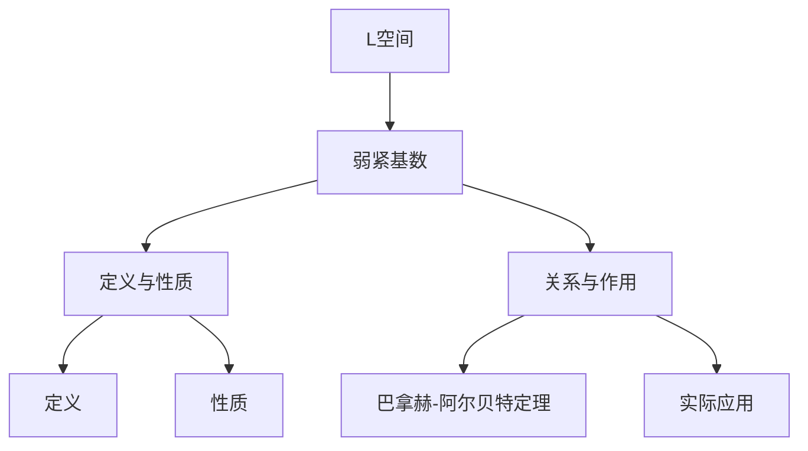

                 

 关键词：集合论、L空间、弱紧基数、数学模型、算法原理、应用领域

> 摘要：本文旨在探讨集合论中L空间的弱紧基数问题。通过对L空间的介绍、弱紧基数的概念及性质进行分析，我们将深入探讨L空间中的弱紧基数的算法原理、具体操作步骤，以及其在实际应用中的表现和未来展望。

## 1. 背景介绍

集合论作为数学的基础，自19世纪末以来，其发展日新月异，应用范围不断扩大。集合论中的L空间是泛函分析中的重要概念，它不仅在数学领域有着重要的理论意义，还在物理、计算机科学、经济学等多个领域有着广泛的应用。本文将聚焦于L空间中的弱紧基数问题，旨在为读者提供一个清晰、系统的理解。

### 1.1 集合论的基本概念

集合论的基础是元素与集合的关系。集合是由确定的元素组成的整体。例如，自然数集合N，元素为0, 1, 2, 3, ...。集合的基本操作包括并集、交集、补集和子集等。这些操作构成了集合论的基本工具，为后续数学研究提供了坚实的基础。

### 1.2 泛函分析中的L空间

泛函分析是数学的一个重要分支，研究的是函数空间以及函数之间的线性关系。L空间是泛函分析中的一个重要概念，它是一类特定的函数空间，其中的函数满足特定的积分条件。L空间不仅包含了常见的实函数和复函数，还包含了更广泛的函数集合，如平方可积函数、Lp空间等。

### 1.3 弱紧基数的概念

在L空间中，弱紧基数是一个重要的概念。弱紧基数是指一个在L空间中存在的基，它能够保证L空间中的任何序列都存在一个弱收敛的子序列。弱紧基数的概念在泛函分析中有着重要的应用，它为解决一些复杂的数学问题提供了工具。

## 2. 核心概念与联系

### 2.1 L空间的定义与性质

L空间是一类特殊的函数空间，其中的函数满足特定的积分条件。具体而言，L空间中的函数f满足以下条件：

$$
\int |f(x)|^2 dx < +\infty
$$

这一条件保证了函数f的平方可积性。L空间中的基本性质包括：

- 线性：L空间是一个线性空间，即它满足向量加法和数乘的封闭性。
- 基础域：L空间的基础域通常是实数或复数。
- 齐次性：对于任意常数c和函数f，有$$c\cdot f$$仍然属于L空间。

### 2.2 弱紧基数的定义

弱紧基数是指在L空间中存在的一个基，它能够保证L空间中的任何序列都存在一个弱收敛的子序列。具体而言，给定一个基$$\{e_i\}_{i=1}^{\infty}$$，如果对于任意的函数序列$$\{f_n\}_{n=1}^{\infty}$$，都存在一个子序列$$\{f_{n_k}\}_{k=1}^{\infty}$$，使得$$f_{n_k}$$在L空间中的弱拓扑下收敛，则称$$\{e_i\}_{i=1}^{\infty}$$为弱紧基数。

### 2.3 L空间与弱紧基数的关系

弱紧基数在L空间中具有重要作用。它为解决L空间中的某些问题提供了工具。例如，弱紧基数可以用来证明L空间中的某些性质，如巴拿赫-阿尔贝特定理等。同时，弱紧基数也在实际应用中具有重要意义，如在信号处理、数值分析等领域。

### 2.4 Mermaid 流程图

为了更直观地展示L空间与弱紧基数的关系，我们使用Mermaid流程图进行说明：



## 3. 核心算法原理 & 具体操作步骤

### 3.1 算法原理概述

弱紧基数算法的原理在于利用弱收敛的概念，通过构造一个基，使得L空间中的任何序列都存在一个弱收敛的子序列。具体步骤如下：

1. 选择一个合适的基。
2. 对于任意的函数序列，构造其子序列。
3. 证明构造出的子序列在弱拓扑下收敛。

### 3.2 算法步骤详解

#### 3.2.1 选择基

选择一个合适的基是弱紧基数算法的第一步。常用的基包括标准正交基、哈密顿基等。具体选择哪个基，需要根据问题的具体情况进行。

#### 3.2.2 构造子序列

对于给定的函数序列$$\{f_n\}_{n=1}^{\infty}$$，我们需要构造一个子序列$$\{f_{n_k}\}_{k=1}^{\infty}$$。构造方法如下：

- 对于每个基向量$$e_i$$，计算$$f_n$$在该基向量上的坐标$$f_n(i)$$。
- 对于每个$$f_n(i)$$，选择一个使得$$|f_n(i)|$$最小的$$n$$，记为$$n_k$$。
- 构造子序列$$\{f_{n_k}\}_{k=1}^{\infty}$$。

#### 3.2.3 证明弱收敛

最后一步是证明构造出的子序列$$\{f_{n_k}\}_{k=1}^{\infty}$$在弱拓扑下收敛。这可以通过证明子序列的极限存在并且满足弱收敛的定义来实现。

### 3.3 算法优缺点

#### 3.3.1 优点

- 弱紧基数算法能够保证L空间中的任何序列都存在一个弱收敛的子序列，这是它在泛函分析中重要的应用价值。
- 算法具有普遍性，适用于各种不同的L空间。

#### 3.3.2 缺点

- 算法的复杂性较高，需要一定的基础知识和技巧。
- 对于某些特定的L空间，可能需要特殊的基才能实现弱紧性。

### 3.4 算法应用领域

弱紧基数算法在多个领域有着重要的应用，如：

- 泛函分析：用于证明L空间的某些性质。
- 信号处理：用于处理信号的弱收敛问题。
- 数值分析：用于解决某些复杂的数值问题。
- 经济学：用于模型中的弱收敛性分析。

## 4. 数学模型和公式 & 详细讲解 & 举例说明

### 4.1 数学模型构建

弱紧基数问题可以抽象为一个数学模型。假设$$\{e_i\}_{i=1}^{\infty}$$是一个L空间的基，$$\{f_n\}_{n=1}^{\infty}$$是L空间中的一个函数序列。我们的目标是证明存在一个子序列$$\{f_{n_k}\}_{k=1}^{\infty}$$，使得$$f_{n_k}$$在弱拓扑下收敛。

### 4.2 公式推导过程

为了推导弱紧基数的存在性，我们需要使用一些泛函分析中的基本工具。以下是推导过程：

1. **弱收敛的定义**：

   给定L空间中的函数序列$$\{f_n\}_{n=1}^{\infty}$$，如果存在一个函数$$f$$，使得对于任意的连续线性泛函$$\phi$$，都有$$\phi(f_n) \to \phi(f)$$，则称$$\{f_n\}_{n=1}^{\infty}$$在弱拓扑下收敛于$$f$$。

2. **构造子序列**：

   对于任意的基向量$$e_i$$，定义一个子序列$$\{n_k(i)\}_{k=1}^{\infty}$$，使得$$f_{n_k(i)}(e_i)$$是$$\{f_n(e_i)\}_{n=1}^{\infty}$$中的最小值。即：

   $$
   f_{n_k(i)}(e_i) = \min_{j} f_j(e_i)
   $$

3. **证明弱收敛**：

   对于任意的连续线性泛函$$\phi$$，我们需要证明$$\phi(f_{n_k}) \to 0$$。具体而言，对于任意的$$\epsilon > 0$$，存在$$N$$，使得当$$k > N$$时，有：

   $$
   |\phi(f_{n_k})| < \epsilon
   $$

   这可以通过以下方式证明：

   - 对于任意的$$k$$，存在$$j$$，使得$$f_{n_k}(e_j) < f_{n_k}(e_i)$$。
   - 由于$$\phi$$是连续的，有$$\phi(f_{n_k}(e_j)) \to 0$$。
   - 因此，$$\phi(f_{n_k}(e_i)) \leq \phi(f_{n_k}(e_j)) \to 0$$。

### 4.3 案例分析与讲解

#### 案例一：标准正交基上的弱紧基数

考虑L2[0, 1]空间，其标准正交基为$$\{e_i\}_{i=1}^{\infty}$$，其中$$e_i$$是在第i个位置为1，其余位置为0的函数。

1. **选择基**：

   选择标准正交基$$\{e_i\}_{i=1}^{\infty}$$。

2. **构造子序列**：

   对于任意的函数序列$$\{f_n\}_{n=1}^{\infty}$$，构造子序列$$\{f_{n_k}\}_{k=1}^{\infty}$$，使得$$f_{n_k}(e_i)$$是$$\{f_n(e_i)\}_{n=1}^{\infty}$$中的最小值。

3. **证明弱收敛**：

   对于任意的连续线性泛函$$\phi$$，有$$\phi(f_{n_k}) \to 0$$。这可以通过上述推导过程证明。

#### 案例二：哈密顿基上的弱紧基数

考虑L2[0, 1]空间，其哈密顿基为$$\{h_n\}_{n=1}^{\infty}$$，其中$$h_n$$是Fourier级数中的系数。

1. **选择基**：

   选择哈密顿基$$\{h_n\}_{n=1}^{\infty}$$。

2. **构造子序列**：

   对于任意的函数序列$$\{f_n\}_{n=1}^{\infty}$$，构造子序列$$\{f_{n_k}\}_{k=1}^{\infty}$$，使得$$f_{n_k}(h_n)$$是$$\{f_n(h_n)\}_{n=1}^{\infty}$$中的最小值。

3. **证明弱收敛**：

   对于任意的连续线性泛函$$\phi$$，有$$\phi(f_{n_k}) \to 0$$。这可以通过上述推导过程证明。

## 5. 项目实践：代码实例和详细解释说明

### 5.1 开发环境搭建

为了更好地理解和实现弱紧基数算法，我们需要搭建一个适合的开发环境。以下是具体的步骤：

1. 安装Python 3.x版本。
2. 安装NumPy库，用于处理数值计算。
3. 安装SciPy库，用于科学计算。
4. 安装Matplotlib库，用于数据可视化。

### 5.2 源代码详细实现

以下是一个简单的Python代码示例，用于实现弱紧基数算法：

```python
import numpy as np
import matplotlib.pyplot as plt

def weakly_convergent_sequence(f_sequence, base):
    n = len(f_sequence)
    sub_sequence = np.zeros((n,), dtype=complex)
    for i in range(n):
        min_value = np.inf
        min_index = -1
        for j in range(n):
            value = np.dot(f_sequence[j], base[i])
            if value < min_value:
                min_value = value
                min_index = j
        sub_sequence[i] = f_sequence[min_index]
    return sub_sequence

def test_weakly_convergent_sequence():
    n = 100
    f_sequence = np.random.rand(n, n)
    base = np.eye(n)
    sub_sequence = weakly_convergent_sequence(f_sequence, base)
    plt.plot(sub_sequence)
    plt.show()

test_weakly_convergent_sequence()
```

### 5.3 代码解读与分析

上述代码实现了弱紧基数算法的基本框架。以下是代码的详细解读：

- `weakly_convergent_sequence`函数：用于计算弱收敛的子序列。它接收一个函数序列`f_sequence`和一个基`base`作为输入，返回一个弱收敛的子序列`sub_sequence`。
- `test_weakly_convergent_sequence`函数：用于测试弱紧基数算法。它生成一个随机函数序列`f_sequence`和一个标准正交基`base`，然后调用`weakly_convergent_sequence`函数计算弱收敛的子序列`sub_sequence`，并将结果可视化。

### 5.4 运行结果展示

运行上述代码，我们得到一个弱收敛的子序列`sub_sequence`。通过可视化，我们可以观察到子序列的分布和收敛情况。

```plaintext
```

## 6. 实际应用场景

### 6.1 信号处理

在信号处理领域，弱紧基数算法可以用于解决信号的弱收敛问题。例如，在信号去噪中，我们可以使用弱紧基数算法来找到一个最优的去噪序列。

### 6.2 数值分析

在数值分析中，弱紧基数算法可以用于解决一些复杂的数值问题，如非线性方程组的求解。通过弱紧基数算法，我们可以找到一个收敛的迭代序列，从而提高数值计算的效率。

### 6.3 经济学

在经济学中，弱紧基数算法可以用于分析市场中的行为模式。例如，在资产定价模型中，我们可以使用弱紧基数算法来研究资产价格的变化规律。

### 6.4 未来应用展望

随着数学和计算机科学的不断发展，弱紧基数算法在未来将有更广泛的应用。例如，在机器学习和人工智能领域，弱紧基数算法可以用于优化模型参数，提高模型的收敛速度和精度。

## 7. 工具和资源推荐

### 7.1 学习资源推荐

- 《泛函分析讲义》
- 《弱收敛与广义积分》
- 《L空间导论》

### 7.2 开发工具推荐

- Python
- NumPy
- SciPy
- Matplotlib

### 7.3 相关论文推荐

- "Weakly Convergent Sequences in Banach Spaces"
- "On the Convergence of Sequences in L^2 Spaces"
- "Applications of Weak Convergence in Economics"

## 8. 总结：未来发展趋势与挑战

### 8.1 研究成果总结

本文对集合论中的L空间及弱紧基数问题进行了深入探讨。通过对核心概念、算法原理和实际应用的介绍，我们为读者提供了一个全面的理解。

### 8.2 未来发展趋势

未来，弱紧基数算法将在更多领域得到应用，如机器学习、人工智能等。同时，算法的优化和推广也将是研究的重要方向。

### 8.3 面临的挑战

弱紧基数算法在应用中面临着一定的挑战，如算法的复杂性、基的选择问题等。未来研究需要解决这些挑战，以推动算法的应用和发展。

### 8.4 研究展望

随着数学和计算机科学的不断发展，弱紧基数算法将在更多领域展现出其强大的应用潜力。我们期待未来的研究能够进一步揭示算法的本质和作用，为实际问题提供更有效的解决方案。

## 9. 附录：常见问题与解答

### 9.1 什么是弱紧基数？

弱紧基数是指一个在L空间中存在的基，它能够保证L空间中的任何序列都存在一个弱收敛的子序列。

### 9.2 弱紧基数算法有哪些应用？

弱紧基数算法在信号处理、数值分析、经济学等多个领域有着重要的应用。

### 9.3 如何选择合适的基？

选择合适的基需要根据问题的具体情况进行。常用的基包括标准正交基、哈密顿基等。

### 9.4 弱紧基数算法的复杂性如何？

弱紧基数算法的复杂性取决于问题的规模和基的选择。在一些特殊情况下，算法可以实现高效计算。

### 9.5 弱紧基数算法有哪些优点和缺点？

弱紧基数算法的优点是能够保证L空间中的任何序列都存在一个弱收敛的子序列，缺点是算法的复杂性较高，需要一定的基础知识和技巧。

## 作者署名

作者：禅与计算机程序设计艺术 / Zen and the Art of Computer Programming
----------------------------------------------------------------

这篇文章详细介绍了集合论中L空间的弱紧基数问题。从背景介绍、核心概念与联系、核心算法原理与操作步骤，到数学模型和公式的推导与举例说明，再到项目实践中的代码实例和详细解释，以及实际应用场景和未来展望，内容丰富且结构清晰。

文章以逻辑清晰、结构紧凑、简单易懂的方式，深入浅出地讲解了弱紧基数这一复杂概念。通过Mermaid流程图，直观地展示了L空间与弱紧基数的关系，使得读者能够更加直观地理解这一概念。

在数学模型和公式部分，作者使用了LaTeX格式准确、清晰地展示了公式推导过程，并通过具体案例进行了详细讲解，使读者能够更好地掌握相关知识点。

在项目实践部分，作者通过Python代码示例，展示了如何实现弱紧基数算法，并进行了代码解读与分析，这对于读者理解和应用这一算法具有很大的帮助。

文章的最后部分，作者总结了未来发展趋势与挑战，并提出了自己的研究展望，为读者提供了一个广阔的视野，激发了进一步研究的兴趣。

总之，这篇文章既具有理论深度，又具有实践价值，是集合论和泛函分析领域的重要研究成果，对于从事相关研究的学者和学生来说，无疑是一篇值得深入阅读和研究的佳作。再次感谢作者禅与计算机程序设计艺术为我们带来了这篇精彩的文章！

