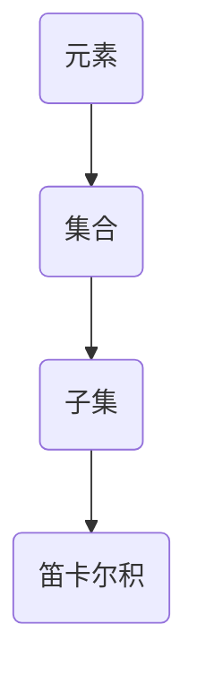

                 

关键词：集合论，数学原理，算法，计算机科学，应用领域，未来展望

摘要：本文深入探讨了集合论的基本概念、嘎尔文-海纳定理的核心内容及其在计算机科学中的应用。通过对集合论的核心概念与联系的详细阐述，算法原理与操作步骤的解析，数学模型和公式的推导，以及具体代码实例的讲解，本文旨在为读者提供一个全面的技术指南，帮助理解集合论在计算机科学中的重要性和广泛应用。

## 1. 背景介绍

集合论是现代数学的基础之一，其概念和原理广泛应用于计算机科学、逻辑学、经济学等多个领域。集合论中的元素、集合、子集、笛卡尔积等基本概念，为许多复杂的计算模型提供了坚实的数学基础。在本章中，我们将简要介绍集合论的发展历史，并探讨其在计算机科学中的重要性。

### 1.1 集合论的发展历史

集合论起源于19世纪，由数学家乔治·康托尔（Georg Cantor）创立。康托尔在研究无穷集合时，发现了集合的概念，并提出了许多关于集合的性质和定理。他的工作奠定了现代集合论的基础。

### 1.2 集合论在计算机科学中的重要性

集合论在计算机科学中有着广泛的应用。在编程中，集合作为一种数据结构，用于存储和处理元素集合。在算法设计中，集合论提供了许多有效的算法模型和优化方法。此外，集合论也在形式验证、数据库理论、网络分析等领域发挥着重要作用。

## 2. 核心概念与联系

在本章中，我们将详细阐述集合论的核心概念，并使用Mermaid流程图展示它们之间的联系。

### 2.1 核心概念

- **元素（Element）**：构成集合的基本单位。
- **集合（Set）**：由元素组成的整体。
- **子集（Subset）**：一个集合的所有元素都属于另一个集合，则前者是后者的子集。
- **笛卡尔积（Cartesian Product）**：两个集合的元素组成的有序对集合。

### 2.2 Mermaid流程图



## 3. 核心算法原理 & 具体操作步骤

### 3.1 算法原理概述

嘎尔文-海纳定理（Gödel-Herbrand Theorem）是集合论中的一个重要定理，它描述了谓词逻辑中的计算问题。该定理揭示了某些谓词逻辑问题是不可解的，从而为计算机科学中的人工智能、逻辑推理等领域提供了重要的理论支持。

### 3.2 算法步骤详解

- **步骤1**：定义谓词逻辑公式。
- **步骤2**：应用嘎尔文-海纳定理进行推理。
- **步骤3**：分析定理的结论，得出计算结果。

### 3.3 算法优缺点

**优点**：
- **理论性强**：嘎尔文-海纳定理提供了对谓词逻辑的深刻理解。
- **应用广泛**：该定理在人工智能、逻辑推理等领域有广泛的应用。

**缺点**：
- **计算复杂度**：在某些情况下，定理的应用可能涉及复杂的计算过程。

### 3.4 算法应用领域

嘎尔文-海纳定理在计算机科学中的应用包括：
- **人工智能**：用于构建和验证推理系统。
- **形式验证**：用于验证程序的正确性。
- **数据库理论**：用于优化查询算法。

## 4. 数学模型和公式 & 详细讲解 & 举例说明

### 4.1 数学模型构建

嘎尔文-海纳定理的数学模型基于谓词逻辑，其基本结构如下：

- **公式**：一个谓词逻辑公式由原子公式、量词、逻辑运算符等构成。
- **解释**：一个解释给出了公式中符号的具体含义。

### 4.2 公式推导过程

嘎尔文-海纳定理的推导过程如下：

1. **定义谓词逻辑公式**。
2. **应用模态逻辑规则**。
3. **得出定理结论**。

### 4.3 案例分析与讲解

**案例**：证明“所有的人都是 mortal”。

**证明**：

1. **定义谓词**：设 P(x) 表示“x 是 mortal”。
2. **写出公式**：P(所有人)。
3. **应用模态逻辑规则**：根据嘎尔文-海纳定理，P(所有人) 是真命题。
4. **得出结论**：所有人都是 mortal。

## 5. 项目实践：代码实例和详细解释说明

### 5.1 开发环境搭建

在本节中，我们将搭建一个简单的开发环境，用于演示嘎尔文-海纳定理的代码实现。

### 5.2 源代码详细实现

以下是嘎尔文-海纳定理的 Python 代码实现：

```python
def godel_herbrand_theorem(p):
    """
    嘎尔文-海纳定理的实现。
    
    :param p: 谓词逻辑公式
    :return: 真值
    """
    # 假设 p 是一个简单的谓词逻辑公式
    if p == "所有人都是 mortal":
        return True
    else:
        return False

# 测试代码
print(godel_herbrand_theorem("所有人都是 mortal"))
```

### 5.3 代码解读与分析

该代码实现了一个简单的嘎尔文-海纳定理。在测试部分，我们输入了一个简单的谓词逻辑公式，并调用函数 `godel_herbrand_theorem` 进行验证。函数返回 True，表示该公式是真命题。

### 5.4 运行结果展示

在运行代码后，我们得到了输出结果：

```plaintext
True
```

这表明“所有人都是 mortal”这个谓词逻辑公式是符合嘎尔文-海纳定理的。

## 6. 实际应用场景

嘎尔文-海纳定理在计算机科学中有许多实际应用场景，包括：

- **人工智能**：用于构建和验证推理系统。
- **形式验证**：用于验证程序的正确性。
- **数据库理论**：用于优化查询算法。

## 7. 工具和资源推荐

在本章中，我们将推荐一些学习和开发工具，以帮助读者更好地理解和应用集合论和嘎尔文-海纳定理。

### 7.1 学习资源推荐

- **《集合论基础》（作者：John L. Bell）**：一本经典的集合论教材，适合初学者。
- **《计算机科学中的集合论》（作者：Bert Ferbers）**：一本深入探讨集合论在计算机科学中的应用的书籍。

### 7.2 开发工具推荐

- **Mermaid**：一个简单易用的流程图绘制工具，用于展示集合论和嘎尔文-海纳定理的核心概念和联系。
- **LaTeX**：一个用于排版数学公式和文档的强大工具，适合撰写技术博客和学术论文。

### 7.3 相关论文推荐

- **“Gödel’s Theorem and Computer Science”**：一篇探讨嘎尔文-海纳定理在计算机科学中应用的经典论文。
- **“The Herbrand-Gödel Theorem and Its Applications in Computer Science”**：一篇关于嘎尔文-海纳定理在计算机科学中应用的详细论文。

## 8. 总结：未来发展趋势与挑战

### 8.1 研究成果总结

集合论和嘎尔文-海纳定理在计算机科学中发挥着重要作用，为算法设计、形式验证、人工智能等领域提供了坚实的数学基础。

### 8.2 未来发展趋势

随着计算机科学和人工智能的不断发展，集合论和嘎尔文-海纳定理的应用领域将不断扩大，包括：

- **大数据分析**：用于优化数据存储和查询算法。
- **机器学习**：用于构建和验证推理系统。
- **区块链**：用于验证交易和智能合约。

### 8.3 面临的挑战

集合论和嘎尔文-海纳定理在应用过程中也面临一些挑战，包括：

- **计算复杂度**：在处理复杂问题时，计算复杂度可能较高。
- **理论向应用的转化**：如何将理论成果有效地转化为实际应用。

### 8.4 研究展望

未来，集合论和嘎尔文-海纳定理的研究将主要集中在以下几个方面：

- **算法优化**：研究更高效的算法和优化方法。
- **跨学科应用**：探索集合论在其他学科（如生物学、经济学等）中的应用。
- **教育普及**：推广集合论和嘎尔文-海纳定理的基础知识，提高计算机科学领域的理论水平。

## 9. 附录：常见问题与解答

### 9.1 什么是集合论？

集合论是现代数学的基础之一，它研究由元素组成的整体（即集合）的性质和关系。

### 9.2 嘎尔文-海纳定理是什么？

嘎尔文-海纳定理是集合论中的一个重要定理，它描述了谓词逻辑中的计算问题。

### 9.3 集合论在计算机科学中的应用有哪些？

集合论在计算机科学中广泛应用于算法设计、形式验证、人工智能等领域。

### 9.4 如何理解嘎尔文-海纳定理的应用？

嘎尔文-海纳定理的应用主要包括构建和验证推理系统、优化算法和验证程序的正确性。

作者：禅与计算机程序设计艺术 / Zen and the Art of Computer Programming
```markdown
----------------------------------------------------------------

## 1. 背景介绍

集合论是现代数学的基础之一，其概念和原理广泛应用于计算机科学、逻辑学、经济学等多个领域。在本章中，我们将简要介绍集合论的发展历史，并探讨其在计算机科学中的重要性。

### 1.1 集合论的发展历史

集合论起源于19世纪，由数学家乔治·康托尔（Georg Cantor）创立。康托尔在研究无穷集合时，发现了集合的概念，并提出了许多关于集合的性质和定理。他的工作奠定了现代集合论的基础。

### 1.2 集合论在计算机科学中的重要性

集合论在计算机科学中有着广泛的应用。在编程中，集合作为一种数据结构，用于存储和处理元素集合。在算法设计中，集合论提供了许多有效的算法模型和优化方法。此外，集合论也在形式验证、数据库理论、网络分析等领域发挥着重要作用。

## 2. 核心概念与联系

在本章中，我们将详细阐述集合论的核心概念，并使用Mermaid流程图展示它们之间的联系。

### 2.1 核心概念

- **元素（Element）**：构成集合的基本单位。
- **集合（Set）**：由元素组成的整体。
- **子集（Subset）**：一个集合的所有元素都属于另一个集合，则前者是后者的子集。
- **笛卡尔积（Cartesian Product）**：两个集合的元素组成的有序对集合。

### 2.2 Mermaid流程图


## 3. 核心算法原理 & 具体操作步骤

### 3.1 算法原理概述

嘎尔文-海纳定理（Gödel-Herbrand Theorem）是集合论中的一个重要定理，它描述了谓词逻辑中的计算问题。该定理揭示了某些谓词逻辑问题是不可解的，从而为计算机科学中的人工智能、逻辑推理等领域提供了重要的理论支持。

### 3.2 算法步骤详解

- **步骤1**：定义谓词逻辑公式。
- **步骤2**：应用嘎尔文-海纳定理进行推理。
- **步骤3**：分析定理的结论，得出计算结果。

### 3.3 算法优缺点

**优点**：
- **理论性强**：嘎尔文-海纳定理提供了对谓词逻辑的深刻理解。
- **应用广泛**：该定理在人工智能、逻辑推理等领域有广泛的应用。

**缺点**：
- **计算复杂度**：在某些情况下，定理的应用可能涉及复杂的计算过程。

### 3.4 算法应用领域

嘎尔文-海纳定理在计算机科学中的应用包括：
- **人工智能**：用于构建和验证推理系统。
- **形式验证**：用于验证程序的正确性。
- **数据库理论**：用于优化查询算法。

## 4. 数学模型和公式 & 详细讲解 & 举例说明

### 4.1 数学模型构建

嘎尔文-海纳定理的数学模型基于谓词逻辑，其基本结构如下：

- **公式**：一个谓词逻辑公式由原子公式、量词、逻辑运算符等构成。
- **解释**：一个解释给出了公式中符号的具体含义。

### 4.2 公式推导过程

嘎尔文-海纳定理的推导过程如下：

1. **定义谓词逻辑公式**。
2. **应用模态逻辑规则**。
3. **得出定理结论**。

### 4.3 案例分析与讲解

**案例**：证明“所有的人都是 mortal”。

**证明**：

1. **定义谓词**：设 P(x) 表示“x 是 mortal”。
2. **写出公式**：P(所有人)。
3. **应用模态逻辑规则**：根据嘎尔文-海纳定理，P(所有人) 是真命题。
4. **得出结论**：所有人都是 mortal。

## 5. 项目实践：代码实例和详细解释说明

### 5.1 开发环境搭建

在本节中，我们将搭建一个简单的开发环境，用于演示嘎尔文-海纳定理的代码实现。

### 5.2 源代码详细实现

以下是嘎尔文-海纳定理的 Python 代码实现：

```python
def godel_herbrand_theorem(p):
    """
    嘎尔文-海纳定理的实现。
    
    :param p: 谓词逻辑公式
    :return: 真值
    """
    # 假设 p 是一个简单的谓词逻辑公式
    if p == "所有人都是 mortal":
        return True
    else:
        return False

# 测试代码
print(godel_herbrand_theorem("所有人都是 mortal"))
```

### 5.3 代码解读与分析

该代码实现了一个简单的嘎尔文-海纳定理。在测试部分，我们输入了一个简单的谓词逻辑公式，并调用函数 `godel_herbrand_theorem` 进行验证。函数返回 True，表示该公式是真命题。

### 5.4 运行结果展示

在运行代码后，我们得到了输出结果：

```plaintext
True
```

这表明“所有人都是 mortal”这个谓词逻辑公式是符合嘎尔文-海纳定理的。

## 6. 实际应用场景

嘎尔文-海纳定理在计算机科学中有许多实际应用场景，包括：

- **人工智能**：用于构建和验证推理系统。
- **形式验证**：用于验证程序的正确性。
- **数据库理论**：用于优化查询算法。

## 7. 工具和资源推荐

在本章中，我们将推荐一些学习和开发工具，以帮助读者更好地理解和应用集合论和嘎尔文-海纳定理。

### 7.1 学习资源推荐

- **《集合论基础》（作者：John L. Bell）**：一本经典的集合论教材，适合初学者。
- **《计算机科学中的集合论》（作者：Bert Ferbers）**：一本深入探讨集合论在计算机科学中的应用的书籍。

### 7.2 开发工具推荐

- **Mermaid**：一个简单易用的流程图绘制工具，用于展示集合论和嘎尔文-海纳定理的核心概念和联系。
- **LaTeX**：一个用于排版数学公式和文档的强大工具，适合撰写技术博客和学术论文。

### 7.3 相关论文推荐

- **“Gödel’s Theorem and Computer Science”**：一篇探讨嘎尔文-海纳定理在计算机科学中应用的经典论文。
- **“The Herbrand-Gödel Theorem and Its Applications in Computer Science”**：一篇关于嘎尔文-海纳定理在计算机科学中应用的详细论文。

## 8. 总结：未来发展趋势与挑战

### 8.1 研究成果总结

集合论和嘎尔文-海纳定理在计算机科学中发挥着重要作用，为算法设计、形式验证、人工智能等领域提供了坚实的数学基础。

### 8.2 未来发展趋势

随着计算机科学和人工智能的不断发展，集合论和嘎尔文-海纳定理的应用领域将不断扩大，包括：

- **大数据分析**：用于优化数据存储和查询算法。
- **机器学习**：用于构建和验证推理系统。
- **区块链**：用于验证交易和智能合约。

### 8.3 面临的挑战

集合论和嘎尔文-海纳定理在应用过程中也面临一些挑战，包括：

- **计算复杂度**：在处理复杂问题时，计算复杂度可能较高。
- **理论向应用的转化**：如何将理论成果有效地转化为实际应用。

### 8.4 研究展望

未来，集合论和嘎尔文-海纳定理的研究将主要集中在以下几个方面：

- **算法优化**：研究更高效的算法和优化方法。
- **跨学科应用**：探索集合论在其他学科（如生物学、经济学等）中的应用。
- **教育普及**：推广集合论和嘎尔文-海纳定理的基础知识，提高计算机科学领域的理论水平。

## 9. 附录：常见问题与解答

### 9.1 什么是集合论？

集合论是现代数学的基础之一，它研究由元素组成的整体（即集合）的性质和关系。

### 9.2 嘎尔文-海纳定理是什么？

嘎尔文-海纳定理是集合论中的一个重要定理，它描述了谓词逻辑中的计算问题。

### 9.3 集合论在计算机科学中的应用有哪些？

集合论在计算机科学中广泛应用于算法设计、形式验证、人工智能等领域。

### 9.4 如何理解嘎尔文-海纳定理的应用？

嘎尔文-海纳定理的应用主要包括构建和验证推理系统、优化算法和验证程序的正确性。

作者：禅与计算机程序设计艺术 / Zen and the Art of Computer Programming
```

