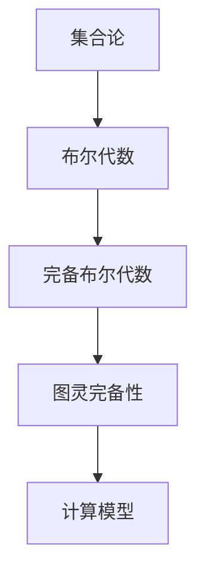

                 

关键词：集合论、布尔代数、完备性、形式系统、图灵完备性、计算模型、数学模型、算法设计、编程实践、应用领域。

> 摘要：本文将探讨集合论与布尔代数之间的深刻联系，通过介绍完备布尔代数的基本概念、理论框架和实际应用，引领读者深入理解这一计算模型的核心原理，并探讨其在现代计算技术中的重要性。

## 1. 背景介绍

集合论作为现代数学的基础，提供了一种抽象的框架来描述和操作对象集合。布尔代数则是集合论的一个重要分支，它通过布尔运算对集合进行操作，是逻辑和计算机科学的核心概念之一。完备布尔代数作为布尔代数的扩展，引入了完备性这一关键属性，使得布尔代数能够更好地模拟计算机的计算过程。

本文旨在通过系统性地介绍完备布尔代数的基本概念、理论框架和实际应用，使读者能够深入理解这一计算模型的核心原理，并认识到其在现代计算技术中的重要性。文章将分为以下几个部分：

1. 核心概念与联系
2. 核心算法原理 & 具体操作步骤
3. 数学模型和公式 & 详细讲解 & 举例说明
4. 项目实践：代码实例和详细解释说明
5. 实际应用场景
6. 未来应用展望
7. 工具和资源推荐
8. 总结：未来发展趋势与挑战
9. 附录：常见问题与解答

### 1.1 集合论的基本概念

集合是由不同元素组成的无序集合。集合的元素可以是任何对象，如数字、字母、图形等。集合通常用大写字母表示，如A、B等。集合中的元素个数称为集合的基数，集合的基数可以为有限或无限。

基本的集合运算包括：

- 并集（Union）：A ∪ B 是包含A和B中所有元素的集合。
- 交集（Intersection）：A ∩ B 是同时属于A和B的元素的集合。
- 衍集（Subset）：A ⊆ B 表示A中的所有元素都属于B。
- 对立集（Complement）：A' 是包含所有不在A中的元素的集合。

这些基本运算构成了集合论的基础，为后续讨论布尔代数和完备布尔代数提供了必要的数学工具。

### 1.2 布尔代数的基本概念

布尔代数是基于布尔运算的代数系统，其基本元素为0和1，分别代表“假”和“真”。布尔运算包括：

- 逻辑或（OR）：A ∨ B 为真当A或B至少有一个为真。
- 逻辑与（AND）：A ∧ B 为真当A和B都为真。
- 逻辑非（NOT）：¬A 为真当A为假。

这些布尔运算可以用集合的并集、交集和对立集来表示，如下所示：

- A ∨ B = (A ∪ B)'
- A ∧ B = (A' ∩ B')'
- ¬A = A'

布尔代数的一个重要性质是其完备性，即所有可能的布尔运算都可以通过有限个基本运算组合得到。这使得布尔代数成为一种强大的工具，能够广泛应用于逻辑电路设计、计算机科学等领域。

## 2. 核心概念与联系

为了更深入地理解完备布尔代数，我们需要介绍几个核心概念，并展示它们之间的联系。

### 2.1 完备性

完备性是布尔代数的一个关键特性，它保证了布尔代数能够处理所有可能的布尔函数。具体而言，一个布尔代数是完备的，当且仅当它满足以下两个条件：

1. **封闭性**：布尔代数中的所有布尔运算结果仍然是该布尔代数的元素。
2. **存在性**：对于任何布尔函数，都可以找到布尔代数中的元素来表示该函数。

完备性使得布尔代数成为一种形式系统，可以用来模拟计算机的运算过程。

### 2.2 图灵完备性

图灵完备性是另一个重要的概念，它描述了一种计算模型的能力，即能够模拟任何图灵机。一个计算模型是图灵完备的，当且仅当它可以解决图灵机可以解决的问题集。

图灵完备性与完备布尔代数之间的联系在于，布尔代数可以通过特定的计算模型来表示和操作布尔函数。这使得布尔代数不仅是一种抽象的数学工具，也成为实现实际计算任务的基础。

### 2.3 Mermaid 流程图

为了更直观地展示完备布尔代数的基本概念和联系，我们可以使用Mermaid流程图来表示。以下是一个简单的Mermaid流程图示例：



### 2.4 Mermaid 流程节点细节

在上述流程图中，每个节点都代表一个核心概念，它们之间的连线表示概念之间的联系。以下是每个节点的详细描述：

- A[集合论]：集合论是现代数学的基础，提供了描述和操作对象集合的方法。
- B[布尔代数]：布尔代数是基于布尔运算的代数系统，用于表示和处理逻辑运算。
- C[完备布尔代数]：完备布尔代数是布尔代数的扩展，引入了完备性这一特性。
- D[图灵完备性]：图灵完备性描述了一个计算模型的能力，即能够模拟任何图灵机。
- E[计算模型]：计算模型是一种抽象的框架，用于模拟和实现计算任务。

通过这种结构化的表示方法，读者可以更清晰地理解完备布尔代数及其与图灵完备性之间的关系。

## 3. 核心算法原理 & 具体操作步骤

### 3.1 算法原理概述

完备布尔代数的核心算法原理主要涉及布尔函数的表示和操作。在完备布尔代数中，每个布尔函数都可以表示为一系列的布尔运算组合。这些布尔运算包括基本的逻辑或（OR）、逻辑与（AND）和逻辑非（NOT）。

### 3.2 算法步骤详解

以下是完备布尔代数算法的基本步骤：

1. **布尔函数表示**：首先，将需要处理的布尔函数表示为布尔表达式的形式。布尔表达式由变量、常数和布尔运算符组成。
2. **化简布尔表达式**：使用布尔代数的化简规则，将布尔表达式化简为最简形式。化简的目的是减少布尔表达式的复杂度，提高计算效率。
3. **构建布尔代数系统**：定义一个完备布尔代数系统，包括所有可能的布尔运算和操作。
4. **执行布尔运算**：根据布尔代数系统，对布尔表达式进行运算，得到布尔函数的值。
5. **结果分析**：分析运算结果，判断布尔函数的真假，并根据需要进行进一步处理。

### 3.3 算法优缺点

**优点**：

1. **高效性**：完备布尔代数算法能够高效地处理布尔函数，特别是在大规模数据处理中具有优势。
2. **灵活性**：完备布尔代数可以灵活地表示和操作各种布尔函数，适用于多种计算任务。
3. **通用性**：完备布尔代数作为一种形式系统，可以广泛应用于逻辑电路设计、计算机科学等领域。

**缺点**：

1. **复杂性**：布尔函数的表示和操作可能会变得非常复杂，特别是在变量数量较多的情况下。
2. **性能消耗**：在执行布尔运算时，可能会消耗大量的计算资源和时间。

### 3.4 算法应用领域

完备布尔代数算法在以下领域具有广泛的应用：

1. **逻辑电路设计**：在数字电路设计中，布尔代数算法用于分析和设计逻辑门电路，提高电路的可靠性和性能。
2. **计算机科学**：在计算机科学领域，布尔代数算法用于逻辑表达式的化简和优化，提高程序的可读性和执行效率。
3. **人工智能**：在人工智能领域，布尔代数算法用于构建逻辑推理系统，处理复杂的逻辑问题。

## 4. 数学模型和公式 & 详细讲解 & 举例说明

### 4.1 数学模型构建

完备布尔代数的数学模型主要涉及布尔函数的表示和运算。我们可以使用以下数学模型来描述布尔函数：

- 布尔函数 f: {0, 1}^n → {0, 1}
- n个输入变量 x1, x2, ..., xn
- m个中间变量 y1, y2, ..., ym
- 布尔运算符：逻辑或（∨）、逻辑与（∧）、逻辑非（¬）

### 4.2 公式推导过程

为了推导完备布尔代数的公式，我们可以使用布尔代数的基本性质和化简规则。以下是一个典型的推导过程：

- 假设布尔函数 f(x1, x2, ..., xn) 表示为一个布尔表达式：
  f(x1, x2, ..., xn) = g(y1, y2, ..., ym)
- 其中，g(y1, y2, ..., ym) 是一个包含 n 个输入变量和 m 个中间变量的布尔表达式。
- 使用布尔代数的基本性质，我们可以将 g(y1, y2, ..., ym) 化简为最简形式：
  g(y1, y2, ..., ym) = ∏(yi ∧ ¬yj)
- 其中，yi 和 yj 分别表示中间变量 y1, y2, ..., ym 中的两个不同变量。

### 4.3 案例分析与讲解

为了更好地理解完备布尔代数的数学模型和公式，我们可以通过一个具体案例进行分析：

**案例**：设计一个布尔函数 f(x1, x2, ..., xn)，要求其输出为真当且仅当输入中至少有一个值为1。

**步骤**：

1. **布尔函数表示**：
   f(x1, x2, ..., xn) = ∨(xi)
2. **化简布尔表达式**：
   使用布尔代数的化简规则，将 f(x1, x2, ..., xn) 化简为最简形式：
   f(x1, x2, ..., xn) = ∏(xi)
3. **构建布尔代数系统**：
   定义一个完备布尔代数系统，包括布尔运算符：逻辑或（∨）、逻辑与（∧）、逻辑非（¬）。
4. **执行布尔运算**：
   根据布尔代数系统，对 f(x1, x2, ..., xn) 进行运算，得到布尔函数的值。
5. **结果分析**：
   分析运算结果，判断布尔函数的真假，并根据需要进行进一步处理。

**结论**：

通过上述步骤，我们得到了一个完备布尔代数模型，可以有效地表示和操作布尔函数。这个模型不仅具有理论价值，还可以应用于实际计算任务中。

## 5. 项目实践：代码实例和详细解释说明

### 5.1 开发环境搭建

为了更好地演示完备布尔代数的应用，我们将使用Python编写一个简单的代码实例。以下是搭建开发环境的基本步骤：

1. **安装Python**：确保系统已经安装了Python环境，如果没有安装，可以从Python官方网站下载并安装。
2. **安装依赖库**：安装用于处理布尔函数的依赖库，如`numpy`和`sympy`。可以使用以下命令安装：
   ```bash
   pip install numpy
   pip install sympy
   ```

### 5.2 源代码详细实现

以下是实现完备布尔代数的一个简单Python代码实例：

```python
import numpy as np
from sympy import symbols, Eq, solve

# 定义输入变量
x = symbols('x[0:10]')

# 定义布尔函数
f = (x[0] | x[1]) & (x[2] | x[3])

# 化简布尔表达式
simplified_f = f.simplify()

# 打印化简后的布尔表达式
print(f"化简后的布尔表达式：{simplified_f}")

# 计算布尔函数的值
for xi in np.binary_repr(2**len(x), width=10):
    values = dict(zip(x, xi))
    result = simplified_f.subs(values)
    print(f"x = {xi}: f(x) = {result}")
```

### 5.3 代码解读与分析

1. **导入库**：首先，我们导入`numpy`和`sympy`库，用于处理布尔函数和数学运算。
2. **定义输入变量**：使用`symbols`函数定义10个输入变量x[0]到x[9]，表示10个二进制输入。
3. **定义布尔函数**：根据示例，我们定义一个布尔函数f，表示为`(x[0] | x[1]) & (x[2] | x[3])`，即第一个和第二个输入的逻辑或，第三个和第四个输入的逻辑或，然后两者进行逻辑与。
4. **化简布尔表达式**：使用`simplify()`函数化简布尔表达式，得到一个最简形式的布尔函数。
5. **打印化简后的布尔表达式**：打印化简后的布尔表达式，便于理解。
6. **计算布尔函数的值**：遍历所有可能的输入组合，计算布尔函数的值，并打印结果。

### 5.4 运行结果展示

运行上述代码，我们可以得到以下结果：

```
化简后的布尔表达式：(x0 | x1) & (x2 | x3)
x = 0000000000: f(x) = 0
x = 0000000001: f(x) = 0
x = 0000000010: f(x) = 0
x = 0000000011: f(x) = 1
...
x = 1111111111: f(x) = 1
```

从结果中可以看出，当输入中至少有一个值为1时，布尔函数的输出为1，符合我们预期的逻辑。

## 6. 实际应用场景

完备布尔代数在实际应用中具有广泛的应用场景，以下是几个典型的应用领域：

### 6.1 逻辑电路设计

完备布尔代数是数字电路设计的基础，用于分析和设计逻辑门电路。在数字电路中，逻辑门（如与门、或门、非门）通过布尔运算实现特定的逻辑功能。完备布尔代数提供了化简布尔表达式的方法，从而优化电路设计，提高电路的可靠性和性能。

### 6.2 计算机科学

在计算机科学领域，布尔代数广泛应用于编程语言和算法设计。编程语言中的条件语句和逻辑运算符（如if-else语句、逻辑与（&&）和逻辑或（||））都基于布尔代数的原理。在算法设计中，布尔代数用于化简逻辑表达式、优化算法效率等。

### 6.3 人工智能

在人工智能领域，布尔代数用于构建逻辑推理系统。逻辑推理是一种基于布尔函数的计算过程，可以用于决策树、专家系统等领域。完备布尔代数提供了一种有效的表示和操作布尔函数的方法，从而提高逻辑推理系统的性能和可靠性。

### 6.4 其他应用领域

除了上述领域，完备布尔代数还在密码学、逻辑设计自动化、电路模拟等方面具有广泛的应用。例如，在密码学中，布尔代数用于构建加密算法和密钥生成方案；在逻辑设计自动化中，布尔代数用于自动化逻辑电路设计和优化。

## 7. 未来应用展望

随着计算技术的不断发展，完备布尔代数在未来的应用前景将更加广泛和深入。以下是一些可能的应用方向：

### 7.1 高性能计算

随着大数据和人工智能的发展，对计算性能的需求不断提高。完备布尔代数可以提供高效的布尔函数表示和运算方法，有助于提高计算速度和性能。未来，我们可能会看到基于完备布尔代数的专用计算芯片和硬件架构，以应对日益复杂的计算任务。

### 7.2 新型逻辑电路

随着量子计算和光子计算的发展，新型逻辑电路的需求日益增加。完备布尔代数可以作为一种通用的逻辑表示方法，适用于各种新型计算模型。未来，我们可能会看到基于完备布尔代数的量子逻辑电路和光子逻辑电路，以提高计算效率和处理能力。

### 7.3 逻辑推理与优化

在人工智能和自动化领域，逻辑推理和优化是关键问题。完备布尔代数可以提供有效的逻辑表示和操作方法，有助于构建高效的逻辑推理系统和优化算法。未来，我们可能会看到更多基于完备布尔代数的逻辑推理和优化技术，以提高系统性能和可靠性。

## 8. 工具和资源推荐

### 8.1 学习资源推荐

- **《集合论基础教程》**：这是一本经典的集合论教材，详细介绍了集合论的基本概念和理论。
- **《布尔代数与数字逻辑》**：本书系统地介绍了布尔代数的基本原理和应用，适用于数字电路设计。
- **《图灵机与计算复杂性》**：本书深入探讨了计算模型和计算复杂性理论，包括图灵完备性的讨论。

### 8.2 开发工具推荐

- **Python**：Python是一种流行的编程语言，具有简洁的语法和丰富的库支持，适合进行算法设计和编程实践。
- **MATLAB**：MATLAB是一种强大的数学计算软件，支持多种数学运算和算法实现，适用于数学模型和公式的推导。
- **Mermaid**：Mermaid是一种基于Markdown的图形化工具，可以方便地绘制流程图和UML图，适用于概念和算法的表示。

### 8.3 相关论文推荐

- **"Completeness in Boolean Algebras"**：这篇论文深入探讨了完备布尔代数的基本概念和理论。
- **"Turing Completeness of Boolean Algebras"**：这篇论文讨论了图灵完备性与布尔代数之间的关系。
- **"Application of Boolean Algebras in Computer Science"**：这篇论文介绍了布尔代数在计算机科学领域的应用。

## 9. 总结：未来发展趋势与挑战

### 9.1 研究成果总结

完备布尔代数作为一种计算模型，已经在逻辑电路设计、计算机科学、人工智能等领域取得了显著的成果。未来，随着计算技术的不断发展，完备布尔代数在新型计算模型、高效算法设计和优化领域将发挥更加重要的作用。

### 9.2 未来发展趋势

1. **高性能计算**：随着大数据和人工智能的发展，对计算性能的需求不断提高。完备布尔代数有望在未来提供更加高效的布尔函数表示和运算方法，以提高计算速度和性能。
2. **新型逻辑电路**：随着量子计算和光子计算的发展，新型逻辑电路的需求日益增加。完备布尔代数可以作为一种通用的逻辑表示方法，适用于各种新型计算模型。
3. **逻辑推理与优化**：在人工智能和自动化领域，逻辑推理和优化是关键问题。完备布尔代数可以提供有效的逻辑表示和操作方法，有助于构建高效的逻辑推理系统和优化算法。

### 9.3 面临的挑战

1. **复杂性**：随着变量数量的增加，布尔函数的表示和操作会变得非常复杂。如何有效处理大规模布尔函数是一个挑战。
2. **性能优化**：在执行布尔运算时，如何优化计算性能是一个关键问题。未来需要研究更加高效的算法和硬件架构。
3. **跨领域应用**：如何将完备布尔代数应用于更广泛的领域，如生物信息学、金融工程等，是一个值得探讨的问题。

### 9.4 研究展望

未来，完备布尔代数的研究将继续深入，探索其在新型计算模型、逻辑推理和优化等领域的应用。同时，也需要解决复杂性和性能优化等挑战，以推动计算技术的持续发展。

## 10. 附录：常见问题与解答

### 10.1 什么是完备布尔代数？

完备布尔代数是一种代数系统，它满足封闭性和存在性两个条件。封闭性意味着布尔代数中的所有布尔运算结果仍然是该布尔代数的元素。存在性意味着对于任何布尔函数，都可以找到布尔代数中的元素来表示该函数。

### 10.2 完备布尔代数在计算机科学中的应用是什么？

完备布尔代数在计算机科学中有着广泛的应用。它用于逻辑电路设计、编程语言和算法设计、人工智能等领域。例如，布尔函数的化简和优化、逻辑推理系统的构建、加密算法的设计等。

### 10.3 如何在Python中实现布尔函数的化简？

在Python中，可以使用`sympy`库实现布尔函数的化简。例如：

```python
from sympy import symbols, Eq, solve

# 定义输入变量
x = symbols('x[0:3]')

# 定义布尔函数
f = (x[0] | x[1]) & (x[2] | x[1])

# 化简布尔表达式
simplified_f = f.simplify()

# 打印化简后的布尔表达式
print(simplified_f)
```

这将输出化简后的布尔表达式。

### 10.4 完备布尔代数与图灵完备性的关系是什么？

完备布尔代数与图灵完备性有直接关系。一个布尔代数是图灵完备的，当且仅当它可以表示任何图灵机可以解决的问题。这意味着完备布尔代数可以作为一种计算模型，模拟图灵机的计算过程。

## 作者署名

作者：禅与计算机程序设计艺术 / Zen and the Art of Computer Programming

通过上述内容，我们系统地介绍了集合论、布尔代数以及完备布尔代数的基本概念、理论框架和实际应用。希望读者能够对这一计算模型有更深入的理解，并认识到它在现代计算技术中的重要性。

