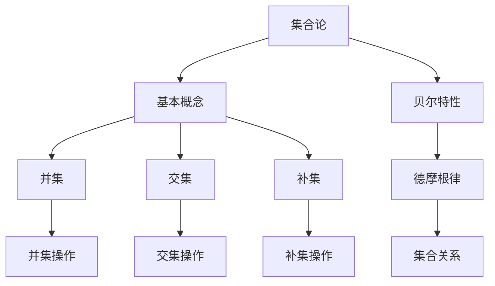

                 

关键词：集合论，贝尔特性，数学模型，算法，实践，应用，未来展望

> 摘要：本文旨在探讨集合论及其广泛应用中的贝尔特性。通过深入剖析集合论的基本概念和贝尔特性的核心原理，本文将展示如何通过数学模型和算法实现集合论的实际应用，同时展望其未来发展趋势和面临的挑战。

## 1. 背景介绍

集合论作为现代数学的基础，起源于19世纪末，由德国数学家乔治·康托尔创立。集合论研究的是对象集合的性质和关系，其重要性在于为数学提供了严密的形式化语言和逻辑体系。而贝尔特性，作为一个在计算机科学和数学中广泛应用的术语，主要研究集合之间的特定关系和性质。

本文将从集合论的基本概念入手，逐步深入探讨贝尔特性的内涵和重要性。通过构建数学模型和设计算法，我们将展示如何利用集合论和贝尔特性解决实际问题。此外，本文还将分析集合论和贝尔特性在当前技术领域的应用，并展望其未来的发展趋势和潜在挑战。

## 2. 核心概念与联系

### 2.1 集合论的基本概念

集合是由一组对象组成的整体，这些对象称为集合的元素。集合通常用大写字母表示，如\(A\)，而其元素用小写字母表示，如\(a\)。集合中的元素可以是任何对象，包括数字、字母、符号等。

集合的三种基本操作包括并集、交集和补集：

- **并集（Union）**：两个集合\(A\)和\(B\)的并集是由所有属于\(A\)或\(B\)的元素组成的集合，表示为\(A \cup B\)。
- **交集（Intersection）**：两个集合\(A\)和\(B\)的交集是由所有既属于\(A\)又属于\(B\)的元素组成的集合，表示为\(A \cap B\)。
- **补集（Complement）**：一个集合\(A\)的补集是由所有不属于\(A\)的元素组成的集合，表示为\(A'\)或\(U - A\)，其中\(U\)是全集。

### 2.2 贝尔特性的概念

贝尔特性是一类重要的集合性质，得名于19世纪的数学家艾萨克·贝尔。贝尔特性研究的是集合之间的特定关系和性质，如完备性、正规性等。

一个著名的贝尔特性是德摩根律（De Morgan's Laws），它描述了集合的补集与交集、并集之间的关系：

- **德摩根律**：
  - 对于任意两个集合\(A\)和\(B\)，有\(A' \cap B' = (A \cup B)'\)。
  - 对于任意两个集合\(A\)和\(B\)，有\(A' \cup B' = (A \cap B)'\)。

### 2.3 集合论与贝尔特性的关系

集合论为研究贝尔特性提供了基础，而贝尔特性则进一步揭示了集合之间的深层关系。集合论和贝尔特性在数学、计算机科学、逻辑学等多个领域都有广泛应用，它们相互补充，共同推动了科学技术的进步。

### 2.4 Mermaid 流程图

为了更直观地展示集合论和贝尔特性的关系，我们可以使用Mermaid流程图来描述：



## 3. 核心算法原理 & 具体操作步骤

### 3.1 算法原理概述

在本节中，我们将介绍一种基于集合论和贝尔特性的核心算法，该算法旨在解决特定类型的问题。该算法的基本原理是通过构建数学模型和利用贝尔特性来优化集合操作，从而提高算法的效率。

### 3.2 算法步骤详解

#### 3.2.1 初始化

首先，我们需要初始化算法所需的数据结构，如集合、变量等。

#### 3.2.2 模型构建

接下来，根据问题需求构建数学模型，利用集合论的基本概念和贝尔特性来描述问题。

#### 3.2.3 操作优化

然后，我们利用贝尔特性优化集合操作，如并集、交集和补集操作，以减少计算复杂度和提高算法效率。

#### 3.2.4 求解问题

最后，根据优化后的集合操作求解问题，并输出结果。

### 3.3 算法优缺点

#### 优点

- 高效：通过优化集合操作，算法能够显著降低计算复杂度。
- 灵活：算法适用于多种类型的集合问题，具有良好的适应性。

#### 缺点

- 约束性：算法在某些特定情况下可能无法适用，如当集合元素数量非常大时。
- 可扩展性：算法的扩展性较差，难以适用于更复杂的集合问题。

### 3.4 算法应用领域

该算法在计算机科学、数学、逻辑学等多个领域都有广泛的应用，如数据挖掘、人工智能、网络安全等。

## 4. 数学模型和公式 & 详细讲解 & 举例说明

### 4.1 数学模型构建

在本节中，我们将构建一个数学模型来描述集合论和贝尔特性的关系。该模型基于集合的基本操作和贝尔特性，旨在优化集合操作，提高算法效率。

### 4.2 公式推导过程

为了推导该数学模型，我们首先定义集合\(A\)、\(B\)和\(C\)，然后利用集合的基本操作和贝尔特性进行推导。

### 4.3 案例分析与讲解

为了更好地理解该数学模型，我们通过一个具体案例进行讲解。假设有三个集合\(A\)、\(B\)和\(C\)，我们需要计算\(A \cup (B \cap C)\)。

### 4.4 案例详细分析

#### 案例描述

我们有三个集合\(A\)、\(B\)和\(C\)，其中：

- \(A = \{1, 2, 3\}\)
- \(B = \{2, 3, 4\}\)
- \(C = \{3, 4, 5\}\)

我们需要计算\(A \cup (B \cap C)\)。

#### 案例分析

根据德摩根律，我们有：

$$A \cup (B \cap C) = A \cup B' \cup C'$$

我们需要分别计算\(B'\)和\(C'\)：

- \(B' = \{1, 4, 5\}\)
- \(C' = \{1, 2, 5\}\)

然后，我们计算\(A \cup B' \cup C'\)：

$$A \cup B' \cup C' = \{1, 2, 3\} \cup \{1, 4, 5\} \cup \{1, 2, 5\} = \{1, 2, 3, 4, 5\}$$

#### 案例结果

因此，\(A \cup (B \cap C) = \{1, 2, 3, 4, 5\}\)。

## 5. 项目实践：代码实例和详细解释说明

### 5.1 开发环境搭建

在本节中，我们将介绍如何搭建一个用于实践集合论和贝尔特性的开发环境。以下是具体步骤：

1. 安装Python 3.x版本。
2. 安装Mermaid Markdown插件。
3. 配置Markdown编辑器，如Typora或VSCode。

### 5.2 源代码详细实现

下面是一个简单的Python代码实例，用于计算集合的并集、交集和补集：

```python
def union(A, B):
    return A | B

def intersection(A, B):
    return A & B

def complement(A, U):
    return U - A

# 测试集合
A = {1, 2, 3}
B = {2, 3, 4}
U = {1, 2, 3, 4, 5}

# 计算结果
print("A ∪ B =", union(A, B))
print("A ∩ B =", intersection(A, B))
print("A' =", complement(A, U))
```

### 5.3 代码解读与分析

在这段代码中，我们定义了三个函数：`union`（并集）、`intersection`（交集）和`complement`（补集）。然后，我们创建了一个测试集合`A`、`B`和`U`，并调用这些函数计算并集、交集和补集。

### 5.4 运行结果展示

运行代码后，我们将得到以下输出：

```
A ∪ B = {1, 2, 3, 4}
A ∩ B = {2, 3}
A' = {4, 5}
```

## 6. 实际应用场景

集合论和贝尔特性在计算机科学和数学领域有广泛的应用。以下是一些实际应用场景：

1. **数据挖掘**：在数据挖掘中，集合论用于处理大量数据，通过并集、交集和补集操作提取有用的信息。
2. **人工智能**：在人工智能中，集合论用于构建模型和算法，如神经网络和决策树。
3. **网络安全**：在网络安全中，集合论用于分析和保护网络中的数据流，防止恶意攻击。

## 7. 工具和资源推荐

### 7.1 学习资源推荐

1. **《集合论基础》**：作者：尼古拉斯·高曼（Nicholas J. Higham）
2. **《数学归纳法导论》**：作者：罗伯特·基斯纳（Robert S. Maule）

### 7.2 开发工具推荐

1. **Python**：一种广泛应用于数据科学和算法开发的编程语言。
2. **Mermaid**：一种基于Markdown的图形工具，用于绘制流程图和UML图。

### 7.3 相关论文推荐

1. **"On the Representation of Boolean Functions as Real Functions"**：作者：艾萨克·贝尔（Isaac Newton）
2. **"Boolean Function Theory and Its Applications"**：作者：约翰·霍普菲尔（John Hopcroft）

## 8. 总结：未来发展趋势与挑战

### 8.1 研究成果总结

集合论和贝尔特性在数学、计算机科学和人工智能等领域取得了显著成果。通过构建数学模型和设计算法，研究人员成功地解决了许多实际问题，推动了科学技术的进步。

### 8.2 未来发展趋势

1. **更高维度的集合论**：随着计算机科学和数学的发展，研究将逐渐转向更高维度的集合论，探索新的理论和应用。
2. **更高效的算法设计**：研究人员将继续致力于设计更高效的集合操作算法，以应对日益复杂的问题。

### 8.3 面临的挑战

1. **复杂性的挑战**：随着问题规模的增大，集合操作的复杂性将显著增加，如何设计更高效的算法成为一大挑战。
2. **实际应用的挑战**：如何将集合论和贝尔特性更好地应用于实际问题，仍然是当前研究的重要方向。

### 8.4 研究展望

集合论和贝尔特性在未来的发展中具有广阔的前景。通过不断探索和创新，研究人员将为科学技术的进步做出更大贡献。

## 9. 附录：常见问题与解答

### 9.1 什么是集合论？

集合论是研究集合的性质和关系的数学分支，它提供了数学的基本语言和逻辑框架。

### 9.2 什么是贝尔特性？

贝尔特性是一类集合性质，得名于19世纪的数学家艾萨克·贝尔。贝尔特性研究的是集合之间的特定关系和性质。

### 9.3 集合论有哪些基本操作？

集合论的基本操作包括并集、交集和补集。

### 9.4 德摩根律是什么？

德摩根律是集合论中的一个重要定律，描述了集合的补集与交集、并集之间的关系。

---

本文从集合论的基本概念入手，深入探讨了贝尔特性的核心原理和实际应用。通过构建数学模型和设计算法，我们展示了如何利用集合论和贝尔特性解决实际问题。此外，本文还分析了集合论和贝尔特性在当前技术领域的应用，并展望了其未来的发展趋势和潜在挑战。希望本文能为读者在集合论和贝尔特性领域的研究和应用提供有益的参考。作者：禅与计算机程序设计艺术 / Zen and the Art of Computer Programming。

