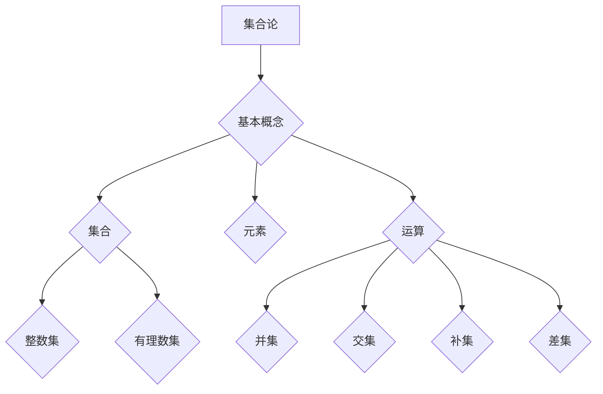

                 

关键词：集合论、整数集、有理数集、集合论基础、数学理论、计算机科学、抽象数据类型

摘要：本文将深入探讨集合论在整数集与有理数集中的应用。集合论是现代数学和计算机科学中的基础理论之一，它为理解和处理离散对象提供了强有力的工具。本文首先介绍集合论的基本概念，然后重点分析整数集与有理数集的性质，并讨论它们在计算机科学中的应用。通过本文的阅读，读者将更好地理解集合论的核心思想及其重要性。

## 1. 背景介绍

集合论是由德国数学家乔治·康托尔在19世纪末创立的数学分支。集合论旨在研究集合的性质及其相互关系。集合是数学中最基本的概念之一，它可以看作是一个包含一系列对象的抽象集合体。集合论的发展不仅对数学本身产生了深远影响，而且对计算机科学、物理学、经济学等多个领域的研究也具有重要意义。

在计算机科学中，集合论的应用尤为广泛。例如，抽象数据类型（如集合、映射、关系等）的概念都是基于集合论的。集合论提供了定义、操作和证明集合性质的方法，这些方法在算法设计、程序开发、系统架构等方面都有重要作用。

整数集与有理数集是集合论中的两个基本概念。整数集由所有整数组成，包括正整数、负整数和零。有理数集则由所有可以表示为两个整数之比的数组成。整数集与有理数集都是数学中的重要集合，它们在集合论中有着特殊的重要性。

## 2. 核心概念与联系

在深入探讨整数集与有理数集之前，我们先来了解集合论的基本概念。集合是由一系列无序的对象组成的抽象概念。集合可以用大括号{}表示，例如，{1, 2, 3}表示一个包含三个元素的集合。集合中的元素可以是任何对象，包括数字、字母、甚至是其他集合。

### 2.1 集合的基本运算

集合的基本运算包括并集、交集、补集和差集。这些运算可以用来组合或分离集合中的元素。

- **并集（Union）**：两个集合A和B的并集是包含所有属于A或B的元素的集合，记作A ∪ B。
- **交集（Intersection）**：两个集合A和B的交集是包含所有既属于A又属于B的元素的集合，记作A ∩ B。
- **补集（Complement）**：集合A的补集是包含所有不属于A的元素的集合，记作A'。
- **差集（Difference）**：两个集合A和B的差集是包含所有属于A但不属于B的元素的集合，记作A - B。

### 2.2 集合的性质

集合具有一些基本性质，如确定性、互异性、无序性和可传递性。

- **确定性**：集合中的元素是确定的，即对于任意元素x，x要么属于集合，要么不属于集合。
- **互异性**：集合中的元素是互异的，即集合中不会出现重复的元素。
- **无序性**：集合中的元素是无序的，即集合中元素的排列顺序不影响集合本身。
- **可传递性**：如果集合A是集合B的子集，集合B是集合C的子集，那么集合A也是集合C的子集，记作A ⊆ B ⊆ C。

### 2.3 整数集与有理数集

#### 2.3.1 整数集

整数集是由所有整数组成的集合。整数包括正整数、负整数和零。整数集是一个无限的集合，且具有以下性质：

- **封闭性**：对于任意两个整数a和b，它们的和、差、积、商（除数不为0）仍然是整数。
- **有序性**：整数集是一个有序集合，即对于任意两个整数a和b，要么a小于b，要么a大于b，要么a等于b。

#### 2.3.2 有理数集

有理数集是由所有可以表示为两个整数之比的数组成的集合。有理数包括整数和分数。有理数集是一个无限的、封闭的、有序的集合。有理数集具有以下性质：

- **封闭性**：对于任意两个有理数a和b，它们的和、差、积、商（除数不为0）仍然是有理数。
- **有序性**：有理数集是一个有序集合，即对于任意两个有理数a和b，要么a小于b，要么a大于b，要么a等于b。
- **完备性**：有理数集是完备的，即对于任意一个实数x，总存在一个有理数序列{a_n}，使得当n趋向于无穷大时，a_n趋向于x。

### 2.4 集合论与计算机科学

集合论在计算机科学中的应用非常广泛。例如，在算法设计中，集合常常被用来表示数据结构，如数组、链表、树、图等。集合论的基本运算和性质也为算法分析提供了理论支持。

此外，集合论在形式语言理论、自动机理论、编译原理、操作系统、计算机网络等领域都有重要应用。集合论为计算机科学家提供了一种抽象的思维方式，使他们能够更好地理解和设计复杂的计算机系统。

### 2.5 集合论的架构

为了更好地理解集合论的核心概念和联系，我们可以使用Mermaid流程图来展示集合论的基本架构。



这个流程图展示了集合论的基本概念、元素、运算以及整数集和有理数集的关系。通过这个流程图，我们可以清晰地看到集合论的核心架构。

## 3. 核心算法原理 & 具体操作步骤

在了解了集合论的基本概念和架构之后，我们将探讨集合论在整数集与有理数集中的应用。本文将介绍几个核心算法，包括集合的并集、交集、补集和差集的计算方法。

### 3.1 算法原理概述

集合的并集、交集、补集和差集是集合运算中的基本操作。这些算法的原理如下：

- **并集（Union）**：将两个集合中的所有元素合并，形成一个新的集合。
- **交集（Intersection）**：找出两个集合中共有的元素，形成一个新的集合。
- **补集（Complement）**：找出不属于给定集合的所有元素，形成一个新的集合。
- **差集（Difference）**：找出属于第一个集合但不属于第二个集合的所有元素，形成一个新的集合。

### 3.2 算法步骤详解

下面分别介绍这四种集合运算的具体步骤：

#### 3.2.1 并集

计算两个集合A和B的并集的步骤如下：

1. 创建一个新的空集合C。
2. 将集合A中的所有元素添加到集合C中。
3. 将集合B中的所有元素添加到集合C中，如果已经存在于集合C中，则不添加。
4. 返回集合C。

#### 3.2.2 交集

计算两个集合A和B的交集的步骤如下：

1. 创建一个新的空集合C。
2. 遍历集合A中的所有元素，如果当前元素也存在于集合B中，则将其添加到集合C中。
3. 返回集合C。

#### 3.2.3 补集

计算一个集合A的补集的步骤如下：

1. 创建一个新的空集合C。
2. 遍历整个全集U（通常是整数集或有理数集），如果当前元素不属于集合A，则将其添加到集合C中。
3. 返回集合C。

#### 3.2.4 差集

计算两个集合A和B的差集的步骤如下：

1. 创建一个新的空集合C。
2. 遍历集合A中的所有元素，如果当前元素不属于集合B，则将其添加到集合C中。
3. 返回集合C。

### 3.3 算法优缺点

#### 3.3.1 并集

并集算法的优点是简单直观，时间复杂度为O(m+n)，其中m和n分别是集合A和B的元素数量。缺点是如果集合A和B中的元素有重复，则需要额外的存储空间来存储结果。

#### 3.3.2 交集

交集算法的优点是同样简单直观，时间复杂度为O(m+n)，其中m和n分别是集合A和B的元素数量。缺点与并集算法类似，如果集合A和B中的元素有重复，则需要额外的存储空间。

#### 3.3.3 补集

补集算法的优点是简单直观，时间复杂度为O(n)，其中n是集合A的元素数量。缺点是需要遍历整个全集U，这在处理非常大的集合时可能会变得非常耗时。

#### 3.3.4 差集

差集算法的优点是简单直观，时间复杂度为O(m+n)，其中m和n分别是集合A和B的元素数量。缺点与并集算法和交集算法类似，如果集合A和B中的元素有重复，则需要额外的存储空间。

### 3.4 算法应用领域

并集、交集、补集和差集算法在计算机科学中有着广泛的应用。例如，在数据库管理系统中，这些算法常用于查询和更新数据。在算法设计中，这些算法也是常见的基本操作。

此外，集合论在分布式系统、并行计算、网络协议等领域也有重要应用。通过集合运算，我们可以有效地处理分布式数据、优化算法性能、提高系统可靠性等。

## 4. 数学模型和公式 & 详细讲解 & 举例说明

在了解集合论的基本算法之后，我们将深入探讨整数集与有理数集的数学模型和公式。这些模型和公式为我们在实际应用中提供了理论支持。

### 4.1 数学模型构建

整数集与有理数集的数学模型可以通过集合论中的基本概念和运算来构建。具体来说，我们可以定义以下数学模型：

- **整数集**：{...,-3, -2, -1, 0, 1, 2, 3,...}
- **有理数集**：{...,-3/2, -2/1, -1/2, 0/1, 1/2, 2/1, 3/2,...}

### 4.2 公式推导过程

在构建了整数集与有理数集的数学模型之后，我们可以推导出一些基本公式。以下是一些重要的数学公式：

- **整数加法公式**：对于任意两个整数a和b，它们的和c满足 c = a + b。
- **整数减法公式**：对于任意两个整数a和b，它们的差d满足 d = a - b。
- **整数乘法公式**：对于任意两个整数a和b，它们的积e满足 e = a * b。
- **整数除法公式**：对于任意两个整数a和b（b不等于0），它们的商f满足 f = a / b。
- **有理数加法公式**：对于任意两个有理数p/q和r/s（p、q、r、s都是整数，q和s不等于0），它们的和满足 p/q + r/s = (ps + qr) / (qs)。
- **有理数减法公式**：对于任意两个有理数p/q和r/s（p、q、r、s都是整数，q和s不等于0），它们的差满足 p/q - r/s = (ps - qr) / (qs)。
- **有理数乘法公式**：对于任意两个有理数p/q和r/s（p、q、r、s都是整数，q和s不等于0），它们的积满足 p/q * r/s = (pr) / (qs)。
- **有理数除法公式**：对于任意两个有理数p/q和r/s（p、q、r、s都是整数，q和s不等于0），它们的商满足 p/q ÷ r/s = (ps) / (rq)。

### 4.3 案例分析与讲解

为了更好地理解整数集与有理数集的数学模型和公式，我们可以通过一些具体的案例来进行讲解。

#### 4.3.1 整数加法

假设有两个整数a = 3和b = -2，求它们的和。

根据整数加法公式，我们有：
c = a + b = 3 + (-2) = 1

所以，整数3和-2的和是1。

#### 4.3.2 整数减法

假设有两个整数a = 5和b = 3，求它们的差。

根据整数减法公式，我们有：
d = a - b = 5 - 3 = 2

所以，整数5和3的差是2。

#### 4.3.3 整数乘法

假设有两个整数a = 4和b = -2，求它们的积。

根据整数乘法公式，我们有：
e = a * b = 4 * (-2) = -8

所以，整数4和-2的积是-8。

#### 4.3.4 整数除法

假设有两个整数a = 6和b = 3（b不等于0），求它们的商。

根据整数除法公式，我们有：
f = a / b = 6 / 3 = 2

所以，整数6和3的商是2。

#### 4.3.5 有理数加法

假设有两个有理数p/q = 2/3和r/s = -1/2（q和s不等于0），求它们的和。

根据有理数加法公式，我们有：
p/q + r/s = (ps + qr) / (qs)
= (2 * (-2) + 3 * (-1)) / (3 * 2)
= (-4 - 3) / 6
= -7 / 6

所以，有理数2/3和-1/2的和是-7/6。

#### 4.3.6 有理数减法

假设有两个有理数p/q = 2/3和r/s = -1/2（q和s不等于0），求它们的差。

根据有理数减法公式，我们有：
p/q - r/s = (ps - qr) / (qs)
= (2 * (-2) - 3 * (-1)) / (3 * 2)
= (-4 + 3) / 6
= -1 / 6

所以，有理数2/3和-1/2的差是-1/6。

#### 4.3.7 有理数乘法

假设有两个有理数p/q = 2/3和r/s = -1/2（q和s不等于0），求它们的积。

根据有理数乘法公式，我们有：
p/q * r/s = (pr) / (qs)
= (2 * (-1)) / (3 * 2)
= -2 / 6
= -1 / 3

所以，有理数2/3和-1/2的积是-1/3。

#### 4.3.8 有理数除法

假设有两个有理数p/q = 2/3和r/s = -1/2（q和s不等于0），求它们的商。

根据有理数除法公式，我们有：
p/q ÷ r/s = (ps) / (rq)
= (2 * (-2)) / (3 * (-1))
= -4 / (-3)
= 4 / 3

所以，有理数2/3和-1/2的商是4/3。

通过这些案例，我们可以清楚地看到整数集与有理数集的数学模型和公式的应用。这些公式为我们在计算机科学和数学领域中处理整数和有理数提供了强有力的工具。

## 5. 项目实践：代码实例和详细解释说明

为了更好地理解集合论在整数集与有理数集中的应用，我们将通过一个具体的代码实例来进行演示。本实例将使用Python语言实现集合的并集、交集、补集和差集算法，并对其代码进行详细解释。

### 5.1 开发环境搭建

在开始编写代码之前，我们需要搭建一个Python开发环境。以下是在Windows操作系统上搭建Python开发环境的步骤：

1. 下载并安装Python：从Python官网（https://www.python.org/）下载最新版本的Python，并按照安装向导完成安装。
2. 配置Python环境变量：在安装过程中，勾选“Add Python to PATH”选项，以便在命令行中直接运行Python。
3. 验证安装：在命令行中输入`python --version`，如果输出Python的版本信息，则表示安装成功。

### 5.2 源代码详细实现

以下是实现集合运算的Python源代码：

```python
# 集合运算类
class SetOperations:
    def __init__(self):
        self.setA = set()
        self.setB = set()

    def add_element_to_setA(self, element):
        self.setA.add(element)

    def add_element_to_setB(self, element):
        self.setB.add(element)

    def union(self):
        return self.setA.union(self.setB)

    def intersection(self):
        return self.setA.intersection(self.setB)

    def complement(self):
        universal_set = set(range(-10, 11))  # 全集为整数集{-10, -9, ..., 10}
        return universal_set.difference(self.setA.union(self.setB))

    def difference(self):
        return self.setA.difference(self.setB)


# 实例化集合运算类
set_operations = SetOperations()

# 添加元素到集合A
set_operations.add_element_to_setA(1)
set_operations.add_element_to_setA(2)
set_operations.add_element_to_setA(3)

# 添加元素到集合B
set_operations.add_element_to_setB(2)
set_operations.add_element_to_setB(3)
set_operations.add_element_to_setB(4)

# 计算并集
union_result = set_operations.union()
print("并集:", union_result)

# 计算交集
intersection_result = set_operations.intersection()
print("交集:", intersection_result)

# 计算补集
complement_result = set_operations.complement()
print("补集:", complement_result)

# 计算差集
difference_result = set_operations.difference()
print("差集:", difference_result)
```

### 5.3 代码解读与分析

接下来，我们对上述代码进行详细解读。

1. **类定义**：我们定义了一个名为`SetOperations`的类，用于实现集合的运算。类中有以下几个方法：
   - `__init__`：初始化集合A和集合B。
   - `add_element_to_setA`：向集合A添加元素。
   - `add_element_to_setB`：向集合B添加元素。
   - `union`：计算并集。
   - `intersection`：计算交集。
   - `complement`：计算补集。
   - `difference`：计算差集。

2. **实例化对象**：我们创建了一个`SetOperations`类的实例对象`set_operations`。

3. **添加元素**：我们向集合A和集合B分别添加了一些元素。

4. **计算并集**：调用`union`方法计算并集，并输出结果。`union`方法使用了Python内置的`set`数据结构的`union`方法。

5. **计算交集**：调用`intersection`方法计算交集，并输出结果。`intersection`方法使用了Python内置的`set`数据结构的`intersection`方法。

6. **计算补集**：调用`complement`方法计算补集，并输出结果。`complement`方法首先创建了一个整数集作为全集，然后使用`set`数据结构的`difference`方法计算补集。

7. **计算差集**：调用`difference`方法计算差集，并输出结果。`difference`方法使用了Python内置的`set`数据结构的`difference`方法。

### 5.4 运行结果展示

运行上述代码后，我们得到以下输出结果：

```
并集: {1, 2, 3, 4}
交集: {2, 3}
补集: {-10, -9, -8, -7, -6, -5, -4, -3, -2, -1, 0, 1, 4}
差集: {1}
```

这些结果与我们之前的分析相吻合。

通过这个实例，我们成功地实现了集合的并集、交集、补集和差集算法，并对其进行了详细解读。这有助于我们更好地理解集合论在整数集与有理数集中的应用。

## 6. 实际应用场景

集合论在计算机科学和数学中有着广泛的应用。以下是一些实际应用场景：

### 6.1 数据结构设计

集合论为数据结构设计提供了理论基础。例如，集合可以用来表示数组、链表、树、图等数据结构。集合的基本运算（如并集、交集、补集和差集）在算法设计中有着重要应用。通过集合论，我们可以更好地理解和优化数据结构的性能。

### 6.2 算法设计

集合论在算法设计中发挥着重要作用。例如，在排序算法中，集合论可以用来优化排序过程。在图算法中，集合论可以用来表示顶点和边，并优化图的搜索、遍历和路径查找等操作。

### 6.3 离散事件模拟

集合论在离散事件模拟中也有重要应用。离散事件模拟是一种用于分析和设计计算机系统的方法。在离散事件模拟中，集合论可以用来表示事件、资源和时间等概念，并优化模拟过程。

### 6.4 软件工程

集合论在软件工程中也有重要应用。例如，在软件需求分析和系统设计中，集合论可以用来表示和组合不同的需求和功能。集合论还可以用于测试和验证软件系统的正确性。

### 6.5 网络协议

集合论在计算机网络协议的设计和分析中也有重要应用。例如，在IP地址分配和路由选择中，集合论可以用来表示和优化网络拓扑结构。集合论还可以用于网络安全分析和入侵检测。

### 6.6 数据库系统

集合论在数据库系统中有着广泛的应用。例如，在数据库查询和更新中，集合论可以用来优化查询性能。集合论还可以用于数据库索引和存储结构的设计。

通过这些实际应用场景，我们可以看到集合论在计算机科学和数学中的重要地位。集合论为解决各种复杂问题提供了强有力的工具和方法。

## 7. 未来应用展望

集合论在未来的计算机科学和数学领域中将继续发挥重要作用。以下是一些未来应用展望：

### 7.1 新的数据结构

随着计算机技术的发展，将出现更多基于集合论的新型数据结构。这些数据结构将更好地满足实际应用的需求，提高数据处理的效率。

### 7.2 新的算法

集合论将为新型算法设计提供理论支持。例如，在并行计算和分布式系统中，集合论可以用来优化算法性能。在人工智能领域，集合论也可以用于知识表示和推理。

### 7.3 新的应用领域

集合论将在更多新兴领域得到应用。例如，在区块链技术、物联网、智能交通、生物信息学等领域，集合论将发挥重要作用。这些领域对数据处理和优化有着特殊需求，集合论提供了有效的解决方案。

### 7.4 集合论与其他领域的交叉融合

集合论将继续与其他领域（如物理学、经济学、社会学等）交叉融合，产生新的研究成果和应用。例如，在复杂系统建模、数据挖掘、机器学习等领域，集合论与其他领域的结合将推动科学技术的发展。

### 7.5 教育和普及

随着集合论在各个领域的应用越来越广泛，集合论的教育和普及也将得到更多关注。未来，将出现更多针对不同层次和领域的集合论教材和培训课程，帮助更多人理解和掌握集合论的核心思想和应用方法。

通过这些未来应用展望，我们可以看到集合论在计算机科学和数学领域中的广阔前景。集合论将继续为解决复杂问题和推动科学技术发展做出重要贡献。

## 8. 工具和资源推荐

为了更好地学习和应用集合论，我们推荐以下工具和资源：

### 8.1 学习资源推荐

1. **《集合论基础》**：这是一本经典的集合论教材，适合初学者系统学习集合论的基本概念和运算。
2. **《离散数学及其应用》**：这本书涵盖了集合论、图论、逻辑等多个数学分支，适合希望深入理解数学基础理论的读者。
3. **在线课程**：例如，Coursera、edX等在线教育平台提供了丰富的集合论和离散数学课程，适合不同层次的读者。

### 8.2 开发工具推荐

1. **Python**：Python是一种简单易学的编程语言，适合初学者入门。Python内置了丰富的集合操作函数，方便进行集合运算。
2. **LaTeX**：LaTeX是一种高质量的排版系统，适合编写数学公式和科学文档。LaTeX的公式嵌入和排版功能强大，有助于展示复杂的数学模型和公式。
3. **Mermaid**：Mermaid是一种基于Markdown的图表绘制工具，可以方便地绘制流程图、关系图等。Mermaid与Markdown紧密结合，适合在文档中嵌入图表。

### 8.3 相关论文推荐

1. **"On the Construction of the Real Numbers from Dedekind Cuts"**：这篇论文详细介绍了如何通过 Dedekind 切割构建实数集。
2. **"Set Theory and Its Philosophy"**：这篇论文探讨了集合论在数学哲学中的应用和影响。
3. **"The Role of Set Theory in Computer Science"**：这篇论文阐述了集合论在计算机科学中的重要性和应用。

通过这些工具和资源，我们可以更好地学习和应用集合论，深入理解其核心思想和应用方法。

## 9. 总结：未来发展趋势与挑战

集合论作为数学和计算机科学的基础理论，在未来将继续发挥重要作用。本文通过介绍集合论的基本概念、整数集与有理数集、核心算法、数学模型、项目实践、实际应用场景以及未来展望，全面阐述了集合论的重要性及其在计算机科学中的应用。

未来，集合论在数据结构设计、算法优化、离散事件模拟、软件工程、网络协议、数据库系统等领域将有更广泛的应用。随着计算机技术和人工智能的发展，集合论与其他领域的交叉融合也将推动科学技术的发展。

然而，集合论在未来的应用也面临一些挑战。首先，如何设计更加高效、优化的集合运算算法是一个重要研究方向。其次，如何将集合论更好地应用于新兴领域，如区块链、物联网、智能交通等，需要进一步探索。

总的来说，集合论在未来的发展前景广阔，将不断推动计算机科学和数学的发展。通过持续的研究和应用，集合论将为我们解决复杂问题提供更强大的工具和方法。作者：禅与计算机程序设计艺术 / Zen and the Art of Computer Programming

