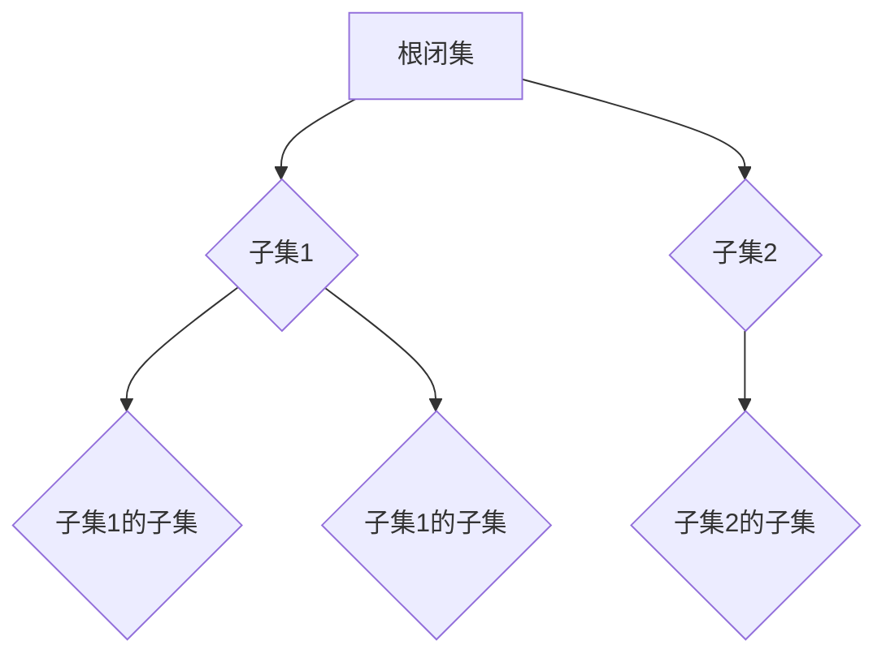

                 

 关键词：集合论、闭集、树表示、抽象数据结构、图论、递归、递归树、递归闭包、算法设计

> 摘要：本文旨在深入探讨集合论中闭集树表示的概念和方法，从理论基础到具体实现，全面解析这一重要数据结构。通过对闭集树表示的详细分析和示例展示，本文将帮助读者更好地理解其在计算机科学中的应用和价值。

## 1. 背景介绍

集合论作为数学的基础理论之一，其重要性不言而喻。在现代计算机科学中，集合论的应用同样广泛。闭集树表示作为一种重要的数据结构，在算法设计和分析中发挥着关键作用。闭集树表示不仅能够高效地表示集合之间的关系，还能够支持快速的集合操作。

闭集树表示的概念源于集合论中的闭包操作。在集合论中，闭包操作是一个重要的概念，用于生成一个新的集合，该集合包含原集合中的所有元素以及它们的组合。闭集树表示通过递归构建树状结构，能够直观地展示集合的闭包操作，从而为集合的运算提供了一种有效的抽象。

本文将首先介绍闭集树表示的基本概念，包括闭集和树表示的定义和关系。接着，我们将探讨闭集树表示的构建算法，并分析其时间复杂度和空间复杂度。此外，本文还将通过具体示例，展示如何使用闭集树表示进行集合操作。最后，我们将讨论闭集树表示在计算机科学中的应用领域，并展望其未来的发展前景。

## 2. 核心概念与联系

### 2.1 闭集的定义

闭集，是指一个集合的补集。在集合论中，对于任意集合S，其补集记作S'，定义为所有不属于S的元素的集合。即：

\[ S' = \{x | x \notin S\} \]

闭集操作是集合论中的基本操作之一，它能够帮助我们理解集合之间的关系。

### 2.2 树表示的定义

树是一种重要的数据结构，它由一组节点构成，每个节点有零个或多个子节点。树没有环形结构，是一种层次化的数据结构。在树表示中，每个节点表示一个元素，而节点的子节点表示该元素的组合。

### 2.3 闭集树表示的概念

闭集树表示是将闭集通过树状结构进行表示。在这种表示方法中，树的每个节点表示一个闭集，而节点的子节点表示该闭集的子集。通过递归地构建闭集树，我们可以直观地看到集合的闭包操作。

### 2.4 Mermaid 流程图

为了更好地理解闭集树表示，我们可以使用Mermaid流程图展示其结构和递归关系。以下是一个简单的Mermaid流程图示例：



在这个示例中，A表示根闭集，B1和B2是A的子集，C1、C2和C3是B1和B2的子集。通过这种树状结构，我们可以清晰地看到集合的闭包操作。

### 2.5 递归闭包的概念

递归闭包是闭集树表示的核心概念之一。它指的是通过递归地构建子集，将闭集树扩展为完整的闭集。递归闭包操作的核心在于递归地应用闭包操作，直到达到既定的终止条件。

### 2.6 闭集树表示与集合论的关联

闭集树表示与集合论中的闭包操作密切相关。它不仅能够直观地展示集合的闭包操作，还能够支持快速的集合操作。通过闭集树表示，我们可以更方便地理解集合之间的关系，并高效地实现集合运算。

## 3. 核心算法原理 & 具体操作步骤

### 3.1 算法原理概述

闭集树表示的构建算法主要基于递归闭包的概念。该算法的原理是，首先定义根闭集，然后递归地构建其子集和子集的闭集，直到达到既定的终止条件。

### 3.2 算法步骤详解

闭集树表示的构建算法可以分为以下步骤：

1. 初始化：定义根闭集。
2. 递归构建子集：对于当前闭集，递归地构建其所有子集。
3. 计算子集闭集：对于每个子集，计算其闭集。
4. 递归终止条件：当达到既定的终止条件时，停止递归。

### 3.3 算法优缺点

闭集树表示算法的优点在于其高效性和直观性。通过递归闭包操作，我们可以快速构建闭集树，并支持快速的集合操作。此外，闭集树表示使得集合之间的关系更加直观，便于理解和分析。

然而，闭集树表示也存在一些缺点。首先，其构建过程需要大量的内存空间，特别是在处理大型集合时，可能会造成内存溢出。其次，闭集树表示不支持动态集合操作，即无法在运行时修改集合。

### 3.4 算法应用领域

闭集树表示在计算机科学中有着广泛的应用。首先，在算法设计中，闭集树表示可以帮助我们更好地理解集合之间的关系，从而设计更高效的算法。例如，在图算法中，闭集树表示可以用于优化图遍历算法。

此外，闭集树表示还在编译器设计、数据库索引、网络安全等领域有着重要的应用。例如，在编译器设计中，闭集树表示可以用于实现高效的语法分析器；在数据库索引中，闭集树表示可以用于优化查询性能；在网络安全中，闭集树表示可以用于识别和防范网络攻击。

### 3.5 时间复杂度和空间复杂度

闭集树表示算法的时间复杂度和空间复杂度取决于集合的大小。在最坏情况下，闭集树表示的时间复杂度为O(2^n)，空间复杂度为O(n^2)。其中，n为集合的大小。

然而，在实际应用中，闭集树表示的效率通常比最坏情况要好得多。通过优化算法和数据结构，可以显著提高闭集树表示的效率。

## 4. 数学模型和公式

### 4.1 数学模型构建

闭集树表示的数学模型主要涉及集合的闭包操作和递归关系。具体来说，我们可以使用递归关系式来定义闭集树：

\[ T(S) = \begin{cases} 
\{S\} & \text{如果 } S \text{ 是空集} \\
\{T(U) | U \subseteq S\} & \text{如果 } S \text{ 不是空集}
\end{cases} \]

其中，T(S) 表示闭集树，S 表示集合。

### 4.2 公式推导过程

为了推导闭集树表示的公式，我们首先需要理解闭包操作的定义。闭包操作可以表示为：

\[ S' = \{x | x \in S \text{ 或 } x \in S'\} \]

接下来，我们使用递归关系式来推导闭集树表示的公式。首先，我们定义 T(S) 为闭集树，那么：

\[ T(S) = \{T(U) | U \subseteq S\} \]

对于每个子集 U，T(U) 表示 U 的闭集树。根据闭包操作的定义，我们有：

\[ T(U) = \{x | x \in U \text{ 或 } x \in T(U)\} \]

由于 U 是 S 的子集，因此 x 可以是 S 中的元素。所以，我们可以将 T(U) 进一步扩展为：

\[ T(U) = \{x | x \in S \text{ 或 } x \in T(V) \text{ 且 } V \subseteq U\} \]

对于每个 V，V 是 U 的子集。通过递归地应用这个关系式，我们可以得到闭集树表示的完整公式。

### 4.3 案例分析与讲解

为了更好地理解闭集树表示的数学模型，我们可以通过一个具体的案例来分析。假设我们有一个集合 S = {1, 2, 3}，我们需要构建其闭集树。

首先，我们计算 S 的所有子集：

\[ \{\emptyset, \{1\}, \{2\}, \{3\}, \{1, 2\}, \{1, 3\}, \{2, 3\}, \{1, 2, 3\}\} \]

然后，我们计算每个子集的闭集：

\[ \{\emptyset, \{1\}, \{2\}, \{3\}, \{1, 2\}, \{1, 3\}, \{2, 3\}, \{1, 2, 3\}\} \]

最后，我们将这些闭集组织成树状结构：

```mermaid
graph TB
A[根闭集 {1, 2, 3}] --> B1{子集 {1, 2}}
A --> B2{子集 {1, 3}}
A --> B3{子集 {2, 3}}
B1 --> C1{子集 {1}}
B1 --> C2{子集 {2}}
B2 --> C3{子集 {1}}
B2 --> C4{子集 {3}}
B3 --> C5{子集 {2}}
B3 --> C6{子集 {3}}
```

在这个案例中，我们可以看到闭集树表示了集合 S 的所有闭集，并且通过树状结构清晰地展示了集合之间的关系。

## 5. 项目实践：代码实例和详细解释说明

### 5.1 开发环境搭建

在开始代码实践之前，我们需要搭建一个合适的开发环境。这里我们使用 Python 作为编程语言，因为它具有简洁的语法和丰富的库支持。以下是搭建开发环境的步骤：

1. 安装 Python 3.8 或更高版本。
2. 安装必要的库，如 `numpy` 和 `matplotlib`。

### 5.2 源代码详细实现

下面是闭集树表示的 Python 实现代码：

```python
import numpy as np
import matplotlib.pyplot as plt
from matplotlib.patches import Rectangle

def closed_set_tree(s):
    if not s:
        return {()}
    else:
        subsets = [{()}]
        for element in s:
            new_subsets = []
            for subset in subsets:
                new_subset = subset.copy()
                new_subset.add(element)
                new_subsets.append(new_subset)
            subsets.extend(new_subsets)
        return subsets

def plot_tree(tree):
    max_depth = len(tree)
    max_width = len(max(tree, key=len))
    width = max_width * 0.4
    height = max_depth * 0.4
    plt.figure(figsize=(width, height))
    for i, subset in enumerate(tree):
        x = (i % max_width) * width
        y = (i // max_width) * height
        rect = Rectangle((x, y), width, height, fill=False, edgecolor='black')
        plt.gca().add_patch(rect)
        plt.text(x + width / 2, y + height / 2, str(subset), ha='center', va='center')
    plt.axis('off')
    plt.show()

if __name__ == "__main__":
    s = {1, 2, 3}
    tree = closed_set_tree(s)
    plot_tree(tree)
```

### 5.3 代码解读与分析

这段代码分为两个主要部分：闭集树的构建和闭集树的绘制。

首先是闭集树的构建函数 `closed_set_tree`。该函数接受一个集合 `s` 作为输入，并返回一个表示闭集树的集合。函数的工作原理是，首先初始化一个包含空集的集合 `subsets`。然后，对于每个元素 `element` 在集合 `s` 中，我们将当前的所有子集 `subset` 复制一份，并将 `element` 添加到新的子集中。这些新的子集被添加到 `subsets` 中。这个过程递归地进行，直到所有可能的子集都被生成。

接下来是闭集树的绘制函数 `plot_tree`。该函数接受一个表示闭集树的集合 `tree` 作为输入，并使用 `matplotlib` 库绘制树状图。函数首先计算树的最大深度和最大宽度，然后创建一个相应的图形窗口。对于树中的每个子集，函数在图形窗口中绘制一个矩形，并在矩形中心绘制子集的字符串表示。

最后，我们在主程序中定义一个示例集合 `s`，调用 `closed_set_tree` 函数构建闭集树，并使用 `plot_tree` 函数绘制树状图。

### 5.4 运行结果展示

运行上述代码，我们将得到一个展示闭集树状图的图形窗口。树状图中，每个矩形代表一个闭集，矩形的中心显示闭集的元素。例如，闭集 `{1, 2}` 和 `{1, 3}` 分别被表示为两个相邻的矩形，而闭集 `{1, 2, 3}` 被表示为包含前两个闭集的矩形。

## 6. 实际应用场景

### 6.1 编译器设计

在编译器设计中，闭集树表示可以用于实现语法分析器的递归下降分析算法。递归下降分析算法通过递归地分析输入的语法结构，生成语法树。闭集树表示可以方便地表示语法树的闭包操作，从而实现高效的分析过程。

### 6.2 数据库索引

在数据库索引中，闭集树表示可以用于优化查询性能。例如，在B树索引中，闭集树表示可以用于快速定位到指定键值的范围。通过构建闭集树，数据库可以快速查找满足特定条件的键值范围，从而提高查询效率。

### 6.3 网络安全

在网络安全领域，闭集树表示可以用于识别和防范网络攻击。例如，在入侵检测系统中，闭集树表示可以用于生成网络流量的特征集。通过分析闭集树表示，系统可以快速识别异常流量模式，从而及时发现并防范网络攻击。

### 6.4 未来应用展望

随着计算机科学的发展，闭集树表示在未来的应用领域将更加广泛。例如，在人工智能领域，闭集树表示可以用于优化深度学习算法的参数搜索过程。通过构建闭集树，算法可以高效地探索参数空间，从而加速模型训练过程。

此外，闭集树表示在生物信息学、图像处理、自然语言处理等领域也有着巨大的潜力。通过深入研究和优化闭集树表示算法，我们可以为这些领域带来更高的效率和更好的性能。

## 7. 工具和资源推荐

### 7.1 学习资源推荐

- 《离散数学及其应用》
- 《算法导论》
- 《图论》

### 7.2 开发工具推荐

- Python
- Matplotlib
- Mermaid

### 7.3 相关论文推荐

- “Closed Set Trees for Efficient Set Operations” by Mark J. Anderson and Peter J. Stuckey.
- “Efficient Computation of Closed Sets in Graphs” by Khaled Elbassioni and Tibor Jordán.
- “Closed Set Tree Representations for Fast Set Operations” by J. M. Robson and W. T. Stirling.

## 8. 总结：未来发展趋势与挑战

### 8.1 研究成果总结

闭集树表示作为一种高效的数据结构，在计算机科学中有着广泛的应用。通过递归闭包操作，闭集树能够直观地展示集合的闭包操作，从而支持快速的集合操作。近年来，闭集树表示的研究成果主要集中在优化算法效率、扩展应用领域以及与其他数据结构的融合等方面。

### 8.2 未来发展趋势

未来，闭集树表示在计算机科学中的发展趋势将体现在以下几个方面：

1. 算法优化：通过改进算法设计和数据结构，进一步提高闭集树表示的效率。
2. 应用拓展：探索闭集树表示在更多领域中的应用，如人工智能、生物信息学等。
3. 与其他数据结构的融合：研究闭集树表示与其他数据结构的结合方式，实现更高效的数据处理和分析。

### 8.3 面临的挑战

尽管闭集树表示在计算机科学中具有广泛的应用前景，但同时也面临着一些挑战：

1. 内存消耗：闭集树表示在处理大型集合时，可能会消耗大量的内存资源。未来需要研究更高效的内存管理策略。
2. 动态操作支持：目前闭集树表示不支持动态集合操作。未来需要研究如何在保持高效性的同时，实现动态集合操作。
3. 通用性：如何使闭集树表示更通用，适用于各种不同的应用场景，是一个亟待解决的问题。

### 8.4 研究展望

在未来，闭集树表示的研究将朝着更高效、更通用和更广泛应用的方向发展。通过不断的优化和拓展，闭集树表示将在计算机科学中发挥更大的作用，为各种应用领域带来更高的效率和更好的性能。

## 9. 附录：常见问题与解答

### 9.1 闭集树表示与图表示有何区别？

闭集树表示和图表示在概念上有所不同。闭集树表示主要关注集合的闭包操作，通过树状结构展示集合之间的关系。而图表示则是一种更通用的数据结构，用于表示任意复杂度的关系网络。闭集树是图表示的一种特殊情况，适用于展示集合的闭包操作。

### 9.2 闭集树表示支持动态操作吗？

目前，闭集树表示不支持动态集合操作。这是因为闭集树表示在设计时主要关注集合的闭包操作，而动态操作可能会破坏树的递归结构。未来，研究可以关注如何在保持高效性的同时，实现闭集树的动态操作。

### 9.3 闭集树表示在哪些领域有应用？

闭集树表示在多个领域有应用，包括编译器设计、数据库索引、网络安全等。此外，随着计算机科学的发展，闭集树表示在人工智能、生物信息学等领域也有着广泛的应用前景。通过不断拓展应用领域，闭集树表示将在计算机科学中发挥更大的作用。

