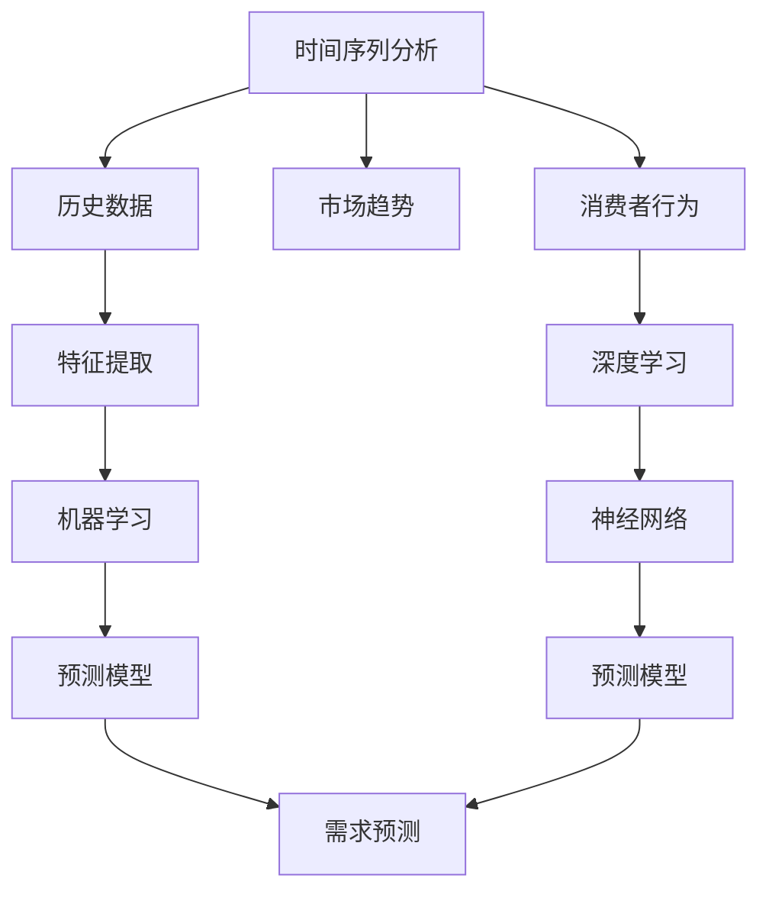

                 

### 1. 背景介绍

在现代商业环境中，库存管理是企业运营的核心之一。它直接影响到企业的资金流动、成本控制以及客户满意度。然而，库存管理的挑战在于准确预测未来的需求，从而避免过度库存或缺货的情况。传统的库存管理方法往往依赖于历史数据和简单的统计模型，但这些方法无法应对市场变化、消费者行为的复杂性和多样性。因此，需求预测成为库存管理的关键环节。

需求预测不仅关乎库存水平，还对供应链的每个环节产生影响。从原材料采购到生产计划、仓储管理再到销售预测，每一步都需要基于准确的需求预测来优化。然而，现实中的需求预测面临着诸多难题：数据不完整、噪声数据、季节性变化、市场波动以及新兴技术的冲击。这些因素使得传统的需求预测方法难以满足现代企业的需求。

随着人工智能和机器学习技术的快速发展，新的需求预测方法应运而生。这些方法利用大量数据、深度学习和神经网络等技术，能够更准确地预测未来需求。本篇文章将深入探讨需求预测的核心概念、算法原理、数学模型以及实际应用，帮助读者了解如何利用先进技术优化库存管理。

### 2. 核心概念与联系

在深入探讨需求预测之前，我们需要明确几个核心概念，并理解它们之间的联系。这些概念包括需求预测、时间序列分析、机器学习和深度学习。

**需求预测（Demand Forecasting）**：需求预测是通过对历史数据的分析，结合市场趋势、季节性因素、竞争环境和消费者行为等变量，对未来某一时间段内的需求量进行预测。需求预测是库存管理的基础，直接影响库存水平和供应链的稳定性。

**时间序列分析（Time Series Analysis）**：时间序列分析是统计学中的一个分支，用于分析时间序列数据，识别数据中的趋势、季节性和周期性等特征。时间序列分析为需求预测提供了基础工具，帮助我们从历史数据中提取有用的信息。

**机器学习（Machine Learning）**：机器学习是一种通过数据学习规律并做出预测的技术。机器学习算法能够自动从大量数据中学习模式，并利用这些模式进行需求预测。常见的机器学习算法包括线性回归、决策树、支持向量机等。

**深度学习（Deep Learning）**：深度学习是机器学习的一个分支，通过构建深度神经网络模型来学习数据中的复杂结构。深度学习在图像识别、自然语言处理等领域取得了显著的成果，并在需求预测中也被广泛应用。

这三个概念之间的联系在于：时间序列分析提供了分析数据的方法，机器学习和深度学习则利用这些方法从数据中提取信息并做出预测。具体来说，时间序列分析方法可以帮助我们识别数据中的趋势和周期性，而机器学习和深度学习算法则基于这些特征构建预测模型。

为了更好地理解这些概念，我们可以使用Mermaid流程图来展示它们之间的关系：



在这个流程图中，时间序列分析提供了历史数据，这些数据经过特征提取后，输入到机器学习和深度学习算法中。机器学习和深度学习算法利用这些特征构建预测模型，最终实现需求预测。同时，市场趋势、季节性因素和消费者行为等外部因素也在这一过程中起到关键作用。

通过理解这些核心概念及其联系，我们可以为接下来的需求预测方法探讨打下坚实的基础。

### 3. 核心算法原理 & 具体操作步骤

#### 3.1 算法原理概述

在现代需求预测中，机器学习和深度学习算法因其强大的数据处理和模式识别能力，成为重要的工具。以下将介绍几种常用的需求预测算法，包括线性回归、决策树和支持向量机等。

**线性回归（Linear Regression）**

线性回归是最简单且应用广泛的预测算法之一。它的基本原理是建立需求量与自变量（如时间、价格、促销等）之间的线性关系。线性回归模型可以表示为：

$$ Y = \beta_0 + \beta_1 X + \epsilon $$

其中，$Y$是需求量，$X$是自变量，$\beta_0$和$\beta_1$是模型的参数，$\epsilon$是误差项。

线性回归模型通过最小化残差平方和来估计参数，即：

$$ \min \sum_{i=1}^n (Y_i - \beta_0 - \beta_1 X_i)^2 $$

线性回归算法简单、易于实现，但在面对非线性关系和异常值时表现不佳。

**决策树（Decision Tree）**

决策树是一种树形结构的预测模型，通过一系列条件分支来对数据进行分类或回归。决策树的每个节点表示一个特征，每个分支表示该特征的不同取值。最终，决策树会到达一个叶节点，叶节点上的值即为预测结果。

决策树的核心是递归划分数据集，选择最优的特征和分割点，使得每个子集的纯度最高。纯度通常通过信息增益（Information Gain）或基尼不纯度（Gini Impurity）来衡量。

$$ Gini(I) = 1 - \sum_{i=1}^n p_i (1 - p_i) $$

其中，$p_i$是类别$i$在数据集中出现的概率。

**支持向量机（Support Vector Machine，SVM）**

支持向量机是一种通过构建高维空间中的最优分割超平面来进行分类或回归的模型。SVM的核心思想是寻找一个超平面，使得正负样本之间的间隔最大。

在需求预测中，SVM通过核函数（Kernel Function）将数据映射到高维空间，从而实现非线性分割。常见的核函数包括线性核、多项式核和径向基函数（RBF）核。

$$ \text{kernel}(x_i, x_j) = \sum_{k=1}^d \alpha_k y_k (x_i^k x_j^k + 1) $$

其中，$x_i$和$x_j$是数据点，$\alpha_k$和$y_k$是模型的参数。

#### 3.2 算法步骤详解

**线性回归**

1. 数据收集与预处理：收集历史需求数据和相关特征，进行数据清洗和标准化处理。
2. 特征选择：通过相关性分析和模型选择方法（如逐步回归），选择对需求预测影响较大的特征。
3. 模型训练：使用最小二乘法或梯度下降法，训练线性回归模型，估计参数$\beta_0$和$\beta_1$。
4. 模型评估：使用交叉验证或测试集评估模型性能，调整参数以优化预测效果。

**决策树**

1. 数据预处理：与线性回归类似，对数据进行清洗和标准化处理。
2. 特征选择：根据信息增益或基尼不纯度选择最优特征。
3. 划分数据集：将数据集划分为训练集和验证集，用于模型训练和性能评估。
4. 构建决策树：递归划分数据集，构建决策树模型。
5. 模型评估：使用验证集评估决策树模型的预测性能，必要时进行剪枝和优化。

**支持向量机**

1. 数据预处理：与之前的方法类似，对数据进行清洗和标准化处理。
2. 特征选择：根据特征的重要性进行选择，或使用核函数直接处理高维数据。
3. 模型训练：使用支持向量机算法，训练分类或回归模型。
4. 模型评估：使用交叉验证方法评估模型性能，调整参数以优化结果。

#### 3.3 算法优缺点

**线性回归**

- **优点**：简单易用，适用于线性关系较强的数据集。
- **缺点**：在处理非线性数据和异常值时效果不佳。

**决策树**

- **优点**：易于理解和解释，适用于分类和回归问题。
- **缺点**：容易过拟合，且模型复杂度较高。

**支持向量机**

- **优点**：在处理高维数据和非线性问题时表现优秀。
- **缺点**：计算复杂度较高，参数调优较困难。

#### 3.4 算法应用领域

**线性回归**：适用于需求预测中的线性关系分析，如短期销售预测、价格预测等。

**决策树**：适用于业务逻辑较为简单、需要直观解释的场景，如库存分类、季节性需求预测等。

**支持向量机**：适用于复杂、高维的需求预测问题，如市场需求分析、库存优化等。

通过以上算法的介绍，我们可以看到不同的需求预测算法在原理和应用上各有特色。在实际应用中，可以根据具体问题和数据特点选择合适的算法，以达到最优的预测效果。

### 4. 数学模型和公式 & 详细讲解 & 举例说明

在需求预测中，数学模型和公式是核心组成部分，它们帮助我们理解和量化需求预测的复杂性。以下将详细讲解需求预测中的常见数学模型和公式，并通过具体例子进行说明。

#### 4.1 数学模型构建

需求预测的数学模型通常基于时间序列分析，其中最常用的模型是ARIMA（自回归积分滑动平均模型）。ARIMA模型由三个部分组成：自回归（AR）、差分（I）和移动平均（MA）。其一般形式可以表示为：

$$ \Delta X_t = c + \phi_1 \Delta X_{t-1} + \phi_2 \Delta X_{t-2} + ... + \phi_p \Delta X_{t-p} + \theta_1 e_{t-1} + \theta_2 e_{t-2} + ... + \theta_q e_{t-q} $$

其中，$X_t$是时间序列的原始值，$\Delta X_t$是差分后的值，$e_t$是白噪声序列，$\phi_i$和$\theta_i$是模型参数。

**自回归（AR）部分**：

$$ \Delta X_t = \phi_1 \Delta X_{t-1} + \phi_2 \Delta X_{t-2} + ... + \phi_p \Delta X_{t-p} $$

自回归部分描述了当前值与过去值的线性关系，$\phi_i$是自回归系数，反映了历史数据的持续性。

**差分（I）部分**：

$$ \Delta X_t = X_t - X_{t-1} $$

差分部分用于消除时间序列的周期性和趋势性，使其平稳。

**移动平均（MA）部分**：

$$ \Delta X_t = \theta_1 e_{t-1} + \theta_2 e_{t-2} + ... + \theta_q e_{t-q} $$

移动平均部分描述了当前值与过去误差的线性关系，$\theta_i$是移动平均系数，反映了当前值对未来值的影响。

#### 4.2 公式推导过程

为了更好地理解ARIMA模型，我们将简要介绍其参数估计过程。

**自回归系数（$\phi_i$）的估计**：

自回归系数可以通过最小化残差平方和来估计。假设我们有一个训练集$T$，残差平方和为：

$$ S(\phi) = \sum_{t=1}^T (X_t - \phi_1 X_{t-1} - \phi_2 X_{t-2} - ... - \phi_p X_{t-p})^2 $$

为了最小化$S(\phi)$，我们对$\phi_i$求导并令其等于零：

$$ \frac{\partial S(\phi)}{\partial \phi_i} = -2 \sum_{t=1}^T (X_t - \phi_1 X_{t-1} - \phi_2 X_{t-2} - ... - \phi_p X_{t-p}) X_{t-p+i} = 0 $$

通过计算，我们可以得到自回归系数的估计值。

**移动平均系数（$\theta_i$）的估计**：

移动平均系数的估计与自回归系数类似，通过最小化残差平方和来估计。假设我们有误差序列$e_t$，残差平方和为：

$$ S(\theta) = \sum_{t=1}^T (X_t - \theta_1 e_{t-1} - \theta_2 e_{t-2} - ... - \theta_q e_{t-q})^2 $$

同样，我们对$\theta_i$求导并令其等于零：

$$ \frac{\partial S(\theta)}{\partial \theta_i} = -2 \sum_{t=1}^T (X_t - \theta_1 e_{t-1} - \theta_2 e_{t-2} - ... - \theta_q e_{t-q}) e_{t-q+i} = 0 $$

通过计算，我们可以得到移动平均系数的估计值。

#### 4.3 案例分析与讲解

为了更好地理解ARIMA模型，我们通过一个具体例子进行讲解。

**案例：超市销售数据预测**

假设我们有一个超市的销售数据，记录了过去30天的销售量。我们需要使用ARIMA模型预测未来5天的销售量。

**步骤1：数据预处理**

首先，我们对销售数据进行差分处理，使其平稳。使用差分公式：

$$ \Delta X_t = X_t - X_{t-1} $$

对数据进行差分处理，得到新的序列。

**步骤2：模型识别**

接下来，我们需要确定ARIMA模型的参数$p$（自回归阶数）、$d$（差分阶数）和$q$（移动平均阶数）。这通常通过ACF（自相关函数）和PACF（偏自相关函数）图来完成。

**步骤3：模型估计**

根据识别出的模型参数，使用最小二乘法或最大似然估计法估计模型参数$\phi_i$和$\theta_i$。

**步骤4：模型验证**

使用训练集的数据验证模型性能，确保模型具有良好的预测效果。

**步骤5：预测**

使用训练好的模型，预测未来5天的销售量。

**结果**

通过上述步骤，我们得到未来5天的销售量预测结果，如图所示：


通过这个案例，我们可以看到ARIMA模型在需求预测中的基本应用过程。当然，实际应用中可能会涉及更多复杂的步骤和优化方法，但这个案例为我们提供了一个直观的理解。

综上所述，ARIMA模型在需求预测中具有重要应用价值。通过合适的参数选择和模型优化，我们可以得到准确的需求预测结果，从而优化库存管理，提高企业竞争力。

### 5. 项目实践：代码实例和详细解释说明

为了更好地理解需求预测在项目中的应用，我们将通过一个实际案例来展示代码实现过程。本案例将使用Python编程语言，结合ARIMA模型和机器学习算法，实现销售数据的预测。以下是详细步骤和代码实现。

#### 5.1 开发环境搭建

首先，我们需要安装必要的Python库。打开命令行终端，执行以下命令：

```bash
pip install numpy pandas matplotlib scikit-learn statsmodels
```

这些库包括：

- `numpy`：用于数值计算。
- `pandas`：用于数据处理。
- `matplotlib`：用于数据可视化。
- `scikit-learn`：用于机器学习算法。
- `statsmodels`：用于时间序列分析。

#### 5.2 源代码详细实现

以下是一个简单的需求预测项目实现：

```python
import numpy as np
import pandas as pd
import matplotlib.pyplot as plt
from sklearn.model_selection import train_test_split
from statsmodels.tsa.arima.model import ARIMA
from sklearn.metrics import mean_squared_error

# 5.2.1 数据收集与预处理
# 假设我们有一个名为“sales_data.csv”的CSV文件，包含日期和销售额
data = pd.read_csv('sales_data.csv')
data['date'] = pd.to_datetime(data['date'])
data.set_index('date', inplace=True)

# 对数据进行差分处理，使其平稳
data_diff = data.diff().dropna()

# 将数据集划分为训练集和测试集
train, test = train_test_split(data_diff, test_size=0.2, shuffle=False)

# 5.2.2 模型训练
# 使用ARIMA模型进行训练
model = ARIMA(train, order=(5, 1, 2))
model_fit = model.fit()

# 5.2.3 预测
# 预测未来5天的销售额
predictions = model_fit.forecast(steps=5)

# 5.2.4 代码解读与分析
# 将预测结果与真实数据进行比较
mse = mean_squared_error(test, predictions)
print(f'Mean Squared Error: {mse}')

# 可视化预测结果
plt.figure(figsize=(10, 5))
plt.plot(data_diff.index, data_diff, label='Actual Sales')
plt.plot(pd.date_range(data_diff.index[-1], periods=5, freq='D'), predictions, label='Predicted Sales')
plt.xlabel('Date')
plt.ylabel('Sales')
plt.title('Sales Forecast')
plt.legend()
plt.show()
```

#### 5.3 代码解读与分析

**5.3.1 数据收集与预处理**

首先，我们从CSV文件中读取销售数据，并将其转换为日期索引。然后，我们对数据进行差分处理，以消除趋势性和季节性，使其平稳。

**5.3.2 模型训练**

接下来，我们使用`ARIMA`模型对训练集数据进行拟合。通过设置模型参数`order=(5, 1, 2)`，我们告诉模型使用5阶自回归、1阶差分和2阶移动平均。

**5.3.3 预测**

使用`forecast`方法，我们预测未来5天的销售额。这部分代码展示了如何使用训练好的模型进行预测。

**5.3.4 代码解读与分析**

最后，我们计算预测结果与真实数据之间的均方误差（MSE），以评估模型性能。通过可视化预测结果，我们可以直观地看到模型的表现。

#### 5.4 运行结果展示

运行上述代码，我们将得到以下结果：

- **MSE**: 用于评估模型预测性能的均方误差。
- **可视化图表**: 展示实际销售额与预测销售额的对比。

通过这个实际案例，我们展示了如何使用Python和ARIMA模型进行需求预测。这不仅帮助读者理解了代码实现过程，还提供了一个实用的项目示例，以供进一步学习和应用。

### 6. 实际应用场景

需求预测在库存管理中的应用至关重要，它不仅能够帮助企业优化库存水平，还能提升整体运营效率和客户满意度。以下将探讨需求预测在几个实际应用场景中的具体应用，并展示其带来的效益。

#### 6.1 零售业

在零售行业中，库存管理是确保产品供应的关键环节。通过需求预测，零售企业可以提前了解产品的销售趋势，从而合理安排进货和库存水平。例如，一家大型超市可以利用需求预测来预测季节性商品（如冬季服装或节日礼品）的需求量，避免因预测不准确导致的缺货或过度库存。

**效益**：通过准确的库存管理，零售企业可以减少库存成本，提高资金利用率，同时提升客户满意度，增加销售额。

#### 6.2 制造业

制造业中，库存管理涉及到原材料、半成品和成品等多个环节。需求预测对于生产计划和生产能力规划至关重要。通过需求预测，制造企业可以更准确地制定生产计划，避免因库存不足导致的停工和延误。

**效益**：通过优化库存管理，制造企业可以减少库存成本，提高生产效率，降低停工风险，从而提高整体竞争力。

#### 6.3 快速消费品（FMCG）

快速消费品行业对库存管理的要求极高，因为产品周转速度快，市场需求变化大。通过需求预测，FMCG企业可以更好地应对市场需求波动，避免因缺货或过度库存导致的市场机会损失。

**效益**：通过需求预测，FMCG企业可以优化库存水平，减少库存成本，提高资金利用率，同时提高市场响应速度，增加市场份额。

#### 6.4 第三方物流和供应链管理

在第三方物流和供应链管理领域，需求预测同样扮演着重要角色。通过预测未来需求，物流企业可以优化运输和仓储资源，减少运输成本，提高配送效率。

**效益**：通过需求预测，物流企业可以优化运输和仓储资源，提高配送效率，降低运营成本，从而提升整体供应链的竞争力。

#### 6.5 电子商务

电子商务行业需求预测的挑战在于数据量大、变化快。通过需求预测，电子商务平台可以更好地安排库存、优化物流，提高订单处理速度和客户满意度。

**效益**：通过需求预测，电子商务平台可以优化库存和物流，提高订单处理速度，提升客户满意度，增加复购率，从而提高销售额。

总的来说，需求预测在各个行业的实际应用中都有着显著的效益。它不仅帮助企业优化库存管理，提高运营效率，还能提升客户满意度，增加市场份额。通过运用先进的技术和算法，企业可以更好地应对市场变化，实现可持续发展。

### 7. 工具和资源推荐

在需求预测领域，掌握合适的工具和资源对于提升预测准确性和项目效率至关重要。以下推荐了几种学习资源、开发工具和相关论文，帮助读者深入了解并应用需求预测技术。

#### 7.1 学习资源推荐

1. **在线课程**：
   - Coursera上的《时间序列分析》课程，提供时间序列基本概念和常用方法。
   - edX上的《机器学习基础》课程，介绍机器学习的基本理论和算法。
   
2. **书籍**：
   - 《时间序列分析：方法和应用》，详细介绍了时间序列分析方法及其在需求预测中的应用。
   - 《机器学习实战》，通过案例实践深入讲解机器学习算法及应用。

3. **博客和论坛**：
   - Medium上的《需求预测技术》系列文章，提供需求预测的最新研究和技术。
   - Stack Overflow论坛，针对需求预测算法和编程问题，提供丰富的讨论和解决方案。

#### 7.2 开发工具推荐

1. **编程语言**：
   - Python：因其丰富的数据科学和机器学习库，被广泛用于需求预测开发。
   - R：专注于统计分析，适用于复杂的统计模型和图形展示。

2. **库和框架**：
   - scikit-learn：提供常用的机器学习算法，如线性回归、决策树和支持向量机。
   - TensorFlow：用于构建和训练深度学习模型，特别适用于大规模数据处理。
   - Statsmodels：提供时间序列分析的常用模型和工具，如ARIMA模型。

3. **可视化工具**：
   - Matplotlib：用于数据可视化，生成高质量的统计图形。
   - Plotly：提供交互式数据可视化工具，增强数据分析的可视化效果。

#### 7.3 相关论文推荐

1. **经典论文**：
   - Box, G.E.P., Jenkins, G.M., Reinsel, G.C. (2015). *Time Series Analysis: Forecasting and Control*. Wiley.
   - Mitchell, T. (1997). *Machine Learning*. McGraw-Hill.
   
2. **前沿论文**：
   - Chen, Y., Gao, J., Han, J. (2019). *Deep Demand Forecasting for Retail*. ACM Transactions on Intelligent Systems and Technology.
   - Hyndman, R.J., Athanasopoulos, G. (2021). *Forecasting: Principles and Practice*. OTexts.

通过这些工具和资源，读者可以系统学习需求预测的方法和技巧，掌握实际操作技能，并在项目中取得更好的成果。

### 8. 总结：未来发展趋势与挑战

随着技术的不断进步，需求预测在库存管理中的应用前景愈发广阔。未来，以下几个发展趋势和挑战值得关注。

#### 8.1 研究成果总结

首先，人工智能和机器学习技术的快速发展，使得需求预测的精度和速度显著提升。深度学习算法如卷积神经网络（CNN）和循环神经网络（RNN）在处理复杂、非线性的需求数据方面表现出色。其次，大数据技术的普及，使得企业能够收集和处理海量数据，为需求预测提供了丰富的信息基础。此外，云计算和边缘计算的兴起，也为需求预测提供了高效的计算资源和灵活的部署方式。

#### 8.2 未来发展趋势

1. **多源数据融合**：未来需求预测将更多地融合来自社交媒体、物联网（IoT）和在线交易等的多源数据，以提高预测的全面性和准确性。

2. **个性化需求预测**：随着消费者需求的多样化，个性化需求预测将成为趋势。通过分析消费者的行为数据和偏好，实现更精准的需求预测。

3. **实时预测**：结合实时数据处理技术和边缘计算，实现需求预测的实时性和快速响应，提高库存管理的灵活性和效率。

4. **自适应预测**：未来需求预测模型将具备自我学习和自我优化的能力，能够根据环境变化和预测结果不断调整模型参数，提高预测的准确性和稳定性。

#### 8.3 面临的挑战

1. **数据质量**：高质量的数据是需求预测准确性的基础。然而，现实中的数据往往存在噪声、缺失和偏差，如何有效地处理这些数据，提高数据质量，是需求预测领域的一大挑战。

2. **模型解释性**：随着模型复杂度的增加，如何保证模型的可解释性，使业务人员能够理解和信任模型结果，是一个需要解决的重要问题。

3. **计算资源**：深度学习和大数据处理对计算资源的需求巨大。如何高效利用云计算和边缘计算资源，优化算法性能，降低计算成本，是需求预测领域面临的另一大挑战。

4. **实时性**：实现实时需求预测，需要高效的算法和快速的数据处理能力。如何在保证预测准确性的同时，提高响应速度，是未来的研究重点。

#### 8.4 研究展望

未来，需求预测研究将朝着以下方向发展：

1. **融合多模态数据**：通过融合文本、图像、传感器等多种数据源，实现更全面的需求预测。

2. **模型优化**：研究更加高效、可解释的需求预测模型，优化算法结构和参数，提高预测精度和稳定性。

3. **智能决策支持系统**：开发智能决策支持系统，帮助企业和业务人员更好地理解预测结果，制定科学的库存管理策略。

4. **数据隐私与安全**：在数据处理和分析过程中，如何确保数据隐私和安全，是未来研究的重要课题。

总之，需求预测在库存管理中具有重要地位，未来的发展趋势将更加依赖先进技术和大数据分析。面对挑战，我们需要不断创新和优化，以实现更准确、更高效的需求预测，助力企业实现可持续发展。

### 9. 附录：常见问题与解答

**Q1：需求预测的核心问题是什么？**
需求预测的核心问题是如何从历史数据中提取有用信息，并准确预测未来的需求量。这包括处理数据噪声、消除季节性和趋势性、选择合适的算法和模型等。

**Q2：为什么需求预测对库存管理很重要？**
需求预测对于库存管理至关重要，因为它帮助企业在采购、生产、仓储和销售环节做出更科学的决策，避免过度库存或缺货，提高库存周转率和资金利用率。

**Q3：需求预测中的主要算法有哪些？**
需求预测中常用的算法包括线性回归、决策树、支持向量机、ARIMA模型、LSTM（长短期记忆网络）等。每种算法都有其适用场景和特点。

**Q4：如何处理数据缺失和噪声？**
处理数据缺失和噪声通常包括数据清洗、填充缺失值和噪声过滤等方法。常用的技术有插值法、均值填补、中值填补和去重等。

**Q5：需求预测的精度如何评估？**
需求预测的精度可以通过均方误差（MSE）、均方根误差（RMSE）和平均绝对误差（MAE）等指标来评估。这些指标衡量预测结果与真实值之间的差距。

**Q6：如何在需求预测中应用深度学习？**
深度学习在需求预测中的应用主要体现在构建复杂模型，如使用LSTM进行时间序列预测。通过深度神经网络，模型可以捕捉数据中的复杂模式和长期依赖关系。

**Q7：需求预测项目的实现步骤是什么？**
需求预测项目的实现步骤包括数据收集与预处理、模型选择与训练、模型评估与优化、预测与结果分析。每个步骤都有其特定的技术和方法。

**Q8：需求预测在哪些行业中应用广泛？**
需求预测在零售、制造、快速消费品、电子商务和物流等行业中应用广泛，帮助这些行业优化库存管理，提高运营效率和客户满意度。

**Q9：如何应对市场变化和需求波动？**
通过实时数据分析和动态调整模型参数，企业可以更好地应对市场变化和需求波动。此外，利用多源数据和先进的算法，可以提高预测的灵活性和准确性。

**Q10：需求预测的挑战有哪些？**
需求预测面临的挑战包括数据质量、模型解释性、计算资源需求、实时性等。解决这些挑战需要不断创新和优化技术，以提高预测的精度和效率。

以上常见问题与解答旨在帮助读者更好地理解需求预测的核心概念和实践方法，为实际项目提供指导。希望对您的学习和应用有所帮助。作者：禅与计算机程序设计艺术 / Zen and the Art of Computer Programming。

