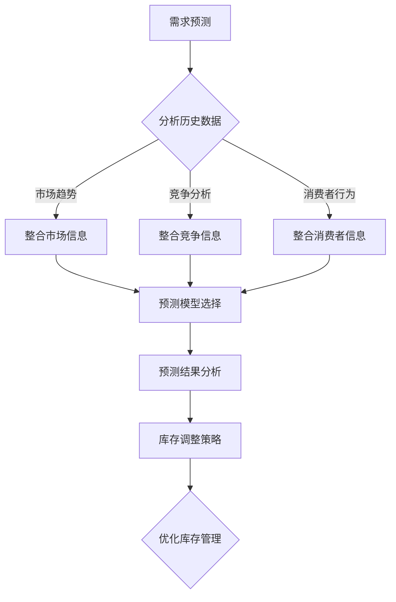

                 

关键词：需求预测、库存管理、优化策略、数据分析、机器学习、人工智能

> 摘要：本文将深入探讨需求预测在库存管理中的应用，通过分析现有问题，提出基于人工智能的优化策略，结合数学模型和实际案例，展示如何实现库存管理的有效优化。

## 1. 背景介绍

库存管理是企业管理中的重要环节，它直接关系到企业的成本控制和市场响应能力。传统的库存管理方法通常依赖于历史数据和统计模型，但在面对市场需求波动和产品生命周期变化时，往往难以精准预测未来需求，导致库存积压或供应短缺的问题。为了解决这一问题，需求预测技术逐渐成为库存管理领域的研究热点。

需求预测不仅仅是预测某个时间点或时间段的需求量，它涉及到对市场趋势、竞争对手行为、消费者偏好等多方面信息的整合和分析。准确的需求预测能够帮助企业优化库存水平，减少库存成本，提高库存周转率，从而增强市场竞争力。

## 2. 核心概念与联系

### 2.1 需求预测的基本概念

需求预测是指通过分析历史数据、市场趋势、竞争对手行为等多方面信息，对未来某一时间段内的产品需求进行预测。需求预测可以分为短期需求预测和长期需求预测，其中短期需求预测通常用于库存管理，长期需求预测则用于战略规划。

### 2.2 库存管理的基本概念

库存管理是指企业对库存的采购、存储、分发和监控等活动的管理。有效的库存管理需要平衡库存水平，避免库存积压和供应短缺，同时也要考虑库存成本和资金周转。

### 2.3 需求预测与库存管理的联系

需求预测与库存管理密不可分。准确的需求预测可以为企业提供决策依据，帮助制定采购、生产和配送策略，从而优化库存水平，降低库存成本。

### 2.4 Mermaid 流程图



## 3. 核心算法原理 & 具体操作步骤

### 3.1 算法原理概述

需求预测算法通常包括以下几种：

- 时间序列分析：通过分析时间序列数据来预测未来的需求。
- 机器学习：利用历史数据和统计模型进行预测，常见的算法有线性回归、决策树、神经网络等。
- 人工智能：通过深度学习等先进技术进行需求预测，如使用循环神经网络（RNN）或长短期记忆网络（LSTM）。

### 3.2 算法步骤详解

1. 数据收集：收集历史销售数据、市场趋势数据、消费者行为数据等。
2. 数据预处理：清洗数据，处理缺失值和异常值。
3. 特征工程：提取有用的特征，如季节性指标、价格敏感度等。
4. 模型选择：根据数据特性选择合适的预测模型。
5. 模型训练：使用历史数据对模型进行训练。
6. 预测：使用训练好的模型对未来需求进行预测。
7. 结果分析：对预测结果进行分析，制定库存调整策略。

### 3.3 算法优缺点

- 时间序列分析：简单易懂，但可能无法捕捉复杂的市场变化。
- 机器学习：能够处理复杂的数据关系，但可能需要大量数据。
- 人工智能：预测能力强大，但模型复杂，计算成本高。

### 3.4 算法应用领域

需求预测算法广泛应用于电子商务、制造业、物流等行业，能够帮助企业优化库存管理，提高运营效率。

## 4. 数学模型和公式

### 4.1 数学模型构建

需求预测的数学模型通常包括以下部分：

- 时间序列模型：如ARIMA模型、季节性ARIMA模型。
- 回归模型：如线性回归、多元回归。
- 机器学习模型：如决策树、随机森林、神经网络。

### 4.2 公式推导过程

以ARIMA模型为例，其公式推导如下：

$$
\begin{aligned}
X_t &= c + \phi_1 X_{t-1} + \phi_2 X_{t-2} + \cdots + \phi_p X_{t-p} \\
&\quad + \theta_1 \epsilon_{t-1} + \theta_2 \epsilon_{t-2} + \cdots + \theta_q \epsilon_{t-q} \\
\end{aligned}
$$

其中，$X_t$为时间序列数据，$\epsilon_t$为白噪声序列，$c$为常数项，$\phi_i$和$\theta_i$为参数。

### 4.3 案例分析与讲解

以某电商平台的商品需求预测为例，我们使用ARIMA模型进行预测。

1. 数据收集：收集过去一年的日销售数据。
2. 数据预处理：清洗数据，处理缺失值和异常值。
3. 特征工程：提取季节性指标，如月份、星期几等。
4. 模型选择：选择合适的ARIMA模型。
5. 模型训练：使用历史数据对模型进行训练。
6. 预测：使用训练好的模型预测未来30天的销售量。
7. 结果分析：对比预测值和实际值，评估模型效果。

## 5. 项目实践：代码实例和详细解释说明

### 5.1 开发环境搭建

- Python 3.8
- Pandas
- Statsmodels
- Matplotlib

### 5.2 源代码详细实现

```python
import pandas as pd
import numpy as np
from statsmodels.tsa.arima.model import ARIMA
import matplotlib.pyplot as plt

# 数据读取
sales_data = pd.read_csv('sales_data.csv')
sales_data['date'] = pd.to_datetime(sales_data['date'])
sales_data.set_index('date', inplace=True)

# 数据预处理
sales_data.fillna(method='ffill', inplace=True)

# 特征工程
sales_data['month'] = sales_data.index.month
sales_data['weekday'] = sales_data.index.dayofweek

# 模型训练
model = ARIMA(sales_data['sales'], order=(5, 1, 2))
model_fit = model.fit()

# 预测
predictions = model_fit.forecast(steps=30)

# 结果分析
plt.plot(sales_data['sales'], label='实际销售量')
plt.plot(predictions, label='预测销售量')
plt.legend()
plt.show()
```

### 5.3 代码解读与分析

上述代码首先读取销售数据，并进行预处理，提取月份和星期几等特征。然后使用ARIMA模型进行训练和预测，最后将预测结果可视化。

## 6. 实际应用场景

需求预测在库存管理中的应用非常广泛，以下是一些实际应用场景：

- 电子商务平台：通过预测商品需求，优化库存水平，减少库存积压。
- 制造业：通过预测原材料需求，合理安排生产计划，提高生产效率。
- 物流行业：通过预测货物需求，优化配送路线和运输计划，降低物流成本。

## 7. 工具和资源推荐

### 7.1 学习资源推荐

- 《统计学习方法》（李航）
- 《机器学习》（周志华）
- 《深度学习》（Ian Goodfellow）

### 7.2 开发工具推荐

- Jupyter Notebook
- Matplotlib
- Scikit-learn

### 7.3 相关论文推荐

- "Forecasting Using Regression and Time Series Models" by Shmuel S. Oren and Michael L. Cohen
- "A Long Short-Term Memory Neural Network Approach to Time Series Forecasting" by Soon Ong, Sinan Arslan, and Shu-Cherng Fang

## 8. 总结：未来发展趋势与挑战

### 8.1 研究成果总结

近年来，需求预测技术在库存管理中的应用取得了显著成果，通过结合时间序列分析、机器学习和人工智能技术，能够实现更准确的需求预测，优化库存管理。

### 8.2 未来发展趋势

未来，需求预测技术将继续向深度学习和人工智能方向发展，通过更复杂的模型和算法，实现更精准的预测。

### 8.3 面临的挑战

尽管需求预测技术取得了显著进展，但仍然面临一些挑战，如数据质量问题、模型解释性不足等。

### 8.4 研究展望

未来，研究应重点关注如何提高需求预测的准确性和解释性，同时降低计算成本，使需求预测技术更加实用。

## 9. 附录：常见问题与解答

### 9.1 什么是需求预测？

需求预测是指通过分析历史数据和相关信息，对未来某一时间段内的产品需求进行预测。

### 9.2 需求预测在库存管理中有哪些应用？

需求预测在库存管理中可以用于预测原材料需求、商品需求等，帮助企业优化库存水平，减少库存积压。

### 9.3 如何选择合适的预测模型？

选择合适的预测模型需要考虑数据的特性、预测目标的复杂度以及计算资源的限制等因素。

### 9.4 需求预测技术的未来发展方向是什么？

未来，需求预测技术将继续向深度学习和人工智能方向发展，通过更复杂的模型和算法，实现更精准的预测。

----------------------------------------------------------------

**作者：禅与计算机程序设计艺术 / Zen and the Art of Computer Programming**

